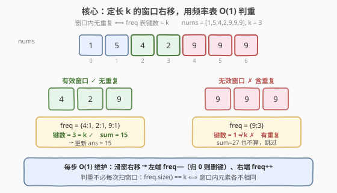
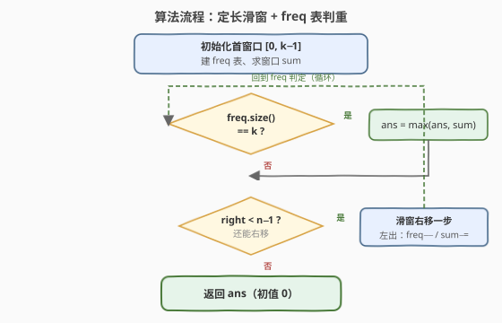

# LeetCode 长度为 K 子数组中的最大和 题解

## 1. 题目概述

- **标题 / 题号**：长度为 K 子数组中的最大和（#2461，medium）
- **链接**：https://leetcode.cn/problems/maximum-sum-of-distinct-subarrays-with-length-k/
- **难度**：中等
- **标签**：数组、哈希表、滑动窗口

**题意**：给你一个整数数组 `nums` 和一个整数 `k`。从 `nums` 中满足下述条件的全部子数组中找出最大子数组和：

- 子数组的长度是 `k`；
- 子数组中的所有元素**各不相同**。

返回满足条件的最大子数组和。如果不存在这样的子数组，返回 `0`。

**示例 1**：

```text
输入：nums = [1,5,4,2,9,9,9], k = 3
输出：15
解释：长度为 3 的子数组中：
- [1,5,4] 全不相同，和为 10
- [5,4,2] 全不相同，和为 11
- [4,2,9] 全不相同，和为 15 ← 最大
- [2,9,9] 含重复 9，不满足
- [9,9,9] 含重复 9，不满足
返回 15。
```

**示例 2**：

```text
输入：nums = [4,4,4], k = 3
输出：0
解释：唯一的长度 3 子数组 [4,4,4] 含重复，不存在满足条件的子数组，返回 0。
```

**约束**：

- $1 \le k \le \text{nums.length} \le 10^5$
- $1 \le \text{nums}[i] \le 10^5$

> 💡 两个约束合在一起恰好是「定长」+「判重」：长度固定为 $k$ 决定了用**定长滑动窗口**；元素各不相同决定了对窗口内元素做**频率计数**。两者都是 $O(1)$ 增量维护的，组合后整体仍是单趟 $O(n)$。

## 2. 解题思路

### 2.1 暴力思路：枚举每个长度为 k 的窗口再判重

最直白的做法：枚举每个起点 $i \in [0,\, n-k]$，取出子数组 $\text{nums}[i..i+k-1]$，把它放进一个集合检查大小是否为 $k$（无重复），若是则累加求和并更新答案：

```text
ans = 0
for i in 0..n-k:
    window = nums[i : i+k]
    if len(set(window)) == k:        # O(k) 判重
        ans = max(ans, sum(window))   # O(k) 求和
return ans
```

正确性没问题，但时间 $O(n \cdot k)$：当 $k \approx n/2$ 时退化为 $O(n^2)$，在 $n = 10^5$ 下必然超时。

> ⚠️ 暴力的浪费在于「相邻窗口高度重叠」：$\text{nums}[i..i+k-1]$ 与 $\text{nums}[i+1..i+k]$ 只差一个出、一个进，集合与和却从头重建。这正是滑动窗口增量维护能省下的部分。

### 2.2 核心观察：定长滑窗 + 频率表判重



**关键洞察**：维护一个长度恒为 $k$ 的窗口 $[\text{left},\, \text{right}]$（$\text{right} = \text{left}+k-1$），同步维护两份增量信息：

- **频率表 `freq`**：窗口内每个元素的出现次数；
- **窗口和 `sum`**：窗口内元素之和。

每窗口右移一格只需**一出一进**两个 $O(1)$ 操作：

| 操作 | 对 `freq` | 对 `sum` |
|------|-----------|-----------|
| 左端元素 $\text{nums}[\text{left}]$ 出窗 | `freq[x]−−`；若归 $0$ 则**删键** | `sum −= x` |
| 右端元素 $\text{nums}[\text{right}]$ 进窗 | `freq[y]++`；若原 $0$ 则**建键** | `sum += y` |

而「窗口内元素各不相同」等价于「频率表的**键数** $= k$」（$k$ 个槽全无重复当且仅当每个键的值都是 $1$）。于是判重从 $O(k)$ 扫描压缩为 $O(1)$ 的 `freq.size() == k`。

> 💡 **为什么是键数 = k 而不是「没有值 ≥ 2」？** 二者等价：窗口恒有 $k$ 个元素，键数 $= k$ 时每个键的值必为 $1$。用 `freq.size() == k` 直接读哈希表规模，比额外维护「重复元素计数」更省事——后者要在 `freq[x]` 由 $1$ 变 $2$ 时 `++dup`、由 $2$ 变 $1$ 时 `−−dup`，逻辑等价但易错。键数法天然免疫边界。

### 2.3 算法流程图



三段式流水：

1. **初始化首窗口** $[0,\, k-1]$：遍历前 $k$ 个元素建 `freq`、求 `sum`；若 `freq.size() == k` 用 `sum` 更新 `ans`；
2. **逐步右移**（$\text{right}$ 从 $k$ 到 $n-1$）：左端 $\text{nums}[\text{right}-k]$ 出窗、右端 $\text{nums}[\text{right}]$ 进窗，$O(1)$ 更新 `freq`/`sum`；若 `freq.size() == k` 更新 `ans`；
3. **返回** `ans`（初值 $0$，自然兜底「无满足窗口」）。

整个流程单趟扫描，`left`/`right` 各至多走 $n$ 步，哈希表操作均摊 $O(1)$。

### 2.4 示例演算

![示例演算：nums = [1,5,4,2,9,9,9], k = 3](../images/2461_example_walkthrough.svg)

以示例 1 `nums = [1,5,4,2,9,9,9]`，$k=3$ 为例：

| 步 | 窗口元素 | freq 表 | 键数 | 有效? | sum | ans |
|----|----------|---------|------|-------|-----|-----|
| 0 | [1, 5, 4] | {1:1, 5:1, 4:1} | 3 | ✓ | 10 | 10 |
| 1 | [5, 4, 2] | {5:1, 4:1, 2:1} | 3 | ✓ | 11 | 11 |
| 2 | [4, 2, 9] | {4:1, 2:1, 9:1} | 3 | ✓ | 15 | **15** |
| 3 | [2, 9, 9] | {2:1, 9:2} | 2 | ✗ | 20 | 15 |
| 4 | [9, 9, 9] | {9:3} | 1 | ✗ | 27 | 15 |

- 前 3 步窗口无重复，`ans` 一路涨到 $15$；
- 第 3 步右端进入第二个 $9$，`freq[9]` 由 $1$ 变 $2$，键数掉到 $2 < 3$，虽有 `sum=20` 但不更新；
- 第 4 步左端 $2$ 出窗删键、右端第三个 $9$ 进窗，`freq={9:3}`，键数 $1$，仍跳过；
- 最终 `ans = 15` ✓。

> 💡 注意第 3、4 步：**`sum` 必须照常维护**（左出减、右进加），只是「无效窗口的 `sum` 不参与 `ans` 更新」。若误在无效窗口跳过 `sum` 维护，后续窗口的 `sum` 就会全错。

## 3. 参考代码

### C++

```cpp
class Solution {
public:
    long long maximumSubarraySum(vector<int>& nums, int k) {
        unordered_map<int, int> freq;   // 元素 -> 窗口内出现次数
        long long sum = 0, ans = 0;

        for (int right = 0; right < (int)nums.size(); ++right) {
            // 右端进窗
            if (freq[nums[right]]++ == 0) ;   // 键数 +1（首次出现建键）
            sum += nums[right];

            // 窗口未满 k：继续扩；满了之后每步左端出窗
            if (right >= k) {
                if (--freq[nums[right - k]] == 0) freq.erase(nums[right - k]); // 键数 -1
                sum -= nums[right - k];
            }

            // 窗口长度恰为 k 时判重更新
            if (right >= k - 1 && (int)freq.size() == k) {
                ans = max(ans, sum);
            }
        }
        return ans;
    }
};
```

> 💡 用单重循环 + `right >= k` 触发左端出窗，把「建首窗口」与「滑动」合并到同一段代码，避免写两遍增量逻辑。`freq[nums[right]]++ == 0` 利用后置自增的原值判断「首次出现」；`--freq[x] == 0` 后 `erase` 保持键数精确，使 `freq.size()` 直接反映无重复元素个数。

### Python

```python
class Solution:
    def maximumSubarraySum(self, nums: List[int], k: int) -> int:
        freq = {}
        s = 0
        ans = 0
        for right, x in enumerate(nums):
            freq[x] = freq.get(x, 0) + 1   # 右端进窗
            s += x
            if right >= k:                 # 左端出窗
                y = nums[right - k]
                freq[y] -= 1
                if freq[y] == 0:
                    del freq[y]            # 键数归零删键
                s -= y
            if right >= k - 1 and len(freq) == k:
                ans = max(ans, s)
        return ans
```

> ⚠️ **`del freq[y]` 不可省**：若把值为 $0$ 的键留在字典里，`len(freq)` 会虚高，`len(freq) == k` 不再能判重。C++ 侧同理必须 `erase`。返回值用 `long long`/`int`：$n, \text{nums}[i] \le 10^5$，窗口和上界 $10^{10}$，超 32 位有符号整数范围，故 C++ 用 `long long`。

## 4. 复杂度分析

| 维度 | 复杂度 | 说明 |
|------|--------|------|
| **时间复杂度** | $O(n)$ | 单趟扫描，每元素一出一进共 $O(1)$ 次哈希操作（均摊 $O(1)$） |
| **空间复杂度** | $O(k)$ | `freq` 表至多存 $\min(k, \text{值域})$ 个键，即窗口大小 |
| 对照：暴力枚举 | $O(n \cdot k)$ / $O(k)$ | 每窗口重建集合 + 求和，$k \approx n/2$ 时退化 $O(n^2)$ |

> 💡 本题 $n \le 10^5$，$O(n \cdot k)$ 必超时，$O(n)$ 稳过。若值域较小（如 $\text{nums}[i] \le 10^5$），可用定长数组替代哈希表，配合一个 `distinct` 计数器进一步压常数，但哈希版本通用且足够。

## 5. 扩展：用「重复元素计数」替代键数判重

`freq.size() == k` 需要频繁 `erase`/`insert` 改变表规模。另一种等价写法是维护 `dup`（窗口内出现次数 $\ge 2$ 的元素个数），判重条件改为 `dup == 0`：

- 右端 `y` 进窗：`freq[y]++`；若 `freq[y] == 2` 则 `++dup`（从唯一变重复）；
- 左端 `x` 出窗：`freq[x]--`；若 `freq[x] == 1` 则 `--dup`（从重复变唯一）。

```cpp
if (freq[y]++ == 1) ++dup;        // 进窗后变 2：新增一个重复
// ...
if (freq[x]-- == 2) --dup;        // 出窗前是 2：消除一个重复
if (right >= k - 1 && dup == 0) ans = max(ans, sum);
```

**对比**：键数法读 `freq.size()`，删键/建键改表规模；`dup` 法只增减一个计数，不删键。两者均 $O(1)$，但 `dup` 法不依赖表的 `size()`，在某些哈希实现里常数更稳。本题两种写法等价，选其一即可；键数法代码更短、更不易错。

> 💡 这套「进窗判 `==2`、出窗判 `==1`」的 `dup` 计数与 [187 重复的 DNA 序列](../0181-0200/187_重复的DNA序列.md) 的定长滑窗判重、[219 存在重复元素 II](../0201-0300/219_存在重复元素II.md) 的变长滑窗判重是同一族套路。

## 6. 面试要点

1. **为什么想到滑动窗口？关键性质是什么？**

   > 题目要求「连续子数组」+「定长 $k$」——这两个条件正是定长滑动窗口的招牌。相邻窗口高度重叠（只差一个出、一个进），增量维护能把每窗口 $O(k)$ 的重建压到 $O(1)$，整体从 $O(n \cdot k)$ 降到 $O(n)$。

2. **「元素各不相同」如何 $O(1)$ 判定，而不必扫窗口？**

   > 用频率表 `freq` 记录窗口内每个元素的次数。窗口恒有 $k$ 个元素，「各不相同」$\iff$「每个元素恰好出现一次」$\iff$「`freq` 的键数 $= k$」。于是 `freq.size() == k` 一步完成判重。关键是出窗时值为 $0$ 的键必须删除，否则 `size()` 虚高。

3. **`sum` 为什么在无效窗口也要维护？**

   > `sum` 是窗口的固有属性，不论窗口是否满足「无重复」都要随窗口移动正确累加。无效窗口的 `sum` 不更新 `ans`，但它会延续到后续窗口——若跳过维护，下一个有效窗口的 `sum` 就会错。这是初学常踩的坑。

4. **`ans` 初值取 $0$ 是否总安全？**

   > 题目保证 $\text{nums}[i] \ge 1$，故任何有效窗口的 `sum` $\ge k \ge 1 > 0$。`ans` 初值 $0$ 恰好对应「无满足窗口返回 $0$」的题意，无需额外标记位。若元素可能为负或零，则需用 $-\infty$ 初值 + 末尾判空。

5. **C++ 为何用 `long long`，Python 不用管？**

   > 和上界 $10^5 \times 10^5 = 10^{10}$，超过 `int` 上界 $\approx 2.1 \times 10^9$，C++ 必须用 `long long` 防溢出。Python 整数任意精度，无此问题。这是定长滑窗求和题的通用注意点。

## 同类练习题

| # | 题目 | 与本题的关联 |
|---|------|-------------|
| 1852 | [每个子数组的数字种类数](https://leetcode.cn/problems/distinct-numbers-in-each-subarray/) | 同一定长滑窗 + 频率表，只是输出每个窗口的键数而非最大和，最直接的姊妹题 |
| 219 | [存在重复元素 II](https://leetcode.cn/problems/contains-duplicate-ii/)（[题解](../0201-0300/219_存在重复元素II.md)） | 变长滑窗 + 哈希查重，对照「定长」与「变长」两种窗口的判重写法 |
| 187 | [重复的 DNA 序列](https://leetcode.cn/problems/repeated-dna-sequences/)（[题解](../0181-0200/187_重复的DNA序列.md)） | 定长 $10$-mer 滑窗 + 哈希计数找重复，同族定长滑窗判重 |
| 438 | [找到字符串中所有字母异位词](https://leetcode.cn/problems/find-all-anagrams-in-a-string/)（[题解](../0401-0500/438_找到字符串中所有字母异位词.md)） | 定长滑窗 + 字符计数表匹配，对照「键数 $= k$」与「计数表相等」两种判据 |
| 643 | [子数组最大平均数 I](https://leetcode.cn/problems/maximum-average-subarray-i/)（[题解](../0601-0700/643_子数组最大平均数I.md)） | 定长滑窗求和取最大，去掉「判重」的退化版，承接增量维护 `sum` 的基础 |
