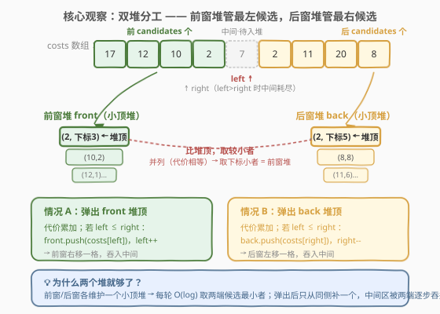
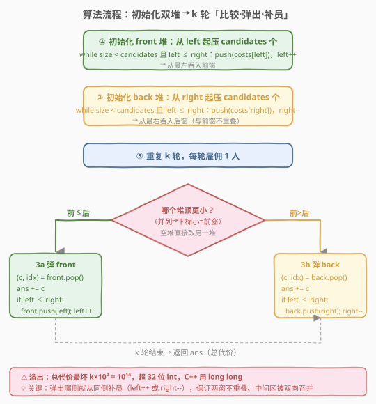
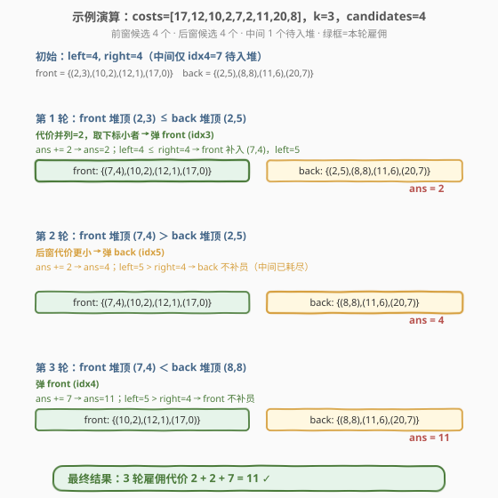

# 雇佣 K 名工人的总代价

- **题目名称**：雇佣 K 名工人的总代价
- **链接**：[2462. 雇佣 K 名工人的总代价](https://leetcode.cn/problems/total-cost-to-hire-k-workers/)
- **难度**：中等
- **标签**：数组、堆（优先队列）、双指针、模拟、贪心

## 1. 题目概述

给定长度为 $n$ 的 0 下标数组 `costs`，`costs[i]` 是雇佣第 $i$ 个工人的代价。再给定整数 $k$ 与 $candidates$，要恰好雇佣 $k$ 名工人。共进行 $k$ 轮，每轮雇佣恰好一人，规则如下：

1. 每轮从**剩余工人**中取**最前 $candidates$ 名**与**最后 $candidates$ 名**作为候选（不足则全取）。
2. 在候选里选**代价最小**者；并列时取**下标最小**者。
3. 被雇佣者从剩余工人中移除，后续不可再选。

返回恰好雇佣 $k$ 名工人的**总代价**。

**示例 1**：

```text
输入：costs = [17,12,10,2,7,2,11,20,8], k = 3, candidates = 4
输出：11
解释：
  初始 front 候选 [17,12,10,2]（下标 0-3），back 候选 [2,11,20,8]（下标 5-8）
  第 1 轮：两端最小都为 2，取下标小者 → 雇佣下标 3（代价 2），前窗右移吞入下标 4
  第 2 轮：后窗最小 2 → 雇佣下标 5（代价 2）
  第 3 轮：前窗最小 7 → 雇佣下标 4（代价 7）
  总代价 = 2 + 2 + 7 = 11
```

**示例 2**：

```text
输入：costs = [1,2,4,1], k = 3, candidates = 3
输出：4
解释：
  初始 front 候选 [1,2,4]（下标 0-2），back 候选 [1]（下标 3）
  第 1 轮：两端最小都为 1，取下标小者 → 雇佣下标 0（代价 1）
  第 2 轮：后窗最小 1 → 雇佣下标 3（代价 1）
  第 3 轮：后窗已空，取前窗最小 2 → 雇佣下标 1（代价 2）
  总代价 = 1 + 1 + 2 = 4
```

**约束条件**：

- $1 \leq n = \text{costs.length} \leq 10^5$
- $1 \leq \text{costs}[i] \leq 10^9$
- $1 \leq k \leq n$
- $1 \leq candidates \leq n$

> 💡 本题与 [2402. 会议室 III](../2401-2500/2402_会议室III.md) 同属「**双堆模拟**」招牌题：一个堆管前窗、一个堆管后窗，每轮取两端堆顶较小者，弹出后从同侧补员。区别在于会议室 III 的两个堆分工是「编号最小 / 结束最早」，而本题两个堆**完全对称**——都是取代价最小（并列取下标小），只是分管数组左右两端。

---

## 2. 解题思路

### 2.1 暴力思路：每轮扫描两端

每轮直接扫描剩余数组的前 $candidates$ 个与后 $candidates$ 个，找最小值并删除。问题在于 $k$ 轮每轮 $O(candidates)$，且删除操作若用数组需 $O(n)$ 移动，最坏 $O(k \cdot n)$ 达 $10^{10}$，超时。

> ⚠️ 暴力法的痛点是「每轮都要在两段定长窗口里重新找最小」。其实**两端窗口是单调推进的**——前窗只向右扩、后窗只向左扩，且每轮只从一端弹出一个。这正是**优先队列（小顶堆）**维护动态窗口最小值的经典场景。

### 2.2 核心观察：双堆分工



关键洞察是用**两个小顶堆**分别承载数组两端候选窗口：

1. **前窗堆 `front`**（存 `(cost, idx)`）：维护**最前 $candidates$ 名**剩余工人，堆顶即前窗代价最小者（并列时下标也最小）。
2. **后窗堆 `back`**（存 `(cost, idx)`）：维护**最后 $candidates$ 名**剩余工人，堆顶即后窗代价最小者。

每轮比较两堆堆顶，取**代价较小者**雇佣；**并列时取下标小者**（恒为前窗，见下文不变式）。雇佣后从**同侧**补入一名新工人（`left++` 或 `right--`），保证窗口大小不缩、两端不重叠。

> 💡 **关键不变式：前窗下标恒小于后窗下标。** 初始化时前窗从 `left=0` 向右压入、后窗从 `right=n-1` 向左压入，中间用 `left ≤ right` 守卫避免重复压入同一工人。补员同理：弹前窗则 `left++`（向右吞中间区），弹后窗则 `right--`（向左吞中间区）。由于两端相向而行、永不相撞后重叠，**前窗元素下标始终严格小于后窗元素下标**。因此并列（代价相等）时下标小者必在前窗堆中，比较 `front.top() ≤ back.top()` 即可正确裁决——无需额外处理并列。

### 2.3 算法流程图



**完整步骤**：

1. 初始化指针 `left = 0`、`right = n - 1`（指向尚未入堆的工人）。
2. **初始化前窗堆**：循环 $candidates$ 次，只要 `left ≤ right` 就把 `(costs[left], left)` 压入 `front`，`left++`。
3. **初始化后窗堆**：循环 $candidates$ 次，只要 `left ≤ right` 就把 `(costs[right], right)` 压入 `back`，`right--`。
4. 重复 $k$ 轮，每轮：
   - 若 `front` 空（已耗尽）：弹 `back` 堆顶。
   - 否则若 `back` 空：弹 `front` 堆顶。
   - 否则若 `front.top() ≤ back.top()`：弹 `front` 堆顶。
   - 否则：弹 `back` 堆顶。
   - 把弹出者代价累加进 `ans`。
   - **同侧补员**：若弹的是 `front` 且 `left ≤ right`：压入 `(costs[left], left)`，`left++`；若弹的是 `back` 且 `left ≤ right`：压入 `(costs[right], right)`，`right--`。
5. 返回 `ans`。

> ⚠️ **空堆处理**：当 $2 \cdot candidates \geq n$ 时，初始化会把全部工人塞进一个堆（另一个为空）；或运行中一端先耗尽。此时直接弹非空堆即可，且 `left > right` 故无需补员。代码用「先判空、再比堆顶」的分支兜住。

> ⚠️ **溢出**：总代价最坏 $k \times \max(\text{costs}) = 10^5 \times 10^9 = 10^{14}$，超出 32 位 `int`（$\approx 2.1 \times 10^9$）。C++ 中 `ans` 须用 `long long`；Python 无此问题。

### 2.4 示例演算

以示例 1 `costs = [17,12,10,2,7,2,11,20,8], k = 3, candidates = 4` 为例：



| 轮次 | 比较 | 雇佣 | ans | 补员 | left/right |
|------|------|------|-----|------|-----------|
| 初始 | — | — | 0 | front←idx0-3，back←idx5-8 | left=4, right=4 |
| 1 | front(2,3) ≤ back(2,5) | idx3，代价 2 | 2 | front 补 idx4(7) | left=5, right=4 |
| 2 | front(7,4) ＞ back(2,5) | idx5，代价 2 | 4 | left>right 不补 | left=5, right=4 |
| 3 | front(7,4) ＜ back(8,8) | idx4，代价 7 | 11 | left>right 不补 | left=5, right=4 |

最终 `ans = 11` ✓

> 💡 **第 1 轮的并列裁决是关键**：两端堆顶代价均为 2（下标 3 与 5）。由不变式「前窗下标恒小」，`front.top() = (2,3) ≤ back.top() = (2,5)` 成立（元组字典序：代价相等时比下标），故弹前窗——与题目「并列取下标小者」一致。这正是堆里存 `(cost, idx)` 而非只存 `cost` 的妙处：**元组自然把并列裁决交给堆比较函数**。

---

## 3. 参考代码

### C++

```cpp
class Solution {
  public:
    long long totalCost(vector<int>& costs, int k, int candidates) {
        int n = costs.size();
        // 小顶堆：(代价, 下标)
        priority_queue<pair<int, int>, vector<pair<int, int>>, greater<>> front, back;
        int left = 0, right = n - 1;

        // 初始化前窗堆
        for (int i = 0; i < candidates && left <= right; i++) {
            front.push({costs[left], left});
            left++;
        }
        // 初始化后窗堆
        for (int i = 0; i < candidates && left <= right; i++) {
            back.push({costs[right], right});
            right--;
        }

        long long ans = 0;
        for (int s = 0; s < k; s++) {
            bool use_front;
            if (front.empty()) use_front = false;          // 前窗耗尽
            else if (back.empty()) use_front = true;       // 后窗耗尽
            else use_front = (front.top() <= back.top());   // 含并列取下标小者（=前窗）

            if (use_front) {
                auto [c, idx] = front.top();
                front.pop();
                ans += c;
                if (left <= right) {                        // 同侧补员
                    front.push({costs[left], left});
                    left++;
                }
            } else {
                auto [c, idx] = back.top();
                back.pop();
                ans += c;
                if (left <= right) {
                    back.push({costs[right], right});
                    right--;
                }
            }
        }
        return ans;
    }
};
```

### Python

```python
class Solution:
    def totalCost(self, costs: List[int], k: int, candidates: int) -> int:
        n = len(costs)
        front, back = [], []        # 小顶堆：(cost, idx)
        left, right = 0, n - 1

        # 初始化前窗堆
        for _ in range(candidates):
            if left <= right:
                heapq.heappush(front, (costs[left], left))
                left += 1
        # 初始化后窗堆
        for _ in range(candidates):
            if left <= right:
                heapq.heappush(back, (costs[right], right))
                right -= 1

        ans = 0
        for _ in range(k):
            if not front:
                use_front = False                 # 前窗耗尽
            elif not back:
                use_front = True                   # 后窗耗尽
            else:
                use_front = front[0] <= back[0]    # 并列→下标小者在 front

            if use_front:
                c, _ = heapq.heappop(front)
                ans += c
                if left <= right:                  # 同侧补员
                    heapq.heappush(front, (costs[left], left))
                    left += 1
            else:
                c, _ = heapq.heappop(back)
                ans += c
                if left <= right:
                    heapq.heappush(back, (costs[right], right))
                    right -= 1
        return ans
```

> ⚠️ Python 的 `heapq` 是小顶堆，元组按字典序比较——`(cost, idx)` 自动先比 `cost` 再比 `idx`，与题目「并列取下标小者」完全吻合。C++ 用 `greater<pair<int,int>>` 达到相同效果。**关键**：弹出哪侧就从同侧补员（`left++` 或 `right--`），不要交叉补，否则会破坏「前窗下标恒小」的不变式导致并列裁决出错。

---

## 4. 复杂度分析

| 维度 | 复杂度 | 说明 |
|------|--------|------|
| 时间复杂度 | $O((n + k) \log (\text{candidates}))$ | 初始化压入至多 $2 \cdot \text{candidates}$ 个元素 $O(n? \log c)$；$k$ 轮每轮至多 1 弹 1 压，单次 $O(\log c)$ |
| 空间复杂度 | $O(\text{candidates})$ | 两个堆大小之和不超过 $2 \cdot \text{candidates}$（补员即时填充，堆大小恒定） |

> 💡 $n, k \leq 10^5$，$candidates$ 可达 $n$。堆操作量级 $O((n+k) \log n) \approx 2\times10^5 \times 17 \approx 3.4\times10^6$，轻松通过。注意堆大小**始终不超过 $2 \cdot candidates$**：初始化两堆各至多 $candidates$ 个；运行中每弹一个就补一个（补到 `left>right` 为止），故堆大小单调不增——这是「即时补员」而非「预压全部」的优势，空间只有 $O(candidates)$ 而非 $O(n)$。

---

## 5. 扩展：若 $candidates \geq n$ 会怎样？

当 $2 \cdot candidates \geq n$ 时，初始化阶段前窗堆会从 `left=0` 一路压到与 `right` 相撞，把大部分甚至全部工人塞进 `front`，后窗堆可能为空。此时算法退化为「单堆选 $k$ 小」：

- 每轮只弹 `front`（`back` 为空走 `back.empty()` 分支），`left > right` 不补员。
- 本质等价于 [703. 数据流中的第 K 大元素](https://leetcode.cn/problems/kth-largest-element-in-a-stream/) 的反向——**选 $k$ 小**，且并列按下标升序选。
- 因堆里存 `(cost, idx)`，`front.top()` 自然给出「代价最小、并列下标最小」，与题目规则一致，**无需特判**。

> 💡 这正是代码里「先判空、再比堆顶」分支的兜底价值：无论窗口是否重叠、哪端先耗尽，逻辑统一，不漏一种边界。

---

## 6. 面试要点

1. **为什么用两个堆？各自存什么？**

   - `front` 存前 $candidates$ 名剩余工人（小顶堆），保证取到前窗**代价最小**者。
   - `back` 存后 $candidates$ 名剩余工人（小顶堆），保证取到后窗**代价最小**者。
   - 两堆分工：一个管「左侧窗口」、一个管「右侧窗口」，避免每轮扫描两段定长区间。

2. **并列（代价相等）时怎么保证取下标小者？需要额外处理吗？**

   - 不需要。堆里存 `(cost, idx)` 元组，小顶堆按字典序比较——代价相等时自动按下标升序，堆顶即下标小者。
   - 配合不变式「前窗下标恒小于后窗下标」，并列时下标小者必在前窗，故比较 `front.top() ≤ back.top()` 即正确裁决。

3. **为什么补员必须从同侧？交叉补会怎样？**

   - 弹前窗意味着「前窗少了一格」，需从中间区右端（`left`）补一名维持窗口大小；弹后窗同理从中间区左端（`right`）补。
   - 若交叉补（弹前窗却补 `right`），会破坏「前窗下标恒小」的不变式——后窗元素可能混进前窗，并列裁决失去依据，下标小者可能错落在两堆间。

4. **初始化时如何避免同一工人被压入两个堆？**

   - 用 `left ≤ right` 守卫：前窗从 `left=0` 向右压，每压一个 `left++`；后窗从 `right=n-1` 向左压，每压一个 `right--`。两端相向而行，`left` 超过 `right` 即停止，**每个下标至多被压一次**。

5. **总代价为什么可能溢出？怎么防？**

   - 最坏 $k = n = 10^5$、每个 $\text{costs}[i] = 10^9$，总代价 $10^{14}$，超 32 位 `int`（$\approx 2.1 \times 10^9$）。
   - C++ 用 `long long` 累加；Python 整数无限精度无此问题。

> 💡 **一句话总结**：本题是「双堆模拟」的对称版招牌——前窗堆、后窗堆各管一端候选窗口，每轮取两端堆顶较小者（并列按元组下标裁决），弹出后从同侧补员维持窗口。与 [2402. 会议室 III](../2401-2500/2402_会议室III.md) 的「空闲堆 / 占用堆」非对称分工形成对照，与 [1882. 使用服务器处理任务](https://leetcode.cn/problems/process-tasks-using-servers/) 的双堆结构几乎同构。

---

## 7. 同类练习题

- [2402. 会议室 III](../2401-2500/2402_会议室III.md)：双堆模拟的「非对称分工」版（空闲堆管编号、占用堆管结束时间），与本题对称双堆形成对照
- [1882. 使用服务器处理任务](https://leetcode.cn/problems/process-tasks-using-servers/)：空闲服务器堆 + 任务执行堆的双堆模拟，结构与本题几乎同构
- [502. IPO](../0501-0600/502_IPO.md)：排序 + 大顶堆贪心选最大利润，同属「排序建立单调性 + 堆高效选择」范式
- [703. 数据流中的第 K 大元素](https://leetcode.cn/problems/kth-largest-element-in-a-stream/)：固定大小堆维护动态 Top-K，是本题 $candidates \geq n$ 退化时的单堆骨架
- [253. 会议室 II](https://leetcode.cn/problems/meeting-rooms-ii/)：单堆统计同时占用峰值，与双堆模拟形成「统计型 vs 模拟型」对照
