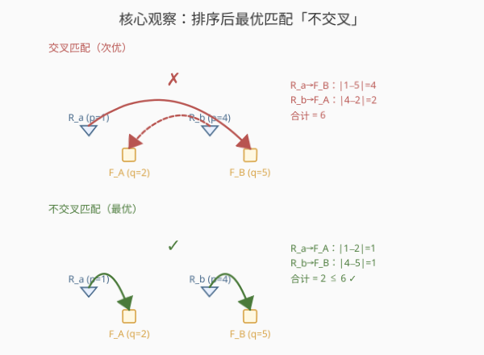
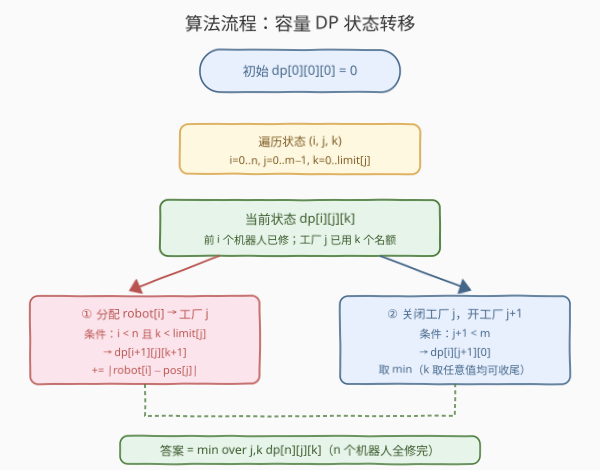

# 最小移动总距离

- **题目名称**：最小移动总距离
- **链接**：[2463. 最小移动总距离](https://leetcode.cn/problems/minimum-total-distance-traveled/)
- **难度**：困难
- **标签**：数组、动态规划、排序、贪心

## 1. 题目概述

X 轴上有一些机器人和工厂。`robot[i]` 是第 $i$ 个机器人的位置；`factory[j] = [position_j, limit_j]` 表示第 $j$ 个工厂在 $position_j$，最多修 $limit_j$ 个机器人。机器人位置互不相同，工厂位置也互不相同（但机器人与工厂可能重合）。

机器人初始都坏了，会沿设定方向（正/负 X 方向）一直移动；当它经过一个**未达上限**的工厂时，该工厂修好它并令其停止。你可在**任意时刻**设置**部分**机器人的方向，目标是**最小化所有机器人移动的总距离**。返回该最小总距离。

**示例 1**：

```text
输入：robot = [0,4,6], factory = [[2,2],[6,2]]
输出：4
解释：r0(0)→正向→F0(2)；r1(4)→负向→F0(2)；r2(6) 原地被 F1(6) 修。
      总距离 = |2−0| + |2−4| + |6−6| = 4。
```

**示例 2**：

```text
输入：robot = [1,-1], factory = [[-2,1],[2,1]]
输出：2
解释：r0(1)→正向→F1(2)；r1(−1)→负向→F0(−2)。
      总距离 = |2−1| + |(−2)−(−1)| = 2。
```

**约束条件**：

- $1 \le \text{robot.length},\ \text{factory.length} \le 100$
- $\text{factory}[j].\text{length} = 2$
- $-10^9 \le \text{robot}[i],\ position_j \le 10^9$
- $0 \le limit_j \le \text{robot.length}$
- 数据保证所有机器人都能被维修

> 💡 关键观察：每个机器人的实际移动距离只取决于「它最终被哪个工厂修」——即 $|p_{\text{robot}} - p_{\text{factory}}|$，与方向、时机无关。于是问题归约为：**给每个机器人分配一个工厂（受各工厂上限约束），最小化 $\sum|\text{距离}|$**。

---

## 2. 解题思路

### 2.1 暴力思路：枚举每个机器人的去向

每个机器人可去任一有余量的工厂，组合数随 $n$ 指数增长，$n=100$ 时完全不可行。

> ⚠️ 瓶颈在于「哪个机器人去哪个工厂」的指派空间巨大。但距离只由配对决定——这是一类**带容量约束的最优指派问题**，在一维直线上有结构可挖。

### 2.2 核心观察：排序 + 不交叉匹配 + 容量 DP



**第一步：排序。** 把机器人按位置升序、工厂按位置升序排列。下面位置均指排序后。

**第二步：不交叉引理（交换论证）。** 设在某个最优解中，机器人 $a$（位置 $p_a$）去工厂 $F$（$q_F$），机器人 $b$（$p_b > p_a$）去工厂 $G$（$q_G < q_F$）——这是一对**交叉**配对。把它们**交换**：$a\to G,\ b\to F$。

$$
\underbrace{|p_a - q_F| + |p_b - q_G|}_{\text{旧（交叉）}} \quad\ge\quad \underbrace{|p_a - q_G| + |p_b - q_F|}_{\text{新（不交叉）}}
$$

由绝对值的 **Monge 性质**（四边形不等式）：当 $p_a \le p_b$ 且 $q_G \le q_F$ 时，不交叉配对必不劣于交叉配对。因此**反复消去交叉**不会让总距离变大，故必存在一个**不交叉的最优指派**——即「按位置排序的机器人」与「按位置排序的工厂槽位」**单调对应**。

> 💡 直觉：交叉意味着「远的跑去远处、近的反而跑更远」，拆掉交叉让每个人都更就近，自然更省。这与 [2410. 运动员和训练师的最大匹配数](../2401-2500/2410_运动员和训练师的最大匹配数.md) 同属「排序后单调匹配」家族。

**第三步：可行性能否保证？** 任何不交叉指派都可实现：从最左工厂起逐个交付——其分配到的机器人是排序后最左的连续一段，左侧去的人向右走到它即停（不经过任何未满工厂），右侧去的人向左走（背离所有更右的工厂）；待它修满后再启动下一批。由于「任意时刻可设方向、机器人互不阻挡」，时间上可串行化，被途经的更左工厂早已修满，不会误抓。故**最小总距离 = 最小费用不交叉匹配**。

**第四步：容量 DP。** 不交叉性让我们只需按顺序决策，但要跟踪每个工厂已用名额。定义状态：

$$
\textit{dp}[i][j][k] = \text{前 } i \text{ 个机器人已修完、当前在工厂 } j \text{（0 下标）、该厂已用 } k \text{ 个名额时的最小总距离}
$$

其中 $0 \le k \le limit_j$。两条转移：

1. **分配**：把机器人 $i$（0 下标，即第 $i+1$ 个）交给工厂 $j$——要求 $i < n$ 且 $k < limit_j$：

$$
\textit{dp}[i+1][j][k+1] \;=\; \min\bigl(\textit{dp}[i+1][j][k+1],\ \textit{dp}[i][j][k] + |p_i - q_j|\bigr)
$$

2. **关闭工厂**：工厂 $j$ 收尾（无论已用多少），跳到工厂 $j+1$，名额清零——要求 $j+1 < m$：

$$
\textit{dp}[i][j+1][0] \;=\; \min\bigl(\textit{dp}[i][j+1][0],\ \min_{k}\textit{dp}[i][j][k]\bigr)
$$

> ⚠️ 「关闭」是把工厂 $j$ 各 $k$ 取值的**最优**下传给工厂 $j+1$ 的 $k=0$：工厂用几个都行，只要没更优就用最省的那条路径接着往后走。

**边界**：$\textit{dp}[0][0][0] = 0$，其余为 $+\infty$。
**答案**：$\min_{j,\,k} \textit{dp}[n][j][k]$（$n$ 个机器人全修完）。

### 2.3 算法流程图



骨架三步：

1. **排序**机器人升序、工厂按位置升序；
2. **三重循环** $i=0\ldots n,\ j=0\ldots m{-}1,\ k=0\ldots limit_j$：对每个有限值状态执行「分配」与「关闭工厂」两条转移；
3. **返回** $\min_{j,k}\textit{dp}[n][j][k]$。

> 💡 **迭代顺序**：外层 $i$、中层 $j$、内层 $k$。「分配」写到 $(i{+}1,j,k{+}1)$（下一轮 $i$ 才读），「关闭」写到 $(i,j{+}1,0)$（同 $i$ 后续 $j$ 才读）——故按此顺序遍历时，被读状态均已就绪，无后效性问题。

### 2.4 示例演算

![示例演算：robot=[0,4,6], factory=[[2,2],[6,2]]](../images/mtdr_example_walkthrough.svg)

以示例 1 为例，排序后 $\text{robot}=[0,4,6]$、$\text{factory}=[(2,2),(6,2)]$。最优决策路径如下（每步标出转移与累计代价）：

| 状态 | 值 | 转移 | 说明 |
|------|----|------|------|
| $(0,0,0)$ | $0$ | 起点 | 0 个机器人修完，工厂 0 用 0 名额 |
| $(1,0,1)$ | $2$ | 分配 r0→F0，$+\lvert0{-}2\rvert{=}2$ | r0 就近去 F0 |
| $(2,0,2)$ | $4$ | 分配 r1→F0，$+\lvert4{-}2\rvert{=}2$ | r1 也去 F0，F0 用满 2 |
| $(2,1,0)$ | $4$ | 关闭 F0，开 F1（$+0$） | F0 修满，转 F1 |
| $(3,1,1)$ | $4$ | 分配 r2→F1，$+\lvert6{-}6\rvert{=}0$ | r2 原地被 F1 修 |

终点 $\textit{dp}[3][1][1]=4$ 即答案 ✓。注意 r2 被分配给 F1（位置 6，与 r2 同点），距离为 0——这正是「就近原则」的体现：更近的 F0 已被 r0、r1 占满，r2 只能去 F1。

---

## 3. 参考代码

### C++

```cpp
class Solution {
public:
    long long minimumTotalDistance(vector<int>& robot, vector<vector<int>>& factory) {
        sort(robot.begin(), robot.end());
        sort(factory.begin(), factory.end());
        int n = robot.size(), m = factory.size();
        const long long INF = (long long)4e18;
        // dp[i][j][k]：前 i 个机器人已修；当前工厂 j 已用 k 名额
        vector<vector<vector<long long>>> dp(n + 1, vector<vector<long long>>(m));
        for (int i = 0; i <= n; ++i)
            for (int j = 0; j < m; ++j)
                dp[i][j].assign(factory[j][1] + 1, INF);
        dp[0][0][0] = 0;

        for (int i = 0; i <= n; ++i) {
            for (int j = 0; j < m; ++j) {
                int L = factory[j][1];
                for (int k = 0; k <= L; ++k) {
                    long long cur = dp[i][j][k];
                    if (cur >= INF) continue;                       // 不可达状态跳过
                    // 转移②：关闭工厂 j → 开工厂 j+1（k 取最优下传）
                    if (j + 1 < m && cur < dp[i][j + 1][0])
                        dp[i][j + 1][0] = cur;
                    // 转移①：分配 robot[i] 给工厂 j
                    if (i < n && k < L) {
                        long long cost = llabs((long long)robot[i] - factory[j][0]);
                        if (cur + cost < dp[i + 1][j][k + 1])
                            dp[i + 1][j][k + 1] = cur + cost;
                    }
                }
            }
        }
        long long ans = INF;
        for (int j = 0; j < m; ++j)
            for (int k = 0; k <= factory[j][1]; ++k)
                ans = min(ans, dp[n][j][k]);
        return ans;
    }
};
```

> 💡 **INF 取 $4\times10^{18}$**：最大答案约 $n \times 2\times10^9 = 2\times10^{11}$，远小于 INF；而 `cur + cost` 只在 `cur < INF` 时执行，不溢出（`long long` 上限 $\approx 9.2\times10^{18}$）。`llabs` 对 `long long` 取绝对值，避免 `int` 作差在边界处溢出。

### Python

```python
class Solution:
    def minimumTotalDistance(self, robot: List[int], factory: List[List[int]]) -> int:
        robot.sort()
        factory.sort(key=lambda x: x[0])
        n, m = len(robot), len(factory)
        INF = 10 ** 18
        # dp[i][j][k]：前 i 个机器人已修；工厂 j 已用 k 名额
        dp = [[[INF] * (factory[j][1] + 1) for j in range(m)] for _ in range(n + 1)]
        dp[0][0][0] = 0

        for i in range(n + 1):
            for j in range(m):
                L = factory[j][1]
                for k in range(L + 1):
                    cur = dp[i][j][k]
                    if cur >= INF:
                        continue
                    # 转移②：关闭工厂 j → 开工厂 j+1
                    if j + 1 < m and cur < dp[i][j + 1][0]:
                        dp[i][j + 1][0] = cur
                    # 转移①：分配 robot[i] 给工厂 j
                    if i < n and k < L:
                        cost = abs(robot[i] - factory[j][0])
                        nxt = cur + cost
                        if nxt < dp[i + 1][j][k + 1]:
                            dp[i + 1][j][k + 1] = nxt

        return min(dp[n][j][k] for j in range(m) for k in range(factory[j][1] + 1))
```

> 💡 Python 用整数 `INF = 10**18` 而非 `float('inf')`，使全程保持 `int`，最后 `min` 直接返回整数；位置作差 Python 自动用大整数，无溢出之忧。

---

## 4. 复杂度分析

| 维度 | 复杂度 | 说明 |
|------|--------|------|
| **时间复杂度** | $O\bigl(n \cdot (S + m)\bigr)$ | $S = \sum_j limit_j$ 为总维修名额；每个状态 $(i,j,k)$ 做 $O(1)$ 两条转移；$S \le n\cdot m \le 10^4$，$n\le100$，约 $10^6$ 次运算 |
| **空间复杂度** | $O\bigl(n \cdot (S + m)\bigr)$ | 三维表，约 $10^6$ 个 `long long`（$\approx 8\,\text{MB}$）；可滚动压到 $O(S+m)$ |
| 对照：暴力枚举 | $O(m^n)$ | 每机器人独立选工厂，指数爆炸 |

> 💡 $limit_j \le n$ 且 $m \le 100$ 是刻意留出的 DP 甜区：状态规模 $n \times \sum limit \le 100 \times 10^4 = 10^6$，毫秒级可解。若 $n,m$ 升至 $10^5$，则需改用**带容量最小费用匹配**（费用流 / KM）等更重结构。

---

## 5. 扩展：工厂克隆 + 二维 DP

三维状态里第三维 $k$ 仅用于「记住当前工厂用了几个」。可换一种等价建模——**把每个工厂按上限克隆成若干个同位置槽位**，于是「每厂用 $\le limit$ 个」化为「每槽位用 $\le 1$ 个」，问题塌缩成经典的**有序指派二维 DP**（与 [72. 编辑距离](../0001-0100/72_编辑距离.md) / [1143. 最长公共子序列](../1101-1200/1143_最长公共子序列.md) 同骨架）。

构造槽位序列 `slots`：工厂 $j$（位置 $q_j$、上限 $L_j$）展开为 $L_j$ 个 $q_j$。因工厂已按位置排序，`slots` 自然非降。定义：

$$
\textit{dp}_2[i][j] = \text{前 } i \text{ 个机器人分配给前 } j \text{ 个槽位的最小总距离}
$$

$$
\textit{dp}_2[i][j] = \min\bigl(\underbrace{\textit{dp}_2[i][j-1]}_{\text{跳过槽位 }j},\ \underbrace{\textit{dp}_2[i-1][j-1] + |p_{i-1} - slot_{j-1}|}_{\text{机器人 } i \text{ 用槽位 } j}\bigr)
$$

边界 $\textit{dp}_2[0][j] = 0$（0 机器人零代价）、$\textit{dp}_2[i][0] = +\infty\ (i>0)$（无槽位）。答案 $\textit{dp}_2[n][S]$。

```cpp
// 工厂克隆 + 二维 DP（空间可滚动至 O(S)）
sort(robot.begin(), robot.end());
sort(factory.begin(), factory.end());
vector<long long> slots;
for (auto& f : factory)
    for (int t = 0; t < f[1]; ++t) slots.push_back(f[0]);
int n = robot.size(), S = slots.size();
const long long INF = (long long)4e18;
vector<vector<long long>> dp(n + 1, vector<long long>(S + 1, INF));
for (int j = 0; j <= S; ++j) dp[0][j] = 0;
for (int i = 1; i <= n; ++i)
    for (int j = 1; j <= S; ++j)
        dp[i][j] = min(dp[i][j - 1],
                       dp[i - 1][j - 1] + llabs(robot[i - 1] - slots[j - 1]));
return dp[n][S];
```

> 💡 **与三维版的关系**：克隆版把「工厂 $j$ 用了 $k$ 个」隐式编码进「槽位下标 $j$」——同一工厂的连续若干槽位位于同一段，DP 走到该段内第 $k$ 个即等价于三维里的 $k$。时间同为 $O(n\cdot S)$，但代码更短、转移更直观，是「用空间换结构清晰度」的典型简化。

---

## 6. 面试要点

1. **为什么可以排序？不交叉性质怎么证？**

   > 排序后，若存在交叉配对 $(p_a\to q_F,\ p_b\to q_G)$（$p_a<p_b,\ q_G<q_F$），交换为 $(p_a\to q_G,\ p_b\to q_F)$，由绝对值的 Monge 性质新代价 $\le$ 旧代价。反复消去交叉得单调最优指派，故排序不丢失最优性。

2. **「关闭工厂」转移为什么是对所有 $k$ 取 min？**

   > 工厂 $j$ 用几个名额（$0\ldots L_j$）都合法，无所谓具体几个——只要后续从工厂 $j+1$ 重新起算即可。故把 $\min_k \textit{dp}[i][j][k]$ 整体下传给 $\textit{dp}[i][j{+}1][0]$，表示「$j$ 用最优用量收尾，接力到 $j{+}1$」。

3. **机器人途经别的工厂会被误抓吗？如何保证可行？**

   > 不会。任意时刻可设方向、机器人互不阻挡，故可**串行化**：先让最左工厂修满（其机器人是排序后最左一段，向右者走到它即停、向左者背离所有更右工厂），再启动下一批。被途经的更左工厂此时已满，不会误抓。因此任何不交叉指派都可实现。

4. **为什么用 `llabs` / `long long` 作差？**

   > 位置范围 $[-10^9, 10^9]$，作差最大 $2\times10^9$，已逼近 `int` 上限 $2.147\times10^9$，再用 `int` 累加必溢出。统一提升到 `long long` 并用 `llabs`，安全且无需额外判号。

5. **若 $n,m$ 很大（如 $10^5$）怎么办？**

   > 三维 DP 的 $O(n\cdot S)$ 会爆。此时改建模为**带容量约束的最小费用流**（工厂拆点 + 容量 $limit$ + 费用 $|p-q|$）或二分图最小权匹配的 KM/匈牙利变种；一维排序 + 贪心不再足够，需借助网络流结构。

> 💡 **一句话总结**：排序后最优指派必不交叉 → 容量 DP，状态 $\textit{dp}[i][j][k]$ 记前 $i$ 机器人、工厂 $j$ 已用 $k$ 名额，两转移「分配 $(i{+}1,j,k{+}1)$」「关闭工厂 $(i,j{+}1,0)$」取 min，答案 $\min_{j,k}\textit{dp}[n][j][k]$。$O(n\cdot S)$ 时空，$S=\sum limit$。

---

## 7. 同类练习题

- [2410. 运动员和训练师的最大匹配数](https://leetcode.cn/problems/maximum-matching-of-players-with-trainers/)（[题解](2410_运动员和训练师的最大匹配数.md)）：同为「排序 + 单调匹配」家族，但只求匹配数（贪心双指针即可），对照本题在匹配数基础上再加「容量 + 最小距离」的 DP 维度
- [881. 救生艇](https://leetcode.cn/problems/boats-to-save-people/)（[题解](../0801-0900/881_救生艇.md)）：排序 + 贪心处理「每船容量上限」的最优配对，对照「容量约束」在贪心可解 vs 须 DP 的边界
- [410. 分割数组的最大值](https://leetcode.cn/problems/split-array-largest-sum/)（[题解](../0401-0500/410_分割数组的最大值.md)）：把序列分成若干「容量受限」段的最优化，对照「分段 + 容量」的 DP/二分答案两种视角
- [72. 编辑距离](https://leetcode.cn/problems/edit-distance/)（[题解](../0001-0100/72_编辑距离.md)）：经典有序指派二维 DP（$\min(\text{跳过}, \text{配对})$），克隆版本题即其同骨架——把工厂克隆后转移形式完全一致
- [1143. 最长公共子序列](https://leetcode.cn/problems/longest-common-subsequence/)（[题解](../1101-1200/1143_最长公共子序列.md)）：二维 $\min/\max$ 有序配对 DP 的另一招牌，对照「不交叉配对 DP」在不同目标（求最小代价 / 最长长度）下的统一框架
