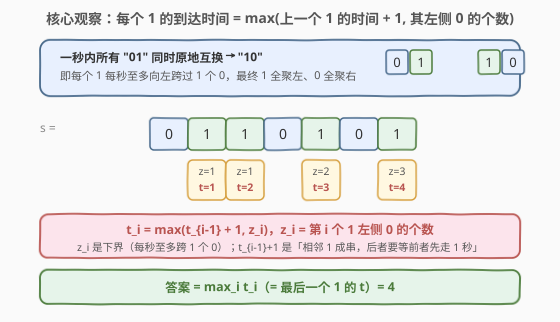
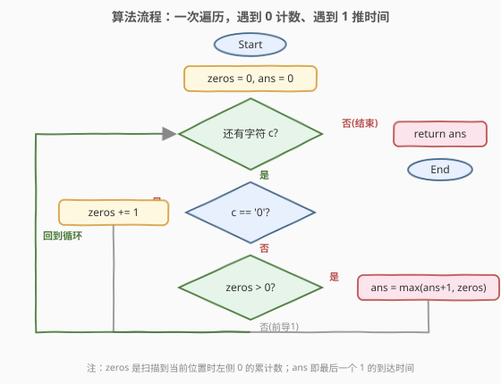
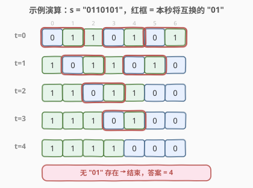

# 二进制字符串重新安排顺序需要的时间

- **题目名称**：二进制字符串重新安排顺序需要的时间
- **链接**：[2464. 二进制字符串重新安排顺序需要的时间](https://leetcode.cn/problems/time-needed-to-rearrange-a-binary-string/)
- **难度**：中等
- **标签**：字符串、动态规划、贪心

## 1. 题目概述

给你一个二进制字符串 `s`。在**一秒**内，**所有**子串 `"01"` **同时**被替换为 `"10"`。重复此过程直到 `s` 中不存在 `"01"`，返回所需秒数。

> 💡 换个等价说法：每一秒，所有形如「`0` 在左、`1` 在右」的相邻对同时互换位置——即每个 `1` 向左穿过一个 `0`、每个 `0` 向右穿过一个 `1`。最终所有 `1` 聚到左端、所有 `0` 聚到右端，过程停止。

**示例 1**：

```text
输入：s = "0110101"
输出：4
解释：
  第 1 秒：0110101 → 1011010
  第 2 秒：1011010 → 1101100
  第 3 秒：1101100 → 1110100
  第 4 秒：1110100 → 1111000
  此后无 "01"，共 4 秒。
```

**示例 2**：

```text
输入：s = "11100"
输出：0
解释：s 中本就不存在 "01"，花费 0 秒。
```

**约束条件**：

- $1 \le \text{s.length} \le 1000$
- `s[i]` 为 `'0'` 或 `'1'`

**进阶**：能否以 $O(n)$ 时间解决？

> ⚠️ 直接逐秒模拟每次全扫一遍是 $O(n^2)$，在 $n \le 1000$ 下虽能 AC，但无法应对进阶的 $O(n)$ 要求。突破口是放弃「串」视角、改看「每个 1」：每个 1 的到达时间只取决于它左侧 `0` 的个数与上一个 `1` 的到达时间，可在一趟扫描中递推得到。

---

## 2. 解题思路

### 2.1 暴力思路：逐秒模拟同步交换

每一秒基于当前串扫描所有 `"01"` 对，**同时**翻转：

```text
t = list(s)
ans = 0
while True:
    nxt = list(t)
    found = False
    for i in range(len(t)-1):
        if t[i]=='0' and t[i+1]=='1':   # 标记一对 "01"
            nxt[i], nxt[i+1] = '1','0'
            found = True
    t = nxt
    if not found: break
    ans += 1
return ans
```

最坏情形是形如 `"00…0011…11"`（前半 `0` 后半 `1`）：每秒只消去最右一个 `"01"` 对，需 $\Theta(n)$ 秒，每秒 $O(n)$ 扫描，合计 $O(n^2)$。$n=1000$ 时约 $10^6$ 次操作可过，但无法满足进阶的 $O(n)$。

> 💡 暴力的浪费在于：它盯着「整串」，每秒重扫全串，把「不同 `1` 的进度」混在一起。事实上每个 `1` 只管自己向左穿 `0`，进度彼此独立又仅受「前一个 `1`」牵制。于是把视角从「整串随时间演化」转到「每个 `1` 的到达时间」，就能一趟递推出答案。

### 2.2 核心观察：每个 1 的到达时间



把串中的 `1` **从左到右**编号为 $0, 1, \dots, m-1$。设第 $i$ 个 `1` 在原串中的下标为 $p_i$，则它**左侧 `0` 的个数**为

$$z_i \;=\; p_i - i$$

（下标 $p_i$ 以左共 $p_i$ 个字符，其中 $i$ 个是它前面的 `1`，其余皆为 `0`。）最终状态里第 $i$ 个 `1` 落在下标 $i$，所以它必须**向左跨过恰好 $z_i$ 个 `0`**。

**关键递推**：第 $i$ 个 `1` 到达终位的秒数

$$t_i \;=\; \max(\,t_{i-1}+1,\; z_i\,),\qquad t_{-1}=-1$$

两项分别来自两条独立下界：

1. **「跨零下界」$t_i \ge z_i$**：每个 `1` 每秒至多向左跨过 $1$ 个 `0`，必须跨 $z_i$ 个，故至少 $z_i$ 秒。
2. **「排队下界」$t_i \ge t_{i-1}+1$**：第 $i$ 个 `1` 不能越过第 $i-1$ 个 `1`。当第 $i-1$ 个在第 $t_{i-1}$ 秒完成它的**最后一次**互换（向左挪入终位）时，它腾出的格子要到**下一秒**才变成 `0`，第 $i$ 个 `1` 才有机会跨入——因为同一秒的互换基于「秒初」状态判定，第 $i-1$ 个腾位与第 $i$ 个跨入**不能发生在同一秒**。故第 $i$ 个必在第 $i-1$ 个之后至少 1 秒到达。

两项同时成立，取 `max` 即为下界；而该下界**总是可达**（详见第 5 节）：

- 若 $z_i \ge t_{i-1}+1$（前方 `0` 很多）：第 $i$ 个 `1` 全程不被前一个挡住，每秒跨一个 `0`，恰 $z_i$ 秒到达，$t_i = z_i$。
- 若 $z_i \le t_{i-1}$（前方 `0` 不多）：第 $i$ 个 `1` 追上了前一个，被迫排队，在前一个完成后再走 1 秒，$t_i = t_{i-1}+1$。

> 💡 因为 $t_i \ge t_{i-1}+1 > t_{i-1}$，序列 $\{t_i\}$ **严格递增**（忽略值为 $0$ 的前导 `1`），所以**答案 $= \max_i t_i = $ 最后一个 `1` 的 $t$**。扫描时维护一个变量 `ans` 即最后一个 `1` 的到达时间即可。

### 2.3 算法流程图



一趟扫描即可：

1. 维护 `zeros`（已扫到的 `0` 个数）与 `ans`（最后一个 `1` 的到达时间，初值 $0$）。
2. 逐字符读 `s`：
   - 遇 `'0'`：`zeros += 1`；
   - 遇 `'1'`：若 `zeros > 0`，`ans = max(ans + 1, zeros)`；否则（前导 `1`，左侧无 `0`）`ans` 不变（仍为 $0$）。
3. 返回 `ans`。

> ⚠️ 注意「遇 `1` 时取 `max(ans+1, zeros)`」中的 `+1` 体现排队下界 $t_{i-1}+1$；而 `zeros` 正是 $z_i$。前导 `1`（`zeros==0`）对应 $z_i=0$，其 $t_i=0$，故跳过更新——它们不影响答案。详见第 5 节对边界约定的说明。

### 2.4 示例演算



对 $s = \text{"0110101"}$，`1` 出现在下标 $1,2,4,6$，对应 $z_i = 1,1,2,3$，递推如下：

| 第 $i$ 个 `1` | 下标 $p_i$ | $z_i=p_i-i$ | $t_i=\max(t_{i-1}+1,z_i)$ |
|---------------|------------|-------------|---------------------------|
| 0 | 1 | 1 | $\max(0,1)=1$ |
| 1 | 2 | 1 | $\max(2,1)=2$ |
| 2 | 4 | 2 | $\max(3,2)=3$ |
| 3 | 6 | 3 | $\max(4,3)=4$ |

答案 $=$ 最后一个 `1` 的 $t = \mathbf{4}$ ✓。注意第 0、1 个 `1` 虽然 $z$ 都是 $1$（共用左侧同一个 `0`），但第 1 个被第 0 个「堵」了一秒（$t_1=2$），正是「相邻 `1` 成串」的体现。

---

## 3. 参考代码

### C++

```cpp
class Solution {
public:
    int secondsToRemoveOccurrences(string s) {
        int ans = 0, zeros = 0;
        for (char c : s) {
            if (c == '0') zeros++;
            else if (zeros > 0) ans = max(ans + 1, zeros);
        }
        return ans;
    }
};
```

### Python

```python
class Solution:
    def secondsToRemoveOccurrences(self, s: str) -> int:
        ans = 0
        zeros = 0
        for c in s:
            if c == '0':
                zeros += 1
            elif zeros > 0:
                ans = max(ans + 1, zeros)
        return ans
```

> 💡 两版逻辑一致。`zeros` 在扫描到当前 `1` 时正好等于 $z_i$（左侧 `0` 累计）；`ans` 始终等于「最后一个已处理 `1`」的 $t_i$，故递推 `ans = max(ans + 1, zeros)` 直接落地 $t_i = \max(t_{i-1}+1, z_i)$。仅用两个整型变量，无额外空间。

---

## 4. 复杂度分析

| 维度 | 一趟递推（本文） | 逐秒模拟 |
|------|------------------|----------|
| **时间复杂度** | $O(n)$，单次遍历，每字符 $O(1)$ | $O(n^2)$，至多 $\Theta(n)$ 秒、每秒 $O(n)$ |
| **空间复杂度** | $O(1)$，两个整型变量 | $O(n)$，保存可变字符串副本 |

> 💡 关键在于把「时间维度」从外层循环内化为「每个 `1` 的到达时间」标量，从而把 $O(\text{秒数})$ 的外循环折叠进单趟扫描，降到 $O(n)$。

---

## 5. 扩展：递推正确性证明

记第 $i$ 个 `1` 经 $t$ 秒后的下标为 $q_i(t)$（$q_i(0)=p_i$）。它每秒向左移 $1$ 当且仅当「秒初」$q_i(t)-1$ 处为 `0`；否则被挡（该位为 `1`，只可能是第 $i-1$ 个 `1`）。

### 5.1 下界 $t_i \ge \max(t_{i-1}+1,\, z_i)$

- **跨零下界**：第 $i$ 个 `1` 终位为下标 $i$，需净左移 $p_i-i=z_i$ 格，每秒至多左移 $1$ 格，故 $t_i\ge z_i$。
- **排队下界**：设第 $i-1$ 个在第 $t_{i-1}$ 秒完成最后互换，即秒初它在下标 $i$、$i-1$ 处为 `0`，互换后落在终位 $i-1$。此刻它腾出的下标 $i$ **要到下一秒才显现为 `0`**——因为本秒的互换都按秒初状态判定，第 $i$ 个 `1` 在本秒看到的是「下标 $i$ 仍为 `1`（即第 $i-1$ 个）」，无法跨入。故第 $i$ 个最早在第 $t_{i-1}+1$ 秒到达，$t_i\ge t_{i-1}+1$。

### 5.2 上界 $t_i \le \max(t_{i-1}+1,\, z_i)$（可达性）

由归纳，设 $t_{i-1}$ 已成立。观察第 $i$ 个 `1` 在**第 $i-1$ 个完成后**的局面：第 $0\dots i-1$ 个 `1` 已全部落定下标 $0\dots i-1$，而第 $i$ 个 `1` 落在某个 $\ge i$ 的下标，**它与下标 $i-1$ 之间全为 `0`**（左侧再无其他 `1`）。自此每秒它左侧必是 `0`，于是每秒稳定左移 $1$ 格，直到落定下标 $i$。因此第 $i$ 个恰在第 $t_{i-1}+1$ 秒（若它当时还差 $\le 1$ 格）或更晚但不超过「全程不堵地每秒跨一零」所需的 $z_i$ 秒到达。两种情形合并即 $t_i\le\max(t_{i-1}+1,z_i)$。

> 💡 直觉：当 $z_i\ge t_{i-1}+1$，前方 `0` 充足，第 $i$ 个全程不被堵，每秒跨一个，$t_i=z_i$；当 $z_i\le t_{i-1}$，它早早就追上前一个进入「串尾」排队，每当前一个挪一格它才能跟一格，故恰在前一个完成后再 $1$ 秒到达，$t_i=t_{i-1}+1$。

综合上下界，$t_i=\max(t_{i-1}+1,z_i)$，递推成立 $\blacksquare$

### 5.3 边界约定与代码一致性

约定 $t_{-1}=-1$，使第 $0$ 个 `1` 也由同一式给出：$t_0=\max(0,z_0)=z_0$（孤立 `1` 跨 $z_0$ 个 `0` 恰需 $z_0$ 秒，与模拟一致）。代码中 `ans` 初值 $0$、遇首个 `zeros>0` 的 `1` 执行 `max(ans+1, zeros)=max(1, z_0)`：因 $z_0\ge 1$ 故 $\max(1,z_0)=z_0$，与 $t_0=z_0$ 吻合；前导 `1`（$z_0=0$）被 `elif zeros>0` 跳过，$t_0=0$，同样正确。此后 `ans+1` 即严格体现排队下界 $t_{i-1}+1$。

---

## 6. 面试要点

1. **「所有 01 同时互换」为什么要单独考虑排队下界？**

   > 同一秒的互换都按**秒初**状态判定。当第 $i-1$ 个 `1` 在某秒挪入终位时，它腾出的位置本秒仍是 `1`，第 $i$ 个 `1` 无法在同一秒跨入，必须等到下一秒该位变 `0`。故相邻 `1` 间存在「+1 秒」的强制延迟，构成 $t_{i-1}+1$ 这一项。

2. **$z_i = p_i - i$ 为什么恰好是左侧 `0` 的个数？**

   > 第 $i$ 个 `1` 下标 $p_i$ 以左共 $p_i$ 个字符，其中恰有 $i$ 个是排在前面的 `1`（编号 $0\dots i-1$），剩余 $p_i-i$ 个只能是 `0`。

3. **答案为什么是最后一个 `1` 的 $t$，而非各 $t$ 的最大值？需要额外取 max 吗？**

   > 不需要。因 $t_i\ge t_{i-1}+1>t_{i-1}$，$\{t_i\}$ 严格递增（前导 `1` 的 $0$ 不破坏单调），最大值即末项。代码里 `ans` 滚动持有「最后处理 `1`」的 $t$，遍历结束即为答案。

4. **前导 `1`（串首连续若干 `1`）为什么不更新 `ans`？**

   > 它们左侧无 `0`，$z_i=0$，$t_i=0$，本就已达终位、全程不动，对答案无贡献。代码用 `elif zeros > 0` 跳过；且 `zeros` 单调不减，一旦进入 `0` 区就不会再回前导情形。

5. **进阶要求 $O(n)$，关键一步是什么？**

   > 把「时间作为外层循环」折叠为「每个 `1` 的到达时间标量」。一旦意识到到达时间只依赖 $z_i$（左侧 `0` 数，扫描时累加即得）与 $t_{i-1}$（前一个的到达时间，$O(1)$ 传递），整题退化为单趟线性递推，无需真正模拟任何一秒。

> 💡 **一句话总结**：把并行相邻互换的「总秒数」转化为「每个 `1` 的到达时间」$t_i=\max(t_{i-1}+1, z_i)$——$z_i$ 是跨零下界、$t_{i-1}+1$ 是同步互换导致的排队下界，一趟扫描 $O(n)/O(1)$ 即得答案。

---

## 7. 同类练习题

- [1703. 得到连续 K 个 1 的最少相邻交换次数](https://leetcode.cn/problems/minimum-adjacent-swaps-for-k-consecutive-ones/)（[站内题解](../1701-1800/1703_得到连续K个1的最少相邻交换次数.md)）：同为「`1` 穿过 `0`」的计数，但统计的是**串行**交换总次数（中位数 + `1` 位置前缀和），对照本题「并行」交换秒数——同一「数零」思想，两种度量
- [1536. 排布二进制网格的最少交换次数](https://leetcode.cn/problems/minimum-swaps-to-arrange-a-binary-grid/)（[站内题解](../1501-1600/1536_排布二进制网格的最少交换次数.md)）：二进制 + 相邻交换排序（行间交换把前导 `1` 数排成递减），对照「单串内 `1` 左移」与「行间交换」两种二进制重排
- [1963. 使字符串平衡的最小交换次数](https://leetcode.cn/problems/minimum-number-of-swaps-to-make-the-string-balanced/)（[站内题解](../1901-2000/1963_使字符串平衡的最小交换次数.md)）：括号（类二进制）串交换平衡，靠累计「不平衡度」贪心交换，对照本题的累计「左侧 `0` 数」
- [1151. 最少交换次数来组合所有的 1](https://leetcode.cn/problems/minimum-swaps-to-group-all-1s-together/)（[站内题解](../1101-1200/1151_最少交换次数来组合所有的1.md)）：滑窗把所有 `1` 聚到一段求最小交换数，同为「`1`/`0` 重排计数」家族的最值型变体
