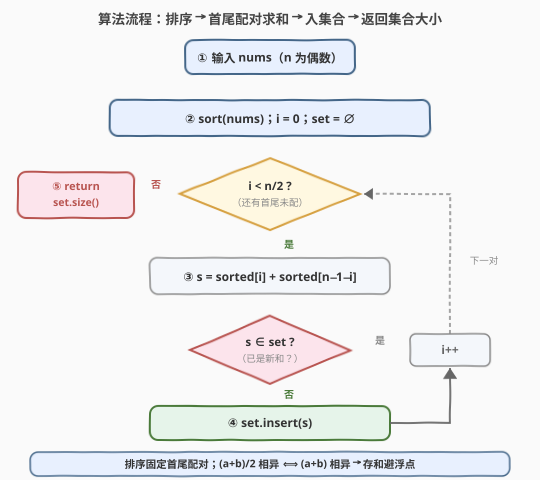

# LeetCode 不同的平均值数目 题解

## 1. 题目概述

- **标题 / 题号**：不同的平均值数目（#2465，easy）
- **链接**：https://leetcode.cn/problems/number-of-distinct-averages/
- **难度**：简单
- **标签**：数组、排序、双指针、哈希表

**题意**：给你一个下标从 $0$ 开始、长度为**偶数**的整数数组 `nums`。只要 `nums` **非空**，就重复执行：

- 找到 `nums` 中的**最小值**并删除它；
- 找到 `nums` 中的**最大值**并删除它；
- 计算删除两数的**平均值** $(a+b)/2$。

返回上述过程能得到的**不同**平均值的数目。

> 注意：如果最小值或最大值有重复元素，可以删除**任意一个**。

**示例 1**：

```text
输入：nums = [4,1,4,0,3,5]
输出：2
解释：
1. 删除 0 和 5，平均值 (0+5)/2 = 2.5，现在 nums = [4,1,4,3]
2. 删除 1 和 4，平均值 (1+4)/2 = 2.5，现在 nums = [4,3]
3. 删除 3 和 4，平均值 (3+4)/2 = 3.5
得到 {2.5, 2.5, 3.5}，不同值共 2 个，返回 2。
```

**示例 2**：

```text
输入：nums = [1,100]
输出：1
解释：删除 1 和 100 后只有一个平均值 (1+100)/2 = 50.5。
```

**约束**：

- $2 \le \text{nums.length} \le 100$
- $\text{nums.length}$ 是偶数
- $0 \le \text{nums}[i] \le 100$

> 💡 题面那句「重复元素可删任意一个」其实是**关键提示**——它暗示删除顺序不影响最终的平均值**集合**。一旦排序，第 $i$ 轮删的「值」就被排序位置锁死：最小恒为 `sorted[i]`，最大恒为 `sorted[n-1-i]`。于是无需逐轮真删，排序 + 首尾配对一次扫描即可。再利用 $(a+b)/2$ 相异 $\iff (a+b)$ 相异，**存和**即可绕开浮点。

## 2. 解题思路

### 2.1 暴力思路：逐轮真的删 min/max

最直白的做法是**忠实模拟**题面：每轮线性扫一遍找当前 min/max，删掉，算平均值塞进集合，直到数组空：

```text
seen = ∅
while nums 非空:
    a = min(nums); 删除一个 a
    b = max(nums); 删除一个 b
    seen.add((a + b) / 2)
return len(seen)
```

正确性没问题，但每轮 $O(n)$ 找 min/max + 删除，共 $n/2$ 轮，整体 $O(n^2)$。对 $n \le 100$ 能 AC，却把「重复扫描找极值」的劳动背在身上，且未揭示**配对结构其实早已固定**。

> ⚠️ 暴力把每轮的 min/max 当成「现扫才知道」的未知，但全部极值在一次排序后就完全确定——关键观察：**排序后第 $i$ 轮删的值被排序位置锁死**。

### 2.2 核心观察：排序固定首尾配对（不变量）

![核心观察：排序后第 i 轮必删 sorted[i] 与 sorted[n−1−i]，配对集合不变](../images/2465_concept.svg)

**关键洞察**：将 `nums` 排序为 $a_0 \le a_1 \le \cdots \le a_{n-1}$ 后，第 $i$ 轮（$i$ 从 $0$ 计）删除的**值**恒为 $a_i$（当前最小）与 $a_{n-1-i}$（当前最大）。配对集合 $\{(a_i, a_{n-1-i}) : i=0,\dots,n/2-1\}$ 唯一确定，与删除顺序无关。

证明（归纳）：

- **第 $0$ 轮**：当前最小值 $= a_0$，最大值 $= a_{n-1}$，删除后剩余多重集 $= \{a_1,\dots,a_{n-2}\}$；
- **归纳步**：若第 $i$ 轮后剩余 $\{a_{i+1},\dots,a_{n-2-i}\}$，则第 $i+1$ 轮最小 $= a_{i+1}$、最大 $= a_{n-2-i}$，归纳成立。

至于「重复元素可删任意一个」：当 $a_i = a_{i+1}$ 等出现重复时，删哪个**索引**都行，但删掉的**值**始终是 $a_i$（或 $a_{n-1-i}$）——值由排序位置决定，不受索引选择影响。这正是题面提示的「顺序无关」。

> 💡 **两个折叠**：(1) **顺序折叠**——逐轮删 min/max $\to$ 排序后首尾配对一次扫描，$O(n^2) \to O(n\log n)$；(2) **浮点折叠**——$(a+b)/2$ 相异 $\iff (a+b)$ 相异（除以 $2$ 是单射），存整数和避浮点。值域 $[0,100]$ 下和在 $[0,200]$ 内，至多 $201$ 种。

### 2.3 算法流程图



三阶段流水：

1. **排序初始化**：`sort(nums)`，`i = 0`，`set = ∅`；
2. **首尾配对求和**：循环 `i` 从 $0$ 到 $n/2-1$，每轮 `s = sorted[i] + sorted[n-1-i]`，`set.insert(s)`；
3. **返回大小**：循环结束返回 `set.size()`，即不同平均值数。

整个流程单趟扫描 + 一次排序，无任何 min/max 重扫或真删除操作。

### 2.4 示例演算

![示例演算：nums=[4,1,4,0,3,5] → 排序 → 首尾配对 → 不同平均值 2](../images/2465_example_walkthrough.svg)

以示例 1 `nums = [4,1,4,0,3,5]` 演算：

**第一步——排序**：$\text{sorted} = [0,1,3,4,4,5]$（注意两个 $4$ 重复）。

**第二步——首尾配对求和**：

| $i$ | 配对 $(a_i, a_{n-1-i})$ | 和 $s = a_i + a_{n-1-i}$ | 平均值 | 入集合后 `set` |
|-----|--------------------------|---------------------------|--------|------------------|
| $0$ | $(0, 5)$ | $5$ | $2.5$ | $\{5\}$ |
| $1$ | $(1, 4)$ | $5$（重复） | $2.5$ | $\{5\}$（不变） |
| $2$ | $(3, 4)$ | $7$（新增） | $3.5$ | $\{5, 7\}$ |

> 💡 两个重复的 $4$ 分别落在 $i=1$（与 $1$ 配）和 $i=2$（与 $3$ 配）位置——它们流向**不同**的配对。但无论当时把哪个 $4$ 当「最大」删掉，值都是 $4$，配对值不变。这就是「重复元素不影响」的具象体现。

**第三步——返回**：$|\{5, 7\}| = 2$ ✓。

存的是**和**而非平均值：$s=5 \to 2.5$、$s=5 \to 2.5$、$s=7 \to 3.5$，和的集合 $\{5,7\}$ 与平均值的集合 $\{2.5, 3.5\}$ 一一对应，大小同为 $2$。

## 3. 参考代码

### C++

```cpp
class Solution {
public:
    int distinctAverages(vector<int>& nums) {
        sort(nums.begin(), nums.end());
        unordered_set<int> seen;
        int n = nums.size();
        for (int i = 0; i < n / 2; ++i)
            seen.insert(nums[i] + nums[n - 1 - i]);
        return seen.size();
    }
};
```

> 💡 `seen` 存整数和 `nums[i] + nums[n-1-i]` 而非平均值，规避浮点哈希。`i` 只到 `n/2`，首尾不重叠（$n$ 为偶数，`i` 与 `n-1-i` 恰好成对不越界）。`unordered_set` 自动去重，最终 `size()` 即答案。

### Python

```python
class Solution:
    def distinctAverages(self, nums: List[int]) -> int:
        nums.sort()
        return len({nums[i] + nums[-1 - i] for i in range(len(nums) // 2)})
```

> 💡 集合推导式一行收尾：`nums[-1-i]` 即首尾配对的另一端（`i=0` 时取末位）。存和避浮点同 C++。`len(nums)//2` 保证只配一半，避免重复配对（$i$ 与 $n-1-i$ 对称，扫一半即可）。

## 4. 复杂度分析

| 维度 | 复杂度 | 说明 |
|------|--------|------|
| **时间复杂度** | $O(n \log n)$ | 排序 $O(n\log n)$ + 首尾配对单趟 $O(n)$，前者主导 |
| **空间复杂度** | $O(n)$ | 哈希集合至多存 $n/2$ 个和；实际受值域限制 $\le 201$ |
| 对照：逐轮真删暴力 | $O(n^2)$ / $O(n)$ | 每轮 $O(n)$ 找 min/max，$n/2$ 轮；省一次排序 |
| 对照：值域位图法 | $O(n\log n)$ / $O(1)$ | 用 `bitset<201>` 当集合，空间压成常数（见第 5 节） |

> 💡 本题 $n \le 100$，任何 $O(n^2)$ 写法都能瞬 AC。排序 + 配对的价值在**方法论**：识别「逐轮删极值」的不变量，把 $O(n^2)$ 模拟折叠成 $O(n\log n)$ 结构化求解——当 $n$ 放大到 $10^5$ 时，暴力不再可行而本法仍稳。

## 5. 扩展：值域位图法 $O(1)$ 空间

值域 $[0,100]$ 极小，和 $a_i + a_{n-1-i} \in [0, 200]$，至多 $201$ 种。用定长位图当集合，把 $O(n)$ 哈希空间压成 $O(1)$：

```cpp
class Solution {
public:
    int distinctAverages(vector<int>& nums) {
        sort(nums.begin(), nums.end());
        bitset<201> b;
        int n = nums.size();
        for (int i = 0; i < n / 2; ++i)
            b[nums[i] + nums[n - 1 - i]] = 1;
        return b.count();
    }
};
```

> 💡 `bitset<201>` 用 $201$ bit（$26$ 字节）当去重集合，`b.count()` 直接给出置位数为答案。缓存友好、无哈希开销。代价是**与值域耦合**：若 $\text{nums}[i]$ 放大到 $10^9$，位图不可行，须退回 `unordered_set`。这就是「值域小用位图、值域大用哈希」的取舍——与 [2441](../2401-2500/2441_与对应负数同时存在的最大正整数.md) 用 `bool seen[2001]` 压缩值域 $[-1000,1000]$ 的思路同源。

> ⚠️ **浮点为何也能用但不必用**：本题 $(a+b)/2$ 是整数或 $0.5$ 的倍数，二进制浮点可精确表示，存 `double` 哈希本题不会出错。但**存和**更通用——若题改为「$(a+b)/3$」之类除不尽的情形，浮点会引入精度与哈希风险，整数和则永远安全。养成「能用整数就别上浮点」的习惯。

## 6. 面试要点

1. **为什么排序后第 $i$ 轮删的值恒为 `sorted[i]` 与 `sorted[n-1-i]`？**

   > 归纳：第 $0$ 轮最小 $= a_0$、最大 $= a_{n-1}$，删后剩余 $\{a_1,\dots,a_{n-2}\}$；若第 $i$ 轮后剩余 $\{a_{i+1},\dots,a_{n-2-i}\}$，则第 $i+1$ 轮最小 $= a_{i+1}$、最大 $= a_{n-2-i}$。于是第 $i$ 轮总是配 $a_i$ 与 $a_{n-1-i}$，与删除顺序无关。

2. **「重复元素可删任意一个」为何不影响结果？**

   > 删除影响的是**索引**，不是**值**。当 $a_i = a_{i+1}$ 等重复时，删哪个索引，删掉的值都是 $a_i$（或 $a_{n-1-i}$）。而配对只看值，不看索引——值由排序位置锁死。这正是题面那句提示的含义：顺序无关。

3. **为什么存和 `(a+b)` 而不直接存平均值？**

   > 两点：(1) **等价性**——除以 $2$ 是单射，$(a+b)/2$ 相异 $\iff (a+b)$ 相异，存和与存平均值得到的集合大小相同；(2) **避浮点**——整数和天然精确、哈希无精度风险，适用于「除不尽」的变体。本题浮点虽也能用，但存和更通用。

4. **能否优化到 $O(n)$？**

   > 排序是 $O(n\log n)$ 的瓶颈。值域 $[0,100]$ 时可用**计数排序**先把排序降到 $O(n + V)$（$V=101$），再配对——整体 $O(n + V)$。但通用场景下比较排序 $O(n\log n)$ 已是最优渐进（无值域假设时，求「不同配对和数」需 $\Omega(n\log n)$）。

5. **首尾配对为何只扫 `n/2` 次？**

   > 配对 $(i, n-1-i)$ 关于中点对称：$i$ 与 $n-1-i$ 是同一对。扫 $i = 0 \dots n/2-1$ 恰好覆盖所有不重复配对（$n$ 偶数时 $i$ 与 $n-1-i$ 不重叠）。扫全 $n$ 次会把每对算两遍，虽因集合去重结果不变，但徒增一倍工作。

> 💡 **一句话总结**：排序后第 $i$ 轮必删 `sorted[i]` 与 `sorted[n-1-i]`（配对不变量）⟹ 一次首尾配对求和入集合，$(a+b)/2$ 相异 $\iff (a+b)$ 相异故存和避浮点，返回集合大小。$O(n\log n)$ / $O(n)$。

## 同类练习题

| # | 题目 | 与本题的关联 |
|---|------|-------------|
| 2130 | [链表最大孪生和](https://leetcode.cn/problems/maximum-twin-sum-of-a-linked-list/)（[题解](../2101-2200/2130_链表最大孪生和.md)） | 链表版「配 $i$ 与 $n-1-i$」求最大孪生和，与本题完全相同的首尾配对结构，对照「配对求最值」与「配对求不同值数」 |
| 2293 | [极大极小游戏](https://leetcode.cn/problems/min-max-game/)（[题解](../2201-2300/2293_极大极小游戏.md)） | 逐轮取 min/max 配对归约，同「反复删极值」家族，对照「分治归约」与「排序后一次配对」两种处理 min/max 的姿势 |
| 977 | [有序数组的平方](https://leetcode.cn/problems/squares-of-a-sorted-array/)（[题解](../0901-1000/977_有序数组的平方.md)） | 对撞双指针从首尾两端取值填结果，同「$i$ 与 $n-1-i$ 配对」的双指针骨架 |
| 167 | [两数之和 II - 输入有序数组](https://leetcode.cn/problems/two-sum-ii-input-array-is-sorted/)（[题解](../0101-0200/167_两数之和%20II%20-%20输入有序数组.md)） | 有序数组首尾对撞双指针找目标和，同「排序 + 双端指针配对」范式 |
| 2341 | [数组能形成多少数对](https://leetcode.cn/problems/maximum-number-of-pairs-in-array/)（[题解](../2301-2400/2341_数组能形成多少数对.md)） | 频次表配对 + 计数，对照本题「配对求不同值数」与「配对计数求和」，同「配对 + 集合/计数」骨架 |
