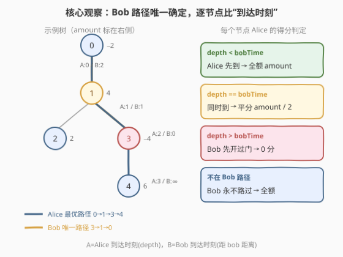
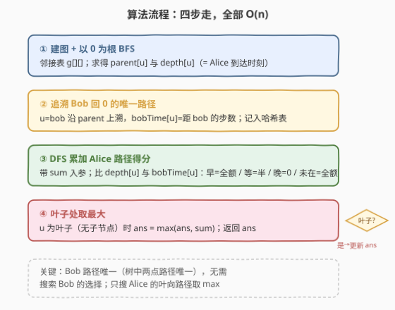
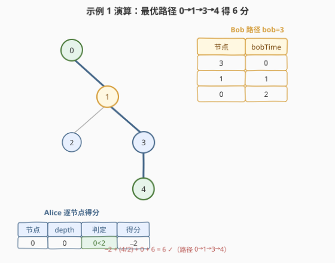

# LeetCode 树上最大得分和路径 题解

## 1. 题目概述

- **标题 / 题号**：树上最大得分和路径（#2467，medium）
- **链接**：https://leetcode.cn/problems/most-profitable-path-in-a-tree/
- **难度**：中等
- **标签**：树、深度优先搜索、广度优先搜索、图论

**题意**：给定一个 `n` 个节点的无向树，节点编号 `0` 到 `n-1`，根节点为 `0`，由长度为 `n-1` 的 `edges` 描述。每个节点 `i` 有一扇门，`amount[i]` 是偶数：负数表示开门**扣分**，正数表示开门**加分**。

Alice 从 `0` 出发、Bob 从 `bob` 出发。每秒钟**同时**各移动一步：Alice 朝某个**叶子**走，Bob 朝 `0` 走。开门规则：

- 若门**已被对方开过**，则不再加分也不扣分；
- 若两人**同时**到达同一节点，**平分**该节点分数（`amount / 2`）。

Alice 到叶子即停，Bob 到 `0` 即停，两者**互不影响**。求 Alice 选择最优叶子时能获得的**最大**净得分。

**示例 1**：

```text
输入：edges = [[0,1],[1,2],[1,3],[3,4]], bob = 3, amount = [-2,4,2,-4,6]
输出：6

        0(-2)
        |
        1(4)
       / \
   2(2)  3(-4)  ← Bob 起点
          |
          4(6)
```

Alice 走 `0→1→3→4`：节点 `0` 得 `-2`，节点 `1` 与 Bob 同时到平分 `4/2=2`，节点 `3` Bob 已开过得 `0`，节点 `4` 得 `6`，合计 `6`。

**示例 2**：

```text
输入：edges = [[0,1]], bob = 1, amount = [-7280,2350]
输出：-7280
```

Alice 走 `0→1`：节点 `0` Alice 先到得 `-7280`，节点 `1` Bob 已开过得 `0`，合计 `-7280`。

**约束**：

- $2 \le n \le 10^5$
- `edges` 表示一棵合法的树
- $1 \le \text{bob} < n$
- `amount[i]` 是 $[-10^4, 10^4]$ 内的**偶数**

> 💡 两人同时移动且每秒一步，因此「到达某节点的时刻」就是「从起点出发走过的边数」。Alice 的到达时刻 = 该节点**深度**（距根 `0` 的边数）；Bob 的到达时刻 = 该节点**距 `bob` 的边数**。题目本质是在每个节点上比较这两个时刻的大小关系。

## 2. 解题思路

### 2.1 暴力思路：枚举 Alice 的所有叶向路径

最朴素的做法是枚举 Alice 能走的每一条「根到叶」路径，对每条路径逐节点模拟开门得分，再取最大值。Alice 走的路径数等于叶子数，最坏 $O(n)$ 条；每条路径累加 $O(n)$，总 $O(n^2)$，$n=10^5$ 时超时。

> ⚠️ 瓶颈在于「**Bob 的路径也在变**」这一错觉。实际上 Bob 始终从 `bob` 出发、朝 `0` 走，而**树中任意两点间路径唯一**——Bob 的路径是**唯一确定**的，不存在选择。因此 Bob 对每个节点的「到达时刻」可以**一次性预处理**，Alice 只需在 DFS 时按节点查询即可，无需为每条 Alice 路径重新模拟 Bob。

### 2.2 核心观察：Bob 路径唯一 + 逐节点比到达时刻



三个关键事实把问题从「双人对弈」化简为「单次树上遍历」：

1. **Bob 路径唯一**：树中 `bob` 到 `0` 的简单路径只有一条，沿父指针上溯即可还原。Bob 每秒走一步，故路径上每个节点 `u` 的 Bob 到达时刻 `bobTime[u]` = `u` 距 `bob` 的边数（路径上从 `bob` 数起的下标）。
2. **Alice 到达时刻 = 深度**：Alice 始终从 `0` 出发，每秒朝叶子走一步，故到达节点 `u` 的时刻恰为 `depth[u]`（以 `0` 为根的深度）。
3. **得分只取决于两者到达时刻的比较**：对 Alice 路径上的每个节点 `u`：
   - 若 `u` **不在** Bob 路径上：Bob 永不路过，Alice 拿**全额** `amount[u]`；
   - 若 `u` 在 Bob 路径上：
     - `depth[u] < bobTime[u]`：Alice 先到，拿**全额** `amount[u]`；
     - `depth[u] == bobTime[u]`：同时到，**平分** `amount[u] / 2`；
     - `depth[u] > bobTime[u]`：Bob 已开门，Alice 拿 **0**。

于是只需一次 BFS 求父指针与深度、一次上溯求 `bobTime`、一次 DFS 沿 Alice 的叶向路径累加得分并在叶子处取 max。**三个阶段全是 $O(n)$**。

> 💡 **为什么是 max 而非 min？** 题目要 Alice「朝最优叶子移动」取**最大**净得分，故对每条根到叶路径累加得分后取所有叶子的最大值。DFS 带 `sum` 入参递推，天然在叶子处比较。

### 2.3 算法流程图



四步骨架：

1. **建图 + 以 0 为根 BFS**：由 `edges` 构邻接表 `g`，从 `0` 出发 BFS/DFS 求每个节点的 `parent[u]` 与 `depth[u]`（即 Alice 到达时刻）。
2. **追溯 Bob 路径**：令 `u = bob`，沿 `parent` 一直上溯到 `0`，路径上第 `k` 个节点的 `bobTime = k`（`k` 从 `0` 起），存入哈希表 `bobTime`。
3. **DFS 累加 Alice 得分**：从 `0` 出发 DFS，携带当前累计 `sum`。对节点 `u` 按 2.2 的三情况决定本节点贡献 `c`，新累计 `sum + c` 传给子节点。
4. **叶子处取最大**：`u` 为叶子（以 `0` 为根时无子节点）时 `ans = max(ans, sum)`。根 `0` 在 $n\ge2$ 时必有子节点，故不会误当叶子。

### 2.4 示例演算

以示例 1 `edges = [[0,1],[1,2],[1,3],[3,4]]`, `bob = 3`, `amount = [-2,4,2,-4,6]` 为例。



**第 1 步：以 0 为根求 parent / depth**

| 节点 | 0 | 1 | 2 | 3 | 4 |
|------|---|---|---|---|---|
| parent | − | 0 | 1 | 1 | 3 |
| depth  | 0 | 1 | 2 | 2 | 3 |

**第 2 步：追溯 Bob 路径 `bob=3 → 0`**

| 路径顺序 | 3 | 1 | 0 |
|----------|---|---|---|
| bobTime  | 0 | 1 | 2 |

**第 3 步：DFS 累加 Alice 得分**（比较 `depth` 与 `bobTime`）

| 节点 | depth | bobTime | 判定 | 本步得分 | 累计 sum |
|------|-------|---------|------|----------|----------|
| 0 | 0 | 2 | `0 < 2`（Alice 先到） | `−2` | `−2` |
| 1 | 1 | 1 | `1 == 1`（同时） | `4/2 = 2` | `0` |
| 3 | 2 | 0 | `2 > 0`（Bob 已开过） | `0` | `0` |
| 4 | 3 | ∞ | 不在 Bob 路径 | `6` | `6` |

节点 `4` 是叶子 → 更新 `ans = max(−∞, 6) = 6`。另一条叶向路径 `0→1→2` 累计 `−2 + 2 + 2 = 2`（节点 `2` 不在 Bob 路径，拿全额 `2`），叶子处 `ans = max(6, 2) = 6`。

最终答案 `6` ✓。

> 💡 对照示例 2 `bob=1`：Bob 路径 `1→0`，`bobTime[1]=0`、`bobTime[0]=1`。Alice 走 `0→1`：节点 `0` `depth=0 < bobTime=1` 拿全额 `−7280`；节点 `1` `depth=1 > bobTime=0` Bob 已开过拿 `0`。合计 `−7280` ✓。可见 Bob 若起点就在叶子、会一路抢占自己起点之后到 `0` 的节点。

## 3. 参考代码

### C++

```cpp
class Solution {
    vector<vector<int>> g;
    vector<int> depth, amount;
    unordered_map<int, int> bobTime;
    int ans = INT_MIN;

    void dfs(int u, int fa, int sum) {
        int c;
        auto it = bobTime.find(u);
        if (it == bobTime.end()) c = amount[u];              // 不在 Bob 路径 → 全额
        else if (depth[u] < it->second) c = amount[u];       // Alice 先到 → 全额
        else if (depth[u] == it->second) c = amount[u] / 2;  // 同时到 → 平分
        else c = 0;                                            // Bob 已开过 → 0
        sum += c;

        bool isLeaf = true;
        for (int v : g[u]) {
            if (v != fa) { isLeaf = false; dfs(v, u, sum); }
        }
        if (isLeaf) ans = max(ans, sum);
    }
public:
    int mostProfitablePath(vector<vector<int>>& edges, int bob, vector<int>& amt) {
        int n = amt.size();
        g.assign(n, {});
        amount = move(amt);
        depth.assign(n, 0);
        bobTime.clear();            // 多组用例复用同一对象，须清空
        ans = INT_MIN;
        for (auto& e : edges) { g[e[0]].push_back(e[1]); g[e[1]].push_back(e[0]); }
        // BFS 求父指针 + 深度
        vector<int> parent(n, -1);
        queue<int> q; q.push(0);
        vector<int> seen(n, 0); seen[0] = 1;
        while (!q.empty()) {
            int u = q.front(); q.pop();
            for (int v : g[u]) if (!seen[v]) {
                seen[v] = 1; parent[v] = u; depth[v] = depth[u] + 1; q.push(v);
            }
        }
        // 追溯 Bob 路径
        int t = 0;
        for (int u = bob; u != -1; u = parent[u]) bobTime[u] = t++;
        // DFS 累加得分
        dfs(0, -1, 0);
        return ans;
    }
};
```

### Python

```python
class Solution:
    def mostProfitablePath(self, edges: List[List[int]], bob: int, amount: List[int]) -> int:
        n = len(amount)
        g = [[] for _ in range(n)]
        for a, b in edges:
            g[a].append(b)
            g[b].append(a)

        # 以 0 为根 BFS：求 parent 与 depth（= Alice 到达时刻）
        parent = [-1] * n
        depth = [0] * n
        seen = [0] * n
        seen[0] = 1
        from collections import deque
        q = deque([0])
        while q:
            u = q.popleft()
            for v in g[u]:
                if not seen[v]:
                    seen[v] = 1
                    parent[v] = u
                    depth[v] = depth[u] + 1
                    q.append(v)

        # 追溯 Bob 回 0 的唯一路径，记录 bobTime
        bob_time = {}
        t = 0
        u = bob
        while u != -1:
            bob_time[u] = t
            t += 1
            u = parent[u]

        # DFS 累加 Alice 得分，叶子处取 max
        ans = -10 ** 18

        def dfs(u: int, fa: int, cur: int) -> None:
            nonlocal ans
            # 本节点贡献：比 depth[u] 与 bob_time[u]
            if u not in bob_time:
                c = amount[u]                       # 不在 Bob 路径 → 全额
            elif depth[u] < bob_time[u]:
                c = amount[u]                       # Alice 先到 → 全额
            elif depth[u] == bob_time[u]:
                c = amount[u] // 2                  # 同时到 → 平分
            else:
                c = 0                               # Bob 已开过 → 0
            cur += c

            is_leaf = True
            for v in g[u]:
                if v != fa:
                    is_leaf = False
                    dfs(v, u, cur)
            if is_leaf:
                ans = max(ans, cur)

        dfs(0, -1, 0)
        return ans
```

> 💡 **Bob 路径无需单独哈希表**：也可在追溯时直接把 `bobTime` 写进一个 `n` 长数组（初值 `INF`，表示「Bob 永不路过」），省去 `unordered_map` 的常数；空间仍 $O(n)$。

## 4. 复杂度分析

| 维度 | BFS + 追溯 + DFS | 枚举 Alice 路径逐条模拟 |
|------|------------------|--------------------------|
| **时间复杂度** | $O(n)$（每条边访问常数次：BFS 一遍、DFS 一遍、Bob 上溯至多树高次） | $O(n^2)$（叶子数 $\times$ 路径长，最坏退化） |
| **空间复杂度** | $O(n)$（邻接表 + parent/depth/bobTime + BFS 队列 + DFS 递归栈） | $O(n)$（递归栈） |
| **关键化简** | 利用「树中两点路径唯一」把 Bob 的选择自由降为 0，预处理后 Alice 单次遍历 | 未利用 Bob 路径唯一性，重复模拟 |

> 💡 递归栈深最坏 $O(n)$（树退化为链时），$n=10^5$ 可能在某些语言触发栈溢出；若担心可改用显式栈的迭代 DFS，逻辑不变，复杂度同。BFS 求 parent 也可换写成从 `0` 出发的一次 DFS，二者等价。

## 5. 扩展：为什么 Bob 一定能「朝 0 走」

题面说 Bob「朝着节点 `0` 移动」，直觉上需搜索 Bob 的走法，但树有一个关键性质：**任意两节点间简单路径唯一**。Bob 从 `bob` 到 `0` 的路径就是 `bob` 沿父指针一路上溯到根 `0` 的那条链——没有分叉、没有选择。这把「Bob 的策略」从一个搜索问题降为一次 $O(\text{树高})$ 的上溯。

> ⚠️ 若把图从树换成**一般无向图**，两点间路径不唯一，Bob 的最优策略本身就是一个博弈问题（要使 Alice 得分最小），本题立刻升格为 Minimax 博弈 DP，复杂度剧增。本题的「树」约束是化简的支点。

## 6. 面试要点

1. **为什么 Bob 的路径是确定的，无需搜索？**

   > 因为输入是一棵树，树中任意两节点间简单路径唯一。Bob 从 `bob` 到 `0` 只有一条路，沿父指针上溯即可还原，Bob 不存在「选择」。于是 Bob 对每个节点的到达时刻可以一次性预处理，Alice 单次 DFS 查询即可。

2. **Alice 的到达时刻为什么就是节点深度？**

   > Alice 始终从根 `0` 出发、每秒走一步朝叶子前进，从不回头（朝叶子走保证路径上每节点只经过一次）。故到达节点 `u` 的时刻恰为 `u` 在以 `0` 为根时的深度 `depth[u]`，BFS/DFS 一次即可求得。

3. **同时到达时为什么是 `amount/2` 而非 `amount`？**

   > 题面规定两人同时到达时**共享**该门分数：若门值 `c`，两人**各**得 `c/2`。题目保证 `amount[i]` 是偶数，故 `c/2` 恒为整数，无需处理小数。代码里直接 `amount[u] // 2`。

4. **如何判定一个节点是不是 Alice 的「叶子」终点？**

   > 以 `0` 为根建父指针后，节点的「子节点」= 邻接点中除父以外的节点。某节点**无子节点**即为叶子（Alice 停下）。注意根 `0` 在 $n\ge2$ 时至少有一子，不会被误判为叶子；但若 $n=1$（本题约束 $n\ge2$ 不出现），根自身就是叶子需单独处理。

5. **Bob 已开门的节点 Alice 得 0，会不会影响 Alice 路径选择？**

   > 会，这正是要取 max 的原因。Bob 抢占的节点对 Alice 贡献 0，可能使某条原本看似高分的路径变低，Alice 转而选另一条更优叶子。DFS 在所有叶子处取 max，自然选出全局最优。

> 💡 **一句话总结**：树中两点路径唯一 → Bob 路径确定 → 预处理 `bobTime` 后 Alice 一次 DFS 比较到达时刻累加得分、叶子处取 max。三遍 $O(n)$ 遍历搞定，核心是「时刻比较」三情况的全额 / 半分 / 零分判定。

## 同类练习题

| # | 题目 | 与本题的关联 |
|---|------|-------------|
| 2096 | [从二叉树一个节点到另一个节点每一步的方向](https://leetcode.cn/problems/step-by-step-directions-from-a-binary-tree-node-to-another/) | 同样利用「树中两点路径唯一」，求两节点间路径并输出方向串，对照「父指针上溯求 LCA」的同一手法 |
| 865 | [具有所有最深节点的最小子树](https://leetcode.cn/problems/smallest-subtree-with-all-the-deepest-nodes/) | 以根 BFS 求深度 + 最近公共祖先定位最深节点集合的子树根，与本题「深度即到达时刻 + 路径唯一」思想相通 |
| 1514 | [概率最大的路径](https://leetcode.cn/problems/path-with-maximum-probability/) | 在图（非树）上求两点间最优路径，对照「树中路径唯一故无需搜索」的化简前提——一旦失去树的约束就需 Dijkstra/SPFA |
| 310 | [最小高度树](https://leetcode.cn/problems/minimum-height-trees/) | 树上以不同节点为根求高度，BFS 求深度与拓扑剥叶的典型树论题，巩固「以指定点为根 BFS 求深度」的通用骨架 |
