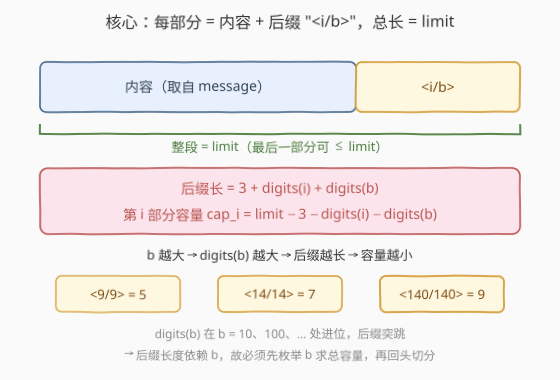
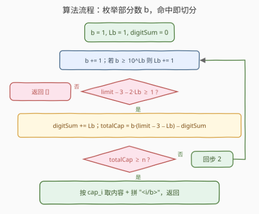
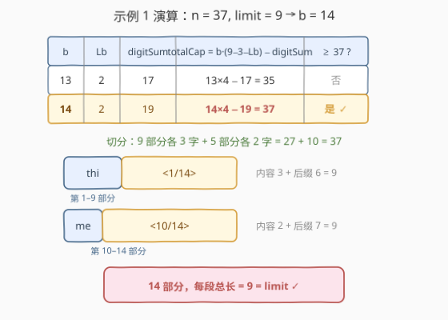

# 根据限制分割消息

- **题目名称**：根据限制分割消息
- **链接**：[2468. 根据限制分割消息](https://leetcode.cn/problems/split-message-based-on-limit/)
- **难度**：困难
- **标签**：字符串、枚举、数学

## 1. 题目概述

给定字符串 `message` 与正整数 `limit`。把 `message` **分割**成若干**部分**，每部分形如「一段内容 + 结尾 `"<a/b>"`」：

- `"b"` 是分割出的**总段数**，`"a"` 是当前段的编号（从 `1` 到 `b`）；
- 除**最后一段**长度 $\le \text{limit}$ 外，其余每段（含结尾）长度都必须**等于** $\text{limit}$；
- 去掉所有结尾、按序拼接后必须还原 `message`，且**段数越少越好**；
- 若无法分割则返回空数组。

**示例 1**：

```text
输入：message = "this is really a very awesome message", limit = 9
输出：["thi<1/14>","s i<2/14>","s r<3/14>","eal<4/14>","ly <5/14>","a v<6/14>",
       "ery<7/14>"," aw<8/14>","eso<9/14>","me<10/14>"," m<11/14>","es<12/14>",
       "sa<13/14>","ge<14/14>"]
解释：前 9 段各取 3 个字符，后 5 段各取 2 个字符，共 14 段，每段总长恰为 9。
```

**示例 2**：

```text
输入：message = "short message", limit = 15
输出：["short mess<1/2>","age<2/2>"]
解释：第 1 段 10 个字符（总长 15），第 2 段 3 个字符（总长 8）。
```

**约束条件**：

- $1 \le \text{message.length} \le 10^4$
- `message` 只含小写字母和 `' '`
- $1 \le \text{limit} \le 10^4$

> 💡 本题的“坑”不在切分本身，而在**决定段数 `b`**：结尾 `"<a/b>"` 的长度依赖 `b` 的位数，而 `b` 未知。所以必须先枚举 `b` 求出“总容量”，命中后再回头切分——两阶段。

---

## 2. 解题思路

### 2.1 暴力思路：贪心逐段切分

最直观的想法是边读 `message` 边切：每段尽量塞满 `limit` 个字符，结尾先占位 `"<i/?>"`，最后回填总数 `b`。

但这立刻陷入死循环：要算第 `i` 段能塞几个字符，得知道结尾 `"<i/b>"` 的长度；而结尾长度依赖 `b`（总段数）；`b` 又得切完才知道。**结尾长度依赖未知量 `b`**，逐段贪心无法自洽。

> ⚠️ 瓶颈在于“段数 `b`”既是切分的输入（决定每段结尾长度）、又是切分的输出（切完才确定）。突破口：把 `b` 提到外面单独求——对每个候选 `b` 算“`b` 段总共能装多少字符”，一旦够装 `n = len(message)`，这个 `b` 就是最优段数。

### 2.2 核心观察：先定 b，再切分



第 `i` 段（`1`-indexed）的结尾是 `"<i/b>"`，其长度只含 `4` 类字符：

$$
\text{suffix\_len}(i, b) \;=\; \underbrace{1}_{\text{"<"}} + \underbrace{\text{digits}(i)}_{\text{编号}} + \underbrace{1}_{\text{"/"}} + \underbrace{\text{digits}(b)}_{\text{总数}} + \underbrace{1}_{\text{">"}} \;=\; 3 + \text{digits}(i) + \text{digits}(b).
$$

于是第 `i` 段能放的内容字符数（容量）为

$$
\text{cap}_i(b) \;=\; \text{limit} - 3 - \text{digits}(i) - \text{digits}(b).
$$

`b` 段的**总容量**为

$$
\text{TotalCap}(b) \;=\; \sum_{i=1}^{b} \text{cap}_i(b) \;=\; b \cdot \bigl(\text{limit} - 3 - \text{digits}(b)\bigr) - \underbrace{\sum_{i=1}^{b} \text{digits}(i)}_{\text{digitSum}(b)}.
$$

我们要找**最小的 `b`** 使得 $\text{TotalCap}(b) \ge n$，且每段容量 $\ge 1$（至少能放 1 个字符）。由于容量最大的结尾出现在编号 `b`（`"<b/b>"`），可行性只需检查

$$
\text{limit} - 3 - 2\cdot\text{digits}(b) \;\ge\; 1.
$$

> 💡 **为什么枚举 `b` 一定能命中、且命中时最后一段不空？**
> 当可行性满足时，每段容量 $\text{cap}_i \ge \text{cap}_b \ge 1$，故 `b` 段至少装 `b` 个字符。因此只要可行性一直成立，到 $b = n$ 时 $\text{TotalCap}(n) \ge n$ 必然命中，搜索上界为 $n$。
> 命中时最后一段内容 $r = n - \sum_{i=1}^{b-1}\text{cap}_i$。若 `b` 与 `b-1` 位数相同，前 `b-1` 段容量之和正是 $\text{TotalCap}(b-1) < n$（否则会更早命中），故 $r \ge 1$；若跨过进位（如 $b=10$、$b-1=9$），前 `b-1` 段每段容量反而少 $1$，$r$ 更大。两种情况最后一段都不空，切分合法。

### 2.3 算法流程图



骨架四步：

1. **初始化**：`b = 1`，位数 `Lb = 1`，`digitSum = 0`，进位阈值 `nxt = 10`；
2. **推进 `b`**：`b += 1`；若 $b \ge \text{nxt}$（即跨过 $10, 100, 1000,\ldots$），则 `Lb += 1`、`nxt *= 10`——把 `digits(b)` 的计算摊成 $O(1)$；
3. **可行性**：若 $\text{limit} - 3 - 2\cdot\text{Lb} < 1$，返回 `[]`（位数已超限，更大 `b` 只会更差）；
4. **判容量**：`digitSum += Lb`；算 $\text{TotalCap} = b\cdot(\text{limit}-3-\text{Lb}) - \text{digitSum}$；若 $\ge n$，按 $\text{cap}_i$ 逐段切分并返回；否则回到步 2。

> ⚠️ **总容量并非单调**：跨过进位时（如 $b=9\to10$，`Lb` 从 $1$ 变 $2$），所有已有段结尾各变长 $1$，总容量会**突降**。但这不影响正确性——我们按 `b` 递增逐个检查，命中的是“最小可行 `b`”。代码里不能假设 `TotalCap` 单调而提前 `break`，必须真算。

### 2.4 示例演算

以示例 1 `n = 37, limit = 9` 为例，枚举 `b`：



| 步 | `b` | `Lb` | `digitSum` | `TotalCap = b·(9−3−Lb) − digitSum` | $\ge 37$? |
|----|-----|------|------------|-----------------------------------|-----------|
| … | 9 | 1 | 9 | $9 \times 5 - 9 = 36$ | 否 |
| … | 10 | 2 | 11 | $10 \times 4 - 11 = 29$（进位突降！） | 否 |
| … | 13 | 2 | 17 | $13 \times 4 - 17 = 35$ | 否 |
| ✓ | 14 | 2 | 19 | $14 \times 4 - 19 = 37$ | **是** |

命中 `b = 14`，切分：

- 第 $1\sim9$ 段：结尾 `"<i/14>"` 长 $3+1+2=6$，容量 $9-6=3$，各取 $3$ 个字符；
- 第 $10\sim14$ 段：结尾 `"<i/14>"` 长 $3+2+2=7$，容量 $9-7=2$，各取 $2$ 个字符；
- 合计 $9 \times 3 + 5 \times 2 = 27 + 10 = 37 = n$ ✓，每段总长恰为 $9 = \text{limit}$。

> 💡 注意第 $9\to10$ 段跨进位：`Lb` 由 $1$ 变 $2$，前 $9$ 段结尾各从 $5$ 字变 $6$ 字，总容量从 $36$ 掉到 $29$，正对应图中“突降”现象。

---

## 3. 参考代码

### C++

```cpp
class Solution {
public:
    vector<string> splitMessage(string message, int limit) {
        int n = message.size();
        int b = 0, Lb = 1, nxt = 10;     // Lb = digits(b)，nxt 为下一个进位阈值
        long long digitSum = 0;          // Σ digits(i), i = 1..b
        while (b < n) {
            ++b;
            if (b >= nxt) { ++Lb; nxt *= 10; }          // 跨过 10/100/1000… 进位
            if (limit - 3 - 2 * Lb < 1) return {};      // "<b/b>" 连 1 个字符都放不下
            digitSum += Lb;
            long long totalCap = (long long)b * (limit - 3 - Lb) - digitSum;
            if (totalCap >= n) {                        // 命中最小段数
                vector<string> res;
                int idx = 0;
                for (int i = 1; i <= b; ++i) {
                    string suffix = "<" + to_string(i) + "/" + to_string(b) + ">";
                    if (i < b) {                        // 前 b-1 段塞满
                        int cap = limit - (int)suffix.size();
                        res.push_back(message.substr(idx, cap) + suffix);
                        idx += cap;
                    } else {                            // 末段取剩余
                        res.push_back(message.substr(idx) + suffix);
                    }
                }
                return res;
            }
        }
        return {};
    }
};
```

> ⚠️ **可行性判据写 `>= 1` 而非 `>= 0`**：要求每段至少 1 个内容字符。当 $\text{limit} - 3 - 2\cdot\text{Lb} = 0$ 时，末段结尾 `"<b/b>"` 恰好占满 `limit`，放不下任何字符，必须判不可行；跨进位后更大 `b` 只会更差，故直接返回 `[]`。

### Python

```python
class Solution:
    def splitMessage(self, message: str, limit: int) -> List[str]:
        n = len(message)
        b, Lb, nxt, digit_sum = 0, 1, 10, 0
        while b < n:
            b += 1
            if b >= nxt:                  # 跨过 10/100/1000… 进位
                Lb += 1
                nxt *= 10
            if limit - 3 - 2 * Lb < 1:    # "<b/b>" 连 1 个字符都放不下
                return []
            digit_sum += Lb
            total_cap = b * (limit - 3 - Lb) - digit_sum
            if total_cap >= n:            # 命中最小段数
                res, idx = [], 0
                for i in range(1, b + 1):
                    suffix = f"<{i}/{b}>"
                    if i < b:             # 前 b-1 段塞满
                        cap = limit - len(suffix)
                        res.append(message[idx: idx + cap] + suffix)
                        idx += cap
                    else:                 # 末段取剩余
                        res.append(message[idx:] + suffix)
                return res
        return []
```

> 💡 **为何 `b` 的上界是 `n`？** 可行性满足时每段容量 $\ge 1$，`b` 段至少装 `b` 个字符，所以 $b = n$ 时 $\text{TotalCap} \ge n$ 必命中。循环写 `while b < n` 即可；若一路不可行，会在进位处提前返回 `[]`。

---

## 4. 复杂度分析

| 维度 | 枚举 `b` + 切分 | 逐段贪心（不可行） |
|------|----------------|-------------------|
| **时间复杂度** | $O(n)$（枚举至多 $n$ 步、每步 $O(1)$；切分总字符数 $O(n)$） | —（依赖未知 `b`，无法自洽） |
| **空间复杂度** | $O(n)$（结果数组，总长度与 `message` 同阶） | — |
| **关键技巧** | 把 `digits(b)` 计算摊成 $O(1)$（进位阈值 `nxt`），`digitSum` 增量维护 | — |

> 💡 严格说切分阶段对每段调用 `to_string` / `f-string` 格式化后缀，单次 $O(\log b)$，合计 $O(n\log n)$；但 $\log n \le 14$ 且被 $O(n)$ 的字符拷贝主导，实际表现为线性。枚举阶段因用进位阈值维护 `Lb`，严格 $O(n)$。

---

## 5. 扩展：总容量为何非单调、却仍能取到最优 `b`

跨进位时（$b = 9 \to 10$，`Lb` $1 \to 2$），已有 $b-1$ 段结尾各长 $1$，$\text{TotalCap}$ 突降；进位之后随 `b` 增大、`Lb` 不变，每加一段净增 $\text{limit}-3-2\text{Lb}$（当前位下的一段容量），$\text{TotalCap}$ 又线性回升。于是曲线呈“锯齿”：每位数段内单调上升、跨进位处骤降。

```
TotalCap
   ↑        ╱← 2 位数段内上升
   │      ╱
   │    ╱·····← 进位处骤降
   │  ╱
   └────────────→ b
       9  10
```

但“枚举 `b` 取首个 $\text{TotalCap} \ge n$”依然给出**全局最小 `b`**：我们按 `b` 递增逐一检查，命中的就是最小的可行段数。锯齿只意味着不能用二分（无单调性），线性枚举却天然正确。

> ⚠️ **不要对 `b` 二分**：$\text{TotalCap}$ 非单调，二分会跳过锯齿间的真实最小解。$n \le 10^4$，$O(n)$ 线性枚举完全够快。

---

## 6. 面试要点

1. **为什么不能边切边定 `b`？**

   > 每段结尾 `"<i/b>"` 的长度依赖 `b` 的位数，而 `b` 要切完才确定。`b` 既是输入又是输出，逐段贪心无法自洽。故先把 `b` 提出来单独求：枚举 `b` 算总容量，命中后再切分，两阶段解耦。

2. **总容量公式怎么来的？**

   > 第 `i` 段结尾长 $3 + \text{digits}(i) + \text{digits}(b)$（`<`、`/`、`>` 各 1 加两段数字）。容量 $\text{cap}_i = \text{limit} - \text{suffix\_len}$。求和：$\text{TotalCap} = b(\text{limit}-3-\text{digits}(b)) - \text{digitSum}(b)$，其中 $\text{digitSum}(b) = \sum_{i=1}^{b}\text{digits}(i)$。

3. **可行性判据为什么是 $\text{limit} - 3 - 2\text{digits}(b) \ge 1$？**

   > 容量最小的段是编号 `b`（结尾 `"<b/b>"` 最长，长 $3 + 2\text{digits}(b)$）。它 $\ge 1$ 则所有段 $\ge 1$。一旦违反，说明 `b` 位数太多、更大 `b` 只会更差，立即返回 `[]`。

4. **总容量非单调会不会取错 `b`？**

   > 不会。我们按 `b` 递增**逐一**检查，命中的是首个 $\text{TotalCap} \ge n$，即全局最小段数。锯齿只破坏单调性、使二分失效，线性枚举照常正确。代码里 `total_cap >= n` 一旦成立就 `return`，不会受后续锯齿影响。

5. **命中时末段会不会是空的？**

   > 不会。若 `b` 与 `b-1` 同位数，前 `b-1` 段容量和正是 $\text{TotalCap}(b-1) < n$（否则更早命中），末段 $\ge 1$；若跨进位，前 `b-1` 段每段容量更少 $1$，末段只会更大。两种情况末段均非空，切分合法。

> 💡 **一句话总结**：先把“段数 `b`”从切分里剥离——枚举 `b`、增量维护 `digits(b)` 与 `digitSum`、用 $\text{TotalCap} = b(\text{limit}-3-\text{digits}(b)) - \text{digitSum}$ 判定，命中即按 $\text{cap}_i$ 切分。$O(n)$ / $O(n)$，关键是认清“结尾长度依赖 `b`”这一循环依赖、并接受总容量的锯齿非单调。

---

## 7. 同类练习题

- [443. 压缩字符串](https://leetcode.cn/problems/string-compression/)：每组 = 字符 + 计数，而计数的**位数随重复次数变化**，与本题“后缀位数随 `b` 变化”同构，练习长度/容量计算与原地指针
- [6. N 字形变换](https://leetcode.cn/problems/zigzag-conversion/)：先把“周期/行数”等结构量算清、再按结构填字符，对照本题“先定 `b` 再切分”的两阶段思路
- [38. 外观数列](https://leetcode.cn/problems/count-and-say/)：字符串模拟 + 逐段扫描，对照“按段切分、每段计数”的写法
- [8. 字符串转换整数 (atoi)](https://leetcode.cn/problems/string-to-integer-atoi/)（[题解](../0001-0100/8_字符串转换整数atoi.md)）：同属“字符串模拟 + 边界细节”，对照逐位处理与长度/溢出意识
- [400. 第 N 位数字](https://leetcode.cn/problems/nth-digit/)（[题解](../0301-0400/400_第N位数字.md)）：按位数分层定位，每层贡献随位数变化，对照本题 `digitSum` 的位数分段思想
