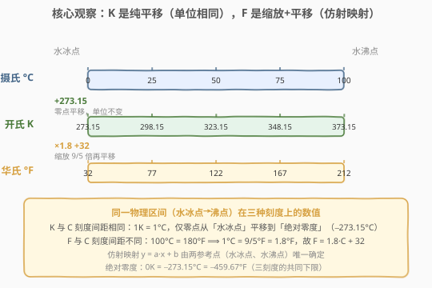
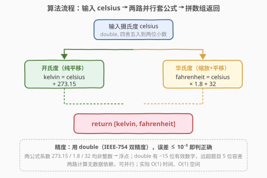

# 温度转换

- **题目名称**：温度转换
- **链接**：[2469. 温度转换](https://leetcode.cn/problems/convert-the-temperature/)
- **难度**：简单
- **标签**：数学、模拟

## 1. 题目概述

给定一个四舍五入到两位小数的非负浮点数 `celsius` 表示**摄氏度**（Celsius）。需要将其转换为**开氏度**（Kelvin）与**华氏度**（Fahrenheit），以数组 $\text{ans}=[\text{kelvin},\text{fahrenheit}]$ 的形式返回。

转换公式：

- 开氏度 $=$ 摄氏度 $+ 273.15$
- 华氏度 $=$ 摄氏度 $\times 1.80 + 32.00$

**示例 1**：

```text
输入：celsius = 36.50
输出：[309.65000, 97.70000]
解释：36.50°C 转开氏度 = 36.50 + 273.15 = 309.65；转华氏度 = 36.50 × 1.8 + 32 = 97.70。
```

**示例 2**：

```text
输入：celsius = 122.11
输出：[395.26000, 251.79800]
解释：122.11°C 转开氏度 = 395.26；转华氏度 = 122.11 × 1.8 + 32 = 251.798。
```

**约束条件**：

- $0 \le \text{celsius} \le 1000$
- 与实际答案误差不超过 $10^{-5}$ 视为正确。

> 💡 本题是纯粹的「套公式」签到题——两次算术运算即可。但公式背后藏着一条值得理解的主线：**温标之间的换算都是仿射映射** $y=a\cdot x+b$，由两个物理参考点（水的冰点与沸点）唯一确定。抓住这条主线，所有温标换算都能徒手推出而不必死记。

---

## 2. 解题思路

### 2.1 朴素思路：直接套两个公式

最直白的做法是按题面给的两条公式照搬：

```text
kelvin     = celsius + 273.15
fahrenheit = celsius * 1.8  + 32
return [kelvin, fahrenheit]
```

两次浮点运算，$O(1)$ 时间、$O(1)$ 空间，没有任何优化空间——本题的最优解与朴素解完全重合。难点不在「算」，而在「为什么是这两个公式」「浮点精度够不够」「能否从原理推出而非背诵」。

> ⚠️ 签到题的价值在于「理解公式由来」而非「通过与否」。下文从两个物理参考点出发，徒手推出两条公式，把死记的常数 $273.15$、$1.8$、$32$ 还原为可推导的结构量。

### 2.2 核心观察：温标变换是仿射映射



**关键洞察**：任意两种温标之间的换算都是**仿射映射** $y = a\cdot x + b$（线性缩放 $a$ + 平移 $b$），其中 $a$ 由「单位长度比」决定、$b$ 由「零点偏移」决定。两种温标只要共享**两个**标定参考点，$a$ 与 $b$ 就被唯一确定。

#### 开氏度：纯平移（$a=1, b=273.15$）

开氏度与摄氏度采用**相同的单位间隔**（$1\text{K} = 1\text{°C}$），只是把零点从「水的冰点」平移到「绝对零度」。实验测定绝对零度 $= -273.15\text{°C}$，故：

$$
K = C + 273.15 \qquad (a=1,\ b=273.15)
$$

「单位相同，只移零点」意味着 $a=1$，仿射退化成纯平移。

#### 华氏度：缩放 + 平移（$a=1.8, b=32$）

华氏度与摄氏度的**单位间隔不同**。用水的两个相变点标定：

| 参考点 | 摄氏 $C$ | 华氏 $F$ |
|--------|----------|----------|
| 水的冰点 | $0$ | $32$ |
| 水的沸点 | $100$ | $212$ |

代入仿射 $F = a\cdot C + b$：

- 冰点：$a\cdot 0 + b = 32 \Rightarrow b = 32$
- 沸点：$a\cdot 100 + 32 = 212 \Rightarrow a = \dfrac{212-32}{100} = \dfrac{180}{100} = 1.8 = \dfrac{9}{5}$

于是：

$$
F = \frac{9}{5}\cdot C + 32 \qquad (a=\tfrac{9}{5},\ b=32)
$$

> 💡 **为什么是 $1.8$？** 华氏标度把水的冰点到沸点切成 $180$ 格（$32\to 212$），摄氏切成 $100$ 格（$0\to 100$）。同样一段物理区间，华氏格数是摄氏的 $\frac{180}{100}=1.8$ 倍，故 $1\text{°C}$ 的温差对应 $1.8\text{°F}$。这就是 $a=1.8$ 的物理来源——**单位密度比**。

> 💡 **为什么是 $273.15$？** 这是绝对零度在摄氏标度上的读数（实验测定值）。开氏度刻意把零点对齐绝对零度，于是「水冰点 $0\text{°C}$」在开氏标度上读作 $273.15\text{K}$。$273.15$ 不是任意常数，而是物理常量。

### 2.3 算法流程图



两路计算**无数据依赖**，可并行执行：

1. **输入**：读取 `celsius`（double，已四舍五入到两位小数）；
2. **左路（开氏）**：$\text{kelvin} = \text{celsius} + 273.15$，纯加法；
3. **右路（华氏）**：$\text{fahrenheit} = \text{celsius} \times 1.8 + 32$，乘加两步；
4. **拼接**：返回 $[\text{kelvin}, \text{fahrenheit}]$。

> ⚠️ **精度**：题目要求误差 $\le 10^{-5}$。`double`（IEEE-754 双精度）有约 $15$ 位有效数字，而输入仅两位小数、系数 $273.15/1.8/32$ 至多两位小数，乘加结果的相对误差远低于 $10^{-5}$，无需任何特殊精度处理。若用 `float`（约 $7$ 位有效数字）也勉强够用，但工程上温标换算一律用 `double`，避免边界累积误差。

### 2.4 示例演算

![示例演算：celsius=36.50→[309.65,97.70]；celsius=122.11→[395.26,251.798]](../images/tempconvert_example_walkthrough.svg)

**示例 1** $\text{celsius} = 36.50$：

- 开氏度：$36.50 + 273.15 = 309.65$（纯加法，无精度损失）
- 华氏度：$36.50 \times 1.8 = 65.70$，再 $+ 32 = 97.70$
- 返回 $[309.65000, 97.70000]$ ✓

**示例 2** $\text{celsius} = 122.11$：

- 开氏度：$122.11 + 273.15 = 395.26$
- 华氏度：$122.11 \times 1.8 = 219.798$，再 $+ 32 = 251.798$
- 返回 $[395.26000, 251.79800]$ ✓

> 💡 示例 2 的华氏度出现三位小数（$251.798$），源于 $122.11 \times 1.8$ 中 $1.8=\frac{9}{5}$ 的分母 $5$ 与 $122.11$ 的百分位 $1$ 组合产生 $0.018$ 的尾数。题目输出允许任意位数小数，只要误差 $\le 10^{-5}$ 即可，故不必格式化保留几位。

---

## 3. 参考代码

### C++

```cpp
class Solution {
public:
    vector<double> convertTemperature(double celsius) {
        return {celsius + 273.15, celsius * 1.80 + 32.00};
    }
};
```

> 💡 用初始化列表 `{...}` 一行返回两个 `double`，编译器自动构造 `vector<double>`。`celsius + 273.15` 与 `celsius * 1.80 + 32.00` 是两条独立表达式，编译器可 reorder 甚至并行。常数写成 `1.80`、`32.00` 强调 `double` 字面量（虽然 `1.8` 默认已是 `double`）。

### Python

```python
class Solution:
    def convertTemperature(self, celsius: float) -> list[float]:
        return [celsius + 273.15, celsius * 1.80 + 32.00]
```

> 💡 Python 浮点即 C 的 `double`，精度同。返回 `list[float]`。也可写 `tuple` 但题目要求数组。Python 大数无溢出，但本题值域 $[0, 1000]$，开氏最大 $1273.15$，远无溢出风险。

---

## 4. 复杂度分析

| 维度 | 复杂度 | 说明 |
|------|--------|------|
| **时间复杂度** | $O(1)$ | 两次浮点算术运算，常数步 |
| **空间复杂度** | $O(1)$ | 仅返回长度为 $2$ 的数组 |
| 对照：单路串行 | $O(1)$ | 两路无依赖，并行不影响渐进阶，仅常数因子减半 |
| 对照：float 实现 | $O(1)$ | 约 $7$ 位有效数字，本题误差 $\sim 10^{-6}$ 仍满足 $\le 10^{-5}$ |

> 💡 本题无优化空间——$O(1)$ / $O(1)$ 已是理论下界（至少要读一个输入、写两个输出）。工程上的关注点不在复杂度，而在**精度**与**公式正确性**：用 `double`、系数与题面一致即可。

---

## 5. 扩展：温标的物理起源与仿射映射的确定

### 5.1 三温标的零点与单位

| 温标 | 零点定义 | 单位间隔 | 与摄氏的关系 |
|------|----------|----------|--------------|
| 摄氏 °C | 水的冰点（$0$） | $1\text{°C} = \frac{100}{\text{水冰点到沸点}}$ | 基准 |
| 开氏 K | 绝对零度（$0\text{K}=-273.15\text{°C}$） | $1\text{K} = 1\text{°C}$ | 纯平移 $+273.15$ |
| 华氏 °F | 盐水冰点（$0$，历史定义） | $1\text{°F} = \frac{1}{1.8}\text{°C}$ | 缩放 $\times\frac{9}{5}$ 再平移 $+32$ |

摄氏与开氏共享单位间隔（$a=1$），仅零点不同；华氏的单位间隔不同（$a=1.8$），零点也不同（$b=32$）。

### 5.2 仿射映射由两点唯一确定

仿射映射 $y = a\cdot x + b$ 有两个未知数 $a, b$，需两个方程（两个标定点）求解。水温的两个相变点（冰点、沸点）因**复现性好**被广泛用作标定：

- 给定 $C_1 \to K_1$ 与 $C_2 \to K_2$：$a=\frac{K_2-K_1}{C_2-C_1}$，$b=K_1 - a\cdot C_1$。
- 开氏 vs 摄氏：$a=\frac{373.15-273.15}{100-0}=1$，$b=273.15-1\cdot 0=273.15$ ✓
- 华氏 vs 摄氏：$a=\frac{212-32}{100-0}=1.8$，$b=32-1.8\cdot 0=32$ ✓

> 💡 **推广到任意温标**：只要知道新温标在水的冰点与沸点的两个读数 $y_0$、$y_1$，即可立即写出 $y = \frac{y_1-y_0}{100}\cdot C + y_0$。例如兰氏度（Rankine）：冰点 $491.67\text{°R}$、沸点 $671.67\text{°R}$，则 $a=\frac{671.67-491.67}{100}=1.8$、$b=491.67$，即 $R = 1.8\cdot C + 491.67 = 1.8\cdot(C+273.15) = 1.8\cdot K$——兰氏度恰是「开氏度的华氏版」（单位用华氏的格、零点用绝对零度）。两套常数靠两点标定就能互推，无需记忆。

### 5.3 浮点精度的安全边界

题目容差 $10^{-5}$，输入至多两位小数。最坏情形 $\text{celsius}=1000$，华氏度 $= 1000\times 1.8 + 32 = 1832$。`double` 的机器精度 $\approx 2.2\times 10^{-16}$，乘加后的绝对误差约 $1832 \times 2.2\times 10^{-16} \approx 4\times 10^{-13}$，远小于 $10^{-5}$。即使把 `1.8` 写成最接近的 `double` 表示（$1.8$ 在二进制中是无限循环小数，存储有 $\sim 10^{-17}$ 的截断误差），最终误差仍 $< 10^{-10}$。故本题用 `double` 永远安全，无需 Kahan 求和或高精度库。

> ⚠️ 唯一需注意：若题目改为「输出须精确到两位小数」而非「误差 $10^{-5}$」，则须用 `printf("%.2f")` 格式化，避免 `1.005` 这类**银行家舍入**边界（$1.005$ 在 `double` 中实际存为 $1.00499999\ldots$，`%.2f` 会得到 `1.00` 而非 `1.01`）。本题只要求误差，故无此坑。

---

## 6. 面试要点

1. **为什么开氏度换算是纯加法 $+273.15$，而华氏度要乘 $1.8$ 再加 $32$？**

   > 开氏度与摄氏度共享单位间隔（$1\text{K} = 1\text{°C}$），只是零点不同：开氏把零点定在绝对零度（$-273.15\text{°C}$），故 $K = C + 273.15$，仿射系数 $a=1$ 退化为纯平移。华氏度单位间隔是摄氏的 $\frac{9}{5}$ 倍（水冰点到沸点华氏切 $180$ 格、摄氏切 $100$ 格），且零点不同（冰点读 $32$），故 $a=1.8$、$b=32$，需缩放 + 平移。

2. **公式里的 $273.15$、$1.8$、$32$ 是怎么来的？**

   > $273.15$ 是绝对零度在摄氏标度上的实验测定值；$1.8 = \frac{180}{100}$ 是水冰点到沸点在华氏与摄氏标度上的格数比；$32$ 是水冰点在华氏标度上的读数。三者都源自用水的两个相变点（冰点 $0\text{°C}/32\text{°F}$、沸点 $100\text{°C}/212\text{°F}$）对仿射映射 $y=a\cdot C+b$ 的两点标定。

3. **用 `float` 还是 `double`？为什么？**

   > 用 `double`。`float` 约 $7$ 位有效数字，$\text{celsius}=1000$ 时华氏 $\approx 1832$，有效数字约 $4$ 位整数位 + $3$ 位小数，误差 $\sim 10^{-4}$ 量级，虽能勉强通过 $10^{-5}$ 容差但安全裕度极薄。`double` 有 $15$ 位有效数字，误差 $\sim 10^{-13}$，远超要求。工程惯例：浮点物理量一律 `double`，除非内存/带宽受限（如 GPU 训练用 `float`/`half`）。

4. **能否不背公式，现场推出华氏转摄氏？**

   > 可以。记水的冰点 $0\text{°C}=32\text{°F}$、沸点 $100\text{°C}=212\text{°F}$。设 $F=a\cdot C+b$，代入冰点得 $b=32$，代入沸点得 $a=\frac{212-32}{100}=1.8$。逆映射 $C=\frac{F-32}{1.8}=\frac{5}{9}(F-32)$。掌握「两点标定仿射」即可徒手推出任意温标互换。

5. **题目要求误差 $10^{-5}$，是否需要特殊精度处理？**

   > 不需要。`double` 的机器精度 $\sim 10^{-16}$，本题值域内乘加误差 $\sim 10^{-13}$，比容差低 $8$ 个数量级。只有当输入是「需要精确表示的十进制小数」（如金融金额）时才需 `decimal` 或整数化处理；温度这种**测量值**天然有误差，浮点足够。

> 💡 **一句话总结**：温标换算是仿射映射 $y=a\cdot x+b$，由水的冰点/沸点两点标定——开氏 $a=1,b=273.15$（纯平移），华氏 $a=1.8,b=32$（缩放+平移）。用 `double` 套两条公式一行返回，$O(1)$ / $O(1)$，精度远超 $10^{-5}$ 容差。

---

## 7. 同类练习题

- [2413. 最小偶倍数](https://leetcode.cn/problems/smallest-even-multiple/)（[题解](../2401-2500/2413_最小偶倍数.md)）：同为「数学/位运算」签到题，对照「公式压缩到一行」的极简形态，把死记的常数还原为可推导的结构量
- [1281. 整数各位积和之差](https://leetcode.cn/problems/subtract-the-product-and-sum-of-digits-of-an-integer/)（[题解](../1201-1300/1281_整数各位积和之差.md)）：同为「直接套公式」的 $O(1)$ 简单算术题，对照「无数据依赖的两路并行运算」骨架
- [258. 各位相加](https://leetcode.cn/problems/add-digits/)（[题解](../0201-0300/258_各位相加.md)）：简单算术 + 数位处理，对照「迭代版 $O(\log n)$ vs 数学公式 $O(1)$」两种形态
- [504. 七进制数](https://leetcode.cn/problems/base-7/)（[题解](../0501-0600/504_七进制数.md)）：进制转换，同属「数/制的线性映射」家族，对照「整数基底变换」与「浮点仿射变换」两种 $y=ax+b$ 的具体形态
- [507. 完美数](https://leetcode.cn/problems/perfect-number/)（[题解](../0501-0600/507_完美数.md)）：简单数学判定，对照「枚举到 $\sqrt{n}$ 成对计数」与「直接套公式」两种把常数还原为结构的思路
