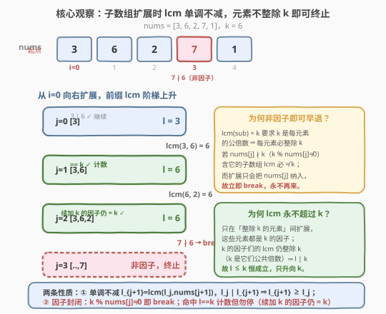
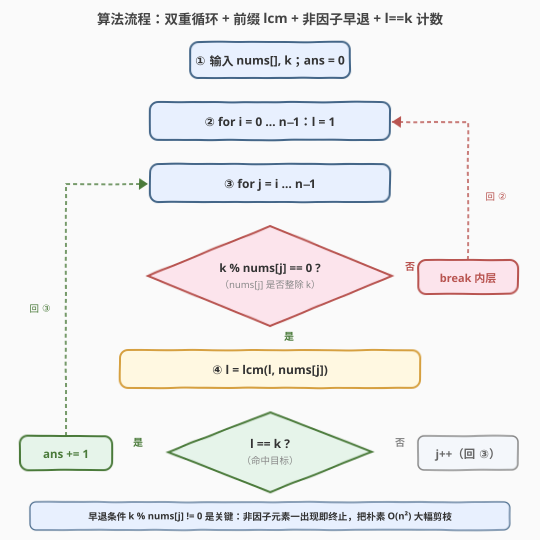
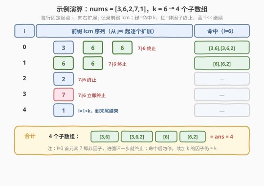

# 最小公倍数等于 K 的子数组数目

- **题目名称**：最小公倍数等于 K 的子数组数目
- **链接**：[2470. 最小公倍数等于 K 的子数组数目](https://leetcode.cn/problems/number-of-subarrays-with-lcm-equal-to-k/)
- **难度**：中等
- **标签**：数组、数学、数论

## 1. 题目概述

给你一个整数数组 `nums` 和一个整数 `k`，统计并返回 `nums` 的**子数组**中元素的最小公倍数（LCM）等于 `k` 的子数组数目。

子数组是数组中一个**连续非空**的序列；数组的最小公倍数是可被数组中所有元素整除的最小正整数。

**示例 1**：

```text
输入：nums = [3,6,2,7,1], k = 6
输出：4
解释：lcm 等于 6 的子数组有 [3,6]、[3,6,2]、[6]、[6,2]，共 4 个。
```

**示例 2**：

```text
输入：nums = [3], k = 2
输出：0
解释：不存在 lcm 等于 2 的子数组。
```

**约束条件**：

- $1 \le \texttt{nums.length} \le 1000$
- $1 \le \texttt{nums[i]},\ \texttt{k} \le 1000$

> 💡 本题是 [2447. 最大公因数等于 K 的子数组数目](../2401-2500/2447_最大公因数等于K的子数组数目.md) 的「对偶」姊妹题：把聚合算子从 gcd（单调不增）换成 lcm（单调不减），早退判据也由「$k \nmid g$」换成「$\text{nums}[j] \nmid k$」。约束上 $V=\max \text{nums}\le 1000$（远小于 2447 的 $10^9$），故 $O(n^2)$ 必过、且 lcm 永不溢出。

---

## 2. 解题思路

### 2.1 暴力思路：枚举所有子数组 + 复用前缀 lcm

朴素做法：枚举每个子数组 $[i, j]$，独立计算 $\text{lcm}(\text{nums}[i], \dots, \text{nums}[j])$，等于 $k$ 则计数。若每次独立求 lcm 要扫一遍区间，共 $O(n^2)$ 个子数组、每个 $O(n)$，总计 $O(n^3)$，$n \le 1000$ 时 $10^9$ 级，超时。

第一个改进是**复用前缀 lcm**：固定起点 $i$，向右扩展 $j$ 时维护 $l = \text{lcm}(l,\ \text{nums}[j])$，每步 $O(\log V)$（$V = \max \text{nums}$），总 $O(n^2 \log V) \approx 10^6 \times 10$，可 AC。但若就此打住，仍未利用「单调性 + 因子封闭」做**早退剪枝**。

> ⚠️ 关键差距：朴素版对每个起点都老老实实扫到底，哪怕早已遇到不可能出现在任何合法子数组里的元素。下文用两条性质把这种「明知无望仍硬扫」的步数砍掉。

### 2.2 核心观察：lcm 单调不减 + 元素不整除 k 即可终止



两条关键性质让内层循环得以提前终止：

- **单调不减**：扩展时 $l_{j+1} = \text{lcm}(l_j,\ \text{nums}[j+1])$，而 $l_j \mid l_{j+1}$（lcm 必是其操作数的倍数），故 $l_{j+1} \ge l_j$。lcm 只增不减。
- **因子封闭（关键）**：若 $\text{lcm}(\text{sub}) = k$，则 $k$ 是 sub 中每个元素的公倍数，即**每个元素必整除 $k$**。于是「$\text{nums}[j]$ 能否出现在某合法子数组里」等价于「$\text{nums}[j] \mid k$」：
  - 若 $\text{nums}[j] \mid k$（即 $k \bmod \text{nums}[j] = 0$），它可能是合法子数组的一员，继续扩展；
  - 若 $\text{nums}[j] \nmid k$（$k \bmod \text{nums}[j] \ne 0$），含它的任何子数组 lcm 都不是 $k$ 的因子结构 → lcm 必 $\ne k$，而扩展只会把 $\text{nums}[j]$ 纳入，**立刻 `break`**。

**顺带的好处**：只在「整除 $k$ 的元素」之间扩展时，这些元素都是 $k$ 的因子；$k$ 的因子们的 lcm 仍整除 $k$（因 $k$ 是它们的一个公共倍数，lcm 作为最小公倍数必整除任一公倍数），故 $l \mid k$、$l \le k$ **恒成立**——lcm 只升向 $k$、永不超过 $k$，免去溢出与「$l > k$ 再 break」的判断。

**计数但不停止**：当 $l = k$ 时计数 $+1$，但**不能 break**——后续若加入 $k$ 的因子，lcm 仍维持 $k$，这些更长的子数组同样合法。例如 $\text{nums}=[3,6,2],\ k=6$：$l_0=3$（$3\mid6$ 继续），$l_1=\text{lcm}(3,6)=6$（命中），$l_2=\text{lcm}(6,2)=6$ 仍命中，$[3,6,2]$ 也算一个。

> 💡 **为何早退如此有效？** 只要遇到不整除 $k$ 的元素（如示例中 $i=3$ 处的 $7$），该起点内层循环第一步就 break。极端情形 $k=1$ 时一切元素都整除 $1$、永不 break，此时答案可达 $\Theta(n^2)$（输出本身就那么大），$O(n^2)$ 即该情形下界，本算法此时最优。

### 2.3 算法流程图



伪代码骨架：

```text
ans = 0
for i in 0..n-1:
    l = 1
    for j in i..n-1:
        if k % nums[j] != 0: break   # nums[j] 不整除 k，含它的子数组 lcm 必 ≠ k
        l = lcm(l, nums[j])
        if l == k: ans += 1           # 命中；勿 break，续加 k 的因子仍 = k
return ans
```

> ⚠️ 三个易错点：① `l` 初值取 $1$，利用 $\text{lcm}(1, x) = x$ 让首个元素直接进位；② `break` 判据用 `k % nums[j] != 0`（元素是否整除 $k$）而非 `l > k`——得益于因子封闭，$l$ 永不超 $k$，且非因子判据能在 $l$ 还很小时就提前终止；③ 命中 `l == k` 后**勿 break**，因子续加仍 $= k$。

### 2.4 示例演算



以 $\text{nums}=[3,6,2,7,1],\ k=6$ 为例，逐起点展开（$l$ 初值 $1$）：

| $i$ | $j$ 扩展路径 | 前缀 lcm 序列 | 命中子数组 |
|-----|-------------|--------------|-----------|
| 0 | $0 \to 1 \to 2$（遇 $7$ break） | $3,\ 6,\ 6$ | $[3,6],\ [3,6,2]$（$l=6$ ✓×2） |
| 1 | $1 \to 2$（遇 $7$ break） | $6,\ 6$ | $[6],\ [6,2]$（$l=6$ ✓×2） |
| 2 | $2$（遇 $7$ break） | $2$ | —（$l=2<6$） |
| 3 | $3$ | —（$7\nmid6$，break） | — |
| 4 | $4$ | $1$ | —（$l=1<6$） |

合计 **4 个**：$[3,6],\ [3,6,2],\ [6],\ [6,2]$ ✓。

> 💡 注意 $i=0$ 处 $l=3<6$ 但 $3\mid6$ 故继续，下一步入 $l=6$ 命中、再下一步仍 $6$ 命中——这正是「命中后勿停、续加因子仍 = k」的体现；而 $i=3$ 首元素 $7$ 即 $7\nmid6$，内层只跑一步即终止。

---

## 3. 参考代码

### C++

```cpp
class Solution {
public:
    int subarrayLCM(vector<int>& nums, int k) {
        int n = nums.size(), ans = 0;
        for (int i = 0; i < n; ++i) {
            int l = 1;
            for (int j = i; j < n; ++j) {
                if (k % nums[j] != 0) break;   // nums[j] 不整除 k，含它的子数组 lcm 必 ≠ k
                l = lcm(l, nums[j]);
                if (l == k) ++ans;            // 命中；勿 break，续加 k 的因子仍 = k
            }
        }
        return ans;
    }
};
```

> 💡 `lcm` 来自 `<numeric>`（C++17），$\text{lcm}(1, x) = x$。因只对「整除 $k$ 的元素」求 lcm，$l \mid k$ 恒成立，$l \le k \le 1000$，`int` 绰绰有余、绝无溢出——这是本题约束 $V \le 1000$ 相对 2447（$V \le 10^9$）最友好的地方。

### Python

```python
import math
from typing import List

class Solution:
    def subarrayLCM(self, nums: List[int], k: int) -> int:
        n = len(nums)
        ans = 0
        for i in range(n):
            l = 1
            for j in range(i, n):
                if k % nums[j] != 0:      # nums[j] 不整除 k，含它的子数组 lcm 必 ≠ k
                    break
                l = math.lcm(l, nums[j]) # lcm(1, x) = x
                if l == k:               # 命中；勿 break，续加 k 的因子仍 = k
                    ans += 1
        return ans
```

> 💡 Python 3.9+ 的 `math.lcm(1, x) = abs(x)`，正整数场景即 `x`。整除判定 `k % nums[j] != 0` 与 C++ 同义。$n \le 1000$，双层循环 + 早退在 Python 也轻松 AC。

---

## 4. 复杂度分析

| 维度 | 复杂度 | 说明 |
|------|--------|------|
| **时间复杂度** | $O(n^2 \log V)$ 最坏；实际接近 $O(n \log V)$ | $V = \max \text{nums} \le 1000$。单步 lcm 为 $O(\log V)$；最坏（如 $k=1$）需枚举全部 $O(n^2)$ 子数组；$k$ 因子稀疏时多数起点遇非因子即 break |
| **空间复杂度** | $O(1)$ | 仅常数变量 $l,\ i,\ j,\ \text{ans}$ |
| 对照：朴素 $O(n^3)$ | $O(n^3)$ | 每个子数组独立求 lcm，不复用前缀 |
| 对照：命中即停优化 | 同 $O(n^2 \log V)$ | 见第 5 节，命中后一次性累加剩余因子，常数更小 |

> 💡 关键在**早退条件 $k \bmod \text{nums}[j] \ne 0$** 的剪枝：每个起点一旦遇到「非 $k$ 因子」即停。最坏情形 $k=1$（一切元素整除 $1$、永不 break）答案本身可达 $\Theta(n^2)$ 个，故 $O(n^2)$ 已是该情形下界，本算法此时最优。

---

## 5. 扩展：命中即停的一次性累加

当 $n$ 放大、或想压常数时，可利用「命中后所有续加因子仍 $= k$」这一性质做批量计数：一旦 $l == k$，从当前位置往后**连续**的「整除 $k$ 的元素」都会让 $l$ 维持 $k$，每个都是合法子数组。于是不必逐个 ++，而是向后数出连续因子的个数 $c$，一次性 $\textit{ans} \mathrel{+}= c$，再跳过这一段：

```text
ans = 0
for i in 0..n-1:
    l = 1
    j = i
    while j < n and k % nums[j] == 0:        # 跳过非因子由 break 自然处理
        l = lcm(l, nums[j])
        if l == k:
            c = 0
            while j < n and k % nums[j] == 0:  # 续加因子仍 = k
                c += 1
                j += 1
            ans += c
            break                               # 这一段已吃完，换下一个起点
        j += 1
```

> ⚠️ 此优化只压**常数**，渐近仍 $O(n^2)$（外层起点 $i$ 不变）。真正把子数组 lcm 计数压到 $O(n \log V)$ 需「以结尾位置聚合的 lcm 段表」，与 2447 第 5 节的 gcd 段表对偶：以 $j$ 结尾的子数组 lcm 取值至多 $O(\log V)$ 种（lcm 每变一次至少翻倍，$l' \mid l$ 且 $l' > l \Rightarrow l' \ge 2l$）。本题 $n \le 1000$ 用不上，但这是「子数组 lcm 计数」的标准最优解，迁移到 $n = 10^5$ 的变体（如「不同子数组 lcm 的数目」）即派上用场。

> 💡 gcd 段表「每变一次折半」与 lcm 段表「每变一次翻倍」是对偶的：因 $g' \mid g$（缩小至少折半）与 $l' \mid_\text{倍} l$（放大至少翻倍），都把取值种数压到 $O(\log V)$。两者同属「子数组 + 单调聚合量」家族，与 [713 乘积小于 K 的子数组](../0701-0800/713_乘积小于K的子数组.md) 的滑窗并列。

---

## 6. 面试要点

1. **为什么 lcm 随子数组扩展单调不减？**

   > $l_{j+1} = \text{lcm}(l_j,\ \text{nums}[j+1])$。由 lcm 定义 $l_j \mid l_{j+1}$（lcm 是其每个操作数的倍数），故 $l_{j+1} \ge l_j$。直观上：候选公倍数集合随元素增多只会**扩张**（每加一个数，对公倍数提出更多约束），最小者自然不减。

2. **早退条件为什么是 `k % nums[j] != 0` 而不是 `l > k`？**

   > `l > k` 在「不做因子过滤」时也可用（lcm 单调不减，一旦超 $k$ 回不来），但得益于因子封闭——只要只收整除 $k$ 的元素，$l \mid k$ 恒成立、$l$ 永不超 $k$，`l > k` 根本触发不了。正确且更强的判据是「$\text{nums}[j]$ 是否还能出现在合法子数组里」，即 $\text{nums}[j] \mid k$，对应 `k % nums[j] == 0`；非因子一出现立刻 break，比等 $l$ 长到超 $k$ 早得多。

3. **命中 $l == k$ 时为什么不 break？**

   > lcm 命中 $k$ 后，若续加 $k$ 的因子，新 $l' = \text{lcm}(k,\ \text{$k$ 的因子}) = k$ 不变，仍是合法子数组。break 会漏数这些更长子数组。如 $[3,6,2],\ k=6$：$[3,6]$ 与 $[3,6,2]$ 都应计。只有 `k % nums[j] != 0`（非因子）才 break。

4. **`l` 初值为何取 1？`lcm(1, x)` 是多少？**

   > 数论约定 $\text{lcm}(1, x) = x$（1 是任何数的因子，故 lcm 为另一数本身）。取 $l = 1$ 让首步 $l = \text{lcm}(1,\ \text{nums}[i]) = \text{nums}[i]$ 自然进位，无需特判 $j = i$。C++17 `std::lcm` 与 Python `math.lcm` 都遵循此约定。

5. **为什么「$k$ 的因子们的 lcm 仍整除 $k$」？**

   > 设 $d_1,\dots,d_m$ 都整除 $k$（即 $k$ 是它们的公共倍数）。lcm 是「最小公共倍数」，而任何公共倍数都是 lcm 的倍数；$k$ 作为一个公共倍数，故 $\text{lcm}(d_1,\dots,d_m) \mid k$。这保证了「只在因子间扩展」时 $l \le k$ 恒成立，免去溢出与越界判断——也是本题 $V \le 1000$ 约束下选「因子 break」而非「$l>k$ break」的核心理由。

> 💡 **一句话总结**：固定起点维护前缀 lcm，`k % nums[j] != 0` 即 break、`l == k` 则计数但勿停——利用「lcm 单调不减 + 因子封闭（$l \mid k$ 恒成立）」把朴素 $O(n^2)$ 在 $k$ 因子稀疏时剪到接近 $O(n)$，$O(1)$ 空间。

---

## 7. 同类练习题

- [2447. 最大公因数等于 K 的子数组数目](https://leetcode.cn/problems/number-of-subarrays-with-gcd-equal-to-k/)（[题解](../2401-2500/2447_最大公因数等于K的子数组数目.md)）：本题的 gcd 对偶——gcd 单调不增用「$k \nmid g$」早退，对照 lcm 单调不减用「$\text{nums}[j] \nmid k$」早退，两套判据互为镜像
- [2427. 公因子的数目](https://leetcode.cn/problems/number-of-common-factors/)（[题解](../2401-2500/2427_公因子的数目.md)）：gcd 与约数计数基础，承接本题对整除性质与「$k$ 的因子」集合的理解
- [1979. 找出数组的最大公约数](https://leetcode.cn/problems/find-greatest-common-divisor-of-array/)（[题解](../1901-2000/1979_找出数组的最大公约数.md)：数组 $\gcd$ 的直接练习，与 lcm 同源于辗转相除，承接「整除/公倍数」性质
- [914. 卡牌分组](https://leetcode.cn/problems/x-of-a-kind-in-a-deck-of-cards/)（[题解](../0901-1000/914_卡牌分组.md)：多频率 $\gcd$ 聚合是否 $\ge 2$，对照「两数 gcd/lcm」与「多元素聚合」
- [713. 乘积小于 K 的子数组](https://leetcode.cn/problems/subarray-product-less-than-k/)（[题解](../0701-0800/713_乘积小于K的子数组.md)：同为「子数组计数 + 单调聚合量」，正数乘积单调增用滑窗计数 $r-l+1$，对照 lcm 单调不减的早退剪枝
