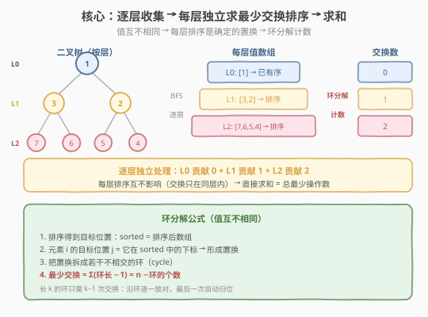
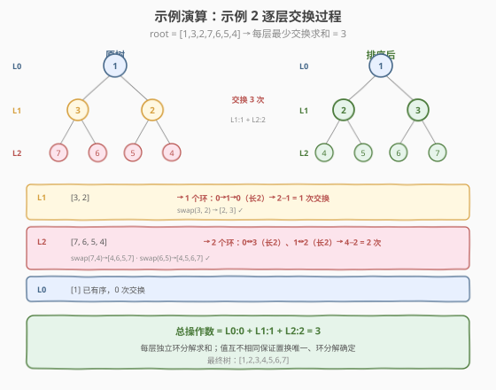

# LeetCode 逐层排序二叉树的最少操作数 题解

## 1. 题目概述

- **标题 / 题号**：逐层排序二叉树的最少操作数（#2471，medium）
- **链接**：https://leetcode.cn/problems/minimum-number-of-operations-to-sort-a-binary-tree-by-level/
- **难度**：中等
- **标签**：树、二叉树、广度优先搜索（BFS）、排序、置换环

**题意**：给你一棵 **值互不相同** 的二叉树的根节点 `root`。在一步操作中，你可以选择 **同一层** 上任意两个节点，交换它们的值。返回使每一层都按 **严格递增顺序** 排序所需的最少操作数目。节点的 **层数** 是该节点和根节点之间的边数（根节点层数为 0）。

**示例 1**：

```text
输入：root = [1,4,3,7,6,8,5,null,null,null,null,9,null,10]
输出：3
解释：
- 交换 4 和 3，第 2 层变为 [3,4]。
- 交换 7 和 5，第 3 层变为 [5,6,8,7]。
- 交换 8 和 7，第 3 层变为 [5,6,7,8]。
共 3 步操作。
```

**示例 2**：

```text
输入：root = [1,3,2,7,6,5,4]
输出：3
解释：
- 交换 3 和 2，第 2 层变为 [2,3]。
- 交换 7 和 4，第 3 层变为 [4,6,5,7]。
- 交换 6 和 5，第 3 层变为 [4,5,6,7]。
共 3 步操作。
```

**示例 3**：

```text
输入：root = [1,2,3,4,5,6]
输出：0
解释：每一层已按递增顺序排序，返回 0。
```

**约束**：

- 树中节点的数目在范围 $[1, 10^5]$ 内
- $1 \le \text{Node.val} \le 10^5$
- 树中的所有值 **互不相同**

> 💡 两个关键条件决定了本题的最优解法：① **操作只在同一层内**——每层排序互不影响，可逐层独立计数后求和；② **值互不相同**——每层排序结果是唯一确定的，对应一个确定的置换，可用 **置换环分解** 直接算出最少交换数，无需搜索或模拟。

## 2. 解题思路

### 2.1 暴力思路：模拟交换

最直白的想法：用 BFS 逐层收集节点值，对每层**模拟排序过程**——每一步找一个不在正确位置上的元素，交换到它该去的地方，直到整层有序，累计交换次数。

```text
ans = 0
queue = [root]
while queue 非空:
    level = 本层节点值数组
    sorted_level = sorted(level)          # 目标
    i = 0
    while i < len(level):
        if level[i] != sorted_level[i]:
            找到 sorted_level[i] 在 level 中的位置 j
            swap(level[i], level[j])      # 一步操作
            ans += 1
        i += 1
```

这能拿到正确结果，但每层交换后还要在数组里**线性查找**目标值的位置，单层 $O(n^2)$。题目 $n \le 10^5$，最坏一层节点数可达 $n$，$O(n^2)$ 会超时。能否**不模拟交换、直接一步算出最少次数**？

> ⚠️ 暴力模拟的瓶颈在于「边交换边查找」。若把排序看作一个**置换**并分析其结构，可以发现最少交换数只取决于置换的 **环分解**——这是 $O(n \log n)$ 一步到位的解法。

### 2.2 核心观察：置换环分解（$O(n \log n)$）

值互不相同时，把一层的值数组 $a$ 排序后得到唯一的目标数组 $a^*$。从 $a$ 变到 $a^*$ 的过程是一个 **置换** $\pi$：位置 $i$ 上的元素要去往位置 $\pi(i)$。

**关键定理**：任意置换可分解为若干不相交的环。长度为 $k$ 的环，只需 $k - 1$ 次交换即可让环内所有元素归位（沿环逐一交换，最后一个自动归位）。因此

$$\text{最少交换} = \sum_{\text{环 } c} (|c| - 1) = n - \text{（环的个数）}$$

其中 $n$ 为该层节点数。已归位（自环，$k = 1$）的元素贡献 $0$，但计入环的个数。



**构造环的方法**：对值数组 `vals`，建立 `(值, 原下标)` 对并按值排序。排序后第 $j$ 位的 `原下标` $o_j$ 表示「应该放在位置 $j$ 的元素当前在 $o_j$」。沿 $j \to o_j$ 跳转即可走出置换的环。

> 💡 **本质洞察**：「最少交换排序」与「排序方法无关」——它只取决于初始排列到目标排列的置换结构。环分解把「需要多少次交换」变成一个**组合计数**问题，完全跳过了交换模拟。值互不相同是「置换唯一确定」的前提；若有重复值，目标位置不唯一，需用更复杂的最少交换计数。

### 2.3 算法流程图

![环分解：以 L2=[7,6,5,4] 为例求最少交换](../images/minops_sort_level_cycle.svg)

**完整步骤**：

1. **BFS 逐层遍历**：用 `while + for(size)` 模板，每层收集节点值数组 `vals`，同时把子节点入队。
2. **逐层环分解**：对每层 `vals`，建 `(值, 原下标)` 对并排序；沿 `原下标` 跳转找环，累计 `环长 - 1`。
3. **求和返回**：各层交换数相加即为答案。

### 2.4 示例演算

以示例 2 的 `root = [1,3,2,7,6,5,4]` 为例，逐层分解：



| 层 | 原值数组 | 目标（排序后） | 环分解 | 交换数 |
|----|----------|----------------|--------|--------|
| L0 | `[1]` | `[1]` | 1 个自环 | $1 - 1 = 0$ |
| L1 | `[3, 2]` | `[2, 3]` | 1 环：$0 \to 1 \to 0$（长 2） | $2 - 1 = 1$ |
| L2 | `[7, 6, 5, 4]` | `[4, 5, 6, 7]` | 2 环：$0 \leftrightarrow 3$、$1 \leftrightarrow 2$（各长 2） | $(2-1)+(2-1) = 2$ |

总操作数 $= 0 + 1 + 2 = 3$，与示例输出一致。

> 💡 **环个数规律**：L2 的 4 个元素整体反转（$0\leftrightarrow3$、$1\leftrightarrow2$），恰好两两配对成 2 个长度为 2 的环。一般地，完全反转 $n$ 个元素有 $\lfloor n/2 \rfloor$ 个长度为 2 的环，需 $\lfloor n/2 \rfloor$ 次交换——这是「整体反转」的最少代价。

## 3. 参考代码

### C++

```cpp
// 逐层排序二叉树的最少操作数.cpp —— BFS 逐层 + 置换环分解
// 编译: g++ -O2 -std=c++17 逐层排序二叉树的最少操作数.cpp -o minops
#include <vector>
#include <queue>
#include <algorithm>
using namespace std;

struct TreeNode {
    int val;
    TreeNode* left;
    TreeNode* right;
    TreeNode() : val(0), left(nullptr), right(nullptr) {}
    TreeNode(int x) : val(x), left(nullptr), right(nullptr) {}
    TreeNode(int x, TreeNode* l, TreeNode* r) : val(x), left(l), right(r) {}
};

class Solution {
public:
    int minimumOperations(TreeNode* root) {
        int ans = 0;
        queue<TreeNode*> q;
        q.push(root);
        while (!q.empty()) {
            int size = q.size();
            vector<int> vals(size);
            for (int i = 0; i < size; ++i) {
                TreeNode* node = q.front(); q.pop();
                vals[i] = node->val;
                if (node->left)  q.push(node->left);
                if (node->right) q.push(node->right);
            }
            ans += minSwaps(vals);
        }
        return ans;
    }

private:
    // 求把 vals 排成升序的最少交换数（值互不相同 → 置换环分解）
    int minSwaps(vector<int>& vals) {
        int n = vals.size();
        vector<pair<int,int>> pairs(n);
        for (int i = 0; i < n; ++i) pairs[i] = {vals[i], i};
        sort(pairs.begin(), pairs.end());          // 按值排序
        vector<bool> visited(n, false);
        int swaps = 0;
        for (int i = 0; i < n; ++i) {
            if (visited[i] || pairs[i].second == i) continue;  // 已访问或自环
            int cycleLen = 0;
            int j = i;
            while (!visited[j]) {                 // 沿目标位置跳转走环
                visited[j] = true;
                j = pairs[j].second;
                ++cycleLen;
            }
            swaps += cycleLen - 1;                // 长 k 的环贡献 k−1
        }
        return swaps;
    }
};
```

### Python

```python
from collections import deque
from typing import Optional


class TreeNode:
    def __init__(self, val=0, left=None, right=None):
        self.val = val
        self.left = left
        self.right = right


class Solution:
    def minimumOperations(self, root: Optional[TreeNode]) -> int:
        ans = 0
        q = deque([root])
        while q:
            vals = []
            for _ in range(len(q)):            # 本层节点数快照
                node = q.popleft()
                vals.append(node.val)
                if node.left:
                    q.append(node.left)
                if node.right:
                    q.append(node.right)
            ans += self._min_swaps(vals)
        return ans

    def _min_swaps(self, vals: list[int]) -> int:
        n = len(vals)
        pairs = sorted((v, i) for i, v in enumerate(vals))  # 按值排序
        visited = [False] * n
        swaps = 0
        for i in range(n):
            if visited[i] or pairs[i][1] == i:   # 已访问或自环
                continue
            cycle_len = 0
            j = i
            while not visited[j]:                # 沿目标位置跳转走环
                visited[j] = True
                j = pairs[j][1]
                cycle_len += 1
            swaps += cycle_len - 1               # 长 k 的环贡献 k−1
        return swaps
```

> 💡 **语言细节**：C++ 用 `vector<pair<int,int>>` 存 `(值, 原下标)`，`sort` 默认按 `pair.first`（值）升序；Python 用 `sorted((v, i) ...)` 同理按元组首元素排序。两版均用 `visited` 数组避免重复走环，`pairs[i].second/pairs[i][1] == i` 跳过自环（已归位的元素，贡献 0）。

## 4. 复杂度分析

| 维度 | 复杂度 | 说明 |
|------|--------|------|
| **时间复杂度** | $O(n \log n)$ | BFS 遍历 $n$ 个节点 $O(n)$；每层排序 $O(m \log m)$（$m$ 为该层节点数），各层排序之和 $\le O(n \log n)$；环分解每层 $O(m)$，总计 $O(n)$ |
| **空间复杂度** | $O(n)$ | BFS 队列最坏存末层 $O(n)$；每层额外开 `vals`、`pairs`、`visited` 共 $O(m)$，峰值 $O(n)$ |

> ⚠️ **空间可优化**：BFS 队列峰值 $O(n)$ 不可避免（最坏末层占 $n/2$）。每层的辅助数组 `pairs`/`visited` 随层释放，峰值出现在最大层。若树退化为链（每层 1 个节点），空间降至 $O(1)$ 辅助 + $O(1)$ 队列；若为完美树，峰值在末层。

## 5. 扩展：「值有重复」时的最少交换排序

本题的环分解依赖 **值互不相同**（排序唯一、置换确定）。若值可重复，目标排列不唯一，最少交换排序变为 **NP-hard 的最小交换数问题** 的变体——需用「最小交换使数组等于某目标排列」的贪心（枚举目标中重复值的归位顺序），或退化为更复杂的图模型。力扣范围内值互不相同是常见的简化设定，使得环分解一行公式即可求解。

> 💡 **对比**：值互不相同 → 置换唯一 → 环分解 $O(n \log n)$；值有重复 → 目标不唯一 → 需对重复值贪心配对，复杂度上升。面试中若被问「有重复怎么办」，答出「目标不唯一需枚举/贪心」即可体现深度。

## 6. 面试要点

1. **为什么每层可以独立处理、直接求和？**

   - 题目限定每次操作只能选**同一层**的两个节点交换，层与层之间互不影响。因此每层排序是独立的子问题，总操作数 = 各层最少交换数之和。这是「操作域受限」带来的**子问题可加性**。

2. **环分解的公式 $\text{交换} = n - \text{环个数}$ 怎么来的？**

   - 长度为 $k$ 的环，沿环逐一交换：每次把一个元素放到目标位置，第 $k - 1$ 次交换后最后一个自动归位，故贡献 $k - 1$。所有环求和：$\sum (k_c - 1) = \sum k_c - \text{环个数} = n - \text{环个数}$。自环（$k = 1$）贡献 $0$ 但计入环个数，公式仍成立。

3. **「值互不相同」这个条件用在哪里？去掉会怎样？**

   - 用于保证**排序唯一**：相同值无法区分目标位置，置换不确定，环分解公式失效。有重复值时，需对每个重复值组贪心地选择「当前数组中的哪个实例对应目标中的哪个位置」，使交换数最小，属于更复杂的变体。本题约束明确值互不相同，正是为了让环分解直接适用。

4. **BFS 遍历和环分解，哪个是性能瓶颈？**

   - **排序**是瓶颈。BFS 与环分解均为 $O(n)$ 线性，排序每层 $O(m \log m)$，总计 $O(n \log n)$。若用哈希表把「值→目标位置」的映射 $O(m)$ 建好（值互不相同可哈希），可省去排序的比较开销，但渐进复杂度仍受限于排序的 $O(n \log n)$ 下界（基于比较的排序）。

5. **`pairs[i].second == i` 的跳过逻辑是否多余？**

   - 不多余。它跳过**已归位**（自环）的元素：`pairs[i].second == i` 表示排在位置 $i$ 的元素本来就在 $i$，无需交换。不跳过的话会进入「长度 1 的环」，`cycleLen = 1`，贡献 `1 - 1 = 0`，结果正确但多一次无效遍历。跳过是常数优化，也让逻辑更清晰。

> 💡 **一句话总结**：2471 的精髓是「同层操作 → 逐层独立 + 求和」+「值互不相同 → 置换唯一 → 环分解一步计数」。口诀：**同层交换可加性，值不同则环分解，交换 = n − 环数**。

## 同类练习题

| # | 题目 | 与本题的关联 |
|---|------|-------------|
| 765 | [情侣牵手](https://leetcode.cn/problems/couples-holding-hands/)（[题解](../0701-0800/765_情侣牵手.md)） | 同款「置换环分解求最少交换」的母题，公式 $n - c$ 完全一致；本题把「目标排列」具象为升序，765 具象为情侣归位 |
| 2459 | [通过移动项目到空白区域来排序数组](https://leetcode.cn/problems/moving-stones-until-consecutive/)（[题解](../2401-2500/2459_通过移动项目到空白区域来排序数组.md)） | 同为置换环分解的受限变体——只能与空白交换，含/不含空白的环代价不同，对照本题「任意两元素交换」的 $k-1$ 代价 |
| 2415 | [反转二叉树的奇数层](https://leetcode.cn/problems/reverse-odd-levels-of-binary-tree/)（[题解](../2401-2500/2415_反转二叉树的奇数层.md)） | 同款「按层操作」的姊妹题，完美树镜像配对 DFS；本题按层排序，共用 BFS 层序骨架 |
| 102 | [二叉树的层序遍历](https://leetcode.cn/problems/binary-tree-level-order-traversal/)（[题解](../0101-0200/102_二叉树的层序遍历.md)） | BFS `while + for(size)` 层序模板的母题，本题逐层收集的骨架来源 |
