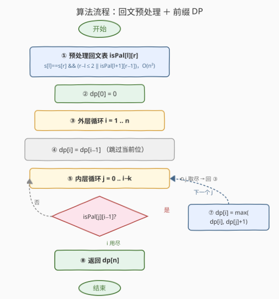
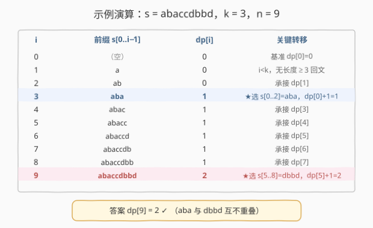
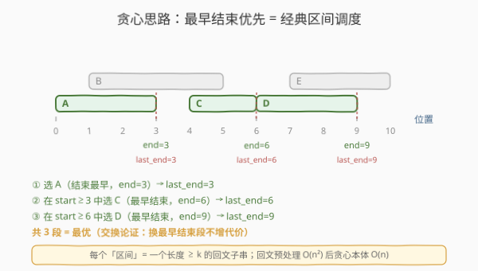

# 不重叠回文子字符串的最大数目

- **题目名称**：不重叠回文子字符串的最大数目
- **链接**：[2472. 不重叠回文子字符串的最大数目](https://leetcode.cn/problems/maximum-number-of-non-overlapping-palindrome-substrings/)
- **难度**：困难
- **标签**：字符串、动态规划、回文、贪心

## 1. 题目概述

给你一个字符串 `s` 和一个**正**整数 `k`。从 `s` 中选出一组满足下列条件且**不重叠**的子字符串：

- 每个子字符串的长度**至少**为 `k`；
- 每个子字符串是一个**回文串**。

返回最优方案中能选出的子字符串的**最大**数目。

**示例 1**：

```text
输入：s = "abaccdbbd", k = 3
输出：2
解释：选 "aba"（s[0..2]）与 "dbbd"（s[5..8]），均为回文且长度 ≥ 3，互不重叠。
```

**示例 2**：

```text
输入：s = "adbcda", k = 2
输出：0
解释：不存在长度 ≥ 2 的回文子串。
```

**约束条件**：

- $1 \le k \le \text{s.length} \le 2000$
- `s` 仅由小写英文字母组成

> 💡 关键观察：「不重叠子串 + 求最大数目（每段权重都为 1）」本质是**区间调度问题**：每个长度 $\ge k$ 的回文子串是一个区间 $[l,r]$，要在所有区间中选出最多互不重叠者。两条路殊途同归：① 前缀 DP（$O(n^2)$，通用、显然正确）；② 最早结束贪心（$O(n^2)$ 预处理 $+\ O(n)$ 贪心，区间调度模板）。本文以 DP 为主解，贪心列于扩展。

---

## 2. 解题思路

### 2.1 暴力思路：枚举子串集合

最直白的做法：先找出所有长度 $\ge k$ 的回文子串（最多 $O(n^2)$ 个候选区间），再在这些区间中枚举所有子集（$2^{n^2}$），挑出互不重叠的最大子集。指数爆炸，$n=2000$ 完全不可行。

> ⚠️ 瓶颈在于把「选哪些子串」当成自由组合去枚举。其实只需关心「前缀 $i$ 字符内最多选几个」这一维状态——选过的子串只要不重叠就不影响后续（无后效性），用 DP 一趟填出即可。

### 2.2 核心观察：预处理回文表 + 前缀 DP

![前缀 DP：dp[i] = max(dp[i−1], dp[j]+1)，当 s[j..i−1] 为长度 ≥ k 回文](../images/nops_dp_concept.svg)

两步走：

1. **预处理回文表 `isPal[l][r]`**（$O(n^2)$）：按子串长度递增填表，转移
   $$\text{isPal}[l][r] = \bigl(s[l]=s[r]\bigr)\ \wedge\ \bigl(r-l\le 2\ \vee\ \text{isPal}[l+1][r-1]\bigr).$$
2. **前缀 DP**：定义 $\text{dp}[i]$ 为前 $i$ 个字符 $s[0..i-1]$ 内能选出的最大不重叠回文子串数。基准 $\text{dp}[0]=0$，转移
   $$\text{dp}[i] = \max\Bigl(\text{dp}[i-1],\ \ \max_{\substack{0\le j \le i-k \\ \text{isPal}[j][i-1]}} \bigl(\text{dp}[j]+1\bigr)\Bigr).$$

- 第一项 $\text{dp}[i-1]$：**不选**任何以 $i-1$ 结尾的子串（跳过当前位）；
- 第二项：**选**一个回文子串 $s[j..i-1]$（长度 $i-j\ge k$），其左侧前缀 $s[0..j-1]$ 贡献 $\text{dp}[j]$，再加这一段。

答案为 $\text{dp}[n]$。

**为什么无后效性成立？** 选出的子串互不重叠 $\Leftrightarrow$ 选定一个右端在 $i-1$ 的子串 $s[j..i-1]$ 后，后续只能从位置 $i$ 起（起点 $\ge i$）；而前缀 $s[0..j-1]$ 内部怎么选完全不影响 $i$ 之后。故「前缀长度 $i$」一维状态即完备，$\text{dp}[j]$ 即最优子结构。

> 💡 与 [435. 无重叠区间](../0401-0500/435_无重叠区间.md) 对照：435 是「删最少区间使剩余不重叠」= 总数 $-$ 最大不重叠数；本题直接求「最大不重叠数」，同一骨架。区别仅在 435 的区间给定，而本题区间要靠回文预处理「挖」出来——所以多了一步 $O(n^2)$ 的 `isPal` 建表。

### 2.3 算法流程图



骨架四步：

1. **预处理** `isPal`（$O(n^2)$）；
2. **初始化** $\text{dp}[0]=0$；
3. **外层** $i=1..n$：先 $\text{dp}[i]=\text{dp}[i-1]$；**内层** $j=0..i-k$：若 `isPal[j][i-1]` 则 $\text{dp}[i]=\max(\text{dp}[i],\text{dp}[j]+1)$；
4. **返回** $\text{dp}[n]$。

> ⚠️ 内层 $j$ 上界 $i-k$（保证长度 $i-j\ge k$）；当 $i<k$ 时内层为空，$\text{dp}[i]=\text{dp}[i-1]$ 自然延续，无需特判。

### 2.4 示例演算

以示例 1 `s = "abaccdbbd"`, $k=3$, $n=9$ 逐位填表：



长度 $\ge 3$ 的回文子串只有 `"aba"`（$s[0..2]$）与 `"dbbd"`（$s[5..8]$）：

- $i=3$：`isPal[0][2]=true`，选 `"aba"`，$\text{dp}[3]=\text{dp}[0]+1=1$；
- $i=4..8$：无新增长度 $\ge 3$ 的回文，$\text{dp}$ 全程承接为 $1$；
- $i=9$：`isPal[5][8]=true`，选 `"dbbd"`，$\text{dp}[9]=\text{dp}[5]+1=1+1=2$。

答案 $\text{dp}[9]=2$ ✓（`"aba"` 与 `"dbbd"` 互不重叠）。

---

## 3. 参考代码

### C++

```cpp
class Solution {
public:
    int maxPalindromes(string s, int k) {
        int n = s.size();
        // 1. 预处理回文表 isPal[l][r]：s[l..r] 是否回文
        vector<vector<char>> isPal(n, vector<char>(n, 0));
        for (int r = 0; r < n; ++r) {
            for (int l = r; l >= 0; --l) {
                if (s[l] == s[r] && (r - l <= 2 || isPal[l + 1][r - 1]))
                    isPal[l][r] = 1;
            }
        }
        // 2. 前缀 DP
        vector<int> dp(n + 1, 0);
        for (int i = 1; i <= n; ++i) {
            dp[i] = dp[i - 1];                       // 跳过：不选以 i-1 结尾的子串
            for (int j = 0; j <= i - k; ++j) {       // s[j..i-1] 长度 i-j >= k
                if (isPal[j][i - 1])
                    dp[i] = max(dp[i], dp[j] + 1);
            }
        }
        return dp[n];
    }
};
```

> 💡 回文表循环：外层 $r$ 递增、内层 $l$ 由 $r$ 递减。`isPal[l+1][r-1]` 的右端 $r-1<r$，必在更早的 $r$ 轮已就绪；$r-l\le 2$ 兜底长度 $1/2/3$ 的边界（长度 $\le 3$ 只要首尾相等即回文）。`isPal` 用 `char` 节省内存。

### Python

```python
class Solution:
    def maxPalindromes(self, s: str, k: int) -> int:
        n = len(s)
        # 1. 预处理回文表
        isPal = [[False] * n for _ in range(n)]
        for r in range(n):
            for l in range(r, -1, -1):
                if s[l] == s[r] and (r - l <= 2 or isPal[l + 1][r - 1]):
                    isPal[l][r] = True
        # 2. 前缀 DP
        dp = [0] * (n + 1)
        for i in range(1, n + 1):
            dp[i] = dp[i - 1]                        # 跳过
            for j in range(i - k + 1):               # j = 0..i-k（长度 i-j >= k）
                if isPal[j][i - 1]:
                    dp[i] = max(dp[i], dp[j] + 1)
        return dp[n]
```

> 💡 `range(i - k + 1)`：当 $i<k$ 时为空序列，内层不执行，$\text{dp}[i]=\text{dp}[i-1]$，自然处理 $k$ 大于当前前缀长度的情形，无需特判。

---

## 4. 复杂度分析

| 维度 | 复杂度 | 说明 |
|------|--------|------|
| **时间复杂度** | $O(n^2)$ | 回文预处理 $\dfrac{n^2}{2}$ + DP 双层循环最坏 $\dfrac{n^2}{2}$，合计 $O(n^2)$ |
| **空间复杂度** | $O(n^2)$ | `isPal` 表 $n\times n$；`dp` 仅 $O(n)$，可滚动但被 `isPal` 占主导 |

$n\le 2000 \Rightarrow n^2\le 4\times 10^6$，时间与空间均可接受。

> 💡 空间可进一步优化：DP 内层只查询 `isPal[j][i-1]`（右端固定为 $i-1$ 的一列），可按「右端 $r$」逐列填 `isPal` 并即时用于 $\text{dp}[r+1]$，只需两列滚动、空间降至 $O(n)$。但 $n=2000$ 下 4MB 的 `bool` 表毫无压力，直写最清晰、不易出错。

---

## 5. 扩展：最早结束贪心（区间调度模板）

本题每段权重相同（都计 1），「最大不重叠区间数」有更优雅的 $O(n^2)$ 预处理 $+\ O(n)$ 贪心解法，对应经典区间调度模板。



**贪心策略**：维护 $\text{last\_end}$（上次选中子串右端 $+1$，初始 $0$）。从左到右扫描右端点 $r$，找到**最早的**一个回文子串 $s[l..r]$（长度 $\ge k$ 且 $l\ge \text{last\_end}$），选中它（$\text{ans}{+}{+}$、$\text{last\_end}=r+1$），继续。等价于：每步在所有「起点 $\ge\text{last\_end}$」的合法回文里，挑**结束最早**的那个。

> 💡 实现上对每个 $r$，只要内层从 $l=\text{last\_end}$ 起扫到 $r-k+1$、遇到任一 `isPal[l][r]` 即选中并 `break`。选中哪个 $l$ 不影响后续（下一段必从 $r+1$ 起），故「取到任一」即可。

### 贪心版 C++ 代码

```cpp
class Solution {
public:
    int maxPalindromes(string s, int k) {
        int n = s.size();
        vector<vector<char>> isPal(n, vector<char>(n, 0));
        for (int r = 0; r < n; ++r)
            for (int l = r; l >= 0; --l)
                if (s[l] == s[r] && (r - l <= 2 || isPal[l + 1][r - 1]))
                    isPal[l][r] = 1;

        int ans = 0, last_end = 0;
        for (int r = k - 1; r < n; ++r) {           // r 至少 k-1 才能有长度 ≥ k 的子串
            for (int l = last_end; l <= r - k + 1; ++l) {
                if (isPal[l][r]) {                  // 找到第一个起点 ≥ last_end 的回文即选中
                    ++ans;
                    last_end = r + 1;               // 下一段必须从 r+1 起
                    break;
                }
            }
        }
        return ans;
    }
};
```

**为什么贪心最优（交换论证）**：设贪心依次选 $G_1,G_2,\dots$（结束最早优先），最优解为 $O_1,O_2,\dots$。$G_1$ 结束 $\le O_1$ 结束。把 $O_1$ 换成 $G_1$：$G_1$ 结束更早，而 $O_2$ 的起点已 $>O_1$ 结束 $\ge G_1$ 结束，故 $O_2,O_3,\dots$ 仍与 $G_1$ 不重叠，方案仍合法且数目不变。归纳即得贪心达成最优数目。$\blacksquare$

> ⚠️ 贪心的「最早结束」是对**结束点** $r$ 而言，不是对长度：选最长回文反而可能过早占用区间而错失更多段。本性与 [435](../0401-0500/435_无重叠区间.md)、[452](../0401-0500/452_用最少数量的箭引爆气球.md) 一脉——「最大化段数」永远选最早结束，「最小化覆盖点」永远选最右可达。

---

## 6. 面试要点

1. **怎么把「选不重叠子串」建模成可解的问题？**

   > 把每个合法回文子串视作区间 $[l,r]$，问题=区间调度（最大不重叠区间数）。两条路：前缀 DP（$\text{dp}[i]$=前 $i$ 字符内最大数）或最早结束贪心。

2. **DP 状态为什么只需一维 $i$？无后效性体现在哪？**

   > 选定右端在 $i-1$ 的子串 $s[j..i-1]$ 后，之后只能从 $i$ 起；前缀 $s[0..j-1]$ 内部如何选不影响 $i$ 之后。故「前缀长度」作状态即完备，$\text{dp}[j]$ 是最优子结构，无需记录「选了哪些」。

3. **回文预处理为什么是 $O(n^2)$？为什么按长度递增填？**

   > `isPal[l][r]` 依赖更短的 `isPal[l+1][r-1]`，按长度（或右端 $r$ 递增、左端 $l$ 递减）填保证子问题先就绪。共 $\dfrac{n^2}{2}$ 个状态，每个 $O(1)$。

4. **$k$ 大于 $n$ / 全无回文时算法表现如何？**

   > $i<k$ 时内层 $j\in[0,i-k]$ 为空，$\text{dp}[i]=\text{dp}[i-1]=0$，一路传到 $\text{dp}[n]=0$；全无回文同理得 $0$。两种情形无需特判，自然处理。

5. **DP 与贪心哪个更优？怎么选？**

   > 同为 $O(n^2)$ 时间（瓶颈在回文预处理）。DP 通用、对「加权区间调度」也成立；贪心本体更轻（$O(n)$）且有区间调度模板直觉，但要求段权重相同。面试先讲 DP（稳），再点出贪心（巧），体现对问题结构的双重认识。

> 💡 **一句话总结**：每个长度 $\ge k$ 的回文子串是一个区间，求最多不重叠区间数——预处理 `isPal` 表 $O(n^2)$ 后，$\text{dp}[i]=\max(\text{dp}[i-1],\max_{j}\text{dp}[j]+1)$ 一趟填到 $\text{dp}[n]$。$O(n^2)$ / $O(n^2)$；亦可 earliest-end 贪心同复杂度。

---

## 7. 同类练习题

- [435. 无重叠区间](https://leetcode.cn/problems/non-overlapping-intervals/)（[题解](../0401-0500/435_无重叠区间.md)）：**同骨架母题**，区间调度「最大不重叠数」的经典模板，本题是「区间需自行用回文预处理挖出来」的变体
- [132. 分割回文串 II](https://leetcode.cn/problems/palindrome-partitioning-ii/)（[题解](../0101-0200/132_分割回文串II.md)）：同用「回文预处理 + 一维 DP」的两阶段套路，目标是「最少分割次数」而非「最多段数」，对照 min/max 方向
- [646. 最长数对链](https://leetcode.cn/problems/maximum-length-of-pair-chain/)（[题解](../0601-0700/646_最长数对链.md)）：区间调度求最长链，DP 与贪心双解，对照「段数最大化」的另一表述
- [647. 回文子串](https://leetcode.cn/problems/palindromic-substrings/)（[题解](../0601-0700/647_回文子串.md)）：回文预处理 `isPal` 表的纯计数版，巩固 $O(n^2)$ 建表手法
- [1745. 分割回文串 IV](https://leetcode.cn/problems/palindrome-partitioning-iv/)（[题解](../1701-1800/1745_分割回文串IV.md)）：回文预处理 + 区间判定的又一应用，对照「预处理一次、查询多次」的复用思想
