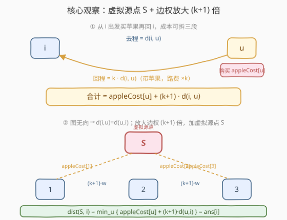
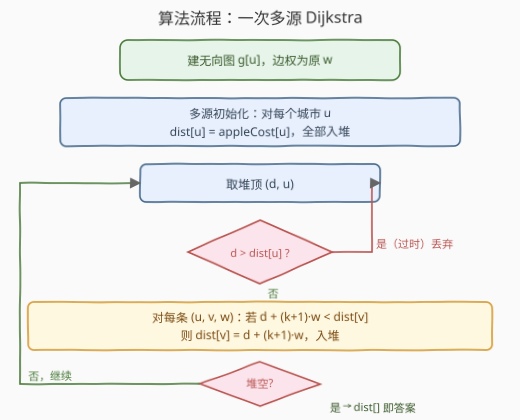
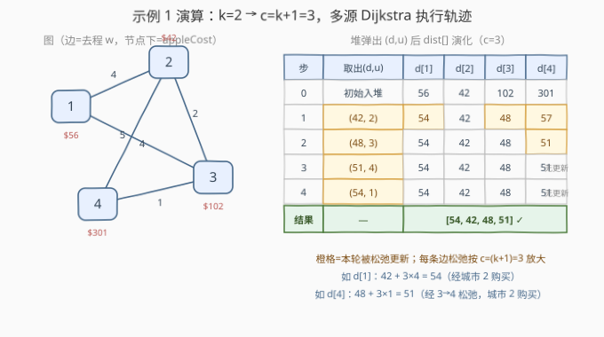

# LeetCode 购买苹果的最低成本 题解

## 1. 题目概述

- **标题 / 题号**：购买苹果的最低成本（#2473，medium）
- **链接**：https://leetcode.cn/problems/minimum-cost-to-buy-apples/
- **难度**：中等
- **标签**：图、最短路、堆（优先队列）、多源 Dijkstra、虚拟源点

**题意**：给定 $n$ 个城市（编号 $1\sim n$）与无向边数组 `roads`，其中 `roads[i] = [a_i, b_i, cost_i]` 表示 $a_i$ 与 $b_i$ 之间有一条双向道路，**去程**通行成本为 $\text{cost}_i$。每个城市 $i$ 都能买到苹果，价格为 $\text{appleCost}[i]$（数组 0 下标对应城市 $1$）。

你从某个起始城市出发，沿道路走到**任意**一个城市买**一个**苹果，然后**必须回到起始城市**。关键规则：买到苹果之后，**所有道路的通行成本变为原来的 $k$ 倍**（带着苹果返程更贵）。返回一个长度为 $n$、1-indexed 的数组 `answer`，`answer[i]` 为从城市 $i$ 出发的**最小**总成本。

> 💡 成本由三段构成：去程路费 $d(i,u)$ + 购买价 $\text{appleCost}[u]$ + 返程路费 $k\cdot d(u,i)$。由于图**无向**，从 $u$ 返回 $i$ 的最短路长度等于从 $i$ 去 $u$ 的最短路长度 $d(i,u)$，故总成本
> $$\text{cost}(i,u)=\text{appleCost}[u]+(k+1)\cdot d(i,u).$$
> 于是 $\text{answer}[i]=\min\limits_{u}\{\text{appleCost}[u]+(k+1)\cdot d(i,u)\}$。

**示例 1**：

```text
输入：n = 4, roads = [[1,2,4],[2,3,2],[2,4,5],[3,4,1],[1,3,4]], appleCost = [56,42,102,301], k = 2
输出：[54,42,48,51]
解释：
- 城市 1：走 1→2 买，再 2→1。成本 4 + 42 + 4*2 = 54
- 城市 2：就地买。成本 42
- 城市 3：走 3→2 买，再 2→3。成本 2 + 42 + 2*2 = 48
- 城市 4：走 4→3→2 买，再 2→3→4。成本 (1+2) + 42 + (1+2)*2 = 51
```

**示例 2**：

```text
输入：n = 3, roads = [[1,2,5],[2,3,1],[3,1,2]], appleCost = [2,3,1], k = 3
输出：[2,3,1]
解释：每个城市就地买苹果即最优。
```

**约束**：

- $2 \le n \le 1000$
- $1 \le \text{roads.length} \le 1000$
- $1 \le a_i, b_i \le n$，$a_i \ne b_i$，无重复边
- $1 \le \text{cost}_i \le 10^5$
- $\text{appleCost.length} = n$，$1 \le \text{appleCost}[i] \le 10^5$
- $1 \le k \le 100$

> ⚠️ 注意 $n=1000$、$m=1000$，图是**一般无向图**（非树，示例 1 有 $n=4$ 却有 $5$ 条边即含环）。$k$ 最大 $100$，故边权放大后 $(k+1)\cdot \text{cost}_i$ 可达 $\sim 10^7$，答案可达 $\sim 10^{10}$，C++ 须用 `long long`。

## 2. 解题思路

### 2.1 朴素思路：逐起点跑 Dijkstra + 枚举购物点

最直观的做法是**对每个起点 $i$ 各跑一次 Dijkstra**，求出 $i$ 到所有城市 $u$ 的最短路 $d(i,u)$，再枚举购物点取

$$\text{answer}[i]=\min_u\{\text{appleCost}[u]+(k+1)\cdot d(i,u)\}.$$

共 $n$ 次独立 Dijkstra，复杂度 $O(n\cdot m\log m)$，$n=m=1000$ 时约 $10^7$ 量级，能过但偏重。

> ⚠️ 瓶颈在于「$n$ 次单源最短路互相独立」：每个起点的 Dijkstra 都从零建堆、各自松弛一遍全图，**重复劳动**严重。突破口是把「$n$ 个起点的最小值」重新表达成「**一个**源点到各点的最短路」——只需引入一个**虚拟源点**，配合边权缩放，即可把 $n$ 次合并为 $1$ 次。

### 2.2 核心观察：虚拟源点 + 边权放大 → 一次多源 Dijkstra



把目标式做两步改写：

**第一步（拆往返）**：返程最短路 $=$ 去程最短路（无向图），故

$$\text{answer}[i]=\min_u\{\text{appleCost}[u]+(k+1)\cdot d(i,u)\}=\min_u\{\text{appleCost}[u]+(k+1)\cdot d(u,i)\}.$$

**第二步（缩放 + 虚拟源点）**：令 $c=k+1$，把**原图每条边权 $w$ 放大成 $c\cdot w$**，得到新图 $G'$，则 $G'$ 上 $d'(u,i)=c\cdot d(u,i)$。再增设一个**虚拟源点** $S$，从 $S$ 向每个城市 $u$ 连一条权为 $\text{appleCost}[u]$ 的边。那么

$$\text{dist}_{G'}(S,\,i)=\min_u\{\text{appleCost}[u]+d'(u,i)\}=\min_u\{\text{appleCost}[u]+(k+1)\cdot d(u,i)\}=\text{answer}[i].$$

即**从 $S$ 出发跑一次 Dijkstra**，到各城市 $i$ 的最短路就是 `answer[i]`！$n$ 次单源问题被压成 $1$ 次多源最短路。

> 💡 实现上不必显式建 $S$ 节点：把多源 Dijkstra 的**初始堆**塞满——对每个城市 $u$ 令 $\text{dist}[u]=\text{appleCost}[u]$ 并全部入堆（语义即「在 $u$ 就地购买、尚未走任何返程路」）。随后松弛时**边权乘以 $c=k+1$** 即可，与「$S\to u$（买）+ $u\to i$（缩放返程）」严格等价。
>
> 这与 [743. 网络延迟时间](../0701-0800/743_网络延迟时间.md) 的多源 Dijkstra 同构：把若干个「带初始代价的起点」一并入堆，剩余就是标准 Dijkstra 流程。

### 2.3 算法流程图



骨架四步：

1. **建图**：无向邻接表 $g[u]$ 存原始边权 $w$（不预乘 $c$，松弛时再乘，避免溢出且语义清晰）；
2. **多源初始化**：对每个城市 $u$，$\text{dist}[u]=\text{appleCost}[u]$，把 $(dist[u],u)$ 全部入堆；
3. **松弛循环**：取堆顶 $(d,u)$，若 $d>\text{dist}[u]$ 则丢弃（过时条目）；否则对每条 $(u,v,w)$，若 $d+c\cdot w<\text{dist}[v]$ 则更新并入堆；
4. **返回**：堆空时 $\text{dist}[i]$ 即 `answer[i]`。

> ⚠️ **两处防溢出**：(1) 松弛写 $d+c\cdot w$ 时 $c\cdot w$ 最大 $\sim 101\times 10^5\approx 10^7$，$d$ 最大 $\sim 10^{10}$，故 `dist` 与累加均用 `long long`；(2) 用 `LONG_MAX/4` 作 INF，避免松弛时 `INF + x` 溢出。

### 2.4 示例演算

以示例 1（$k=2$，$c=k+1=3$）为例，多源 Dijkstra 的执行轨迹如下：



| 步 | 取出 $(d,u)$ | $\text{dist}[1]$ | $\text{dist}[2]$ | $\text{dist}[3]$ | $\text{dist}[4]$ | 说明 |
|----|-------------|-----|-----|-----|-----|------|
| 0 | 初始入堆 | 56 | 42 | 102 | 301 | 每个 $u$：就地买 |
| 1 | $(42,2)$ | **54** | 42 | **48** | **57** | 松弛 2 的邻居：$42+3\times4=54$、$42+3\times2=48$、$42+3\times5=57$ |
| 2 | $(48,3)$ | 54 | 42 | 48 | **51** | 松弛 3 的邻居：$48+3\times1=51<57$（更新 4） |
| 3 | $(51,4)$ | 54 | 42 | 48 | 51 | 邻居均更优，无更新 |
| 4 | $(54,1)$ | 54 | 42 | 48 | 51 | 邻居均更优，无更新 |
| 结果 | — | **54** | **42** | **48** | **51** | ✓ 与官方输出一致 |

- 初始堆中 $42$（城市 2）最小，先弹出，把 $1/3/4$ 经「城市 2 购买」的代价刷新；
- 随后 $48$（城市 3）弹出，发现经「城市 2 购买 + 走到 4」的 $51$ 比现有 $57$ 更优，再次刷新 $4$；
- 之后剩余堆顶都无法松弛，$\text{dist}$ 收敛到 $[54,42,48,51]$。

> 💡 注意城市 4 的最优解是「在 2 购买、走 $4\to3\to2$ 返程」，对应 $\text{dist}[4]=\text{appleCost}[2]+c\cdot d(4,2)=42+3\times3=51$（其中 $d(4,2)=1+2=3$，走 $4\to3\to2$ 而非直连 $4\to2$ 的 $5$）。这正体现 Dijkstra 在一般图（含环）上自动选最短路的价值——若图是树则路径唯一、可退化成 BFS，但本题是带权一般图，必须 Dijkstra。

## 3. 参考代码

### C++

```cpp
class Solution {
public:
    vector<long long> minCost(int n, vector<vector<int>>& roads,
                              vector<int>& appleCost, int k) {
        vector<vector<pair<int, int>>> g(n);
        for (auto& r : roads) {
            int u = r[0] - 1, v = r[1] - 1, w = r[2];
            g[u].emplace_back(v, w);
            g[v].emplace_back(u, w);
        }
        const long long INF = LLONG_MAX / 4;
        const long long c = k + 1;                       // 返程倍率，边权整体放大 c 倍
        vector<long long> dist(n, INF);
        using P = pair<long long, int>;                  // (距离, 城市)
        priority_queue<P, vector<P>, greater<>> pq;
        for (int u = 0; u < n; ++u) {                   // 多源：每个城市「就地购买」入堆
            dist[u] = appleCost[u];
            pq.emplace(dist[u], u);
        }
        while (!pq.empty()) {
            auto [d, u] = pq.top(); pq.pop();
            if (d > dist[u]) continue;                  // 过时条目，丢弃
            for (auto [v, w] : g[u]) {
                long long nd = d + c * w;               // 边权放大 c 倍模拟往返
                if (nd < dist[v]) {
                    dist[v] = nd;
                    pq.emplace(nd, v);
                }
            }
        }
        return dist;
    }
};
```

> ⚠️ **不要把 `dist` 声明成 `int`**：$c\cdot w\sim 10^7$、累加后 $\sim 10^{10}$ 超出 `int` 范围，必须 `long long`。INF 取 `LLONG_MAX/4` 保证松弛 `INF + c*w` 不越过 `LLONG_MAX`。

### Python

```python
class Solution:
    def minCost(self, n: int, roads: List[List[int]],
                appleCost: List[int], k: int) -> List[int]:
        g = [[] for _ in range(n)]
        for a, b, w in roads:
            a -= 1; b -= 1
            g[a].append((b, w))
            g[b].append((a, w))

        c = k + 1                                  # 边权整体放大 c 倍
        dist = list(appleCost)                      # 多源：每个城市就地购买
        pq = [(dist[u], u) for u in range(n)]
        heapify(pq)
        while pq:
            d, u = heappop(pq)
            if d > dist[u]:
                continue                           # 过时条目
            for v, w in g[u]:
                nd = d + c * w                      # 缩放边权模拟往返
                if nd < dist[v]:
                    dist[v] = nd
                    heappush(pq, (nd, v))
        return dist
```

> 💡 **为什么入堆时用 `heapify` 而非逐个 `heappush`？** 初始有 $n$ 个源，`heapify` 是 $O(n)$，而 $n$ 次 `heappush` 是 $O(n\log n)$；起点很多时前者更省。语义上等价：堆里同时存在多个源，Dijkstra 自然按「当前最小代价」逐个取出松弛。

## 4. 复杂度分析

| 维度 | 虚拟源点 + 多源 Dijkstra（本文） | 逐起点 Dijkstra（朴素） |
|------|--------------------------------|------------------------|
| **时间复杂度** | $O(m\log n)$（**一次** Dijkstra，$m$ 条边各松弛若干次） | $O(n\cdot m\log m)$（$n$ 次独立 Dijkstra） |
| **空间复杂度** | $O(n+m)$（邻接表 + dist + 堆） | $O(n+m)$（同） |
| **关键点** | $n$ 个单源问题合并为 $1$ 个多源问题 | 每个起点从头建堆，重复松弛全图 |

> 💡 从 $O(n\cdot m\log m)$ 降到 $O(m\log n)$，提速一个 $n$ 因子（$n=1000$ 时约 $\times 1000$）。核心是**目标式可写成「单源到各点的最短路」**——只要存在 $\text{answer}[i]=\min_u\{w_u + c\cdot d(u,i)\}$ 形式且图无向（$d(u,i)=d(i,u)$），就能套「虚拟源点 + 边权缩放 $c$ 倍」模板一次出全部答案。

## 5. 扩展：朴素逐起点 Dijkstra 对照与虚拟源点技巧的通用性

### 5.1 朴素对照解法

把 2.1 的朴素思路落到代码，就是官方题解的标准写法——对每个起点 $i$ 跑一次 Dijkstra，松弛过程中即时用 $\text{appleCost}[u]+(k+1)\cdot d$ 更新该起点答案：

```cpp
vector<long long> minCost(int n, vector<vector<int>>& roads,
                          vector<int>& appleCost, int k) {
    vector<vector<pair<int,int>>> g(n);
    for (auto& r : roads) {
        int u = r[0]-1, v = r[1]-1, w = r[2];
        g[u].emplace_back(v, w); g[v].emplace_back(u, w);
    }
    const long long c = k + 1;
    vector<long long> ans(n);
    vector<long long> dist(n);
    for (int s = 0; s < n; ++s) {
        fill(dist.begin(), dist.end(), LLONG_MAX/4);
        dist[s] = 0;
        priority_queue<pair<long long,int>, vector<pair<long long,int>>, greater<>> pq;
        pq.emplace(0, s);
        long long best = LLONG_MAX;
        while (!pq.empty()) {
            auto [d, u] = pq.top(); pq.pop();
            if (d > dist[u]) continue;
            best = min(best, appleCost[u] + c * d);          // 到 u 买 + 往返
            for (auto [v, w] : g[u])
                if (d + w < dist[v]) {
                    dist[v] = d + w;
                    pq.emplace(dist[v], v);
                }
        }
        ans[s] = best;
    }
    return ans;
}
```

它**不放大边权**、**不设虚拟源点**，每个起点独立求 $d(s,\cdot)$ 后用公式取 min。正确性显然，但跑 $n$ 次。对照意义：把它的「逐起点」结构去掉外层循环、把「在 $u$ 购买」从终点事后取 min 改为**源点初始代价**、把松弛边权改 $w\to c\cdot w$，就得到本文的多源版本——**同一份 Dijkstra 骨架，重排语义即获 $n$ 倍提速**。

### 5.2 「虚拟源点 + 边权缩放」的通用模式

本题技巧可抽象为一类**多查询最短路的合并模板**，凡满足以下两点即可套用：

1. 目标式形如 $\text{ans}[i]=\min_u\{a_u + c\cdot d(u,i)\}$（**线性组合**，购物价 $a_u$ + 路费乘常数 $c$）；
2. 距离对称，即 $d(u,i)=d(i,u)$（**无向图**，或有向但两向距离相等）。

做法固定：**边权 $\times c$ 缩放** + **虚拟源点 $S$ 以权 $a_u$ 连各 $u$** + **一次 Dijkstra**。典型适用场景：

| 场景 | $a_u$ | $c$ | 含义 |
|------|------|-----|------|
| 本题（带苹果返程更贵） | $\text{appleCost}[u]$ | $k+1$ | 去程 + 购买 + $k\times$ 返程 |
| 选最近的「带起点费用的源」 | 各源启动费 | $1$ | 多源带权最短路 |
| 往返取最小（去返同价） | 节点附加费 | $2$ | 去程 + 返程各计一次 |

> ⚠️ 若图**有向且两向距离不等**（如单行道网络），则返程最短路 $\ne$ 去程最短路，公式 $\text{cost}(i,u)=\text{appleCost}[u]+d(i,u)+k\cdot d(u,i)$ 中的 $d(i,u)$ 与 $d(u,i)$ 是**两条不同最短路**，无法用单一缩放图合并，只能对每个 $i$ 跑两次 Dijkstra（正向求 $d(i,\cdot)$、反向求 $d(\cdot,i)$）再枚举 $u$ 取 min。这是「无向」这一前提被打破时的退化方案。

## 6. 面试要点

1. **总成本公式怎么推出来的？为什么是 $(k+1)\cdot d$ 而非 $2\cdot d$？**

   > 去程 $d(i,u)$ 不带苹果按原价；购买 $\text{appleCost}[u]$；返程带苹果按 $k$ 倍原价，最优返程最短路长 $d(u,i)$。无向图下 $d(u,i)=d(i,u)$，故返程费 $=k\cdot d(i,u)$。合计 $d+\text{appleCost}[u]+k\cdot d=\text{appleCost}[u]+(k+1)\cdot d$。$k=1$ 时退化成 $2\cdot d$（去返同价）。

2. **怎么把 $n$ 次单源 Dijkstra 合并成一次？**

   > 关键两步：(1) 缩放——边权 $w\to (k+1)w$，使返程 $k\cdot d$ 与去程 $d$ 合并成统一代价 $c\cdot d$；(2) 虚拟源点——新增 $S$ 以权 $\text{appleCost}[u]$ 连每个 $u$，把「在 $u$ 购买」编码成 $S\to u$ 的边。于是 $\text{dist}(S,i)=\min_u\{\text{appleCost}[u]+c\cdot d(u,i)\}=\text{ans}[i]$，一次 Dijkstra 出全部答案。实现上等价于多源 Dijkstra：初始把所有 $u$ 以 $\text{appleCost}[u]$ 入堆、松弛时边权乘 $c$。

3. **为什么不显式建 $S$ 节点也能等价？**

   > 多源 Dijkstra 的初始状态「若干源各带初始代价入堆」与「单源 $S$ 经零长虚拟边连到各源」在松弛语义上完全等价：$S$ 出堆后第一步就是松弛所有 $S\to u$ 边（权 $\text{appleCost}[u]$），效果即把各 $u$ 以 $\text{appleCost}[u]$ 入堆。省去 $S$ 节点和那一轮松弛，代码更短、常数更小。

4. **为什么必须用 `long long`？INF 怎么定？**

   > $c=k+1\le 101$，$w\le 10^5$，单边缩放后 $\le 10^7$；路径最长 $\sim n\cdot c\cdot w\sim 1000\times 10^7=10^{10}$，超出 `int`（$\sim 2.1\times 10^9$）。`dist` 与累加须 `long long`。INF 取 `LLONG_MAX/4`：既远大于任何真实距离，又保证松弛 `INF + c*w` 不越过 `LLONG_MAX` 而溢出。

5. **如果图变成有向、返程不等于去程怎么办？**

   > 公式拆成 $\text{appleCost}[u]+d(i,u)+k\cdot d(u,i)$，其中 $d(i,u)$ 用正向图 Dijkstra、$d(u,i)$ 用反向图 Dijkstra。对每个 $i$ 需要正向一次（得 $d(i,\cdot)$）+ 全局反向一次（得 $d(\cdot,i)$，反向图只跑一次共享），再枚举 $u$ 取 min，复杂度 $O(n\cdot m\log m + m\log m)$。无向的对称性是本题能合并到 $O(m\log n)$ 的根本前提。

> 💡 **一句话总结**：把「带苹果返程贵 $k$ 倍」翻译成边权放大 $(k+1)$ 倍，再用虚拟源点把「$n$ 个起点各自找最便宜购物点」压成一次多源 Dijkstra，$O(n\cdot m\log m)\to O(m\log n)$。记 `dist` 用 `long long`、INF 取 `LLONG_MAX/4` 即可。

## 同类练习题

| # | 题目 | 与本题的关联 |
|---|------|-------------|
| 743 | [网络延迟时间](https://leetcode.cn/problems/network-delay-time/)（[题解](../0701-0800/743_网络延迟时间.md)） | **多源/单源 Dijkstra 母题**，对照「堆优 Dijkstra + 过时条目丢弃」的标准骨架，本题多源初始化即其自然推广 |
| 1976 | [到达目的地的方案数](https://leetcode.cn/problems/number-of-ways-to-arrive-at-destination/) | 无向图 Dijkstra 求**最短路**的姐妹题，巩固「缩放边权 + 堆松弛」流程后再加路径计数 |
| 1514 | [概率最大路径](https://leetcode.cn/problems/path-with-maximum-probability/) | 把加法/最短改成乘法/最长（取 $\max$、边权为概率），巩固「**改代价合成方式**后 Dijkstra 仍适用」的灵活度 |
| 882 | [细分图中的可到达节点](https://leetcode.cn/problems/reachable-nodes-in-subdivided-graph/) | **虚拟源点 + 缩放边权**的直接变体（把细分点拆成边权），对照本题的边权放大技巧 |
| 2045 | [到达目的地的第二短时间](https://leetcode.cn/problems/second-minimum-time-to-reach-destination/) | 无向图求**次短路**，巩固 Dijkstra 在「最短路族」上的扩展形态（维护每组两个候选值） |
