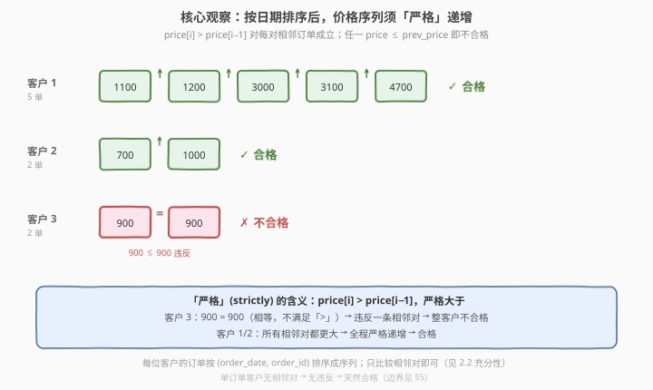
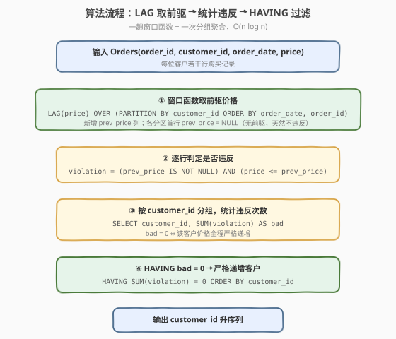
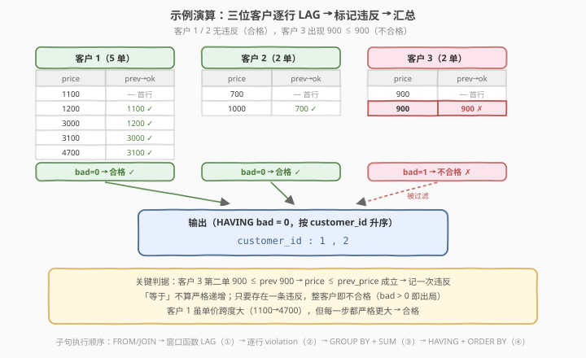

# LeetCode 购买量严格增加的客户 题解

## 1. 题目概述

- **标题 / 题号**：购买量严格增加的客户（#2474，hard）
- **链接**：https://leetcode.cn/problems/customers-with-strictly-increasing-purchases/
- **难度**：困难
- **标签**：数据库、SQL、窗口函数 `LAG`、自连接、序列单调性判定、LeetCode 锁题

**题意**：给定 `Orders` 表，每行记录某客户在某日期的一次购买（含价格 `price`）。编写解决方案，报告**购买价格随时间严格递增**的客户，按 `customer_id` 升序返回。

**表结构**：

```text
Table: Orders
+-------------+------+
| Column Name | Type |
+-------------+------+
| order_id    | int  |  ← 主键
| customer_id | int  |
| order_date  | date |
| price       | int  |
+-------------+------+
order_id 是该表的主键。
每一行包含订单 ID、客户 ID、购买日期与价格。
```

> ⚠️ **本题是 LeetCode Plus 会员锁题**，官方题面在站内需会员权限查看。本篇题面依据 LeetCode 公开接口（`mysqlSchemas` 与 `sampleTestCase`）还原：表结构与示例数据即下文所示，题意为「报告购买价格随时间严格递增的客户」。若你以会员权限看到的官方表述与这里的边界（如单订单客户、同日多单）存在出入，请以官方为准，§5 给出了对应的调整方式。

**示例 1**：

```text
输入：
Orders 表:
+----------+-------------+------------+-------+
| order_id | customer_id | order_date | price |
+----------+-------------+------------+-------+
| 1        | 1           | 2019-07-01 | 1100  |
| 2        | 1           | 2019-11-01 | 1200  |
| 3        | 1           | 2020-05-26 | 3000  |
| 4        | 1           | 2021-08-31 | 3100  |
| 5        | 1           | 2022-12-07 | 4700  |
| 6        | 2           | 2015-01-01 | 700   |
| 7        | 2           | 2017-11-07 | 1000  |
| 8        | 3           | 2017-01-01 | 900   |
| 9        | 3           | 2018-11-07 | 900   |
+----------+-------------+------------+-------+

输出：
+-------------+
| customer_id |
+-------------+
| 1           |
| 2           |
+-------------+

解释：
- 客户 1 五次购买价格依次为 1100 → 1200 → 3000 → 3100 → 4700，每步都严格更大 → 合格。
- 客户 2 两次购买 700 → 1000，严格更大 → 合格。
- 客户 3 两次购买 900 → 900，相等（不满足「严格大于」）→ 不合格。
```

**约束**：

- `order_id` 为表主键，行唯一。
- 同一 `customer_id` 可对应多行（多次购买）；同一 `customer_id` 同一 `order_date` 也可能多行（同日多单，见 §5）。
- `price` 为整数。
- 结果返回 `customer_id` 列，按升序排列。

> 💡 **审题关键**：① **「严格」(strictly) 是题眼**——相邻购买价格须满足 $p_i > p_{i-1}$，**等于即判违法**（客户 3 的 900 = 900 正是出局面）；② **按时间排序后再比相邻**——把每位客户的订单按 `order_date` 排成序列，只比较相邻对；③ **一处违法即整客户出局**——只要存在一对相邻不满足 $>$，该客户即不合格（不是「多数满足即可」）；④ **单订单客户无相邻对**——序列长度为 1 时，$p_i>p_{i-1}$ 对零对相邻成立，属「空真」(vacuously true)，本篇默认判其合格（边界见 §5.2）。

## 2. 解题思路

### 2.1 暴力思路：逐客户枚举所有相邻对

最直觉的过程式思维：取出每个客户的全部订单，按日期排序，逐对检查相邻价格是否严格递增；只要有一对 $p_i \le p_{i-1}$ 就把该客户标记为不合格。

```text
for u in DISTINCT customer_id:
    seq = sorted(orders[u], by order_date)
    ok = all(seq[i].price > seq[i-1].price for i in 1..len(seq))
    if ok: emit u
return sorted(result)
```

逻辑完全正确——而 SQL 有更声明式的表达：「同客户按日期排序后取上一行」正是**窗口函数 `LAG`** 的招牌场景：`LAG(price) OVER (PARTITION BY customer_id ORDER BY order_date, order_id)` 一句即为每行补上「前驱价格」，再在分组层统计违反次数即可。

### 2.2 核心观察：LAG 取前驱 + 相邻违反计数



把题意拆成三个语义，分别落到 SQL 机制上，叠加即得答案：

| 题意要求 | SQL 机制 | 语义 |
|----------|----------|------|
| 「随时间」 | `ORDER BY order_date, order_id` | **按时间排序**：同日多单用 `order_id` 兜底确定次序 |
| 「相邻比较」 | `LAG(price) OVER (PARTITION BY customer_id ORDER BY ...)` | **取前驱价格**：每行补一列 `prev_price` |
| 「严格递增」 | `price <= prev_price` 即记一次违反 | **闭区间反向判定**：$\le$ 即违法（含「等于」） |

形式化地，记客户 $u$ 按时间排好的价格序列为 $p_1, p_2, \dots, p_k$，定义

$$
\text{bad}(u) \;=\; \bigl|\{\, i \in [2,k] \;:\; p_i \le p_{i-1} \,\}\bigr|
$$

则客户合格当且仅当 $\text{bad}(u) = 0$（零违反）。最终答案为

$$
\text{ans} \;=\; \{\, u \;:\; \text{bad}(u) = 0 \,\}, \quad \text{按 } u \text{ 升序输出}.
$$

> 💡 **为什么只比相邻对就够？** 因为「严格递增」的定义本身就是逐对相邻 $p_i > p_{i-1}$。若全部相邻对都满足 $>$，由传递性可知任意 $i > j$ 都有 $p_i > p_j$（全序严格递增）；反之若存在某相邻对 $p_i \le p_{i-1}$，整条序列已不严格递增。故判定**只看相邻对**，无需两两组合——这是把 $O(n^2)$ 配对降为 $O(n)$ 相邻检查的关键（对照 [2228. 7 天内两次购买的用户](../2201-2300/2228_7天内两次购买的用户.md) 同样依赖「最小差必相邻」的相邻充分性）。

> ⚠️ **「严格」用 $\le$ 取反面**：违反条件是 $p_i \le p_{i-1}$（小于**或等于**），不是 $p_i < p_{i-1}$。写成 `price <= prev_price` 才能把「相等」也判违法（客户 3 的 900 = 900 靠这一「$\le$」而非「$<$」被捕获）。若误用 `<`，相等会被放行，客户 3 误判合格——这是本题最易错的一处。

### 2.3 算法流程图



**逻辑执行步骤**：

| 步骤 | 子句 | 作用 |
|------|------|------|
| ① | `LAG(price) OVER (PARTITION BY customer_id ORDER BY order_date, order_id) AS prev_price` | 为每行补「同客户、按时间排序的前一行」价格；各分区首行 `prev_price = NULL` |
| ② | `prev_price IS NOT NULL AND price <= prev_price` | 逐行判定是否违反；首行 `NULL` 天然不违反 |
| ③ | `GROUP BY customer_id` + `SUM(...)` | 统计每位客户的违反次数 `bad` |
| ④ | `HAVING SUM(...) = 0` + `ORDER BY customer_id` | 零违反者合格，升序输出 |

> 💡 **SQL 子句执行顺序**：`FROM` → 窗口函数 `LAG`（在 `SELECT` 中计算，但逻辑上紧随排序）→ `WHERE`（本题无）→ `GROUP BY` → `HAVING` → `SELECT` → `ORDER BY`。窗口函数先于分组聚合执行，故 `LAG` 在 `GROUP BY` 之前把 `prev_price` 落到行级，再由 `GROUP BY` 聚合成 `bad`——必须用 CTE/子查询分两步，不能在 `GROUP BY` 后直接取 `LAG`。

### 2.4 示例演算

以示例 1 的 9 行订单为例，逐客户走一遍四阶段：



| 客户 | 时间序列（价格） | 各相邻对判定 | $\text{bad}$ | 合格？ |
|------|-------------------|--------------|---------------|--------|
| 1 | 1100 → 1200 → 3000 → 3100 → 4700 | $1200{>}1100,\ 3000{>}1200,\ 3100{>}3000,\ 4700{>}3100$ | 0 | ✓ |
| 2 | 700 → 1000 | $1000 > 700$ | 0 | ✓ |
| 3 | 900 → 900 | $900 \le 900$（违反！） | 1 | ✗ |

- 客户 1：相邻四对全满足 $>$，$\text{bad}=0$ → 合格；
- 客户 2：唯一相邻对 $1000>700$，$\text{bad}=0$ → 合格；
- 客户 3：唯一相邻对 $900 \le 900$，$\text{bad}=1$ → 不合格。

违反集合 $=\{3\}$，合格集合 $=\{1,2\}$，升序输出 `1, 2` ✓。

> 💡 **客户 1 的跨度 vs 客户 3 的相等**：客户 1 价格从 1100 跳到 4700，跨度极大但**每一步都严格更大**即合格；客户 3 仅一步、且 900 与 900 完全相同，却因「相等」被判违法而出局。可见本题不关心「涨了多少」「总涨幅」，只问「有没有任何一步没涨」——「严格」二字是唯一判据。

## 3. 参考代码

### SQL（解法 A：窗口函数 `LAG`，推荐）

```sql
WITH seq AS (
    SELECT customer_id,
           price,
           LAG(price) OVER (
               PARTITION BY customer_id
               ORDER BY order_date, order_id
           ) AS prev_price
    FROM Orders
)
SELECT customer_id
FROM seq
GROUP BY customer_id
HAVING SUM(prev_price IS NOT NULL AND price <= prev_price) = 0
ORDER BY customer_id;
```

> 💡 **写法要点**：
> - `PARTITION BY customer_id ORDER BY order_date, order_id`：同客户按日期排序取上一行；`order_id` 作次序键保证同日多单有确定性顺序。
> - `prev_price IS NOT NULL`：跳过各分区首行（无前驱，天然不违反），避免 `NULL <= price` 的三值逻辑误判。
> - `price <= prev_price`：**用 $\le$ 不用 $<$**，把「相等」也计为违法（客户 3 的 900=900 靠此捕获）。
> - `HAVING SUM(...) = 0`：零违反即合格；`SUM` 对布尔表达式求和（MySQL 中 `TRUE→1`、`FALSE→0`、`NULL→0`），等价于计违反次数。
> - `ORDER BY customer_id`：升序输出。
> - ✓ **最自然**：`LAG` 表达「取前驱」、`<=` 表达「严格」反面、`SUM ... HAVING=0` 表达「零违反」、`ORDER BY` 表达「报告」，语义一气呵成。

### SQL（解法 B：自连接，无窗口函数）

若引擎不支持窗口函数，可用**等价改写**：序列严格递增 $\Leftrightarrow$ 任一订单的价格都严格大于**它之前所有订单的最大价**。违反即「存在一笔订单 $o$，它之前有一笔 $b$ 满足 $b.\text{price} \ge o.\text{price}$」。据此把违反客户集合用自连接求出，再取补集。

```sql
SELECT DISTINCT customer_id
FROM Orders
WHERE customer_id NOT IN (
    SELECT o.customer_id
    FROM Orders o
    JOIN Orders b
      ON b.customer_id = o.customer_id
     AND (b.order_date < o.order_date
          OR (b.order_date = o.order_date AND b.order_id < o.order_id))
    WHERE b.price >= o.price            -- o 之前存在 b 价 ≥ o 价 → 违反
)
ORDER BY customer_id;
```

> 💡 **等价性证明**：设序列 $p_1,\dots,p_k$ 严格递增 $\Leftrightarrow$ $\forall i\ge2:\ p_i > \max(p_1,\dots,p_{i-1})$。
> - $\Rightarrow$：严格递增则 $p_i>p_{i-1}>\cdots>p_1$，故 $p_i$ 大于前面全部，自然大于其最大值。
> - $\Leftarrow$：若 $p_i > \max_{j<i} p_j$，特别地 $p_i > p_{i-1}$（因 $p_{i-1}$ 在前面之列），递推即严格递增。
>
> 取反面：违反 $\Leftrightarrow$ $\exists\, i\ge2,\ \exists\, j<i:\ p_i \le p_j$ $\Leftrightarrow$ $\exists\, (o=i,\, b=j),\ b\text{ 早于 }o\ \land\ b.\text{price}\ge o.\text{price}$，即自连接条件 `b.price >= o.price`。$\square$
>
> - `b.order_date < o.order_date OR (同日 AND b.order_id < o.order_id)`：判定「$b$ 早于 $o$」，同日时用 `order_id` 兜底次序，与解法 A 的 `ORDER BY` 一致。
> - `b.price >= o.price`（含等号）：$o.\text{price} \le b.\text{price}$ 即违反，捕获客户 3 的 900≤900。
> - `NOT IN`：违反集合的补集即合格客户。单订单客户在内层无 $b$ 匹配，不会进入违反集合，故被外层保留——与解法 A 的「空真合格」一致。
> - ⚠️ 复杂度 $O(n^2)$（同客户自连接），单客户订单很多时退化；解法 A 的 `LAG` 仅 $O(n\log n)$，大数据优先 A。

### Python（pandas）

```python
import pandas as pd

def customers_with_strictly_increasing_purchases(orders: pd.DataFrame) -> pd.DataFrame:
    orders = orders.sort_values(['customer_id', 'order_date', 'order_id'])
    orders['prev_price'] = orders.groupby('customer_id')['price'].shift(1)
    orders['bad'] = orders['prev_price'].notna() & (orders['price'] <= orders['prev_price'])
    bad_cnt = orders.groupby('customer_id')['bad'].sum()
    ok_ids = bad_cnt[bad_cnt == 0].index.tolist()
    return pd.DataFrame({'customer_id': sorted(ok_ids)})
```

> 💡 **pandas 对照**：
> - `sort_values(['customer_id', 'order_date', 'order_id'])` 对应 `PARTITION BY customer_id ORDER BY order_date, order_id`（pandas 先全局排序再 `groupby.shift`）。
> - `groupby('customer_id')['price'].shift(1)` 对应 `LAG(price) OVER (PARTITION BY customer_id ORDER BY ...)`。
> - `prev_price.notna() & (price <= prev_price)` 对应 `prev_price IS NOT NULL AND price <= prev_price`；`notna()` 同样跳过各分组首行的 `NaN`。
> - `groupby('customer_id')['bad'].sum()` 对应 `SUM(...) ... GROUP BY`；`bad_cnt == 0` 对应 `HAVING SUM=0`；`sorted` 对应 `ORDER BY`。

## 4. 复杂度分析

| 维度 | 解法 A（`LAG`） | 解法 B（自连接） | pandas |
|------|-----------------|------------------|--------|
| **时间** | $O(n \log n)$（分区排序） | $O(n^2)$（最坏，单客户 $n$ 行） | $O(n \log n)$ |
| **空间** | $O(n)$（排序缓冲 + `prev_price` 列） | $O(p)$（配对数，最坏 $O(n^2)$） | $O(n)$ |
| **写法** | 一趟窗口 + 一次聚合，最清爽 | 无窗口函数兜底，等价改写需证明 | DataFrame |
| **推荐度** | ✓ 首选 | ✓ 老引擎/教学 | ✓ 验证用 |

> - $n$ = `Orders` 表行数，$p$ = 同客户配对总数（最坏单客户 $m=n$ 时 $p=\binom{n}{2}=O(n^2)$）。
> - **`LAG`**：按 `(customer_id, order_date, order_id)` 排序 $O(n\log n)$，扫描相邻 $O(n)$；只比相邻而非全配对，是「严格递增即逐对相邻」性质的算法红利。
> - **自连接**：同一客户 $m$ 笔订单两两配对 $O(m^2)$，最坏 $O(n^2)$；优势在不依赖窗口函数，逻辑等价由 §3.B 证明保证。
> - **空间**：`LAG` 仅需排序缓冲与一列 `prev_price`；自连接需物化违反配对集。

## 5. 扩展：边界与变体

### 5.1 同日多单：次序键与「同日聚合」两派

同一客户同日多笔订单时，「严格递增」的相邻对取决于次序约定，有两种合理口径：

| 口径 | 做法 | 同日 [100, 200] 是否合格 | 适用场景 |
|------|------|--------------------------|----------|
| **次序键兜底**（本篇默认） | `ORDER BY order_date, order_id`，同日按 `order_id` 排成序列后逐对比较 | 取决于 `order_id` 顺序（若 100 在前则 $200{>}100$ ✓） | 视每笔订单为独立「购买」 |
| **同日聚合** | 先 `GROUP BY customer_id, order_date` 取 `SUM(price)` 作当日总额，再按日比相邻 | $100+200=300$ 作单日总额与次日比 | 视「每日总购买」为递增对象 |

> ⚠️ 本题示例**无同日多单**的客户，两种口径在示例上等价。若官方题面把「同日多笔」视为一次合并购买，则改写为：
> ```sql
> WITH daily AS (
>     SELECT customer_id, order_date, SUM(price) AS day_total
>     FROM Orders
>     GROUP BY customer_id, order_date
> ),
> seq AS (
>     SELECT customer_id, day_total,
>            LAG(day_total) OVER (PARTITION BY customer_id ORDER BY order_date) AS prev
>     FROM daily
> )
> SELECT customer_id FROM seq
> GROUP BY customer_id
> HAVING SUM(prev IS NOT NULL AND day_total <= prev) = 0
> ORDER BY customer_id;
> ```
> 骨架完全相同，只是多一步「按日聚总额」。审题时看官方示例是否含同日多单即可定夺。

### 5.2 单订单客户：空真合格 vs 需「递增」

单订单客户序列长度为 1，$p_i>p_{i-1}$ 对零对相邻成立，数学上属**空真**(vacuously true)。本篇默认判其**合格**（解法 A/B 一致：无相邻对即 $\text{bad}=0$）。

若官方口径要求「至少两笔购买才算『递增』」（口语上「递增」需至少两项比较），加一行约束即可：

```sql
HAVING SUM(prev_price IS NOT NULL AND price <= prev_price) = 0
   AND COUNT(*) >= 2          -- 要求至少两笔订单
```

> 💡 **判据**：看官方示例是否含「仅一笔订单却出现在输出」的客户——若出现，则空真合格（不加 `COUNT`）；若示例中单笔客户一律不在输出，则需 `COUNT(*) >= 2`。本题示例三客户均 $\ge2$ 单，无法据此区分，故本篇取数学标准的「空真合格」，并列出调整方式以便按官方口径修正。

### 5.3 边界开闭：「严格」vs「非降」

| 口径 | 违反谓词 | 客户 3（900 = 900）合格？ |
|------|----------|---------------------------|
| **严格递增**（本篇） | `price <= prev_price`（含等号取反） | ✗ 不合格 |
| 非降（单调不降） | `price < prev_price`（严格小于取反） | ✓ 合格（相等放行） |

> 💡 一字之差：`<=` 把相等判违法（严格），`<` 把相等放行（非降）。题眼「严格」(strictly) 决定用 `<=`。审题抓住「相等的一对是否在输出」即可：客户 3 不在输出 → 严格 `<=`。

### 5.4 镜像题：相邻差的「存在」与「极值」

同为「同实体按时间排序后比相邻差」家族：本题求「是否存在相邻 $p_i \le p_{i-1}$」（存在性判定，决定合格/出局）；[2228. 7 天内两次购买的用户](../2201-2300/2228_7天内两次购买的用户.md) 求「是否存在相邻日期差 $\le 7$」（存在性判定，决定合格）；[访问日期之间最大的空档期](https://leetcode.cn/problems/biggest-window-between-visits/) 求相邻差的**最大值**（极值）。一「存在」一「极值」，骨架都是「分区排序 + `LAG` 算相邻量」，仅聚合方向不同。

## 6. 面试要点

1. **「严格」二字在 SQL 里怎么落？为什么用 `<=` 而非 `<`？**

   > 严格递增要求 $p_i > p_{i-1}$，违反即 $p_i \le p_{i-1}$（含等于）。故违反谓词写 `price <= prev_price`，`SUM` 后 `HAVING = 0`。若用 `<` 会把「相等」放行，客户 3 的 900=900 被误判合格。题眼「strictly」决定边界开闭。

2. **为什么只比相邻对就够？要不要两两组合？**

   > 严格递增的定义即「逐对相邻 $p_i>p_{i-1}$」。全部相邻对满足 $>$ 时，由传递性任意 $i>j$ 都 $p_i>p_j$（全序严格递增）；存在任一相邻对 $\le$ 则序列已不严格递增。故判定只看相邻，无需 $O(n^2)$ 两两配对——`LAG` 一趟取前驱、$O(n)$ 扫描即可。

3. **`LAG` 里 `ORDER BY` 为什么要加 `order_id`？**

   > 同日多单时 `order_date` 并列，窗口函数对并列行的相对次序未定义。加 `order_id` 作次序键保证确定性、可复现的序列，使「相邻对」有唯一含义。若官方口径是「同日聚合」，则改为先 `GROUP BY customer_id, order_date` 取 `SUM(price)`，再 `LAG`（见 §5.1）。

4. **为什么 `SUM(prev_price IS NOT NULL AND price <= prev_price)` 能正确计违反次数？**

   > MySQL 中布尔表达式 `TRUE→1`、`FALSE→0`、`NULL→0`（`SUM` 跳过 `NULL`）。首行 `prev_price IS NULL` 时整个 `AND` 为 `NULL`，`SUM` 不计——天然跳过无前驱的首行。非首行若 $p_i\le p_{i-1}$ 计 1，否则计 0。故 `SUM` 恰为违反次数，`= 0` 即零违反。跨方言可用 `SUM(CASE WHEN ... THEN 1 ELSE 0 END)` 保等价。

5. **窗口函数和 `GROUP BY` 的执行先后？为什么必须用 CTE 分两步？**

   > 逻辑顺序：`FROM` → 窗口函数 `LAG`（行级，先于分组）→ `GROUP BY` → `HAVING` → `ORDER BY`。`LAG` 须在分组前把 `prev_price` 落到每行，再由 `GROUP BY` 聚合成 `bad`。若把 `LAG` 写到 `GROUP BY` 之后，分组粒度已无「行级前驱」概念，`LAG` 失去意义。故用 CTE/子查询分两步：先 `seq` 补 `prev_price`，再分组求 `bad`。

> 💡 **一句话总结**：2474 是 SQL **「LAG 取前驱 + 相邻违反计数」** 招牌题——`LAG(price) OVER (PARTITION BY customer_id ORDER BY order_date, order_id)` 取前驱，`SUM(price <= prev_price) ... HAVING = 0` 筛零违反客户。考点四要素：**按时间排序（`order_id` 兜底同日）、取前驱（`LAG`）、严格的边界（`<=` 含等号判违法）、零违反即合格（`HAVING SUM=0`）**。进阶用自连接等价改写（无窗口函数兜底），依据是「严格递增 ⟺ 每笔都大于之前最大价」。

## 同类练习题

| # | 题目 | 与本题的关联 |
|---|------|-------------|
| 2228 | [7 天内两次购买的用户](https://leetcode.cn/problems/users-with-two-purchases-within-seven-days/)（[题解](../2201-2300/2228_7天内两次购买的用户.md)） | **同 `Purchases/Orders` 表 + 同客户排序后比相邻差**，求「相邻日期差 $\le 7$」存在性。与本题「相邻价格 $>$ 判定」同骨架，仅比较对象从「日期差」换成「价格差」 |
| 197 | [上升的温度](https://leetcode.cn/problems/rising-temperature/)（[题解](../0101-0200/197_上升的温度.md)） | `LAG`/自连接取「昨天的温度」比相邻，相邻比较型 SQL 入门母题，2474 的 `LAG` 骨架即源于此 |
| — | [访问日期之间最大的空档期](https://leetcode.cn/problems/biggest-window-between-visits/) | 同客户访问日期排序后 `LAG` 算相邻差取**最大值**，与本题「相邻差是否存在违反」互为镜像（极值 vs 存在性） |
| 1581 | [顾客在店内用餐的顾客数量 I](https://leetcode.cn/problems/customer-who-visited-but-did-not-make-any-transactions/) | `NOT IN`/`NOT EXISTS` 取补集的范式，对照本题解法 B 的「违反集合取补」思路 |
| 550 | [游戏玩法分析 IV](https://leetcode.cn/problems/game-play-analysis-iv/)（[题解](../0501-0600/550_游戏玩法分析IV.md)） | `LAG` + `DATEDIFF` 判定「次日回归」用户，相邻对存在性判定的进阶，对照「相邻关系如何驱动合格判定」 |
