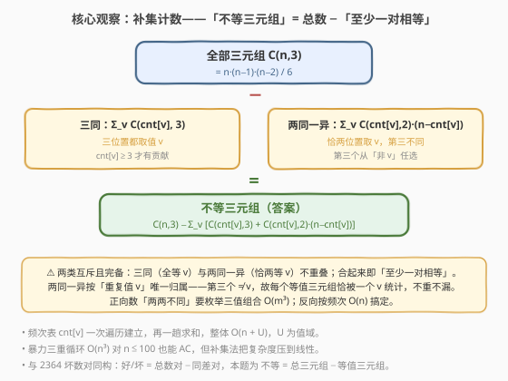
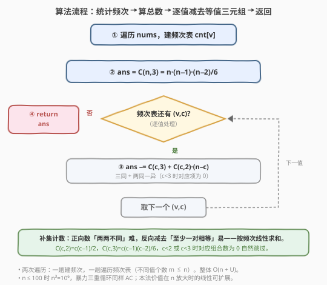

# LeetCode 数组中不等三元组的数目 题解

## 1. 题目概述

- **标题 / 题号**：数组中不等三元组的数目（#2475，easy）
- **链接**：https://leetcode.cn/problems/number-of-unequal-triplets-in-array/
- **难度**：简单
- **标签**：数组、哈希表、数学、组合计数

**题意**：给你一个下标从 $0$ 开始的正整数数组 `nums`。请统计满足下述条件的三元组 $(i, j, k)$ 的数目：

- $0 \le i < j < k < \text{nums.length}$；
- $\text{nums}[i]$、$\text{nums}[j]$、$\text{nums}[k]$ **两两不同**（即三者互不相等）。

**示例 1**：

```text
输入：nums = [4,4,2,4,3]
输出：3
解释：满足条件的三元组为 (0,2,4)、(1,2,4)、(2,3,4)，值均为 4≠2≠3。
注意 (2,0,4) 无效，因为不满足 i<j<k。
```

**示例 2**：

```text
输入：nums = [1,1,1,1,1]
输出：0
解释：所有位置都相等，不存在两两不同的三元组。
```

**约束**：

- $3 \le \text{nums.length} \le 100$
- $1 \le \text{nums}[i] \le 1000$

> 💡 题面要的是「两两不同」的三元组个数。直接数合法方案要枚举三位置 $O(n^3)$ 或枚举三值组合 $O(m^3)$。但合法 = 全部 − 非法，而「非法」（至少一对相等）能按**重复值**干净地分组求和——这引出补集计数的核心观察。

## 2. 解题思路

### 2.1 暴力思路：三重循环枚举

最直白的做法是忠实枚举所有 $i<j<k$，逐一判定两两不等：

```text
ans = 0
for i in range(n):
    for j in range(i+1, n):
        for k in range(j+1, n):
            if nums[i]!=nums[j] and nums[i]!=nums[k] and nums[j]!=nums[k]:
                ans += 1
return ans
```

正确性没问题，三重循环 $O(n^3)$。对 $n \le 100$，$n^3 = 10^6$ 能 AC。但每个三元组都要三次比较，且未利用「等值」的**批量结构**——相同值的元素会被反复当成「冲突源」逐个检查。

> ⚠️ 暴力把每个三元组独立判定，却忽视了：非法三元组的「形状」只取决于**哪个值重复了几次**，与具体下标无关。一旦按值统计频次，非法数就能整体算出。

### 2.2 核心观察：补集计数——按值分组求等值三元组



**关键洞察**：合法三元组 = 全部三元组 − 非法三元组，而非法三元组（至少一对相等）能按「重复的值 $v$」干净分组。

全部三元组数为组合数：

$$\text{total} = \binom{n}{3} = \frac{n(n-1)(n-2)}{6}$$

非法三元组分两类（互斥且完备）：

| 类别 | 含义 | 数量（对值 $v$，频次 $c=\text{cnt}[v]$） |
|------|------|------------------------------------------|
| **三同** | 三个位置都取值 $v$ | $\binom{c}{3} = \dfrac{c(c-1)(c-2)}{6}$ |
| **两同一异** | 恰两个位置取 $v$，第三个取别的值 | $\binom{c}{2}\cdot(n-c) = \dfrac{c(c-1)}{2}\cdot(n-c)$ |

对每个值 $v$ 求和，得非法总数：

$$\text{bad} = \sum_{v}\left[\binom{c_v}{3} + \binom{c_v}{2}\cdot(n-c_v)\right]$$

$$\boxed{\;\text{ans} = \binom{n}{3} - \text{bad}\;}$$

**为什么不重不漏**：

- **互斥**：「三同」（三个全等 $v$）与「两同一异」（恰两个等 $v$、第三个 $\ne v$）按「与 $v$ 相等的位置数」严格区分，不可能重叠；
- **完备**：非法 $\iff$ 至少一对相等 $\iff$ 存在值 $v$ 出现 $\ge 2$ 次 $\iff$ 落入「三同」或「两同一异」之一；
- **唯一归属**：「两同一异」中那对相等的位置共享**同一个**值 $v$（第三个 $\ne v$），故每个非法三元组恰被一个 $v$ 统计一次，不会重复。

> 💡 这与 [2364. 统计坏数对的数目](../2301-2400/2364_统计坏数对的数目.md) 同构：坏数对 = 总数对 − 同差数对。本题为 不等三元组 = 总三元组 − 等值三元组。补集计数是把「数难数的好东西」翻转为「数好数的坏东西」的通用范式。

### 2.3 算法流程图



两阶段流水：

1. **建频次表**：一趟遍历 `nums`，得 `cnt[v]`（不同值个数 $m \le n$）；
2. **总数初始化**：`ans = C(n,3) = n·(n−1)·(n−2)/6`；
3. **逐值减去等值三元组**：遍历频次表，对每个 $(v, c)$ 执行 `ans -= C(c,3) + C(c,2)·(n−c)`（$c<3$ 或 $c<2$ 时对应组合数自然为 $0$）；
4. **返回** `ans`。

整个过程两次线性遍历 + 组合公式，无排序、无 $O(n^3)$ 枚举。

### 2.4 示例演算

![示例演算：nums=[4,4,2,4,3] → 频次表 → 减去等值三元组 → 10−7=3](../images/2475_example_walkthrough.svg)

以示例 1 `nums = [4,4,2,4,3]`、$n=5$ 演算：

**第一步——统计频次**：$\text{cnt} = \{4:3,\ 2:1,\ 3:1\}$。

**第二步——总数**：$\binom{5}{3} = 10$。

**第三步——逐值减去等值三元组**：

| 值 $v$ | 频次 $c$ | $\binom{c}{3}$ | $\binom{c}{2}\cdot(n-c)$ | 小计 |
|--------|----------|----------------|--------------------------|------|
| $4$ | $3$ | $1$ | $\binom{3}{2}\cdot 2 = 6$ | $7$ |
| $2$ | $1$ | $0$ | $0$ | $0$ |
| $3$ | $1$ | $0$ | $0$ | $0$ |
| | | | **等值三元组合计** | $7$ |

**第四步——返回**：$\text{ans} = 10 - 7 = 3$ ✓。

> 💡 三个合法三元组 $(0,2,4)$、$(1,2,4)$、$(2,3,4)$ 的值都是 $\{4,2,3\}$——可见合法方案完全由「取值组合」决定，与下标顺序无关。值 $4$ 重复 $3$ 次是唯一的「冲突源」：贡献 $1$ 个全等三元组 + $6$ 个「两 4 一异」三元组，共 $7$ 个被减去。

## 3. 参考代码

### C++

```cpp
class Solution {
public:
    int unequalTriplets(vector<int>& nums) {
        int n = nums.size();
        unordered_map<int,int> cnt;
        for (int x : nums) ++cnt[x];
        int ans = n * (n - 1) * (n - 2) / 6;          // C(n,3)
        for (auto& [v, c] : cnt) {
            if (c >= 3) ans -= c * (c - 1) * (c - 2) / 6;            // 三同
            if (c >= 2) ans -= (c * (c - 1) / 2) * (n - c);         // 两同一异
        }
        return ans;
    }
};
```

> 💡 `n·(n−1)·(n−2)` 必被 $6$ 整除（连续三整数之积含因子 $2$ 与 $3$），整除精确无误差。`c·(c−1)` 必为偶数，`c·(c−1)·(c−2)` 必被 $6$ 整除，故两个除法都是精确整除。`c>=3`/`c>=2` 守卫可省（组合数为 $0$ 时减 $0$ 不影响结果），但写上更直观。`n-c` 为「非 $v$」的位置数，作为两同一异第三个位置的选法。

### Python

```python
class Solution:
    def unequalTriplets(self, nums: List[int]) -> int:
        n = len(nums)
        cnt = Counter(nums)
        ans = n * (n - 1) * (n - 2) // 6               # C(n,3)
        for c in cnt.values():
            if c >= 3:
                ans -= c * (c - 1) * (c - 2) // 6     # 三同
            if c >= 2:
                ans -= c * (c - 1) // 2 * (n - c)     # 两同一异
        return ans
```

> 💡 `c * (c - 1) // 2 * (n - c)` 先整除再乘，因 `c*(c-1)` 恒偶，`//2` 精确。也可用 `math.comb`：`ans = comb(n,3) - sum(comb(c,3) + comb(c,2)*(n-c) for c in cnt.values())`，语义等价但多一次导入。手写公式与 C++ 完全对齐，便于两语言对照阅读。

## 4. 复杂度分析

| 维度 | 复杂度 | 说明 |
|------|--------|------|
| **时间复杂度** | $O(n + m)$ | 建频次表 $O(n)$ + 遍历 $m$ 个不同值求和，$m \le n$ |
| **空间复杂度** | $O(m)$ | 频次表存 $m$ 个键值，$m \le \min(n, U)$ |
| 对照：三重循环暴力 | $O(n^3)$ / $O(1)$ | 枚举所有 $i<j<k$，$n=100$ 时约 $1.6\times10^5$ 次，能 AC |
| 对照：枚举三值组合 | $O(m^3)$ / $O(m)$ | 直接数合法 $\sum_{a<b<c}\text{cnt}[a]\cdot\text{cnt}[b]\cdot\text{cnt}[c]$，常数更小但三次方 |

> 💡 本题 $n \le 100$，$O(n^3)$ 也能瞬 AC。补集计数的价值在**方法论**：把「数两两不同」翻转为「总数 − 等值」，后者按频次线性求和——当 $n$ 放大到 $10^5$ 时暴力不再可行，本法仍稳。值域 $U=1000$ 时 $m \le 1000$，$O(m^3)$ 不可行而 $O(n+m)$ 可行。

## 5. 扩展：直接数合法（枚举三值组合）

补集计数之外，也可直接正向统计合法三元组：枚举所有「取值三元组」$a < b < c$，对每个组合贡献 $\text{cnt}[a]\cdot\text{cnt}[b]\cdot\text{cnt}[c]$：

$$\text{ans} = \sum_{a<b<c}\text{cnt}[a]\cdot\text{cnt}[b]\cdot\text{cnt}[c]$$

```cpp
class Solution {
public:
    int unequalTriplets(vector<int>& nums) {
        unordered_map<int,int> cnt;
        for (int x : nums) ++cnt[x];
        vector<int> c;
        for (auto& [v, k] : cnt) c.push_back(k);
        int m = c.size(), ans = 0;
        for (int i = 0; i < m; ++i)
            for (int j = i + 1; j < m; ++j)
                for (int k = j + 1; k < m; ++k)
                    ans += c[i] * c[j] * c[k];
        return ans;
    }
};
```

> 💡 复杂度 $O(m^3)$，$m$ 为不同值个数。本题 $U \le 1000$，最坏 $m=1000$ 时 $m^3=10^9$ 不可行；但「两两不同」要求 $a,b,c$ 互异，实际 $m$ 受 $n \le 100$ 上界约束 $\le 100$，$m^3 \le 10^6$ 仍 AC。**但它只枚举值、跳过下标**，比暴力 $O(n^3)$ 快一个「重复值的压缩」倍数。两种正向思路与补集法的取舍：补集法不依赖 $m$、恒 $O(n+m)$；枚举值组合依赖 $m$ 大小，$m$ 小时更快（常数低）。**当 $n$ 大而 $m$ 小（大量重复）时枚举值组合反而优于补集法**，是值得记的一招。

> ⚠️ 注意枚举值组合必须是 $a<b<c$（值的大小序），用 `i<j<k` 的下标序去重——只要三值互异，取值顺序与下标顺序无关，每组合恰贡献一次。

## 6. 面试要点

1. **为什么用补集（总数 − 非法）而不是直接数合法？**

   > 直接数「两两不同」要保证三值互异，要么枚举下标 $O(n^3)$、要么枚举值组合 $O(m^3)$。而「非法 = 至少一对相等」按重复值 $v$ 分组后是**乘积之和**，一趟频次遍历 $O(n+m)$ 搞定。补集把「全局判互异」（三值耦合）翻转为「局部按值计数」（解耦），这是计数题降阶的通用招式。

2. **两类非法为何不重不漏？**

   > 互斥：「三同」（与 $v$ 相等的位置数 $=3$）与「两同一异」（位置数 $=2$）按相等位置数严格区分。唯一归属：两同一异里那对相等位置共享同一值 $v$，第三个 $\ne v$，故每个非法三元组恰被一个 $v$ 统计。完备：非法 $\iff$ 至少一对相等 $\iff$ 某值出现 $\ge 2$ 次 $\iff$ 落入两类之一。

3. **$\binom{n}{3}$、$\binom{c}{3}$、$\binom{c}{2}$ 的整除性如何保证？**

   > $n(n-1)(n-2)$ 是连续三整数之积，必含因子 $2$ 与 $3$，故被 $6$ 整除精确。同理 $c(c-1)(c-2)$ 被 $6$ 整除、$c(c-1)$ 被 $2$ 整除。整数除法无精度损失，无需用浮点或 `comb` 库。

4. **$c<3$ 或 $c<2$ 时的守卫是否必要？**

   > 数值上不必要：$\binom{1}{3}=\binom{2}{3}=0$、$\binom{1}{2}=0$，减 $0$ 不影响结果，守卫去掉答案不变。但写上 `if (c>=3)` 让分支语义清晰，且在公式手写时避免 `c-2` 为负的误读（整除虽为 $0$ 但易困惑）。属于可读性取舍。

5. **能否优化到 $O(n)$ 且 $O(1)$ 空间？**

   > 时间已是 $O(n+m) \le O(n)$ 下界（必读全部元素），无法更好。空间：值域 $U \le 1000$ 时可用定长数组 `int cnt[1001]` 替 `unordered_map`，仍是 $O(U)$ 但常数更小、缓存友好；真正 $O(1)$ 空间不现实（须记住每个值的频次才能求和）。

> 💡 **一句话总结**：不等三元组 $=$ $\binom{n}{3} - \sum_v\!\left[\binom{c_v}{3}+\binom{c_v}{2}(n-c_v)\right]$——补集计数把「数两两不同」翻转为「按频次线性求和等值」，互斥完备不重不漏，$O(n+m)$ / $O(m)$。

## 同类练习题

| # | 题目 | 与本题的关联 |
|---|------|-------------|
| 2364 | [统计坏数对的数目](https://leetcode.cn/problems/count-number-of-bad-pairs/)（[题解](../2301-2400/2364_统计坏数对的数目.md)） | 坏数对 $=$ 总数对 $-$ 同差数对，与本题「不等 $=$ 总 $-$ 等值」同构，补集计数范式的姊妹篇 |
| 2367 | [等差三元组的数目](https://leetcode.cn/problems/number-of-arithmetic-triplets/)（[题解](../2301-2400/2367_等差三元组的数目.md)） | 同样数三元组，哈希表把暴力 $O(n^3)$ 压到 $O(n)$，对照「枚举中间元素 + 哈希」与「补集计数」两种降阶姿势 |
| 2348 | [全 0 子数组的数目](https://leetcode.cn/problems/number-of-zero-filled-subarrays/)（[题解](../2301-2400/2348_全0子数组的数目.md)） | 频次 $c$ 的连续段贡献 $\sum \binom{c}{2}$，同「频次 $\to$ 组合数求和」骨架，对照子数组与三元组的组合计数 |
| 2341 | [数组能形成多少数对](https://leetcode.cn/problems/maximum-number-of-pairs-in-array/)（[题解](../2301-2400/2341_数组能形成多少数对.md)） | 按频次 $c$ 数对 $\lfloor c/2\rfloor$，同「频次表驱动计数」基础练习，对照「数对」与「数三元组」的组合差异 |
