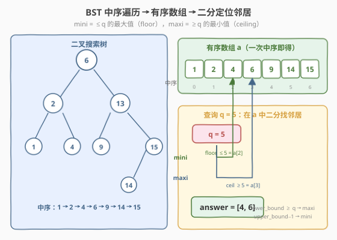

# 二叉搜索树最近节点查询

- **题目名称**：二叉搜索树最近节点查询
- **链接**：[2476. 二叉搜索树最近节点查询](https://leetcode.cn/problems/closest-nodes-queries-in-a-binary-search-tree/)
- **难度**：中等
- **标签**：树、二叉搜索树、中序遍历、二分查找

## 1. 题目概述

给定一棵 **二叉搜索树（BST）** 的根 `root`，和一个长度为 `n` 的正整数数组 `queries`。对每个 `queries[i]` 求一个二元组 `answer[i] = [mini, maxi]`：

- `mini` = 树中**小于等于** `queries[i]` 的**最大值**；不存在则为 `-1`；
- `maxi` = 树中**大于等于** `queries[i]` 的**最小值**；不存在则为 `-1`。

返回 `answer`。

**示例 1**：

```text
输入：root = [6,2,13,1,4,9,15,null,null,null,null,null,null,14], queries = [2,5,16]
输出：[[2,2],[4,6],[15,-1]]
解释：
- q=2 ：≤2 的最大值是 2，≥2 的最小值也是 2 → [2,2]
- q=5 ：≤5 的最大值是 4，≥5 的最小值是 6 → [4,6]
- q=16：≤16 的最大值是 15，≥16 的最小值不存在 → [15,-1]
```

**示例 2**：

```text
输入：root = [4,null,9], queries = [3]
输出：[[-1,4]]
解释：树中无 ≤3 的值 → mini = -1；≥3 的最小值是 4 → maxi = 4。
```

**约束条件**：

- 树中节点数目 $2 \le n \le 10^5$
- $1 \le \text{Node.val} \le 10^6$
- $1 \le \text{queries.length} \le 10^5$
- $1 \le \text{queries}[i] \le 10^6$

> 💡 `mini`/`maxi` 本质就是 `q` 在「树中所有值构成的集合」上的 **floor（下取整邻居）** 与 **ceiling（上取整邻居）**。BST 的天然有序性让「全体值」一次性摊平成有序数组，于是问题立刻退化为有序数组上的二分——和「二分找邻居」的母题 [704. 二分查找](../0701-0800/704_二分查找.md) 同源。

---

## 2. 解题思路

### 2.1 暴力思路：逐查询全树扫描

最直白的做法：对每个 `q`，遍历整棵树一次，途中维护两个候选 `mini`（≤q 的最大）与 `maxi`（≥q 的最小）。

```text
for q in queries:
    mini = maxi = -1
    for v in 树的所有节点值:
        if v <= q: mini = max(mini, v)
        if v >= q: maxi = min(maxi, v)   # 注意 -1 视作 +∞
    answer.append([mini, maxi])
```

每个查询 $O(n)$，总 $O(n\cdot|\text{queries}|)$。本题 $n,q\le10^5$，最坏 $10^{10}$，必然 TLE。

> ⚠️ 瓶颈在于「每次查询都从头扫一遍树」——树本身的有序信息被完全浪费，每个查询都做重复的全量遍历。突破口：**把 BST 一次性摊平成有序数组**，让所有查询共用同一个有序结构，单次查询从 $O(n)$ 降到 $O(\log n)$。

### 2.2 核心观察：中序遍历摊平 + 二分定位



BST 有两条关键性质在这里被压榨到极致：

1. **中序遍历 = 严格递增序列**（承接 [98. 验证二叉搜索树](../0101-0200/98_验证二叉搜索树.md) 的中序单调性）：一次 DFS `左→取值→右`，就能把 $n$ 个节点值按升序收集进数组 `a`，耗时 $O(n)$。
2. **有序数组上的 floor/ceiling = 二分找边界**：在升序数组 `a` 上，
   - `lower_bound(q)` = 首个 $\ge q$ 的下标 `lo`，则 `maxi = (lo < n) ? a[lo] : -1`；
   - `upper_bound(q)` = 首个 $> q$ 的下标 `hi`，则 `mini = (hi > 0) ? a[hi-1] : -1`。

两个二分各 $O(\log n)$，合计 $O(\log n)$/查询。整体 $O(n + |\text{queries}|\log n)$，从 $10^{10}$ 降到约 $2\times10^6$。

> 💡 **为什么 `mini` 用 `upper_bound−1` 而非 `lower_bound−1`？** 因为 `q` 可能恰好命中数组中某元素。若用「`lower_bound(q)−1`」求 floor，当 `q` 命中 `a[k]=q` 时 `lower_bound` 落在 `k`，减一得到的是 `a[k-1] < q`，错把命中元素漏掉。而 `upper_bound(q)` 找的是首个**严格大于** `q` 的位置，其前驱**必是最后一个 ≤q 的元素**（无论 `q` 是否命中），逻辑统一、无特判。

### 2.3 算法流程图

![算法流程：中序收集 → 排序数组 → 对每个 query 二分 lower/upper_bound → 拼 [mini,maxi] → 返回](../images/bst_closest_nodes_algorithm_flow.svg)

骨架五步：

1. **中序遍历**：DFS `左→取值→右`，把节点值依序压入 `a`；BST 保证 `a` 严格递增，无需再排序。
2. **逐查询循环**：对每个 `q` 做两次二分（或一趟同时算 `lo`/`hi`）。
3. **算 maxi**：`lo = lower_bound(a, q)`；若 `lo == n` 则 `maxi = -1`，否则 `maxi = a[lo]`。
4. **算 mini**：`hi = upper_bound(a, q)`；若 `hi == 0` 则 `mini = -1`，否则 `mini = a[hi-1]`。
5. **拼装**：`answer[i] = [mini, maxi]`（注意题目要求先 `mini` 后 `maxi`）。

### 2.4 示例演算

以示例 1 的树为例，中序得到 `a = [1,2,4,6,9,14,15]`（$n=7$），三个查询逐步演算：

![示例演算：q=2/5/16 在 a 上分别二分，得到 [2,2]/[4,6]/[15,-1]](../images/bst_closest_nodes_example_walkthrough.svg)

| $q$ | `lower_bound(≥q)` | `upper_bound(>q)` | `mini=a[hi−1]` | `maxi=a[lo]` | `answer` |
|-----|-------------------|-------------------|----------------|--------------|----------|
| 2 | idx 1（值 2） | idx 2（值 4） | `a[1] = 2` | `a[1] = 2` | `[2,2]` |
| 5 | idx 3（值 6） | idx 3（值 6） | `a[2] = 4` | `a[3] = 6` | `[4,6]` |
| 16 | idx 7 = $n$（越界） | idx 7 = $n$（越界） | `a[6] = 15` | `−1` | `[15,−1]` |

- $q=2$：命中 `a[1]=2`，`lower/upper` 指向相邻位置，floor/ceil 都是这个命中值 → `[2,2]`。
- $q=5$：落在 `4` 与 `6` 之间，`lower=upper=idx 3`，前驱 `a[2]=4` 为 floor，本身 `a[3]=6` 为 ceil → `[4,6]`。
- $q=16$：大于全体，`lower=upper=n` 越界，`maxi=-1`，`mini` 仍取末元素 `a[6]=15` → `[15,-1]`。

> ⚠️ **越界是本题最易错点**：`lo==n`（`maxi` 无解）与 `hi==0`（`mini` 无解）必须分别特判返回 `-1`。两者独立——`q` 大于全体时只有 `maxi=-1`，小于全体时只有 `mini=-1`，不要把两个边界混为一谈。

---

## 3. 参考代码

### C++

```cpp
/**
 * Definition for a binary tree node.
 * struct TreeNode {
 *     int val;
 *     TreeNode *left;
 *     TreeNode *right;
 *     TreeNode() : val(0), left(nullptr), right(nullptr) {}
 *     TreeNode(int x) : val(x), left(nullptr), right(nullptr) {}
 *     TreeNode(int x, TreeNode *left, TreeNode *right) : val(x), left(left), right(right) {}
 * };
 */
class Solution {
    void inorder(TreeNode* root, vector<int>& a) {
        if (!root) return;
        inorder(root->left, a);
        a.push_back(root->val);
        inorder(root->right, a);
    }
public:
    vector<vector<int>> closestNodes(TreeNode* root, vector<int>& queries) {
        vector<int> a;
        a.reserve(100000);
        inorder(root, a);                          // ① BST 中序 → 严格递增数组
        int n = a.size();

        vector<vector<int>> answer;
        answer.reserve(queries.size());
        for (int q : queries) {                    // ② 逐查询二分
            int lo = lower_bound(a.begin(), a.end(), q) - a.begin();  // 首个 >= q
            int hi = upper_bound(a.begin(), a.end(), q) - a.begin();  // 首个 >  q
            int maxi = (lo < n) ? a[lo] : -1;      // ③ ceiling
            int mini = (hi > 0)  ? a[hi - 1] : -1; // ④ floor
            answer.push_back({mini, maxi});         // ⑤ 先 mini 后 maxi
        }
        return answer;
    }
};
```

> 💡 **`reserve` 小习惯**：$n,q\le10^5$ 时 `a` 与 `answer` 各要扩容多次，预分配可省下反复 `realloc`+拷贝的开销，常数层面更稳。中序递归深度最坏 $O(n)$（链状树），$n=10^5$ 一般不爆栈，但若极端谨慎可改用栈模拟迭代中序。

### Python

```python
# Definition for a binary tree node.
class TreeNode:
    def __init__(self, val=0, left=None, right=None):
        self.val = val
        self.left = left
        self.right = right

import bisect

class Solution:
    def closestNodes(self, root: Optional[TreeNode], queries: List[int]) -> List[List[int]]:
        a = []
        def inorder(node):
            if not node:
                return
            inorder(node.left)
            a.append(node.val)
            inorder(node.right)
        inorder(root)                                  # ① 中序 → 有序数组

        n = len(a)
        answer = []
        for q in queries:                               # ② 逐查询二分
            lo = bisect.bisect_left(a, q)               # 首个 >= q
            hi = bisect.bisect_right(a, q)              # 首个 >  q
            maxi = a[lo] if lo < n else -1              # ③ ceiling
            mini = a[hi - 1] if hi > 0 else -1         # ④ floor
            answer.append([mini, maxi])                 # ⑤ 先 mini 后 maxi
        return answer
```

> ⚠️ Python 默认递归深度 1000，链状树（$n=10^5$）会触发 `RecursionError`。提交前需 `sys.setrecursionlimit(200000)` 或改写迭代中序（用栈模拟）。下文扩展给出迭代版本要点。

---

## 4. 复杂度分析

| 维度 | 中序 + 二分 | 暴力全树扫描 | BST 顺树搜索（见 §5） |
|------|------------|--------------|----------------------|
| **时间复杂度** | $O(n + |\text{queries}|\log n)$ | $O(n\cdot|\text{queries}|)$ | $O(|\text{queries}|\cdot h)$，$h$ 为树高 |
| **空间复杂度** | $O(n)$（存有序数组 `a` + 递归栈 $O(h)$） | $O(h)$（递归栈） | $O(h)$（递归栈，无需数组） |
| **对树形敏感** | 否（摊平后与树形无关，最坏也 $O(\log n)$） | 否（恒 $O(n)$/查询） | **是**（链状树 $h=n$，退化 $O(n)$/查询） |

> 💡 本题数据范围 $n,q\le10^5$ 且**未保证 BST 平衡**，故 §5 的「顺树搜索」最坏会 TLE；中序 + 二分把「树形不确定性」彻底摊平，**用 $O(n)$ 空间换最坏 $O(\log n)$ 单次查询的确定性**，是稳妥首选。

---

## 5. 扩展：顺树搜索（BST 原地找邻居，无需数组）

若内存敏感或树保证平衡，可不走中序数组、直接对每个 `q` 沿 BST 下行，途中维护 `mini`/`maxi`：

```cpp
// 每个 q 沿 BST 下行一次，O(h)
int mini = -1, maxi = -1;
TreeNode* cur = root;
while (cur) {
    if (cur->val == q) { mini = maxi = q; break; }   // 命中：两者都是 q
    if (cur->val < q) {                              // 当前值偏小：更新 floor，向右找更大
        mini = cur->val;
        cur = cur->right;
    } else {                                         // 当前值偏大：更新 ceiling，向左找更小
        maxi = cur->val;
        cur = cur->left;
    }
}
```

要点：

- **每走一步压缩一个边界**：向右走前用当前值刷新 `mini`（当前是已见过的 ≤q 的最大候选），向左走前刷新 `maxi`（当前是已见过的 ≥q 的最小候选）。
- **命中即止**：`cur->val == q` 时 floor=ceil=q，提前 break。
- **复杂度**：$O(h)$/查询。平衡树 $h=O(\log n)$ 与二分法持平；链状树 $h=n$ 退化，**不保证通过**。
- **无需额外数组**，空间 $O(1)$（不计递归/迭代栈），适合「树已平衡 + 查询数远小于节点数」的场景。

> ⚠️ Python 迭代中序（防栈溢出）骨架：用栈模拟「一路向左压栈 → 弹栈取值 → 转右子树」，可把递归深度 $O(n)$ 压成显式栈的 $O(h)$ 空间但仍是 $O(n)$ 时间，本质等价。

---

## 6. 面试要点

1. **为什么把 BST 摊平成数组而不是逐查询顺树搜索？**

   > 顺树搜索 $O(h)$/查询，依赖树平衡；题目只给「BST」未保证平衡，链状树 $h=n$ 时 $|\text{queries}|=10^5$ 会到 $10^{10}$ TLE。中序摊平 $O(n)$ 一次，之后每查询 $O(\log n)$ 二分，**与树形无关**，用 $O(n)$ 空间买最坏性能的确定性。

2. **`mini` 为什么用 `upper_bound−1` 而不是 `lower_bound−1`？**

   > `q` 命中 `a[k]=q` 时，`lower_bound` 返回 `k`，减一会漏掉命中元素；`upper_bound` 返回首个严格大于 `q` 的位置，其前驱必是最后一个 ≤q 的元素，**命中与未命中逻辑统一**，无需特判。

3. **`mini` 和 `maxi` 的 `-1` 何时各自出现？**

   > `maxi=-1` 当且仅当 `q > max(a)`（`lower_bound` 越右界）；`mini=-1` 当且仅当 `q < min(a)`（`upper_bound` 落在 0）。两者**独立**：`q` 大于全体时只有 `maxi=-1`，小于全体时只有 `mini=-1`，`q` 落在范围内则两者都非 `-1`。

4. **BST 中序遍历为何天然有序、要不要再 `sort`？**

   > BST 定义保证「左子树所有值 < 根 < 右子树所有值」，中序 `左→根→右` 的访问顺序即严格递增（见 [98. 验证二叉搜索树](../0101-0200/98_验证二叉搜索树.md)）。因此一次中序直接得到有序数组，**不必再排序**，否则反而抹掉 BST 的核心性质、白付 $O(n\log n)$。

5. **能否一次二分同时求 floor 和 ceiling？**

   > 可以。标准二分模板里，当 `a[mid] == q` 直接得到 `mini=maxi=q`；当 `a[mid] < q` 更新 `mini=a[mid]` 并右移；当 `a[mid] > q` 更新 `maxi=a[mid]` 并左移。循环结束后 `mini/maxi` 即为答案，对应 §5 的顺树搜索在有序数组上的「直写版」。库函数 `lower/upper_bound` 写起来更省心、不易错，工程上推荐先两步二分。

> 💡 **一句话总结**：BST 中序 = 有序数组，对每个 `q` 用 `lower_bound`（≥q，给 `maxi`）与 `upper_bound−1`（≤q，给 `mini`）二分定位邻居，越界返 `-1`。$O(n + |\text{queries}|\log n)$ / $O(n)$，关键是把「树形不确定性」摊平成确定的二分。

---

## 7. 同类练习题

- [98. 验证二叉搜索树](https://leetcode.cn/problems/validate-binary-search-tree/)（[题解](../0101-0200/98_验证二叉搜索树.md)）：**中序单调性母题**，本题「中序得有序数组」正是它的直接推论，理解了 98 就理解了为什么不必再排序
- [704. 二分查找](https://leetcode.cn/problems/binary-search/)：**二分母题**，`lower/upper_bound` 的闭区间模板来源，本题每个查询都是它的 floor/ceiling 变体
- [235. 二叉搜索树的最近公共祖先](https://leetcode.cn/problems/lowest-common-ancestor-of-a-binary-search-tree/)：BST 性质的另一经典应用，利用「值大小决定走向」沿树下行，对照 §5 顺树搜索思路
- [270. 最接近的二叉搜索树值](https://leetcode.cn/problems/closest-binary-search-tree-value/)：BST 上找**单个最近值**，是本题「找 floor/ceiling 后再取更近者」的退化版，理解 BST 下行维护候选的范式
- [938. 二叉搜索树的范围和](https://leetcode.cn/problems/range-sum-of-bst/)：BST 范围查询入门，同样「利用有序性剪枝」而非全树扫描，对照「摊平 vs 顺树」两条思路
