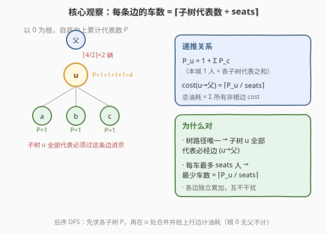
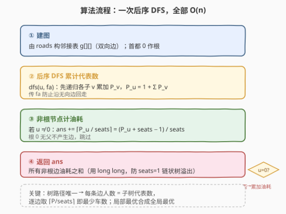
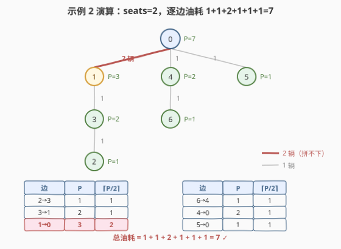

# 到达首都的最少油耗

- **题目名称**：到达首都的最少油耗
- **链接**：[2477. 到达首都的最少油耗](https://leetcode.cn/problems/minimum-fuel-cost-to-report-to-the-capital/)
- **难度**：中等
- **标签**：树、深度优先搜索、图论、贪心

## 1. 题目概述

给定一棵 `n` 个节点的无向树，节点编号 `0` 到 `n-1`，**节点 `0` 是首都**。`roads[i] = [ai, bi]` 表示城市 `ai`、`bi` 间一条双向路，共 `n-1` 条。每个城市里有一个代表要去首都开会；每个城市有一辆车，每辆车恰好能坐 `seats` 人。相邻城市之间一辆车行驶耗 1 升汽油。代表可坐本城的车，也可坐其他城的车。求所有代表到达首都的**最少总油耗**。

**示例 1**：

```text
输入：roads = [[0,1],[0,2],[0,3]], seats = 5
输出：3

    0
   /|\
  1 2 3
```

首都 `0` 是中心，三个叶子各 1 人、每车 5 座，各自开车进京耗 1 升，合计 3 升。

**示例 2**：

```text
输入：roads = [[3,1],[3,2],[1,0],[0,4],[0,5],[4,6]], seats = 2
输出：7

        0
      / | \
     1  4  5
     |  |
     3  6
     |
     2
```

**示例 3**：

```text
输入：roads = [], seats = 1
输出：0
```

只有首都一个节点，无需出行，油耗 0。

**约束条件**：

- $1 \le n \le 10^5$
- `roads.length == n - 1`，表示一棵合法的树
- $1 \le \text{seats} \le 10^5$

> 💡 题目本质：以首都 `0` 为根建父指针后，每个非根节点 `u`，其**子树内所有代表**前往首都都必经边 `(u → parent[u])`。只要知道每条边上最少需要多少辆车，把油耗加起来即可——而车的数量取决于该边要运送的人数。

---

## 2. 解题思路

### 2.1 暴力思路：枚举乘车方案

最朴素是搜索每个代表坐哪辆车、车辆如何调度，方案空间指数级爆炸，不可行。即便贪心地"能拼就拼"，若不利用树结构也会退化为 $O(n^2)$ 的逐车模拟。

> ⚠️ 瓶颈在于把"调度"当成全局搜索。实际上树中**路径唯一**：每个代表从所在城市到首都的路线是确定的，全部沿着父指针上行。因此**每条边 `(u → parent[u])` 上必须通过的人数是固定的**，等于子树 `u` 的代表总数。把"全局调度"降为"逐边计数"是化简的关键。

### 2.2 核心观察：每条边的车数 = $\lceil$ 子树代表数 $/$ seats $\rceil$



三个关键事实把问题化为一次后序 DFS：

1. **路径唯一**：以首都 `0` 为根建父指针后，任意节点 `u` 到首都的路径就是 `u → parent → … → 0`。于是子树 `u` 内所有代表前往首都，**都必须经过边 `(u → parent[u])`**（根 `0` 无父，不产生边）。
2. **每边人数固定**：定义 $P_u$ = 子树 `u` 中代表总数（含 `u` 自己）。则边 `(u → parent[u])` 必须运送的人数恰好是 $P_u$，不多不少。
3. **尽量拼满最优**：一辆车最多坐 `seats` 人，运送 $P_u$ 人过这一条边所需最少车数 $=\lceil P_u / \text{seats} \rceil$。每车过这条边耗 1 升，故该边贡献 $\lceil P_u / \text{seats} \rceil$ 升。

其中 $P_u$ 的递推是后序：

$$P_u = 1 + \sum_{c \in \text{children}(u)} P_c$$

总答案：

$$\text{ans} = \sum_{u \ne 0} \left\lceil \frac{P_u}{\text{seats}} \right\rceil$$

> 💡 **为什么各边独立取 $\lceil \cdot \rceil$ 就是最优？** 因为同一条边上的所有人终点相同（都要继续上行到首都），拼车没有"留座给后续不同方向"的损失——拼满一辆过这条边后，这群人可整体继续上行，下一条边再重新按 $P$ 取 $\lceil \cdot \rceil$。即各边最优化彼此不冲突，局部最优即全局最优（形式化见第 5 节）。

### 2.3 算法流程图



三步骨架，全部 $O(n)$：

1. **建图**：由 `roads` 构邻接表 `g`（双向）。
2. **后序 DFS**（从根 `0` 出发，传父节点 `fa` 防止沿无向边回走）：对每个节点先递归所有子节点累加 $P_c$，再加 1 得 $P_u$。
3. **非根计油耗**：若 $u \ne 0$，把 $\lceil P_u / \text{seats} \rceil$ 累加进 `ans`；根不产生边，跳过。最终返回 `ans`。

### 2.4 示例演算

以示例 2 `roads = [[3,1],[3,2],[1,0],[0,4],[0,5],[4,6]]`, `seats = 2` 为例。



**第 1 步：以 0 为根建树**

```text
        0
      / | \
     1  4  5
     |  |
     3  6
     |
     2
```

**第 2 步：后序 DFS 求 $P_u$（自底向上）**

| 节点 | 计算 | $P_u$ | 上行边 | 车数 $\lceil P_u/2 \rceil$ |
|------|------|-------|--------|---------------------------|
| 2 | 叶子 | 1 | 2→3 | $\lceil 1/2 \rceil = 1$ |
| 3 | $1 + P_2 = 1+1$ | 2 | 3→1 | $\lceil 2/2 \rceil = 1$ |
| 1 | $1 + P_3 = 1+2$ | 3 | 1→0 | $\lceil 3/2 \rceil = 2$ |
| 6 | 叶子 | 1 | 6→4 | $\lceil 1/2 \rceil = 1$ |
| 4 | $1 + P_6 = 1+1$ | 2 | 4→0 | $\lceil 2/2 \rceil = 1$ |
| 5 | 叶子 | 1 | 5→0 | $\lceil 1/2 \rceil = 1$ |
| 0 | $1+P_1+P_4+P_5 = 1+3+2+1$ | 7 | —（根无父） | — |

**第 3 步：累加上行边油耗**

$$1 + 1 + 2 + 1 + 1 + 1 = 7 \quad \checkmark$$

与示例输出一致。

> 💡 留意节点 `1`：$P_1 = 3$ 人要过边 `(1→0)`，但每车只 2 座，须 $\lceil 3/2 \rceil = 2$ 辆车——这就是"拼不下的余数也要单独发一辆车"。对照示例 1 的 `seats=5`：每个叶子 1 人独享 5 座车也只发 1 辆，$\lceil 1/5 \rceil = 1$。

---

## 3. 参考代码

### C++

```cpp
class Solution {
    long long ans = 0;
    int seats;
    vector<vector<int>> g;
    long long dfs(int u, int fa) {
        long long people = 1;                       // 本城代表
        for (int v : g[u])
            if (v != fa) people += dfs(v, u);
        if (u != 0)                                 // 非根：所有人须过边 (u→parent)
            ans += (people + seats - 1) / seats;     // 上取整 = ⌈people/seats⌉
        return people;
    }
public:
    long long minimumFuelCost(vector<vector<int>>& roads, int s) {
        seats = s;
        int n = roads.size() + 1;
        g.assign(n, {});
        for (auto& r : roads) { g[r[0]].push_back(r[1]); g[r[1]].push_back(r[0]); }
        dfs(0, -1);
        return ans;
    }
};
```

### Python

```python
class Solution:
    def minimumFuelCost(self, roads: List[List[int]], seats: int) -> int:
        import sys
        sys.setrecursionlimit(200000)
        n = len(roads) + 1
        g = [[] for _ in range(n)]
        for a, b in roads:
            g[a].append(b)
            g[b].append(a)

        ans = 0

        def dfs(u: int, fa: int) -> int:
            nonlocal ans
            people = 1                            # 本城代表
            for v in g[u]:
                if v != fa:
                    people += dfs(v, u)
            if u != 0:                            # 非根：所有人须过边 (u→parent)
                ans += (people + seats - 1) // seats
            return people

        dfs(0, -1)
        return ans
```

> 💡 **上取整写法**：`(people + seats - 1) / seats` 是整数上取整的惯用写法，等价于 $\lceil \text{people}/\text{seats} \rceil$，避免浮点。注意 `people` 与 `ans` 用 64 位：最坏 `seats=1` 时链状树总油耗可达 $O(n^2)$ 量级（$n=10^5$ 约 $5\times10^9$），超出 32 位 int 范围。

---

## 4. 复杂度分析

| 维度 | 后序 DFS | 枚举调度方案 |
|------|----------|--------------|
| **时间复杂度** | $O(n)$（每条边访问常数次：建图 + 一次 DFS） | 指数级 / $O(n^2)$ 模拟 |
| **空间复杂度** | $O(n)$（邻接表 + DFS 递归栈） | — |
| **关键化简** | 利用树路径唯一，把全局调度降为逐边 $\lceil P/\text{seats}\rceil$ 计数 | 未利用树结构 |

> ⚠️ 递归栈深最坏 $O(n)$（树退化为链时），$n=10^5$ 在 Python 默认递归上限 1000 下会栈溢出，需 `sys.setrecursionlimit`；C++ 一般可承受，若担心可改迭代后序（显式栈模拟，逻辑不变）。`seats=1` 时答案可达 $\sim5\times10^9$，务必用 64 位整数。

---

## 5. 扩展：各边独立取 $\lceil \cdot \rceil$ 的贪心正确性

对任意边 $e=(u\to\text{parent})$，必须经过它的人集合 $S_e$ 恰为子树 $u$ 的全部代表，$|S_e|=P_u$ 固定。这些人的**最终目的地相同**（都是首都），且过 $e$ 之后到首都的路径**重合**（沿父指针一路上行）。因此：

- 在 $e$ 上把这 $P_u$ 人拼进尽量少的车（$\lceil P_u/\text{seats}\rceil$ 辆）不会牺牲后续任何调度——因为这群人后续走的是同一条上行链，在每条后续边 $e'$ 上仍可重新打包（人数只增不减，$e'$ 的人数 $\ge P_u$，再取一次 $\lceil\cdot\rceil$ 即可）。
- 反证：若某方案在某条边上少发一辆车，必有人留不过去，矛盾；多发的车只会徒增油耗。故每边取最小车数 $\lceil P_u/\text{seats}\rceil$ 既是下界也可达，逐边求和即全局最优。

> 💡 这类"可分解为各边独立子问题、局部最优合成全局最优"是**贪心交换论证**的典型：假设存在更优方案，必在某条边上少用车，但该边用车数已是下界，矛盾。

---

## 6. 面试要点

1. **为什么每条边必须通过的人数恰好是子树代表数？**

   > 以首都为根建父指针后，树中任意节点到首都的简单路径唯一（沿父指针上行）。子树 $u$ 内所有代表去首都都必经边 $(u\to\text{parent}[u])$，且子树外代表不会走这条边。故该边人数 $=P_u$ = 子树代表总数，固定不变。

2. **为什么车的数量是 $\lceil P_u/\text{seats}\rceil$ 而非简单除法？**

   > 拼不下的余数也要单独发一辆车。$P_u$ 人每车最多 `seats` 座，最少车数即上取整。整数实现写 `(P + seats - 1) / seats`，避免浮点误差。

3. **为什么用 `long long` 存答案？**

   > `seats=1` 时每个代表独自开车，链状树总油耗 $=\sum$ 各子树大小 $\approx n^2/2$，$n=10^5$ 时约 $5\times10^9$，超过 32 位有符号 int 上界 $2.1\times10^9$。Python 整数无限大无此问题。

4. **根节点 0 为什么不计油耗？**

   > 根无父节点，不产生"上行边"。油耗只计非根节点 $u$ 对应的边 $(u\to\text{parent}[u])$。若 $n=1$（仅首都），无任何边，答案 0（示例 3）。

5. **能否避免递归栈溢出？**

   > 可用显式栈做迭代后序：先沿最左路压栈并记录访问状态，回退时累加 $P$。或用 BFS 先求一个从根到叶的拓扑序，再逆序处理即得后序效果，完全避免深递归。

> 💡 **一句话总结**：以首都为根后序 DFS，每节点累计子树代表数 $P_u$，对非根节点把 $\lceil P_u/\text{seats}\rceil$ 累加进答案。一次 $O(n)$ 遍历搞定，核心是"树路径唯一 → 每边人数固定 → 逐边取最少车数"。

---

## 7. 同类练习题

- [1443. 收集树上所有苹果的最少时间](https://leetcode.cn/problems/minimum-time-to-collect-all-apples-in-a-tree/)：后序 DFS 标记子树是否含苹果并累计边数，与本题"后序累计子树需求 + 非根计边"几乎同构，最直接的姊妹题
- [2467. 树上最大得分和路径](https://leetcode.cn/problems/most-profitable-path-in-a-tree/)：同为无向树 + 以根 DFS 累加路径值，对照"树中路径唯一故无需搜索"的化简前提
- [310. 最小高度树](https://leetcode.cn/problems/minimum-height-trees/)：同样以指定节点为根在树上 BFS 求深度/拓扑，巩固"以首都为根建父指针"的通用骨架
- [834. 树中距离之和](https://leetcode.cn/problems/sum-of-distances-in-tree/)：两次 DFS 求各节点到所有节点距离和，巩固"以根为起点后序 + 换根"的树形 DP 套路
- [1514. 概率最大的路径](https://leetcode.cn/problems/path-with-maximum-probability/)：在一般图（非树）上求最优路径，对照"树路径唯一故逐边贪心即可"——失去树的约束就得用 Dijkstra/SPFA
