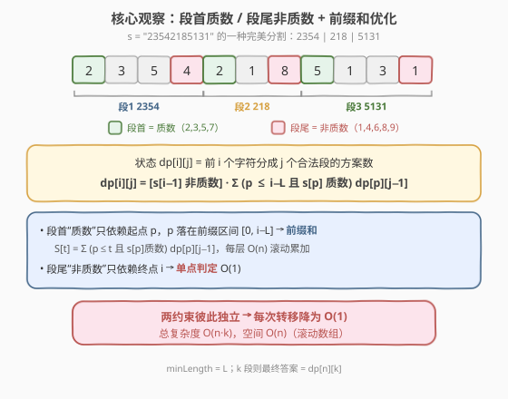
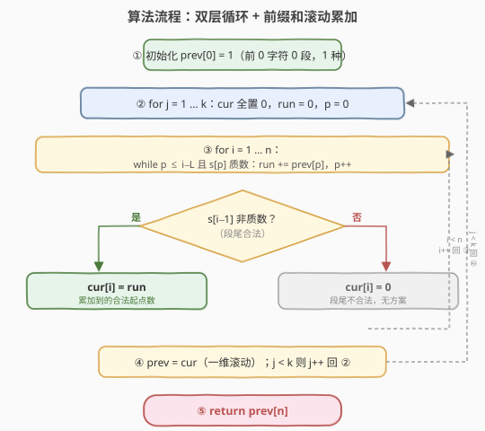
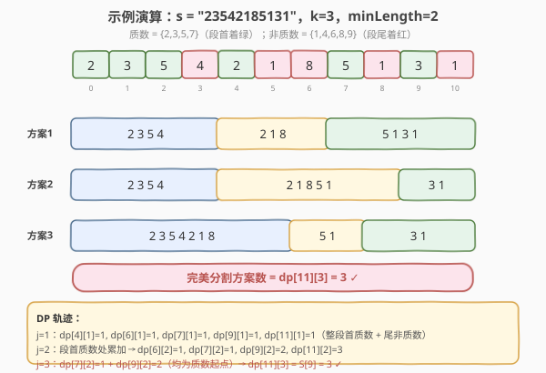

# LeetCode 完美分割的方案数 题解

## 1. 题目概述

- **标题 / 题号**：完美分割的方案数（#2478，hard）
- **链接**：https://leetcode.cn/problems/number-of-beautiful-partitions/
- **难度**：困难
- **标签**：动态规划、字符串、前缀和优化

**题意**：给你一个字符串 `s`，每个字符是数字 `'1'` 到 `'9'`，再给你两个整数 `k` 和 `minLength`。如果对 `s` 的分割满足以下条件，则认为它是一个**完美**分割：

- `s` 被分成 `k` 段互不相交的子字符串；
- 每个子字符串长度都**至少**为 `minLength`；
- 每个子字符串的第一个字符都是一个**质数**数字，最后一个字符都是一个**非质数**数字。质数数字为 `'2'`、`'3'`、`'5'`、`'7'`，其余为非质数。

返回 `s` 的完美分割数目。由于答案可能很大，返回答案对 $10^9 + 7$ 取余后的结果。

**示例 1**：

```text
输入：s = "23542185131", k = 3, minLength = 2
输出：3
解释：存在 3 种完美分割方案：
"2354 | 218 | 5131"
"2354 | 21851 | 31"
"2354218 | 51 | 31"
```

**示例 2**：

```text
输入：s = "23542185131", k = 3, minLength = 3
输出：1
解释：存在一种完美分割方案："2354 | 218 | 5131"。
```

**示例 3**：

```text
输入：s = "3312958", k = 3, minLength = 1
输出：1
解释：存在一种完美分割方案："331 | 29 | 58"。
```

**约束**：

- `1 <= k, minLength <= s.length <= 1000`
- `s` 每个字符都为数字 `'1'` 到 `'9'` 之一。

## 2. 解题思路

### 2.1 暴力思路

枚举所有把 `s` 切成 `k` 段的切法：在 `n-1` 个间隙中选 `k-1` 个切点，对每种切法逐段验证「首字符质数、尾字符非质数、长度 ≥ minLength」。切点组合数为 $\binom{n-1}{k-1}$，验证 $O(n)$，总复杂度指数级，必然超时。

更自然的做法是**划分型 DP**：定义 $dp[i][j]$ 为前 $i$ 个字符（即 $s[0..i)$）分成 $j$ 个合法段的方案数。枚举上一段的起点 $p$，则第 $j$ 段为 $s[p..i)$，需满足：

- $i - p \ge minLength$（长度合法）；
- $s[p]$ 为质数（段首合法）；
- $s[i-1]$ 为非质数（段尾合法）。

转移：

$$
dp[i][j] = \sum_{\substack{p \le i - minLength \\ s[p] \text{ 为质数}}} dp[p][j-1], \quad \text{仅当 } s[i-1] \text{ 为非质数}
$$

边界 $dp[0][0] = 1$，答案 $dp[n][k]$。朴素实现 $O(n^2 \cdot k)$，$n, k \le 1000$ 时约 $10^9$，仍会超时。

### 2.2 核心观察：段首质数依赖起点、段尾非质数依赖终点 → 前缀和



关键在于两个约束的**依赖对象不同**：

- **段首质数**约束的是**起点 $p$**，而 $p$ 取自一个前缀区间 $[0,\, i - minLength]$；
- **段尾非质数**约束的是**终点 $i$**，只对当前状态做一次判定。

于是转移就是一个「在固定前缀区间上、按 $s[p]$ 是否质数加权的求和」。由于 $s[p]$ 是否质数是**静态属性**，可对每一层 $j-1$ 预处理前缀和：

$$
S_{j-1}[t] = \sum_{\substack{p \le t \\ s[p] \text{ 为质数}}} dp[p][j-1]
$$

那么：

$$
dp[i][j] = \begin{cases} S_{j-1}[i - minLength] & \text{若 } s[i-1] \text{ 为非质数} \\ 0 & \text{否则} \end{cases}
$$

每次转移从 $O(n)$ 枚举降为 $O(1)$ 查询，整层 $O(n)$，总复杂度 $O(n \cdot k)$。由于 $j$ 层只依赖 $j-1$ 层，可用一维滚动数组把空间压到 $O(n)$。

> 💡 **可行性剪枝**：第 1 段必须以 $s[0]$ 开头（须为质数），最后一段必须以 $s[n-1]$ 结尾（须为非质数）。若 $s[0]$ 非质数或 $s[n-1]$ 为质数，直接返回 0——剪掉一类显然无解的情况，也让主循环更干净。

### 2.3 算法流程图



核心是「**前缀和指针 $p$ 随 $i$ 单调右移**」：每个 $i$ 只需把新进入合法区间的起点 $p = i - minLength$ 纳入累加器 `run`（仅当 $s[p]$ 质数），随后按 $s[i-1]$ 是否非质数决定 `cur[i] = run` 或 `0`。内层一遍扫完，外层滚动交接 `prev = cur`。

### 2.4 示例演算



以示例 1（$k=3$，$minLength=2$）为例，三层 DP 的非零状态如下：

- $j=1$：整段 $s[0..i)$ 自成一段，合法当且仅当 $s[0]$ 质数、$s[i-1]$ 非质数、$i \ge 2$。得 $dp[4][1]=dp[6][1]=dp[7][1]=dp[9][1]=dp[11][1]=1$。
- $j=2$：在段首为质数的起点处累加。$dp[6][2]=1$、$dp[7][2]=1$、$dp[9][2]=2$、$dp[11][2]=3$。
- $j=3$：仅 $p=7$（$s[7]$='5' 质数，$dp[7][2]=1$）与 $p=9$（$s[9]$='3' 质数，$dp[9][2]=2$）贡献，$S[9]=1+2=3$，故 $dp[11][3]=3$。

最终答案 $dp[11][3] = 3$ ✓。

## 3. 参考代码

### C++

```cpp
class Solution {
    static constexpr int MOD = 1000000007;

  public:
    int beautifulPartitions(string s, int k, int minLength) {
        int n = s.size();
        auto isPrime = [](char c) {
            return c == '2' || c == '3' || c == '5' || c == '7';
        };
        if (!isPrime(s[0]) || isPrime(s[n - 1])) return 0;

        vector<int> prev(n + 1, 0), cur(n + 1, 0);
        prev[0] = 1;
        for (int j = 1; j <= k; j++) {
            fill(cur.begin(), cur.end(), 0);
            long long run = 0;
            int p = 0;
            for (int i = 1; i <= n; i++) {
                while (p <= i - minLength) {
                    if (isPrime(s[p])) run = (run + prev[p]) % MOD;
                    p++;
                }
                if (!isPrime(s[i - 1])) cur[i] = (int)run;
            }
            swap(prev, cur);
        }
        return prev[n];
    }
};
```

### Python

```python
class Solution:
    def beautifulPartitions(self, s: str, k: int, minLength: int) -> int:
        MOD = 10**9 + 7
        n = len(s)
        prime = set("2357")
        if s[0] not in prime or s[-1] in prime:
            return 0

        prev = [0] * (n + 1)
        prev[0] = 1
        for _ in range(k):
            cur = [0] * (n + 1)
            run = 0
            p = 0
            for i in range(1, n + 1):
                while p <= i - minLength:
                    if s[p] in prime:
                        run = (run + prev[p]) % MOD
                    p += 1
                if s[i - 1] not in prime:
                    cur[i] = run
            prev = cur
        return prev[n]
```

## 4. 复杂度分析

| 维度 | 复杂度 | 说明 |
|------|--------|------|
| 时间复杂度 | $O(n \cdot k)$ | 外层 $k$ 轮，每轮内层指针 $p$ 随 $i$ 单调右移、累计移动 $O(n)$ 次 |
| 空间复杂度 | $O(n)$ | 仅保留上一层 `prev` 与当前层 `cur`，滚动数组 |

## 5. 扩展：状态定义的等价改写

也可把状态写成「**以 $i$ 为最后一段结尾、共 $j$ 段**」的形式，并显式维护一个「段首质数」前缀和数组 `pref[t]`：先算出整层 `prev`，再一次性构造 `pref`，最后用 `cur[i] = (s[i-1] 非质数) ? pref[i-minLength] : 0`。这种「先建表再查询」的两遍写法与本解「边扫边累加」的单遍写法等价，复杂度同为 $O(n \cdot k)$，区别仅在常数与代码结构。面试时按可读性择一即可。

## 6. 面试要点

1. **状态如何定义？为什么要二维？**
   - $dp[i][j]$ = 前 $i$ 个字符分成 $j$ 个合法段的方案数。需要 $j$ 这一维，因为「分满 $k$ 段」是硬性约束，段数与位置必须同时记录。

2. **朴素 $O(n^2 k)$ 为什么超时、怎么优化到 $O(nk)$？**
   - 转移是对一个前缀区间 $[0, i-minLength]$ 上、按 $s[p]$ 是否质数加权的求和；权重静态，故用前缀和把每次转移压到 $O(1)$。

3. **段首质数与段尾非质数为什么能拆开处理？**
   - 前者依赖起点 $p$（进入前缀和），后者依赖终点 $i$（单点判定），二者作用于不同位置、互不冲突，因此可分别归入「求和」与「门控」。

4. **前缀和指针 $p$ 为什么是单调的？会重复累加吗？**
   - $i$ 单调递增，$i-minLength$ 单调递增，$p$ 只右移不回退，每个起点恰被纳入一次；不重不漏。

5. **为什么要先判断 $s[0]$ 质数、$s[n-1]$ 非质数？**
   - 第 1 段必以 $s[0]$ 开头、末段必以 $s[n-1]$ 结尾，违反则整串无解，直接返回 0，既剪枝也让主循环逻辑更干净。

## 同类练习题

| # | 题目 | 与本题的关联 |
|---|------|-------------|
| 132 | [分割回文串 II](https://leetcode.cn/problems/palindrome-partitioning-ii/)（[题解](../0101-0200/132_分割回文串II.md)） | 同样是「划分型 DP + 预处理表加速转移」，对照前缀和优化思路 |
| 139 | [单词拆分](https://leetcode.cn/problems/word-break/)（[题解](../0101-0200/139_单词拆分.md)） | 前缀缓存 + 增量查询的划分型 DP，承接「前缀复用」思想 |
| 410 | [分割数组的最大值](https://leetcode.cn/problems/split-array-largest-sum/)（[题解](../0401-0500/410_分割数组的最大值.md)） | 切分约束型问题，可对照「二分答案」与「划分型 DP」两条路线 |
| 2463 | [最小移动总距离](https://leetcode.cn/problems/minimum-total-distance-traveled/)（[题解](../2401-2500/2463_最小移动总距离.md)） | 同区间的划分型 DP + 前缀和优化，难度与套路相近 |
