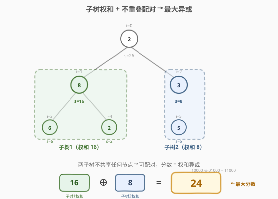
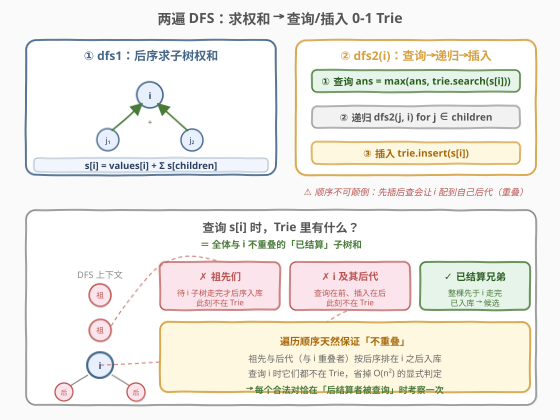

# 两个不重叠子树的最大异或值

- **题目名称**：两个不重叠子树的最大异或值
- **链接**：[2479. 两个不重叠子树的最大异或值](https://leetcode.cn/problems/maximum-xor-of-two-non-overlapping-subtrees/) 🔒
- **难度**：困难
- **标签**：树、深度优先搜索、字典树（0-1 Trie）、位运算

## 1. 题目概述

给定一棵 **$n$ 个节点**的无向树，节点编号 $0$ 到 $n-1$，**根为节点 $0$**。再给定 `edges`（长度 $n-1$，`edges[i]=[a_i,b_i]` 表示一条边）和 `values`（`values[i]` 为节点 $i$ 的**值**）。

**子树**：某节点及其所有后代组成的树。**不重叠**：两棵子树**不含任何公共节点**。

**分数**：任选两棵不重叠子树，分别求其**节点值之和**，再对这两个和做**按位异或**，即得分。返回能达到的**最大分数**；若无法选出两棵不重叠子树，返回 `0`。

**示例 1**：

```text
输入：n = 6, edges = [[0,1],[0,2],[1,3],[1,4],[2,5]], values = [2,8,3,6,2,5]
输出：24
解释：节点 1 的子树权和 = 8+6+2 = 16；节点 2 的子树权和 = 3+5 = 8；
      16 XOR 8 = 24，为可达到的最大分数。
```

**示例 2**：

```text
输入：n = 3, edges = [[0,1],[1,2]], values = [4,6,1]
输出：0
解释：树是一条链 0-1-2，任意两棵子树必有一棵含另一棵的根（祖先-后代），无法不重叠，返回 0。
```

**约束条件**：

- $2 \le n \le 5\times 10^4$
- `edges.length == n - 1`，$0 \le a_i, b_i < n$，保证 `edges` 构成一棵合法树
- `values.length == n`，$1 \le \text{values}[i] \le 10^9$

> 💡 注意这里的「子树」是**权和（求和）后再异或**，不是把子树所有节点值逐个异或。子树权和最大可达 $n\times\max(\text{values}) \approx 5\times10^{13}$，需用 `long long`，且 0-1 Trie 要开到约 **48 位**（$2^{47}>5\times10^{13}$）。

---

## 2. 解题思路

### 2.1 暴力思路：枚举所有节点对

最直白的做法：

1. 一次 DFS 预处理每个节点的子树权和 $s[i]$（$O(n)$）；
2. 用**欧拉序（入/出时间戳）**判定祖先关系：$u$ 是 $v$ 的祖先 $\Leftrightarrow \text{tin}[u]\le \text{tin}[v]\le \text{tout}[u]$；
3. 枚举所有节点对 $(i,j)$，若「$i$ 不是 $j$ 的祖先且 $j$ 不是 $i$ 的祖先」则不重叠，用 $s[i]\oplus s[j]$ 更新答案。

```text
for i in 0..n:
    for j in i+1..n:
        if not (ancestor(i,j) or ancestor(j,i)):
            ans = max(ans, s[i] ^ s[j])
```

节点对 $O(n^2)$，$n=5\times10^4$ 时高达 $1.25\times10^9$ 次异或更新，常数虽小但**必然 TLE**。

> ⚠️ 瓶颈在于「不重叠」判定把所有 $O(n^2)$ 对都摊开扫一遍，**没有任何剪枝**。突破口：把「不重叠」从「显式判定」转化为「**遍历顺序的天然保证**」——只要让候选集合里只放「已经结算完且与当前节点天然不重叠」的子树，连判定都省了。

### 2.2 核心观察：后序插入的 0-1 Trie 不重式



两步关键转化：

**① 把「不重叠」翻译成「祖先关系」。** 两棵子树不重叠 $\Leftrightarrow$ 两棵子树的根**互不为祖先**。因为「子树 = 根 + 所有后代」，若 $i$ 是 $j$ 的祖先，则 $j\in$ 子树$(i)$，二者必共享节点 $j$；反之同理。所以：

$$\text{不重叠}(i,j) \iff \neg\,\text{ancestor}(i,j)\ \wedge\ \neg\,\text{ancestor}(j,i)$$

**② 把「互不为祖先」翻译成「DFS 的先后结算」。** 在一次根向 DFS 里，若 $i$ 与 $j$ 互不为祖先，则它们各自的子树**互不相交**，于是在 DFS 序中**一棵子树必然被整棵走完，才开始走另一棵**。把子树权和 $s[i]$ **按后序（处理完整棵子树之后）**插入 0-1 Trie，那么：

- 当我们在节点 $i$ **处查询** $s[i]$ 时，Trie 里装的全是「**已经整棵结算完**」的子树和；
- 这些已结算的子树根 $u$，其子树**整棵在 $i$ 之前被走完**，故 $u$ 既不是 $i$ 的祖先（祖先们要等 $i$ 子树走完才后序入库，此刻不在 Trie 里），也不在子树$(i)$ 里（$i$ 的后代要等 $i$ 递归内部才入库，此刻也不在 Trie 里）；
- 所以 **Trie 此刻的内容 = 全体与 $i$ 不重叠的候选 $u$**，且每个合法对 $(i,u)$ **恰好在查询 $i$ 时被考察一次**（先结算的那棵在后结算的那棵查询时入 Trie）。

于是「不重叠」判定被**遍历顺序免费保证**，省掉 $O(n^2)$ 的枚举，剩下的就是经典的 **0-1 Trie 求最大异或值**（承接 [421. 数组中两个数的最大异或值](https://leetcode.cn/problems/maximum-xor-of-two-numbers-in-an-array/)）。

> 💡 **一句话**：查询在前、插入在后（后序），让「不重叠」成为遍历天然不变式，0-1 Trie 负责「在不变式集合上求最大异或」。

### 2.3 算法流程图



骨架分两遍 DFS：

1. **`dfs1`（后序求权）**：$s[i] = \text{values}[i] + \sum_{j\in\text{children}(i)} s[j]$，先递归子节点再累加。
2. **`dfs2`（查询-递归-插入）**：
   - **① 查询**：`ans = max(ans, trie.search(s[i]))`——此刻 Trie = 与 $i$ 不重叠的已结算子树和；
   - **② 递归**：对所有子节点 $j\ne$ 父亲做 `dfs2(j, i)`（在此期间 $i$ 的后代陆续入库，但那是 $i$ 自己的后代，与 $i$ 重叠，本就不该配对，且它们都在 $i$ 查询之后入库，不影响 $i$）；
   - **③ 插入**：`trie.insert(s[i])`——$i$ 整棵子树结算完毕，入库供「后续才进入的、与 $i$ 不重叠的兄弟/堂兄弟」查询。

> ⚠️ **顺序不可颠倒**：必须「先查询、后插入」。若先插入 $s[i]$ 再查询，则 $i$ 会和自己子树里刚插入的后代配对（重叠！），产生非法大值。

### 2.4 示例演算

以示例 1 的树为例，先 `dfs1` 得子树权和：

| 节点 $i$ | 值 | 子树权和 $s[i]$ |
|----------|----|-----------------|
| 3 / 4 / 5 | 6 / 2 / 5 | 6 / 2 / 5 |
| 1 | 8 | $8+6+2=16$ |
| 2 | 3 | $3+5=8$ |
| 0 | 2 | $2+16+8=26$ |

`dfs2`（按 $0\to1\to3,4\to2\to5$ 的顺序）逐步演算：

![示例演算：dfs2 每步的 Trie 内容与查询结果，最终在查询 s[2]=8 时命中已入库的 s[1]=16，得 24](../images/maxxor_subtrees_example_walkthrough.svg)

| 步骤 | 动作 | 节点 $i$ | $s[i]$ | 查询前 Trie | 查询结果 | 更新后 ans | Trie 入库 |
|------|------|----------|--------|-------------|----------|-----------|-----------|
| 1 | 查/递/插 | 0 | 26 | $\{\}$ | 0 | 0 | — |
| 2 | 查/递 | 1 | 16 | $\{\}$ | 0 | 0 | — |
| 3 | 查/插 | 3 | 6 | $\{\}$ | 0 | 0 | $\{6\}$ |
| 4 | 查/插 | 4 | 2 | $\{6\}$ | $2\oplus6=4$ | 4 | $\{6,2\}$ |
| 5 | 插 | 1 | 16 | — | — | 4 | $\{6,2,16\}$ |
| 6 | 查/递 | 2 | 8 | $\{6,2,16\}$ | $\max(8\oplus6,8\oplus2,8\oplus16)=24$ | **24** | — |
| 7 | 查/插 | 5 | 5 | $\{6,2,16\}$ | $\max(5\oplus6,5\oplus2,5\oplus16)=21$ | 24 | $\{\dots,5\}$ |
| 8 | 插 | 2 | 8 | — | — | 24 | $\{\dots,8\}$ |
| 9 | 插 | 0 | 26 | — | — | 24 | $\{\dots,26\}$ |

- **第 6 步是关键**：查询 $s[2]=8$ 时，$s[1]=16$ 已在第 5 步入库（子树 1 整棵先于子树 2 走完），$8\oplus16=24$ 即为答案。
- **示例 2（链 0-1-2）**：每进入一个节点 Trie 都是空（祖先们要后序才入库，后代还没走），全程查询得 0，自然返回 `0`——**链状树天然无解**。

---

## 3. 参考代码

### C++

```cpp
using ll = long long;

class Trie {
public:
    vector<Trie*> children;
    Trie() : children(2) {}

    void insert(ll x) {
        Trie* node = this;
        for (int i = 47; ~i; --i) {                 // 48 位，覆盖到 2^47 > 5e13
            int v = (x >> i) & 1;
            if (!node->children[v]) node->children[v] = new Trie();
            node = node->children[v];
        }
    }

    ll search(ll x) {
        Trie* node = this;
        ll res = 0;
        for (int i = 47; ~i; --i) {
            if (!node) return res;                  // Trie 为空 / 路径断时返回已得前缀
            int v = (x >> i) & 1;
            if (node->children[v ^ 1]) {            // 能走相反位 → 该位异或为 1
                res = res << 1 | 1;
                node = node->children[v ^ 1];
            } else {                               // 只能走同位 → 该位异或为 0
                res <<= 1;
                node = node->children[v];
            }
        }
        return res;
    }
};

class Solution {
public:
    long long maxXor(int n, vector<vector<int>>& edges, vector<int>& values) {
        vector<vector<int>> g(n);
        for (auto& e : edges) {
            g[e[0]].push_back(e[1]);
            g[e[1]].push_back(e[0]);
        }

        vector<ll> s(n);
        function<ll(int, int)> dfs1 = [&](int i, int fa) -> ll {   // ① 后序求子树权和
            ll t = values[i];
            for (int j : g[i])
                if (j != fa) t += dfs1(j, i);
            s[i] = t;
            return t;
        };
        dfs1(0, -1);

        Trie tree;
        ll ans = 0;
        function<void(int, int)> dfs2 = [&](int i, int fa) {        // ② 查询-递归-插入
            ans = max(ans, tree.search(s[i]));                      //   先查询：Trie=已结算的非重叠子树和
            for (int j : g[i])
                if (j != fa) dfs2(j, i);
            tree.insert(s[i]);                                     //   后插入：整棵子树结算完才入库
        };
        dfs2(0, -1);
        return ans;
    }
};
```

> 💡 **位宽取 48（`i` 从 47 降到 0）**：子树权和 $\le 5\times10^4\times10^9=5\times10^{13}$，而 $2^{47}\approx1.4\times10^{14}>5\times10^{13}$，48 位足够且留有余量。开少了会漏掉高位、开多了只是常数浪费。

### Python

```python
class Trie:
    def __init__(self):
        self.children = [None, None]

    def insert(self, x: int) -> None:
        node = self
        for i in range(47, -1, -1):                # 48 位，覆盖到 2^47 > 5e13
            v = (x >> i) & 1
            if node.children[v] is None:
                node.children[v] = Trie()
            node = node.children[v]

    def search(self, x: int) -> int:
        node = self
        res = 0
        for i in range(47, -1, -1):
            v = (x >> i) & 1
            if node is None:                      # Trie 为空 / 路径断时返回已得前缀
                return res
            if node.children[v ^ 1]:              # 能走相反位 → 该位异或为 1
                res = res << 1 | 1
                node = node.children[v ^ 1]
            else:                                 # 只能走同位 → 该位异或为 0
                res <<= 1
                node = node.children[v]
        return res


class Solution:
    def maxXor(self, n: int, edges: List[List[int]], values: List[int]) -> int:
        g = defaultdict(list)
        for a, b in edges:
            g[a].append(b)
            g[b].append(a)

        s = [0] * n
        def dfs1(i: int, fa: int) -> int:           # ① 后序求子树权和
            t = values[i]
            for j in g[i]:
                if j != fa:
                    t += dfs1(j, i)
            s[i] = t
            return t
        dfs1(0, -1)

        ans = 0
        tree = Trie()
        def dfs2(i: int, fa: int) -> None:          # ② 查询-递归-插入
            nonlocal ans
            ans = max(ans, tree.search(s[i]))        #   先查询
            for j in g[i]:
                if j != fa:
                    dfs2(j, i)
            tree.insert(s[i])                       #   后插入
        dfs2(0, -1)
        return ans
```

> ⚠️ Python 默认递归深度 1000，链状树（$n=5\times10^4$）会 `RecursionError`。提交前需 `sys.setrecursionlimit(200000)`，或把 `dfs1`/`dfs2` 改写为显式栈的迭代版（先做一次栈模拟求后序序列，再逆后序入 Trie）。

---

## 4. 复杂度分析

| 维度 | 后序插入 0-1 Trie | 暴力枚举节点对 |
|------|-------------------|-----------------|
| **时间复杂度** | $O(n\log M)$，$M$ 为最大子树权和（$\approx5\times10^{13}$，$\log M\approx48$） | $O(n^2)$（枚举 + 判祖先） |
| **空间复杂度** | $O(n\log M)$（Trie 节点 $\le 48n$）+ 递归栈 $O(h)$ | $O(n)$（欧拉序数组） |
| **能否通过** | $\approx2.4\times10^6$ 次位运算，稳过 | $\approx1.25\times10^9$ 次更新，TLE |

> 💡 $M\le5\times10^{13}$、$\log M\le48$，故时间 $O(48n)\approx2.4\times10^6$；Trie 节点上界 $48n\approx2.4\times10^6$ 个，每个 $2$ 指针，内存约几十 MB，安全。链状树递归深 $n$，C++ 一般不爆栈，Python 必须 `setrecursionlimit`。

---

## 5. 扩展：为什么「分治 + Trie 跨子树配对」也能做但更绕

另一条思路是 **分治**：对每个节点 $w$，在左子树集合 $L$ 与右子树集合 $R$ 之间求最大异或对（左右子树天然不重叠），再递归左右。这能正确覆盖所有不重叠对（任一对的 LCA 处必有一方在左、一方在右）。

但朴素分治（「插 $L$ 查 $R$」）在「梳状树」（每层一个叶子 + 一条长链）下退化为 $O(n^2)$——每层都要把几乎全树的和塞进 Trie。要避免需上「**小集合入 Trie、大集合查询**」的小到大合并，实现远比「后序插入」复杂。而「后序插入」只用**一遍 DFS + 一个全局 Trie**，靠遍历顺序天然维持不变式，是本题最简的最优解。

---

## 6. 面试要点

1. **为什么「先查询、后插入（后序）」就能保证不重叠？**

   > 后序插入意味着节点 $i$ 在其整棵子树走完后才入库。查询 $i$ 时，Trie 里只有「更早整棵结算完」的子树根 $u$：它们要么是 $i$ 的「已走完的兄弟/堂兄弟」子树（与 $i$ 不重叠），要么是 $i$ 祖先们的「已走完兄弟」子树（也与 $i$ 不重叠）。而 $i$ 的祖先（待后序入库）和 $i$ 的后代（待 $i$ 递归内部入库）此刻都不在 Trie 里——它们正是会与 $i$ 重叠的对象，被顺序天然排除。

2. **顺序颠倒（先插入后查询）会怎样？**

   > 若先 `insert(s[i])` 再 `search`，则 $i$ 刚入库后，其子树内部某后代 $j$ 查询时会命中 $s[i]$，而 $i$ 是 $j$ 的祖先 → **重叠**，产生非法大值。必须「查询在前、插入在后」。

3. **0-1 Trie 的位宽为什么是 48？能不能更少/更多？**

   > 子树权和 $\le n\times\max v=5\times10^{13}$，$\lceil\log_2(5\times10^{13})\rceil=46$，最高有效位是第 45 位。从 47 起降两位留余量（防边界、防实现里多一位），共 48 位；再多只是常数浪费，再少会漏高位导致结果偏小。

4. **链状树为什么必返回 0？**

   > 链 $0-1-2-\dots$ 中每个节点都是更小编号节点的后代、更大编号节点的祖先，**任两节点必为祖先-后代**，故无任何不重叠对。算法上：进入每个节点时 Trie 恒空（祖先未入库、后代未走），查询恒得 0，ans 全程 0，自然返回 `0`。

5. **Trie 的 `search` 在 Trie 为空时返回什么？为什么是对的？**

   > 返回 `0`：根无子节点时，第一轮 `node` 非空但 `children` 全空，走 `else` 分支后 `node` 变 `None`，下一轮 `if node is None: return res` 返回 `0`。`ans=max(ans,0)` 不影响「无解返回 0」的语义，也保证不误报正数。

> 💡 **一句话总结**：后序插入让「不重叠」成为遍历天然不变式，0-1 Trie 在不变式集合上求最大异或，一遍 DFS 搞定，$O(n\log M)$ / $O(n\log M)$。

---

## 7. 同类练习题

- [421. 数组中两个数的最大异或值](https://leetcode.cn/problems/maximum-xor-of-two-numbers-in-an-array/)：**0-1 Trie 求最大异或母题**，本题的 Trie 查询/插入逻辑直接来自它，区别仅在于候选集合是「树上不重叠子树和」而非「数组元素」
- [1707. 与数组中元素的最大异或值](https://leetcode.cn/problems/maximum-xor-with-an-element-from-array/)：0-1 Trie + 限制条件（异或对象需 $\le$ 阈值），训练「在受限集合上做最大异或」的进阶查询写法
- [2476. 二叉搜索树最近节点查询](../2401-2500/2476_二叉搜索树最近节点查询.md)：同样是「把树形信息摊平后在有序结构上查询」，对照「中序摊平 + 二分」与「后序插入 + Trie」两种摊平思路
- [2421. 好路径的数目](../2401-2500/2421_好路径的数目.md)：树上按值排序 + 并查集维护「连通且端点同值」的路径计数，与本题「靠遍历/合并维持候选集合不变式」的思路同源，对照两种不变式维护手法
