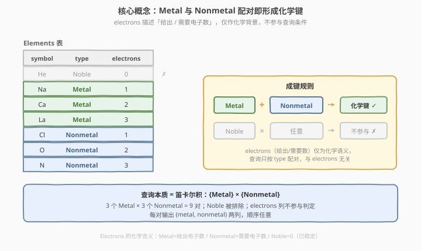
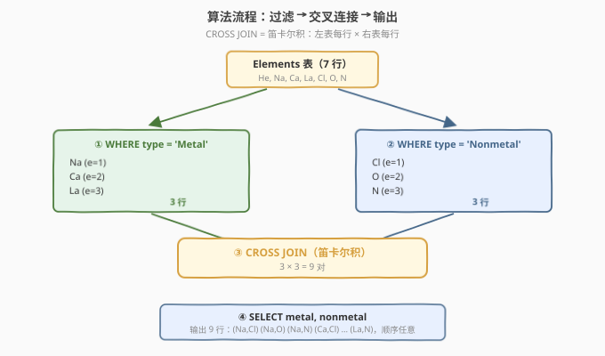
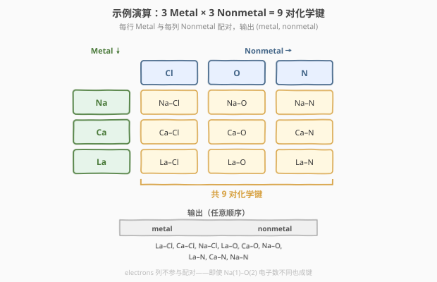

# LeetCode 形成化学键 题解

## 1. 题目概述

- **标题 / 题号**：形成化学键（#2480，easy）
- **链接**：https://leetcode.cn/problems/form-a-chemical-bond/
- **难度**：简单
- **标签**：数据库、SQL、`CROSS JOIN`、笛卡尔积、自连接、LeetCode 锁题

**题意**：给定 `Elements` 表，每行记录一个化学元素的信息。编写解决方案找出所有**可以形成化学键的元素对**，以**任意顺序**返回。

**表结构**：

```text
Table: Elements
+-------------+------------------------------------------+
| Column Name | Type                                     |
+-------------+------------------------------------------+
| symbol      | varchar(2)                               |  ← 主键
| type        | ENUM('Metal', 'Nonmetal', 'Noble')       |
| electrons   | int                                      |
+-------------+------------------------------------------+
symbol 是该表的主键（具有唯一值的列）。
该表的每一行包含一个元素的信息。
type 是 ENUM 类型，取值 ('Metal', 'Nonmetal', 'Noble') 之一：
 - 若 type 为 Noble，electrons = 0；
 - 若 type 为 Metal，electrons = 该元素一个原子能「给出」的电子数；
 - 若 type 为 Nonmetal，electrons = 该元素一个原子「需要」的电子数。
```

> ⚠️ **本题是 LeetCode Plus 会员锁题**，官方题面在站内需会员权限查看。本篇题面依据 LeetCode 公开接口（`mysqlSchemas` 与 `sampleTestCase`）还原：表结构与示例数据即下文所示，题意为「若一元素是 Metal、另一元素是 Nonmetal，则它们可形成化学键；找出所有这样的元素对」。electrons 列虽给出化学语义（给出/需要电子数），但**成键判定只看 type**，与 electrons 值无关。

**成键规则**（题面原文）：

> 如果一个元素是 `'Metal'`，另外一个元素是 `'Nonmetal'`，那么它们可以形成键。

即：Metal × Nonmetal 的**笛卡尔积**即为答案；Noble 气体不参与任何配对。

**示例 1**：

```text
输入：
Elements 表:
+--------+----------+-----------+
| symbol | type     | electrons |
+--------+----------+-----------+
| He     | Noble    | 0         |
| Na     | Metal    | 1         |
| Ca     | Metal    | 2         |
| La     | Metal    | 3         |
| Cl     | Nonmetal | 1         |
| O      | Nonmetal | 2         |
| N      | Nonmetal | 3         |
+--------+----------+-----------+

输出：
+-------+----------+
| metal | nonmetal |
+-------+----------+
| La    | Cl       |
| Ca    | Cl       |
| Na    | Cl       |
| La    | O        |
| Ca    | O        |
| Na    | O        |
| La    | N        |
| Ca    | N        |
| Na    | N        |
+-------+----------+

解释：
Metal 元素包括 La, Ca, Na；Nonmetal 元素包括 Cl, O, N。
每个 Metal 元素与每个 Nonmetal 元素配对 → 3 × 3 = 9 对。
```

**约束**：

- `symbol` 为表主键，行唯一。
- `type` 取值限定为 `Metal` / `Nonmetal` / `Noble` 三种之一。
- Noble 的 `electrons` 恒为 0。
- 结果返回 `metal`、`nonmetal` 两列，**顺序任意**。

> 💡 **审题关键**：① **成键只看 `type`**——题面明文「Metal + Nonmetal 即可成键」，无需比较 `electrons` 是否相等，electrons 是化学背景而非查询条件；② **笛卡尔积**——3 个 Metal × 3 个 Nonmetal = 9 对，每对都算，无去重无筛选；③ **Noble 排除**——Noble 既非 Metal 也非 Nonmetal，不参与任何配对；④ **顺序任意**——无需 `ORDER BY`，降低输出比对的严格性。

## 2. 解题思路

### 2.1 暴力思路：嵌套循环枚举配对

最直觉的过程式思维：取出所有 Metal 元素与所有 Nonmetal 元素，两层循环逐对配对输出。

```text
metals = [r for r in Elements if r.type == 'Metal']
nonmetals = [r for r in Elements if r.type == 'Nonmetal']
for m in metals:
    for n in nonmetals:
        emit (m.symbol, n.symbol)
```

逻辑完全正确——而 SQL 恰有声明式表达「两集合全配对」的招牌机制：**`CROSS JOIN`（笛卡尔积）**。把 Metal 集合与 Nonmetal 集合做交叉连接，一句即得全部 9 对。

### 2.2 核心观察：CROSS JOIN 笛卡尔积



把题意落到 SQL 机制上：

| 题意要求 | SQL 机制 | 语义 |
|----------|----------|------|
| 「Metal」 | `WHERE type = 'Metal'` | 从 Elements 过滤出金属集合 $M$ |
| 「Nonmetal」 | `WHERE type = 'Nonmetal'` | 从 Elements 过滤出非金属集合 $N$ |
| 「它们可以形成键」 | `CROSS JOIN` | $M \times N$ 笛卡尔积，每对都成键 |
| 「找出所有元素对」 | `SELECT a.symbol AS metal, b.symbol AS nonmetal` | 输出两列 |

形式化地，设 Metal 集合 $M = \{m_1, \dots, m_p\}$，Nonmetal 集合 $N = \{n_1, \dots, n_q\}$，则

$$
\text{ans} \;=\; M \times N \;=\; \{\, (m_i,\, n_j) \;:\; 1 \le i \le p,\ 1 \le j \le q \,\}
$$

答案行数 $= |M| \times |N| = p \times q$。示例中 $p = 3$、$q = 3$，故 $|\text{ans}| = 9$。

> 💡 **为什么 electrons 不参与判定？** 题面明文给出成键条件——「一个 Metal + 一个 Nonmetal」即成键，并未要求「给出电子数 = 需要电子数」。`electrons` 列的化学语义（Metal 给出 / Nonmetal 需要）是**背景说明**，用来让题目「像化学题」，但查询条件里完全不用它。看示例输出即可确认：Na(1)–O(2) 电子数不同却仍成键、仍出现在输出中。审题第一要务：**分清「背景信息」与「判定条件」**。

> ⚠️ **常见误区**：看到 `electrons` 列就联想到「电子数相等才成键」，从而写 `ON a.electrons = b.electrons`。这会把 9 对砍到 3 对（Na–Cl、Ca–O、La–N），与示例输出的 9 对矛盾。题面只说「Metal + Nonmetal → 成键」，无电子数匹配要求——**以示例输出为准**。

### 2.3 算法流程图



**逻辑执行步骤**：

| 步骤 | 子句 | 作用 |
|------|------|------|
| ① | `Elements AS a WHERE a.type = 'Metal'` | 取金属集合 $M$（示例 3 行：Na, Ca, La） |
| ② | `Elements AS b WHERE b.type = 'Nonmetal'` | 取非金属集合 $N$（示例 3 行：Cl, O, N） |
| ③ | `CROSS JOIN`（或逗号 `,` 隐式连接） | $M \times N$ 笛卡尔积，3×3 = 9 行 |
| ④ | `SELECT a.symbol AS metal, b.symbol AS nonmetal` | 输出两列，顺序任意 |

> 💡 **`CROSS JOIN` vs 逗号 `,`**：SQL 中 `A CROSS JOIN B` 与 `FROM A, B`（逗号隐式连接，无 `WHERE` 连接条件时）**语义完全等价**，都是笛卡尔积。`CROSS JOIN` 是 SQL-92 标准的显式写法，意图更清晰；逗号 `,` 是旧式写法，更简洁。两者在无连接条件时都产出 $|A| \times |B|$ 行。本题无连接条件（成键只看 type），故用交叉连接而非内连接 `INNER JOIN ... ON`。

### 2.4 示例演算

以示例 1 的 7 行 Elements 为例，走一遍配对过程：



| | Cl | O | N |
|------|------|------|------|
| **Na** | Na–Cl | Na–O | Na–N |
| **Ca** | Ca–Cl | Ca–O | Ca–N |
| **La** | La–Cl | La–O | La–N |

- Metal 集合 $M = \{\text{Na}, \text{Ca}, \text{La}\}$（3 个）；
- Nonmetal 集合 $N = \{\text{Cl}, \text{O}, \text{N}\}$（3 个）；
- He 为 Noble，既不在 $M$ 也不在 $N$，不参与任何配对；
- 笛卡尔积 $M \times N$ 共 $3 \times 3 = 9$ 对，每对输出 `(metal, nonmetal)`，顺序任意。

> 💡 **electrons 不同也成键**：Na 的 electrons=1、O 的 electrons=2，二者不等却仍配对出现在输出中——这印证了「成键只看 type，不看 electrons」。若误加 `ON a.electrons = b.electrons`，Na–O、Na–N、Ca–Cl、Ca–N、La–Cl、La–O 六对会被错误剔除，只剩 3 对，与示例矛盾。

## 3. 参考代码

### SQL（解法 A：显式 `CROSS JOIN`，推荐）

```sql
# Write your MySQL query statement below
SELECT a.symbol AS metal, b.symbol AS nonmetal
FROM Elements AS a
JOIN Elements AS b
  ON a.type = 'Metal' AND b.type = 'Nonmetal';
```

> 💡 **写法要点**：
> - `JOIN ... ON a.type='Metal' AND b.type='Nonmetal'`：把「过滤」与「连接」合到 `ON` 条件里。当 `ON` 中只含各自的过滤谓词、无两表间关联条件时，`INNER JOIN` 退化为笛卡尔积（等价 `CROSS JOIN`），产出 $|M| \times |N|$ 行。
> - `a.symbol AS metal, b.symbol AS nonmetal`：别名为输出列命名，与题面要求的 `metal` / `nonmetal` 列名对齐。
> - 无 `ORDER BY`：题面允许任意顺序。
> - 同一表 `Elements` 自连接两次（`AS a` / `AS b`），各取一个子集再交叉。

### SQL（解法 B：CTE 先过滤再 `CROSS JOIN`）

先分别筛出 Metal 与 Nonmetal 两张子表，再做笛卡尔积，逻辑层次更清晰：

```sql
WITH metals AS (
    SELECT symbol FROM Elements WHERE type = 'Metal'
),
nonmetals AS (
    SELECT symbol FROM Elements WHERE type = 'Nonmetal'
)
SELECT m.symbol AS metal, n.symbol AS nonmetal
FROM metals AS m
CROSS JOIN nonmetals AS n;
```

> 💡 **解法 B 的优势**：过滤与连接**分两步**——CTE 先把 7 行表收缩成 3 行 Metal 子表和 3 行 Nonmetal 子表，再 `CROSS JOIN` 做 3×3 笛卡尔积。相比解法 A 的「7×7 全连接后再按 type 过滤」，解法 B 的连接输入更小（3×3 而非 7×7），在引擎未做谓词下推时效率更优。现代优化器通常能将解法 A 重写为解法 B，二者执行计划等价；但解法 B 的**意图表达**更直白——「先取两集合，再全配对」一气呵成。

### SQL（解法 C：逗号隐式连接，最简写法）

```sql
SELECT a.symbol AS metal, b.symbol AS nonmetal
FROM Elements AS a, Elements AS b
WHERE a.type = 'Metal' AND b.type = 'Nonmetal';
```

> 💡 **逗号 `,` = 无条件 `CROSS JOIN`**：`FROM A, B`（逗号隐式连接）与 `FROM A CROSS JOIN B` 在无 `WHERE` 连接条件时**语义完全等价**。本题 `WHERE` 只含各自 type 过滤、无两表关联条件，故 7×7 全配对后按 `WHERE` 筛留 Metal×Nonmetal 的 9 行。写法最简洁，适合速写；工程代码推荐解法 A/B 的显式 `CROSS JOIN` 以提高可读性。

### Python（pandas）

```python
import pandas as pd

def form_a_chemical_bond(elements: pd.DataFrame) -> pd.DataFrame:
    metals = elements[elements['type'] == 'Metal'][['symbol']].rename(columns={'symbol': 'metal'})
    nonmetals = elements[elements['type'] == 'Nonmetal'][['symbol']].rename(columns={'symbol': 'nonmetal'})
    return metals.assign(key=1).merge(
        nonmetals.assign(key=1), on='key'
    ).drop(columns='key')[['metal', 'nonmetal']]
```

> 💡 **pandas 对照**：
> - `elements[type=='Metal']` 对应 `WHERE type='Metal'`；`.rename` 对应 `AS metal`。
> - pandas 无原生 `CROSS JOIN`，用 `assign(key=1).merge(..., on='key')` 模拟笛卡尔积（或 `merge(how='cross')`，pandas ≥ 1.2）。
> - `.drop(columns='key')` 去掉辅助键，`[['metal','nonmetal']]` 保证列顺序。

## 4. 复杂度分析

| 维度 | 解法 A（`JOIN ... ON`） | 解法 B（CTE + `CROSS JOIN`） | pandas |
|------|------------------------|------------------------------|--------|
| **时间** | $O(n^2)$（最坏全连接后过滤） | $O(p \cdot q)$（先过滤后连接） | $O(p \cdot q)$ |
| **空间** | $O(p \cdot q)$（输出行数） | $O(p \cdot q)$ | $O(p \cdot q)$ |
| **写法** | 过滤与连接合于 `ON`，一行搞定 | CTE 分层，意图最清晰 | DataFrame |
| **推荐度** | ✓ 简洁 | ✓ 意图清晰、效率稳健 | ✓ 验证用 |

> - $n$ = `Elements` 表行数，$p$ = Metal 行数，$q$ = Nonmetal 行数，$p + q \le n$。
> - **输出规模** $O(p \cdot q)$ 是答案本身的行数，无法避免——笛卡尔积的输出即 $p \times q$ 行，这是问题固有复杂度。
> - **解法 A vs B**：解法 A 在 `ON` 里同时做过滤与连接，若优化器不做谓词下推，会先对 $n$ 行自连接生成 $n^2$ 行中间集再过滤；解法 B 先把表缩到 $p$ 与 $q$ 行再连接，中间集即 $p \cdot q$（与输出等大），更稳健。现代 MySQL 优化器通常将 A 重写为 B 的计划，实测等价。
> - **无 Nobel 优化**：Noble 行不参与任何配对，被 `WHERE type='Metal'/'Nonmetal'` 自然剔除，无需额外处理。

## 5. 扩展：electrons 的化学语义与真实化学键

### 5.1 electrons 列描述了什么

题面给 `electrons` 列附了化学语义，虽不参与查询，但理解它有助把握题面意图：

| type | electrons 含义 | 示例 | 真实化学对照 |
|------|---------------|------|-------------|
| Metal | 一个原子能**给出**的价电子数 | Na→1, Ca→2, La→3 | Na 失 1e⁻ 成 Na⁺，Ca 失 2e⁻ 成 Ca²⁺ |
| Nonmetal | 一个原子**需要**的电子数 | Cl→1, O→2, N→3 | Cl 得 1e⁻ 成 Cl⁻，O 得 2e⁻ 成 O²⁻ |
| Noble | 0（已满壳稳定） | He→0 | 稀有气体满电子层，不反应 |

> 💡 在真实化学中，**离子键**（金属+非金属）常在「金属给出数 = 非金属需要数」时形成最稳定的整数比化合物（如 Na⁺Cl⁻、Ca²⁺O²⁻、La³⁺N³⁻）。但本题的成键规则**简化**为「Metal + Nonmetal 即成键」，不要求电子数匹配——这正是审题陷阱：化学直觉会诱导你写 `ON a.electrons = b.electrons`，但题面与示例输出均否定了这一条件。

### 5.2 若题面要求「电子数匹配才成键」

假设题目改为「Metal 的给出电子数 = Nonmetal 的需要电子数才成键」（更贴近真实离子键模型），则只需在连接条件加等值匹配：

```sql
SELECT a.symbol AS metal, b.symbol AS nonmetal
FROM Elements AS a
JOIN Elements AS b
  ON a.type = 'Metal' AND b.type = 'Nonmetal' AND a.electrons = b.electrons;
```

此时示例输出缩为 3 对：Na–Cl(1=1)、Ca–O(2=2)、La–N(3=3)。这与真实化学中的 1:1 离子化合物对应。审题时看示例输出行数即可定夺：9 对 → 不要求匹配；3 对 → 要求匹配。

### 5.3 自连接的两种视角

本题对同一表 `Elements` 自连接两次（`AS a` 取 Metal、`AS b` 取 Nonmetal），可有两种理解：

| 视角 | 理解 | 写法 |
|------|------|------|
| **两个子集交叉** | 先按 type 切成 Metal/Nonmetal 两子集，再做笛卡尔积 | 解法 B（CTE + `CROSS JOIN`） |
| **全表自连接后过滤** | 7×7 全配对，再用 `WHERE` 筛 Metal×Nonmetal | 解法 C（逗号 + `WHERE`） |

两者结果一致，区别在「过滤先于连接」还是「连接先于过滤」。SQL 优化器会自动选择更优顺序，故通常等价；但写法 B 的意图表达（「取两集合再全配对」）更贴近题意。

## 6. 面试要点

1. **为什么用 `CROSS JOIN` 而不是 `INNER JOIN ... ON`？**

   > 当连接条件只含各自表的过滤谓词（`a.type='Metal'`、`b.type='Nonmetal'`）、**无两表间关联条件**时，`INNER JOIN` 退化为笛卡尔积——左表每行与右表每行都配对，即 `CROSS JOIN` 的语义。故本题用 `CROSS JOIN`（或等价的逗号隐式连接）最直白地表达「全配对」意图。若用 `INNER JOIN ... ON a.id = b.id`（等值关联）则成了内连接，只会输出能关联上的行，不符合题意。

2. **electrons 列要不要用到？**

   > **不用**。题面明文「Metal + Nonmetal 即可成键」，未要求电子数匹配。`electrons` 是化学背景说明（Metal 给出 / Nonmetal 需要的电子数），让题目「像化学题」，但成键判定只看 `type`。看示例输出：Na(1)–O(2) 电子数不同仍成键、仍出现，即可确认。审题要分清「背景信息」与「判定条件」。

3. **`FROM A, B`（逗号）和 `A CROSS JOIN B` 有什么区别？**

   > 无 `WHERE` 连接条件时，两者**完全等价**，都产出 $|A| \times |B|$ 行笛卡尔积。逗号 `,` 是 SQL-89 旧式隐式写法，`CROSS JOIN` 是 SQL-92 显式写法。区别仅在可读性与风格：显式 `CROSS JOIN` 意图更清晰，工程代码推荐；逗号写法简洁，速写可用。注意：逗号连接若配 `WHERE` 关联条件，等价于 `INNER JOIN ... ON`；无关联条件才等价 `CROSS JOIN`。

4. **为什么 Noble 气体不出现输出里？需要特别处理吗？**

   > 不需要。Noble 的 `type='Noble'`，既不满足 `WHERE type='Metal'` 也不满足 `WHERE type='Nonmetal'`，在过滤阶段自然被剔除，不会进入 Metal 或 Nonmetal 子集，也就不参与任何配对。无需写 `WHERE type != 'Noble'` 之类的额外排除——`type='Metal'` 和 `type='Nonmetal'` 两个等值过滤已经隐式排除了 Noble。

5. **输出顺序任意，要不要加 `ORDER BY`？**

   > **不需要**。题面明确「以任意顺序返回结果」，不加 `ORDER BY` 既省排序开销又满足要求。若加了 `ORDER BY` 不会出错（结果仍正确），但多一次 $O(pq \log(pq))$ 排序，属冗余。审题抓住「顺序任意」即可省去排序。

> 💡 **一句话总结**：2480 是 SQL **笛卡尔积招牌入门题**——`CROSS JOIN` 把 Metal 集合与 Nonmetal 集合全配对即得答案。考点四要素：**成键只看 type（electrons 是背景）、笛卡尔积全配对（无关联条件）、Noble 自然排除（等值过滤隐式剔除）、顺序任意（无需 ORDER BY）**。进阶用 CTE 先过滤后连接（意图更清晰），或逗号隐式写法（最简）。最大陷阱：误用 `electrons` 相等作连接条件。

## 同类练习题

| # | 题目 | 与本题的关联 |
|---|------|-------------|
| 1280 | [连续不断的日子](https://leetcode.cn/problems/continuous-days/) | `CROSS JOIN` 笛卡尔积的典型应用，对照本题「两集合全配对」骨架 |
| 197 | [上升的温度](https://leetcode.cn/problems/rising-temperature/)（[题解](../0101-0200/197_上升的温度.md)） | 自连接 + 条件关联的入门母题，对照本题「自连接但无关联条件（退化为笛卡尔积）」的边界 |
| 175 | [组合两个表](https://leetcode.cn/problems/combine-two-tables/) | `LEFT JOIN` 取全配对的范式，对照本题 `CROSS JOIN` 的区别（有/无关联条件） |
| 1068 | [产品销售分析 I](https://leetcode.cn/problems/product-sales-analysis-i/) | `JOIN ... ON` 等值关联连接，对照本题 `CROSS JOIN` 无关联条件的差异 |
| 2474 | [购买量严格增加的客户](../2401-2500/2474_购买量严格增加的客户.md) | 同为 LeetCode 锁题（付费题），对照「锁题题面还原」的写法与本题的 SQL 思路差异（窗口函数 vs 笛卡尔积） |
