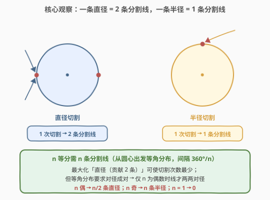
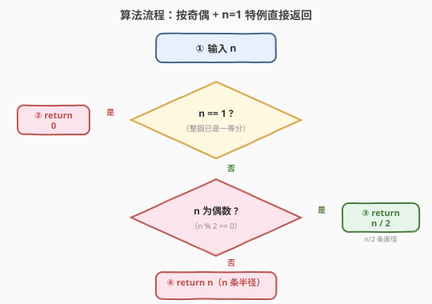
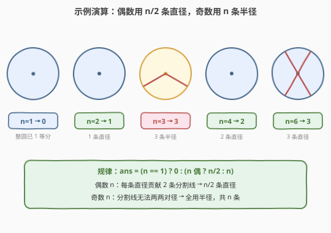

# LeetCode 分割圆的最少切割次数 题解

## 1. 题目概述

- **标题 / 题号**：分割圆的最少切割次数（#2481，easy）
- **链接**：https://leetcode.cn/problems/minimum-cuts-to-divide-a-circle/
- **难度**：简单
- **标签**：数学、几何

**题意**：圆内一个**有效切割**，符合以下二者之一：

- 该切割是两个端点在圆上的线段，且该线段经过圆心（即一条**直径**）；
- 该切割是一端在圆心、另一端在圆上的线段（即一条**半径**）。

给你一个整数 `n`，请你返回将圆切割成相等的 `n` 等分的**最少**切割次数。

**示例 1**：

```text
输入：n = 4
输出：2
解释：2 次直径切割得到四等分。
```

**示例 2**：

```text
输入：n = 3
输出：3
解释：最少需要 3 次半径切割将圆切成三等分。少于 3 次无法切成相等的 3 等分；同时可观察到第一次切割无法将圆切开。
```

**约束**：

- $1 \le n \le 100$

> 💡 题面图揭示两类切割的本质差异：一条**直径**过圆心、两端点在圆周上，等价于**两条对径分割线**；一条**半径**只一端在圆心，等价于**一条分割线**。把「切割次数」翻译成「需要多少条从圆心出发的分割线」，问题就归约为数线 + 奇偶配对。

## 2. 解题思路

### 2.1 暴力思路：每等分一刀

最朴素的想法：$n$ 等分就切 $n$ 刀，用 $n$ 条半径，每相邻两条夹角 $360^{\circ}/n$。这对奇数 $n$ 恰好正确，但对偶数 $n$ 并非最优——偶数 $n$ 的等角分布里，每条分割线都有一条**对径**的搭档，两者正好合并成一条直径，「一刀顶两线」，刀数可减半。

> ⚠️ 下界直觉：每刀最多贡献 $2$ 条分割线，凑出 $n$ 条线至少需 $\lceil n/2 \rceil$ 刀。偶数 $n$ 时该下界 $n/2$ 可达；但奇数 $n$ 时 $\lceil n/2\rceil=(n+1)/2$ 是否可达，取决于「能否真有两条线对径」——下文证明奇数 $n$ 不能，故下界不可达。

### 2.2 核心观察：直径 = 2 条分割线，奇偶决定能否两两配对



把「等分圆」重新建模为：在圆心放置 $n$ 条从圆心出发的**分割线**，等角分布（相邻夹角 $360^{\circ}/n$）。这 $n$ 条线把圆切成 $n$ 个相等扇形。一次切割能贡献的分割线数：

- **直径切割**：过圆心、两端在圆周上 → 在圆心两侧各延伸出一条分割线，即**贡献 $2$ 条**；
- **半径切割**：一端在圆心 → 只向一侧延伸，即**贡献 $1$ 条**。

于是「最少切割次数」=「用最少的刀凑出 $n$ 条等角分布的分割线」。直觉上应尽量用直径（一刀两线），但有一个**几何约束**：

> 两条分割线能合并成一条直径，当且仅当它们**对径**（夹角恰为 $180^{\circ}$）。

而等角分布中，第 $k$ 条分割线的角度为 $k \cdot 360^{\circ}/n$。它与某条对径搭档存在，等价于存在 $k'$ 使
$$
(k'-k)\cdot\frac{360^{\circ}}{n} = 180^{\circ} \quad\Longleftrightarrow\quad \frac{k'-k}{n} = \frac12
$$
即 $k'-k = n/2$ 为整数，亦即 **$n$ 为偶数**。于是：

- **$n$ 为偶数**：每条分割线都有对径搭档，$n$ 条线两两配对成 $n/2$ 条直径 → 答案 $n/2$，恰达下界；
- **$n$ 为奇数**：$180^{\circ}$ 不是 $360^{\circ}/n$ 的整数倍（因 $n/2 \notin \mathbb{Z}$），没有任何两条线对径，无法合并 → 全部用半径，答案 $n$（此时 $\lceil n/2\rceil$ 下界不可达）；
- **$n = 1$ 特例**：整圆本身就是一个等分，**不需要任何分割线** → 答案 $0$（注意 $n=1$ 虽属奇数，但不能套用 $n$，否则得 $1$ 是错的）。

> 💡 **$n=1$ 为何是特例？** 「需要 $n$ 条分割线」的前提是 $n \ge 2$：$n$ 个扇形由 $n$ 条边界线夹出。但 $n=1$ 时整个圆就是一块、边界数为 $0$，不存在「分割线」。故奇数分支公式 $n$ 在 $n=1$ 处失效，须单独判 $n=1 \to 0$。

### 2.3 算法流程图



三条分支，$O(1)$ 直出：

```text
if n == 1: return 0
if n % 2 == 0: return n / 2     # n/2 条直径，每条贡献 2 条分割线
else:           return n        # n 条半径，无法对径配对
```

> ⚠️ 两个易错点：① 漏判 $n=1$ 特例，对奇数一律返回 $n$ 会在 $n=1$ 时错答 $1$；② 把「$n$ 条分割线」误当「$n$ 刀」，漏掉「直径一刀两线」的合并，导致偶数答案翻倍。

### 2.4 示例演算



逐例验证（分割线需等角分布，相邻夹角 $360^{\circ}/n$）：

| $n$ | 奇偶 | 所需分割线 | 能否两两对径 | 选用切割 | 切割次数 |
|-----|------|-----------|-------------|----------|----------|
| 1 | 奇 | 0（整圆即一等分） | — | 无 | 0 |
| 2 | 偶 | 2 | 能（夹角 $180^{\circ}$） | 1 条直径 | 1 |
| 3 | 奇 | 3 | 不能（$180^{\circ}/120^{\circ}$ 非整数） | 3 条半径 | 3 |
| 4 | 偶 | 4 | 能（$0^{\circ}$-$180^{\circ}$、$90^{\circ}$-$270^{\circ}$ 两对） | 2 条直径 | 2 |
| 6 | 偶 | 6 | 能（三对，相邻直径夹角 $60^{\circ}$） | 3 条直径 | 3 |

> 💡 注意 $n=3$ 与 $n=6$ 的对照：同为 $3$ 的倍数，但 $n=3$（奇）需 $3$ 刀、$n=6$（偶）只需 $3$ 刀——偶数性让 $6$ 条线两两合并成 $3$ 条直径，刀数恰好与奇数 $n=3$ 相同。这说明「奇偶」而非「含因子 $3$」才是决定刀数的关键。

## 3. 参考代码

### C++

```cpp
class Solution {
public:
    int numberOfCuts(int n) {
        if (n == 1) return 0;
        return n % 2 == 0 ? n / 2 : n;
    }
};
```

> 💡 三目可压缩为 `return n == 1 ? 0 : (n & 1 ? n : n / 2);`。$n \le 100$，无溢出、无循环，$O(1)$。

### Python

```python
class Solution:
    def numberOfCuts(self, n: int) -> int:
        if n == 1:
            return 0
        return n // 2 if n % 2 == 0 else n
```

> 💡 也可写成 `return 0 if n == 1 else (n // 2 if n % 2 == 0 else n)`。Python 整除 `//` 与奇偶判定 `n % 2 == 0` 语义同 C++。

## 4. 复杂度分析

| 维度 | 复杂度 | 说明 |
|------|--------|------|
| **时间复杂度** | $O(1)$ | 一次奇偶判定 + 至多两次比较，常数步 |
| **空间复杂度** | $O(1)$ | 仅常数变量 |
| 对照：全用半径（不合并直径） | $O(1)$（仍 $n$ 刀） | 偶数 $n$ 多用一倍刀，非最优 |
| 对照：模拟逐刀摆放分割线 | $O(n)$ | 若真的逐刀摆放再数分割线，需 $O(n)$；本题无需模拟 |

> 💡 签到题的价值在「建模」：把「切割次数」翻译成「凑 $n$ 条等角分割线、每刀贡献 $1$ 或 $2$ 条、受对径配对约束」，再由奇偶直接分类出答案。一旦建模清晰，代码只剩一个三目。

## 5. 扩展：从「过圆心切割」到「任意直线切割」

本题限定切割**必须过圆心或从圆心出发**（直径/半径），故每刀严格贡献 $1$ 或 $2$ 条**等角分割线**，奇偶即可定答案。若放宽为「任意位置直线切圆」，则每刀的贡献由「与已有切割的交点数」决定，模型完全不同：

- **直线切平面 / 切圆盘（pizza cutting）**：$k$ 条直线最多把平面（或圆盘）分成 $\dfrac{k(k+1)}{2}+1$ 块——每条新直线尽量与已有直线都相交，多切出 $k$ 段，贡献 $k+1$ 个新块。这是「已知刀数求最大块数」的正向问题，与本题「已知块数求最少刀数」对偶。
- **最少刀数切出 $k$ 块**：对任意直线切圆盘，求切出 $k$ 块的最少刀数，需对上述最大块数公式二分/解二次方程，而非奇偶分类。

> ⚠️ 区别要点：本题的「直径 = 2 条分割线」合并依赖**过圆心**这一约束；一旦切割可不过圆心，相邻切割夹角不再被 $360^{\circ}/n$ 锁定，奇偶结论**不再成立**。本题的 $n/2$ 与 $n$ 的分类是「过圆心切割」专属结论。

## 6. 面试要点

1. **为什么直径算 2 条分割线、半径算 1 条？**

   > 直径两端都在圆周上且过圆心，从圆心看它在两侧各延伸出一条分割线（两个对径方向），故贡献 2 条；半径只一端在圆心，只向一个方向延伸，贡献 1 条。题面图的红/绿对比正是此意。

2. **为什么奇数 $n$ 不能用任何直径？**

   > $n$ 等分的分割线等角分布，相邻夹角 $360^{\circ}/n$。两条线对径要求夹角 $180^{\circ}$，即 $180^{\circ} \div (360^{\circ}/n) = n/2$ 为整数。$n$ 为奇时 $n/2 \notin \mathbb{Z}$，故无任何两线对径，无法合并成直径，只能全用半径。

3. **$n=1$ 为什么要特判？**

   > 「$n$ 个扇形需 $n$ 条边界线」只在 $n \ge 2$ 成立（扇形由两条边界夹出）。$n=1$ 时整个圆就是一等分、边界数为 0，套用奇数公式 $n$ 会错答 $1$。故先判 $n=1 \to 0$。

4. **能否用一条半径把圆切成 2 等分？**

   > 不能。一条半径只画一条分割线，从圆心到圆周一刀不闭合，圆仍是连通的一块（题面「第一次切割无法将圆切开」）。要切开需至少两条分割线围成一个扇形——故 $n=2$ 用一条直径（2 条对径线）而非一条半径。

5. **为什么偶数 $n$ 的 $n/2$ 是最优、不可更少？**

   > 下界论证：每刀最多贡献 $2$ 条分割线，凑 $n$ 条线至少需 $\lceil n/2\rceil$ 刀。偶数 $n$ 时下界 $= n/2$，而 $n/2$ 条直径恰能凑出 $n$ 条线（两两对径），故 $n/2$ 既可达又为下界，最优。奇数 $n$ 时下界 $(n+1)/2$ 因无对径配对而不可达，实际最优为 $n$。

> 💡 **一句话总结**：把切割次数建模为「凑 $n$ 条等角分割线，每刀贡献 $1$ 或 $2$ 条、受对径配对约束」——$n=1$ 返回 $0$，$n$ 偶返回 $n/2$ 条直径，$n$ 奇返回 $n$ 条半径，$O(1)$。

## 同类练习题

| # | 题目 | 与本题的关联 |
|---|------|-------------|
| 2413 | [最小偶倍数](https://leetcode.cn/problems/smallest-even-multiple/)（[题解](../2401-2500/2413_最小偶倍数.md)） | $\text{lcm}(2, n)$ 退化为奇偶判定（奇返 $2n$、偶返 $n$），同为「答案随奇偶分支」的数学签到题 |
| 1232 | [缀点成线](https://leetcode.cn/problems/check-if-it-is-a-straight-line/)（[题解](../1201-1300/1232_缀点成线.md)） | 判断点共线，几何 + 数学，最接近本题「线/切割」的几何主题，对照「线段几何性质」的运用 |
| 258 | [各位相加](https://leetcode.cn/problems/add-digits/)（[题解](../0201-0300/258_各位相加.md)） | 反复化简到一位数的数学签到题，同属「小数据 $O(1)$ 数学」家族 |
| 263 | [丑数](https://leetcode.cn/problems/ugly-number/)（[题解](../0201-0300/263_丑数.md)） | 整除性判定型数学签到，对照「用除法性质做分类判定」 |
| 1281 | [整数的各位积和之差](https://leetcode.cn/problems/subtract-the-product-and-sum-of-digits-of-an-integer/)（[题解](../1201-1300/1281_整数各位积和之差.md)） | 一行数学题，同属「按数位/奇偶直接出答案」的签到家族 |
