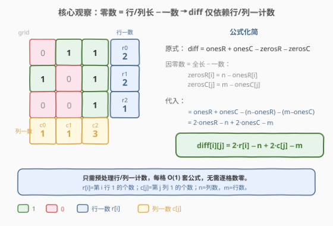
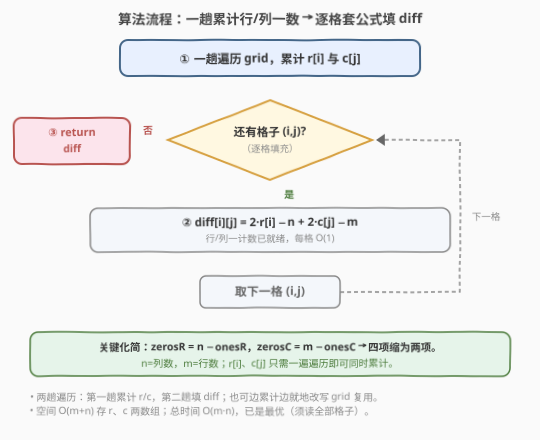
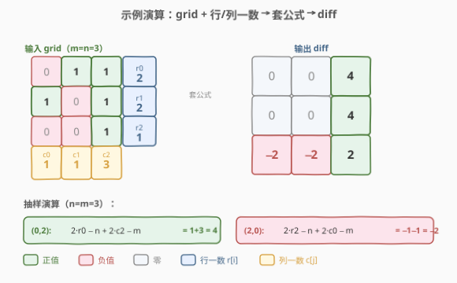

# 行和列中一和零的差值

- **题目名称**：行和列中一和零的差值
- **链接**：[2482. 行和列中一和零的差值](https://leetcode.cn/problems/difference-between-ones-and-zeros-in-row-and-column/)
- **难度**：中等
- **标签**：数组、矩阵、预处理

## 1. 题目概述

给你一个下标从 $0$ 开始的 $m \times n$ 二进制矩阵 `grid`。按下式定义差值矩阵 `diff`：

- 令第 $i$ 行一的数目为 $\text{onesRow}_i$；
- 令第 $j$ 列一的数目为 $\text{onesCol}_j$；
- 令第 $i$ 行零的数目为 $\text{zerosRow}_i$；
- 令第 $j$ 列零的数目为 $\text{zerosCol}_j$；

$$\text{diff}[i][j] = \text{onesRow}_i + \text{onesCol}_j - \text{zerosRow}_i - \text{zerosCol}_j$$

请返回差值矩阵 `diff`。

**示例 1**：

```text
输入：grid = [[0,1,1],[1,0,1],[0,0,1]]
输出：[[0,0,4],[0,0,4],[-2,-2,2]]
解释：
- diff[0][0] = onesRow0 + onesCol0 − zerosRow0 − zerosCol0 = 2 + 1 − 1 − 2 = 0
- diff[0][2] = onesRow0 + onesCol2 − zerosRow0 − zerosCol2 = 2 + 3 − 1 − 0 = 4
- diff[2][0] = onesRow2 + onesCol0 − zerosRow2 − zerosCol0 = 1 + 1 − 2 − 2 = −2
```

**示例 2**：

```text
输入：grid = [[1,1,1],[1,1,1]]
输出：[[5,5,5],[5,5,5]]
解释：全 1 矩阵，zerosRow/zerosCol 均为 0，diff = onesRow + onesCol = 3 + 2 = 5。
```

**约束条件**：

- $m == \text{grid.length}$，$n == \text{grid}[i].\text{length}$
- $1 \le m, n \le 10^5$
- $1 \le m \times n \le 10^5$
- $\text{grid}[i][j]$ 要么是 $0$，要么是 $1$

> 💡 题面把 `diff` 拆成「行一数 + 列一数 − 行零数 − 列零数」四项。但**零数并非独立量**——二进制矩阵里每行长度固定为 $n$、每列长度固定为 $m$，故「零数 = 全长 − 一数」。这一约束把四项塌缩成两项，是本题唯一但关键的观察。

---

## 2. 解题思路

### 2.1 暴力思路：逐格数一数零

最直白的做法是忠实照搬题面：对每个格子 $(i, j)$，现扫一遍第 $i$ 行数一/零、再扫一遍第 $j$ 列数一/零，套四项公式填 `diff[i][j]`。

```text
for i in range(m):
    for j in range(n):
        onesR = count(grid[i] == 1)            # 扫第 i 行
        zerosR = n - onesR
        onesC = count(grid[*][j] == 1)        # 扫第 j 列
        zerosC = m - onesC
        diff[i][j] = onesR + onesC - zerosR - zerosC
```

正确性没问题，但每个格子都要重新扫一整行一整列：$m \times n$ 格 $\times$ $(m + n)$ 扫描 = $O(mn(m+n))$。对 $m \times n \le 10^5$，最坏 $m=n\approx 316$ 时约 $2\times10^7$ 次，能 AC 但常数巨大，且**重复劳动**严重——同一行的 `onesR` 被 $n$ 个格子重算了 $n$ 遍，同一列的 `onesC` 被 $m$ 个格子重算了 $m$ 遍。

> ⚠️ 暴力把「行/列的一计数」当作每格的临时量现算，却没注意到：**一计数是整行/整列的属性，与列号/行号无关**。一旦把行/列一计数提前算好存起来，每格只做 $O(1)$ 查表。

### 2.2 核心观察：零数 = 全长 − 一数 → 公式化简



**关键洞察**：二进制矩阵里，每行恰有 $n$ 格、每列恰有 $m$ 格，故

$$\text{zerosRow}_i = n - \text{onesRow}_i,\qquad \text{zerosCol}_j = m - \text{onesCol}_j$$

代入原式：

$$\text{diff}[i][j] = \text{onesRow}_i + \text{onesCol}_j - (n - \text{onesRow}_i) - (m - \text{onesCol}_j)$$

展开合并同类项（$\text{onesRow}_i$ 出现两次、$\text{onesCol}_j$ 出现两次）：

$$\boxed{\;\text{diff}[i][j] = 2\cdot\text{onesRow}_i - n + 2\cdot\text{onesCol}_j - m\;}$$

四项塌缩成两项——**只剩行一数与列一数**，零数被全长吸收掉了。记 $r[i] = \text{onesRow}_i$、$c[j] = \text{onesCol}_j$，则每格只需：

$$\text{diff}[i][j] = 2\,r[i] - n + 2\,c[j] - m$$

其中 $n$ 为列数（行长度）、$m$ 为行数（列长度）。

> 💡 这一步的实质是**消冗余**：题面把「一数」和「零数」并列写出，制造了「需要四个量」的假象；但二者由「全长 = 一数 + 零数」耦合，自由度只有两个。识别并代入这层耦合，是降阶的钥匙——与 [174. 地下城游戏](../0101-0200/174_地下城游戏.md)「状态定义决定子结构」同属「看清冗余、消掉冗余」的思维。

### 2.3 算法流程图



两阶段流水：

1. **累计行/列一计数**：一趟遍历 `grid`，对每个 `grid[i][j] == 1` 同时 `++r[i]` 与 `++c[j]`，得行一数组 $r[0..m-1]$、列一数组 $c[0..n-1]$；
2. **逐格填 diff**：再趟遍历，对每个 $(i, j)$ 直接 `diff[i][j] = 2*r[i] - n + 2*c[j] - m`，$O(1)$ 查表无任何扫描；
3. **返回** `diff`。

整个过程两趟 $O(mn)$ 遍历 + $O(1)$ 每格，无排序、无哈希。

### 2.4 示例演算



以示例 1 `grid = [[0,1,1],[1,0,1],[0,0,1]]`、$m = n = 3$ 演算：

**第一步——累计行一数 $r$、列一数 $c$**：

| | $j=0$ | $j=1$ | $j=2$ | 行一数 $r[i]$ |
|------|------|------|------|----------|
| $i=0$ | 0 | 1 | 1 | **2** |
| $i=1$ | 1 | 0 | 1 | **2** |
| $i=2$ | 0 | 0 | 1 | **1** |
| 列一数 $c[j]$ | **1** | **1** | **3** | |

**第二步——逐格套公式** `diff[i][j] = 2·r[i] − n + 2·c[j] − m`（$n=m=3$）：

| $(i,j)$ | $2r[i]-3$ | $2c[j]-3$ | 求和 = diff |
|---------|-----------|-----------|-------------|
| $(0,2)$ | $4-3=1$ | $6-3=3$ | $1+3=$ **4** |
| $(2,0)$ | $2-3=-1$ | $2-3=-1$ | $-1+(-1)=$ **−2** |
| $(0,0)$ | $1$ | $-1$ | **0** |
| $(2,2)$ | $-1$ | $3$ | **2** |

完整结果：

$$\text{diff} = \begin{bmatrix} 0 & 0 & 4 \\ 0 & 0 & 4 \\ -2 & -2 & 2 \end{bmatrix}$$

> 💡 注意行一数 $r=[2,2,1]$ 在同行内对 $n$ 个格子**完全相同**——这正是预处理的回报：一次计算、$n$ 次复用。列一数 $c=[1,1,3]$ 同理在列方向复用 $m$ 次。第 $2$ 行一数最少（$1$）、第 $0/1$ 列一数最少（$1$），故 $\text{diff}[2][0]$、$\text{diff}[2][1]$ 取到最小值 $-2$；第 $2$ 列全为 $1$（$c[2]=3$），故该列 diff 偏大。

---

## 3. 参考代码

### C++：一趟累计 + 逐格套公式（$O(mn)$ / $O(m+n)$）

```cpp
class Solution {
public:
    vector<vector<int>> onesMinusZeros(vector<vector<int>>& grid) {
        int m = grid.size(), n = grid[0].size();
        vector<int> r(m, 0), c(n, 0);
        for (int i = 0; i < m; ++i)
            for (int j = 0; j < n; ++j) {
                r[i] += grid[i][j];
                c[j] += grid[i][j];          // 同一趟同时累计行、列一数
            }
        vector<vector<int>> diff(m, vector<int>(n));
        for (int i = 0; i < m; ++i)
            for (int j = 0; j < n; ++j)
                diff[i][j] = 2 * r[i] - n + 2 * c[j] - m;
        return diff;
    }
};
```

> 💡 `grid[i][j]` 非 $0$ 即 $1$，故 `+= grid[i][j]` 等价于「遇 1 加 1、遇 0 不加」，免去 `if (grid[i][j]==1)` 分支。两趟遍历可合并思路：第一趟只累计 $r$、$c$，第二趟查表填 `diff`；也可在第一趟就先把 $r$ 算完（行内累加），但 $c$ 必须扫完全图才完整，故分两趟更清晰。`2*r[i]-n` 可理解为「该行 1 比 0 多几个」。

### Python：同逻辑

```python
class Solution:
    def onesMinusZeros(self, grid: List[List[int]]) -> List[List[int]]:
        m, n = len(grid), len(grid[0])
        r = [0] * m
        c = [0] * n
        for i in range(m):
            for j in range(n):
                r[i] += grid[i][j]
                c[j] += grid[i][j]
        return [[2 * r[i] - n + 2 * c[j] - m for j in range(n)] for i in range(m)]
```

> 💡 Python 用列表推导式把第二趟压缩成一行，语义与 C++ 完全对齐。也可用 `zip` 算列和：`c = [sum(col) for col in zip(*grid)]`，`r = [sum(row) for row in grid]`，更声明式但多一趟隐式遍历；手写双循环一趟累计更省常数、便于两语言对照。

---

## 4. 复杂度分析

| 维度 | 复杂度 | 说明 |
|------|--------|------|
| **时间复杂度** | $O(mn)$ | 两趟遍历：第一趟累计 $r$、$c$ 扫全部 $mn$ 格，第二趟填 `diff` 再扫 $mn$ 格；每格 $O(1)$ |
| **空间复杂度** | $O(m+n)$ | 行一数组 $r$ 长 $m$、列一数组 $c$ 长 $n$；输出 `diff` 不计入辅助空间（题目要求返回） |
| 对照：逐格现算 | $O(mn(m+n))$ / $O(1)$ | 每格重扫一行一列，$m \times n \le 10^5$ 时仍可达 $10^7$ 级，常数大 |

> 💡 $m \times n \le 10^5$ 限制了格子总数，但 $m$、$n$ 单独可达 $10^5$（极端如 $1 \times 10^5$ 单行）。此时 $r$ 长 $1$、$c$ 长 $10^5$，空间 $O(m+n)=O(10^5)$ 完全可接受；而暴力每格扫一列 $10^5$、共 $10^5$ 格 $\Rightarrow 10^{10}$ 必 TLE。预处理把「每格 $O(m+n)$」摊还成「全局 $O(mn)$ 一次算完」，是降阶的本质。

---

## 5. 扩展：原地改写与一趟填充

上述实现用单独的 `diff` 数组输出。若允许**破坏 `grid`**（题目未禁止就地修改返回），可省去 `diff` 的额外空间：

```cpp
// 第二趟直接写回 grid（grid 元素为 0/1，写回后变成 diff 值，语义改变但可接受）
for (int i = 0; i < m; ++i)
    for (int j = 0; j < n; ++j)
        grid[i][j] = 2 * r[i] - n + 2 * c[j] - m;
return grid;
```

> ⚠️ 前提是 $r$、$c$ 已在第一趟算好——不能边累计边写回，否则写回的 diff 值会污染后续行/列一计数。两阶段（先累计、后填充）的顺序不可乱。原地版把空间从 $O(mn)$ 输出 + $O(m+n)$ 辅助，压到 $O(m+n)$ 辅助（输出复用 `grid`），但牺牲了输入的可读性，工程上需权衡。

> 💡 另一微优化：`2*r[i]-n` 对同一行 $i$ 是常量，可外提为 `rowBase = 2*r[i] - n`，内层只算 `rowBase + 2*c[j] - m`，省一次乘减。编译器常自动外提，但手写更明确意图。

---

## 6. 面试要点

1. **为什么零数不用单独数？**

   > 二进制矩阵每行恰 $n$ 格、每列恰 $m$ 格，全长固定。故 $\text{zerosRow}_i = n - \text{onesRow}_i$、$\text{zerosCol}_j = m - \text{onesCol}_j$ 是**约束关系**而非独立量。代入后四项塌缩成两项 $2\,\text{onesRow}_i - n + 2\,\text{onesCol}_j - m$。识别「全长 = 一数 + 零数」这层耦合是化简的唯一钥匙。

2. **$m$、$n$ 分别指什么？公式里别搞混。**

   > $m$ 是行数（`grid.length`），$n$ 是列数（`grid[0].length`）。行 $i$ 有 $n$ 格 $\Rightarrow$ $\text{zerosRow}_i = n - \text{onesRow}_i$；列 $j$ 有 $m$ 格 $\Rightarrow$ $\text{zerosCol}_j = m - \text{onesCol}_j$。代入后 $\text{diff}[i][j] = 2r[i] - n + 2c[j] - m$，注意 $n$ 配行项、$m$ 配列项，最易写反。

3. **为什么不能边累计边填 diff？**

   > 列一数 $c[j]$ 必须扫完全图才完整——若填到 $(i,j)$ 时只扫过前 $i+1$ 行，$c[j]$ 仅是部分和，公式结果错误。故必须**先完整累计 $r$、$c$，再逐格填充**，两阶段顺序不可乱。行一数 $r[i]$ 理论上行扫完即可用，但为统一一趟累计，仍等全图扫完再填。

4. **能否降到 $O(1)$ 辅助空间？**

   > 时间已 $O(mn)$ 下界（须读全部格子），无法更好。辅助空间：$r$、$c$ 各 $O(m)$、$O(n)$ 不可省——不存行/列一数就得每格现算回到暴力。若允许破坏 `grid`，可原地写回把输出空间复用，但 $r$、$c$ 两数组仍需保留（见第 5 节扩展）。

5. **若格子值不止 0/1（推广到一般整数矩阵）会怎样？**

   > 「零数 = 全长 − 一数」的耦合失效——此时「一数」「零数」是独立的两个量，无全长约束可代换。但若题面改为「$\text{diff} = \text{onesRow} + \text{onesCol} - \text{zerosRow} - \text{zerosCol}$」且仍只数 0 与非 0，则 $\text{zeros} = \text{全长} - \text{ones}$ 仍成立（把非零当 1 看），骨架不变。本题的化简力完全来自「二值 + 全长固定」两前提。

> 💡 **一句话总结**：2482 =「零数 = 全长 − 一数」消冗余 → `diff[i][j] = 2·r[i] − n + 2·c[j] − m`。一趟累计行/列一计数 $r$、$c$，再趟逐格 $O(1)$ 套公式——$O(mn)$ / $O(m+n)$。

---

## 7. 同类练习题

- [2352. 相等行列对](https://leetcode.cn/problems/equal-row-and-column-pairs/)：同样预处理每行/列的「签名」再组合配对，与本题「行/列计数后交叉组合」同骨架，对照哈希配对与直接套公式两种用法
- [1582. 二进制矩阵中的特殊位置](https://leetcode.cn/problems/special-positions-in-a-binary-matrix/)：先数每行/列的 1 再逐格核对「该格为 1 且所在行/列仅此一个 1」，同「行/列一计数预处理」范式
- [1252. 奇数值单元格的数目](https://leetcode.cn/problems/cells-with-odd-values-in-a-matrix/)：行/列增量预处理后逐格算奇偶，结构同构——把「每格依赖行/列属性」抽象为「先累计行/列、再逐格组合」
- [2125. 银行中的激光束](https://leetcode.cn/problems/number-of-laser-beams-in-a-bank/)：按行数 1 后两相邻非零行相乘求和，行一计数的另一应用，对照「行级计数」与「行/列双计数」
