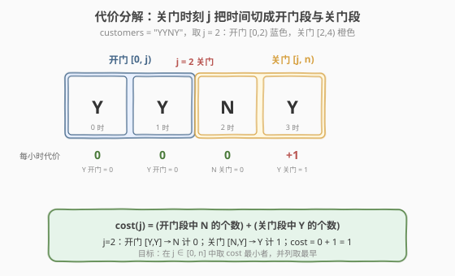
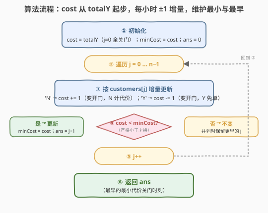
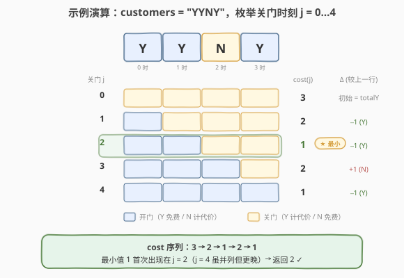

# LeetCode 商店的最少代价 题解

## 1. 题目概述

- **标题 / 题号**：商店的最少代价（#2483，medium）
- **链接**：https://leetcode.cn/problems/minimum-penalty-for-a-shop/
- **难度**：中等
- **标签**：数组、前缀和、一次遍历、贪心

**题意**：给你一个下标从 $0$ 开始、只含 `'Y'` 和 `'N'` 的字符串 `customers` 表示顾客访问日志（长度为 $n$）：

- `'Y'` 表示该小时有顾客到达，`'N'` 表示没有。

若商店在第 $j$ 小时关门（$0 \le j \le n$），代价计算如下：

- **开门期间** $[0, j)$：某小时若**没有**顾客到达（`'N'`），代价 $+1$；
- **关门期间** $[j, n)$：某小时若**有**顾客到达（`'Y'`），代价 $+1$。

在确保代价**最小**的前提下，返回**最早**的关门时间 $j$。注意「第 $j$ 小时关门」表示第 $j$ 小时及之后都关门。

**示例 1**：

```text
输入：customers = "YYNY"
输出：2
解释：
- j=0 关门：开门段无 N（0），关门段 Y×3 → 3
- j=1 关门：开门段 [Y] 无 N（0），关门段 [Y,N,Y] 有 Y×2 → 2
- j=2 关门：开门段 [Y,Y] 无 N（0），关门段 [N,Y] 有 Y×1 → 1
- j=3 关门：开门段 [Y,Y,N] 有 N×1，关门段 [Y] 有 Y×1 → 2
- j=4 关门：开门段 [Y,Y,N,Y] 有 N×1，关门段无 Y → 1
j=2 与 j=4 代价同为最小 1，取更早的 2。
```

**示例 2**：

```text
输入：customers = "NNNNN"
输出：0
解释：自始至终无顾客，越早关门越省；j=0 时代价为 0。
```

**示例 3**：

```text
输入：customers = "YYYY"
输出：4
解释：每小时都有顾客，开门才免费；j=4（全程开门）时代价为 0。
```

**约束**：

- $1 \le \text{customers.length} \le 10^5$
- `customers` 只含 `'Y'` 和 `'N'`

> 💡 **关键不变式**：关门时刻 $j$ 把整条时间线一刀切成两段——左段开门、右段关门。代价只与「开门段的 `N` 总数」和「关门段的 `Y` 总数」有关，是一条由分界点 $j$ 唯一决定的标量函数 $\text{cost}(j)$。问题即「在 $j \in [0, n]$ 上求 $\text{cost}(j)$ 的最小值，并列取最左」。

## 2. 解题思路

### 2.1 暴力思路：枚举每个关门时刻全量重算

对每个候选 $j \in [0, n]$，重新扫描整个字符串，分别数开门段的 `N` 与关门段的 `Y` 再求和：

```text
ans, best = 0, +∞
for j in 0..n:
    cost = 数 [0,j) 中 'N' 个数 + 数 [j,n) 中 'Y' 个数
    if cost < best: best, ans = cost, j
return ans
```

正确性无误，但每个 $j$ 都 $O(n)$ 重扫，总计 $O(n^2)$，$n = 10^5$ 必然超时。

> ⚠️ 暴力把「每个 $j$ 都从头算」当作必然，却忽略了相邻 $j$ 之间代价只差**一小时**——该小时从「关门段」跨入「开门段」，其余小时归属不变，代价的增量只由这一个字符决定。

### 2.2 核心观察：代价随分界线右移每小时 ±1 增量



把代价写成两条贡献之和：

$$
\text{cost}(j) = \underbrace{\#\{i < j : \text{customers}[i] = \texttt{N}\}}_{\text{开门段的 N}} + \underbrace{\#\{i \ge j : \text{customers}[i] = \texttt{Y}\}}_{\text{关门段的 Y}}
$$

**关键增量**：当 $j \to j+1$ 时，第 $j$ 小时从「关门段」跨入「开门段」，其余小时归属不动，因此代价变化只取决于 `customers[j]` 这一个字符：

- `customers[j] == 'N'`：它原在关门段（`N` 关门免费，贡献 $0$），现入开门段（`N` 开门计代价，贡献 $1$）→ $\text{cost}(j+1) = \text{cost}(j) + 1$；
- `customers[j] == 'Y'`：它原在关门段（`Y` 关门计代价，贡献 $1$），现入开门段（`Y` 开门免费，贡献 $0$）→ $\text{cost}(j+1) = \text{cost}(j) - 1$。

而起点 $\text{cost}(0)$ 是「全部关门」：开门段为空，代价 $=$ 整串的 `Y` 总数 $\text{totalY}$。于是整条代价曲线可由一个起点 + 一串 $\pm 1$ 步长递推出来：

$$
\text{cost}(0) = \text{totalY}, \qquad \text{cost}(j+1) = \text{cost}(j) + \begin{cases}+1 & \text{customers}[j] = \texttt{N}\\ -1 & \text{customers}[j] = \texttt{Y}\end{cases}
$$

> 💡 **为什么增量是 $\pm 1$ 而非重算？** 代价函数对 $j$ 是「逐位累加型」的：$j$ 每右移一格，恰有一个小时在两段间迁移，其代价贡献按 `Y→-1 / N→+1` 翻转。这是把 $O(n^2)$ 的「逐点重算」压成 $O(n)$ 的「逐点递推」的根本——**相邻状态只差一个增量**。

只需一遍扫描维护 $\text{cost}$，再用「严格小于才更新」保证并列取最早：因 $j$ 递增遍历，严格 `<` 让先到者胜出，后到的并列值不会覆盖。

### 2.3 算法流程图



两遍线性扫描即可：第一遍数 $\text{totalY}$ 得到 $\text{cost}(0)$；第二遍逐字符 $\pm 1$ 递推 $\text{cost}(j+1)$，遇严格更小则更新 $(\text{minCost}, \text{ans})$。零分支特判，靠初值 $j=0$ 兜底（如示例 2 全 `N`，$\text{cost}(0)=0$ 已是最小，循环不更新，返回 $0$）。

### 2.4 示例演算



以示例 1 `customers = "YYNY"` 演算（$\text{totalY} = 3$）：

| 关门 $j$ | 开门段 $[0,j)$ | 关门段 $[j,n)$ | 开门 N 数 | 关门 Y 数 | $\text{cost}(j)$ | $\Delta$ |
|:---:|:---:|:---:|:---:|:---:|:---:|:---:|
| 0 | 空 | Y Y N Y | 0 | 3 | **3** | 初始 = totalY |
| 1 | Y | Y N Y | 0 | 2 | **2** | $-1$ (Y) |
| 2 | Y Y | N Y | 0 | 1 | **1** ★ | $-1$ (Y) |
| 3 | Y Y N | Y | 1 | 1 | **2** | $+1$ (N) |
| 4 | Y Y N Y | 空 | 1 | 0 | **1** | $-1$ (Y) |

代价序列 $3 \to 2 \to 1 \to 2 \to 1$，最小值 $1$ 首次出现在 $j=2$；$j=4$ 虽并列但更晚，按「最早」规则丢弃。故返回 $2$ ✓。

> 💡 注意 $j=3$ 处遇到 `N`，代价不降反升（$+1$），这正是 `N` 进入开门段开始计代价的体现；可见代价曲线并非单调，必须**全程维护最小值**而非贪早关门。

## 3. 参考代码

### C++

```cpp
class Solution {
public:
    int bestClosingTime(string customers) {
        int totalY = count(customers.begin(), customers.end(), 'Y');
        int cost = totalY;            // cost(0)：全部关门，代价 = 关门段 Y 总数
        int minCost = cost, ans = 0;  // 候选 j=0 已计入
        for (int j = 0; j < (int)customers.size(); ++j) {
            cost += (customers[j] == 'N') ? 1 : -1;   // 推出 cost(j+1)
            if (cost < minCost) {                      // 严格小于才换 → 并列保留更早
                minCost = cost;
                ans = j + 1;
            }
        }
        return ans;
    }
};
```

> 💡 `cost(0) = totalY` 已作为 $j=0$ 的候选写入初值，循环只负责评估 $j \in [1, n]$。`<`（而非 `<=`）是「并列取最早」的关键：因 $j$ 递增扫描，后到的并列值无法覆盖先到者。

### Python

```python
class Solution:
    def bestClosingTime(self, customers: str) -> int:
        total_y = customers.count('Y')
        cost = total_y              # cost(0)
        min_cost = cost
        ans = 0
        for j, ch in enumerate(customers):
            cost += 1 if ch == 'N' else -1    # 推出 cost(j+1)
            if cost < min_cost:               # 严格小于才换 → 并列保留更早
                min_cost = cost
                ans = j + 1
        return ans
```

> ⚙️ 也可写成显式双计数器版本（`preN`/`preY` 增量维护，`cost = preN + (totalY - preY)`），与上述 $\pm 1$ 递推完全等价，但 $\pm 1$ 写法把「翻转」语义浓缩在一行 `+= ch=='N' ? 1 : -1`，更贴近增量本质。

## 4. 复杂度分析

| 维度 | 复杂度 | 说明 |
|------|--------|------|
| **时间复杂度** | $O(n)$ | 一遍数 `totalY` + 一遍 $\pm 1$ 递推，每字符 $O(1)$ |
| **空间复杂度** | $O(1)$ | 仅维护 $\text{cost}$、$\text{minCost}$、$\text{ans}$ 常数个变量 |
| 对照：逐点重算 | $O(n^2)$ / $O(1)$ | 每个 $j$ 全量扫描，正确但 $n=10^5$ 超时 |
| 对照：前缀和数组 | $O(n)$ / $O(n)$ | 预计算 `preN[]` 与 `sufY[]` 再 $O(1)$ 查询，多耗 $O(n)$ 空间，本题无需 |

> 💡 增量递推把「逐点重算」与「前缀和数组」两端的冗余都削去：既不重扫（省时间），也不建表（省空间），仅靠一个滚动标量承载整条代价曲线。

## 5. 扩展：前缀和视角（cost = totalY + 前缀和(±1)，找最小前缀）

令 $v[i] = +1$（当 `customers[i] == 'N'`），$v[i] = -1$（当 `'Y'`）。则开门段 N 数减开门段 Y 数恰为前缀和：

$$
\text{preN}[j] - \text{preY}[j] = \sum_{i=0}^{j-1} v[i] \;\triangleq\; S[j]
$$

而关门段 Y 数 $=$ $\text{totalY} - \text{preY}[j]$，代入代价公式：

$$
\text{cost}(j) = \text{preN}[j] + (\text{totalY} - \text{preY}[j]) = \text{totalY} + S[j]
$$

于是「求最小代价」等价于「**求 $S[j]$ 在 $j \in [0,n]$ 上的最小值，并列取最左下标**」——$S[0] = 0$，$S[j+1] = S[j] + v[j]$ 正是上文 $\pm 1$ 递推的来源。这把问题归约为一个经典的「**维护最小前缀**」骨架：

| 模式 | 对应题 | 维护量 |
|------|--------|--------|
| 最小前缀和 | **2483**（本题） | $\min_j S[j]$ 的最左 $j$ |
| 最大前缀和 | 1732 找到最高海拔 | $\max_j S[j]$ |
| 最小前缀配合作差 | 53 最大子数组和 | $\max_j (S[j] - \min_{i<j} S[i])$ |

> 💡 抽象经验：凡「按一个分界点把序列切成前缀/后缀，代价为两段各自计数的和」的题，先写代价关于分界点的显式表达式，再观察 $j \to j+1$ 的增量——若增量只依赖单点（本题 $\pm 1$），即可压成 $O(n)$ 滚动递推；若代价可表为 $\text{常量} + \text{前缀和}$，则归约为前缀极值问题。

## 6. 面试要点

1. **代价公式是什么？为何 $j$ 的取值范围是 $[0, n]$？**

   > $\text{cost}(j) = (\text{开门段 } [0,j) \text{ 中 N 数}) + (\text{关门段 } [j,n) \text{ 中 Y 数})$。$j=0$ 表示全程关门（开门段为空），$j=n$ 表示全程开门（关门段为空），二者都是合法关门时刻，故 $j \in [0, n]$ 共 $n+1$ 个候选。

2. **增量为什么是 $\pm 1$？**

   > $j \to j+1$ 时只有第 $j$ 小时在两段间迁移，其余小时归属不变。`Y` 从关门段（计 $1$）迁到开门段（计 $0$），代价 $-1$；`N` 从关门段（计 $0$）迁到开门段（计 $1$），代价 $+1$。所以 $\text{cost}(j+1) - \text{cost}(j) \in \{-1, +1\}$。

3. **如何保证并列取最早？**

   > 用严格小于 `cost < minCost` 判定更新。因 $j$ 自小到大遍历，先到达最小值的较小 $j$ 会先把 `minCost` 拉到该值；后到的相同代价不满足严格小于，无法覆盖，故保留最早。若用 `<=` 则会取到最晚，违反题意。

4. **初值为何取 `ans=0, minCost=totalY`？**

   > $j=0$ 是合法候选，其代价 $\text{cost}(0)=\text{totalY}$（开门段为空，关门段含全部 Y）。把它作为初值即「$j=0$ 已计入候选」，循环只评估 $j \ge 1$。若全串无 Y（如全 `N`），$\text{cost}(0)=0$ 已是全局最小，循环中代价只增不减、不更新，自然返回 $0$，免去特判。

5. **能否一遍扫描完成（不算 totalY 的预处理那一遍）？**

   > 本质需要两遍：第一遍数 $\text{totalY}$ 以确定起点 $\text{cost}(0)$，第二遍递推。但因 $\text{cost}(j) = \text{totalY} + S[j]$，也可倒序扫一遍：从 $\text{cost}(n)=\text{totalN}$ 起步、$j$ 递减时第 $j$ 小时从开门段迁回关门段（增量取反：`N→-1, Y→+1`），同样 $O(n)$。两种方向等价，正序更贴近「分界线右移」的直觉。

## 同类练习题

| # | 题目 | 与本题的关联 |
|---|------|-------------|
| 724 | [寻找数组的中心下标](https://leetcode.cn/problems/find-pivot-index/) | 前缀和 $=$ 后缀和的分割点，同「按分界点切前缀/后缀各自求和」 |
| 2485 | [找出中枢整数](https://leetcode.cn/problems/find-the-pivot-integer/) | 相邻题号，$1\ldots x$ 前缀和 $=$ $x\ldots n$ 后缀和，分割点枚举的整数版 |
| 1732 | [找到最高海拔](https://leetcode.cn/problems/find-the-highest-altitude/) | 累加前缀和 + 维护极值（取 $\max$ 对照本题取 $\min$） |
| 1423 | [可获得的最大点数](https://leetcode.cn/problems/maximum-points-you-can-obtain-from-cards/) | 两端取卡 $\Leftrightarrow$ 中间留定长子数组最小，前缀和扫一遍取最值 |
| 53 | [最大子数组和](https://leetcode.cn/problems/maximum-subarray/)（[题解](../0001-0100/53_最大子数组和.md)） | 维护最小前缀和再作差，同「前缀极值」思想家族 |
