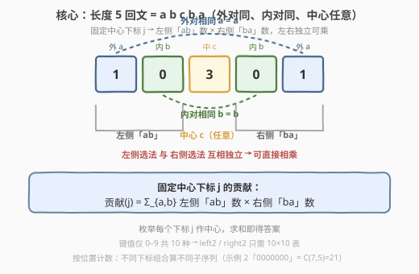
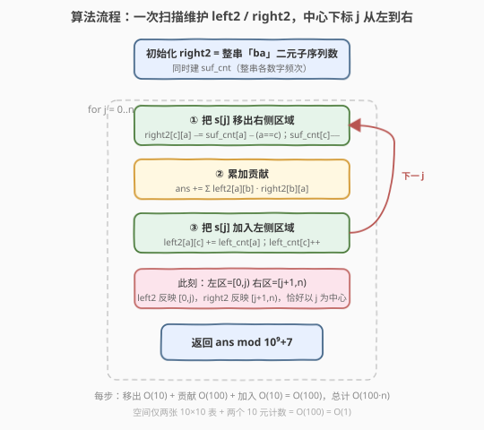
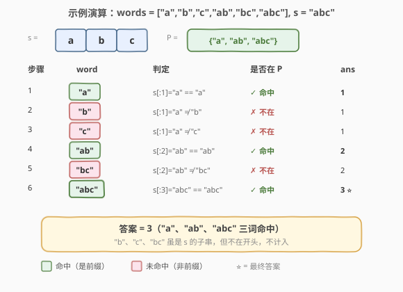

# 统计回文子序列数目

- **题目名称**：统计回文子序列数目
- **链接**：[2484. 统计回文子序列数目](https://leetcode.cn/problems/count-palindromic-subsequences/)
- **难度**：困难
- **标签**：动态规划、字符串、前缀计数

## 1. 题目概述

给你一个数字字符串 `s`（仅含 `'0'`–`'9'`），请你返回 `s` 中长度为 **5** 的**回文子序列**数目。由于答案可能很大，将答案对 $10^9 + 7$ 取余后返回。

> 💡 **关键计数口径**：子序列由「所选下标组合」决定——**不同下标组合即算不同子序列**，即使它们拼出的字符串相同。示例 2 中 `"0000000"` 共有 $\binom{7}{5}=21$ 种长度为 5 的子序列，全为 `"00000"`、全回文，故答案为 21（按位置计 21 个，而非按值计 1 个）。

**示例 1**：

```text
输入：s = "103301"
输出：2
解释：6 个长度为 5 的子序列中，只有 2 个（都是 "10301"）是回文的。
```

**示例 2**：

```text
输入：s = "0000000"
输出：21
解释：所有 21 个长度为 5 的子序列都是 "00000"，都是回文的。
```

**示例 3**：

```text
输入：s = "9999900000"
输出：2
解释：仅有 "99999" 与 "00000" 两个回文子序列。
```

**约束条件**：

- $1 \le s.\text{length} \le 10^4$
- `s` 只包含数字字符。

---

## 2. 解题思路

### 2.1 暴力思路：枚举所有 5 下标组合

最直接的做法是在 $\binom{n}{5}$ 个下标组合中逐一检查回文条件（首尾相等、第二与第四相等）。$n=10^4$ 时 $\binom{10^4}{5} \approx 8.3\times 10^{17}$，完全不可行。

> ⚠️ 暴力法的瓶颈在于「逐个枚举下标组合」。破局思路：长 5 回文的结构高度规整——**外对同、内对同、中心任意**，只需统计「左侧某字符对数」与「右侧镜像字符对数」的乘积，不必枚举具体下标。

### 2.2 核心观察：固定中心下标，左右配对相乘



长 5 回文恒可写作 $a\,b\,c\,b\,a$：外对（第 1、5 位）同为 $a$，内对（第 2、4 位）同为 $b$，中心 $c$ 任意。于是**固定中心下标 $j$（即第 3 位 $c$ 的位置）**后：

- 左侧区域 $[0, j)$ 中选出「先 $a$ 后 $b$」的二元子序列，记其数目为 $\text{left2}_j[a][b]$；
- 右侧区域 $[j+1, n)$ 中选出「先 $b$ 后 $a$」的二元子序列，记其数目为 $\text{right2}_j[b][a]$；
- **左右两侧的选法互不干扰**（只要 $a,b$ 相同，任一左侧 $(i_1,i_2)$ 与任一右侧 $(i_4,i_5)$ 都能拼成合法的 $i_1<i_2<j<i_4<i_5$）。

故以 $j$ 为中心、外对为 $a$、内对为 $b$ 的回文数为 $\text{left2}_j[a][b]\cdot \text{right2}_j[b][a]$，累加得：

$$\text{ans}=\sum_{j=0}^{n-1}\sum_{a=0}^{9}\sum_{b=0}^{9}\text{left2}_j[a][b]\cdot \text{right2}_j[b][a]$$

> 💡 **为什么固定中心 j 而非固定 $(a,b)$？** 固定 $j$ 后左、右两个区域是**不相交的独立区间**，选法数可直接相乘；若固定 $(a,b)$ 再枚举内对位置 $(i_2,i_4)$ 并配对外对，需要嵌套扫位置，最坏 $O(n^2)$（如全同字符串）。固定中心把「配对」转化成「两个独立计数表的内积」，是本题降到 $O(n)$ 的关键。

### 2.3 算法流程图



数字字母表 $\Sigma=\{0,\dots,9\}$，$|\Sigma|=10$，故 $\text{left2},\text{right2}$ 只需 $10\times 10$ 表，空间 $O(1)$。一次从左到右扫描，每步三件事：

1. **把 $s[j]$ 移出右侧区域**（区域从 $[j,n)$ 收缩为 $[j+1,n)$）：$s[j]=c$ 原是右侧最靠前的「首元素」，移除时以它为首的配对全部消失——对每个 $a$，$\text{right2}[c][a]\mathrel{-}= \text{suf\_cnt}[a]-(a==c)$（即 $c$ 之后还剩多少个 $a$），再 $\text{suf\_cnt}[c]\mathrel{-}=1$。
2. **累加贡献**：此时 $\text{left2}$ 反映 $[0,j)$、$\text{right2}$ 反映 $[j+1,n)$，恰好以 $j$ 为中心，累加 $\sum_{a,b}\text{left2}[a][b]\cdot \text{right2}[b][a]$。
3. **把 $s[j]$ 加入左侧区域**（区域从 $[0,j)$ 扩展为 $[0,j+1)$）：$s[j]=c$ 成为新的「末元素」，对每个 $a$，$\text{left2}[a][c]\mathrel{+=}\text{left\_cnt}[a]$（$c$ 与左侧已有的每个 $a$ 各配一对），再 $\text{left\_cnt}[c]\mathrel{+=}1$。

初始化时把整串当作「右侧区域」：从左到右扫一遍建出全局 $\text{right2}$（$c$ 作末元素，$\text{right2}[b][c]\mathrel{+=}\text{suf\_cnt}[b]$）与全局 $\text{suf\_cnt}$。

### 2.4 示例演算

以示例 1 `s = "103301"` 为例（下标 0..5：`1,0,3,3,0,1`）：



两次贡献都以中间字符 `'3'` 为中心、外对 $a=1$、内对 $b=0$，拼出的回文都是 `"10301"`，但**所选下标组合不同**（一次中心在 idx2、一次在 idx3），按位置各计 1 个，合计 2。

> ⚠️ **常见误区**：误把本题当「去重计数」。若是去重，`"103301"` 只会算 1 个 `"10301"`，但示例输出为 2——证明是**按位置计数**。示例 2 的 $21=\binom{7}{5}$ 更是铁证：同值不同位置各算一个。

---

## 3. 参考代码

### C++

```cpp
class Solution {
public:
    int countPalindromes(string s) {
        const long MOD = 1e9 + 7;
        int n = s.size();
        // 初始化：把整串当作右侧区域，建 right2（"ba" 二元子序列数）与 suf_cnt
        long suf_cnt[10] = {};
        long right2[10][10] = {};
        for (int i = 0; i < n; ++i) {
            int c = s[i] - '0';                 // c 作末元素，与前面每个 b 配对
            for (int b = 0; b < 10; ++b)
                right2[b][c] += suf_cnt[b];
            suf_cnt[c]++;
        }
        // 扫描中心下标 j，维护 left2（"ab" 二元子序列数）与 left_cnt
        long left_cnt[10] = {};
        long left2[10][10] = {};
        long ans = 0;
        for (int j = 0; j < n; ++j) {
            int c = s[j] - '0';
            // ① 把 s[j] 移出右侧区域：right2[c][a] -= (c 之后还剩多少个 a)
            for (int a = 0; a < 10; ++a)
                right2[c][a] -= suf_cnt[a] - (a == c);
            suf_cnt[c]--;
            // ② 以 j 为中心累加贡献
            for (int a = 0; a < 10; ++a)
                for (int b = 0; b < 10; ++b)
                    ans = (ans + left2[a][b] * right2[b][a]) % MOD;
            // ③ 把 s[j] 加入左侧区域：left2[a][c] += (左侧已有的 a 个数)
            for (int a = 0; a < 10; ++a)
                left2[a][c] += left_cnt[a];
            left_cnt[c]++;
        }
        return (int)ans;
    }
};
```

### Python

```python
class Solution:
    def countPalindromes(self, s: str) -> int:
        MOD = 10 ** 9 + 7
        # 初始化：整串作右侧区域，建 right2（"ba" 二元子序列数）与 suf_cnt
        suf_cnt = [0] * 10
        right2 = [[0] * 10 for _ in range(10)]
        for ch in s:
            c = ord(ch) - 48                       # c 作末元素，与前面每个 b 配对
            for b in range(10):
                right2[b][c] += suf_cnt[b]
            suf_cnt[c] += 1

        # 扫描中心下标 j，维护 left2（"ab" 二元子序列数）与 left_cnt
        left_cnt = [0] * 10
        left2 = [[0] * 10 for _ in range(10)]
        ans = 0
        for ch in s:
            c = ord(ch) - 48
            # ① s[j] 移出右侧区域：right2[c][a] -= (c 之后还剩多少个 a)
            for a in range(10):
                right2[c][a] -= suf_cnt[a] - (a == c)
            suf_cnt[c] -= 1
            # ② 以 j 为中心累加贡献
            for a in range(10):
                la = left2[a]
                for b in range(10):
                    ans += la[b] * right2[b][a]
            # ③ s[j] 加入左侧区域：left2[a][c] += (左侧已有的 a 个数)
            for a in range(10):
                left2[a][c] += left_cnt[a]
            left_cnt[c] += 1
        return ans % MOD
```

> 💡 **实现要点**：① `left2[a][b]` 与 `right2[b][a]` 下标「镜像」——左记「先 $a$ 后 $b$」，右记「先 $b$ 后 $a$」，二者相乘即外对 $a$、内对 $b$ 的回文数。② `right2[c][a] -= suf_cnt[a] - (a==c)` 中，`suf_cnt[a]` 是移除前区域 $[j,n)$ 内 $a$ 的总数，扣掉 $c$ 自身那一个，剩下的就是严格在 $c$ 之后的 $a$ 数，即以 $c$ 为首、$a$ 为尾的配对数。③ 计数口径为 $a,b$ 同属 $\{0..9\}$，外对与内对允许同值（如 `"00000"` 对应 $a=b=0$），无需特判。④ Python 用大整数中途不取模、末尾 `% MOD` 即可；C++ 中 `left2/right2` 单项 $\le \binom{10^4}{2}<10^9<\text{MOD}$，乘积在 `long` 内不溢出，仅对累加的 `ans` 取模。

---

## 4. 复杂度分析

| 维度 | 复杂度 | 说明 |
|------|--------|------|
| **时间复杂度** | $O(100\,n)=O(n)$ | 初始化建全局 $\text{right2}$ 为 $O(10n)$；主循环 $n$ 步，每步移出 $O(10)$ + 贡献内积 $O(10\times10)=O(100)$ + 加入 $O(10)$，合计 $O(100n)$。数字字母表 $|\Sigma|=10$，$100=|\Sigma|^2$ 为常数。 |
| **空间复杂度** | $O(100)=O(1)$ | 仅两张 $10\times10$ 表 $\text{left2},\text{right2}$ 与两个 $10$ 元计数 $\text{left\_cnt},\text{suf\_cnt}$，与 $n$ 无关。 |

> 💡 **为什么是 $O(n)$ 而非 $O(n^2)$？** 关键在「固定中心」让左右区域不相交且独立——配对数被压缩进 $10\times10$ 的计数表内积，$a,b$ 各只有 10 种取值，内积 $O(100)$ 与 $n$ 无关。若改为固定 $(a,b)$ 再枚举内对位置，则单 $(a,b)$ 就需 $O(n)$ 扫描、共 $100$ 对得 $O(100n)$（看似同级），但配对外对还需在内对外侧分别计数、实现更绕且易退化——固定中心是更简洁等价的写法。

---

## 5. 扩展：与 1930 的对比及去重口径

本题与 [1930. 长度为 3 的不同回文子序列](https://leetcode.cn/problems/unique-length-3-palindromic-subsequences/) 同属「定长回文子序列计数」，核心差异在**长度**与**计数口径**：

| 维度 | 2484 统计回文子序列数目 | 1930 长度为 3 的不同回文子序列 |
|------|------------------------|-------------------------------|
| **长度** | 5 | 3 |
| **结构** | $a\,b\,c\,b\,a$（外对 + 内对 + 中心） | $a\,c\,a$（仅外对 + 中心） |
| **计数口径** | 按位置（同值不同位置各算一个） | 按值去重（不同位置同值只算一个） |
| **解法** | 固定中心下标，左右二元子序列数相乘 | 固定外对字符 $a$，左侧首次出现前的 $a$ 数 × 右侧最后出现后的 $a$ 数，再对中心 $c$ 去重 |
| **复杂度** | $O(100\,n)=O(n)$ | $O(26\,n)=O(n)$ |

> 💡 **口径决定解法**：1930 去重，故固定「外对字符 $a$」并用「左侧第一个 $a$ 之前 / 右侧最后一个 $a$ 之后」的 $a$ 个数相乘，天然去重；2484 按位置计数，去重反而会漏算（如 `"103301"` 应得 2 而非 1），故固定「中心下标」以保留所有位置组合。

**另一思路：固定外对 $(a,b)$ 枚举内对**

也可固定 $(a,b)$ 后枚举内对位置 $(i_2, i_4)$（均取 $b$），贡献为 $\sum_{i_2<i_4}(i_4-i_2-1)\cdot \text{pre}_a(i_2)\cdot \text{suf}_a(i_4)$，其中 $i_4-i_2-1$ 是二者之间可作中心 $c$ 的位置数。但全同字符串下内对位置达 $O(n^2)$，不如固定中心简洁。

---

## 6. 面试要点

1. **按位置计数还是按值计数？如何区分？**

   > 按位置：不同下标组合算不同子序列。示例 2 `"0000000"` 答案 $21=\binom{7}{5}$ 是铁证——21 个子序列值都是 `"00000"` 但位置不同。若按值去重，答案应是 1。面试时务必先用示例确认口径，否则算法南辕北辙。

2. **为什么固定中心下标 j 能降到 $O(n)$？**

   > 固定 $j$ 后左区域 $[0,j)$ 与右区域 $[j+1,n)$ 不相交且独立，选法数可直接相乘 $\text{left2}_j[a][b]\cdot\text{right2}_j[b][a]$。$a,b\in\{0..9\}$ 仅 100 种，内积 $O(100)$ 与 $n$ 无关，故总 $O(100n)=O(n)$。若固定 $(a,b)$ 枚举内对位置则最坏 $O(n^2)$。

3. **left2 / right2 如何增量维护？各自下标顺序为何「镜像」？**

   > $\text{left2}[a][b]$ 记左侧「先 $a$ 后 $b$」对数，新字符 $c$ 入左侧作末元素：$\text{left2}[a][c]\mathrel{+=}\text{left\_cnt}[a]$。$\text{right2}[b][a]$ 记右侧「先 $b$ 后 $a$」对数，移出首元素 $c$ 时：$\text{right2}[c][a]\mathrel{-}=\text{suf\_cnt}[a]-(a==c)$。镜像下标使左右相乘时 $a,b$ 自然对齐（左 $ab$ 配右 $ba$）。

4. **为什么只需 $10\times10$ 表？字母表变大时复杂度如何？**

   > 字符仅 `'0'`–`'9'`，$|\Sigma|=10$，$(a,b)$ 组合 $100$ 种。若字母表为 $|\Sigma|$（如小写字母 26），则表大小 $|\Sigma|^2$、时间 $O(|\Sigma|^2 n)$。$|\Sigma|$ 仍为常数时整体 $O(n)$；$|\Sigma|$ 很大时需换更巧妙的状态压缩。

5. **边界与溢出如何处理？**

   > $n=1$ 时无任何长度 5 子序列，循环中 $\text{left2}$ 恒为 0，`ans` 终为 0，自然正确。C++ 中单项 $\text{left2}/\text{right2}\le\binom{n}{2}<10^9<\text{MOD}$，乘积 $\le(5\times10^7)^2=2.5\times10^{15}$ 落在 `long long` 范围内，仅对累加的 `ans` 取模即可。

> 💡 **一句话总结**：2484 把长 5 回文拆成「左侧 $ab$ 二元子序列 × 右侧 $ba$ 二元子序列」，固定中心下标使左右区间独立可乘，两张 $10\times10$ 增量表一次扫描即得 $O(n)$ 解。口诀：**固定中心、左右配对、镜像下标、增量维护**。

---

## 7. 同类练习题

- [1930. 长度为 3 的不同回文子序列](https://leetcode.cn/problems/unique-length-3-palindromic-subsequences/)：同为定长回文子序列计数，但按值去重、长度 3，固定外对字符相乘；2484 按位置计、长度 5，固定中心——对照理解「计数口径」差异
- [730. 统计不同回文子序列](https://leetcode.cn/problems/count-different-palindromic-subsequences/)：任意长度、按值去重的回文子序列计数，区间 DP，2484 的「定长 + 按位置」是其简化特例
- [647. 回文子串](https://leetcode.cn/problems/palindromic-substrings/)：子串（连续）回文计数，中心扩展法；对比理解「子序列计数 vs 子串计数」的结构差异
- [5. 最长回文子串](https://leetcode.cn/problems/longest-palindromic-substring/)：中心扩展求最长回文，回文「外对内对中心」结构认知的入门题
- [1177. 构建回文串](https://leetcode.cn/problems/can-make-palindrome-from-substring/)：子串能否重排为回文，前缀字符计数 +「至多一个奇数次」判定，回文「成对」结构的另一应用
