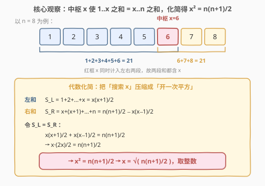
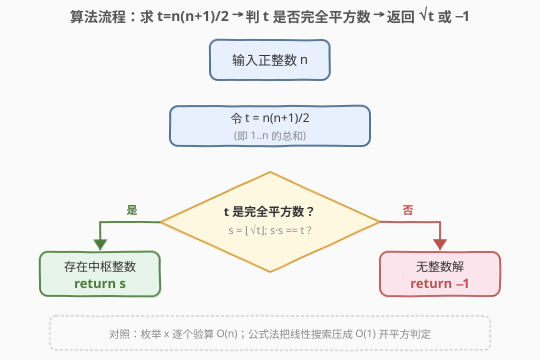
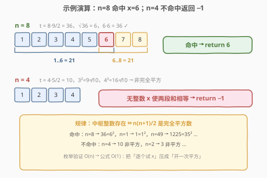

# LeetCode 找出中枢整数 题解

## 1. 题目概述

- **标题 / 题号**：找出中枢整数（#2485，easy）
- **链接**：https://leetcode.cn/problems/find-the-pivot-integer/
- **难度**：简单
- **标签**：数学、前缀和

**题意**：给你一个正整数 $n$，找出满足下述条件的**中枢整数** $x$：

- $1$ 和 $x$ 之间的所有元素之和等于 $x$ 和 $n$ 之间所有元素之和。

即 $\displaystyle\sum_{i=1}^{x} i = \sum_{i=x}^{n} i$。返回中枢整数 $x$；若不存在，返回 $-1$。题目保证对于给定输入至多存在一个中枢整数。

**示例 1**：

```text
输入：n = 8
输出：6
解释：6 是中枢整数，因为 1 + 2 + 3 + 4 + 5 + 6 = 6 + 7 + 8 = 21。
```

**示例 2**：

```text
输入：n = 1
输出：1
解释：1 是中枢整数，因为 1 = 1。
```

**示例 3**：

```text
输入：n = 4
输出：-1
解释：可以证明不存在满足题目要求的整数。
```

**约束**：

- $1 \le n \le 1000$

> 💡 关键细节：$x$ **同时计入左右两段**——左和是 $1\!+\dots+\!x$，右和是 $x\!+\dots+\!n$，两段都以 $x$ 为端点。这个「重叠端点」正是化简后能消去线性项、只留 $x^2$ 的根由。下文从枚举出发，逐步压成 $O(1)$ 的「开平方判完全平方数」。

## 2. 解题思路

### 2.1 暴力思路：枚举每个 x 逐个验算

最朴素的实现是**枚举** $x \in [1, n]$，对每个 $x$ 分别算出左和 $S_L = 1+2+\dots+x$ 与右和 $S_R = x+(x+1)+\dots+n$，判断是否相等：

- 命中即返回 $x$；
- 遍历完仍无命中，返回 $-1$。

由于 $n \le 1000$，最坏遍历 $1000$ 个 $x$，每次用等差数列求和公式 $O(1)$ 算两段和，总体 $O(n)$ 即可 AC。若不套公式、每次循环累加，则是 $O(n^2)$，$n=1000$ 时约 $10^6$ 次加法，仍能过但未利用问题结构。

> ⚠️ 枚举法暴露一个事实：右和 $S_R$ 随 $x$ 增大而**单调递减**（$x$ 右移，右段越来越短），左和 $S_L$ **单调递增**。两者一个增一个减，至多有一个交点——这正是「至多一个中枢」的单调性依据，也暗示可二分。但下文用代数化简做得更彻底：直接闭式求解。

### 2.2 核心观察：代数化简，$x^2 = n(n+1)/2$



**关键直觉**：两段和都用等差数列求和公式写出，令其相等，线性项会**恰好抵消**，只留下 $x^2$。

左和（首项 $1$、末项 $x$、项数 $x$）：

$$
S_L = \sum_{i=1}^{x} i = \frac{x(x+1)}{2}
$$

右和（首项 $x$、末项 $n$、项数 $n-x+1$）。用「总和减左段不含 $x$ 的部分」更易写：$\sum_{i=x}^{n} i = \sum_{i=1}^{n} i - \sum_{i=1}^{x-1} i$，即

$$
S_R = \frac{n(n+1)}{2} - \frac{x(x-1)}{2}
$$

令 $S_L = S_R$：

$$
\frac{x(x+1)}{2} = \frac{n(n+1)}{2} - \frac{x(x-1)}{2}
$$

把右段的 $\frac{x(x-1)}{2}$ 移到左边：

$$
\frac{x(x+1)}{2} + \frac{x(x-1)}{2} = \frac{n(n+1)}{2}
$$

合并左式——注意 $(x+1)+(x-1)=2x$，$x$ 的常数 $\pm 1$ 抵消：

$$
\frac{x\bigl[(x+1)+(x-1)\bigr]}{2} = \frac{x \cdot 2x}{2} = x^2 = \frac{n(n+1)}{2}
$$

于是得到一个干净的闭式：

$$
\boxed{\,x^2 = \frac{n(n+1)}{2}\,} \quad\Longrightarrow\quad x = \sqrt{\frac{n(n+1)}{2}}
$$

> 💡 **为什么线性项抵消？** 因为 $x$ 同时是左段的右端点和右段的左端点。左和含 $\frac{x^2}{2}+\frac{x}{2}$，右和移项后贡献 $\frac{x^2}{2}-\frac{x}{2}$，相加 $\frac{x}{2}$ 与 $-\frac{x}{2}$ 抵消，只剩 $x^2$。这个「重叠端点消去线性项」是本题的灵魂。

**判定**：令 $t = \dfrac{n(n+1)}{2}$（即 $1\!+\dots+\!n$ 的总和）。中枢存在 $\Leftrightarrow$ $t$ 是完全平方数。若 $t = s^2$（$s$ 为正整数），则 $x = s$；否则返回 $-1$。

验证三个示例：

| $n$ | $t=n(n+1)/2$ | 是否完全平方 | $x$ |
|-----|--------------|--------------|-----|
| $8$ | $8 \times 9 / 2 = 36 = 6^2$ | 是 | $6$ |
| $1$ | $1 \times 2 / 2 = 1 = 1^2$ | 是 | $1$ |
| $4$ | $4 \times 5 / 2 = 10$ | 否（$3^2=9, 4^2=16$） | $-1$ |

### 2.3 算法流程图



流程极简，三步：

1. 计算 $t = n(n+1)/2$；
2. 取 $s = \lfloor\sqrt{t}\rfloor$，判 $s \cdot s = t$ 是否成立；
3. 成立返回 $s$，否则返回 $-1$。

> 💡 整数开方可用语言自带的整数 `sqrt`（注意先用浮点开方再向下取整后**回验** $s \cdot s = t$，避免浮点误差误判）；C++ 也可用二分或 `std::sqrt` + 回验。

### 2.4 示例演算



- **示例 1** $n=8$：$t = 8 \times 9 / 2 = 36$，$\sqrt{36}=6$，$6 \times 6 = 36$ ✓ $\to$ 返回 $6$。代入原式复核：$1\!+\dots+\!6 = 21$，$6\!+\!7\!+\!8 = 21$，相等 ✓。
- **示例 2** $n=1$：$t = 1 \times 2 / 2 = 1$，$\sqrt{1}=1$，$1 \times 1 = 1$ ✓ $\to$ 返回 $1$。复核：左 $=1$、右 $=1$，相等 ✓。
- **示例 3** $n=4$：$t = 4 \times 5 / 2 = 10$，$\lfloor\sqrt{10}\rfloor=3$，$3^2=9 \ne 10$、$4^2=16\ne 10$ $\to$ 非完全平方 $\to$ 返回 $-1$。

## 3. 参考代码

### C++

```cpp
class Solution {
public:
    int pivotInteger(int n) {
        int t = n * (n + 1) / 2;
        int s = sqrt(t);          // 整数开方，向下取整
        return s * s == t ? s : -1;  // 回验，规避浮点误差
    }
};
```

> 💡 `n \le 1000` 时 $t \le 500500$，`int` 不溢出（`INT_MAX` 约 $2.1\times10^9$）。`sqrt(t)` 返回浮点，赋给 `int` 截断取整；务必 `s*s==t` 回验，杜绝 `sqrt` 把本应是平方数的 $t$ 因浮点误差算成 $s-0.000001$ 而截成 $s-1$ 的情形。

### Python

```python
class Solution:
    def pivotInteger(self, n: int) -> int:
        t = n * (n + 1) // 2
        s = int(t ** 0.5)
        return s if s * s == t else -1
```

> 💡 Python 整型无溢出，`t ** 0.5` 为浮点开方；同样用 `s * s == t` 回验。若担心超大 $n$ 的浮点精度，可用 `math.isqrt(t)`（整数开方，精确无误差），写法 `s = math.isqrt(t); return s if s*s == t else -1`，对本题 $n\le1000$ 二者等价。

## 4. 复杂度分析

| 维度 | 复杂度 | 说明 |
|------|--------|------|
| **时间复杂度** | $O(1)$ | 一次乘除 + 一次开方 + 一次回验，常数步 |
| **空间复杂度** | $O(1)$ | 仅存 $t, s$ 两个变量 |
| 对照：枚举验算 | $O(n)$ | 枚举每个 $x$，每次 $O(1)$ 求和公式，$n=1000$ 约 $10^3$ 步 |
| 对照：二分 $x$ | $O(\log n)$ | 利用 $S_L$ 增 / $S_R$ 减的单调性二分，仍被闭式 $O(1)$ 击败 |

> 💡 本题是「用代数结构把线性搜索压成闭式」的典型范例：识别出两段和的闭式表达后相减，线性项抵消、问题塌缩为一次开平方。一旦 $n$ 放大到 $10^{18}$（本题约束外），枚举/二分失效，唯有 $O(1)$ 公式可行。

## 5. 扩展：从「枚举」到「闭式」的方法论

本题的化简路径值得抽象为一个通用范式：

1. **写闭式**：把待比较的量用求和公式/递推写成 $O(1)$ 闭式（此处等差数列求和）。
2. **令相等**：列出方程，观察哪些项可消。
3. **消冗余**：本题的 $x$ 因「同时属于两段」而使 $\pm x/2$ 抵消，留下 $x^2$。
4. **塌缩到判定**：方程退化为「某量是否为完全平方数」之类的单次判定，$O(1)$ 出解。

**变体联想**：若把「$1\!+\dots+\!x = x\!+\dots+\!n$」改成「$1\!+\dots+\!x = (x\!+\!1)\!+\dots+\!n$」（$x$ 只属左段，右段从 $x+1$ 起），方程变为 $\frac{x(x+1)}{2} = \frac{n(n+1)}{2}-\frac{x(x+1)}{2}$，即 $x(x+1)=\frac{n(n+1)}{2}$，需判 $\frac{n(n+1)}{2}$ 能否写成两相邻整数之积——结构类似但不再是单纯开平方，可见「端点是否重叠」直接决定能否消线性项。

> 💡 另一个视角：$t = n(n+1)/2$ 是**三角形数** $T_n$。本题等价于「$T_n$ 是否同时是平方数」，即找三角形数中的平方数（$1, 36, 1225, \dots$，对应 $n=1,8,49,\dots$）。这类数由 Pell 方程 $x^2 - 2y^2 = \pm 1$ 的解刻画，有无穷多个。

## 6. 面试要点

1. **为什么 $x$ 同时计入左右两段而非分属一段？**

   > 题面明确「$1$ 和 $x$ 之间」「$x$ 和 $n$ 之间」，两段都含端点 $x$。这使左和是 $\sum_{1}^{x}$、右和是 $\sum_{x}^{n}$，$x$ 是公共端点。若误读为左段 $\sum_{1}^{x}$、右段 $\sum_{x+1}^{n}$（$x$ 只属左段），方程会变成 $x(x+1)=n(n+1)/2$，无法消成 $x^2$，结果也不同。审题时务必确认端点归属。

2. **化简时为什么线性项 $x/2$ 会抵消？**

   > 左和 $S_L = \frac{x^2}{2}+\frac{x}{2}$，右和移项贡献 $-\Bigl(\frac{x^2}{2}-\frac{x}{2}\Bigr)=-\frac{x^2}{2}+\frac{x}{2}$。两式相加，$\frac{x^2}{2}$ 变号后与 $\frac{x^2}{2}$ 合为 $x^2$，而 $\frac{x}{2}$ 与 $+\frac{x}{2}$ 中的项恰好一正一负抵消——根因是左段末项 $x$ 与右段首项 $x$ 同号同系数，求和后线性部分相消。

3. **整数开方为何要回验 `s*s==t`？**

   > `sqrt` / `** 0.5` 是浮点运算，存在精度误差。极端情形下，本应为平方数的 $t$ 可能被算成略小于整数 $s$ 的浮点值（如 $s-1.999\times10^{-7}$），截断取整后错误地得到 $s-1$。回验 $s \cdot s = t$ 用纯整数乘法判定，杜绝误判。Python 可用 `math.isqrt` 直接得精确整数平方根。

4. **能否不用开方，直接判 $t$ 是否完全平方数？**

   > 可以。用整数二分找 $s$：在 $[1, n]$（因 $x \le n$ 故 $s=\sqrt{t}\le n$）内二分，比较 $mid^2$ 与 $t$，$O(\log n)$。或用牛顿迭代整数开方。但本题 $n \le 1000$，浮点开方+回验已足够且更简洁；推广到 $n\le10^{18}$ 时二分/`isqrt` 更稳。

5. **枚举法和公式法的取舍？**

   > 约束 $n\le1000$ 下枚举 $O(n)$ 完全够用且不易写错，面试可先给枚举再优化。公式法 $O(1)$ 展示「识别结构、消元、塌缩到判定」的能力，且对超大 $n$ 唯一可行。两者都应掌握：枚举保底、公式显优。

> 💡 **一句话总结**：中枢整数 $x$ 满足 $\sum_{1}^{x}=\sum_{x}^{n}$，两段闭式相减后线性项因端点重叠而抵消，得 $x^2 = n(n+1)/2$；故只需判 $t=n(n+1)/2$ 是否完全平方数，开方回验 $O(1)$ 出解。

## 同类练习题

| # | 题目 | 与本题的关联 |
|---|------|-------------|
| 724 | [寻找数组的中心下标](https://leetcode.cn/problems/find-pivot-index/)（[题解](../0701-0800/724_寻找数组的中心下标.md)） | 把「中枢」从连续整数 $1..n$ 搬到任意数组，用前缀和 $O(n)$ 找使左和=右和的下标，对照「闭式 $O(1)$」与「前缀和 $O(n)$」 |
| 1991 | [找到数组的中间位置](https://leetcode.cn/problems/find-the-middle-index-in-array/)（[题解](../1901-2000/1991_找到数组的中间位置.md)） | 724 的等价表述，同样左和=右和的中枢下标，承接 724 前缀和范式 |
| 69 | [x 的平方根](https://leetcode.cn/problems/sqrtx/)（[题解](../0001-0100/69_x的平方根.md)） | 整数开方的底层实现（二分/牛顿），本题 `sqrt(t)` 的依赖件，体会浮点开方+回验的精度处理 |
| 172 | [阶乘后的零](https://leetcode.cn/problems/factorial-trailing-zeroes/)（[题解](../0101-0200/172_阶乘后的零.md)） | 同为「数论公式把线性枚举压成 $O(\log n)$/$O(1)$」，对照「识别结构消冗余」的化简范式 |
