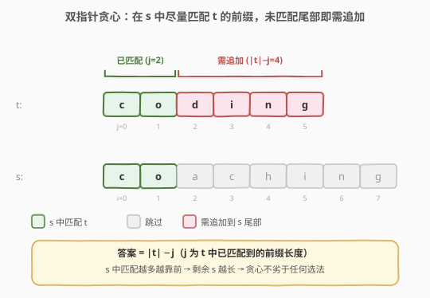
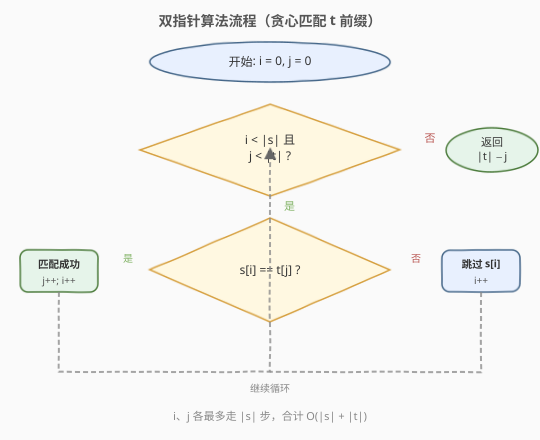
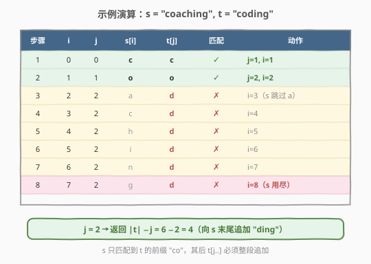

# 追加字符以获得子序列

- **题目名称**：追加字符以获得子序列
- **链接**：[2486. 追加字符以获得子序列](https://leetcode.cn/problems/append-characters-to-string-to-make-subsequence/)
- **难度**：中等
- **标签**：双指针、字符串、贪心

## 1. 题目概述

给定字符串 `s` 和 `t`，可以向 `s` 的**末尾追加**任意字符。返回使 `t` 成为 `s` 的子序列所需追加的**最少字符数**。

**子序列**是从原字符串中删除一些（也可以不删除）字符、不改变剩余字符相对顺序得到的新字符串。本题的关键约束是**只能向 `s` 末尾追加**（不能在中间插入），因此能在 `s` 内部消化的必然是 `t` 的一个**前缀**，剩下匹配不上的就是 `t` 的尾部，必须整段追加。

**示例 1**：

```text
输入：s = "coaching", t = "coding"
输出：4
解释：向 s 末尾追加 "ding"，s 变为 "coachingding"，此时 t = "coding" 是其子序列（c o |a c h i n g| d i n g）。
可以证明追加任何 3 个字符都无法使 t 成为 s 的子序列。
```

**示例 2**：

```text
输入：s = "abcde", t = "a"
输出：0
解释：t 已是 s 的子序列，无需追加。
```

**示例 3**：

```text
输入：s = "z", t = "abcde"
输出：5
解释：s 中匹配不到 t 的任何字符，需把 "abcde" 整个追加到 s 末尾。
```

**约束条件**：

- $1 \le \text{s.length}, \text{t.length} \le 10^5$
- `s` 和 `t` 仅由小写英文字母组成

---

## 2. 解题思路

### 2.1 暴力思路

对 `t` 的每个字符从头到尾扫一遍 `s`，找到第一个能匹配且位置在上次之后的字符，最坏 $O(|s| \cdot |t|)$。数据量 $10^5$ 时高达 $10^{10}$，不可接受。问题在于没有利用「`t` 的字符必须保序匹配」这一性质——可以**一次扫描 `s`，同时推进 `t` 的指针**，把两重循环压成单趟。

### 2.2 核心观察：双指针贪心——在 s 中尽量靠前地匹配 t 的前缀



由于只能向 `s` **末尾**追加，能在 `s` 内部消化的必然是 **`t` 的一个前缀** `t[0..j-1]`，剩下 `t[j..]` 必须追加。于是问题归约为：**求 `t` 的最长前缀，使其成为 `s` 的子序列**，答案即 $|t| - j$。

这和 [392. 判断子序列](../0301-0400/392_判断子序列.md) 是**同一个贪心骨架，只是两字符串角色对调**：

- **392**：扫 `t`（haystack，`j` 总前进），看 `s`（pattern）能否整个匹配进 `t`，返回布尔；
- **2486**：扫 `s`（haystack，`i` 总前进），看 `t`（pattern）能匹配到哪个前缀位置 `j`，返回 $|t| - j$。

> 💡 **为什么贪心正确？** 对 `t` 的每个字符在 `s` 中选「最早可匹配位置」是最优的：选得越早，`s` 剩余部分越长，后续字符可行域是「选更晚」情形的超集，不会更差。形式化地，若位置 $q$ 可行则 $p < q$ 也可行，故贪心选最小不劣于任何选择——于是贪心匹配出的前缀长度 $j$ 就是「`t` 作为 `s` 子序列的最长前缀」长度，$|t| - j$ 即最小追加数。

两个指针 `i`（扫 `s`）和 `j`（扫 `t`）同步推进：

- 若 `s[i] == t[j]`：匹配成功，`j++`（`t` 前进一位，匹配前缀又长一格）；
- 无论是否匹配，`i++`（`s` 总是前进，一个 `s` 字符至多贡献一次匹配）。

`s` 扫完时 `j` 停在「已匹配到的 `t` 前缀长度」，答案 $= |t| - j$。

### 2.3 算法流程图



初始化 `i = 0`、`j = 0`。每轮看 `s[i]` 是否等于 `t[j]`：

1. 相等 → `j++`、`i++`（匹配上，`t` 前缀长一格）；
2. 不等 → 只 `i++`（跳过 `s` 中这个无关字符）；
3. `i == |s|` 或 `j == |t|` 时退出循环；
4. 返回 $|t| - j$（`t` 中尚未匹配的尾部长度即需追加数）。

`i`、`j` 各最多走 $|s|$ 步，合计 $O(|s| + |t|)$。

### 2.4 示例演算

以 `s = "coaching"`、`t = "coding"` 为例：



`s` 扫完后 `j = 2`（只匹配到 `t` 的前缀 `"co"`），返回 $|t| - j = 6 - 2 = 4$，即需向 `s` 末尾追加 `"ding"`。

---

## 3. 参考代码

### C++

```cpp
class Solution {
public:
    int appendCharacters(string s, string t) {
        int i = 0, j = 0;
        int n = s.size(), m = t.size();
        while (i < n && j < m) {
            if (s[i] == t[j]) j++;
            i++;
        }
        return m - j;
    }
};
```

### Python

```python
class Solution:
    def appendCharacters(self, s: str, t: str) -> int:
        i = j = 0
        n, m = len(s), len(t)
        while i < n and j < m:
            if s[i] == t[j]:
                j += 1
            i += 1
        return m - j
```

> 💡 **Python 迭代器写法**：把 `s` 当成可消费的迭代器，对 `t` 的每个字符贪心地在 `s` 剩余部分找最早匹配，`j` 即成功消费的个数——与 392 的迭代器技巧同源：
>
> ```python
> class Solution:
>     def appendCharacters(self, s: str, t: str) -> int:
>         it = iter(s)
>         j = 0
>         for c in t:
>             for x in it:          # 消费 s 直到匹配 c
>                 if x == c:
>                     j += 1
>                     break
>             else:                 # s 用尽仍未匹配 c
>                 break
>         return len(t) - j
> ```
>
> ⚠️ `for...else` 的 `else` 在内层循环**未被 break**（即 `s` 用尽）时触发，此时 `t` 剩余字符都得追加。面试中**首选显式双指针版本**——清晰、$O(n)$、不易写错。

---

## 4. 复杂度分析

| 维度 | 复杂度 | 说明 |
|------|--------|------|
| 时间 | $O(|s| + |t|)$ | `i` 扫完 `s`、`j` 至多扫完 `t`，两指针各自单调前进不回退 |
| 空间 | $O(1)$ | 仅两个指针变量，原地扫描 |
| 数据规模 | $|s|,|t| \le 10^5$ | $O(|s|+|t|) \approx 2\times 10^5$，远低于时限 |

---

## 5. 扩展：与 392 判断子序列的镜像关系

本题是 [392. 判断子序列](../0301-0400/392_判断子序列.md) 的**计数对偶**：

|  | 392 判断子序列 | 2486 追加字符 |
|---|---|---|
| 扫描对象（haystack） | `t`（`j` 无条件前进） | `s`（`i` 无条件前进） |
| 模式（pattern） | `s` | `t` |
| 循环出口 | `i==|s|` 匹配完 / `j==|t|` 用尽 | `i==|s|` 用尽 / `j==|t|` 匹配完 |
| 返回值 | `i == |s|`（布尔） | $|t| - j$（剩余需追加数） |
| 本质 | `s` 是否 `t` 的子序列 | `t` 的最长前缀作为 `s` 子序列的长度 |

> 💡 **角色对调记忆法**：「被扫描的那个字符串的指针永远无条件前进」。392 扫 `t` 故 `j++` 无条件；2486 扫 `s` 故 `i++` 无条件。判断谁是 haystack：看哪个字符串我们「只能跳过其中无关字符、不能控制它的推进」——那就是被扫描方。

若把 2486 放宽成「可在 `s` 任意位置插入字符」，则问题不再局限于前缀，答案变为 $|t| - \text{LCS}(s,t)$（最长公共子序列），需 DP $O(|s|\cdot|t|)$——本题能 $O(n)$ 全靠「只能追加到末尾」这一约束把问题限定在前缀匹配。

---

## 6. 面试要点

1. **为什么贪心匹配最长前缀是对的？**

   「`t` 的最长前缀作为 `s` 子序列」= 逐字符在 `s` 中取最早匹配位置所能达到的最大 `j`。若某方案能让 `t[0..k]` 全匹配，则对 `t[0]` 选最早位置后剩余 `s` 更长，归纳下去贪心至少能匹配 `t[0..k]`，故贪心的 `j` 即最大前缀长度，$|t|-j$ 最小。

2. **为什么是匹配 `t` 的前缀而非任意子序列？**

   只能向 `s` 末尾追加：`s` 内部能消化的字符相对顺序不变，能匹配的 `t` 字符必是 `t` 从头开始的连续前缀（一旦某个 `t[k]` 在剩余 `s` 中匹配不上，它及它后面的只能靠追加补齐）。所以「最大化匹配」=「最大化 `t` 的匹配前缀长度」。

3. **和 392 的区别在哪？会写混吗？**

   骨架相同、角色对调。关键看「谁的指针无条件前进」：被扫描的字符串指针总前进。392 里 `t` 是 haystack、`j++` 无条件，匹配时 `i++`；2486 里 `s` 是被扫描方、`i++` 无条件，匹配时 `j++`。返回值一个是布尔、一个是 $|t|-j$。

4. **边界情况？**

   `s` 完全不含 `t[0]`：`j` 始终为 0，返回 $|t|$（整个 `t` 追加）。`t` 已是 `s` 子序列：`j` 走到 $|t|$，返回 0。`s`、`t` 全相同：返回 0。代码无需特判，循环自然处理。

5. **能否用二分/预处理优化？**

   本题 $|s|,|t| \le 10^5$，单次 $O(|s|+|t|)$ 已是最优下界（至少要读完两个串），无需 392 那种「`t` 固定、批量查询 `s`」的二分预处理。若改成「同一 `s`、大量 `t` 查询」，则预处理 `s` 各字符下标 + 对每个 `t` 二分，单查询 $O(|t|\log |s|)$，思路同 [392 进阶](../0301-0400/392_判断子序列.md) 与 [792. 匹配子序列的单词数](../0701-0800/792_匹配子序列的单词数.md)。

---

## 7. 同类练习题

- [392. 判断子序列](https://leetcode.cn/problems/is-subsequence/)（[题解](../0301-0400/392_判断子序列.md)）：本题的判定版原型，双指针贪心母题，角色对调对照
- [28. 找出字符串中第一个匹配项的下标](https://leetcode.cn/problems/find-the-index-of-the-first-occurrence-in-a-string/)（[题解](../0001-0100/28_找出字符串中第一个匹配项的下标.md)）：连续子串匹配 KMP，对比「连续 vs 可跳过」
- [792. 匹配子序列的单词数](https://leetcode.cn/problems/number-of-matching-subsequences/)（[题解](../0701-0800/792_匹配子序列的单词数.md)）：批量判定多个串是否 `t` 的子序列，二分预处理模板，2486 的「批量查询」变种
- [1055. 形成字符串的最短路径](https://leetcode.cn/problems/shortest-way-to-form-string/)（[题解](../1001-1100/1055_形成字符串的最短路径.md)）：可多次从头扫 `source` 拼出 `target`，2486 的「可重头扫」进阶，求最少段数
- [115. 不同的子序列](https://leetcode.cn/problems/distinct-subsequences/)（[题解](../0101-0200/115_不同的子序列.md)）：求 `s` 作为 `t` 子序列的匹配方案数，DP 计数版，对照「判定/计数/追加」三态
