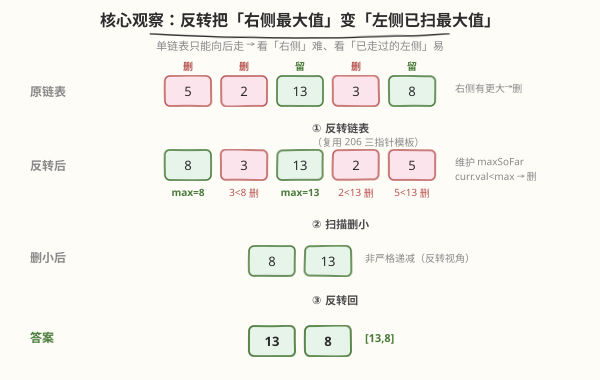
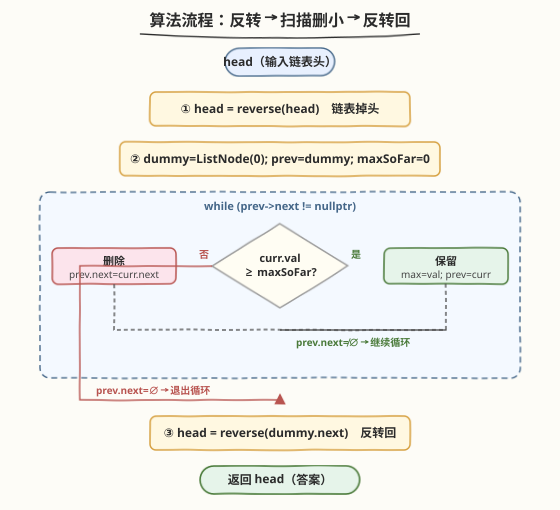
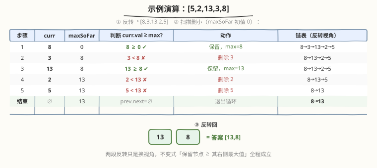

# LeetCode 从链表中移除节点 题解

## 1. 题目概述

- **标题 / 题号**：从链表中移除节点（#2487，medium）
- **链接**：https://leetcode.cn/problems/remove-nodes-from-linked-list/
- **难度**：中等
- **标签**：链表、单调栈、反转链表

**题意**：给定单链表的头节点 `head`，移除每个「右侧存在一个数值更大节点」的节点，返回修改后链表的头节点。注意"更大"是**严格大于**。

**示例 1**：

```text
输入：head = [5,2,13,3,8]
输出：[13,8]
解释：5 右侧有 13（更大）→ 删；2 右侧有 13 → 删；13 右侧无更大 → 留；3 右侧有 8 → 删；8 是末尾 → 留。
```

**示例 2**：

```text
输入：head = [1,1,1,1]
输出：[1,1,1,1]
解释：没有严格更大的值，所有节点均保留。
```

**约束**：

- 链表节点数目范围 `[1, 10^5]`
- `1 <= Node.val <= 10^5`

> 💡 关键词是"右侧有更大"——它问的是**后缀最大值**：节点 `i` 该保留当且仅当 `val[i] >= max(val[i+1..n])`。单链表只能向后走，"看右侧最大"天然不顺手，这是本题的难点所在。

## 2. 解题思路

### 2.1 暴力思路：后缀最大值数组

先把链表读进数组，倒序扫一遍算出每个位置右侧的最大值 `sufMax[i]`，再正序扫一遍删掉 `val[i] < sufMax[i]` 的节点。

- 需要 `O(n)` 额外空间存数组。
- 没有用到链表的指针操作，本质是"数组题套个链表壳"。
- 面试官通常期待**原地** `O(1)` 空间解法。

> ⚠️ 单链表向右"看后缀最大"别扭，根源是**链表只能单向走**，而"右侧最大"需要先知道后面。暴力的数组法把"先知道后面"显式化了，但要付出空间代价。有没有办法**不借助数组**也"先知道后面"？——**反转链表**，把"右侧"变成"左侧"。

### 2.2 核心观察：反转链表把「后缀最大值」变「前缀最大值」



直觉：**单链表只能向后走**，所以"看右侧"难、"看左侧（已走过的）"易。把链表**反转一次**，原本在右边的节点跑到左边、被先访问到。于是判断"`i` 右侧是否有更大"变成了判断"`i` 左侧（已扫过）是否有更大"——维护一个**已扫最大值 `maxSoFar`** 即可，`O(1)` 空间。

**反转后的处理规则**：扫反转后的链表，维护 `maxSoFar`（初值 `0`，因 `Node.val >= 1`）：

- 若 `curr.val >= maxSoFar`：`curr` 保留，更新 `maxSoFar = curr.val`，指针前进。
- 若 `curr.val < maxSoFar`：`curr` 删除（跳过它），`maxSoFar` 不变。

处理完得到一条"非严格递减"的链表（反转视角下），再**反转一次**还原顺序即为答案。

> 💡 这是"反转链表"的一个经典应用范式：**把需要"后缀信息"的链表题，转化为只需"前缀信息"的题**。两段反转 + 一趟扫描，三步都是 `O(n)`，全程 `O(1)` 空间。承接 [206. 反转链表](https://leetcode.cn/problems/reverse-linked-list/) 的三指针模板。

### 2.3 算法流程图



**完整步骤**：

1. **第一次反转**：`head = reverse(head)`，链表掉头。
2. **扫描删除**：用 `dummy` 哑节点 + `prev` 双指针扫反转后的链表。`maxSoFar = 0`；当 `prev->next != nullptr`（记 `curr = prev->next`）：
   - `curr.val >= maxSoFar`：保留 → `maxSoFar = curr.val`，`prev = curr`。
   - `curr.val < maxSoFar`：删除 → `prev.next = curr->next`（`prev` 不动）。
3. **第二次反转**：`head = reverse(dummy->next)`，还原顺序，返回。

> ⚠️ **为什么用哑节点？** 扫描中删除节点需要改前驱的 `next`，而链表没有前驱指针。`prev` 始终指向"已确认保留的最后一个节点"，`prev->next` 即"待判节点"，删除时只需 `prev->next = curr->next`——这与 [82. 删除排序链表中的重复元素 II](https://leetcode.cn/problems/remove-duplicates-from-sorted-list-ii/) 的 `prev` 角色完全相同。哑节点让 `prev` 一开始就有合法落脚点，统一了"删头"与"删中"的边界。

### 2.4 示例演算

以 `head = [5,2,13,3,8]`（示例 1）为例：



**第一步 反转**：`[5,2,13,3,8]` → `[8,3,13,2,5]`。

**第二步 扫描删小**（`maxSoFar` 初值 `0`）：

| 步骤 | curr | maxSoFar | 判断（curr.val ≥ max?） | 动作 | 链表（反转视角） |
|------|------|----------|--------------------------|------|-------------------|
| 1 | 8 | 0 | 8 ≥ 0 ✔ | 保留，max=8 | 8→3→13→2→5 |
| 2 | 3 | 8 | 3 < 8 ✘ | 删除 3 | 8→13→2→5 |
| 3 | 13 | 8 | 13 ≥ 8 ✔ | 保留，max=13 | 8→13→2→5 |
| 4 | 2 | 13 | 2 < 13 ✘ | 删除 2 | 8→13→5 |
| 5 | 5 | 13 | 5 < 13 ✘ | 删除 5 | 8→13 |
| 结束 | ∅ | 13 | prev.next=∅ | 退出循环 | **8→13** |

**第三步 反转回**：`[8,13]` → `[13,8]`，即答案。

> 💡 第二步留下的链表 `8→13` 在反转视角下**非严格递减**：每个保留节点的值都 ≥ 它在反转链表中左侧（即原链表右侧）的最大值。两段反转只是换视角，不变式"保留节点 ≥ 其右侧最大值"全程成立。

## 3. 参考代码

### C++

```cpp
/**
 * Definition for singly-linked list.
 * struct ListNode {
 *     int val;
 *     ListNode *next;
 *     ListNode() : val(0), next(nullptr) {}
 *     ListNode(int x) : val(x), next(nullptr) {}
 *     ListNode(int x, ListNode *next) : val(x), next(next) {}
 * };
 */
class Solution {
   public:
    ListNode* removeNodes(ListNode* head) {
        head = reverse(head);            // ① 反转

        ListNode* dummy = new ListNode(0);
        dummy->next = head;
        ListNode* prev = dummy;
        int maxSoFar = 0;                // Node.val >= 1，0 当哨兵必被首个更新
        while (prev->next != nullptr) {
            ListNode* curr = prev->next;
            if (curr->val >= maxSoFar) {
                maxSoFar = curr->val;     // 保留，更新最大值
                prev = curr;
            } else {
                prev->next = curr->next;  // 删除，prev 不动
            }
        }

        return reverse(dummy->next);     // ② 反转回
    }

   private:
    ListNode* reverse(ListNode* head) {   // 复用 206 三指针模板
        ListNode* prev = nullptr;
        ListNode* curr = head;
        while (curr != nullptr) {
            ListNode* next = curr->next;
            curr->next = prev;
            prev = curr;
            curr = next;
        }
        return prev;
    }
};
```

### Python

```python
# Definition for singly-linked list.
# class ListNode:
#     def __init__(self, val=0, next=None):
#         self.val = val
#         self.next = next
class Solution:
    def removeNodes(self, head: Optional[ListNode]) -> Optional[ListNode]:
        head = self._reverse(head)              # ① 反转

        dummy = ListNode(0)
        dummy.next = head
        prev = dummy
        max_so_far = 0                          # Node.val >= 1，0 当哨兵
        while prev.next:
            curr = prev.next
            if curr.val >= max_so_far:
                max_so_far = curr.val           # 保留，更新最大值
                prev = curr
            else:
                prev.next = curr.next           # 删除，prev 不动

        return self._reverse(dummy.next)        # ② 反转回

    def _reverse(self, head: Optional[ListNode]) -> Optional[ListNode]:
        prev = None
        curr = head
        while curr:
            nxt = curr.next
            curr.next = prev
            prev = curr
            curr = nxt
        return prev
```

> 💡 两版逻辑一致。`_reverse` 完全照搬 [206 题](https://leetcode.cn/problems/reverse-linked-list/) 的三指针迭代模板。扫描循环用 `prev->next` 作为"待判"游标——`prev` 始终是"已确认保留的最后节点"，删除时 `prev->next = curr->next`，与 82 题的 `prev` 角色完全相同。

## 4. 复杂度分析

| 维度 | 复杂度 | 说明 |
|------|--------|------|
| **时间复杂度** | `O(n)` | 两次反转各 `O(n)`，扫描删除 `O(n)`（每个节点访问一次），合计线性 |
| **空间复杂度** | `O(1)` | 只用 `dummy`、`prev`、`maxSoFar` 等常数指针与变量，原地修改 |

> ⚠️ `n = 10^5` 时务必用迭代反转（栈深 `O(1)`）；递归版此时调用栈过深，可能爆栈。

## 5. 扩展：递归解法

递归天然"先到末尾再回溯"，正好从右向左处理，无需显式反转。回溯时：子问题返回"右侧已处理好的子链表头"，它的值即右侧最大值；若它 `> head.val`，说明 `head` 右侧有更大值，删 `head`，否则保留 `head`。

```cpp
class Solution {
   public:
    ListNode* removeNodes(ListNode* head) {
        if (head == nullptr || head->next == nullptr) {
            return head;                        // 不足两节点，尾部必留
        }
        head->next = removeNodes(head->next);   // 右侧处理完的子链表
        if (head->next->val > head->val) {
            return head->next;                  // 右侧有更大 → 删 head
        }
        return head;                             // 保留 head
    }
};
```

**关键不变式**：`removeNodes(head)` 返回的链表，其**头节点的值 = 原子链表的最大值**（全局最大必被保留，且是保留链表最左节点）。于是对父节点 `head`，`head->next->val` 恰是 `head` 右侧的最大值；`> head->val` 即"右侧有更大"→ 删 `head`。

- 时间 `O(n)`，空间 `O(n)`（递归栈深度 `n`）。链表 `n = 10^5` 时**可能栈溢出**（C++ 无尾调用优化），面试默认写迭代反转版，递归作为"另一种视角"提及。

> 💡 **递归 vs 反转**：两者本质相同——递归用**调用栈**反转了访问顺序（先进后出 = 反转），迭代反转版用**显式两次反转**达到同样效果。递归简洁、反转版省栈，可类比 [206. 反转链表](https://leetcode.cn/problems/reverse-linked-list/) 的迭代 vs 递归取舍。

## 6. 面试要点

1. **为什么反转能解决问题？**

   - 单链表只能向后走，"看右侧最大"需要后缀信息；反转后右侧变左侧，"后缀最大"变"前缀最大"，一趟扫描维护 `maxSoFar` 即可。这是"用反转把后缀问题变前缀问题"的范式。

2. **为什么不直接正扫维护后缀最大？**

   - 正向扫只能维护前缀最大（左侧最大），得不到右侧最大。要右侧最大必须先读到右侧——要么数组预存，要么反转链表"先读到右侧"。反转是 `O(1)` 空间的做法。

3. **`maxSoFar` 初值为什么是 0？用 `-∞` 行不行？**

   - 题目保证 `Node.val >= 1`，所以 `0` 比所有节点都小，首个节点必保留并更新它。用 `-∞`（C++ `INT_MIN`）也行，更通用但本题非必要。关键是初值要让第一个节点被保留。

4. **递归版为什么 `head->next->val > head->val` 删 head，而反转版用 `< maxSoFar` 删？方向怎么对上？**

   - 递归**从右向左**回溯，`head->next` 是右侧处理结果的头 = 右侧最大值；`> head` 即"右侧有更大"→ 删。反转版**从（反转后的）左向右**扫，`maxSoFar` 是已扫最大 = 原右侧最大；`< maxSoFar` 即"右侧有更大"→ 删。两者删的都是"右侧有更大值"的节点，只是观察方向相反，判定符号也相应反向。

5. **本题和单调栈的关系？**

   - 本题等价于"保留从右看的单调**不增**序列"：保留的节点从右到左值非严格递增（即从左到右非严格递减的反转视角）。递归/反转版的 `maxSoFar` 维护正是单调栈的扁平化——栈里其实只关心一个值（当前右侧最大），所以退化成单变量。若题目改为保留"右侧有更**大或相等**"等更复杂条件，单调栈写法会更灵活。

> 💡 **一句话总结**：单链表删"右侧有更大"的节点，难点在"右侧"需后缀信息。解法是**反转链表 → 维护已扫最大值删小者 → 反转回**，三步 `O(n)`、`O(1)` 空间。本质是"用反转把后缀问题变前缀问题"，递归版用调用栈达到同样效果但省不了栈空间。

## 同类练习题

| # | 题目 | 与本题的关联 |
|---|------|-------------|
| 206 | [反转链表](https://leetcode.cn/problems/reverse-linked-list/)（[题解](../0201-0300/206_反转链表.md)） | 本题反转步骤的母题，三指针迭代模板 |
| 82 | [删除排序链表中的重复元素 II](https://leetcode.cn/problems/remove-duplicates-from-sorted-list-ii/)（[题解](../0001-0100/82_删除排序链表中的重复元素II.md)） | 哑节点 + prev 守锚点 + 删整段，同一删除范式 |
| 2130 | [链表最大孪生和](https://leetcode.cn/problems/maximum-twin-sum-of-a-linked-list/) | 同样"反转后半段"把后缀信息变前缀信息的范式 |
| 143 | [重排链表](https://leetcode.cn/problems/reorder-list/) | 反转后半段 + 双指针归并，反转链表的又一组合应用 |
| 92 | [反转链表 II](https://leetcode.cn/problems/reverse-linked-list-ii/) | 区间反转，本题反转步骤的进阶边界处理 |
