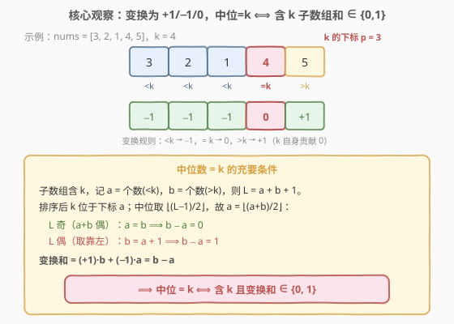
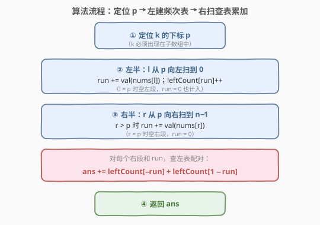

# 统计中位数为 K 的子数组

- **题目名称**：统计中位数为 K 的子数组
- **链接**：[2488. 统计中位数为 K 的子数组](https://leetcode.cn/problems/count-subarrays-with-median-k/)
- **难度**：困难
- **标签**：数组、哈希表、前缀和

## 1. 题目概述

给你一个长度为 $n$ 的数组 `nums`，由 $1$ 到 $n$ 的**互不相同**整数组成，再给一个正整数 $k$。统计 `nums` 中**中位数等于 $k$** 的非空子数组数目。

中位数定义：把子数组**递增排序**后取中间元素；若长度为偶数，取**靠左**的中间元素（即下标 $\lfloor (L-1)/2 \rfloor$ 处，0 下标）。

**示例 1**：

```text
输入：nums = [3,2,1,4,5], k = 4
输出：3
解释：中位数等于 4 的子数组有：[4]、[4,5] 和 [1,4,5]。
```

**示例 2**：

```text
输入：nums = [2,3,1], k = 3
输出：1
解释：[3] 是唯一一个中位数等于 3 的子数组。
```

**约束条件**：

- $n = \text{nums.length}$
- $1 \le n \le 10^5$
- $1 \le \text{nums}[i],\ k \le n$
- `nums` 中的整数互不相同

> 💡 关键细节：**中位数要等于 $k$，$k$ 必须出现在子数组里**（排序后中位数取的是某个元素本身，而不是平均值）。再结合「互不相同」与「取靠左中位」两个条件，可以把「中位数等于 $k$」翻译成一个干净的**和差不变式**，从而把判定压成「子数组和是否落在 $\{0,1\}$」。

---

## 2. 解题思路

### 2.1 暴力思路：枚举所有子数组排序取中位

最朴素的做法是**枚举**所有 $O(n^2)$ 个子数组 $[l,r]$，对每个子数组排序后取下标 $\lfloor (L-1)/2 \rfloor$ 处元素，判断是否等于 $k$。复杂度 $O(n^2 \log n)$，$n=10^5$ 必然超时。

暴力法的价值在于暴露一个事实：**中位数是否等于 $k$，只取决于子数组里比 $k$ 小的个数 $a$ 与比 $k$ 大的个数 $b$ 的相对关系**——和这些元素的具体值无关。这一观察是后续把判定压成「和」的钥匙。

> ⚠️ 还有一个前提：$k$ 必须在子数组里。否则排序后的中位不可能是 $k$。所以只统计**含 $k$ 的子数组**即可，$k$ 的位置 $p$ 把数组切成左右两半。

### 2.2 核心观察：变换为 ±1/0，中位=k ⟺ 子数组和 ∈ {0,1}



**第一步：把判定翻译成 $a,b$ 的关系。**

设子数组长度 $L$、含 $k$，其中比 $k$ 小的有 $a$ 个、比 $k$ 大的有 $b$ 个，则 $L = a+b+1$。子数组排序后 $k$ 的位置（0 下标）恰好是 $a$（前面有 $a$ 个更小的）。中位取下标 $\lfloor (L-1)/2 \rfloor$，故

$$
a = \Big\lfloor \frac{L-1}{2} \Big\rfloor = \Big\lfloor \frac{a+b}{2} \Big\rfloor
$$

分奇偶讨论（令 $m$ 为整数）：

| $L$（含 $k$） | $a+b=L-1$ | 中位下标 $\lfloor(a+b)/2\rfloor$ | $a$ 取值 | $b-a$ |
|------|-----------|----------------------------------|----------|-------|
| 奇 $2m+1$ | $2m$（偶） | $m$ | $a=m$ | $0$ |
| 偶 $2m$   | $2m-1$（奇）| $m-1$ | $a=m-1,\ b=m$ | $1$ |

> 💡 注意偶数长度取**靠左中位**，于是 $b$ 比 $a$ **多 1**（不是 $a$ 比 $b$ 多 1）。若题面改成取靠右中位，结论会反转为 $b-a\in\{-1,0\}$。这一处细节决定下界。

合并两行：**中位数 $= k$ ⟺ 子数组含 $k$ 且 $b - a \in \{0, 1\}$。**

**第二步：用变换把 $b-a$ 写成「子数组和」。**

把每个元素替换成一个符号：

$$
\text{val}(x) = \begin{cases} +1, & x > k \\ \phantom{+}0, & x = k \\ -1, & x < k \end{cases}
$$

则子数组的变换和 $= b\cdot(+1) + 0 + a\cdot(-1) = b - a$。于是

$$
\boxed{\,\text{中位数}=k \iff \text{子数组含 }k\text{ 且变换和}\in\{0,1\}\,}
$$

**第三步：用前缀和 + 哈希统计。**

$k$ 的位置 $p$ 把子数组 $[l,r]$（$l\le p\le r$）切成三段：左 $[l,p-1]$、$k$ 本身、右 $[p+1,r]$。记

- 左段和 $\text{leftPart}=\sum_{i=l}^{p-1}\text{val}(i)$（$l=p$ 时为 $0$）；
- 右段和 $\text{rightPart}=\sum_{i=p+1}^{r}\text{val}(i)$（$r=p$ 时为 $0$）。

子数组变换和 $=\text{leftPart}+0+\text{rightPart}$。要求 $\in\{0,1\}$，即对每个右段和 $\text{rightPart}$，需要左段和取 $\{-\text{rightPart},\ 1-\text{rightPart}\}$。用一张哈希表统计左段和的频次即可在 $O(1)$ 内查表。

### 2.3 算法流程图



具体步骤：

1. 找到 $k$ 在 `nums` 中的下标 $p$。
2. **左半**：从 $p$ 向左扫，维护累加和 `run`（初值 $0$ 对应 $l=p$ 的空左段），把每个 `run` 计入哈希表 `leftCount`。
3. **右半**：从 $p$ 向右扫，维护累加和 `run`（初值 $0$ 对应 $r=p$ 的空右段）。对每个 `run`，答案累加
   $$\text{leftCount}[-\text{run}] + \text{leftCount}[1-\text{run}]$$
4. 返回累加值。

> 💡 为何 $k$ 自身的 $0$ 不单独处理？因为左、右段都把 $k$ 排除在外（左段终点是 $p-1$，右段起点是 $p+1$），$k$ 贡献 $0$，自然被「夹在中间」不进任何一边的累加和。空左段（$l=p$）与空右段（$r=p$）各贡献一个 $0$，二者配对正是「只取 $[k]$ 自身」这一个子数组。

### 2.4 示例演算

![示例演算：nums=[3,2,1,4,5], k=4，左表 4 项，右扫 2 步，共得 3 个子数组](../images/mediank_example_walkthrough.svg)

以示例 1 `nums = [3,2,1,4,5], k = 4` 演算。$k=4$ 的下标 $p=3$，变换数组 $=[-1,-1,-1,0,+1]$。

**左半（从 $p=3$ 向左）累加 `run`，建表**：

| $l$ | 取值 | $\text{run}$（左段和） | `leftCount` |
|-----|------|------------------------|--------------|
| $3$ | 空 | $0$ | $\{0:1\}$ |
| $2$ | $1\to -1$ | $-1$ | $\{0:1,-1:1\}$ |
| $1$ | $2\to -1$ | $-2$ | $\{0:1,-1:1,-2:1\}$ |
| $0$ | $3\to -1$ | $-3$ | $\{0:1,-1:1,-2:1,-3:1\}$ |

**右半（从 $p=3$ 向右）累加 `run`，查表累加答案**：

| $r$ | 取值 | $\text{run}$（右段和） | 查 $\{-\text{run},\,1-\text{run}\}$ | 贡献 | 命中子数组 |
|-----|------|------------------------|--------------------------------------|------|-----------|
| $3$ | 空 | $0$ | $\{0,1\}$ → $1+0$ | $1$ | $[4]$ |
| $4$ | $5\to +1$ | $1$ | $\{-1,0\}$ → $1+1$ | $2$ | $[1,4,5]$、$[4,5]$ |

合计 $1+2=3$，与示例一致。

**示例 2** `nums=[2,3,1], k=3`：$p=1$，变换 $=[-1,0,-1]$。左表 $\{0:1,-1:1\}$；右扫 $r=1\to \text{run}=0$ 贡献 $1$（$[3]$），$r=2\to \text{run}=-1$ 贡献 $0$，合计 $1$。

---

## 3. 参考代码

### C++

```cpp
class Solution {
public:
    int countSubarrays(vector<int>& nums, int k) {
        int n = nums.size();
        int p = find(nums.begin(), nums.end(), k) - nums.begin();

        unordered_map<int, int> leftCount;
        int run = 0;
        leftCount[0] = 1;              // l = p，左段为空，和 = 0
        for (int l = p - 1; l >= 0; --l) {
            run += (nums[l] < k) ? -1 : 1;   // >k → +1，<k → -1
            leftCount[run]++;
        }

        int ans = 0;
        run = 0;                       // r = p，右段为空，和 = 0
        for (int r = p; r < n; ++r) {
            if (r > p) run += (nums[r] < k) ? -1 : 1;
            ans += leftCount[-run] + leftCount[1 - run];
        }
        return ans;
    }
};
```

> 💡 三元运算 `nums[l] < k ? -1 : 1` 之所以正确，是因为 `nums` 元素互不相同，任意元素要么 $<k$ 要么 $>k$，$k$ 自身仅出现在 $p$ 处、已被排除在左右段之外。若题目允许重复，此法失效——需要显式按「大于/小于/等于 $k$」三分类，且含多个 $k$ 时中位定义更复杂。

### Python

```python
class Solution:
    def countSubarrays(self, nums: List[int], k: int) -> int:
        p = nums.index(k)
        leftCount = Counter()
        run = 0
        leftCount[0] = 1               # l = p，左段为空
        for l in range(p - 1, -1, -1):
            run += -1 if nums[l] < k else 1
            leftCount[run] += 1

        ans = 0
        run = 0                        # r = p，右段为空
        for r in range(p, len(nums)):
            if r > p:
                run += -1 if nums[r] < k else 1
            ans += leftCount[-run] + leftCount[1 - run]
        return ans
```

> 💡 哈希表键可正可负，Python 用 `Counter` / 字典即可；C++ 用 `unordered_map<int,int>`。注意 `leftCount[key]` 在 C++ 中对不存在键会**插入**一个 $0$，本题无害（值本就是 $0$），但若在意可先 `auto it = leftCount.find(key); if (it != end) ans += it->second;`。

---

## 4. 复杂度分析

| 维度 | 复杂度 | 说明 |
|------|--------|------|
| **时间复杂度** | $O(n)$ | 找 $p$ 一次遍历；左半、右半各一次遍历，每步 $O(1)$ 哈希操作 |
| **空间复杂度** | $O(n)$ | `leftCount` 最多存 $p+1 \le n$ 个不同和值 |
| 对照：暴力排序 | $O(n^2 \log n)$ | 枚举 $O(n^2)$ 子数组各排序一次 |
| 对照：前缀和 + 双指针 | — | 因和值可负、不单调，无法用滑动窗口替代哈希 |

> 💡 本题是「把判定压成和不变式 + 前缀和哈希」的招牌题：识别出 $b-a$ 这一关键量后，问题塌缩为经典的「两段和配对计数」，与「和为 $K$ 的子数组」同构。$n=10^5$ 下 $O(n)$ 哈希是预期解，暴力 $O(n^2)$ 必超时。

---

## 5. 扩展：从「和 ∈ {0,1}」理解偶数取靠左中位

偶数长度取靠左中位这一约定，在数学上体现为 $b-a=1$（大值多一个），让 $k$ 在排序后恰好落在「下标 $=a$」处。可这样记忆：

- 取**靠左**中位 ⟹ 长度偶时「右侧可多塞一个」⟹ $b-a=1$ 允许；
- 取**靠右**中位 ⟹ 长度偶时「左侧可多塞一个」⟹ $a-b=1$，即 $b-a=-1$。

故只要把目标集合换成 $\{0,-1\}$（C++ 改查 `leftCount[-run] + leftCount[-1-run]`），本算法即可适配「靠右中位」版本。

**变体联想**：若改成「统计中位数**小于** $k$ 的子数组数」，可对每个 $k$ 值分别套用本变换，或离线处理。但本题的「互不相同 + $1..n$」保证了 $k$ 唯一出现，是能用单点 $p$ 切左右的前提；若有多个 $k$，需对每个 $k$ 的位置分段处理或改用其它数据结构（如对每个前缀维护有序统计）。

---

## 6. 面试要点

1. **为什么 $k$ 必须出现在子数组里？**

   > 中位数是排序后**取某个元素本身**（非平均值），故中位等于 $k$ 必须要求 $k$ 在子数组中。这把搜索空间从「所有 $O(n^2)$ 子数组」收缩到「所有含 $p$ 的子数组」，是后续按 $p$ 切左右两半的前提。

2. **$b-a\in\{0,1\}$ 是怎么来的，偶数为何是 $1$ 不是 $-1$？**

   > 中位下标 $=\lfloor(L-1)/2\rfloor$，令其 $=a$（比 $k$ 小的个数）。$L-1=a+b$。偶长度 $L=2m$ 时 $L-1=2m-1$ 为奇，$a=\lfloor(2m-1)/2\rfloor=m-1$，故 $b=L-1-a=2m-1-(m-1)=m$，$b-a=1$。根因是「偶长度取靠左中位」，若取靠右则反转。

3. **为什么变换和恰好等于 $b-a$？**

   > 变换把 $>k$ 记 $+1$、$<k$ 记 $-1$、$k$ 记 $0$。子数组和 $=b\cdot1+a\cdot(-1)+0=b-a$。$k$ 自身贡献 $0$，所以「含 $k$」这一要求只影响位置约束、不改变和值。

4. **左、右段和为何都把 $k$ 排除？空段为何也要计入？**

   > $k$ 贡献 $0$，放进哪边都行，但放进左或右会让「空段」语义混乱。约定左段终点 $p-1$、右段起点 $p+1$，$k$ 夹中间不进累加。空左段（$l=p$）和空右段（$r=p$）各贡献一个 $0$，二者配对正是「只取 $[k]$ 自身」这个子数组，必须计入否则漏算。

5. **能否避免哈希表，用数组代替？**

   > 和值范围是 $[-n, n]$，可平移到 $[0, 2n]$ 用定长数组代替哈希，常数更小。但本题 $n=10^5$，`unordered_map` 已能 AC；若卡常可换数组。注意键可能为负，平移偏移 $n$ 即可。

> 💡 **一句话总结**：中位 $=k$ ⟺ 含 $k$ 且 $(\text{个数}>k)-(\text{个数}<k)\in\{0,1\}$；把数组变换成 $\pm1/0$ 后该差即子数组和，于是问题塌缩为「以 $p$ 为分界、左右两段和配对落在 $\{0,1\}$」，前缀和 + 哈希 $O(n)$ 出解。

---

## 7. 同类练习题

- [560. 和为 K 的子数组](https://leetcode.cn/problems/subarray-sum-equals-k/)（[题解](../0501-0600/560_和为K的子数组.md)）：前缀和 + 哈希统计「和为目标值」的子数组数，本题把目标拆成 $\{0,1\}$ 两个值、再按 $p$ 切左右配对，是其直接母题
- [1248. 统计「优美子数组」](https://leetcode.cn/problems/count-number-of-nice-subarrays/)（[题解](../1201-1300/1248_统计优美子数组.md)）：同样把元素二值化（奇→1、偶→0）再统计「奇数个数恰为 $k$」的子数组，对照「变换 + 前缀和哈希」的同一范式
- [525. 连续数组](https://leetcode.cn/problems/contiguous-array/)（[题解](../0501-0600/525_连续数组.md)）：把 0 当 $-1$ 转换、用前缀和哈希找「和为 0」的最长子数组，同样是「变换为 ±1 让目标和显式化」的思路
- [974. 和可被 K 整除的子数组](https://leetcode.cn/problems/subarray-sums-divisible-by-k/)（[题解](../0901-1000/974_和可被K整除的子数组.md)）：前缀和 + 同余定理统计，对照「把判定压成前缀和的关系」的另一变体
