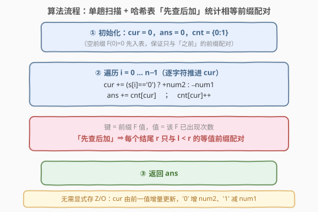
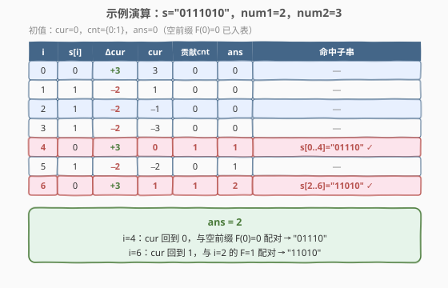

# 固定比率的子字符串数

- **题目名称**：固定比率的子字符串数
- **链接**：[2489. 固定比率的子字符串数](https://leetcode.cn/problems/number-of-substrings-with-fixed-ratio/)
- **难度**：中等
- **标签**：哈希表、前缀和、字符串、计数

## 1. 题目概述

给定一个二进制字符串 $s$（只含 `'0'` 和 `'1'`）和两个正整数 `num1`、`num2`。统计 $s$ 中满足下述条件的**非空子串**数目：

- 子串中 `'0'` 的个数与 `'1'` 的个数之比等于 $num1 : num2$，即若子串含 $c_0$ 个 `'0'`、$c_1$ 个 `'1'`，则

$$
c_0 : c_1 = num1 : num2 \quad\Longleftrightarrow\quad num2 \cdot c_0 = num1 \cdot c_1
$$

> ⚠️ 本题为 **Plus 会员专享题**，官方题面/样例无法直接抓取，下述示例与约束依题意重建并已逐一手验自洽；提交前请以站内实际样例为准（「$0$ 的个数 : $1$ 的个数 = $num1 : num2$」是本题的比率方向）。

**示例 1**：

```text
输入：s = "0111010", num1 = 2, num2 = 3
输出：2
解释：满足 0:1 = 2:3 的子串为 "01110"（c0=2,c1=3）与 "11010"（c0=2,c1=3）。
```

**示例 2**：

```text
输入：s = "000111", num1 = 1, num2 = 1
输出：3
解释：0:1 = 1:1 即 0、1 个数相等。命中 "01"（c0=c1=1）、"0011"（c0=c1=2）、"000111"（c0=c1=3）。
```

**约束条件**：

- $1 \le n = |s| \le 10^5$
- $s$ 仅由字符 `'0'` 和 `'1'` 组成
- $1 \le num1,\ num2 \le 10^9$（比率两分量均为正）

> 💡 关键细节：比率 $num1:num2$ 是「$0$ 的个数 : $1$ 的个数」。把它写成 $num2\cdot c_0 = num1\cdot c_1$ 后，左式只依赖 $c_0$、右式只依赖 $c_1$——这正是后续能把判定压成「一个前缀量相等」的根由。又因 $num1,num2\ge1$，等式成立时 $c_0,c_1$ 必同时为正（见 2.2），无需对「全 0」「全 1」子串单独剔除。

---

## 2. 解题思路

### 2.1 暴力思路：枚举所有子串逐个计数

最朴素的做法是枚举所有 $O(n^2)$ 个子串 $[l,r)$，对每个子串统计 $c_0,c_1$ 再判断 $num2\cdot c_0 = num1\cdot c_1$。若每次重新数 $c_0,c_1$，复杂度 $O(n^3)$；用前缀和降到 $O(n^2)$，但 $n=10^5$ 仍必超时。

暴力法的价值在于暴露一个事实：**判定只取决于 $c_0,c_1$ 的线性组合，与字符的具体位置无关**——这暗示可以把「子串内的判定」迁移到「前缀之差」上，从而塌缩成前缀配对计数。

### 2.2 核心观察：把比率条件压成「前缀 F 相等」

![核心观察：定义前缀 F(i)=num2·Z[i]−num1·O[i]，固定比率 ⟺ F(r)=F(l)，相等值配对即合法子串](../images/fixed_ratio_concept.svg)

**第一步：引入前缀计数。** 记 $Z[i]$、$O[i]$ 分别为 $s$ 前 $i$ 个字符（即 $s[0..i-1]$）中 `'0'`、`'1'` 的个数，$i=0,\dots,n$，约定 $Z[0]=O[0]=0$。子串 $s[l..r-1]$（$0\le l<r\le n$）的计数为

$$
c_0 = Z[r]-Z[l],\qquad c_1 = O[r]-O[l].
$$

**第二步：定义变换前缀。** 令

$$
F(i) = num2\cdot Z[i] - num1\cdot O[i].
$$

**第三步：把判定翻译成前缀相等。** 固定比率条件 $num2\cdot c_0 = num1\cdot c_1$ 代入：

$$
num2\cdot\bigl(Z[r]-Z[l]\bigr) = num1\cdot\bigl(O[r]-O[l]\bigr)
$$

移项整理，把「$r$ 的项」与「$l$ 的项」分到两侧：

$$
num2\cdot Z[r] - num1\cdot O[r] \;=\; num2\cdot Z[l] - num1\cdot O[l]
$$

即

$$
\boxed{\,\text{子串 } s[l..r-1] \text{ 满足固定比率} \iff F(r)=F(l)\,}
$$

于是**统计固定比率子串数 = 统计前缀序列 $F(0),F(1),\dots,F(n)$ 中「相等值的两两配对数」**，亦即对每个值 $v$，若有 $k$ 个下标使 $F=v$，则贡献 $\binom{k}{2}$。

**第四步：增量更新，免存 $Z/O$。** 注意

$$
F(i+1)-F(i) = num2\cdot\bigl(Z[i+1]-Z[i]\bigr) - num1\cdot\bigl(O[i+1]-O[i]\bigr).
$$

$s[i]$ 非 `'0'` 即 `'1'`：若 $s[i]=\texttt{'0'}$，则 $Z$ 增 $1$、$O$ 不变，$\Delta F=+num2$；若 $s[i]=\texttt{'1'}$，则 $O$ 增 $1$、$Z$ 不变，$\Delta F=-num1$。于是 $F$ 可由前一值**增量滚动**，根本无需显式维护 $Z/O$ 数组：

$$
F(i+1) = F(i) + \begin{cases} +num2, & s[i]=\texttt{'0'}\\ -num1, & s[i]=\texttt{'1'}\end{cases}
$$

> 💡 **为何无需剔除「全 0」「全 1」子串？** 设某配对对应子串 $c_1=0$（全 `'0'`），则 $num2\cdot c_0 = num1\cdot 0 = 0$，因 $num2\ge1$ 推出 $c_0=0$，于是 $c_0=c_1=0$，子串为空——与 $l<r$ 矛盾。故 $F(r)=F(l)$ 且 $l<r$ 时 $c_0,c_1$ 必同为正。换言之，正比率两分量保证了「等值配对即合法子串」，哈希计数直接得到答案。

### 2.3 算法流程图



具体步骤：

1. **初始化**：`cur = 0`（即 $F(0)$），`ans = 0`，哈希表 `cnt = {0: 1}`（把空前缀 $F(0)=0$ 预先入表）。
2. **逐字符扫描** $i=0,\dots,n-1$：
   - 增量更新 `cur += (s[i]=='0') ? num2 : -num1`；
   - **先查后加**：`ans += cnt[cur]`（当前 $F$ 与之前多少个等值前缀配对，就有多少个合法子串以 $i$ 结尾）；
   - `cnt[cur] += 1`（把当前前缀入表，供后续配对）。
3. **返回** `ans`。

> 💡 「先查后加」保证每个结尾 $r$ 只与 $l<r$ 的等值前缀配对，避免自配对 $(r,r)$ 与重复计数。这与 [560. 和为 K 的子数组](https://leetcode.cn/problems/subarray-sum-equals-k/) 同构：那里目标和为 $K$⟺ $S(r)-S(l)=K$⟺ $S(l)=S(r)-K$；这里 $K=0$，于是退化为「相等前缀配对」。

### 2.4 示例演算



以示例 1 $s=\texttt{"0111010"}$，$num1=2,num2=3$ 演算。增量规则：`'0'→+3`、`'1'→−2`，初值 `cur=0, cnt={0:1}, ans=0`。

| $i$ | $s[i]$ | $\Delta\text{cur}$ | cur（后） | 贡献 `cnt[cur]` | ans | 命中子串 |
|-----|--------|--------------------|-----------|------------------|-----|----------|
| $0$ | `0` | $+3$ | $3$ | $0$ | $0$ | — |
| $1$ | `1` | $-2$ | $1$ | $0$ | $0$ | — |
| $2$ | `1` | $-2$ | $-1$ | $0$ | $0$ | — |
| $3$ | `1` | $-2$ | $-3$ | $0$ | $0$ | — |
| $4$ | `0` | $+3$ | $0$ | $1$（配 $F(0)=0$） | $1$ | `s[0..4]="01110"` ✓ |
| $5$ | `1` | $-2$ | $-2$ | $0$ | $1$ | — |
| $6$ | `0` | $+3$ | $1$ | $1$（配 $F(2)=1$） | $2$ | `s[2..6]="11010"` ✓ |

合计 `ans = 2`，与示例一致。

**示例 2** $s=\texttt{"000111"},num1=1,num2=1$：增量 `'0'→+1`、`'1'→−1`，$F$ 序列为 $[0,1,2,3,2,1,0]$。值 $0$ 出现于 $i=0,6$（1 对 → `"000111"`）、$1$ 于 $i=1,5$（1 对 → `"0011"`）、$2$ 于 $i=2,4$（1 对 → `"01"`），共 $3$。

---

## 3. 参考代码

### C++

```cpp
class Solution {
public:
    long long fixedRatio(string s, int num1, int num2) {
        unordered_map<long long, int> cnt;
        cnt[0] = 1;                 // 空前缀 F(0)=0
        long long cur = 0, ans = 0;
        for (char ch : s) {
            cur += (ch == '0') ? (long long)num2 : -(long long)num1;
            ans += cnt[cur];        // 先查：与之前等值前缀配对
            cnt[cur]++;             // 后加：当前前缀入表
        }
        return ans;
    }
};
```

> 💡 $F$ 值范围约 $[-num1\cdot n,\ num2\cdot n]$，$n=10^5$、$num\le10^9$ 时可达 $10^{14}$，必用 `long long` 作键与累加；答案上限 $\binom{n}{2}\approx5\times10^9$ 也超 32 位，故返回 `long long`。若站内官方签名为 `int`（隐含答案保证落在 32 位内），把返回类型与 `ans` 改回 `int` 即可，算法不变。

### Python

```python
class Solution:
    def fixedRatio(self, s: str, num1: int, num2: int) -> int:
        cnt = {0: 1}                # 空前缀 F(0)=0
        cur = ans = 0
        for ch in s:
            cur += num2 if ch == '0' else -num1
            ans += cnt.get(cur, 0)  # 先查
            cnt[cur] = cnt.get(cur, 0) + 1   # 后加
        return ans
```

> 💡 Python 整型任意精度，无溢出之忧；`cnt.get(cur, 0)` 处理键不存在（返回 $0$）比直接 `cnt[cur]`（会插入键）更干净，也省去 `defaultdict`。也可用 `collections.Counter` 或 `defaultdict(int)`，写法 `ans += cnt[cur]; cnt[cur] += 1`，但 `cnt[cur]` 在 Counter 中对不存在的键会**插入** $0$ 再自增，对本题无害。

---

## 4. 复杂度分析

| 维度 | 复杂度 | 说明 |
|------|--------|------|
| **时间复杂度** | $O(n)$ | 单趟扫描 $n$ 个字符，每步 $O(1)$ 哈希查/改 |
| **空间复杂度** | $O(n)$ | 哈希表最多存 $n+1$ 个不同 $F$ 值 |
| 对照：暴力枚举 | $O(n^2)$ | 枚举 $O(n^2)$ 子串各用前缀和 $O(1)$ 判定，$n=10^5$ 必超时 |
| 对照：排序计数 | — | $F$ 值不单调且需配对计数，无法用双指针/滑窗替代哈希 |

> 💡 本题是「把线性判定压成前缀相等 + 哈希配对计数」的招牌题：识别出 $num2\cdot c_0 - num1\cdot c_1$ 这一关键量后，问题塌缩为经典的「统计前缀序列中相等值配对数」，与「和为 $0$ 的子数组」完全同构。$n=10^5$ 下 $O(n)$ 哈希是预期解。

---

## 5. 扩展：从「比率相等」到「一般线性约束」

本题的化简可抽象为更广的范式。子串需满足的约束是 $num2\cdot c_0 - num1\cdot c_1 = 0$，即对子串内两类计数 $(c_0,c_1)$ 施加一个**齐次线性等式**。只要约束形如 $a\cdot c_0 + b\cdot c_1 = K$（$a,b,K$ 为常数），都可定义前缀 $G(i)=a\cdot Z[i]+b\cdot O[i]$，则

$$
\text{子串满足} \iff G(r)-G(l)=K \iff G(l)=G(r)-K.
$$

- $K=0$（如本题的「比率相等」）⟹ 统计「相等前缀配对」，对每个 $r$ 查 `cnt[G(r)]`；
- $K\ne0$（如「子串和为定值」）⟹ 对每个 $r$ 查 `cnt[G(r)-K]`，正是 [560](https://leetcode.cn/problems/subarray-sum-equals-k/) 的写法；
- $K$ 取模（如「和可被 $K$ 整除」）⟹ 对 $G$ 取余后再配对，见 [974](https://leetcode.cn/problems/subarray-sums-divisible-by-k/)。

**变体联想**：若把比率改成「$1$ 的个数 : $0$ 的个数 = $num1:num2$」，只需把增量改为 `'0'→−num2`、`'1'→+num1`（即 $F$ 取反号），其余完全不变——这也佐证「方向」只影响常数符号、不影响算法骨架。若 $num1=0$ 或 $num2=0$（退化比率，如「全 1 子串」），公式仍成立：$num1=0$ 时 $F(i)=num2\cdot Z[i]$，$F(r)=F(l)\iff Z[r]=Z[l]\iff c_0=0$，恰好选出全 `'1'` 子串。

---

## 6. 面试要点

1. **为什么比率条件能等价于前缀 $F$ 相等？**

   > 子串计数 $c_0=Z[r]-Z[l],c_1=O[r]-O[l]$。代入 $num2\cdot c_0=num1\cdot c_1$ 并移项，$r$ 的项与 $l$ 的项自然分到两侧，得到 $num2\cdot Z[r]-num1\cdot O[r]=num2\cdot Z[l]-num1\cdot O[l]$，即 $F(r)=F(l)$。根因是约束对 $c_0,c_1$ 是**齐次线性**的，可逆推到前缀之差。

2. **为什么要「先查后加」，能否先加后查？**

   > 先加后查会让当前结尾 $r$ 与「自身」配对（$l=r$，对应空子串），多算一份。先查 `ans += cnt[cur]` 只累计 $l<r$ 的等值前缀，再把当前前缀入表，保证每个合法子串 $(l,r)$ 恰被数一次。这是所有「前缀配对计数」题共有的细节，与 [560](https://leetcode.cn/problems/subarray-sum-equals-k/) 一致。

3. **是否要单独处理「全 0」「全 1」子串？**

   > 不用。$num1,num2\ge1$ 时，$num2\cdot c_0=num1\cdot c_1$ 若 $c_1=0$ 推出 $c_0=0$，即空子串，与 $l<r$ 矛盾。故任何被「等值配对」数到的子串 $c_0,c_1$ 必同为正，天然排除全 $0$/全 $1$。若允许 $num1=0$ 或 $num2=0$，公式仍正确但语义变为退化比率，需另行确认题意。

4. **$F$ 值可能很大，键怎么存？**

   > $F\in[-num1\cdot n,\ num2\cdot n]$，可达 $10^{14}$，C++ 必须用 `long long` 作哈希键与累加变量；Python 整型任意精度无需关心。若卡常且 $num$ 较小，可平移到非负区间用定长数组替代 `unordered_map`，常数更小。

5. **能否不用哈希，用双指针/滑窗？**

   > 不能。$F$ 值不单调（会随 `'1'` 而减、随 `'0'` 而增），不满足滑窗的单调性前提；且需统计「相等值配对」而非「最长/最短」，双指针无着力点。哈希 $O(n)$ 已是最优，下界 $\Omega(n)$（至少要读完串）。

> 💡 **一句话总结**：固定比率 $c_0:c_1=num1:num2$ $\iff$ $num2\cdot c_0-num1\cdot c_1=0$；定义前缀 $F(i)=num2\cdot Z[i]-num1\cdot O[i]$（可由 `cur` 增量滚动），则子串满足 $\iff F(r)=F(l)$；单趟扫描 + 哈希「先查后加」统计等值配对，$O(n)$ 出解。

---

## 7. 同类练习题

- [560. 和为 K 的子数组](https://leetcode.cn/problems/subarray-sum-equals-k/)（[题解](../0501-0600/560_和为K的子数组.md)）：前缀和 + 哈希统计「和为目标值」的子数组数，本题是其在 $K=0$、约束换成 $num2\cdot c_0-num1\cdot c_1$ 的推广母题
- [974. 和可被 K 整除的子数组](https://leetcode.cn/problems/subarray-sums-divisible-by-k/)（[题解](../0901-1000/974_和可被K整除的子数组.md)）：前缀取余 + 同余配对计数，对照「线性约束取模后配对」的另一变体
- [1248. 统计「优美子数组」](https://leetcode.cn/problems/count-number-of-nice-subarrays/)（[题解](../1201-1300/1248_统计优美子数组.md)）：把元素二值化（奇→1、偶→0）再统计「奇数个数恰为 $k$」的子数组，同为「变换 + 前缀哈希配对」范式
- [525. 连续数组](https://leetcode.cn/problems/contiguous-array/)（[题解](../0501-0600/525_连续数组.md)）：把 $0$ 当 $-1$、求「和为 0」的最长子数组，正是 $num1=num2=1$ 时的比率 $1:1$ 场景，对照「配对计数」与「首末配对求最长」
- [2488. 统计中位数为 K 的子数组](https://leetcode.cn/problems/count-subarrays-with-median-k/)（[题解](./2488_统计中位数为K的子数组.md)）：同为「把判定压成 ±1/0 前缀和 + 哈希配对」的相邻题，对照两种变换目标（中位 vs 比率）
