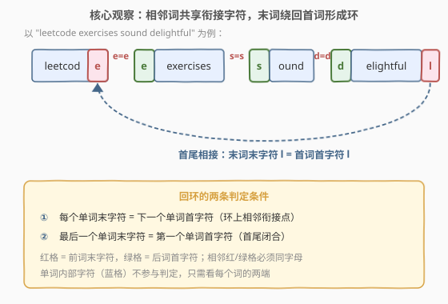
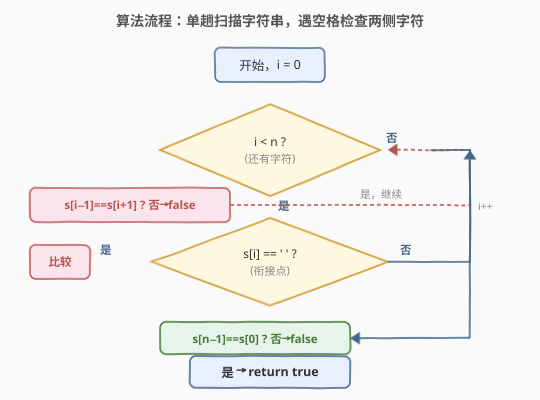
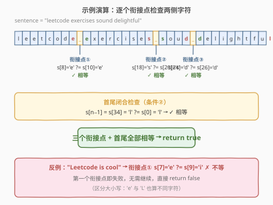

# 回环句

- **题目名称**：回环句
- **链接**：[2490. 回环句](https://leetcode.cn/problems/circular-sentence/)
- **难度**：简单
- **标签**：字符串、模拟

## 1. 题目概述

**句子** 是由单个空格分隔的一组单词，且不含前导或尾随空格。单词**仅**由大小写英文字母组成，且大小写视为不同字符。

若句子满足下述**两条**条件，则称它是一个**回环句**：

- **条件①**：句子中每个单词的最后一个字符等于下一个单词的第一个字符；
- **条件②**：最后一个单词的最后一个字符等于第一个单词的第一个字符。

给定字符串 `sentence`，判断它是不是回环句。

**示例 1**：

```text
输入：sentence = "leetcode exercises sound delightful"
输出：true
解释：单词为 ["leetcode", "exercises", "sound", "delightful"]。
- leetcod e 的末字符 e = exercises 的首字符 e
- exercises 的末字符 s = sound 的首字符 s
- sound 的末字符 d = delightful 的首字符 d
- delightfu l 的末字符 l = leetcode 的首字符 l
四个衔接点 + 首尾闭合全部满足，是回环句。
```

**示例 2**：

```text
输入：sentence = "eetcode"
输出：true
解释：只有一个单词，条件②要求其自身末字符 = 首字符：e = e，成立。
```

**示例 3**：

```text
输入：sentence = "Leetcode is cool"
输出：false
解释：Leetcode 的末字符 e ≠ is 的首字符 i，条件①在第一个衔接点即失败。
```

**约束条件**：

- $1 \le \text{sentence.length} \le 500$
- `sentence` 仅由大小写英文字母和空格组成
- 单词由**单个空格**分隔，不含前导或尾随空格

> 💡 **关键细节**：大小写敏感（`'e'` 与 `'E'` 不同）；单词由**单个空格**分隔（无连续空格），这让「空格的位置」直接等价于「两个相邻词的衔接点」——这是把判定压成单趟扫描的根由。

---

## 2. 解题思路

### 2.1 暴力思路：分割单词后逐对比较

最直接的写法是按空格 `split` 出单词数组 `words`，再对每个相邻对（含末词绕回首词）检查末字符是否等于后词首字符：

```python
words = sentence.split()
for i in range(len(words)):
    if words[i][-1] != words[(i + 1) % len(words)][0]:
        return False
return True
```

逻辑清晰，时间 $O(n)$、空间 $O(n)$（要存下所有单词）。但本题的判定本质只用到**每个词的两个端点字符**——词的内部字符完全不参与比较，把它们全部切分出来再存进数组是**冗余的**。能否不分配单词数组、直接在原串上一趟扫完？

### 2.2 核心观察：不必分割——空格即衔接点，单趟扫描 $O(1)$ 空间



**关键直觉**：题面保证单词由**单个空格**分隔，因此每个空格 `s[i]` 恰好落在两个相邻词之间。空格左边一个字符 `s[i-1]` 就是**前词的末字符**，空格右边一个字符 `s[i+1]` 就是**后词的首字符**。于是「每个词末字符 = 下一个词首字符」这一整列条件，等价于：

$$
\text{对每个空格位置 } i：\quad s[i-1] = s[i+1]
$$

把对「词」的操作，塌缩成对「空格两侧字符」的操作——无需切分、无需数组。再加上「末词末字符 = 首词首字符」即 $s[n-1] = s[0]$（条件②），两条条件合起来就是完整判定。

> 💡 **为什么单空格这个约束是灵魂？** 若允许连续空格（如 `"a  b"`），空格两侧字符就不再保证是「前词末/后词首」，上述就地判定失效，必须真正 `split` 跳过空串。题面用「单个空格分隔」锁死了这个简化前提，于是 $O(1)$ 空间写法成为可能——审题时务必抓住这类「输入结构自带简化」的钩子。

**单词边界情况**：若句子只有一个词（无空格），循环根本不执行，只剩条件② $s[n-1] = s[0]$——对单字符 `"a"` 自然成立（$a=a$），对 `"ab"` 不成立（$b\ne a$），对 `"eetcode"` 成立（$e=e$）。无需任何特判，循环 + 末位检查天然覆盖。

### 2.3 算法流程图



流程分两段：

1. **逐衔接点检查**：指针 `i` 从 `0` 扫到 `n-1`，凡遇 `s[i] == ' '`，比较 `s[i-1]` 与 `s[i+1]`，不等即立刻 `return false`；
2. **首尾闭合检查**：扫描结束后，比较 `s[n-1]` 与 `s[0]`，不等则 `return false`，否则 `return true`。

`i` 单调前进、不回退，整串只扫一遍。

### 2.4 示例演算



以 `"leetcode exercises sound delightful"` 为例（下标从 0 起）：

- 空格在下标 8（`e | e`）、18（`s | s`）、24（`d | d`）三处：每处两侧字符均相等 ✓；
- 末字符 `s[34]='l'` 与首字符 `s[0]='l'` 相等 ✓；
- 全部通过 → `return true`。

反例 `"Leetcode is cool"`：第一个衔接点 `s[7]='e'` 与 `s[9]='i'` 不等，**第一处即失败**，提前 `return false`——这正是扫描写法的优势：发现违反就短路，不必扫完整串。

---

## 3. 参考代码

### C++

```cpp
class Solution {
public:
    bool isCircularSentence(string sentence) {
        int n = sentence.size();
        for (int i = 0; i < n; ++i) {
            if (sentence[i] == ' '
                && sentence[i - 1] != sentence[i + 1]) {
                return false;
            }
        }
        return sentence[n - 1] == sentence[0];
    }
};
```

> 💡 空格处必有 `i >= 1` 且 `i + 1 < n`（题目保证无前导/尾随空格，空格两侧必是字母），故 `s[i-1]`、`s[i+1]` 永不越界，无需边界判断。

### Python

```python
class Solution:
    def isCircularSentence(self, sentence: str) -> bool:
        for i, ch in enumerate(sentence):
            if ch == ' ' and sentence[i - 1] != sentence[i + 1]:
                return False
        return sentence[-1] == sentence[0]
```

> 💡 Python 的 `sentence[i - 1]` 在 `i == 0` 时会取到末字符 `sentence[-1]`，但因 `i == 0` 处 `ch` 必为字母（无前导空格），不会进入该分支，故负索引的「副作用」不被触发。若担心可读性，可写显式 `if i > 0 and ...`，但本题约束下非必需。

---

## 4. 复杂度分析

| 维度 | 复杂度 | 说明 |
|------|--------|------|
| **时间** | $O(n)$ | `i` 单调扫过整串一次，每个字符 $O(1)$ 处理；命中失败可提前结束 |
| **空间** | $O(1)$ | 仅用指针 `i` 与常数变量，不分配单词数组 |
| 数据规模 | $n \le 500$ | $O(n) \approx 500$，远低于时限；即便 $n=10^6$ 该写法仍轻松 AC |

> 💡 与「`split` + 数组」的 $O(n)$ 空间写法相比，本写法把空间从 $O(n)$ 压到 $O(1)$：核心在于识别出「只需词的端点字符、词内部可忽略」，从而免去了切分与存储。时间上两者同为 $O(n)$，但扫描写法支持「一遇违反即短路」，平均比较次数更少。

---

## 5. 扩展：split 写法与单趟扫描写法的对照

两种写法同思路、不同抽象层级，面试中可先给 `split` 版讲清题意，再优化到单趟扫描版体现「识别冗余、压空间」的能力：

|  | `split` 数组版 | 单趟扫描版 |
|---|---|---|
| 抽象对象 | **词**（`words[i]`） | **字符**（`s[i]`） |
| 衔接点表达 | `words[i][-1]` vs `words[i+1][0]` | `s[i-1]` vs `s[i+1]`（`s[i]` 为空格） |
| 首尾闭合 | `words[-1][-1]` vs `words[0][0]` | `s[n-1]` vs `s[0]` |
| 空间 | $O(n)$（存单词数组） | $O(1)$ |
| 短路 | 需遍历到违反处 | 同左，且无切分开销 |
| 适用前提 | 任意分隔（含连续空格） | **单空格分隔**（题面满足） |

> ⚠️ 若题面放宽为「单词间可能有连续空格」，单趟扫描的「空格两侧字符」就不再保证是词端点（可能是另一个空格），$O(1)$ 写法失效，需回退到 `split` 真正归并空串。可见「能压到 $O(1)$ 全靠输入结构兜底」——优化永远建立在题面约束之上。

---

## 6. 面试要点

1. **为什么可以不 split 直接扫字符串？**

   > 题面保证单词由**单个空格**分隔、无前导/尾随空格，故每个空格必然夹在两个相邻词之间：`s[i-1]` 必是前词末字符、`s[i+1]` 必是后词首字符。「词的端点」与「空格两侧字符」一一对应，无需切分就能取到端点，遂把对词的遍历塌缩为对字符的遍历。

2. **单单词（无空格）怎么处理？**

   > 循环体不执行，只剩末位检查 `s[n-1] == s[0]`。单字符 `"a"` 恒成立；`"ab"` 不成立；`"eetcode"` 因 `e==e` 成立。无需特判，循环 + 末位检查天然覆盖——这是「无特判」写法的优雅之处，前提是认识到空格数为 0 时条件①空真（vacuously true）。

3. **边界会越界吗？**

   > 不会。无前导空格 ⇒ 首字符必为字母，`i=0` 不进空格分支；无尾随空格 ⇒ 空格后必跟字母，`i+1 < n` 恒成立；空格左侧同理 `i>=1`。题目约束直接消除了所有越界情形，故 `s[i-1]`/`s[i+1]` 安全。若约束放宽（允许首尾空格），则需加 `i>0 && i+1<n` 守卫。

4. **大小写如何处理？**

   > 题面明确「大小写视为不同字符」，直接用 `==` 比较即可：`'e' != 'E'`、`'L' != 'l'`。反例 `"Leetcode is cool"` 中 `Leetcode` 末字符 `'e'` 与 `is` 首字符 `'i'` 不等即失败；即便首字符碰巧是 `'L'`，与 `'l'` 也判不等。无需任何归一化（`lower()`）。

5. **能否在发现违反时提前结束？**

   > 能，且应如此。扫描写法在第一个不满足的衔接点即 `return false`，不必扫完整串。最坏情况（回环成立）才扫完全部空格 + 一次末位比较。`split` 版同理可在循环中提前 `break`，但因已切分出全部单词，空间开销已发生——这是扫描版相对的另一处优势。

> 💡 **一句话总结**：单空格分隔让「空格」即「衔接点」，于是回环判定 = 「每个空格两侧字符相等」+「首尾字符相等」，单趟扫描 $O(n)$ 时间、$O(1)$ 空间、违反即短路。

---

## 7. 同类练习题

- [796. 旋转字符串](https://leetcode.cn/problems/rotate-string/)（[题解](../0701-0800/796_旋转字符串.md)）：判定 `s` 旋转后是否等于 `goal`，用 `s+s` 包含 `goal` 的环形技巧，与本题同为「环/首尾相接」主题
- [1816. 截断句子](https://leetcode.cn/problems/truncate-sentence/)（[题解](../1801-1900/1816_截断句子.md)）：同样「单空格分隔的句子」输入结构，按词数截断，对照对句子结构的处理方式
- [58. 最后一个单词的长度](https://leetcode.cn/problems/length-of-last-word/)（[题解](../0001-0100/58_最后一个单词的长度.md)）：从右向左扫描跳过尾随空格数末词长度，同属「单趟扫描字符串 + 利用空格定位词边界」范式
- [918. 最大环形子数组和](https://leetcode.cn/problems/maximum-sum-circular-subarray/)（[题解](../0901-1000/918_最大环形子数组和.md)）：数组版的「环形」处理（total − min_sum），与本题的「字符串环形」对照两类环的处理手法
- [557. 反转字符串中的单词 III](https://leetcode.cn/problems/reverse-words-in-a-string-iii/)（[题解](../0501-0600/557_反转字符串中的单词III.md)）：对单空格分隔句子中每个单词就地反转，对照「以空格定位词、在原串上操作」的同类输入处理
