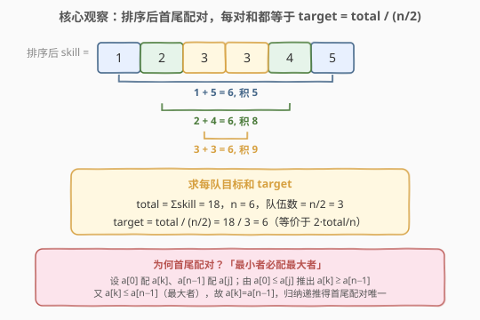
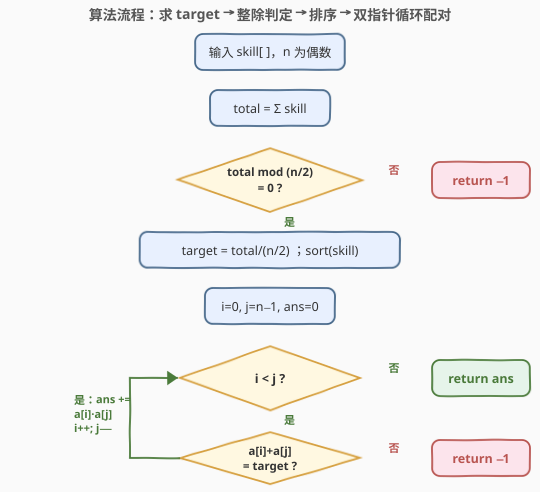

# LeetCode 划分技能点相等的团队 题解

## 1. 题目概述

- **标题 / 题号**：划分技能点相等的团队（#2491，medium）
- **链接**：https://leetcode.cn/problems/divide-players-into-teams-of-equal-skill/
- **难度**：中等
- **标签**：数组、排序、双指针、贪心

**题意**：给定长度为**偶数** $n$ 的正整数数组 `skill`，将其分成 $n/2$ 个 2 人团队，要求每个团队的技能点**之和相等**。团队的「化学反应」= 两名玩家技能点之**乘积**。返回所有团队化学反应之和；若无法等和划分，返回 $-1$。

**示例 1**：

```text
输入：skill = [3,2,5,1,3,4]
输出：22
解释：分 3 队 (1,5)、(2,4)、(3,3)，每队和都是 6。
     化学反应 = 1×5 + 2×4 + 3×3 = 5 + 8 + 9 = 22。
```

**示例 2**：

```text
输入：skill = [3,4]
输出：12
解释：两队一队，和为 7，化学反应 = 3×4 = 12。
```

**示例 3**：

```text
输入：skill = [1,1,2,3]
输出：-1
解释：总和 7，需 2 队各和 3.5，非整数；无法等和划分。
```

**约束**：

- $2 \le \text{skill.length} \le 10^5$，且长度为偶数
- $1 \le \text{skill}[i] \le 1000$

> 💡 关键约束是「**每队和相等**」：$n/2$ 队各自和为 $T$，则 $\sum \text{skill} = (n/2)\cdot T$，故 $T = \dfrac{\text{total}}{n/2} = \dfrac{2\cdot\text{total}}{n}$ **唯一确定**。整除性给出第一道快门——`total` 不被 $n/2$ 整除则直接 $-1$；否则目标 $T$ 已知，问题塌缩为「能否配出 $n/2$ 个和为 $T$ 的对」。

## 2. 解题思路

### 2.1 暴力思路：枚举配对方案

朴素地枚举所有「把 $n$ 人两两配对」的方案，总数是 $(n-1)!! = (n-1)(n-3)\cdots 1$，$n=10^5$ 时是天文数字，不可行。即便配对后逐一检验和相等，也挡不住方案爆炸。突破口在于认识到**目标 $T$ 唯一确定**，配对并非自由选择——**最小者必须配最大者**，配对方式被强约束，只需验证这一种（值意义上唯一的）配对。

### 2.2 核心观察：排序 + 首尾配对



将 `skill` **升序排序**后，让 $a[0]$ 配 $a[n-1]$、$a[1]$ 配 $a[n-2]$、……、$a[i]$ 配 $a[n-1-i]$。若存在合法等和划分，则这种首尾配对**必然**是（值意义上）唯一的合法配对。

**「最小者必配最大者」引理**：设升序 $a[0]\le\dots\le a[n-1]$，若存在「全部二元组和均为 $T$」的划分，则 $a[0]$ 必与 $a[n-1]$ 同组（按值）。

**证明**：设 $a[0]$ 与 $a[k]$ 同组（$a[0]+a[k]=T$），$a[n-1]$ 与 $a[j]$ 同组（$a[j]+a[n-1]=T$）。由 $a[0]$ 是最小值：$a[0]\le a[j]$。代入 $a[0]=T-a[k]$、$a[j]=T-a[n-1]$：

$$
T-a[k] \le T-a[n-1] \;\Longrightarrow\; a[k] \ge a[n-1].
$$

又 $a[k]\le a[n-1]$（$a[n-1]$ 最大），夹逼得 $a[k]=a[n-1]$（值相等）。即 $a[0]$ 的搭档值必为最大值，取下标 $n-1$ 配对合法；剩余 $a[1..n-2]$ 归纳同理，得首尾配对唯一。$\blacksquare$

> 💡 **为何要排序？** 引理依赖「最小」「最大」的极端性，只有排序后 $a[0]$、$a[n-1]$ 才是确定的极值。排序把任意顺序的输入规整成引理适用的形态，配对方式随即被「首尾相夹」锁死。

**算法**：

1. `total = Σ skill`；若 `total mod (n/2) != 0`，返回 $-1$（无法均分为整数目标和）；
2. `target = total / (n/2)`；排序 `skill`；
3. 双指针 `i=0`、`j=n-1` 逐对配对：若 `a[i]+a[j] != target` 返回 $-1$；否则 `ans += a[i]*a[j]`，`i++`、`j--`；
4. `i>=j` 时返回 `ans`。

### 2.3 算法流程图



两道判定门：第一道 **整除性**（`total` 能否被 $n/2$ 整除）直接排除非整数目标和；第二道 **逐对验和**（首尾配对和是否等于 `target`）排除「目标和合理但分布无法配对」的情形。两道门都通过，累加乘积即为答案。

### 2.4 示例演算

![示例演算：skill=[3,2,5,1,3,4] → 排序 [1,2,3,3,4,5]，target=6，配对累乘得 22](../images/divideplayers_example_walkthrough.svg)

`skill=[3,2,5,1,3,4]`，`total=18`、`n=6`、`n/2=3`、`target=6`。排序后首尾配对：$(1,5)\to 6\to 5$、$(2,4)\to 6\to 8$、$(3,3)\to 6\to 9$，每对都等于 6，`ans = 5+8+9 = 22`。

示例 3 `skill=[1,1,2,3]`：`total=7`、`n/2=2`，`7 mod 2 = 1 ≠ 0`，第一道门即挡下，返回 $-1$。

## 3. 参考代码

### C++

```cpp
class Solution {
public:
    long long dividePlayers(vector<int>& skill) {
        int n = skill.size();
        sort(skill.begin(), skill.end());
        long long total = accumulate(skill.begin(), skill.end(), 0LL);
        if (total % (n / 2) != 0) return -1;       // 无法均分为整数目标和
        long long target = total / (n / 2);         // 每队目标和
        long long ans = 0;
        for (int i = 0; i < n / 2; ++i) {
            int j = n - 1 - i;
            if (skill[i] + skill[j] != target) return -1;  // 首尾配对验和
            ans += (long long)skill[i] * skill[j];
        }
        return ans;
    }
};
```

> 💡 `total` 最大 $10^5\times 1000=10^8$，`int` 不溢出但用 `long long` 更稳；`ans` 最大 $\dfrac{n}{2}\times 1000^2\approx 5\times10^{10}$，**必须 `long long`**。`accumulate` 第三参数传 `0LL` 使累加在 `long long` 域进行，避免 `int` 累加溢出。

### Python

```python
class Solution:
    def dividePlayers(self, skill: List[int]) -> int:
        skill.sort()
        total = sum(skill)
        n = len(skill)
        if total % (n // 2) != 0:
            return -1
        target = total // (n // 2)
        ans = 0
        for i in range(n // 2):
            j = n - 1 - i
            if skill[i] + skill[j] != target:
                return -1
            ans += skill[i] * skill[j]
        return ans
```

> 💡 **免去整除判定的简写**：排序后直接令 `target = skill[0] + skill[-1]`（首对和即目标），循环里只验和，无需先算 `total` 与整除性。正确性相同——若所有对都等于首对和，自然满足「每队和相等」；若有对不等则返回 $-1$。两者等价，整除性判定只是把「不可能」更早暴露。面试中两种写法皆可，先算 `total` 的版本更能体现「目标和由总量唯一确定」的数学洞察：
>
> ```python
> class Solution:
>     def dividePlayers(self, skill: List[int]) -> int:
>         skill.sort()
>         target = skill[0] + skill[-1]
>         ans = 0
>         for i in range(len(skill) // 2):
>             if skill[i] + skill[-1 - i] != target:
>                 return -1
>             ans += skill[i] * skill[-1 - i]
>         return ans
> ```

## 4. 复杂度分析

| 维度 | 复杂度 | 说明 |
|------|--------|------|
| **时间复杂度** | $O(n\log n)$ | 排序主导；双指针单趟 $O(n)$，求和 $O(n)$ |
| **空间复杂度** | $O(\log n)$ | 排序的递归栈空间（原地排序，不计输出） |
| 算法瓶颈 | 排序 | $n=10^5$ 约 $1.7\times10^6$ 次比较，远低于时限 |
| 对照：值域计数 | $O(n+U)$ | $U=1000$ 值域，见第 5 节 |

> 💡 本题的 $O(n\log n)$ 实质被「排序规整出极值结构」消耗——一旦排好序，配对、验和、累乘都退化为线性单趟。值域 $U\le 1000$ 极小，可用计数法做到 $O(n+U)$，但常数与可读性优势有限，排序版是面试首选。

## 5. 扩展：值域计数法 $O(n+U)$ 与目标推导链

**值域计数法**：因 $\text{skill}[i]\in[1,1000]$ 值域极小，可用大小 $1001$ 的频次数组 `cnt` 代替排序，省去 $O(n\log n)$：

1. 统计每个值出现次数 `cnt[v]`，算 `total`、`target`（同样先判整除）；
2. 从小到大枚举 $v$，对 `cnt[v]>0` 者，搭档 $p=\text{target}-v$：
   - $p$ 越界（$<1$ 或 $>1000$）→ $-1$；
   - $v=p$（自配）→ 要求 `cnt[v]` 为偶数，贡献 $\text{cnt}[v]/2 \times v^2$；
   - $v\ne p$ → 要求 `cnt[v]==cnt[p]`，贡献 $\text{cnt}[v]\times v\times p$，并把 `cnt[p]` 清零避免重复计数；
3. 全部通过则返回累加和。

复杂度 $O(n+U)$，$U=1000$ 常数极小，但需仔细处理 $v=p$ 的自配偶数性与「只数一次」的去重，边界比排序版多、易写错。**面试推荐排序版**——代码极短、无需特判自配；仅当 $n$ 极大而 $U$ 极小、排序真成瓶颈时计数法才显优势。

**目标和的推导链**值得抽象为一类「等和划分」问题的通用入口：

$$
\underbrace{\text{「每队和相等」}}_{\text{约束}} \;\Longrightarrow\; \underbrace{T=\frac{\text{total}}{n/2}=\frac{2\cdot\text{total}}{n}}_{\text{目标和唯一}} \;\Longrightarrow\; \underbrace{\text{整除判定}+\text{配对可行性}}_{\text{两道门}}
$$

> 💡 这条「**总量÷组数=唯一目标和 → 整除快门 → 配对验和**」的链路，是 [416. 分割等和子集](https://leetcode.cn/problems/partition-equal-subset-sum/)（目标和=total/2）、[1011. 在 D 天内送达包裹的能力](https://leetcode.cn/problems/capacity-to-ship-packages-within-d-days/)（二分每份目标和）等题的共有骨架——都是从「总量反推每份目标和」起步，再判可行性。

## 6. 面试要点

1. **为什么最小者必配最大者？证明的关键一步？**

   > 关键是不等式：$a[0]\le a[j]$（$a[j]$ 是 $a[n-1]$ 的搭档，$a[0]$ 是最小值）。代入 $a[0]=T-a[k]$、$a[j]=T-a[n-1]$ 得 $T-a[k]\le T-a[n-1]\Rightarrow a[k]\ge a[n-1]$，而 $a[k]\le a[n-1]$（最大值），夹逼得 $a[k]=a[n-1]$。归纳递推即得首尾配对唯一。

2. **不排序直接哈希配对行吗？和排序版比有何取舍？**

   > 行。值域小时用频次数组 $O(n+U)$，值域大时用 HashMap。需处理 $v=p$ 自配的偶数性与去重，边界比排序版多。排序版 $O(n\log n)$ 代码极短、无需特判自配，是稳妥首选；只有当 $n$ 极大而 $U$ 极小、排序成为瓶颈时计数法才显优势。

3. **整除性判定是不是多余的？**

   > 不多余但可省。若 `total` 不被 $n/2$ 整除，目标和非整数，必然无解，提前 $-1$ 是早剪枝。若改用「首对和作 target」的写法，整除性由逐对验和隐式覆盖（不等的对会触发 $-1$），故可省去显式整除判定。两者等价，显式版更体现数学洞察。

4. **为何答案要用 `long long`？哪些量会溢出？**

   > `ans` 至多 $\dfrac{n}{2}\times 1000^2\approx 5\times10^{10}$，超 `int`（约 $2.1\times10^9$）。`total` 至多 $10^8$ 不溢出 `int`，但 `accumulate` 用 `0LL` 升 `long long` 更安全。单次乘积 `skill[i]*skill[j]` 至多 $10^6$ 不溢出，但累加到 `int` 会溢出，故 `ans`、`target` 计算都走 `long long`。

5. **数组有重复值（如示例 1 的两个 3）时证明还成立吗？**

   > 成立。证明按**值**进行：$a[k]=a[n-1]$ 是值相等，重复时下标可任选其一配对，不影响「$a[0]$ 搭档值=最大值」的结论。归纳对剩余子数组（值序列）继续适用，重复值不破坏首尾配对的结构。

> 💡 **一句话总结**：等和配对的目标 $T=2\cdot\text{total}/n$ 唯一确定；排序后「最小必配最大」使首尾配对成为唯一合法配对，双指针验和 $O(n\log n)$ 出解。

## 同类练习题

| # | 题目 | 与本题的关联 |
|---|------|-------------|
| 561 | [数组拆分](https://leetcode.cn/problems/array-partition/) | 排序后贪心配对（相邻配对取 min 求最大和），最直接的「排序+配对」原型，目标函数不同但骨架同源 |
| 1 | [两数之和](https://leetcode.cn/problems/two-sum/)（[题解](../0001-0100/1_两数之和.md)） | 在数组中找和为 target 的一对，哈希母题；本题是「全部配对且和都等于同一 target」的升级 |
| 2441 | [与对应负数同时存在的最大正整数](https://leetcode.cn/problems/largest-positive-integer-that-exists-with-its-negative/)（[题解](2441_与对应负数同时存在的最大正整数.md)） | 配 $v$ 与 $-v$（target=0 的特例），双指针/哈希均可，承接「按互补搭档配对」 |
| 2342 | [数位和相等数对的最大和](https://leetcode.cn/problems/max-sum-of-a-pair-with-equal-sum-of-digits/)（[题解](../2301-2400/2342_数位和相等数对的最大和.md)） | 按等值属性分组配对求最大和，对照「配对目标相等」的哈希分组思路 |
| 18 | [四数之和](https://leetcode.cn/problems/4sum/)（[题解](../0001-0100/18_四数之和.md)） | 排序+双指针配对求目标和，k-sum 家族模板，对照「固定目标和的多元组配对」 |
