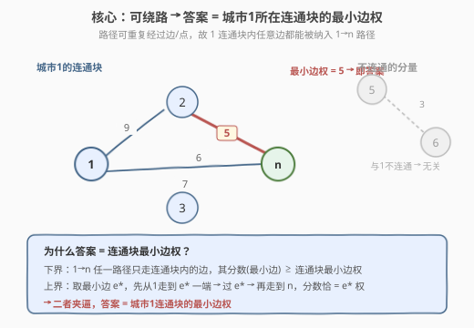
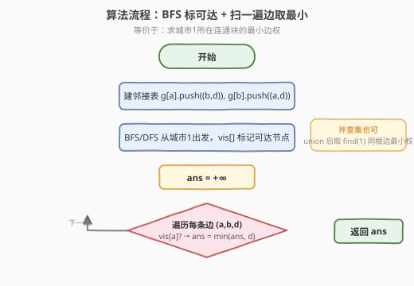
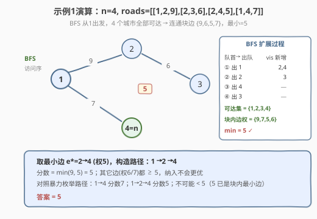

# LeetCode 两个城市间路径的最小分数 题解

## 1. 题目概述

- **标题 / 题号**：两个城市间路径的最小分数（#2492，medium）
- **链接**：https://leetcode.cn/problems/minimum-score-of-a-path-between-two-cities/
- **难度**：中等
- **标签**：图、广度优先搜索、并查集、连通分量

**题意**：给你正整数 `n` 表示 `n` 个城市（编号 `1` 到 `n`），以及二维数组 `roads`，其中 `roads[i] = [ai, bi, distancei]` 表示城市 `ai` 与 `bi` 之间有一条**双向**道路，距离为 `distancei`。图不一定连通。

一条路径的**分数**定义为该路径中道路的**最小**距离。返回城市 `1` 与城市 `n` 之间所有路径的**最小**分数。

> 注意：一条路径可**多次**包含同一条道路，也可多次到达城市 `1` 和 `n`；数据保证 `1` 与 `n` 之间至少有一条路径。

**示例 1**：

```text
输入：n = 4, roads = [[1,2,9],[2,3,6],[2,4,5],[1,4,7]]
输出：5
解释：路径 1 -> 2 -> 4 的分数是 min(9,5) = 5，不存在更小分数的路径。
```

**示例 2**：

```text
输入：n = 4, roads = [[1,2,2],[1,3,4],[3,4,7]]
输出：2
解释：路径 1 -> 2 -> 1 -> 3 -> 4 的分数是 min(2,2,4,7) = 2。
```

**约束**：

- $2 \le n \le 10^5$
- $1 \le \text{roads.length} \le 10^5$
- `roads[i].length == 3`
- $1 \le a_i, b_i \le n$，$a_i \ne b_i$
- $1 \le \text{distance}_i \le 10^4$
- 无重复边；城市 `1` 与 `n` 之间至少有一条路径。

## 2. 解题思路

### 2.1 暴力思路

枚举城市 `1` 到 `n` 的所有路径，对每条路径取最小边、再取全局最小。但路径可重复走边，路径数量本质是无穷的（可任意绕圈），暴力枚举不收敛、不可行。需要换一个视角：**什么样的边能出现在某条 1→n 路径里？**

### 2.2 核心观察：答案 = 城市1所在连通块的最小边权

关键在于题目允许**重复经过边和点**。这使得对任意一条"位于城市1连通块内的边"，都能被塞进某条 1→n 路径：

- 设该边为 $e^*$（权 $w^*$）。由于 $e^*$ 与城市1、城市n同属一个连通块，必存在：从1走到 $e^*$ 一端的路径 $P_1$、从 $e^*$ 另一端走到 n 的路径 $P_2$。
- 拼成路径 $P_1 \to e^* \to P_2$，它包含了 $e^*$，故该路径分数 $= \min(\text{路径边权}) \le w^*$；又因 $w^*$ 是连通块内最小边，路径中其它边权 $\ge w^*$，所以分数恰 $= w^*$。



于是由**夹逼**得：

- **下界**：任一 1→n 路径只走连通块内的边，其分数（路径最小边）$\ge$ 连通块最小边权。
- **上界**：取连通块最小边 $e^*$，按上面构造，分数 $= w^*$。

$$\boxed{\text{答案} = \min_{(a,b,d)\in \text{roads, } a \text{ 与 }1\text{ 连通}} d}$$

> 💡 与最短路问题本质区别：分数是路径的**最小边**而非边权之和，且允许绕路，所以"边权和"型的 Dijkstra 在此不适用、也不需要——问题已退化为连通块的最小边。

### 2.3 算法流程图

实现上只需两步：①从城市1出发 BFS/DFS 标记所有可达节点；②扫一遍所有边，若端点可达则用它更新答案。



> ⚠️ 判定边是否属于1的连通块时，无向边两端等价，只看 `vis[a]` 即可（`a` 可达 ⟺ `b` 可达 ⟺ 该边在块内）。题目保证 `1` 与 `n` 连通，故无需单独检查 `n` 是否可达——`n` 必在1的连通块内。

### 2.4 示例演算

以示例 1 `n=4, roads=[[1,2,9],[2,3,6],[2,4,5],[1,4,7]]` 为例：



BFS 从1出发：出1入2、4 → 出2入3 → 出4 → 出3，可达集 $\{1,2,3,4\}$（全部）。块内边权 $\{9,6,5,7\}$，最小 $=5$（边 2→4）。构造路径 `1→2→4`，分数 $\min(9,5)=5$，即答案。

## 3. 参考代码

### 方法一：BFS 标可达 + 扫边取最小（推荐）

### C++

```cpp
class Solution {
public:
    int minScore(int n, vector<vector<int>>& roads) {
        vector<vector<pair<int,int>>> g(n + 1);
        for (auto& r : roads) {
            g[r[0]].push_back({r[1], r[2]});
            g[r[1]].push_back({r[0], r[2]});
        }
        vector<char> vis(n + 1, 0);
        queue<int> q;
        vis[1] = 1; q.push(1);
        while (!q.empty()) {
            int u = q.front(); q.pop();
            for (auto& [v, d] : g[u]) {
                if (!vis[v]) { vis[v] = 1; q.push(v); }
            }
        }
        int ans = INT_MAX;
        for (auto& r : roads) {            // 无向边：vis[a] 可达即该边在1连通块内
            if (vis[r[0]]) ans = min(ans, r[2]);
        }
        return ans;
    }
};
```

### Python

```python
class Solution:
    def minScore(self, n: int, roads: List[List[int]]) -> int:
        from collections import deque, defaultdict
        g = defaultdict(list)
        for a, b, d in roads:
            g[a].append((b, d))
            g[b].append((a, d))
        vis = [False] * (n + 1)
        vis[1] = True
        q = deque([1])
        while q:
            u = q.popleft()
            for v, d in g[u]:
                if not vis[v]:
                    vis[v] = True
                    q.append(v)
        return min(d for a, b, d in roads if vis[a])
```

## 4. 复杂度分析

| 维度 | 方法 | 复杂度 | 说明 |
|------|------|--------|------|
| 时间复杂度 | BFS + 扫边 | $O(n + m)$ | 建图+遍历访问每点每边一次，再线性扫一遍 `roads` |
| 空间复杂度 | BFS + 扫边 | $O(n + m)$ | 邻接表存 `2m` 条有向边 + `vis` 数组 + 队列 |
| 时间复杂度 | 并查集 | $O((n + m)\,\alpha(n))$ | `union` 每条边 + 扫边取最小，近似线性 |
| 空间复杂度 | 并查集 | $O(n)$ | 仅需 `fa` 数组，无需建邻接表 |

> 💡 BFS 与并查集都是近线性，本题 `n,m ≤ 10^5` 两者都轻松通过。BFS 更直观且能自然承载"建图后遍历"的语义；并查集代码更短、无需建邻接表，适合边动态到来的场景。

## 5. 扩展：并查集解法

并查集把"1的连通块"用 `find(1)` 表示。先把所有边 `union` 起来，再扫一遍边，凡 `find(a) == find(1)` 的边都在1的连通块内，取其权最小即可。

### C++

```cpp
class Solution {
public:
    vector<int> fa;
    int find(int x) { return fa[x] == x ? x : fa[x] = find(fa[x]); }
    int minScore(int n, vector<vector<int>>& roads) {
        fa.resize(n + 1);
        iota(fa.begin(), fa.end(), 0);
        for (auto& r : roads) {
            int ra = find(r[0]), rb = find(r[1]);
            if (ra != rb) fa[ra] = rb;
        }
        int root1 = find(1);
        int ans = INT_MAX;
        for (auto& r : roads) {
            if (find(r[0]) == root1) ans = min(ans, r[2]);
        }
        return ans;
    }
};
```

### Python

```python
class Solution:
    def minScore(self, n: int, roads: List[List[int]]) -> int:
        fa = list(range(n + 1))
        def find(x):
            while fa[x] != x:
                fa[x] = fa[fa[x]]
                x = fa[x]
            return x
        def union(a, b):
            fa[find(a)] = find(b)
        for a, b, _ in roads:
            union(a, b)
        root1 = find(1)
        return min(d for a, b, d in roads if find(a) == root1)
```

> ⚠️ 注意必须在**全部 `union` 完成后**再用 `find(1)` 作为基准再扫一遍边，不能在 `union` 过程中提前判定——中途的 `find(1)` 会随合并变化。

## 6. 面试要点

**1. 为什么不用 Dijkstra / 最短路？**
- 本题分数是路径的**最小边**而非边权之和，且路径**可重复走边**。这把"最小化路径最小边"直接退化为"连通块最小边"，根本不需要松弛最短路。

**2. 为什么只从城市1做 BFS，不检查城市n？**
- 题目保证1与n至少有一条路径，即n必在1的连通块内。求1的连通块 ⟺ 求1与n的共同连通块，单独查n是冗余的。

**3. BFS 与并查集怎么选？**
- 两者都近线性。BFS 直观、建图后可顺带做后续查询；并查集代码短、空间只需 `fa`，适合边动态增删/多次连通查询场景。

**4. 如果路径不能重复走边，本题会变成什么？**
- 退化为"1→n 路径上的最小边尽量大"（瓶颈边问题），需用 Dijkstra 变体（按边权从大到小松弛，类似 [1631. 最小体力消耗路径](https://leetcode.cn/problems/path-with-minimum-effort/) 的并查集+排序或堆）求解，不再是简单的块内最小边。

**5. `vis[r[0]]` 判定边在块内的依据？**
- 边是无向的，`r[0]` 可达 ⟺ `r[1]` 可达 ⟺ 该边两端都在1的连通块内。判一端即可，避免重复判断。

## 同类练习题

| # | 题目 | 与本题的关联 |
|---|------|-------------|
| 1971 | [寻找图中是否存在路径](https://leetcode.cn/problems/find-if-path-exists-in-graph/) | 基础版连通判定，本题在此基础上多求"块内最小边" |
| 1631 | [最小体力消耗路径](https://leetcode.cn/problems/path-with-minimum-effort/) | 路径分数=最大边（minimax），对比本题分数=最小边（解法从并查集退化为连通块最小边） |
| 1319 | [连通网络的操作次数](https://leetcode.cn/problems/number-of-operations-to-make-network-connected/) | 并查集数连通块个数，同套连通分量思维 |
| 547 | [省份数量](https://leetcode.cn/problems/number-of-provinces/)（[题解](../0501-0600/547_省份数量.md)） | 并查集/DFS 数连通块母题 |
| 743 | [网络延迟时间](https://leetcode.cn/problems/network-delay-time/)（[题解](../0701-0800/743_网络延迟时间.md)） | 单源最短路（分数=边权之和型），与本题"分数=最小边"型形成对照 |
