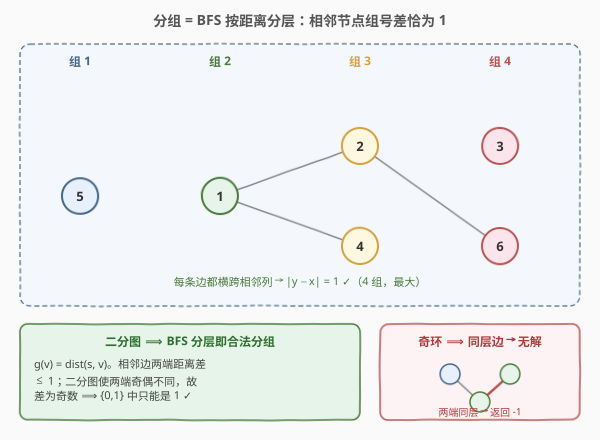
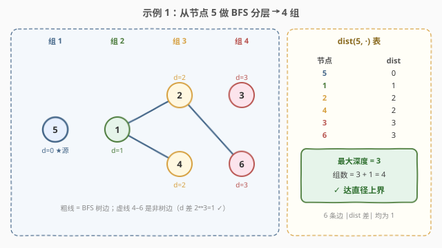

# LeetCode 将节点分成尽可能多的组 题解

## 1. 题目概述

- **标题 / 题号**：将节点分成尽可能多的组（#2493，hard）
- **链接**：https://leetcode.cn/problems/divide-nodes-into-the-maximum-number-of-groups/
- **难度**：困难
- **标签**：广度优先搜索、图、并查集、二分图

**题意**：给定一个有 `n` 个节点（编号 `1` 到 `n`）的**无向图**，以及边集 `edges`。图可能**不连通**。要求把所有节点划分为 `m` 个组（组号从 `1` 开始），满足：

- 每个节点恰好属于一个组；
- 对每条边 `[ai, bi]`，若 `ai` 在组 `x`、`bi` 在组 `y`，则 $|y - x| = 1$（两端组号**必须相邻**）。

返回**最大的** `m`；若无法分组返回 `-1`。

**核心约束解读**：「$|y-x|=1$ 对每条边成立」意味着组号沿任何边**必变化恰好 1**（不能不变、不能跳 2）。于是组号 $g(\cdot) \bmod 2$ 就是一个合法二着色——相邻节点奇偶必不同。这立刻给出必要性：**图必须是二分图（无奇环）**，否则无解返回 `-1`。

**示例 1**：

```text
输入：n = 6, edges = [[1,2],[1,4],[1,5],[2,6],[2,3],[4,6]]
输出：4
解释：组 1={5}，组 2={1}，组 3={2,4}，组 4={3,6}。每条边两端组号差恰为 1。
```

**示例 2**：

```text
输入：n = 3, edges = [[1,2],[2,3],[3,1]]
输出：-1
解释：1-2-3-1 是三角形（奇环），无法给相邻节点交替组号，无解。
```

**约束**：

- $1 \le n \le 500$
- $1 \le \text{edges.length} \le 10^4$
- $1 \le a_i, b_i \le n$，$a_i \ne b_i$，两点之间至多一条边

## 2. 解题思路

> 💡 **三句话抓住全貌**：① **必要性**——$|y-x|=1$ 强制 $g\bmod 2$ 为二着色，故图须是二分图，有奇环即 `-1`。② **合法性**——对二分图的任一源点 $s$，令 $g(v)=\text{dist}(s,v)$ 就是合法分组（相邻节点距离差恰为 1）。③ **最值**——每个连通分量的最大组数 = **直径 + 1**；各分量独立累加。

### 2.1 暴力思路

枚举所有「组号赋值」$g:V\to\{1,\dots,n\}$ 共 $n^n$ 种，对每种检查每条边是否 $|g(u)-g(v)|=1$，取满足条件的最大组数。$n=500$ 时完全不可行。

**优化方向**：把「赋值」问题转成「分层」问题。固定一个源点 $s$，令 $g(v)=\text{dist}(s,v)$——这就是一次 BFS。关键是要论证它在二分图里**天然合法**，且取对源点能**顶到直径上界**。

### 2.2 核心观察：BFS 按距离分层 = 合法分组，最大组数 = 直径 + 1



**① 必要性（二分图）**：对每条边 $|g(u)-g(v)|=1$，则 $g(u),g(v)$ 奇偶性不同，即 $g\bmod 2$ 是合法二着色 ⟹ 图是二分图 ⟹ **不含奇环**。所以先做一次 [785 式二着色 BFS](../0701-0800/785_判断二分图.md)：若某连通分量出现「同色相邻」即发现奇环，直接返回 `-1`。

**② 合法性（BFS 分层即合法）**：图是二分图后，**任取**源点 $s$，令 $g(v)=\text{dist}(s,v)$。对任意边 $(u,v)$：

- 相邻 ⟹ $|\text{dist}(s,u)-\text{dist}(s,v)|\le 1$（走一步至多差 1）；
- 二分图中 $\text{dist}(s,\cdot)\bmod 2$ 是合法二着色，相邻节点**奇偶不同**，故差为奇数；
- $\{0,1\}$ 中唯一的奇数是 $1$，故差**恰为 1** ✓。

> 💡 **关键洞察**：合法性不挑源点——二分图里从**任何**节点出发做 BFS 分层都合法！因为「相邻距离差 $\le 1$」+「奇偶不同」共同把差夹逼成恰好 1。于是合法分组有无穷多个，问题只剩「哪个源点能张出最多组」。

**③ 最值（直径 + 1）**：

- **上界**：对任意合法分组 $g$ 与任意两点 $u,v$，沿最短路每步组号变化 $\pm1$，共 $\text{dist}(u,v)$ 步，净变化 $|g(u)-g(v)|\le \text{dist}(u,v)\le \text{直径}$。于是组数 $m-1=\max|g(u)-g(v)|\le \text{直径}$，即 $m\le \text{直径}+1$。
- **可达**：取源点 $s$ 使其偏心率 $\max_v \text{dist}(s,v)=\text{直径}$（即 $s$ 是直径端点）。以 $g(v)=\text{dist}(s,v)$ 分层，最大组号恰为 $\text{直径}+1$，合法且顶到上界。

> ⚠️ **直径怎么算**：直径 $=\max_s \text{ecc}(s)=\max_s\max_v \text{dist}(s,v)$，即「枚举每个源点取最大 BFS 深度，再取最大」。注意树的「两次 BFS 找直径」技巧**对一般图不成立**（一般图需枚举所有源点）。本题 $n\le 500$，每个源一次 BFS，共 $O(n\cdot(n+E))\approx 5\times10^6$，绰绰有余。

**④ 不连通图**：不同连通分量之间**没有边**，$|y-x|=1$ 的约束只在分量内部生效。因此可把每个分量的分层各自**平移**到互不重叠的组号段（分量 1 用组 $1\ldots m_1$，分量 2 用 $m_1+1\ldots m_1+m_2$……），总组数 $=$ 各分量最大组数之和。

### 2.3 算法流程图


两阶段：

1. **阶段一（2 着色）**：遍历每个未染色节点，BFS 交替染 `0/1` 收集连通分量；遇「同色相邻」即奇环返回 `-1`。
2. **阶段二（求直径）**：对每个分量，枚举其中每个源点 $s$ 跑 BFS 取最大深度，分量内取最大 `best`，`ans += best + 1`。

### 2.4 示例演算



以示例 1（`n=6`）为例，二着色 BFS 先确认它是二分图（无奇环）。随后枚举源点：选源 $s=5$ 时 BFS 深度最大——

| 出队 $u$ | 入队邻居 | $\text{dist}(5,\cdot)$ | 组号 |
|----------|----------|------------------------|------|
| 5 | 1 | $5\to0$ | 1 |
| 1 | 2, 4 | $1\to1$ | 2 |
| 2 | 6, 3 | $2\to2$ | 3 |
| 4 | （6 已访问） | $4\to2$ | 3 |
| 6 | — | $6\to3$ | 4 |
| 3 | — | $3\to3$ | 4 |

最大深度 $=3$，组数 $=3+1=4$。验证 6 条边两端 `dist` 差均为 1（含非树边 $4\text{-}6$：$2$ 与 $3$ 差 1 ✓），故 4 组合法且为最大。

示例 2 是三角形（奇环），阶段一二着色时边 $1\text{-}3$ 两端同色冲突，直接返回 `-1`。

## 3. 参考代码

### C++

```cpp
class Solution {
public:
    int magnificentSets(int n, vector<vector<int>>& edges) {
        vector<vector<int>> g(n);
        for (auto& e : edges) {
            g[e[0] - 1].push_back(e[1] - 1);
            g[e[1] - 1].push_back(e[0] - 1);
        }

        // 阶段一：2 着色判定二分图 + 收集连通分量
        vector<int> color(n, -1);
        vector<vector<int>> comps;
        auto twoColor = [&](int start) -> bool {
            queue<int> q;
            q.push(start);
            color[start] = 0;
            vector<int> comp{start};
            while (!q.empty()) {
                int u = q.front(); q.pop();
                for (int v : g[u]) {
                    if (color[v] == -1) {
                        color[v] = color[u] ^ 1;
                        q.push(v);
                        comp.push_back(v);
                    } else if (color[v] == color[u]) {
                        return false;            // 同色相邻 = 奇环
                    }
                }
            }
            comps.push_back(move(comp));
            return true;
        };
        for (int i = 0; i < n; ++i)
            if (color[i] == -1 && !twoColor(i)) return -1;

        // 阶段二：每个分量枚举源点跑 BFS，取最大深度
        auto bfsDepth = [&](int s) -> int {
            vector<int> dist(n, -1);
            queue<int> q;
            dist[s] = 0; q.push(s);
            int depth = 0;
            while (!q.empty()) {
                int u = q.front(); q.pop();
                for (int v : g[u])
                    if (dist[v] == -1) {
                        dist[v] = dist[u] + 1;
                        depth = max(depth, dist[v]);
                        q.push(v);
                    }
            }
            return depth;
        };

        int ans = 0;
        for (auto& comp : comps) {
            int best = 0;
            for (int s : comp) best = max(best, bfsDepth(s));
            ans += best + 1;
        }
        return ans;
    }
};
```

### Python

```python
from collections import deque

class Solution:
    def magnificentSets(self, n: int, edges: List[List[int]]) -> int:
        g = [[] for _ in range(n)]
        for a, b in edges:
            g[a - 1].append(b - 1)
            g[b - 1].append(a - 1)

        # 阶段一：2 着色判定二分图 + 收集连通分量
        color = [-1] * n
        comps = []

        def two_color(start):
            q = deque([start])
            color[start] = 0
            comp = [start]
            while q:
                u = q.popleft()
                for v in g[u]:
                    if color[v] == -1:
                        color[v] = color[u] ^ 1
                        q.append(v)
                        comp.append(v)
                    elif color[v] == color[u]:
                        return None            # 同色相邻 = 奇环
            return comp

        for i in range(n):
            if color[i] == -1:
                comp = two_color(i)
                if comp is None:
                    return -1
                comps.append(comp)

        # 阶段二：每个分量枚举源点跑 BFS，取最大深度
        def bfs_depth(s):
            dist = [-1] * n
            dist[s] = 0
            q = deque([s])
            depth = 0
            while q:
                u = q.popleft()
                for v in g[u]:
                    if dist[v] == -1:
                        dist[v] = dist[u] + 1
                        depth = max(depth, dist[v])
                        q.append(v)
            return depth

        ans = 0
        for comp in comps:
            best = max(bfs_depth(s) for s in comp)
            ans += best + 1
        return ans
```

> 💡 **实现细节**：编号统一转 `0-indexed` 省心；`two_color` 返回 `None` 表示奇环（Python 里比抛异常更简洁）。阶段二的 BFS 只需记录 `depth`（最大 `dist`），无需保留整张距离表。

## 4. 复杂度分析

| 维度 | 复杂度 | 说明 |
|------|--------|------|
| 时间 | $O(n\cdot(n+E))$ | 阶段一二着色 $O(n+E)$；阶段二对每个源点 BFS，$n$ 个源各 $O(n+E)$，合计 $O(n(n+E))$ |
| 空间 | $O(n+E)$ | 邻接表 $O(E)$、`color`/`dist`/队列/分量列表各 $O(n)$ |
| 数据规模 | $n\le500,\ E\le10^4$ | $n(n+E)\approx500\times10500\approx5.3\times10^6$，远低于时限 |

> ⚠️ 若 $n$ 放大到 $10^5$，枚举每个源点的 $O(n^2)$ 不可行，需改用「树直径两次 BFS」——但那仅适用于**树**；一般图求直径本身没有低于 $O(n(n+E))$ 的简单精确算法，故本题 $n\le500$ 的规模是刻意为之。

## 5. 扩展：并查集判二分图与直径加速

**带权并查集判二分图**：把每个节点 $i$ 拆成「自身」$i$ 与「对立面」$i+n$，对每条边 $(u,v)$ 执行 `union(u, v+n)`、`union(v, u+n)`；若某条边处理前 `find(u)==find(v)` 即无法异色 → 非二分图。优势在「边动态加入、随时查询」的在线场景，与染色法本质等价（都等价于判定有无奇环），见 [785 扩展](../0701-0800/785_判断二分图.md)。

**为何不能两次 BFS 求直径**：树里两次 BFS 找直径依赖「从任意点出发的最远点必是直径端点」这一性质，它只在**无环图**（树）成立。一般图含环时，从某点出发的最远点不一定是直径端点。反例：一个「长链中部挂一个环」，从环上点出发的最远点可能是链端，但两次 BFS 跳来跳去未必命中真正的直径对。故一般图只能老老实实枚举所有源点。本题规模小，枚举即是正解。

**变体：求一种具体分组方案**：本题只问最大组数；若要输出方案，在阶段二找到最佳源点 $s^*$ 后，直接令 $g(v)=\text{dist}(s^*,v)$，再按连通分量顺序整体平移组号即可还原。

## 6. 面试要点

1. **为什么 $|y-x|=1$ 蕴含二分图？**

   取 $g\bmod 2$：相邻节点组号差为 1（奇数），故奇偶性不同，即 $g\bmod 2$ 是合法二着色。能二着色 ⟺ 二分图 ⟺ 无奇环。所以奇环必无解，返回 `-1`。

2. **为什么 BFS 分层一定是合法分组？**

   $g(v)=\text{dist}(s,v)$ 对相邻 $u,v$：差 $\le1$（走一步）；又二分图里相邻节点 $\text{dist}(s,\cdot)$ 奇偶不同，差为奇数。$\le1$ 的非负奇数只能是 1，故每条边两端组号差恰为 1。注意**合法性不挑源点**——这是后续「枚举源点找最大」的前提。

3. **最大组数为什么是直径 + 1？**

   上界：任意合法分组里最远两点组号差 $\le\text{dist}\le$ 直径，故 $m\le$ 直径 $+1$。下界（可达）：取直径端点 $s$ 为源做 BFS 分层，最大组号恰为直径 $+1$，合法且顶到上界。故每分量最大组数 $=$ 直径 $+1$。

4. **不连通图为什么是各分量组数之和？**

   分量间无边，$|y-x|=1$ 只约束同分量节点。把每个分量的分层各自平移到不重叠的组号段即可，总组数 $=\sum$ 各分量最大组数。所以是「加」不是「取最大」。

5. **为什么不能像树那样两次 BFS 求直径？**

   「从任意点出发的最远点必为直径端点」只在无环图（树）成立。一般图含环时该性质失效，两次 BFS 不保证命中直径对。本题 $n\le500$，枚举所有源点 $O(n(n+E))$ 足够，且这是一般图求直径的朴素精确做法。

6. **奇环判定和 [785] 是同一回事吗？**

   是。阶段一就是 [785 判断二分图](../0701-0800/785_判断二分图.md) 的二着色 BFS：相邻异色，遇同色相邻即奇环。本题只是在「判定」之上多了「二分图则求最大组数」一阶段。

## 同类练习题

| # | 题目 | 与本题的关联 |
|---|------|-------------|
| 785 | [判断二分图](https://leetcode.cn/problems/is-graph-bipartite/)（[题解](../0701-0800/785_判断二分图.md)） | 二着色判定二分图母题，本题阶段一的原型 |
| 886 | [可能的二分法](https://leetcode.cn/problems/possible-bipartition/)（[题解](../0801-0900/886_可能的二分法.md)） | 把「互相讨厌」当无向边判二分图，换皮练习二着色 |
| 2316 | [统计无向图中无法互相到达点对数](https://leetcode.cn/problems/count-unreachable-pairs-of-nodes-in-an-undirected-graph/)（[题解](../2301-2400/2316_统计无向图中无法互相到达点对数.md)） | 按连通分量分别处理，巩固「不连通图分量独立」思维 |
| 2204 | [无向图中到环的距离](https://leetcode.cn/problems/distance-to-a-cycle-in-undirected-graph/)（[题解](../2201-2300/2204_无向图中到环的距离.md)） | BFS 求各点到环的距离，对照本题「BFS 距离即组号」的分层用法 |
| 2360 | [图中的最长环](https://leetcode.cn/problems/longest-cycle-in-a-graph/)（[题解](../2301-2400/2360_图中的最长环.md)） | DFS 找有向图最长环，对比无向图奇环判定（长度奇偶决定能否二分） |
