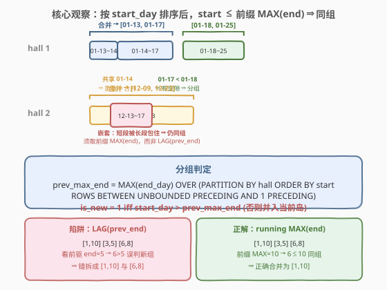
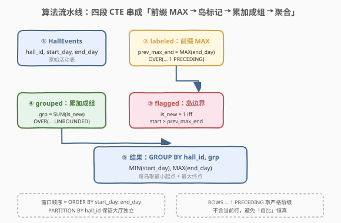
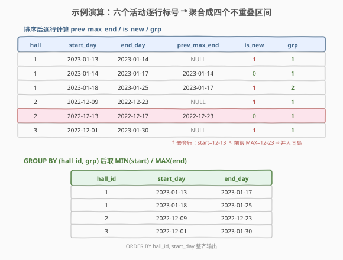

# LeetCode 合并在同一个大厅重叠的活动 题解

## 1. 题目概述

- **标题 / 题号**：合并在同一个大厅重叠的活动（#2494，hard）
- **链接**：https://leetcode.cn/problems/merge-overlapping-events-in-the-same-hall/
- **难度**：困难
- **标签**：数据库、SQL、窗口函数、`Gaps and Islands`、区间合并、`MAX OVER`、LeetCode 锁题

**题意**：给定 `HallEvents` 表，每行记录某个大厅（`hall_id`）里一场活动的起止日期（`start_day`、`end_day`，含端点）。编写解决方案，把**同一大厅内互相重叠的活动**合并成一条连续区间，返回 `hall_id`、合并后的 `start_day` 与 `end_day`，按 `hall_id`、`start_day` 升序排列。

**表结构**：

```text
Table: HallEvents
+-----------+------+
| Column Name | Type |
+-----------+------+
| hall_id   | int  |
| start_day | date |
| end_day   | date |
+-----------+------+
每一行表示某大厅里一场活动的起止日期（含端点）。
```

> ⚠️ **本题是 LeetCode Plus 会员锁题**，官方题面在站内需会员权限查看。本篇题面依据 LeetCode 公开接口（`mysqlSchemas` 与 `sampleTestCase`）还原：表结构、示例数据与题意「同大厅内重叠活动合并」即下文所示。区间端点**含端点**——两活动共享某日即视为重叠（与 [56. 合并区间](../0001-0100/56_合并区间.md) 的端点接触即重叠一致），故判定用 `start_day ≤ 已见 end_day 的前缀最大值`。若你以会员权限看到的边界与这里存在出入，请以官方为准，§5.2 给出严格的「不相邻才算重叠」的改法。

**示例 1**：

```text
输入：
HallEvents 表:
+---------+------------+------------+
| hall_id | start_day  | end_day    |
+---------+------------+------------+
| 1       | 2023-01-13 | 2023-01-14 |
| 1       | 2023-01-14 | 2023-01-17 |
| 1       | 2023-01-18 | 2023-01-25 |
| 2       | 2022-12-09 | 2022-12-23 |
| 2       | 2022-12-13 | 2022-12-17 |
| 3       | 2022-12-01 | 2023-01-30 |
+---------+------------+------------+

输出：
+---------+------------+------------+
| hall_id | start_day  | end_day    |
+---------+------------+------------+
| 1       | 2023-01-13 | 2023-01-17 |
| 1       | 2023-01-18 | 2023-01-25 |
| 2       | 2022-12-09 | 2022-12-23 |
| 3       | 2022-12-01 | 2023-01-30 |
+---------+------------+------------+

解释：
- hall 1：[01-13,01-14] 与 [01-14,01-17] 共享 01-14 ⇒ 重叠，合并为 [01-13,01-17]；
  [01-18,01-25] 与前者有空隙（01-17 < 01-18）⇒ 单独成段。
- hall 2：[12-09,12-23] 与 [12-13,12-17] 嵌套（短段被长段包住）⇒ 重叠，合并为 [12-09,12-23]。
- hall 3：仅一场活动，原样返回。
```

**约束条件**（依据公开接口与题意还原）：

- `hall_id` 为大厅编号，活动按大厅独立合并（不同大厅的活动互不影响）。
- `start_day ≤ end_day`，活动期含端点（占据 `start_day` 到 `end_day` 的每一天）。
- 同一 `hall_id` 下可能有多场活动，存在「端点相接」「短段嵌套长段」「长短交错」等排布。
- 结果返回 `hall_id`、`start_day`、`end_day` 三列，按 `hall_id`、`start_day` 升序排列。

> 💡 **审题关键**：① **按大厅独立合并**——`PARTITION BY hall_id`，不同大厅互不串味；② **含端点即重叠**——两活动共享某日就合并，判定用 `≤`（不是 `<`）；③ **嵌套也算重叠**——短段被长段包住属同一区间，关键是「已见 `end_day` 的前缀最大值」而非「前一行 `end_day`」；④ **要排序**——输出按 `hall_id`、`start_day` 升序，需 `ORDER BY`。

## 2. 解题思路

> 💡 **三句话抓住全貌**：① **化归**——本题主表是 [56. 合并区间](../0001-0100/56_合并区间.md) 的 SQL 版，按大厅分组、按 `start_day` 排序后用「前缀 MAX 划岛」。② **划岛**——一行的 `start_day` 若 $>$ 此前所有 `end_day` 的最大值（前缀 MAX），它就开启一个新岛；否则并入当前岛。③ **聚合**——把「岛号」`grp` 累加出来，按 `(hall_id, grp)` 分组取 `MIN(start_day)` / `MAX(end_day)` 即得合并区间。

### 2.1 暴力思路：两两比重叠 + 传递合并

最直觉的做法：对同一大厅的每两场活动判断是否重叠（共享某日），重叠则合并；因合并具有传递性（A–B 重叠、B–C 重叠 ⇒ A–B–C 同段），需反复扫描直到无变化，本质是过程式「并查集」。SQL 里直接两两自连接判重叠并传递合并极难写，且复杂度退化为 $O(n^3)$。

> 💡 突破口正是「传递性」本身：与其两两判重叠再传递，不如**先按 `start_day` 排序**——排序后，同一合并段内的活动必然**连续相邻**（中间不会插入别的段的活动）。于是问题塌缩为「线性扫描 + 维护当前段的右端点」，即经典的「合并区间」算法。在 SQL 中，这种「排序后划连续段」的标准范式就是 **`Gaps and Islands`（缺口与孤岛）**——用窗口函数找「岛边界」再累加成组号。

### 2.2 核心观察：前缀 MAX 划岛，LAG 会误判嵌套



排序后，一活动 $r_i = (s_i, e_i)$ 是否「开启新岛」取决于它**与此前所有活动构成的整体是否还有空隙**：

$$
r_i \text{ 开启新岛} \iff s_i > \max_{j<i} e_j \;=\;\text{prev\_max\_end}_i
$$

即当前 `start_day` 严格大于「此前所有 `end_day` 的前缀最大值」时，前面那段已封口、本行开新岛；否则并入当前岛。把「开岛」标记为 `is_new ∈ {0,1}`，再对它做前缀累加即得岛号 `grp`：

$$
\text{grp}_i \;=\; \sum_{j \le i} \text{is\_new}_j
$$

最后 `GROUP BY (hall_id, grp)` 取 `MIN(start_day)` 与 `MAX(end_day)` 即得每个合并区间。

**为什么必须用前缀 `MAX(end_day)` 而非 `LAG(prev_end)`？** 这是本题最大陷阱。`LAG(end_day)` 只看**上一行**的 `end_day`，当短段嵌套在长段中间时会被「误导」：

| 排序后活动 | `LAG(prev_end)` | `LAG` 判定 | 前缀 `MAX(end)` | `MAX` 判定 |
|------------|-----------------|------------|-----------------|------------|
| $[1, 10]$ | NULL | 开岛 ✓ | NULL | 开岛 ✓ |
| $[3, 5]$（短，嵌于长段内） | 10 | 并入 ✓ | 10 | 并入 ✓ |
| $[6, 8]$（仍嵌于长段内） | 5 | **$6>5$ → 误开新岛 ✗** | 10 | $6\le10$ → 并入 ✓ |

`LAG` 看到上一行 $[3,5]$ 的 `end=5`，以为「封口到 5」，于是 $[6,8]$ 误判开新岛——但它其实仍落在长段 $[1,10]$ 范围内。**前缀 `MAX` 始终记着此前见过的最大 `end_day`（10）**，所以不会被中间的短段「拉低」记忆。本题 hall 2 的 $[12\text{-}09,12\text{-}23]$ ⊃ $[12\text{-}13,12\text{-}17]$ 就是嵌套排布，须用前缀 MAX 才稳。

> 💡 **SQL 机制对应**：`MAX(end_day) OVER (PARTITION BY hall_id ORDER BY start_day, end_day ROWS BETWEEN UNBOUNDED PRECEDING AND 1 PRECEDING)` 正是「此前所有 `end_day` 的前缀最大值」（`1 PRECEDING` 排除当前行，避免「自比」恒真）。`SUM(is_new) OVER (PARTITION BY hall_id ORDER BY … ROWS UNBOUNDED PRECEDING)` 即「到本行止的累加岛号」。两者都用 `PARTITION BY hall_id` 保证大厅独立、用 `ORDER BY` 保证排序后划岛。

> ⚠️ **常见误区**：① 用 `LAG(end_day)` 判重叠，遇嵌套短段即错拆（见上表）；② 忘记 `PARTITION BY hall_id`，导致不同大厅的活动串到一起合并；③ 把「前缀 MAX」写成包含当前行的 `MAX(end_day) OVER (… ROWS UNBOUNDED PRECEDING)`，那样首行恒有 `prev_max_end = 自身 end`，`start ≤ 自身 end` 永真，永远不开新岛——故窗口帧须用 `… AND 1 PRECEDING` 排除当前行。

### 2.3 算法流程图



**逻辑执行步骤**：

| 步骤 | CTE | 作用 |
|------|-----|------|
| ① | `labeled` | 加列 `prev_max_end = MAX(end_day) OVER (PARTITION BY hall_id ORDER BY start_day, end_day ROWS … 1 PRECEDING)`，给每行补「此前 end 前缀最大值」 |
| ② | `flagged` | 加列 `is_new = CASE WHEN prev_max_end IS NULL OR start_day > prev_max_end THEN 1 ELSE 0 END`，标记岛边界 |
| ③ | `grouped` | 加列 `grp = SUM(is_new) OVER (PARTITION BY hall_id ORDER BY start_day, end_day ROWS UNBOUNDED PRECEDING)`，累加成岛号 |
| ④ | `SELECT … GROUP BY (hall_id, grp)` | 每岛取 `MIN(start_day)` / `MAX(end_day)`，输出合并区间 |

> 💡 **窗口帧两要点**：① `labeled` 用 `ROWS BETWEEN UNBOUNDED PRECEDING AND 1 PRECEDING`——严格排除当前行的前缀，否则首行「自比」恒真；② `grouped` 用 `ROWS UNBOUNDED PRECEDING`（含本行累加），让 `is_new=1` 的行把岛号 +1。两者 `PARTITION BY hall_id` + `ORDER BY start_day, end_day` 必须完全一致，否则前后两步次序错位。

### 2.4 示例演算

以示例 1 的 6 行为例，按 `(hall_id, start_day, end_day)` 排序后逐行标号：



| hall | start_day | end_day | prev_max_end | is_new | grp | 说明 |
|------|-----------|---------|--------------|--------|-----|------|
| 1 | 2023-01-13 | 2023-01-14 | NULL | 1 | 1 | 首行开岛 1 |
| 1 | 2023-01-14 | 2023-01-17 | 2023-01-14 | 0 | 1 | 01-14 ≤ 01-14 ⇒ 并入 |
| 1 | 2023-01-18 | 2023-01-25 | 2023-01-17 | 1 | 2 | 01-18 > 01-17 ⇒ 开岛 2 |
| 2 | 2022-12-09 | 2022-12-23 | NULL | 1 | 1 | 首行开岛 1 |
| 2 | 2022-12-13 | 2022-12-17 | 2022-12-23 | 0 | 1 | 12-13 ≤ 12-23（嵌套）⇒ 并入 |
| 3 | 2022-12-01 | 2023-01-30 | NULL | 1 | 1 | 首行开岛 1 |

最后按 `(hall_id, grp)` 分组取 `MIN/MAX`：

| hall_id | grp | MIN(start_day) | MAX(end_day) |
|---------|-----|----------------|--------------|
| 1 | 1 | 2023-01-13 | 2023-01-17 |
| 1 | 2 | 2023-01-18 | 2023-01-25 |
| 2 | 1 | 2022-12-09 | 2022-12-23 |
| 3 | 1 | 2022-12-01 | 2023-01-30 |

即示例输出 4 行。✓ 注意 hall 2 第 5 行的 `prev_max_end=2022-12-23` 正是前缀 MAX（长段的 end），而非上一行（此处上一行恰好就是长段，故 `LAG` 在此例侥幸正确）；但若长段后面跟着短段再跟一个仍落在长段内的活动（如 §2.2 表中的 $[1,10]、[3,5]、[6,8]$），`LAG` 即败，前缀 MAX 则稳。

## 3. 参考代码

### SQL（解法 A：前缀 MAX 划岛，推荐）

```sql
# Write your MySQL query statement below
WITH labeled AS (
    SELECT
        hall_id, start_day, end_day,
        MAX(end_day) OVER (
            PARTITION BY hall_id
            ORDER BY start_day, end_day
            ROWS BETWEEN UNBOUNDED PRECEDING AND 1 PRECEDING
        ) AS prev_max_end
    FROM HallEvents
),
flagged AS (
    SELECT
        hall_id, start_day, end_day,
        CASE WHEN prev_max_end IS NULL OR start_day > prev_max_end THEN 1 ELSE 0 END AS is_new
    FROM labeled
),
grouped AS (
    SELECT
        hall_id, start_day, end_day,
        SUM(is_new) OVER (
            PARTITION BY hall_id
            ORDER BY start_day, end_day
            ROWS UNBOUNDED PRECEDING
        ) AS grp
    FROM flagged
)
SELECT
    hall_id,
    MIN(start_day) AS start_day,
    MAX(end_day)   AS end_day
FROM grouped
GROUP BY hall_id, grp
ORDER BY hall_id, start_day;
```

> 💡 **写法要点**：
> - **三段 CTE 各司其职**：`labeled` 补前缀 MAX、`flagged` 标岛边界、`grouped` 累加成组号，层层叠加，意图清晰、便于调试。
> - **`prev_max_end` 的窗口帧**用 `ROWS BETWEEN UNBOUNDED PRECEDING AND 1 PRECEDING`：取严格在本行之前的所有行的 `end_day` 最大值（不含本行），避免首行「自比」恒真。
> - **`grp` 的窗口帧**用 `ROWS UNBOUNDED PRECEDING`（含本行累加），让每处 `is_new=1` 把岛号 +1。
> - 两个窗口的 `PARTITION BY hall_id ORDER BY start_day, end_day` **必须完全一致**，保证前后两步行次序对齐。
> - `ORDER BY start_day, end_day` 的 `end_day` 次级键保证完全相同时也确定次序，使窗口帧行为可复现。
> - 末尾 `GROUP BY hall_id, grp` 取 `MIN(start_day)/MAX(end_day)`，再 `ORDER BY hall_id, start_day` 满足输出顺序要求。

### SQL（解法 B：自连接找岛起点，无窗口函数）

若数据库不支持窗口函数（如旧版 MySQL），可用自连接找「岛起点」：一活动是岛起点 $\iff$ 不存在「同大厅里严格靠前且与它重叠」的活动。

```sql
WITH starts AS (
    -- 岛起点：同大厅内没有更早且重叠的活动
    SELECT a.hall_id, a.start_day, a.end_day
    FROM HallEvents a
    WHERE NOT EXISTS (
        SELECT 1 FROM HallEvents b
        WHERE b.hall_id = a.hall_id
          AND (b.start_day, b.end_day) < (a.start_day, a.end_day)
          AND b.start_day <= a.end_day          -- 更早的活动与本活动重叠
    )
),
merged AS (
    -- 每个岛起点把「与它连通且起点不早于它」的活动聚成一段
    SELECT s.hall_id,
           s.start_day,
           (SELECT MAX(e.end_day)
              FROM HallEvents e
             WHERE e.hall_id = s.hall_id
               AND e.start_day >= s.start_day
               AND e.start_day <= COALESCE(
                       (SELECT MIN(x.start_day) FROM starts x
                         WHERE x.hall_id = s.hall_id AND x.start_day > s.start_day),
                       '9999-12-31')) AS end_day
    FROM starts s
)
SELECT hall_id, start_day, end_day
FROM merged
ORDER BY hall_id, start_day;
```

> 💡 **解法 B 的取舍**：不依赖窗口函数，语义是「岛起点 + 相关子查询聚右端点」。但嵌套子查询复杂度偏高、可读性差，且对「相关子查询」的优化器依赖重。现代 MySQL 8.0+ 已支持窗口函数，工程首选解法 A；解法 B 仅作思路对照与老库兜底。

### Python（pandas）

```python
import pandas as pd

def merge_overlapping_events(hall_events: pd.DataFrame) -> pd.DataFrame:
    if hall_events.empty:
        return hall_events[['hall_id', 'start_day', 'end_day']]
    df = hall_events.sort_values(['hall_id', 'start_day', 'end_day']).reset_index(drop=True)
    prev_max_end = df.groupby('hall_id')['end_day'].cummax().shift()   # 前缀 MAX（排除当前行）
    is_new = (df['start_day'] > prev_max_end) | prev_max_end.isna()
    df['grp'] = is_new.astype(int).groupby(df['hall_id']).cumsum()     # 累加成岛号
    res = (df.groupby(['hall_id', 'grp'], as_index=False)
             .agg(start_day=('start_day', 'min'), end_day=('end_day', 'max'))
             .drop(columns='grp'))
    return res[['hall_id', 'start_day', 'end_day']].sort_values(['hall_id', 'start_day'])
```

> 💡 **pandas 对照**：`cummax().shift()` 等价 `MAX(end_day) OVER (… ROWS … 1 PRECEDING)`（前缀 MAX、不含当前行）；`is_new` 等价 `CASE … start > prev_max_end`，`.isna()` 处理首行；`.astype(int).cumsum()` 等价 `SUM(is_new) OVER (… UNBOUNDED)`。可作离线验证 SQL 结果之用。

## 4. 复杂度分析

| 维度 | 解法 A（窗口函数） | 解法 B（自连接） | pandas |
|------|--------------------|------------------|--------|
| **时间** | $O(n \log n)$ | $O(n^2)$（最坏） | $O(n \log n)$ |
| **空间** | $O(n)$ | $O(n)$ | $O(n)$ |
| **依赖** | MySQL 8.0+ 窗口函数 | 仅需子查询 | pandas |
| **推荐度** | ✓ 首选 | ✓ 老库兜底 | ✓ 验证用 |

> - $n$ = `HallEvents` 表行数。
> - **排序主导**：解法 A 的瓶颈是 `ORDER BY` 的 $O(n\log n)$；三个窗口函数各 $O(n)$ 扫描，故总体 $O(n\log n)$。
> - **划岛为何是 $O(n)$**：排序后只对每行做 $O(1)$ 的「前缀 MAX 比较 + 累加」，无需两两配对——这正是「先排序再线性归并」把 $O(n^3)$ 塌缩到 $O(n\log n)$ 的功臣。
> - **解法 B 退化**：`NOT EXISTS` 相关子查询最坏对每行扫一遍同大厅活动，$O(n^2)$；仅当无法用窗口函数时才考虑。
> - **输出规模**：结果行数 $\le n$（合并只会减行不会增行），$O(n)$ 空间即可承载。

## 5. 扩展

### 5.1 `Gaps and Islands` 范式家族

本题是 SQL **「缺口与孤岛」**范式在「区间合并」维度的招牌应用。该范式核心是「排序后用窗口函数找连续段」：

| 变体 | 连续判定 | 本题对应 |
|------|----------|----------|
| **等值连续**（如连续登录天数） | `当前值 = 前值 + 1` | —— |
| **区间重叠/合并**（本题） | `当前 start ≤ 前缀 MAX(end)` | ✓ |
| **相邻同行**（如连续同值段） | `当前值 = 前值` | —— |

共同骨架都是「找岛边界 $\to$ 累加岛号 $\to$ `GROUP BY` 聚合」。区间合并维度的特异点在于用**前缀 MAX** 而非「前值 +1」做连续判定，且必须排除当前行以防「自比」。

### 5.2 若「端点相接不算重叠」

若题面改为「两活动只在共享**多于端点**时才算重叠」（即 `start_day < prev_max_end` 严格小于），只需把 `flagged` 的判定从 `start_day > prev_max_end` 改为 `start_day >= prev_max_end`：

```sql
CASE WHEN prev_max_end IS NULL OR start_day >= prev_max_end THEN 1 ELSE 0 END AS is_new
```

此时 $[a,b]$ 与 $[b,c]$（仅共享端点 $b$）不再合并，各自成岛。本题依 [56. 合并区间](../0001-0100/56_合并区间.md) 的端点接触即重叠惯例，用 `>`（即判定并入用 `start ≤ prev_max_end`）。审题时看示例输出里「端点相接的两段是否合并」即可定夺。

### 5.3 输出具体合并方案的同款算法

本题输出合并后的区间。同一「前缀 MAX 划岛」骨架稍作改动即可产出别的统计：每岛的活动条数（`COUNT(*)`）、每岛最长单场活动（`MAX(end_day-start_day)`）、被合并的原行数等——只改末段 `GROUP BY` 后的聚合列即可，划岛逻辑不动。这是 `Gaps and Islands` 骨架的复用价值。

## 6. 面试要点

1. **为什么用前缀 `MAX(end_day)` 而非 `LAG(prev_end)`？**

   > 排序后，一活动是否落入当前合并段取决于「它的 `start_day` 是否 $\le$ 此前所有活动构成的整体右端点」，即前缀 `end_day` 的最大值。`LAG` 只看上一行的 `end_day`，当短段嵌在长段中间（如 $[1,10]、[3,5]、[6,8]$），`LAG` 看到 $[3,5]$ 的 `end=5`，误以为段已封口到 5，把仍落在 $[1,10]$ 内的 $[6,8]$ 误判开新岛。前缀 MAX 始终记着此前最大的 `end_day`（10），故稳。

2. **窗口帧为何用 `… AND 1 PRECEDING`？不加会怎样？**

   > `labeled` 的 `prev_max_end` 必须取**严格在本行之前**的行（`ROWS BETWEEN UNBOUNDED PRECEDING AND 1 PRECEDING`），排除当前行。若写成含本行的 `ROWS UNBOUNDED PRECEDING`，首行的 `prev_max_end` 等于自身 `end_day`，于是 `start_day ≤ 自身 end_day` 永真，永远 `is_new=0`，整张表被错并成一个岛。`grp` 那步则相反，要用含本行的累加（`UNBOUNDED PRECEDING`）让岛号在边界处 +1。

3. **为什么必须 `PARTITION BY hall_id`？**

   > 题目要求同大厅独立合并，不同大厅的活动不能串段。窗口函数加 `PARTITION BY hall_id` 后，每个大厅各自排序、各自维护前缀 MAX 与岛号，互不干扰；`grp` 也只在大厅内累加。漏掉它会把所有大厅的活动混到一张时间线上合并，出错。

4. **「端点相接算重叠」怎么体现？为何用 `>` 而非 `>=` 判开岛？**

   > 活动期含端点，$[a,b]$ 与 $[b,c]$ 共享 $b$ 这一天，故属重叠应合并。判定并入当前段用 `start_day ≤ prev_max_end`（$b ≤ b$ 成立 → 并入），等价地「开新岛」用 `start_day > prev_max_end`（严格大于）。这与 [56. 合并区间](../0001-0100/56_合并区间.md)「端点接触即重叠」一致。若题面要求严格不相邻才算重叠，把 `>` 改 `>=` 即可（§5.2）。

5. **`GROUP BY hall_id, grp` 为什么能取到合并区间？**

   > 同一 `(hall_id, grp)` 内的活动经「前缀 MAX 划岛」已被聚成一个连续可合并段（任一相邻对都满足 `start ≤ 前缀 MAX(end)`）。段的左端点 = 段内 `start_day` 的最小值（排序后即首行 `start_day`），右端点 = 段内 `end_day` 的最大值（被长段或后延段撑起）。故 `MIN(start_day)` / `MAX(end_day)` 恰得合并区间。

6. **这题与 [56. 合并区间] 是什么关系？**

   > 同一算法、两种载体。[56] 是数组版「按左端点排序 + 线性扫描维护当前段右端点」，$O(n\log n)$；2494 是 SQL 版，把「线性扫描维护右端点」翻译为「窗口函数算前缀 MAX + 累加岛号 + 分组聚合」，即 `Gaps and Islands` 范式。两者核心都是「先排序再线性归并」，且都用「端点接触即重叠」的 `≤` 判定。

> 💡 **一句话总结**：2494 是 SQL **区间合并招牌题**——`Gaps and Islands` 范式在「合并区间」维度的应用。考点四要素：**按大厅分区独立合并（`PARTITION BY`）、含端点即重叠（`≤` 判定）、嵌套须用前缀 `MAX(end)` 而非 `LAG`（避坑）、窗口帧排除当前行防自比（`1 PRECEDING`）**。最大陷阱：用 `LAG(prev_end)` 遇嵌套短段即错拆。

## 同类练习题

| # | 题目 | 与本题的关联 |
|---|------|-------------|
| 56 | [合并区间](https://leetcode.cn/problems/merge-intervals/)（[题解](../0001-0100/56_合并区间.md)） | 本题主表题，数组版「排序 + 线性扫描维护右端点」，对照 SQL 版「前缀 MAX + 划岛」的同构 |
| 1225 | [报告系统状态的连续日期](https://leetcode.cn/problems/report-contiguous-dates/) | `Gaps and Islands` 范式经典应用，对照本题「区间合并维度」与「等值连续维度」的同骨架异判定 |
| 603 | [连续空余座位](https://leetcode.cn/problems/consecutive-available-seats/) | 连续段合并入门，`LAG` 取前驱判相邻，对照本题「前驱判重叠」须升级为前缀 MAX 的差异 |
| 1285 | [找到连续区间的开始和结束数字](https://leetcode.cn/problems/find-the-start-and-end-number-of-continuous-ranges/) | 等值连续的「缺口与孤岛」招牌题，对照本题区间合并版的窗口帧与判定差异 |
| 57 | [插入区间](https://leetcode.cn/problems/insert-interval/)（[题解](../0001-0100/57_插入区间.md)） | 区间家族变体，在已排序区间里插入并合并，对照本题「无序列先排序再合并」的预处理差异 |
