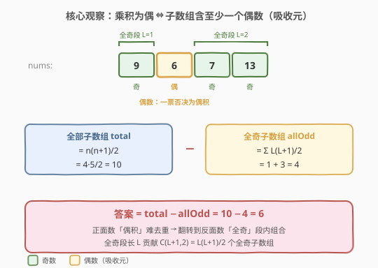
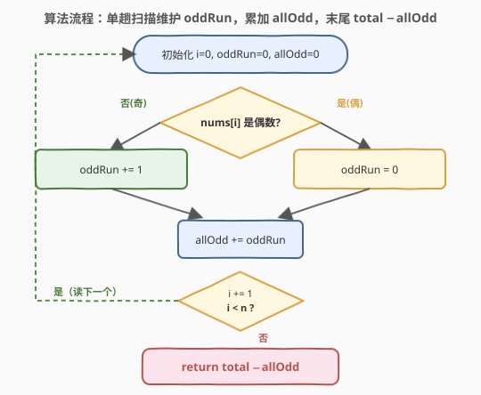

# LeetCode 乘积为偶数的子数组数 题解

## 1. 题目概述

- **标题 / 题号**：乘积为偶数的子数组数（#2495，medium）
- **链接**：https://leetcode.cn/problems/number-of-subarrays-having-even-product/
- **难度**：中等
- **标签**：数组、数学、动态规划、奇偶性化归、补集计数、LeetCode 锁题

**题意**：给定一个整数数组 `nums`，返回其中**乘积为偶数**的**非空连续子数组**的数目。

> ⚠️ **本题是 LeetCode Plus 会员锁题**，站内题面需会员权限查看。本篇题面依据 LeetCode 公开接口（`sampleTestCase = [9,6,7,13]`、题目标题与标签「数组 / 数学 / 动态规划」）还原：题意为「统计乘积为偶数的非空子数组数」。关键观察是**乘积的奇偶性只取决于子数组中是否含偶数因子**，与数值大小、正负号无关——故可把「求乘积」彻底化归为「数奇偶」。

**核心事实**：一个乘积为偶数 $\iff$ 至少有一个因子是偶数；一个乘积为奇数 $\iff$ 所有因子都是奇数。

**示例 1**：

```text
输入：nums = [9,6,7,13]
输出：6
解释：10 个非空子数组中，6 个乘积为偶（含偶数 6），4 个乘积为奇（全奇组成的子数组）。
```

10 个子数组逐个核对（✓ 表示乘积为偶）：

| 子数组 | 乘积 | 奇偶 | |
|--------|------|------|-|
| `[9]` | 9 | 奇 | ✗ |
| `[9,6]` | 54 | 偶 | ✓ |
| `[9,6,7]` | 378 | 偶 | ✓ |
| `[9,6,7,13]` | 4914 | 偶 | ✓ |
| `[6]` | 6 | 偶 | ✓ |
| `[6,7]` | 42 | 偶 | ✓ |
| `[6,7,13]` | 546 | 偶 | ✓ |
| `[7]` | 7 | 奇 | ✗ |
| `[7,13]` | 91 | 奇 | ✗ |
| `[13]` | 13 | 奇 | ✗ |

偶积子数组共 **6** 个，奇积子数组共 **4** 个（`[9]`、`[7]`、`[13]`、`[7,13]`，即全奇段 `[9]` 与 `[7,13]` 内部的全部子数组）。

**约束条件**（依据公开接口与题意还原）：

- $1 \le \text{nums.length} \le 10^5$
- `nums[i]` 为整数；其**符号与大小不参与判定**，只看二进制最低位（奇偶）
- 答案可达 $\dfrac{n(n+1)}{2} \approx 5\times 10^9$，**超出 32 位有符号整数上界**（$2{,}147{,}483{,}647$），C++ 需用 `long long`

> 💡 **审题关键**：① **只看奇偶**——乘积为偶 $\iff$ 含偶数因子，故不必真正相乘，只统计奇偶；② **补集转化**——「偶积子数组数 = 全部子数组数 − 全奇子数组数」，把正面计数翻转为反面计数，复杂度从 $O(n^2)$ 降为 $O(n)$；③ **答案要 64 位**——子数组总数是 $O(n^2)$ 量级，`int` 会溢出。

## 2. 解题思路

### 2.1 暴力思路：枚举子数组求乘积

最直觉的做法：枚举所有 $O(n^2)$ 个非空子数组，逐个累乘并判断乘积奇偶。两个致命问题：

- **时间** $O(n^2)$，$n = 10^5$ 时约 $5\times 10^9$ 次运算，超时；
- **溢出**：乘积随元素个数指数增长，几个 $10^9$ 级的数相乘立即超出 64 位范围，必须用大整数或提前取模——但取模会丢失「是否为偶」的判定信息（除非模 2）。

> 💡 突破口正是「溢出」本身：既然我们关心的只是乘积**奇偶性**，而奇偶性满足「全奇才奇，见偶即偶」，那么**根本不需要相乘**——一个子数组的乘积奇偶等价于「该子数组是否含至少一个偶数」。把「求乘积」化归为「数奇偶」，$O(n^2)$ 立即塌缩为 $O(n)$。

### 2.2 核心观察：补集计数——偶积 = 全部 − 全奇



设 $n = |\text{nums}|$，全部非空子数组数为

$$
\text{total} = \frac{n(n+1)}{2}.
$$

由「乘积为奇 $\iff$ 所有因子为奇」，**全奇子数组**恰是「全部由奇数组成的子数组」。把数组按偶数切分成若干**极大连续奇数段**，设各段长度为 $L_1, L_2, \dots, L_k$，则

$$
\text{allOdd} = \sum_{j=1}^{k} \frac{L_j(L_j+1)}{2}.
$$

于是答案

$$
\boxed{\;\text{ans} \;=\; \text{total} \;-\; \text{allOdd} \;=\; \frac{n(n+1)}{2} \;-\; \sum_{j} \frac{L_j(L_j+1)}{2}\;}
$$

> 💡 **为什么补集计数对？** 正面数「偶积子数组」要处理「含偶数」的复杂包含关系；反面数「全奇子数组」只需在连续奇数段内做 $\binom{L+1}{2}$ 的简单组合计数。正反两面一一对应、覆盖全集且不交，故 `偶积 = 全部 − 全奇`。这正是「难以正面数时翻转到反面」的招牌技巧——见 [1248. 统计「优美子数组」](../1201-1300/1248_统计优美子数组.md) 的 `exactly = atMost(K) − atMost(K−1)` 同源思想。

> ⚠️ **常见误区**：① 真的去算乘积再判奇偶，触发溢出与 $O(n^2)$ 双重灾难；② 误以为「偶积子数组数 = 含偶数的位置 × 某系数」——含偶数的位置之间的子数组会被重复计数，正面去重极易出错，故走补集。

### 2.3 算法流程图



**等价 DP 视角**（呼应标签「动态规划」）：令 $dp_i$ 表示**以 `nums[i]` 结尾、乘积为奇的子数组数**。

- 若 `nums[i]` 为偶：任何以 `i` 结尾的子数组都含这个偶数 → 乘积为偶，$dp_i = 0$；
- 若 `nums[i]` 为奇：以 `i` 结尾的奇积子数组 = 「以 $i-1$ 结尾的奇积子数组」再续接 `nums[i]`，加上单元素 `[nums[i]]` 自身，故 $dp_i = dp_{i-1} + 1$。

于是 $dp_i$ 即「以 `i` 结尾的当前连续奇数段长度」，$\text{allOdd} = \sum_i dp_i$。两种视角殊途同归：

| 视角 | 状态 | 转移 | 累积量 |
|------|------|------|--------|
| **组合计数** | 当前奇数段长 $L$ | 遇偶归零、遇奇 $+1$ | $\sum_j \binom{L_j+1}{2}$ |
| **动态规划** | $dp_i=$ 以 $i$ 结尾的奇积子数组数 | 偶→0；奇→$dp_{i-1}+1$ | $\sum_i dp_i$ |

两者恒等：第 $i$ 步的 $dp_i$ 正是当前奇数段到此位置的长度，$\sum_i dp_i = \sum_j (1+2+\dots+L_j) = \sum_j \tfrac{L_j(L_j+1)}{2}$。

### 2.4 示例演算

以 `nums = [9,6,7,13]` 为例（`O` 表奇数、`E` 表偶数）：

![示例演算：[9,6,7,13] 切分为奇数段 [9] 与 [7,13]，total=10、allOdd=4、ans=6](../images/evenprod_example_walkthrough.svg)

按偶数 `6` 把数组切成两段极大连续奇数段：

| 极大奇数段 | 长度 $L$ | 段内全奇子数组数 $\binom{L+1}{2}$ |
|-----------|----------|-----------------------------------|
| `[9]` | 1 | $1$（`[9]`） |
| `[7,13]` | 2 | $3$（`[7]`、`[13]`、`[7,13]`） |

故 $\text{allOdd} = 1 + 3 = 4$，$\text{total} = \tfrac{4\times 5}{2} = 10$，答案 $= 10 - 4 = \mathbf{6}$。

逐步 DP 表（`odd_run = dp_i`，`allOdd` 为其前缀和）：

| i | nums[i] | 奇偶 | odd_run(dp_i) | allOdd 累计 | 说明 |
|---|---------|------|---------------|-------------|------|
| 0 | 9 | O | 1 | 1 | 奇：续段，dp=0+1=1 |
| 1 | 6 | E | 0 | 1 | 偶：段中断，dp=0 |
| 2 | 7 | O | 1 | 2 | 奇：新段开始，dp=0+1=1 |
| 3 | 13 | O | 2 | 4 | 奇：续段，dp=1+1=2 |

$\text{allOdd} = 4$，$\text{ans} = 10 - 4 = 6$。✓

## 3. 参考代码

### C++（补集计数 · 单趟扫描）

```cpp
class Solution {
public:
    long long evenProduct(vector<int>& nums) {
        long long n = nums.size();
        long long total = n * (n + 1) / 2;
        long long oddRun = 0, allOdd = 0;
        for (int x : nums) {
            oddRun = (x & 1) ? oddRun + 1 : 0;   // 遇奇续段、遇偶归零
            allOdd += oddRun;                    // 累加以 i 结尾的全奇子数组数
        }
        return total - allOdd;
    }
};
```

> 💡 **写法要点**：
> - `long long`：`total` 可达 $\approx 5\times 10^9$，必须 64 位；`oddRun`/`allOdd` 同理。
> - `allOdd += oddRun`：第 $i$ 步「以 $i$ 结尾的全奇子数组数」恰为当前奇数段长度 `oddRun`，逐位累加即得全奇子数组总数，无需显式切段。
> - `x & 1` 取最低位判奇偶，等价于 `x % 2 != 0`，对负数同样成立（补码下最低位仍表征奇偶）。

### C++（DP 直接计数版）

正面直接数偶积子数组，无需补集翻转，思路等价：

```cpp
class Solution {
public:
    long long evenProduct(vector<int>& nums) {
        long long odd = 0, ans = 0;   // odd = 以当前位结尾的奇积子数组数
        for (int i = 0; i < (int)nums.size(); ++i) {
            odd = (nums[i] & 1) ? odd + 1 : 0;   // 偶：一锤定音，奇积结尾数清零
            ans += (i + 1) - odd;               // 以 i 结尾的子数组共 i+1 个，其中 odd 个为奇积
        }
        return ans;
    }
};
```

> 💡 **两版关系**：`ans = Σ[(i+1) − odd_i] = Σ(i+1) − Σ odd_i = total − allOdd`，与补集版代数恒等。补集版先算 `total` 再减 `allOdd`；DP 版逐位累加偶积数，省去 `total` 一步，但需要理解「以 $i$ 结尾共 $i+1$ 个子数组、其中 `odd` 个为奇积」。

### Python

```python
from typing import List

class Solution:
    def evenProduct(self, nums: List[int]) -> int:
        n = len(nums)
        total = n * (n + 1) // 2
        odd_run = all_odd = 0
        for x in nums:
            odd_run = odd_run + 1 if x & 1 else 0
            all_odd += odd_run
        return total - all_odd
```

> 💡 Python 整数任意精度，无需担心 `total` 溢出；逻辑与 C++ 补集版一致。

## 4. 复杂度分析

| 维度 | 复杂度 | 说明 |
|------|--------|------|
| 时间 | $O(n)$ | 单趟扫描，每个元素 $O(1)$ 处理（判奇偶 + 累加） |
| 空间 | $O(1)$ | 仅 `total`/`oddRun`/`allOdd` 三个变量，原地扫描 |
| 数据规模 | $n \le 10^5$ | $O(n) \approx 10^5$，远低于时限；答案量级 $\approx 5\times 10^9$ 需 64 位 |

> - **下界**：至少要读完整个数组才能确定所有奇数段，故 $O(n)$ 已是最优时间复杂度。
> - **溢出规避**：全程不计算乘积，只统计奇偶，从源头消除数值溢出；若题目改为「求乘积为某素数倍数」之类，则需前缀 + 同余（见 [974](../0901-1000/974_和可被K整除的子数组.md)）。

## 5. 扩展：奇偶性化归与乘积型子数组家族

### 5.1 「只看奇偶」的化归范式

本题能 $O(n)$ 解决，全靠把「乘积的奇偶性」这一**乘法性质**化归为「是否含偶数因子」这一**存在性判定**。化归的关键是性质满足：

- **封闭性**：奇 × 奇 = 奇（同类相乘保类）；偶 × 任意 = 偶（异类一票否决）。
- **吸收律**：偶数是「吸收元」，出现一个即定格为偶。

凡性质满足「全体同类才保类、一票否决」的，都能套同一补集计数：先数全同类段，再 `total − 全同类`。例如：

- 「子数组乘积为 5 的倍数」$\iff$ 含 5 的倍数因子 → 按非 5 倍数切段；
- 「子数组元素全为正」$\iff$ 不含非正数 → 按非正数切段。

### 5.2 若改为「乘积为奇」的子数组数

把题问翻转：求**全奇子数组数**，则无需补集，直接 $\sum_j \binom{L_j+1}{2}$。本题的 `allOdd` 中间量即是它的答案。可见「偶积」与「奇积」互为补集，互补相加等于 `total`。

### 5.3 乘积型子数组的三种问法对照

| 题目 | 问法 | 关键依赖 | 解法 |
|------|------|----------|------|
| **2495 偶积子数组数** | 计数 | 仅奇偶 | 补集计数 $O(n)$ |
| [152 乘积最大子数组](../0101-0200/152_乘积最大子数组.md) | 最值 | 正负号 + 大小 | 滚动 DP 维护 max/min（负负得正翻转） |
| [713 乘积小于 K 的子数组](../0701-0800/713_乘积小于K的子数组.md) | 计数 | 实际大小（正数） | 滑动窗口（正数单调性） |

> 💡 152 与 713 都**无法**只看奇偶——它们依赖乘积的真实数值（正负 / 与 $K$ 的大小关系），故需 DP 或滑窗维护实际乘积；2495 之所以能 $O(n)$ 裸扫，是因为「奇偶」是比「大小」粗得多的性质，可被存在性判定替代。

## 6. 面试要点

1. **为什么不用真算乘积？**

   > 乘积随元素数指数增长，几个 $10^9$ 相乘立即超 64 位；而题目只问奇偶，奇偶满足「全奇才奇、见偶即偶」，可被「是否含偶数因子」的存在性判定替代，$O(1)$ 判定代替 $O(n)$ 相乘，从源头消除溢出与超时。

2. **为什么用补集（total − allOdd）而非正面数？**

   > 正面数「偶积子数组」要处理含偶数位置的复杂包含与重复计数，极易错；反面「全奇子数组」只在连续奇数段内做 $\binom{L+1}{2}$ 的简单组合计数，干净不重不漏。正反一一对应、覆盖全集且不交，故 `偶积 = total − 全奇`。这是「难正面则翻反面」的招牌思路。

3. **奇数段长度 $L$ 贡献 $\binom{L+1}{2}$ 怎么来的？**

   > 长度 $L$ 的连续奇数段内，任选起点终点（起点 $\le$ 终点）即一个全奇子数组，共 $\binom{L}{1} + \binom{L}{2} = L + \tfrac{L(L-1)}{2}$？更直接地：起点有 $L$ 选、终点 $\ge$ 起点有 $L - \text{起点偏移}$ 选，求和 $= 1+2+\dots+L = \tfrac{L(L+1)}{2} = \binom{L+1}{2}$。

4. **`allOdd += oddRun` 为什么对？它和切段版等价吗？**

   > 第 $i$ 步的 `oddRun` 是「以 `i` 结尾的全奇子数组数」（= 当前奇数段到此位置的长度）。逐位累加 $\sum_i \text{oddRun}$ 恰为所有全奇子数组总数——因为每个全奇子数组唯一以其终点为标记被计入一次。它与「切段再 $\binom{L+1}{2}$」等价：$\sum_i \text{oddRun} = \sum_{\text{段 }j}(1+2+\dots+L_j) = \sum_j \tfrac{L_j(L_j+1)}{2}$。

5. **答案会不会溢出？C++ 用什么类型？**

   > 会。$n = 10^5$ 时 `total` $= \tfrac{n(n+1)}{2} \approx 5\times 10^9 > \text{INT\_MAX}\,(2{,}147{,}483{,}647)$。C++ 必须 `long long`；`total`、`allOdd`、返回值都要 64 位。Python 整数任意精度无需操心。面试中若被追问「最大答案是多少」，口算 $\tfrac{n(n+1)}{2}$ 即可定类型。

> 💡 **一句话总结**：2495 是**奇偶性化归 + 补集计数**招牌题——乘积为偶 ⇔ 含偶数因子，于是 `偶积子数组 = 全部子数组 − 全奇子数组`，单趟扫描维护奇数段长度即可 $O(n)/O(1)$。考点四要素：**只看奇偶（不算乘积避溢出）、补集翻转（难正面则反面）、奇数段组合计数（$\binom{L+1}{2}$）、64 位防溢出**。最大陷阱：真去算乘积触发溢出与 $O(n^2)$。

## 同类练习题

| # | 题目 | 与本题的关联 |
|---|------|-------------|
| 152 | [乘积最大子数组](https://leetcode.cn/problems/maximum-product-subarray/)（[题解](../0101-0200/152_乘积最大子数组.md)） | 乘积型子数组母题，但求最值需保留正负号（负负得正翻转），对照本题只看奇偶的粗粒度化归 |
| 713 | [乘积小于 K 的子数组](https://leetcode.cn/problems/subarray-product-less-than-k/)（[题解](../0701-0800/713_乘积小于K的子数组.md)） | 正数乘积滑窗计数，依赖乘积真实大小（单调性），对照本题只依赖奇偶存在性 |
| 1248 | [统计「优美子数组」](https://leetcode.cn/problems/count-number-of-nice-subarrays/)（[题解](../1201-1300/1248_统计优美子数组.md)） | 奇偶性相关子数组计数，`exactly(K)=atMost(K)−atMost(K−1)` 补集/差分转化，与本题 `偶积=全部−全奇` 同源 |
| 974 | [和可被 K 整除的子数组](https://leetcode.cn/problems/subarray-sums-divisible-by-k/)（[题解](../0901-1000/974_和可被K整除的子数组.md)） | 前缀 + 同余的子数组计数，对照本题「乘积奇偶」与「和的整除性」两种性质化归路径 |
| 560 | [和为 K 的子数组](https://leetcode.cn/problems/subarray-sum-equals-k/)（[题解](../0501-0600/560_和为K的子数组.md)） | 子数组计数家族经典，前缀和 + 哈希，对照本题「乘积性质」与「和的性质」计数框架差异 |
