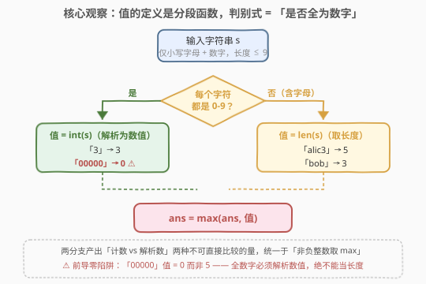
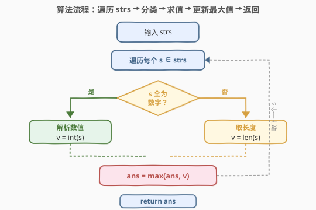
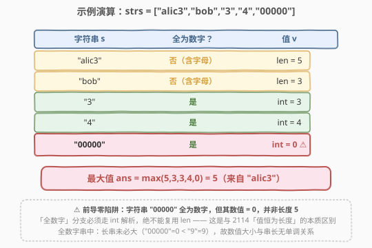

# 数组中字符串的最大值

- **题目名称**：数组中字符串的最大值
- **链接**：[2496. 数组中字符串的最大值](https://leetcode.cn/problems/maximum-value-of-a-string-in-an-array/)
- **难度**：简单
- **标签**：数组、字符串

## 1. 题目概述

一个由字母和数字组成的字符串的**值**定义如下：

- 如果字符串**只**包含数字，那么值为该字符串在 $10$ 进制下所表示的数字；
- 否则，值为字符串的**长度**。

给你一个字符串数组 `strs`，每个字符串都只由小写字母和数字组成，请你返回 `strs` 中字符串的**最大值**。

**示例 1**：

```text
输入：strs = ["alic3","bob","3","4","00000"]
输出：5
解释：
- "alic3" 包含字母和数字，所以值为长度 5。
- "bob" 只包含字母，所以值为长度 3。
- "3" 只包含数字，所以值为 3。
- "4" 只包含数字，所以值为 4。
- "00000" 只包含数字，所以值为 0。
所以最大的值为 5，是字符串 "alic3" 的值。
```

**示例 2**：

```text
输入：strs = ["1","01","001","0001"]
输出：1
解释：数组中所有字符串的值都是 1，所以返回 1。
```

**约束条件**：

- $1 \le \text{strs.length} \le 100$
- $1 \le \text{strs[i].length} \le 9$
- `strs[i]` 只包含小写英文字母和数字。

> 💡 本题是「**逐元素求值 → 取最大值**」骨架的签到题，与 [2114. 句子中的最多单词数](../2101-2200/2114_句子中的最多单词数.md) 共用同一套「扫描数组、对每个元素算一个标量、维护全局 max」的模板。差异在于**求值函数**：2114 的值恒为「单词数 $=$ 空格数 $+1$」，单调依赖于串长；而 2496 的值是一个**分段函数**——按「是否全为数字」分叉到「数值解析」或「取长度」两条支路。题眼的陷阱恰恰藏在这个分叉处：**前导零**让「全数字串」的数值与其长度失去单调关系（`"00000"` 值为 $0$ 而非 $5$），所以全数字分支**必须解析、不可取长度**。

---

## 2. 解题思路

### 2.1 暴力思路：先切分类型再两趟扫描

最直白的做法是分两趟：第一趟把 `strs` 按「全数字 / 含字母」分成两组；对全数字组逐个 `int()` 解析、对含字母组逐个取长度；最后在两组各自的最大值里取较大者。这种写法正确，但要把数组遍历两遍、且分配两组中间结构，纯属浪费——其实只需**一趟扫描**，对每个串当场算出它的值并立即更新全局 `ans` 即可。

> ⚠️ 更隐蔽的错误不在「两趟 vs 一趟」，而在**求值函数本身**：若误以为「全数字串的值就是它的长度」（套用 2114 的逻辑），则 `"00000"` 会被算成 $5$ 而非 $0$，样例 1 直接答错。这是本题最大的坑——**长度只对「含字母」的串成立，对「全数字」的串必须走数值解析**。

### 2.2 核心观察：值的定义是分段函数，判别式 = 「是否全为数字」



**关键洞察**：字符串的值 $v(s)$ 是一个**分段函数**，其**判别式**（discriminant）是「$s$ 是否全由数字字符 `0-9` 组成」：

$$
v(s) = \begin{cases} \text{int}(s) & \text{若 } s \text{ 全为数字} \\ |s| & \text{否则（含至少一个字母）} \end{cases}
$$

两条分支产出的是**两种不可直接类比的量**：一个是「解析出来的数值」（可大至 $999999999$），一个是「字符计数」（至多 $9$）。二者仅靠「都是非负整数」这一公共性统一于「取最大值」。这正是**和类型 / 带标签联合**（tagged union）的思路：判别式决定走哪个求值器，求值器各自独立、互不替代。

> 💡 **为什么不能对全数字串也取长度？** 因为全数字串允许**前导零**。`"00000"` 全为数字，但其十进制数值是 $0$，长度却是 $5$。约束 `strs[i]` 仅由小写字母和数字组成，**没有**禁止前导零（对照 [2042. 检查句子中的数字是否递增](../2001-2100/2042_检查句子中的数字是否递增.md) 显式保证「数字 token 无前导零」）。于是全数字分支的唯一正确求值方式是 `int(s)` ——它能天然吞掉前导零，把 `"00000"`、`"0"`、`"001"` 都归约为正确的数值 $0$、$0$、$1$。

#### 判别式的实现：逐字符判定「是否在 '0'..'9」

判别式「全为数字」等价于「**不存在**任何小写字母字符」。实现上两种等价写法：

- **否定式（短路更快）**：扫到第一个不在 `'0'`-`'9'` 的字符即断定「含字母、走长度分支」，$O(|s|)$ 最坏、平均更早停。
- **全称式**：`all('0' <= c <= '9' for c in s)` / `all_of(s.begin(), s.end(), ::isdigit)`，语义清晰。

> ⚠️ **Python 的 `str.isdigit()` 陷阱**：`isdigit()` 对部分 Unicode 数字字符（如上标 `'²'`、`'½'`）也返回 `True`。本题输入限定为 ASCII 小写字母与数字，故 `isdigit()` 安全；但工程代码里若输入来源不受控，应改用更严格的 `'0' <= c <= '9'` 显式 ASCII 判定，或 `s.isascii() and s.isdigit()`，避免把 `²` 当数字解析报错。本题解给出两种写法，面试中说明此区别即可加分。

### 2.3 算法流程图



单趟扫描 `strs`，对每个串 $s$：

1. **判别**：逐字符看是否全在 `'0'`-`'9'`；
2. **求值**：全数字 → `v = int(s)`；含字母 → `v = len(s)`；
3. **归约**：`ans = max(ans, v)`。

遍历结束 `ans` 即答案。每个串处理 $O(|s|)$（判别 + 解析各扫一遍，常数级），整体 $O(\sum |s|)$。

### 2.4 示例演算



以示例 1 `strs = ["alic3","bob","3","4","00000"]` 逐步演算：

| 字符串 $s$ | 全为数字？ | 求值 | $v$ |
|---|---|---|---|
| `"alic3"` | 否（含字母） | $\|s\| = 5$ | $5$ |
| `"bob"` | 否（含字母） | $\|s\| = 3$ | $3$ |
| `"3"` | 是 | $\text{int}(s) = 3$ | $3$ |
| `"4"` | 是 | $\text{int}(s) = 4$ | $4$ |
| `"00000"` | 是 ⚠️ | $\text{int}(s) = 0$ | $0$ |

逐元素更新 `ans`：$0 \to 5 \to 5 \to 5 \to 5 \to 5$，最终 `ans = 5`（来自 `"alic3"`）。

> 💡 **注意 `"00000"` 这一行**：它全为数字、长度为 $5$，但值是 $0$ 而非 $5$。若误用长度，`ans` 会被错误地抬到 $5$ 之上（这里恰好与正确答案相同，掩盖了 bug）；但在 `"00000"` 单独出现的用例（如 `["00000","9"]`）里，错误答案 $5$ 与正确答案 $9$ 不符，立即暴露。**前导零是检验「全数字分支是否真解析」的试金石**。

示例 2 `["1","01","001","0001"]` 四个串全为数字、且 `int` 后都是 $1$，故 `ans = 1`——这也印证了「全数字串长不决定值」。

---

## 3. 参考代码

### C++

```cpp
class Solution {
public:
    int maximumValue(vector<string>& strs) {
        int ans = 0;
        for (const string& s : strs) {
            bool allDigit = true;
            for (char c : s) {
                if (c < '0' || c > '9') { allDigit = false; break; }
            }
            int v = allDigit ? stoi(s) : (int)s.size();
            ans = max(ans, v);
        }
        return ans;
    }
};
```

> 💡 **数值范围核算**：`strs[i]` 长度 $\le 9$，全数字串数值上界为 $999999999 < 10^9$，远小于 32 位 `int` 上界 $\approx 2.1 \times 10^9$，故 `int` 安全、无需 `long long`。`stoi(s)` 天然跳过前导零，`"00000"` 解析为 $0$。判别循环遇到首个非数字字符即 `break`，平均比 `all_of` 略快（同阶）；若追求一行表达可写 `all_of(s.begin(), s.end(), ::isdigit)`。

### Python

```python
class Solution:
    def maximumValue(self, strs: List[str]) -> int:
        ans = 0
        for s in strs:
            v = int(s) if all('0' <= c <= '9' for c in s) else len(s)
            ans = max(ans, v)
        return ans
```

> 💡 **更简洁的 Python 写法**：把判别式收敛到一个生成器表达式，三元表达式一行搞定求值。`all(...)` 在第一个不满足处即短路返回 `False`，与 C++ 的 `break` 同效。若确认输入为纯 ASCII，`s.isdigit()` 也可用（更短但语义稍宽）；面试中推荐 `'0' <= c <= '9'` 以显式声明「ASCII 数字」约束，规避 Unicode 数字的歧义。
>
> ⚠️ `int(s)` 对全数字串（含前导零）正确解析；但若误把含字母串传给 `int()` 会抛 `ValueError`——故判别式必须先行，**先分类、后求值**的顺序不可颠倒。

---

## 4. 复杂度分析

| 维度 | 复杂度 | 说明 |
|------|--------|------|
| **时间** | $O\!\left(\sum_{s \in \text{strs}} |s|\right)$ | 每个串判别 + 求值各扫一遍，常数级；$n \le 100$、$\|s\| \le 9$，总操作 $\le 1800$ 次 |
| **空间** | $O(1)$ | 仅维护 `ans`、`v`、`allDigit` 三个标量，原地扫描无中间结构 |
| 对照：两趟分组 | $O(\sum |s|)$ | 同阶但常数翻倍 + 需 $O(n)$ 两组存储，无收益 |
| 对照：误用长度求值 | $O(\sum |s|)$ | 复杂度正确但**答案错误**（前导零），复杂度分析救不了语义 bug |

> 💡 本题无优化空间——$O(\sum |s|)$ / $O(1)$ 已是理论下界（至少要读完每个字符才能判定类型与值）。难点不在复杂度，而在**求值函数的正确性**：识别「前导零」陷阱、对全数字分支走解析而非取长度。

---

## 5. 扩展：值域上界与「数值 vs 长度」的支配关系

### 5.1 两条分支的值域

设 $L = |s| \le 9$：

- **含字母分支**：$v = L \in [1, 9]$。
- **全数字分支**：$v = \text{int}(s) \in [0,\ 10^{L}-1] \subseteq [0,\ 999999999]$。注意下界是 $0$（全零串），不是 $10^{L-1}$——因为允许前导零，`"0...0"` 的数值是 $0$。

### 5.2 何时「长度分支」永远不可能赢？

全数字串若**首位非零且长度 $\ge 2$**，则 $v \ge 10 > 9 \ge$ 任意长度分支的值。于是：

- 只要存在一个「首位非零、长度 $\ge 2$ 的全数字串」（如 `"12"`、`"999999999"`），全局最大值**必**落在全数字分支，长度分支只需扫到 $9$ 就可提前判定为败——但这一剪枝省下的仅是个位数比较，工程上不值得为此特判，直接统一 `max` 更清晰。

真正需要两条分支都认真求值的情形是：全数字串都是「长度 $1$」或「带前导零的短串」（值落在 $[0,9]$），与含字母串的长度（$[1,9]$）有交叠——此时二者都可能贡献最大值，必须都算。示例 1 正是这种情形：`"alic3"` 的长度 $5$ 击败了所有全数字串的值（$3,4,0$）。

> 💡 这条观察的价值不在剪枝（数据太小用不上），而在**理解题意**：它解释了为什么「全数字串」不是天然地比「含字母串」大或小——前导零把全数字串的值域下界压到 $0$，让两条分支的值域**完全交叠**于 $[0,9]$，从而任何分支都可能夺冠。这也正是题目刻意允许前导零的设计意图：**消解掉「数值天然大于长度」的偷懒捷径**，强制你必须真解析。

### 5.3 若值可能溢出（长串全数字）：不解析直接比较字符串

若把约束放宽为 `strs[i].length` 很大（如 $10^5$），全数字串数值会远超 `int` / `long long` 范围，`int(s)` 不可行。此时可用「**字符串字典序比较数值**」回避大数解析：两个无符号正整数字符串 $a, b$ 的数值大小 $=$ 先比「去前导零后的有效长度」（长则大），等长再逐字符字典序比较。本题 $L \le 9$ 用不到此技巧，但思路承接 [179. 最大数](../0101-0200/179_最大数.md) 的「把数值比较转为字符串比较」范式——那是把比较器从数值域迁移到字符串域的招牌题。

---

## 6. 面试要点

1. **为什么全数字串的值不能直接取长度？**

   > 题目允许全数字串带**前导零**：`"00000"` 全为数字但十进制值为 $0$，长度却是 $5$。若取长度会把值错算成 $5$。全数字分支必须走 `int(s)` 解析，前导零被天然吞掉。这是本题与 [2114](../2101-2200/2114_句子中的最多单词数.md)「值恒为长度」的本质差异，也是最容易踩的坑。

2. **如何判定「全为数字」？`isdigit()` 安全吗？**

   > 判定等价于「不存在小写字母字符」。Python 的 `str.isdigit()` 对部分 Unicode 字符（上标 `²`、分数 `½`）也返回 `True`，语义偏宽。本题输入限定 ASCII 小写字母 + 数字，故 `isdigit()` 安全可用；但若输入来源不受控，应改用显式 ASCII 判定 `'0' <= c <= '9'`（或 `s.isascii() and s.isdigit()`），避免把非 ASCII 数字传给 `int()` 报错。面试中点出此区别即可加分。

3. **数值会溢出吗？用什么类型？**

   > 不会。`strs[i]` 长度 $\le 9$，全数字串数值上界 $999999999 < 10^9$，远低于 32 位 `int` 上界 $\approx 2.1 \times 10^9$。故 C++ 用 `int`、`stoi()` 即可，无需 `long long`。`stoi` 天然跳过前导零。若放宽到超长串则需改用「字符串去前导零后比长度 + 字典序」回避大数，思路同 [179. 最大数](../0101-0200/179_最大数.md)。

4. **判别和求值的顺序能颠倒吗？**

   > 不能。必须**先分类、后求值**：先判定「是否全数字」决定走哪个求值器，再在该分支内调用 `int(s)` 或 `len(s)`。若反过来先 `int(s)` 再判别，含字母串会让 `int()` 抛 `ValueError`。判别式是求值器的**前置调度条件**，顺序颠倒会触发异常。

5. **和 2114「句子中的最多单词数」的骨架异同？**

   > 骨架相同：都是「扫描数组 → 对每个元素求一个标量值 → 维护全局 `max` → 返回」，$O(\sum |s|)$ / $O(1)$。差异在**求值函数**：2114 的值 $=$ 空格数 $+1$，与串长单调相关，无分叉；2496 的值是分段函数，按「全数字」判别式分叉到「解析」或「取长度」，且前导零让全数字分支的值与其长度失去单调关系。换言之，2114 是「**单值函数**」、2496 是「**带判别式的分段函数**」——后者多了一层「分类调度」的考 点。

> 💡 **一句话总结**：2496 = 「逐元素求值取 max」骨架 + 「全数字？int : len」分段求值函数。题眼在前导零——它让全数字分支必须真解析、不可偷懒取长度，把一道模板题变成了「分类调度的正确性」检验。

---

## 7. 同类练习题

- [2114. 句子中的最多单词数](https://leetcode.cn/problems/maximum-number-of-words-found-in-sentences/)（[题解](../2101-2200/2114_句子中的最多单词数.md)）：同「逐元素求值取 max」骨架，但值恒为「空格数 $+1$」单值函数，对照本题的分段求值与前导零陷阱
- [2042. 检查句子中的数字是否递增](https://leetcode.cn/problems/check-if-numbers-are-ascending-in-a-sentence/)（[题解](../2001-2100/2042_检查句子中的数字是否递增.md)）：从 token 流识别数字串并解析比较，显式保证「无前导零」——对照本题「允许前导零」的处理差异
- [1880. 检查某单词是否等于两单词之和](https://leetcode.cn/problems/check-if-word-equals-summation-of-two-words/)（[题解](../1801-1900/1880_检查某单词是否等于两单词之和.md)）：把单词视作字母到数位的十进制数解析，同属「字符串 ⇄ 数值」映射家族
- [1946. 子字符串突变后可能得到的最大整数](https://leetcode.cn/problems/largest-number-after-mutating-substring/)（[题解](../1901-2000/1946_子字符串突变后可能得到的最大整数.md)）：逐位映射变更数字串使其数值最大，对照「数值最大化」目标下的字符串逐位贪心
- [179. 最大数](https://leetcode.cn/problems/largest-number/)（[题解](../0101-0200/179_最大数.md)）：把数值比较迁移到字符串字典序域，承接第 5 节「超长串回避大数解析」的思路延伸
