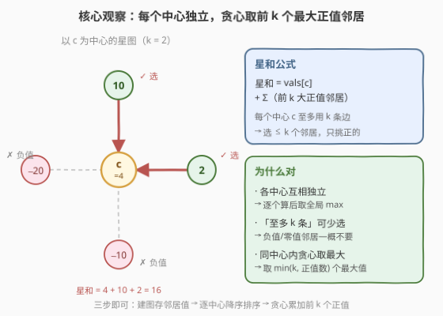
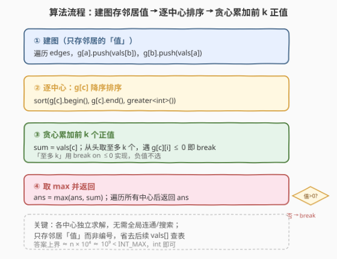
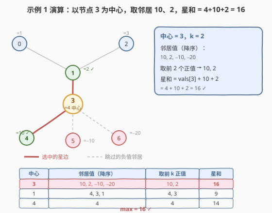

# LeetCode 图中最大星和 题解

## 1. 题目概述

- **标题 / 题号**：图中最大星和（#2497，medium）
- **链接**：https://leetcode.cn/problems/maximum-star-sum-of-a-graph/
- **难度**：中等
- **标签**：贪心、图、数组、排序、堆（优先队列）

**题意**：给定一个 `n` 个节点的无向图，节点编号 `0` 到 `n-1`，`vals[i]` 表示第 `i` 个节点的值。同时给定边数组 `edges`，`edges[i] = [ai, bi]` 表示 `ai`、`bi` 间一条双向边。

**星图**是图中的一个子图：一个**中心节点**加上 `0` 个或多个**邻居**，即这些边都有一个公共节点（中心）。**星和** = 星图中所有节点值之和。给定整数 `k`，返回**至多包含 `k` 条边**的星图中的**最大星和**。

**示例 1**：

```text
输入：vals = [1,2,3,4,10,-10,-20], edges = [[0,1],[1,2],[1,3],[3,4],[3,5],[3,6]], k = 2
输出：16
```

最大星图以节点 `3` 为中心，邻居取 `1`、`4`，星和 = `vals[3] + vals[1] + vals[4] = 4 + 2 + 10 = 16`。

**示例 2**：

```text
输入：vals = [-5], edges = [], k = 0
输出：-5
```

只有一个节点，`k=0` 不取任何邻居，星和就是 `vals[0] = -5`。

**约束**：

- $1 \le n \le 10^5$
- $-10^4 \le \text{vals}[i] \le 10^4$
- $0 \le \text{edges.length} \le \min(n(n-1)/2,\ 10^5)$
- $0 \le k \le n - 1$

> 💡 题目本质：星图完全由「一个中心 + 它的至多 k 个邻居」确定，**与图的全局连通性无关**。因此对每个中心 `c`，只需在它自己的邻居集合里挑「至多 k 个、且能让和变大的」邻居，挑完取全局最大即可——无需 BFS/DFS 或并查集。

## 2. 解题思路

### 2.1 暴力思路：枚举中心 + 邻居子集

最朴素的做法：枚举每个中心 `c`，再枚举它的邻居子集（大小 $\le k$），计算星和取最大。但邻居子集数量是组合数 $C(\deg, k)$，最坏 $\deg$ 很大时指数级爆炸，不可行。

> ⚠️ 瓶颈在于把「选邻居」当成**子集枚举**。实际上要让星和最大，邻居该不该选只取决于它的**值**：值正就加分、值负就减分，且同中心内**选谁互不冲突**（每个邻居贡献独立的一条边）。因此「选子集」可以降为「按值贪心」。

### 2.2 核心观察：每中心独立 + 只取正值 + 贪心取最大



三个关键事实把问题化为「逐中心局部贪心」：

1. **各中心互相独立**：一个星图只涉及一个中心 `c` 及其邻居。不同中心的候选邻居集合不重叠（以 `c` 为中心），彼此**不共享边**。因此对每个 `c` 独立求最大星和，最后取全局 $\max$ 即可——无需全局搜索。
2. **「至多 k 条」可少选 → 只挑正值**：题目允许星图含 `0` 到 `k` 条边。多选一个邻居当且仅当它能让和变大，即**邻居值 $> 0$** 才选；负值/零值邻居只会拉低和，一律不选。
3. **同中心内贪心取最大**：在正值邻居中选至多 `k` 个使和最大，显然取**最大的 $\min(k, \text{正值数})$ 个**。把邻居值降序排序，从头累加正值，取满 `k` 个或遇到 $\le 0$ 即停。

对中心 `c` 的最大星和：

$$\text{star}(c) = \text{vals}[c] + \sum_{i=1}^{\min(k,\,m)} \max(0,\, \text{第 } i \text{ 大的邻居值})$$

其中 $m$ 为 `c` 的邻居数。最终答案：

$$\text{ans} = \max_{c} \text{star}(c)$$

> 💡 **为什么只存邻居的「值」而非编号？** 邻居是否被选中、贡献多少，只看它的 `vals`。所以建图时直接把 `vals[邻居]` 塞进 `g[c]`，后续无需再查 `vals[]`，省一次间接寻址，代码也更短。

### 2.3 算法流程图



四步骨架：

1. **建图**：遍历 `edges`，`g[a].push(vals[b])`、`g[b].push(vals[a])`，只存邻居的值。
2. **逐中心排序**：对 `g[c]` 降序排序，把最大正值排到最前。
3. **贪心累加**：`sum = vals[c]`；从头取至多 `k` 个，遇 `g[c][i] <= 0` 即 `break`。
4. **取 max 返回**：`ans = max(ans, sum)`，遍历完所有中心返回 `ans`。

### 2.4 示例演算

以示例 1 `vals = [1,2,3,4,10,-10,-20]`, `edges = [[0,1],[1,2],[1,3],[3,4],[3,5],[3,6]]`, `k = 2` 为例。



**第 1 步：建图（只存邻居值）**

```text
g[0] = [2]              (邻居 1，值 2)
g[1] = [1, 3, 4]        (邻居 0/2/3，值 1/3/4)
g[2] = [2]              (邻居 1，值 2)
g[3] = [2, 10, -10, -20](邻居 1/4/5/6，值 2/10/-10/-20)
g[4] = [4]              (邻居 3，值 4)
g[5] = [4]              (邻居 3，值 4)
g[6] = [4]              (邻居 3，值 4)
```

**第 2 步：逐中心降序排序 + 贪心取前 k 正值**

| 中心 | 邻居值（降序） | 取前 $k=2$ 正值 | 星和 |
|------|----------------|------------------|------|
| 0 | 2 | 2 | 1 + 2 = 3 |
| 1 | 4, 3, 1 | 4, 3 | 2 + 4 + 3 = 9 |
| 2 | 2 | 2 | 3 + 2 = 5 |
| 3 | 10, 2, −10, −20 | 10, 2 | 4 + 10 + 2 = **16** |
| 4 | 4 | 4 | 10 + 4 = 14 |
| 5 | 4 | 4 | −10 + 4 = −6 |
| 6 | 4 | 4 | −20 + 4 = −16 |

**第 3 步：取全局最大**

$$\max\{3, 9, 5, 16, 14, -6, -16\} = 16 \quad \checkmark$$

与示例输出一致。注意中心 `3` 有 4 个邻居，但 `k=2` 只取最大的两个正值 `10`、`2`，负值 `−10`、`−20` 直接跳过；中心 `5`、`6` 自身值为负，但单个邻居 `4` 是正的，所以仍选它把和抬高到 `−6`、`−16`（比单取自身 `−10`、`−20` 更优）。

> 💡 **边界**：`k=0` 时每个中心一个邻居都不选，星和 = `vals[c]`，答案 = $\max_c \text{vals}[c]$（示例 2 即如此）。`edges` 为空时同理，每个节点孤立取自身值。

## 3. 参考代码

### C++

```cpp
class Solution {
public:
    int maxStarSum(vector<int>& vals, vector<vector<int>>& edges, int k) {
        int n = vals.size();
        vector<vector<int>> g(n);                 // g[c] 存中心 c 各邻居的「值」
        for (auto& e : edges) {
            g[e[0]].push_back(vals[e[1]]);        // 双向：互为邻居
            g[e[1]].push_back(vals[e[0]]);
        }
        int ans = INT_MIN;
        for (int c = 0; c < n; ++c) {
            sort(g[c].begin(), g[c].end(), greater<int>());  // 邻居值降序
            int sum = vals[c];                     // 中心必选
            for (int i = 0; i < (int)g[c].size() && i < k; ++i) {
                if (g[c][i] <= 0) break;          // 非正值不再加（"至多 k" 可少选）
                sum += g[c][i];
            }
            ans = max(ans, sum);
        }
        return ans;
    }
};
```

### Python

```python
class Solution:
    def maxStarSum(self, vals: List[int], edges: List[List[int]], k: int) -> int:
        n = len(vals)
        g = [[] for _ in range(n)]               # g[c] 存中心 c 各邻居的「值」
        for a, b in edges:
            g[a].append(vals[b])                 # 双向：互为邻居
            g[b].append(vals[a])

        ans = -10 ** 18
        for c in range(n):
            g[c].sort(reverse=True)              # 邻居值降序
            s = vals[c]                           # 中心必选
            for v in g[c][:k]:
                if v <= 0:                        # 非正值不再加
                    break
                s += v
            ans = max(ans, s)
        return ans
```

> 💡 **「至多 k」的实现**：循环条件 `i < k` 保证最多取 `k` 个；`break on ≤ 0` 保证只取正值。二者合起来即「至多 k 条边、且只挑正贡献邻居」。`g[c][:k]` 在 Python 里切片天然限制长度，配合 `break` 即可。

## 4. 复杂度分析

| 维度 | 贪心排序解 | 枚举邻居子集 |
|------|-----------|--------------|
| **时间复杂度** | $O(n + \sum_c \deg(c)\log\deg(c)) \le O(n + E\log D)$，$D$ 为最大度数 | 组合数级，最坏 $O(C(D,k))$ |
| **空间复杂度** | $O(n + E)$（邻接表存值，共 $2E$ 条） | — |
| **关键化简** | 邻居贡献独立 → 按值排序取前 k 正值，降子集枚举为排序 | 未利用「选邻居互不冲突」 |

> ⚠️ 答案上界：一个中心至多取 $k \le n-1$ 个邻居，每个值 $\le 10^4$，星和 $\le 10^4 + (n-1)\times 10^4 \approx 10^9 < \text{INT\_MAX}\,(2.1\times10^9)$，故 C++ 用 `int` 即可（对照 [2477](./2477_到达首都的最少油耗.md) 在 `seats=1` 时需 `long long`）。排序总代价 $O(E\log D)$：所有节点的邻居列表长度之和为 $2E$，每个列表排序 $\deg\log\deg$，由 $\sum\deg=2E$ 与凸性可放缩到 $O(E\log D)$，$E\le10^5$ 完全可过。

## 5. 扩展：top-k 选择的优化与贪心正确性

### 5.1 不必整体排序：堆 / nth_element 取前 k

我们其实**只需要前 `k` 个最大正值**，不必把整个邻居列表排好。当某中心度数很大而 `k` 很小时，整体排序 $O(\deg\log\deg)$ 偏浪费，可优化：

- **大小为 k 的最小堆**：遍历邻居值，维护一个容量 `k` 的 min-heap，值 $>0$ 才入堆，堆满且新值 $>$ 堆顶则替换堆顶。单中心 $O(\deg\log k)$，总计 $O(E\log k)$。
- **`nth_element` / `partial_sort`（C++）**：`nth_element` 平均 $O(\deg)$ 把前 `k` 大挪到最前，再过滤正值；`partial_sort` $O(\deg\log k)$ 直接得到前 `k` 个有序。

```cpp
// 优化版：partial_sort 只排前 k 大，省去整体排序
int sum = vals[c];
partial_sort(g[c].begin(), g[c].begin() + min((int)g[c].size(), k),
             g[c].end(), greater<int>());
for (int i = 0; i < (int)g[c].size() && i < k; ++i) {
    if (g[c][i] <= 0) break;
    sum += g[c][i];
}
```

> 💡 本题 $E\le10^5$、$D$ 通常不大，整体 `sort` 已足够快且代码最短；优化版用于面试时展示「按需取前 k」的意识，与 [215. 第 K 大](https://leetcode.cn/problems/kth-largest-element-in-an-array/)、[347. 前 K 高频](https://leetcode.cn/problems/top-k-frequent-elements/) 同属 top-k 一族。

### 5.2 贪心正确性（交换论证）

固定中心 `c`，要在 $\le k$ 个邻居中选若干使和最大。设最优解选了集合 $S^*$，若有 $v_1\notin S^*$、$v_2\in S^*$ 且 $v_1 > v_2 > 0$（即漏选了一个更大的正值、却选了较小的），则把 $v_2$ 换成 $v_1$ 后和严格增大，与最优矛盾。故 $S^*$ 必是「最大的若干正值」；又「至多 k」允许少选，故恰好选最大的 $\min(k,\text{正值数})$ 个。负值不可能出现在 $S^*$ 中（删掉它和变大），得证。

> 💡 这类「**可分解为各节点独立子问题、局部最优合成全局最优**」是贪心的典型范式：因为各中心候选邻居互不重叠、不共享边，所以局部贪心不冲突，全局取 $\max$ 即最优。

## 6. 面试要点

1. **为什么各中心可以独立求解、不用遍历整个图？**

   > 一个星图只含一个中心 `c` 及其若干邻居，不同中心的星图边集不重叠（边必须以自己为中心才计入）。所以对每个 `c` 在自己的邻居里挑最优即可，无需 BFS/DFS/并查集，也无需连通性。只取全局 $\max$ 即可。

2. **为什么只选正值邻居？「至多 k 条」怎么体现？**

   > 「至多 k 条边」意味着可选 0 到 k 个邻居。多选一个邻居对和的边际贡献就是它的值：正值才加分。所以负值/零值邻居一律不选。代码里循环上界 `i < k` 保证至多 k 个，`break on ≤0` 保证只取正值。

3. **为什么对每个中心排序后贪心取前 k 大就是最优？**

   > 交换论证：若某最优方案漏选了一个更大的可用正值、却选了较小的，替换后和更大，矛盾。故必选最大的若干正值。又因「至多 k」可少选，所以恰好选最大的 $\min(k,\text{正值数})$ 个。负值不会出现在任何最优解里。

4. **建图时为什么直接存 `vals[邻居]` 而非邻居编号？**

   > 判断邻居选不选、贡献多少，只看它的值。直接存值省去后续 `vals[g[c][i]]` 的二次查表，代码更短、常数更小。代价是丢失了「是哪个邻居」的信息，但本题完全用不到。

5. **C++ 答案为什么用 `int` 而非 `long long`？**

   > 星和上界 $\approx 10^4 + (n-1)\times 10^4 \le n\times10^4 = 10^5\times10^4 = 10^9$，小于 `INT_MAX`（$2.1\times10^9$），32 位 `int` 足够。这是与 [2477. 最少油耗](./2477_到达首都的最少油耗.md)（`seats=1` 时链状树总油耗可达 $\sim5\times10^9$ 需 `long long`）的鲜明对照——先估答案量级再定类型。

> 💡 **一句话总结**：每个中心独立，在自己邻居里降序排序、贪心取前 `k` 个正值，加中心值后取全局 $\max$。核心是「选邻居互不冲突 → 局部贪心 → 全局最优」，一次建图 + 逐中心排序搞定。

## 同类练习题

| # | 题目 | 与本题的关联 |
|---|------|-------------|
| 215 | [数组中的第 K 个最大元素](https://leetcode.cn/problems/kth-largest-element-in-an-array/) | 同为「选出前 k 大」，本题对每个中心的邻居做 top-k，215 是全局 top-k，巩固「排序/堆取前 k」骨架 |
| 347 | [前 K 个高频元素](https://leetcode.cn/problems/top-k-frequent-elements/) | top-k 选择 + 堆/桶，对照「按值排序取前 k」与「按频率取前 k」两种判据 |
| 1334 | [阈值距离内邻居最少的城市](https://leetcode.cn/problems/find-the-city-with-the-smallest-number-of-neighbors-at-a-threshold-distance/) | 同为「图 + 逐节点聚合邻居信息再取最值」，与本题「每节点独立求解取全局最优」骨架同构 |
| 2492 | [两个城市间路径的最小分数](https://leetcode.cn/problems/minimum-score-of-a-path-between-two-cities/) | 同区间无向图题，巩固「无向图邻接表建图 + 聚合边权」的基础操作 |
| 2467 | [树上最大得分和路径](https://leetcode.cn/problems/most-profitable-path-in-a-tree/) | 同区间，以节点为中心聚合路径/邻居贡献取最优，对照「以节点为中心聚合邻居贡献」的化简思路 |
