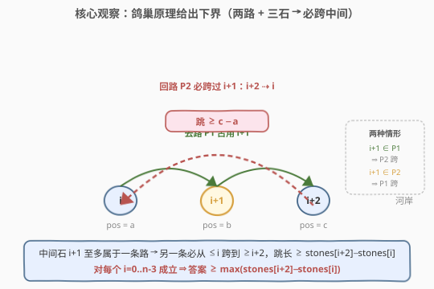
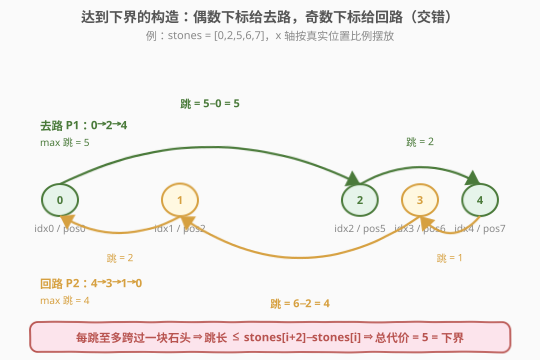

# LeetCode 青蛙过河 II 题解

## 1. 题目概述

- **标题 / 题号**：青蛙过河 II（#2498，medium）
- **链接**：https://leetcode.cn/problems/frog-jump-ii/
- **难度**：中等
- **标签**：贪心、数组

**题意**：给你一个下标从 $0$ 开始、**严格递增**的整数数组 `stones`，表示一条河里石头的位置（`stones[0] == 0`）。一只青蛙从第一块石头出发，要到达最后一块石头，**再回到第一块石头**；同时每块石头**至多到达一次**（起点不计"到达"，故第 $0$ 块的最终返回、第 $n-1$ 块的折返各算一次到达）。

一次跳跃的长度 = 起跳与落点两块石头位置之差 $|\text{stones}[i]-\text{stones}[j]|$。一条路径的**代价** = 该路径中**最大跳跃长度**。求青蛙的**最小代价**。

**示例 1**：

```text
输入：stones = [0,2,5,6,7]
输出：5
解释：去路 0→5→7（跳 5、2），回路 7→6→2→0（跳 1、4、2），最大跳为 5。
无法得到代价小于 5 的路径。
```

**示例 2**：

```text
输入：stones = [0,3,9]
输出：9
解释：青蛙直接 0→9→0，每次跳 9，代价 max(9,9)=9，已是最小。
```

**约束**：

- $2 \le \text{stones.length} \le 10^5$
- $0 \le \text{stones}[i] \le 10^9$
- `stones[0] == 0`，`stones` 严格递增。

> 💡 本题是「**最小化最大跳跃**」型问题，却有一个**闭式贪心解**：答案就是所有「隔一块」的间距 $\text{stones}[i+2]-\text{stones}[i]$ 的最大值（再补一个首跳下界）。关键不在于搜索或二分，而在于看出**两条不相交路径**天然给出鸽巢下界、且奇偶交错构造能精确命中它——与 [410. 分割数组的最大值](../0401-0500/410_分割数组的最大值.md) 那类「二分答案 + 贪心验证」的 minimize-max 形成鲜明对照。

## 2. 解题思路

### 2.1 暴力思路：枚举中转石的划分

青蛙的行程可拆成**去路** $P_1$（$0 \to \dots \to n-1$）与**回路** $P_2$（$n-1 \to \dots \to 0$）两条子路径。中转石（下标 $1 \dots n-2$）每块至多属于一条路，因此一个可行方案 = 把中转石**划分**给 $P_1$、$P_2$ 两组（或闲置不用），再各自连成路径取 max 跳跃。暴力枚举所有划分是指数级 $O(2^n)$，$n \le 10^5$ 完全不可行。

> ⚠️ 思路的转折点在于：我们**根本不需要枚举**。代价是「路径中的最大跳跃」，要最小化它就该**尽量多用石头**（落点越密跳越短），所以最优解里中转石会被两条路瓜分殆尽；而「两条路瓜分一串有序点」这件事，天然受**鸽巢原理**约束——这就直接给出了一个紧的下界。

### 2.2 核心观察：鸽巢原理给出下界



把行程拆成去路 $P_1$（$0 \to n-1$）与回路 $P_2$（$n-1 \to 0$）。中转石每块至多属于一条路。由此得到两层下界：

**① 通用首跳下界**：$P_1$ 从下标 $0$ 出发，第一个落点的下标 $\ge 1$，故第一跳 $\ge \text{stones}[1]-\text{stones}[0]$。于是

$$
\text{ans} \ge \text{stones}[1]-\text{stones}[0] \quad (\star)
$$

当 $n=2$ 时只有起点和终点两块石头，去路、回路都被迫直跳这一段，$(\star)$ 即为答案。

**② 鸽巢下界**（$n \ge 3$）：任取连续三块石头 $i, i+1, i+2$（$i \in [0, n-3]$）。中间的 $i+1$ 是中转石，**至多属于一条路**；那么另一条路在经过这段区域时，必然要从下标 $\le i$ 的某块**直接跳到**下标 $\ge i+2$ 的某块（跨过 $i+1$），这一跳的长度 $\ge \text{stones}[i+2]-\text{stones}[i]$。对每个 $i$ 都成立，故

$$
\text{ans} \ge \max_{i=0}^{n-3}\bigl(\text{stones}[i+2]-\text{stones}[i]\bigr) \quad (\star\star)
$$

> 💡 **鸽巢的直观**：三条缝里只有两条路，必有一条路"漏掉"中间那块，被迫跨过去。这是「两路瓜分有序点集」的结构性下界，**与具体怎么走无关**——任何方案都逃不掉。

### 2.3 构造：奇偶交错达到下界（上界）



下界 $(\star\star)$ 能否取到？能。给出一个**交错构造**：

- **去路** $P_1$ 走**偶数下标** $0, 2, 4, \dots$；
- **回路** $P_2$ 走**奇数下标** $1, 3, 5, \dots$；
- 两端点 $0$、$n-1$ 由两条路**共用**（去路终、回路始 / 回路终、去路始）。

这样每条路里相邻落点的下标**至多相差 $2$**（至多跨过一块石头）：相邻偶数（或奇数）下标差恰好 $2$，对应的跳长正是 $\text{stones}[i+2]-\text{stones}[i]$ 形式；个别**端点相邻**的跳只跨 $1$ 个下标（如进入 $n-1$、离开 $0$），更小，会被相邻的 $i$ 项吸收（例如 $\text{stones}[n-1]-\text{stones}[n-2] \le \text{stones}[n-1]-\text{stones}[n-3]$，即 $i=n-3$ 项）。

于是该构造的每跳 $\le \max_i(\text{stones}[i+2]-\text{stones}[i])$，总代价恰好等于 $(\star\star)$。**下界 = 上界**，答案唯一确定：

$$
\boxed{\;\text{ans} = \max\Bigl(\text{stones}[1]-\text{stones}[0],\ \max_{i=0}^{n-3}\bigl(\text{stones}[i+2]-\text{stones}[i]\bigr)\Bigr)\;}
$$

对 $n \ge 3$，$i=0$ 项 $\text{stones}[2]-\text{stones}[0] \ge \text{stones}[1]-\text{stones}[0]$，故 $(\star)$ 被 $(\star\star)$ 吸收，只需一遍循环；$n=2$ 时循环为空，初值 $(\star)$ 兜底。两者统一成同一份代码。

### 2.4 示例演算

![示例演算：stones = 0,2,5,6,7，枚举 i 求 stones[i+2]−stones[i]](../images/frogjump2_example_walkthrough.svg)

以示例 1 `stones = [0,2,5,6,7]`（$n=5$）逐步演算：

| $i$ | $\text{stones}[i]$ | $\text{stones}[i+2]$ | 差值 |
|-----|-----|-----|------|
| $0$ | $0$ | $5$ | $5$ ★ |
| $1$ | $2$ | $6$ | $4$ |
| $2$ | $5$ | $7$ | $2$ |

$\text{ans} = \max(2,\ 5,\ 4,\ 2) = 5$（初值 $\text{stones}[1]-\text{stones}[0]=2$，循环 $i=2,3,4$ 依次并入 $5,4,2$）。对应构造：去路 $0\to2\to4$（跳 $\{5,2\}$，max $5$），回路 $4\to3\to1\to0$（跳 $\{1,4,2\}$，max $4$），整体 max $=5$，与下界吻合。

示例 2 `stones = [0,3,9]`（$n=3$）：初值 $3$，$i=2$ 并入 $\text{stones}[2]-\text{stones}[0]=9$，$\text{ans}=9$。构造：去路 $0\to2$（跳 $9$），回路 $2\to1\to0$（跳 $6,3$），max $9$。

## 3. 参考代码

### C++

```cpp
class Solution {
public:
    int maxJump(vector<int>& stones) {
        int n = stones.size();
        int ans = stones[1] - stones[0];            // (★) 通用首跳下界；n=2 时即为答案
        for (int i = 2; i < n; ++i)
            ans = max(ans, stones[i] - stones[i - 2]); // 鸽巢下界 stones[i+2]-stones[i]
        return ans;
    }
};
```

> 💡 **数值范围核算**：`stones[i]` $\le 10^9$，任意差值 $\le 10^9 < 2.1\times10^9$（`int` 上界），故 `int` 安全、无需 `long long`。初值 `(★)` 同时扮演两个角色：$n=2$ 的退化答案、与 $n\ge3$ 时被 $i=2$ 项吸收的兜底。循环用 `stones[i]-stones[i-2]`（$i\ge2$）等价于 $\text{stones}[i+2]-\text{stones}[i]$（$i$ 换元），写法更顺手、无需额外边界判断。

### Python

```python
class Solution:
    def maxJump(self, stones: List[int]) -> int:
        ans = stones[1] - stones[0]
        for i in range(2, len(stones)):
            ans = max(ans, stones[i] - stones[i - 2])
        return ans
```

> 💡 **一行 Pythonic 写法**（等价、紧凑）：`return max(stones[1]-stones[0], max((stones[i]-stones[i-2] for i in range(2, len(stones))), default=0))`。`default=0` 兜住 $n=2$ 时生成器为空的情形。但显式初值 + 循环的可读性更好，面试中推荐前者并口述 $(\star)/(\star\star)$ 的来历。

## 4. 复杂度分析

| 维度 | 复杂度 | 说明 |
|------|--------|------|
| **时间** | $O(n)$ | 单趟扫描 $i=2 \dots n-1$，每次 $O(1)$；$n \le 10^5$，约 $10^5$ 次比较 |
| **空间** | $O(1)$ | 仅维护标量 `ans`，原地扫描无额外结构 |
| 对照：暴力划分 | $O(2^n)$ | 枚举中转石归属，指数级，不可行 |
| 对照：二分答案 | $O(n\log V)$ | minimize-max 的通用套路（$V=\text{stones}[n-1]$），本题有闭式解，无需二分 |

> 💡 本题的难点不在复杂度（$O(n)/O(1)$ 显然是下界，至少要读完所有石头），而在**证明闭式答案的正确性**：鸽巢下界 $(\star\star)$ + 交错构造上界，二者夹逼。识别出「两路瓜分 → 鸽巢」是破题的关键一步。

## 5. 扩展：与「二分答案」型 minimize-max 的对比

「最小化某个最大值」是一大类问题，常见两种出路：

| 路数 | 适用场景 | 代表题 | 本题 |
|------|----------|--------|------|
| **二分答案 + 贪心验证** | 验证函数单调、闭式解难求 | [410. 分割数组的最大值](../0401-0500/410_分割数组的最大值.md)、[875. 爱吃香蕉的珂珂](../0801-0900/875_爱吃香蕉的珂珂.md)、[1011. 在D天内送达包裹的能力](../1001-1100/1011_在D天内送达包裹的能力.md) | ❌ |
| **结构性下界 + 构造** | 结构能直接给出紧下界且构造可达 | 本题 2498 | ✅ |

本题之所以跳过二分：**两条不相交路径瓜分有序点集**这一结构，让鸽巢直接给出紧下界 $(\star\star)$，而奇偶交错构造又能严格达到它——下界即上界，答案自洽。若把题面改成「青蛙要往返 $k$ 趟、每块至多到达一次」（$k>2$ 条路径瓜分），鸽巢下界会变成 $\max_i(\text{stones}[i+k]-\text{stones}[i])$，同样的交错构造（下标按 $\bmod k$ 分组）依然精确命中——本题是 $k=2$ 的特例。这一推广是面试中常见的追问方向。

## 6. 面试要点

1. **为什么答案是 $\max(\text{stones}[i+2]-\text{stones}[i])$ 而非相邻间距 $\max(\text{stones}[i+1]-\text{stones}[i])$？**

   > 因为青蛙要**往返**：去路与回路两条不相交路径瓜分中转石。对任意连续三块 $i,i+1,i+2$，中间那块只能给两条路之一，另一条必跨过它，故存在一跳 $\ge \text{stones}[i+2]-\text{stones}[i]$——这是鸽巢给出的**结构性下界**，比相邻间距更大（跨了两块缝）。往返两个字把"隔一块"逼了出来。

2. **$n=2$ 时循环为空，为什么不会出错？**

   > 代码用 `ans = stones[1]-stones[0]` 作初值兜底。$n=2$ 时只有两块石头，去路、回路都被迫直跳 $\text{stones}[1]-\text{stones}[0]$，这正是首跳下界 $(\star)$，循环 `range(2, 2)` 为空，直接返回初值。$n\ge3$ 时该初值被 $i=2$ 项 $\text{stones}[2]-\text{stones}[0] \ge \text{stones}[1]-\text{stones}[0]$ 吸收，无副作用。所以初值一举两得。

3. **交错构造为什么一定能达到下界？端点附近的跳会不会超标？**

   > 去路走偶数下标、回路走奇数下标，端点 $0$、$n-1$ 共用。每条路相邻落点下标**至多差 $2$**，故每跳 $\le \max_i(\text{stones}[i+2]-\text{stones}[i])$。端点相邻的跳只跨 $1$ 个下标（如 $\text{stones}[n-1]-\text{stones}[n-2]$），它 $\le \text{stones}[n-1]-\text{stones}[n-3]$（$i=n-3$ 项），必被吸收。两类跳都不超标，构造严格达到下界。

4. **为什么不用二分答案？**

   > minimize-max 通常走「二分答案 + 贪心验证」。但本题有**结构性紧下界**（鸽巢）且构造可达，答案闭式给出，$O(n)$ 一趟即得，二分 $O(n\log V)$ 反而更慢且多此一举。能否找到紧下界是判断"走闭式还是走二分"的分水岭——本题的下界来自"两条路瓜分有序点"的鸽巢，太干净，不值得二分。

5. **若改成「往返 $k$ 趟」会怎样？**

   > $k$ 条不相交路径瓜分中转石，鸽巢下界升为 $\max_i(\text{stones}[i+k]-\text{stones}[i])$（任取连续 $k+1$ 块，中间 $k-1$ 块至多分给 $k$ 条路，必有一条路跨过它们）。构造：按下标 $\bmod k$ 分组，每条路取一组，相邻落点下标至多差 $k$，恰好达到下界。本题是 $k=2$ 的特例。这一推广是常见追问，能答出显著加分。

> 💡 **一句话总结**：2498 = 「最小化最大跳跃」骨架 + 「两条不相交路径瓜分有序点」结构。鸽巢给出紧下界 $\max(\text{stones}[i+2]-\text{stones}[i])$，奇偶交错构造精确命中，故有 $O(n)/O(1)$ 闭式解，无需二分。

## 同类练习题

| # | 题目 | 与本题的关联 |
|---|------|-------------|
| 403 | [青蛙过河](https://leetcode.cn/problems/frog-jump/)（[题解](../0401-0500/403_青蛙过河.md)） | 同"青蛙 + 石头"主题，但限制跳跃距离为上一跳的 $\pm\{0,1\}$，需用 DP/哈希记忆上跳距离，对照本题"往返两路"的闭式贪心 |
| 410 | [分割数组的最大值](https://leetcode.cn/problems/split-array-largest-sum/)（[题解](../0401-0500/410_分割数组的最大值.md)） | 同属 minimize-max，但走「二分答案 + 贪心验证」套路，对照本题为何能跳过二分（结构性紧下界） |
| 875 | [爱吃香蕉的珂珂](https://leetcode.cn/problems/koko-eating-bananas/)（[题解](../0801-0900/875_爱吃香蕉的珂珂.md)） | 二分答案型 minimize-max，对照「闭式 vs 二分」的分水岭 |
| 1011 | [在 D 天内送达包裹的能力](https://leetcode.cn/problems/capacity-to-ship-packages-within-d-days/)（[题解](../1001-1100/1011_在D天内送达包裹的能力.md)） | 同上，二分 + 贪心验证，强化 minimize-max 通用套路 |
| 164 | [最大间距](https://leetcode.cn/problems/maximum-gap/)（[题解](../0101-0200/164_最大间距.md)） | 同样关心"有序点列的间距"，但目标是求最大相邻间距，需桶排序 $O(n)$；对照本题求"隔一块"间距的最大值 |
