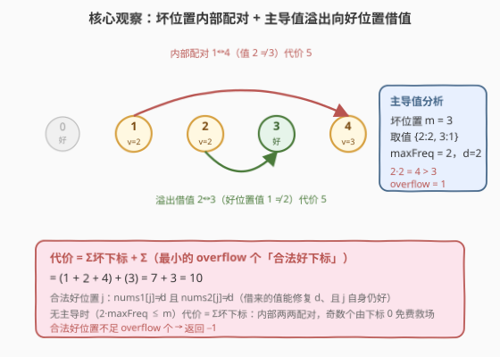
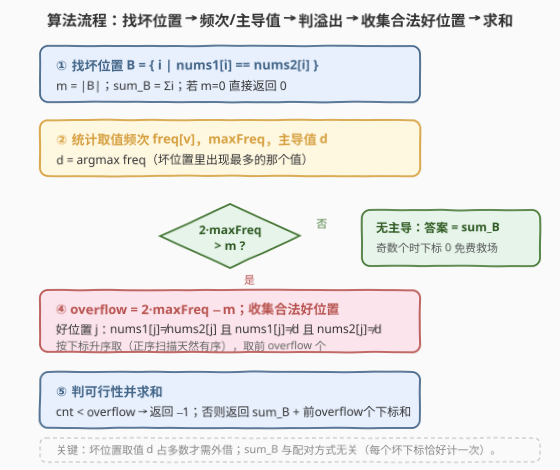

# 让数组不相等的最小总代价

- **题目名称**：让数组不相等的最小总代价
- **链接**：[2499. 让数组不相等的最小总代价](https://leetcode.cn/problems/minimum-total-cost-to-make-arrays-unequal/)
- **难度**：困难
- **标签**：贪心、数组、哈希表、计数

## 1. 题目概述

给你两个长度均为 $n$、下标从 $0$ 开始的数组 `nums1`、`nums2`。每次操作可交换 `nums1` 中任意两个下标处的值，**开销为两个下标之和**（$i+j$）。要求对任意 $i$ 满足 $\text{nums1}[i] \ne \text{nums2}[i]$，可操作任意次，求**最小总代价**；不能达成返回 $-1$。

**示例 1**：

```text
输入：nums1 = [1,2,3,4,5], nums2 = [1,2,3,4,5]
输出：10
解释：交换 (0,3)→3、(1,2)→3、(0,4)→4，总代价 10。
最终 nums1=[5,3,2,1,4]，逐位不等。
```

**示例 2**：

```text
输入：nums1 = [2,2,2,1,3], nums2 = [1,2,2,3,3]
输出：10
解释：交换 (2,3)→5、(1,4)→5，总代价 10。nums1 → [2,3,1,2,2]，逐位不等。
```

**示例 3**：

```text
输入：nums1 = [1,2,2], nums2 = [1,2,2]
输出：-1
解释：值 2 在两数组共出现 4 次 > n=3，无解。
```

**约束条件**：

- $n = \text{nums1.length} = \text{nums2.length}$，$1 \le n \le 10^5$
- $1 \le \text{nums1}[i], \text{nums2}[i] \le n$

> 💡 交换只**置换** `nums1` 的值（保持多重集不变），目标是把 `nums1` 重排成「每个位置都避开 $\text{nums2}[i]$」的排列。破题有两条主线：**只看「坏位置」**（$\text{nums1}[i]=\text{nums2}[i]$ 的位置必须被交换改变）与**代价只与下标有关**（一次交换代价 $i+j$，等价于「每个参与下标计一次」，于是总代价 $=$ 所有参与下标之和）。

---

## 2. 解题思路

### 2.1 暴力思路：枚举交换序列

把每对下标的交换看成一步，搜索所有交换序列让坏位置全变好，取总代价最小。但交换步数上界不明确、组合爆炸，$n=10^5$ 完全不可行。即便退一步用「最小权匹配」建模（坏位置与可借值之间），也需要 $O(n^3)$ 匈牙利算法，仍不可行。

> ⚠️ 瓶颈在于把问题当成了**通用匹配**。抓住两个结构性事实后，它会塌缩成 $O(n)$ 计数：

1. **坏位置必被换**：$\text{nums1}[i]=\text{nums2}[i]=v$ 的位置 $i$，其值必须改变，故 $i$ 至少参与一次交换；而**好位置**（$\text{nums1}[i]\ne\text{nums2}[i]$）本就满足条件，只在需要「借值」时才被卷入。
2. **代价 $=$ 参与下标之和**：一次交换 $(i,j)$ 代价 $i+j$；若每个参与位置恰好参与一次（两两不交的配对），总代价恰好是「所有参与下标之和」，**与配对方式无关**。于是只要确定「该让哪些位置参与」，代价就被锁定。

### 2.2 核心观察：坏位置内部配对 + 主导值溢出



记坏位置集合 $B=\{i\mid \text{nums1}[i]=\text{nums2}[i]\}$，$m=|B|$；坏位置 $i$ 处取值 $v_i=\text{nums1}[i]=\text{nums2}[i]$。在坏位置集合内统计取值频次 $\text{freq}[v]$，令 $\text{maxFreq}=\max_v\text{freq}[v]$，对应取值为**主导值** $d$。

**① 内部配对（不同值才生效）**：两个坏位置 $i,j$ 互换后，$i$ 得到 $v_j$、$j$ 得到 $v_i$，二者都变好当且仅当 $v_i\ne v_j$。即「同值坏位置不能互相救」。因此主导值 $d$ 的坏位置只能与非 $d$ 的坏位置配对，**可配的非 $d$ 坏位置数 $=m-\text{maxFreq}$**。

**② 主导值溢出**：若 $\text{maxFreq}>m-\text{maxFreq}$（即 $2\cdot\text{maxFreq}>m$，主导），则多出的 $d$ 位置数为

$$\text{overflow}=\text{maxFreq}-(m-\text{maxFreq})=2\cdot\text{maxFreq}-m$$

这些 $d$ 坏位置在 $B$ 内找不到非 $d$ 伙伴，必须向**好位置**借值。

**③ 合法好位置**：好位置 $j$（$\text{nums1}[j]\ne\text{nums2}[j]$）能与 $d$ 坏位置 $i$ 互换且双方都好，需满足

$$\text{nums1}[j]\ne d \quad(\text{借给 }i\text{ 的值}\ne d)\quad\text{且}\quad d\ne\text{nums2}[j]\quad(j\text{ 收到 }d\text{ 后仍}\ne\text{nums2}[j])$$

即 $\text{nums1}[j]\ne d$ 且 $\text{nums2}[j]\ne d$。把所有合法好位置按下标升序排列，**取最小的 $\text{overflow}$ 个**作为借值方（下标越小越省）。

**④ 代价公式**：每个坏位置恰好参与一次（$d$ 位置与非 $d$ 坏位置配对、溢出的 $d$ 位置与好位置配对，构成不交配对），加上 $\text{overflow}$ 个好位置各参与一次，于是

$$\boxed{\;\text{ans}=\sum_{i\in B} i\;+\;\sum_{\text{最小的 overflow 个合法好下标}} j\;}$$

当 $2\cdot\text{maxFreq}\le m$（无主导）时 $\text{overflow}=0$，代价即 $\sum_{i\in B}i$。

> 💡 **为什么 $\sum_{i\in B}i$ 与配对方式无关？** 不交配对里每个坏下标恰好出现一次，其贡献恒为自身下标；不管把谁和谁配（只要同值不配），坏下标之和固定。所以只需决定「还要拉哪些好位置进来」——拉得越少、下标越小越好，这正是公式里取「最小 $\text{overflow}$ 个合法好下标」的由来。主导值 $d$ 的溢出数 $\text{overflow}$ 是**必须外借的下界**（$d$ 位置在 $B$ 内确实配不满），不可更少。

> ⚠️ **无主导但 $m$ 为奇数怎么办？** 不交配对只能覆盖偶数个位置，奇数 $m$ 似乎剩 1 个。但**下标 0 永远免费救场**：若 $0\in B$，把它做成 3-循环（pivot 在 0，代价 $+0$）；若 $0\notin B$，则 $0$ 是好位置，可作免费借值方（$+0$）。二者都只加 $0$，所以无主导时代价仍 $=\sum_{i\in B}i$。详见第 5 节。

### 2.3 算法流程图



五步骨架：① 找 $B$、$m$、$\text{sum\_B}$；② 统计 $\text{freq}$、$\text{maxFreq}$、$d$；③ 判 $2\cdot\text{maxFreq}>m$；④ 算 $\text{overflow}$ 并收集合法好位置（升序）；⑤ 判可行性后求和。正序扫描 $j$ 时合法好下标天然升序，无需再排序。

### 2.4 示例演算


以示例 2 `nums1=[2,2,2,1,3]`、`nums2=[1,2,2,3,3]` 逐步演算：

| 步 | 内容 | 结果 |
|----|------|------|
| ① | 坏位置 $B=\{1,2,4\}$（$\text{nums1}[i]=\text{nums2}[i]$） | $m=3$，$\text{sum\_B}=1+2+4=7$ |
| ② | 坏位置取值 $\{2,2,3\}$ | $\text{freq}=\{2{:}2,3{:}1\}$，$\text{maxFreq}=2$，$d=2$ |
| ③ | $2\cdot\text{maxFreq}=4>3$ | $\text{overflow}=4-3=1$，需 1 个对 $d=2$ 合法的好位置 |
| ④ | 好位置 $\{0,3\}$：$j=0$ 有 $\text{nums1}[0]=2=d$ 不合法；$j=3$ 有 $\text{nums1}[3]=1\ne2$ 且 $\text{nums2}[3]=3\ne2$ 合法 | 合法好下标 $\{3\}$，共 $1\ge1$ ✓ |
| ⑤ | $\text{ans}=\text{sum\_B}+\text{最小 1 个}=\ 7+3$ | $=10$ ✓ |

对应交换：$(1,4)$ 代价 $1+4=5$、$(2,3)$ 代价 $2+3=5$，总 $10$；得 `nums1=[2,3,1,2,2]`，逐位 $2\ne1,3\ne2,1\ne2,2\ne3,2\ne3$ ✓。

示例 1 `nums1=nums2=[1,2,3,4,5]`：$B=\{0,1,2,3,4\}$，$m=5$，各值频次 $1$，$\text{maxFreq}=1$，$2\cdot1=2\le5$ 无主导 → $\text{ans}=\text{sum\_B}=0+1+2+3+4=10$。

示例 3 `nums1=nums2=[1,2,2]`：$B=\{0,1,2\}$，$\text{freq}=\{1{:}1,2{:}2\}$，$\text{maxFreq}=2$，$2\cdot2=4>3$，$\text{overflow}=1$，$d=2$。但全是坏位置、合法好位置 $0<1$ → 返回 $-1$。

---

## 3. 参考代码

### C++

```cpp
class Solution {
public:
    long long minimumTotalCost(vector<int>& nums1, vector<int>& nums2) {
        int n = nums1.size();
        unordered_map<int,int> freq;
        long long sumB = 0;
        int m = 0;
        for (int i = 0; i < n; ++i)
            if (nums1[i] == nums2[i]) {            // 坏位置
                ++m;
                sumB += i;
                ++freq[nums1[i]];                 // == nums2[i]
            }
        if (m == 0) return 0;

        int maxFreq = 0, d = 0;
        for (auto& [v, f] : freq)
            if (f > maxFreq) { maxFreq = f; d = v; }

        if (2LL * maxFreq <= m) return sumB;       // 无主导：内部两两配对，奇数由下标0免费救场

        long long overflow = 2LL * maxFreq - m;    // 需外借的好位置数
        long long extra = 0, cnt = 0;
        for (int j = 0; j < n && cnt < overflow; ++j)       // 升序扫描，取最小的 overflow 个
            if (nums1[j] != nums2[j] && nums1[j] != d && nums2[j] != d) {
                extra += j;
                ++cnt;
            }
        if (cnt < overflow) return -1;            // 合法好位置不够 → 无解
        return sumB + extra;
    }
};
```

### Python

```python
class Solution:
    def minimumTotalCost(self, nums1: List[int], nums2: List[int]) -> int:
        n = len(nums1)
        freq = {}
        sumB = m = 0
        for i, (a, b) in enumerate(zip(nums1, nums2)):
            if a == b:                              # 坏位置
                m += 1
                sumB += i
                freq[a] = freq.get(a, 0) + 1        # == nums2[i]
        if m == 0:
            return 0

        d, maxFreq = max(freq.items(), key=lambda kv: kv[1])
        if 2 * maxFreq <= m:                         # 无主导
            return sumB

        overflow = 2 * maxFreq - m                   # 需外借的好位置数
        extra = cnt = 0
        for j in range(n):                           # 升序扫描，取最小的 overflow 个
            if cnt == overflow:
                break
            if nums1[j] != nums2[j] and nums1[j] != d and nums2[j] != d:
                extra += j
                cnt += 1
        return -1 if cnt < overflow else sumB + extra
```

> 💡 **实现细节**：① 正序扫描 $j$ 时合法好下标天然升序，无需排序；② 主导值在 $2\cdot\text{maxFreq}>m$ 时唯一（两个值都过半会超过 $m$），故 `argmax` 取谁都行；③ $\text{sum\_B}$ 可达 $\sum_{i=0}^{n-1}i\approx5\times10^9$，超出 32 位，C++ 用 `long long`、Python 自动大整数。

---

## 4. 复杂度分析

| 维度 | 复杂度 | 说明 |
|------|--------|------|
| **时间** | $O(n)$ | 一趟扫描找 $B$、统计 $\text{freq}$；一趟扫描取最小 $\text{overflow}$ 个合法好下标（遇满即停） |
| **空间** | $O(n)$ | $\text{freq}$ 哈希表至多存 $m\le n$ 个取值 |
| 对照：最小权匹配 | $O(n^3)$ | 通用二分图匹配，$n=10^5$ 不可行 |
| 对照：枚举交换序列 | 指数级 | 步数与组合无界 |

> ⚠️ 答案上界：$\text{sum\_B}\le\frac{(n-1)n}{2}\approx5\times10^9$，加 $\text{extra}\le\text{sum\_B}$，总量 $\sim10^{10}$，必须 64 位。扫描「取最小 $k$ 个」是经典 top-k：本题 $j$ 升序天然有序，直接取前 $k$ 即 $O(n)$，比先收集再 `sort`（$O(n\log n)$）或维护大小为 $k$ 的堆（$O(n\log k)$）都更轻。

---

## 5. 扩展：可行性 = Hall 条件 + 下标 0 免费救场

### 5.1 可行性即 Hall 条件，且只主导值可能是瓶颈

把问题看作「将 `nums1` 的值多重集重排到各位置，要求位置 $i$ 不得取 $\text{nums2}[i]$」的完美匹配。由 Hall 定理（左=位置、右=值槽，位置 $i$ 与取值 $v\ne\text{nums2}[i]$ 的值槽相邻），只需对「全体 $\text{nums2}[i]=v$ 的位置」这族子集验证：

$$\text{cnt}_1(v)+\text{cnt}_2(v)\le n\quad\forall v$$

其中 $\text{cnt}_1(v),\text{cnt}_2(v)$ 为 $v$ 在 `nums1`、`nums2` 中的总出现数。关键化简：好位置满足 $\text{nums1}[j]\ne\text{nums2}[j]$，故同一个 $v$ 不会同时占据一个好位置的两侧，于是

$$\text{cnt}_1(v)+\text{cnt}_2(v)=2\cdot\text{freq}(v)+g_1(v)+g_2(v)\le 2\cdot\text{freq}(v)+(n-m)$$

（$g_1,g_2$ 为好位置中两侧出现 $v$ 的次数，$g_1+g_2\le n-m$）。要其 $\le n$ 即 $2\cdot\text{freq}(v)\le m$。**当无主导（所有 $\text{freq}(v)\le m/2$）时对所有 $v$ 自动成立 → 必有解**；当存在主导 $d$（$2\cdot\text{freq}(d)>m$）时，唯一可能违反的就是 $d$，条件化为

$$\text{overflow}=2\cdot\text{freq}(d)-m\le\bigl|\{j\text{ 好}:\text{nums1}[j]\ne d\wedge\text{nums2}[j]\ne d\}\bigr|$$

这正是代码里的 `cnt < overflow → -1`。所以**可行性只需检查主导值 $d$ 一处**。

### 5.2 无主导奇数 $m$：下标 0 永远免费救场

无主导时 $2\cdot\text{maxFreq}\le m$；$m$ 为奇数则 $\text{maxFreq}\le(m-1)/2$，且必有 $\ge3$ 种不同取值（1 种或 2 种取值都会让某值过半而成主导）。不交配对只能覆盖偶数个，剩 1 个坏位置看似无处安放，但其实：

- **若 $0\in B$**：把含 $0$ 的三个坏位置（取值两两不同，必能挑出含 $0$ 且删后无主导的一组，见下）组成 3-循环，pivot 取 $0$。一个 3-循环 $(a,b,c)$ 可分解为两个共 pivot 的对换 $(a,b)(a,c)$，代价 $=2a+b+c=\text{三下标和}+a$；pivot 是 $0$ 时额外 $+0$，总代价仍是 $\sum_{i\in B}i$。其余 $m-3$ 个坏位置两两不交配对（删去三种取值各一个后仍无主导，见下）。
- **若 $0\notin B$**：$0$ 是好位置，由「$\ge3$ 种不同取值 + 鸽巢」知 $0$ 对至少一种坏取值合法（$\text{nums1}[0],\text{nums2}[0]$ 两个值挡不住 $\ge3$ 种坏取值），把它当免费借值方，额外 $+0$。

**删 3 个不致新主导的构造**：删 3-循环的三个位置时，要让剩余 $m-3$ 个仍无主导（$\text{freq}'(v)\le(m-3)/2$）。只有「删之前 $\text{freq}(v)=(m-1)/2$（即最大）」的取值在剩余里可能超 $(m-3)/2$；这种取值至多两种（$2\cdot(m-1)/2=m-1<m$）。只需保证 3-循环删去「每种当前最大取值各一个」即可：含 $0$（取值 $v_0$）再加 1～2 个最大取值位置 + 补足到 3 种不同取值，总能在 $\ge3$ 种取值里凑齐（$v_0$ 自身若就是最大取值则只删它一个也够）。故构造恒存在，代价恒为 $\sum_{i\in B}i$。

> 💡 一句话：**主导值负责「要不要外借」**（$2\cdot\text{maxFreq}>m$ 才溢出），**下标 0 负责「奇偶对齐」**（永远免费），二者各司其职，故代价公式只含 $\text{sum\_B}$ 与溢出好下标两部分。

---

## 6. 面试要点

1. **为什么只看坏位置、好位置不动？**

   > 好位置已满足 $\text{nums1}[i]\ne\text{nums2}[i]$，互换两个好位置只会徒增代价、还有弄坏它们的风险；最优解里好位置只在「主导值溢出、必须借值」时才被卷入，作为坏位置的搭档出现一次。

2. **代价为什么等于「参与下标之和」，与配对方式无关？**

   > 一次交换 $(i,j)$ 代价 $i+j$。若采用两两不交的配对（每个位置恰好参与一次），总代价 $=\sum$ 参与下标。坏位置必参与（值必须变），故坏下标之和是固定底数；额外只看「拉了哪些好位置进来」，拉得越少越小越好——这就把「最小权匹配」降成了「取最小的 $\text{overflow}$ 个合法好下标」。

3. **主导值 $d$ 的溢出数 $\text{overflow}=2\cdot\text{maxFreq}-m$ 怎么来的？**

   > $d$ 在坏位置里出现 $\text{maxFreq}$ 次，能和它配的非 $d$ 坏位置只有 $m-\text{maxFreq}$ 个，故 $d$ 多出 $\text{maxFreq}-(m-\text{maxFreq})=2\cdot\text{maxFreq}-m$ 个在 $B$ 内配不掉，必须向好位置借值。这是外借数的**下界**（$d$ 位置在 $B$ 内确实配不满），不可更少。

4. **什么时候返回 $-1$？为什么要查主导值 $d$ 一处就够？**

   > 由 Hall 定理，可行性 $\Leftrightarrow\forall v:\text{cnt}_1(v)+\text{cnt}_2(v)\le n$。利用好位置「两侧不同值」可化简为 $2\cdot\text{freq}(v)\le m$。无主导时对所有 $v$ 自动成立；有主导 $d$ 时唯一可能违反的就是 $d$，条件即「合法好位置数 $\ge\text{overflow}$」，故只查 $d$ 一处。

5. **无主导但 $m$ 为奇数，为何代价还是 $\sum_{i\in B}i$？**

   > 不交配对覆盖偶数个，剩 1 个看似多。但下标 0 永远免费：$0\in B$ 时用含 $0$ 的 3-循环（pivot $0$，额外 $+0$）；$0\notin B$ 时用 $0$ 作免费好位置搭档（$+0$，由 $\ge3$ 种坏取值 + 鸽巢保证合法）。故奇偶不增加代价。这是公式不含额外奇偶项的关键。

> 💡 **一句话总结**：2499 = 「坏位置取值配对」+「主导值溢出借好位置」。代价 $=\sum$ 坏下标 $+\sum$ 最小 $\text{overflow}$ 个合法好下标；主导值判定外借、下标 0 免费对齐奇偶，$O(n)$ 一趟搞定。

---

## 7. 同类练习题

- [2448. 使数组相等的最小开销](https://leetcode.cn/problems/minimum-cost-to-make-array-equal/)（[题解](./2448_使数组相等的最小开销.md)）：同「最小总代价」型，但那里是「移动到目标值」的中位数贪心，对照本题「交换配对、代价按下标」的不同结构
- [2499. 让数组不相等的最小总代价](https://leetcode.cn/problems/minimum-total-cost-to-make-arrays-unequal/)：本题，主导值溢出 + 下标 0 救场的代表
- [2449. 使数组相似的最少操作次数](https://leetcode.cn/problems/minimum-number-of-operations-to-make-arrays-similar/)：同区间「操作使数组满足某条件」型，操作带符号/代价，对照「配对代价」与「差值配对」两类思路
- [410. 分割数组的最大值](https://leetcode.cn/problems/split-array-largest-sum/)（[题解](../0401-0500/410_分割数组的最大值.md)）：看似无关，但都把「指数级搜索」靠结构观察压成线性——本题靠「代价=下标和、配对方式无关」
- [453. 最小移动次数使数组元素相等](https://leetcode.cn/problems/minimum-moves-to-equal-array-elements/)：n-1 个元素 +1 等价于 1 个元素 −1 的化归，对照本题「交换的置换语义」带来的化归
