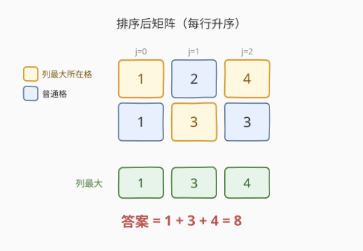
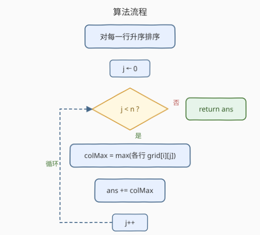

# LeetCode 删除每行中的最大值 题解

## 1. 题目概述

- **标题 / 题号**：删除每行中的最大值（#2500，easy）
- **链接**：https://leetcode.cn/problems/delete-greatest-value-in-each-row/
- **难度**：简单
- **标签**：数组、矩阵、排序

**题意**：给你一个 $m \times n$ 的矩阵 `grid`，元素均为正整数。重复执行下述操作直到矩阵为空：

- **每一行**删除该行中值最大的元素；若一行内有多个并列最大，删哪一个都行；
- 把**本轮各删除元素中的最大值**累加到答案 `ans`。

返回最终 `ans`。注意每执行一次操作，矩阵每一列的数据就会减 $1$。

**示例 1**：

```text
输入：grid = [[1,2,4],[3,3,1]]
输出：8
解释：
- 第 1 轮：第 1 行删 4，第 2 行删 3（两个 3 任删其一），本轮最大 4，ans = 4；
- 第 2 轮：第 1 行删 2，第 2 行删 3，本轮最大 3，ans = 7；
- 第 3 轮：第 1 行删 1，第 2 行删 1，本轮最大 1，ans = 8。
```

**示例 2**：

```text
输入：grid = [[10]]
输出：10
解释：第 1 轮删 10，ans = 10。
```

**约束**：

- $m = \texttt{grid.length}$，$n = \texttt{grid[i].length}$
- $1 \le m, n \le 50$
- $1 \le \texttt{grid[i][j]} \le 100$

> 💡 关键细节：操作是「按行删最大、按轮取最大」。表面上每轮删哪个并列最大值有自由度，似会影响后续；下文核心观察会证明——**最终答案与删值的选择无关**，于是可塌缩为「排序 + 列最大值求和」的 $O(m\,n\log n)$ 公式。

## 2. 解题思路

### 2.1 暴力思路：逐轮模拟删除

最直白的做法是**忠实模拟**：执行 $n$ 轮（矩阵有 $n$ 列即 $n$ 轮），每轮对 $m$ 行各扫一遍找出当前最大值并删掉（用标记或交换移除），再记录本轮 $m$ 个删除值中的最大并累加。每轮 $O(m\cdot n)$（找最大 $O(n)$ × $m$ 行），共 $n$ 轮，总计 $O(m\cdot n^2)$，$m,n\le 50$ 时约 $1.25\times 10^5$ 次，可 AC。

> ⚠️ 暴力模拟的坑不在复杂度而在**实现负担**：要维护「每行剩余元素」的结构、处理并列最大时的删除、再对每轮删除值求 max——逻辑多、易写出 off-by-one。更致命的是它把「答案与选择无关」的结构白白浪费了，没识别出问题可塌缩。

### 2.2 核心观察：答案与删值顺序无关 → 排序 + 列最大值



**关键不变量**：对任意一行，每轮删的是「当前剩余中的最大」，所以该行各轮删掉的值，按轮次连起来，**恰好是该行元素的降序排列**。并列最大时删哪个物理格子不影响删值序列（值相同），故**每行每轮删的值是固定的**。

于是第 $k$ 轮（$k=1..n$）从第 $i$ 行删的值 = 第 $i$ 行的第 $k$ 大。本轮贡献 = $\max\limits_i$（第 $i$ 行第 $k$ 大）。对 $n$ 轮求和：

$$
\text{ans} = \sum_{k=1}^{n} \max_{i}\bigl(\text{第 }i\text{ 行第 }k\text{ 大}\bigr)
$$

把每行**升序排序**后，第 $k$ 大即第 $(n-k)$ 列（0 起下标），上式就化为：

$$
\boxed{\,\text{ans} = \sum_{j=0}^{n-1} \max_{i}\, \texttt{grid[i][j]}\,}
$$

即**排序每行后，逐列取行间最大，求和**。这正是「排序 + 按位置对齐取列最大」的范式——与 [561. 数组拆分](../0501-0600/561_数组拆分.md)「排序后两两配对取小求和」同源，只是从「行内配对」升到「跨行按列对齐」。

> 💡 **为什么不变？** 根因是「删最大」这一约束把每行删值序列锁死为降序；并列自由度只影响物理格子、不影响值序列，跨行配对（按轮）也因此唯一确定。一旦识别这个不变量，模拟的 $O(m n^2)$ 即塌缩为 $O(m n\log n)$。

### 2.3 算法流程图



三步：

1. 对每行 `sort`（升序）；
2. 遍历列 $j \in [0, n)$，对每列取 $\max_i \texttt{grid[i][j]}$；
3. 累加到 `ans`，列遍历完返回 `ans`。

> 💡 Python 可用 `zip(*grid)` 把行转列，一行 `sum(max(col) for col in zip(*grid))` 收尾；C++ 需双层循环显式取列最大。

### 2.4 示例演算

![示例演算：grid=[[1,2,4],[3,3,1]]，模拟三轮得 8；排序后列最大 1,3,4 求和=8，一致](../images/delmax_example_walkthrough.svg)

以示例 1 `grid = [[1,2,4],[3,3,1]]` 演算：

**模拟视角**（$n=3$ 轮）：

| 轮次 | 第 1 行删 | 第 2 行删 | 本轮最大 | 累计 ans |
|------|----------|----------|----------|----------|
| 1 | 4 | 3 | 4 | 4 |
| 2 | 2 | 3 | 3 | 7 |
| 3 | 1 | 1 | 1 | 8 |

**公式视角**：排序后 `grid' = [[1,2,4],[1,3,3]]`，逐列取行间最大：

- 列 $0$：$\max(1,1)=1$；
- 列 $1$：$\max(2,3)=3$；
- 列 $2$：$\max(4,3)=4$；

求和 $1+3+4=8$，与模拟一致 ✓。示例 2 单元素 `[[10]]`：排序后列 $0$ 最大 $10$，`ans=10`。

## 3. 参考代码

### C++

```cpp
class Solution {
public:
    int deleteGreatestValue(vector<vector<int>>& grid) {
        int m = grid.size(), n = grid[0].size();
        for (auto& row : grid) sort(row.begin(), row.end());
        int ans = 0;
        for (int j = 0; j < n; ++j) {
            int colMax = 0;
            for (int i = 0; i < m; ++i) colMax = max(colMax, grid[i][j]);
            ans += colMax;
        }
        return ans;
    }
};
```

> 💡 `grid[i][j] >= 1` 故 `colMax` 初值 $0$ 安全（首元素必 > 0 即更新）。原地排序会修改输入 `grid`；本题允许，若需保留原矩阵可先复制。共 $n\le 50$ 轮、每轮贡献 $\le 100$，`ans` 上界 $5000$，`int` 足够。

### Python

```python
class Solution:
    def deleteGreatestValue(self, grid: List[List[int]]) -> int:
        for row in grid:
            row.sort()
        return sum(max(col) for col in zip(*grid))
```

> 💡 `zip(*grid)` 把「行列表」转置为「列迭代器」，`max(col)` 即列最大，生成器喂 `sum` 一步到位，避免手写双层循环。`row.sort()` 原地升序；若不想改输入可用 `sorted(row)`。

## 4. 复杂度分析

| 维度 | 复杂度 | 说明 |
|------|--------|------|
| **时间** | $O(m\cdot n\log n)$ | 每行排序 $O(n\log n)$ × $m$ 行；列扫描 $O(m\cdot n)$，被排序项支配 |
| **空间** | $O(1)$ | 原地排序、仅 `ans`/`colMax` 标量；Python `zip` 为迭代器不额外存列 |
| 对照：逐轮模拟 | $O(m\cdot n^2)$ | 每轮对每行找最大 $O(n)$ × $m$ × $n$ 轮；同答但更慢且实现更繁 |
| 对照：堆模拟 | $O(m\cdot n\log n)$ | 每行建大顶堆 $O(n)$、$n$ 轮各弹一次 $O(\log n)$×$m$；同阶但常数大、空间 $O(m)$ |

> 💡 本题灵魂不在复杂度（$m,n\le50$ 暴力也过），而在**识别不变量**：把「逐轮模拟」塌缩为「排序 + 列最大求和」。一旦看穿，代码从 30 行模拟缩到 5 行。

## 5. 扩展：不变量识别与「按位置对齐求和」范式

### 5.1 不变量从何而来

本题可塌缩的根因是两个条件的合取：

1. **逐行独立取最大**：每行删值只依赖本行剩余，行间无耦合；
2. **删的是最大**：每行删值序列被锁死为「降序」，轮次 $k$ ↔ 第 $k$ 大，构成行与轮的双射。

两者叠加，使「第 $k$ 轮第 $i$ 行删的值」成为**与选择无关的常量**（第 $i$ 行第 $k$ 大），跨行配对由此唯一确定。若把「删最大」改成「删最小」或「删任意」，不变量即破：删任意会让行内删值序列自由，配对随之浮动，答案不再唯一——那类题才需搜索/DP。识别「约束是否锁死排列」是判断能否塌缩的关键判据。

### 5.2 「排序 + 按位置对齐」范式

把数组排序后、按位置（下标/列）配对再做聚合，是一类招牌套路：

- **行内配对**：[561. 数组拆分](../0501-0600/561_数组拆分.md)——排序后两两相邻配对，取每对较小者求和（下标偶位取）。
- **跨行按列配对**：本题——每行排序后按列取行间最大求和。
- **按值域下标聚合**：[740. 删除并获得点数](../0301-0400/740_删除并获得点数.md)（值域建桶后相邻下标互斥，转打家劫舍 DP）。

共性：**排序把「自由配对」约束为「按位置对齐」，再在固定位置上做 max/sum 等聚合**。遇到「可自由选择配对、求最值/求和」的题，先问「排序后能否按位置对齐」。

> 💡 另一视角：本题也可不显式排序，用每行一个最大堆逐轮弹最大——复杂度同为 $O(m\cdot n\log n)$ 但空间 $O(m)$，作为「保留输入原序」时的替代实现。

## 6. 面试要点

1. **为什么答案与删值选择无关？**

   > 每轮删「当前行最大」，所以每行删值序列按轮连起来恰为该行**降序**；并列最大时删哪个物理格子，删掉的值相同，序列不变。于是「第 $k$ 轮第 $i$ 行删的值 = 第 $i$ 行第 $k$ 大」是常量，跨行按轮配对唯一，总和随之唯一。这正是不变量的根。

2. **如何想到排序 + 列最大？**

   > 从「每行删值序列 = 降序」出发，第 $k$ 轮贡献 $=\max_i$（第 $i$ 行第 $k$ 大）。把行升序排好，第 $k$ 大落在固定列，求和即「列最大求和」。本质是把「自由配对」用排序约束成「按位置对齐」。

3. **并列最大时会不会让某行列最大变？**

   > 不会。列最大取自「各行的第 $k$ 大」（已排序值），与「删哪个并列格子」无关——并列值相等，删谁都给出同一值序列，列最大不变。可手验 `[[5,5],[1,2]]`：排序 `[[5,5],[1,2]]`，列最大 $5,5$，和 $10$；模拟两轮各删 $5$，$5+5=10$ ✓。

4. **能否不排序、用堆模拟？优劣？**

   > 可以：每行建大顶堆 $O(n)$，$n$ 轮各弹 $m$ 个堆顶取 max 累加，$O(m\cdot n\log n)$ 时间、$O(m)$ 空间。与排序法同阶但常数与空间更大；优点是不修改输入原序、且贴近「逐轮删最大」的题面直觉。约束小（$50$）时二者皆可，面试先给排序法、再提堆法作「保序」备选。

5. **答案范围与类型选择？**

   > 共 $n\le 50$ 轮、每轮贡献 $\le 100$（$m$ 个删除值取 max，均 $\le 100$），`ans` 上界 $n\times 100 \le 5000$，远小于 `int` 上界，C++/Python 均用 `int` 即可，无溢出风险。

> 💡 **一句话总结**：每行删值序列 = 降序，使「第 $k$ 轮第 $i$ 行删值」成常量；排序每行后按列取行间最大求和，$O(m n\log n)$ 出解，且答案与并列删值的选择无关。

## 同类练习题

| # | 题目 | 与本题的关联 |
|---|------|-------------|
| 561 | [数组拆分](https://leetcode.cn/problems/array-partition/)（[题解](../0501-0600/561_数组拆分.md)） | 同「排序 + 按位置对齐聚合」招牌题——排序后两两配对取小求和，对照本题的「跨行按列对齐取最大」 |
| 1337 | [矩阵中战斗力最弱的 K 行](https://leetcode.cn/problems/the-k-weakest-rows-in-a-matrix/)（[题解](../1301-1400/1337_矩阵中战斗力最弱的K行.md)） | 矩阵 + 行排序后按指标取前 K，同属「矩阵行排序再聚合」家族 |
| 2418 | [按身高排序](https://leetcode.cn/problems/sort-the-people/)（[题解](../2401-2500/2418_按身高排序.md)） | 按外部键数组对名字重排，对照「排序 + 下标对齐」的基础形态 |
| 881 | [救生艇](https://leetcode.cn/problems/boats-to-save-people/)（[题解](../0801-0900/881_救生艇.md)） | 排序后双指针配对求最值，对照「排序把自由配对约束为按位置对齐」的贪心范式 |
| 2482 | [行和列中一和零的差值](https://leetcode.cn/problems/difference-between-ones-and-zeros-in-row-and-column/)（[题解](../2401-2500/2482_行和列中一和零的差值.md)） | 矩阵行/列预聚合的近邻题，对照「先按行列预计算再查询」的结构 |
