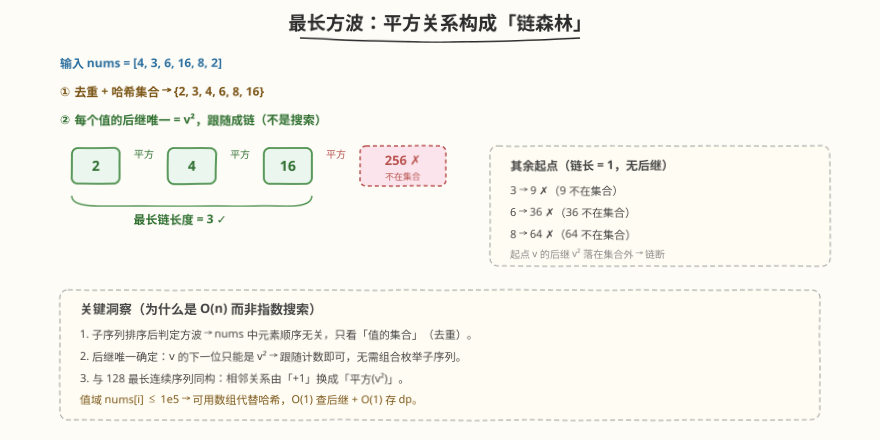
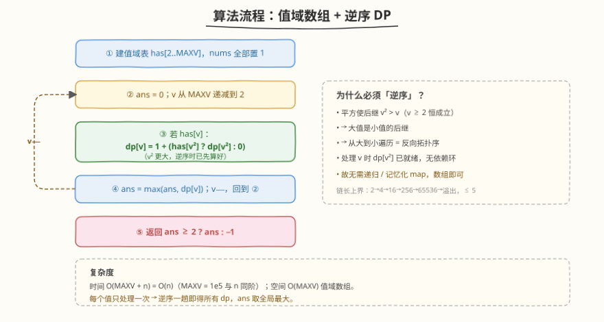
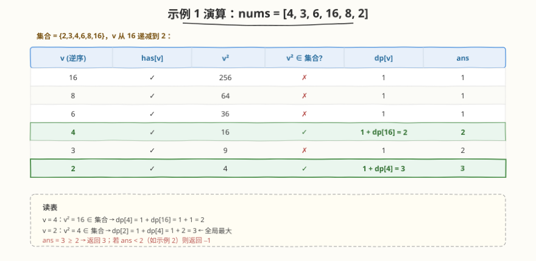

# LeetCode 数组中最长的方波 题解

## 1. 题目概述

- **标题 / 题号**：数组中最长的方波（#2501，medium）
- **链接**：https://leetcode.cn/problems/longest-square-streak-in-an-array/
- **难度**：中等
- **标签**：数组、哈希表、动态规划、排序

**题意**：给你一个整数数组 `nums`。如果 `nums` 的子序列满足下述条件，则认为该子序列是一个**方波**：

- 子序列长度至少为 `2`；
- 将子序列**从小到大排序**后，除第一个元素外，每个元素都是前一个元素的**平方**。

返回 `nums` 中**最长方波**的长度；若不存在方波则返回 `-1`。

> 💡 **方波即"平方链"**：设排序后子序列为 $a_1, a_2, \ldots, a_k$，则 $a_{i+1} = a_i^2$。于是整条链呈几何级数 $x,\ x^2,\ x^4,\ x^8,\ \ldots$（每步平方 = 指数翻倍）。这是与 [128. 最长连续序列](../0101-0200/128_最长连续序列.md) 完全同构的「最长链」问题——只不过相邻关系由「$+1$」换成了「平方」。

**示例 1**：

```text
输入：nums = [4, 3, 6, 16, 8, 2]
输出：3
解释：选出子序列 [4, 16, 2]，排序后得到 [2, 4, 16]。
  - 4 = 2²
  - 16 = 4²
故 [4, 16, 2] 是方波，长度为 3。可以证明不存在长度为 4 的方波。
```

**示例 2**：

```text
输入：nums = [2, 3, 5, 6, 7]
输出：-1
解释：nums 不存在方波，返回 -1。
```

**约束**：

- $2 \le \text{nums.length} \le 10^5$
- $2 \le \text{nums[i]} \le 10^5$

> ⚠️ 注意值域上界 $\text{nums[i]} \le 10^5$ 是本题的关键约束之一：它让"链长上界极小"（$2 \to 4 \to 16 \to 256 \to 65536 \to$ 溢出值域，至多 $5$ 步），并允许用**值域数组**代替哈希表——这两点直接决定了下面解法的形态。

## 2. 解题思路

### 2.1 暴力思路：枚举子序列

最直白的做法是枚举 `nums` 的所有子序列（$2^n$ 个），对每个子序列排序后逐对验证 $a_{i+1} = a_i^2$，取满足条件的最大长度。这在 $n = 10^5$ 下完全不可行——$2^{10^5}$ 是天文数字。

> ⚠️ 暴力的根因在于把"子序列"当成"组合选择"问题处理。但题目判定的是**排序后**的子序列，这意味着元素在 `nums` 中的**原始顺序完全不影响判定**——只影响"能不能被选中"。一旦意识到这一点，问题立刻从「$2^n$ 组合搜索」塌缩成「在值集合上找最长链」。

### 2.2 核心观察：顺序无关 + 后继唯一 → 平方链森林



把所有数放入集合后，问题归约为：**在值的集合中，找一条最长的链，使相邻元素满足"后者 = 前者²"**。这条链一旦起点确定，整条链就完全确定（$x \to x^2 \to x^4 \to x^8 \to \cdots$），无需在分叉中搜索。

三个观察层层递进：

1. **顺序无关（去重）**：子序列排序后判定方波 ⟺ 选出的值能排成平方链 ⟺ 这些值构成集合 $\{x, x^2, x^4, \ldots\}$。于是 `nums` 的原始顺序与重复元素都不重要，只需对其**去重后的值集合**求解。

2. **后继唯一（跟随而非搜索）**：对任意值 $v$，它在链中的"下一位"被唯一确定为 $v^2$——不存在多选分叉。因此从任意 $v$ 出发，链是**唯一确定且单向递增**的，只需"跟着 $v^2$ 走"数长度，而非在组合空间搜索。这把指数问题压成线性。

3. **与 128 同构（链/森林 + 哈希）**：把每个值看成节点，"$v \to v^2$"看成有向边。由于 $v^2 > v$（$v \ge 2$ 恒成立），这条边**严格递增、不可能成环**；又每个节点至多有一个后继（$v^2$）、至多一个前驱（$\sqrt{v}$），故整张图是**若干条不相交的有向链（森林）**。最长方波 = 这片森林里最长的一条链的长度。这与 [128](../0101-0200/128_最长连续序列.md)「哈希集合 + 起点枚举/跟随」同构——关系从"$+1$"换成"平方"。

> 💡 **为什么值域 $\le 10^5$ 是"甜区"？** 它同时带来两个便利：(a) 链长上界 $\approx \lfloor \log_2 \log_2 10^5 \rfloor + 1 = 5$，极短；(b) 值可作数组下标，`has[v]` 与 `dp[v]` 都是 $O(1)$ 访问，无需哈希。128 的值域可达 $10^9$，必须用哈希集合；本题则可用**值域数组**更省、更快。

### 2.3 算法流程：值域数组 + 逆序 DP



定义 $dp[v]$ = 以 $v$ 为起点、沿平方关系向**后**延伸的最长链长度。状态转移：

$$
dp[v] = \begin{cases} 1 + dp[v^2] & \text{若 } v^2 \in \text{集合} \\ 1 & \text{否则（链在此断裂）} \end{cases}
$$

> 💡 这条转移只依赖**更大的** $v^2$（因为 $v^2 > v$）。所以只要按值**从大到小**遍历，处理到 $v$ 时 $dp[v^2]$ 必已算好——这是**反向拓扑序**：大值是小的后继，先算后继、再算前驱，一趟就够，无需递归或记忆化 map。

流程：

1. 建值域布尔表 `has[2..MAXV]`（`MAXV = 10^5`），`nums` 全部置 `1`；
2. `ans = 0`，`v` 从 `MAXV` 递减到 `2`；
3. 若 `has[v]`：`dp[v] = 1 + (has[v²] ? dp[v²] : 0)`；
4. `ans = max(ans, dp[v])`，`v--`，回到第 2 步；
5. 返回 `ans >= 2 ? ans : -1`。

### 2.4 示例演算



以示例 1 `nums = [4,3,6,16,8,2]` 逆序演算（集合 $= \{2,3,4,6,8,16\}$）：

| $v$（逆序） | $\text{has}[v]$ | $v^2$ | $v^2 \in$ 集合? | $dp[v]$ | $\text{ans}$ |
|---|---|---|---|---|---|
| 16 | ✓ | 256 | ✗ | $1$ | $1$ |
| 8 | ✓ | 64 | ✗ | $1$ | $1$ |
| 6 | ✓ | 36 | ✗ | $1$ | $1$ |
| 4 | ✓ | 16 | ✓ | $1 + dp[16] = 2$ | $2$ |
| 3 | ✓ | 9 | ✗ | $1$ | $2$ |
| 2 | ✓ | 4 | ✓ | $1 + dp[4] = 3$ | $3$ |

`ans = 3 ≥ 2` → 返回 `3`。

示例 2 `nums = [2,3,5,6,7]`：每个值的 $v^2$（$4,9,25,36,49$）都不在集合中，所有 $dp[v]=1$，`ans = 1 < 2` → 返回 `-1`。

> ⚠️ **链长上界**：从最小起点 $v=2$ 出发，链为 $2 \to 4 \to 16 \to 256 \to 65536 \to (65536^2 \approx 4.3 \times 10^9 > 10^5)$，长度至多 $5$。因此即便朴素"跟随"也不慢；逆序 DP 的价值不在压常数，而在**结构清晰、无递归、每点只算一次**。

## 3. 参考代码

### C++

```cpp
class Solution {
public:
    int longestSquareStreak(vector<int>& nums) {
        const int MAXV = 100000;
        vector<char> has(MAXV + 1, 0);
        for (int x : nums) has[x] = 1;
        vector<int> dp(MAXV + 1, 0);
        int ans = 0;
        for (int v = MAXV; v >= 2; --v) {          // 逆序：保证 v² 先算
            if (!has[v]) continue;
            long long nxt = (long long)v * v;
            int len = 1;
            if (nxt <= MAXV && has[nxt]) len += dp[nxt];   // v² 在值域内且存在
            dp[v] = len;
            ans = max(ans, len);
        }
        return ans >= 2 ? ans : -1;
    }
};
```

> 💡 **几个细节**：(1) 用 `long long nxt` 承接 $v^2$，避免 `int` 溢出（$10^5$ 平方 $= 10^{10}$ 超 32 位）；下标 `has[nxt]` 前先判 `nxt <= MAXV` 短路保护，越界时不访问。(2) `vector<char> has` 比哈希集合更省内存、$O(1)$ 且无冲突；值域小到能开数组是本题相对 128 的"福利"。(3) 跳过 `!has[v]` 的值，使实际计算量正比于不同值的个数。

### Python

```python
class Solution:
    def longestSquareStreak(self, nums: List[int]) -> int:
        has = set(nums)                      # 去重
        dp = {}
        ans = 0
        for v in sorted(has, reverse=True):  # 大→小：保证 v² 先算
            dp[v] = 1 + dp.get(v * v, 0)     # v² 不在集合则 dp 中无键 → 取 0
            if dp[v] > ans:
                ans = dp[v]
        return ans if ans >= 2 else -1
```

> 💡 **`dp.get(v * v, 0)` 的小技巧**：因为按降序处理、且 $v^2 > v$，所以 $v^2$ 若在集合中则必已被处理、已落入 `dp`；若 $v^2$ 不在集合中，`dp` 里自然没有它的键，`.get` 返回 $0$。这一行把"判存在 + 取后继长度"合并为一次字典查询。Python 大整数无溢出，`v * v` 直接算即可。

## 4. 复杂度分析

| 维度 | 复杂度 | 说明 |
|------|--------|------|
| **时间** | $O(\text{MAXV} + n) = O(n)$ | 建 `has` 扫一遍 `nums`；逆序遍历值域 $[2, \text{MAXV}]$，每个有值的 $v$ 做 $O(1)$ 转移。$\text{MAXV}=10^5$ 与 $n$ 同阶，故整体 $O(n)$ |
| **空间** | $O(\text{MAXV})$ | 值域数组 `has`（char）与 `dp`（int），共约 $0.5\text{MB}$；Python 版用字典，空间 $O(U)$，$U$ 为不同值个数 |
| 对照：暴力枚举子序列 | $O(2^n)$ | 把"子序列"当组合枚举，指数爆炸 |
| 对照：朴素跟随(不记忆化) | $O(U \cdot L)$ | $L \le 5$，实际也是 $O(n)$，但每个中间点被多条链重复经过；逆序 DP 更规整 |

> 💡 本题没有"时间下界"的硬约束（不像 128 题面强制 $O(n)$），$O(n \log n)$ 的排序版也能过。但逆序 DP 给出干净的 $O(n)$ 且无递归、无哈希，是面试首选写法。

## 5. 扩展：128 式「只从真起点走」与记忆化递归

逆序 DP 之外，还有两种等价写法，理解它们能加深对"链森林"结构的把握。

### 5.1 只从"真起点"走（128 的严格镜像）

[128](../0101-0200/128_最长连续序列.md) 的招牌写法是"只从起点（$v-1$ 不在集合）向后查"。本题的"起点"是 $\sqrt{v}$ 不在集合中的 $v$——即没有前驱的链头。难点是求前驱需开方，浮点 `sqrt` 不优雅。**绕开开方**的办法：先用一遍扫描标记"有前驱的节点"——对每个 $r$，若 $r^2$ 在集合中，则 $r^2$ 不是起点。

```cpp
// 只从真起点走，每点恰好被一条链访问一次 → O(n)
unordered_set<long long> has(nums.begin(), nums.end());
unordered_set<long long> has_pred;
for (long long r : has) if (has.count(r * r)) has_pred.insert(r * r);  // r² 有前驱 r
int ans = 0;
for (long long v : has) {
    if (has_pred.count(v)) continue;        // 非起点，必在某条链中被覆盖
    int len = 0;
    for (long long cur = v; has.count(cur); cur = cur * cur) len++;     // 跟随 v² 链
    ans = max(ans, len);
}
return ans >= 2 ? ans : -1;
```

每点恰属一条链、被其链头遍历一次，总访问 $O(U)$，与逆序 DP 同阶。差别是：128 用「查前驱 $v-1$」天然整数；本题用「预标 $r^2$ 有前驱」绕开开方。

### 5.2 记忆化递归：$dp[v] = 1 + dp[v^2]$

把转移直接写成记忆化递归，按任意顺序遍历集合即可（递归在调用栈上天然处理依赖）：

```cpp
unordered_set<long long> has;
unordered_map<long long, int> memo;
function<int(long long)> dfs = [&](long long v) {
    auto it = memo.find(v);
    if (it != memo.end()) return it->second;
    long long nxt = v * v;
    int res = 1 + (has.count(nxt) ? dfs(nxt) : 0);   // v² 在集合才递归
    return memo[v] = res;
};
```

链长 $\le 5$ ⟹ 递归深度 $\le 5$，无栈溢出风险。这是最直白表达"最优子结构"的写法，但比逆序 DP 多了哈希表与函数调用开销。三种写法复杂度相同，**逆序 DP 无递归、用数组、最省**，故作主解。

### 5.3 并查集视角（不推荐）

也可把"平方相邻"的值 `union` 起来，最终最大连通块大小即答案——因为平方关系下连通块就是一条链。但并查集在此完全是大材小用：链长 $\le 5$、无需按秩合并的复杂逻辑，常数反而更大。了解其同构性即可，不必采用。

## 6. 面试要点

1. **为什么子序列的顺序不影响判定？怎么处理重复元素？**

   > 题目判定的是子序列**排序后**是否成平方链，与原数组顺序无关——任何子集都能被排序。于是只需关心「哪些值出现过」而非「以何顺序出现」。重复值也无意义：平方链 $x, x^2, x^4, \ldots$ 各元素互异（$v \ge 2$ 时严格递增），同一值出现多次也只能在链中占一位。故直接对 `nums` 去重成值集合求解。

2. **怎么从 $2^n$ 的暴力降到 $O(n)$？关键在哪一步？**

   > 关键在两步塌缩：① 顺序无关 → 把"子序列"问题降为"值集合上找链"问题（消去组合维度）；② 后继唯一（$v^2$）→ 链被起点唯一确定，"跟随计数"代替"搜索分叉"（消去分支维度）。两步之后，每个值只被处理常数次，得到 $O(n)$。

3. **为什么必须逆序遍历？能正序吗？**

   > 转移 $dp[v] = 1 + dp[v^2]$ 只依赖更大的 $v^2$（因 $v^2 > v$）。逆序（大→小）保证处理 $v$ 时 $dp[v^2]$ 已就绪——这是反向拓扑序。正序则 $dp[v^2]$ 尚未算，需补记忆化递归或拓扑排序才行。简言之：**后继更大 ⟹ 先算大的**。

4. **值域数组 vs 哈希集合，何时用哪个？与 128 的取舍差异？**

   > 取决于值域大小。本题 $\text{nums[i]} \le 10^5$，值域小到可开 $10^5$ 长数组，`has[v]`/`dp[v]` 都是 $O(1)$ 且无哈希冲突，更省更快。128 的值域达 $10^9$，数组不可行，必须用哈希集合。**值域 $\le 10^6\sim 10^7$ 是"可数组化"的经验甜区**，超过则退回哈希。这是空间-时间权衡的经典一例。

5. **何时返回 $-1$？链长上界是多少？为什么不会无限增长？**

   > 当所有 $dp[v] < 2$（即没有任何 $v$ 满足 $v^2$ 也在集合）时返回 $-1$。链不会无限增长，因为值域有上界 $10^5$：从最小起点 $v=2$ 出发，链 $2 \to 4 \to 16 \to 256 \to 65536 \to (65536^2 \approx 4.3\times 10^9 > 10^5)$ 在第 $5$ 步必然超出值域而断裂。故链长 $\le 5$。这一上界也让朴素"跟随"写法天然高效。

> 💡 **一句话总结**：2501 = 128 的乘法镜像——「相邻关系 $+1$」换成「平方 $v^2$」。顺序无关 + 后继唯一，把指数级子序列搜索塌缩为值集合上的线性链 DP；值域 $\le 10^5$ 让我们能用数组、按反向拓扑序一趟填完 $dp[v] = 1 + dp[v^2]$。

## 同类练习题

| # | 题目 | 与本题的关联 |
|---|------|-------------|
| 128 | [最长连续序列](https://leetcode.cn/problems/longest-consecutive-sequence/)（[题解](../0101-0200/128_最长连续序列.md)） | 本题的加法母题。同「哈希 + 跟随/起点」骨架，相邻关系 $+1$ 对照本题的平方；值域大故用哈希集合、只从起点走 |
| 202 | [快乐数](https://leetcode.cn/problems/happy-number/)（[题解](../0201-0300/202_快乐数.md)） | 数位平方和构成的确定性后继链 + 判圈，承接「平方后继链」思想，但目标从"求最长链"变为"判链是否进入循环" |
| 264 | [丑数 II](https://leetcode.cn/problems/ugly-number-ii/)（[题解](../0201-0300/264_丑数II.md)） | 按确定性生成规则（$\times 2/3/5$）跟随产生有序序列，三指针归并，与本题"后继由乘法关系唯一确定"同属「跟随生成」范式 |
| 149 | [直线上最多的点数](https://leetcode.cn/problems/max-points-on-a-line/)（[题解](../0101-0200/149_直线上最多的点数.md)） | 哈希按斜率（GCD 化简分数）分组求最长，对照「哈希 + 关系分组求最长」的另一形态 |
| 263 | [丑数](https://leetcode.cn/problems/ugly-number/)（[题解](../0201-0300/263_丑数.md)） | 判定一个数能否由质因子 $2/3/5$ 反复相除归一，与"沿平方关系反复取后继/前驱"思路对偶 |
