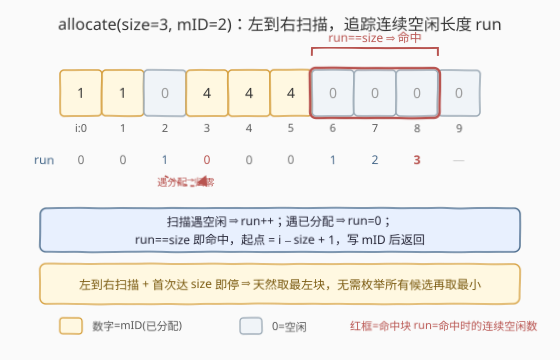
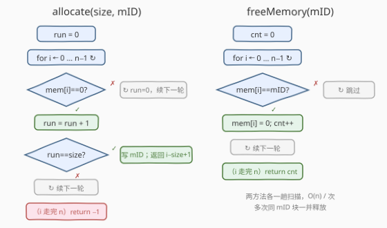
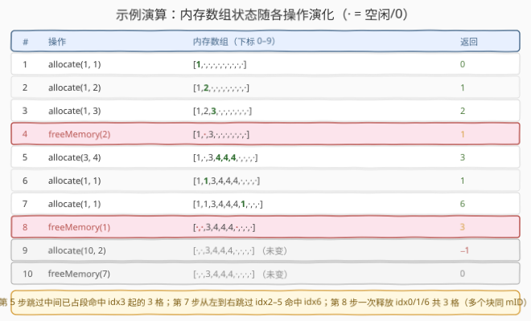

# LeetCode 设计内存分配器 题解

## 1. 题目概述

- **标题 / 题号**：设计内存分配器（#2502，medium）
- **链接**：https://leetcode.cn/problems/design-memory-allocator/
- **难度**：中等
- **标签**：设计、数组、模拟

**题意**：给定内存数组大小 $n$（下标从 $0$ 开始，初始全部空闲），实现一个内存分配器：

- `Allocator(int n)`：用大小为 $n$ 的内存数组初始化对象。
- `int allocate(int size, int mID)`：找出大小为 `size` 的**连续空闲**内存单元且位于**最左侧**的块，分配并赋 id `mID`。返回块的第一个下标；若不存在这样的块，返回 $-1$。
- `int freeMemory(int mID)`：释放 id `mID` 对应的**所有**内存单元（即便它们被分配在不同块中），返回释放的内存单元数目。

注意：多个块可分配到同一 `mID`；`freeMemory` 必须释放该 `mID` 的全部单元。

**示例**：

```text
输入：
["Allocator","allocate","allocate","allocate","freeMemory","allocate","allocate","allocate","freeMemory","allocate","freeMemory"]
[[10],[1,1],[1,2],[1,3],[2],[3,4],[1,1],[1,1],[1],[10,2],[7]]
输出：
[null,0,1,2,1,3,1,6,3,-1,0]
```

逐步解释（`·` 表示空闲）：

```text
Allocator(10)        // [·,·,·,·,·,·,·,·,·,·]
allocate(1,1) → 0    // [1,·,·,·,·,·,·,·,·,·]
allocate(1,2) → 1    // [1,2,·,·,·,·,·,·,·,·]
allocate(1,3) → 2    // [1,2,3,·,·,·,·,·,·,·]
freeMemory(2) → 1    // [1,·,3,·,·,·,·,·,·,·]   释放 mID=2 的 1 格
allocate(3,4) → 3    // [1,·,3,4,4,4,·,·,·,·]   跳过已占，命中 idx3 起 3 格
allocate(1,1) → 1    // [1,1,3,4,4,4,·,·,·,·]   复用刚释放的 idx1
allocate(1,1) → 6    // [1,1,3,4,4,4,1,·,·,·]   跳过 idx2–5，命中 idx6
freeMemory(1) → 3    // [·,·,3,4,4,4,·,·,·,·]   一次释放 idx0/1/6 共 3 格
allocate(10,2) → -1  // 无 10 格连续空闲
freeMemory(7) → 0    // 无 mID=7 的单元
```

**约束**：

- $1 \le n,\ \text{size},\ \text{mID} \le 1000$
- 最多调用 `allocate` 和 `freeMemory` 方法 $1000$ 次

> 💡 **关键约束读法**：$n \le 1000$ 且总调用 $\le 1000$ 次，意味着「每次操作花 $O(n)$」总共也就 $10^6$ 量级，完全跑得动。这把「最直接的数组模拟」从「暴力」抬到了「足够优」——不必一上来就上区间数据结构。下文先给最直接的数组解，再把「$n$ 放大到百万」时的空闲段维护作为进阶。

## 2. 解题思路

### 2.1 暴力思路：逐个起点枚举 + 内层逐格检查

最朴素的 `allocate` 写法：从左到右枚举每个候选起点 $i \in [0,\ n-\text{size}]$，对每个 $i$ 用一个内层循环检查 $\text{mem}[i..i+\text{size}-1]$ 是否**全部空闲**，首个满足的 $i$ 即答案：

```text
for i in 0..n-size:
    all_free = true
    for j in i..i+size-1:
        if mem[j] != 0: all_free = false; break
    if all_free: 写 mID; return i
return -1
```

正确性无误，`allocate` 为 $O(n \cdot \text{size})$，`freeMemory` 扫一遍数组 $O(n)$。约束下能 AC。但**冗余**明显：相邻候选起点 $i$ 与 $i+1$ 的检查区间高度重叠，对同一段已分配区域反复扫描。最坏情形（大段连续已占 + 末尾才有空位）下，外层 $n$ 次、内层 $\text{size}$ 次，做了大量无用功。

> ⚠️ 暴力法的浪费在「**每个起点都从零判定、不复用前一次的扫描信息**」。下文的核心观察正是把它压成单趟 $O(n)$。

### 2.2 核心观察：单趟扫描追踪连续空闲长度，最左性自然成立



把「枚举起点 + 内层检查」换成**一趟从左到右的扫描**，维护一个变量 `run` = 「以当前下标 $i$ 结尾的连续空闲段长度」：

- 若 $\text{mem}[i] = 0$（空闲）：`run += 1`；若此时 $\text{run} == \text{size}$，则下标 $[i-\text{size}+1,\ i]$ 恰是一段长度为 `size` 的连续空闲块——**且由于从左到右扫描、首次达到 size 即停**，它的起点 $i-\text{size}+1$ 必为所有可行块中最小者，即题目要求的「最左侧」。
- 若 $\text{mem}[i] \ne 0$（已分配）：该位置打断空闲段，`run = 0`，继续向右。

为什么这等价于暴力却更快？暴力对每个起点重算长度；本算法**把「以 $i$ 结尾的空闲段长度」作为一个状态在 $i$ 之间传递**——$\text{mem}[i]=0$ 时 `run` 接续上一格，$\text{mem}[i]\ne 0$ 时归零。一段连续空闲从内部任意位置看，`run` 都正确反映「到这里为止连了多少个空闲」，无需回头复查。于是 $O(n \cdot \text{size})$ 被压成 $O(n)$。

`freeMemory` 同理单趟扫一遍：遇到 $\text{mem}[i] = \text{mID}$ 就改 $0$ 并计数，返回计数。因「同一 mID 可散落在多个块」，必须扫**全数组**而非只清某个区间——$O(n)$ 是它的最优下界（每个被释放的格都要被访问一次）。

> 💡 **为什么用 0 作空闲标记安全？** 约束 $\text{mID} \ge 1$，故 0 永不与任何合法 mID 冲突，可放心当「空闲」哨兵。若题目允许 mID=0，则需另设一个 `free` 标记或用 `vector<int>` 配 `optional`/特殊值。

### 2.3 算法流程图



两方法都极短，核心是 `allocate` 的「**遇空闲 run++、遇已分配 run=0、run==size 即写 mID 返回起点**」与 `freeMemory` 的「**遇 mID 即置 0 计数**」：

```text
allocate(size, mID):
    run = 0
    for i = 0 .. n-1:
        if mem[i] == 0:
            run += 1
            if run == size:                 # 命中
                for j = i-size+1 .. i: mem[j] = mID
                return i - size + 1         # 起点（最左）
        else:
            run = 0                          # 已分配，归零
    return -1                               # 走完全程仍无 size 连续空闲

freeMemory(mID):
    cnt = 0
    for i = 0 .. n-1:
        if mem[i] == mID:
            mem[i] = 0
            cnt += 1
    return cnt
```

> ⚠️ **`run == size` 的判定时机**：必须在 `run` 自增到 `size` 的那一格就停（`if (++run == size)`），而非先自增再在下一轮判——后者会错过「块刚好结束于 $i$」的情形并多扫一格。起点 $i-\text{size}+1$ 在 $i$ 处即可算出，无需回头。

### 2.4 示例演算



沿用题目示例，重点看三步：

- **第 5 步 `allocate(3,4)`**：扫描到 $i=3$ 前，$i=0,1$ 已占（run 归零）、$i=2$ 已占；到 $i=3,4,5$ 连续三格空闲，`run` 从 $1\to2\to3$，在 $i=5$ 命中，起点 $5-3+1=3$。返回 $3$。可见它**自动跳过了 idx0–2 的已占段**，无需枚举起点。
- **第 7 步 `allocate(1,1)`**：$i=0..5$ 全已占（run 恒 0），$i=6$ 空闲 $\to$ `run=1==size` 命中，起点 $6$。返回 $6$。这是「最左性」的体现——尽管 idx7–9 也空闲，但扫描在 idx6 首次达 size 即停。
- **第 8 步 `freeMemory(1)`**：扫全数组，idx0、idx1、idx6 三处 mID=1 全部置 0，返回 $3$。印证「同一 mID 可分布在多个块，必须逐一释放」。

第 9 步 `allocate(10,2)`：全程 `run` 峰值为 $4$（idx6–9 四格空闲），永远到不了 $10$，扫完返回 $-1$；第 10 步 `freeMemory(7)` 无任何格等于 7，返回 $0$。

> 💡 **对照第 6 步与第 7 步**：同为 `allocate(1,1)`，第 6 步命中 idx1（当时 idx1 刚被第 4 步释放），第 7 步命中 idx6（idx1 此时已被重新占）。同样的调用因内存当前状态不同而落在不同起点——这正是「最左空闲块」随释放/分配动态变化的表现。

## 3. 参考代码

### C++

```cpp
class Allocator {
    vector<int> mem;            // mem[i] = mID；0 表示空闲
public:
    Allocator(int n) : mem(n, 0) {}

    int allocate(int size, int mID) {
        int run = 0;                       // 以 i 结尾的连续空闲长度
        for (int i = 0; i < (int)mem.size(); ++i) {
            if (mem[i] == 0) {
                if (++run == size) {        // 命中最左块
                    int start = i - size + 1;
                    for (int j = start; j <= i; ++j) mem[j] = mID;
                    return start;
                }
            } else {
                run = 0;                    // 已分配，归零
            }
        }
        return -1;
    }

    int freeMemory(int mID) {
        int cnt = 0;
        for (int& v : mem)
            if (v == mID) { v = 0; ++cnt; }
        return cnt;
    }
};
```

> 💡 **实现细节**：① `if (++run == size)` 把「自增」与「判定」合一，确保在 `run` 刚好到 `size` 的那格立即命中、立即算出 `start = i - size + 1`。② 写入用 `for (int j = start; j <= i; ++j)` 而非 `fill`，语义直白；块长即 `size`，写 `size` 次恰为 $O(\text{size})$，包含在扫描 $O(n)$ 之内。③ `freeMemory` 用 `for (int& v : mem)` 引用遍历，命中即原地改写，一趟完成。④ 0 作空闲哨兵依赖 $\text{mID} \ge 1$（约束保证）。

### Python

```python
class Allocator:
    def __init__(self, n: int):
        self.mem = [0] * n          # 0 = 空闲，否则存 mID

    def allocate(self, size: int, mID: int) -> int:
        run = 0
        for i, v in enumerate(self.mem):
            if v == 0:
                run += 1
                if run == size:     # 命中最左块
                    start = i - size + 1
                    for j in range(start, i + 1):
                        self.mem[j] = mID
                    return start
            else:
                run = 0             # 已分配，归零
        return -1

    def freeMemory(self, mID: int) -> int:
        cnt = 0
        for i, v in enumerate(self.mem):
            if v == mID:
                self.mem[i] = 0
                cnt += 1
        return cnt
```

> 💡 **对照 C++**：Python 无引用遍历，故用 `enumerate` 取下标 `i` 后 `self.mem[i] = 0` 原地改写。`freeMemory` 也可写成一行 `cnt = sum(1 for v in self.mem if v == mID)` 再 `self.mem = [0 if v == mID else v for v in self.mem]`，但那样扫两遍且重建列表，不如一趟原地改写。`allocate` 的 `run` 逻辑与 C++ 完全一致。

> ⚠️ **方法名**：leetcode.cn 的释放方法名为 `freeMemory`（早期/英文站曾用 `free`，因与 C 标准库 `free` 同名易混淆而改名）。提交时以题目代码模板的方法签名为准。

## 4. 复杂度分析

| 维度 | 复杂度 | 说明 |
|------|--------|------|
| `allocate` 时间 | $O(n)$ | 单趟扫描维护 `run`；命中即停，最坏扫到末尾；写入 `size` 格含在 $O(n)$ 内 |
| `freeMemory` 时间 | $O(n)$ | 单趟扫描，每个 mID 匹配格改写一次 |
| 构造时间 | $O(n)$ | 长度 $n$ 的数组初始化为 0 |
| 空间 | $O(n)$ | 长度 $n$ 的整数数组，无额外结构 |
| 对照：暴力 `allocate` | $O(n \cdot \text{size})$ | 每个候选起点内层重扫 `size` 格，区间重叠不复用 |

> 💡 **总量估算**：$n \le 1000$、调用 $\le 1000$ 次 $\Rightarrow$ 全程最坏 $\sum n \approx 10^6$ 次单元格访问，远低于时限。这是「约束温和时，最直接的 $O(n)$ 模拟即最优」的典型——不必上复杂数据结构徒增常数与代码量。

## 5. 扩展：维护空闲段集合，单次操作压到 $O(\log n)$

若把 $n$ 放大到百万、调用百万次，数组 $O(n)$ 每次 $\to 10^{12}$ 必超时。此时应**不再逐格存储**，而是维护**不相交的空闲段集合** + **每个 mID 的已分配段列表**：

- **空闲段集合** `free`：有序存放互不相交的空闲段 $[l, r]$（按 $l$ 排序）。初始为单个段 $[0,\ n-1]$。
- **已分配索引** `alloc[mID]`：记录该 mID 占用的所有段 $[l, r]$。

**`allocate(size, mID)`**：在有序 `free` 中找**第一个**长度 $\ge \text{size}$ 的段（其左端点即最左起点，由有序性保证）。设为 $[l, r]$，取 $[l,\ l+\text{size}-1]$ 分配：把 $[l, r]$ 从 `free` 删除，若仍有剩余（$\text{size} < r-l+1$）则插入 $[l+\text{size},\ r]$；在 `alloc[mID]` 记录 $[l,\ l+\text{size}-1]$；返回 $l$。若无段够长，返回 $-1$。

**`freeMemory(mID)`**：取出 `alloc[mID]` 的所有段，对每段 $[l, r]$ 计数 $r-l+1$ 并把它插回 `free`，**与左右相邻空闲段合并**（前驱段右端 $= l-1$ 则并、后继段左端 $= r+1$ 则并）。清空 `alloc[mID]`，返回总计数。

**复杂度**：`freeMemory` 为 $O(k \log F)$，$k$ 为该 mID 的段数、$F$ 为空闲段数（每段插入 + 合并是 $O(\log F)$）。`allocate` 取决于「找第一个够长段」的实现：

| 表示 | `allocate` | `freeMemory` | 内存 | 适用 |
|------|------------|--------------|------|------|
| **数组** `mem[i]`（本题主解） | $O(n)$ | $O(n)$ | $O(n)$ | $n \le 10^3$，简单直接 |
| **有序空闲段** `set<[l,r]>` | $O(F)$（扫到首个够长） | $O(k \log F)$ | $O(F+k)$ | $n$ 大、碎片少 |
| **长度索引 + 空闲段** `multiset<len>` + 段映射 | $O(\log F)$ | $O(k \log F)$ | $O(F+k)$ | $n$ 大、需最左最快 |

Python 空闲段维护的核心（合并相邻段）：

```python
from sortedcontainers import SortedList

# free: SortedList of [l, r]，不相交，按 l 升序
def free_one(free: SortedList, l: int, r: int) -> None:
    """把 [l, r] 还回 free，合并左右相邻空闲段。"""
    to_merge = []
    i = free.bisect_left([l, -1]) - 1          # 左邻候选（右端 == l-1）
    if i >= 0 and free[i][1] + 1 == l:
        to_merge.append(free[i])
    j = free.bisect_left([r + 1, -1])          # 右邻候选（左端 == r+1）
    if j < len(free) and free[j][0] == r + 1:
        to_merge.append(free[j])
    lo, hi = l, r
    for seg in to_merge:                       # 按值删除，避免下标漂移
        lo, hi = min(lo, seg[0]), max(hi, seg[1])
        free.discard(seg)
    free.add([lo, hi])
```

> 💡 **「最左」的保证**：有序空闲段集合按左端点排序，`allocate` 取**第一个**长度足够的段即天然最左；正如数组解里「左到右扫描 + 首次达 size 即停」天然最左。两种表示用不同手段实现同一条不变式。合并相邻段是经典区间操作，与 [56. 合并区间](../0001-0100/56_合并区间.md)、[57. 插入区间](../0001-0100/57_插入区间.md) 一脉相承。

## 6. 面试要点

1. **为什么左到右单趟扫描就能保证「最左侧」？**

   > 从左到右扫描时，`run` 在 $i$ 处首次达到 `size`，意味着 $[i-\text{size}+1,\ i]$ 是**扫描到 $i$ 为止**出现的第一段长度为 `size` 的连续空闲块。任何起点更小的可行块必然在更早的 $i'$ 处就使 `run` 达到 `size`，从而已被命中返回——故首次命中即最左。无需枚举所有可行块再取最小。

2. **`run` 何时归零？为什么不能只在「块被破坏」时处理？**

   > 遇到任意已分配格（$\text{mem}[i]\ne 0$）即 `run = 0`，因为连续空闲段在该格被打断。若只在「恰好破坏一个完整 size 块」时处理，会漏掉零散的单格空闲——例如 `mem=[1,0,1,0,0,0]` 中 idx1 的单格空闲 `run=1` 永远到不了 `size=3`，必须靠 idx2 的已占格把它归零，才能在 idx3–5 重新累计出 `run=3`。

3. **`freeMemory` 为什么必须扫全数组，而不是只清某个记录的区间？**

   > 题目允许「同一 mID 被分配到多个不同块」（示例第 8 步，mID=1 散落在 idx0/1/6）。释放要归还**全部**这些块，而它们的位置不连续。即便维护了 `alloc[mID]` 的段列表（进阶解），仍需遍历该 mID 的所有段逐段归还——数组主解则退化为「扫全数组逐格比对」，因为没存段索引。

4. **把 `allocate` 从 $O(n \cdot \text{size})$ 优化到 $O(n)$ 的关键一步是什么？**

   > **把「以 $i$ 结尾的连续空闲长度」作为状态在 $i$ 之间传递**，而不是每个起点重新从零算。`mem[i]==0` 时 `run` 接续上一格、`!=0` 时归零，使得任意位置的 `run` 都正确反映「到这里连了多少空闲」，消除对重叠区间的重复扫描。这是「用状态复用消除冗余」的经典范例。

5. **如果 $n$ 放大到 $10^9$、调用 $10^5$ 次但实际分配总量很小，怎么办？？**

   > 逐格数组不可行（$10^9$ 内存爆）。改用**有序空闲段集合**：只存「空闲段」而非每格，段数 $F$ 远小于 $n$。`allocate` 在集合里找第一个够长段 $O(F)$ 或经长度索引 $O(\log F)$；`freeMemory` 逐段归还并合并相邻 $O(k \log F)$。空间 $O(F+k)$ 与实际段数成正比、与 $n$ 无关——这正是第 5 节进阶解的动机：**稀疏场景下用「段」代替「格」**。

> 💡 **一句话总结**：用数组 `mem[i]` 存 mID（0=空闲），`allocate` 左到右单趟维护连续空闲长度 `run`、`run==size` 即命中返回起点（天然最左），`freeMemory` 单趟扫全数组改写并计数；两者均 $O(n)$，约束温和下即最优。$n$ 放大时换成有序空闲段集合，靠合并相邻段把单次压到对数级。

## 同类练习题

| # | 题目 | 与本题的关联 |
|---|------|-------------|
| 56 | [合并区间](https://leetcode.cn/problems/merge-intervals/)（[题解](../0001-0100/56_合并区间.md)） | 进阶解 `freeMemory` 把释放段插回后合并左右相邻空闲段，直接对应区间合并 |
| 57 | [插入区间](https://leetcode.cn/problems/insert-interval/)（[题解](../0001-0100/57_插入区间.md)） | 释放一段等价于向空闲段集合插入新区间并处理重叠/合并 |
| 352 | [将数据流变为多个不相交区间](https://leetcode.cn/problems/data-stream-as-disjoint-intervals/)（[题解](../0301-0400/352_将数据流变为多个不相交区间.md)） | 维护一组有序不相交区间并支持查询，正是空闲段集合的核心数据结构 |
| 715 | [Range 模块](https://leetcode.cn/problems/range-module/)（[题解](../0701-0800/715_Range模块.md)） | 区间集合的增删查设计，对照「按 mID 管理已分配段」与「按值域管理区间」两种区间数据结构运用 |
| 729 | [我的日程安排 I](https://leetcode.cn/problems/my-calendar-i/)（[题解](../0701-0800/729_我的日程安排表I.md)） | 判定新区间与已有区间是否相交，与 `allocate`「找一段连续空闲」互为对偶——一个是找空位、一个是判冲突 |
