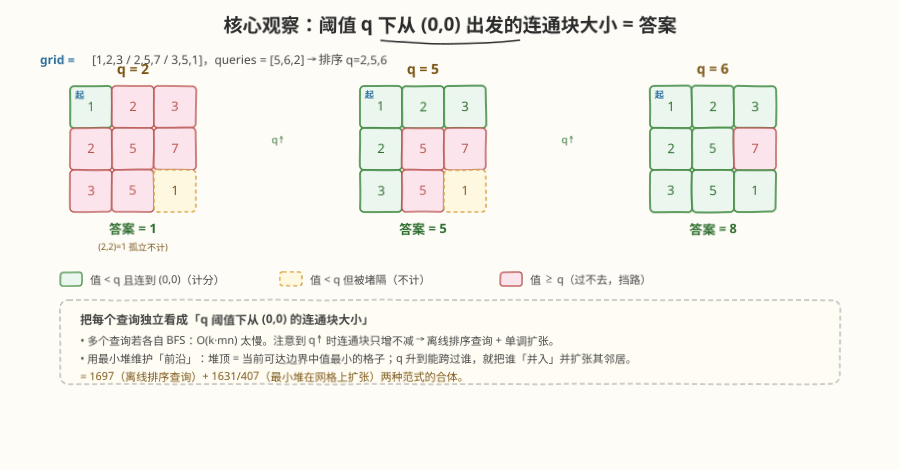
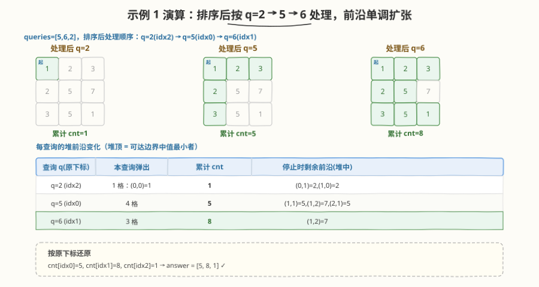

# 矩阵查询可获得的最大分数

- **题目名称**：矩阵查询可获得的最大分数
- **链接**：[2503. 矩阵查询可获得的最大分数](https://leetcode.cn/problems/maximum-number-of-points-from-grid-queries/)
- **难度**：困难
- **标签**：图、堆/优先队列、广度优先搜索、离线查询、排序、并查集

## 1. 题目概述

给你一个 `m x n` 的整数矩阵 `grid` 和一个大小为 `k` 的数组 `queries`。对每个 `queries[i]`，从矩阵**左上角** `(0,0)` 出发，重复以下过程：

- 若 `queries[i]` **严格大于**当前所处单元格的值，且该单元格是**第一次访问**，则得 `1` 分，并可向上下左右任一相邻单元格移动；
- 否则，不能得分并结束（这一路的探索）。

过程结束后，`answer[i]` 是能获得的最大分数。对每个查询可重复访问同一单元格。返回结果数组 `answer`。

> 💡 **题意转译**：把"得分 + 可移动"理解为"只有值 `< q` 的格子才能落脚并继续走"。于是对阈值 $q$，答案 = **从 `(0,0)` 出发、只经过值 $< q$ 的格子所能到达的不同格子数**，即由"值 $< q$ 的格子"诱导的子图中 `(0,0)` 所在连通块的大小。若 `grid[0][0] >= q` 则答案为 `0`。

**示例 1**：

```text
输入：grid = [[1,2,3],[2,5,7],[3,5,1]], queries = [5,6,2]
输出：[5,8,1]
解释：
  q=5 → 可达 {(0,0),(0,1),(0,2),(1,0),(2,0)} = 5 格（(1,1)=5 不 <5 挡路，(2,2)=1 被隔离）
  q=6 → 除 (1,2)=7 外全部连通 = 8 格
  q=2 → 仅 (0,0)=1 = 1 格
```

**示例 2**：

```text
输入：grid = [[5,2,1],[1,1,2]], queries = [3]
输出：[0]
解释：左上角 grid[0][0]=5 >= 3，起脚就被挡，得 0 分。
```

**约束条件**：

- `m == grid.length`，`n == grid[i].length`
- $2 \le m, n \le 1000$，$4 \le m \times n \le 10^5$
- $k = \text{queries.length}$，$1 \le k \le 10^4$
- $1 \le \text{grid[i][j]}, \text{queries[i]} \le 10^6$

> ⚠️ 关键规模：$mn \le 10^5$、$k \le 10^4$。若对每个查询独立 BFS，复杂度 $O(k \cdot mn) = 10^9$ 会超时——必须让查询之间**复用**计算结果。

---

## 2. 解题思路

### 2.1 暴力思路：每个查询独立 BFS

最直白的做法：对每个 `queries[i] = q`，从 `(0,0)` 做一次 BFS/DFS，只踏入值 `< q` 的格子，统计能到达的格子数。单次 $O(mn)$，$k$ 次共 $O(k \cdot mn)$，在 $k=10^4$、$mn=10^5$ 时约 $10^9$，**会超时**。

> ⚠️ 暴力的根因是"把 $k$ 个查询当成彼此无关"。但观察到一个单调性：阈值 $q$ 越大，能落脚的格子越多 → `(0,0)` 的连通块**只增不减**。若把查询按 $q$ **升序**处理，大 $q$ 的答案可直接在大一档的"已扩张区域"上继续累加，无需从头 BFS。

### 2.2 核心观察：阈值单调 + 最小堆前沿



三个观察层层递进：

1. **题意归约为连通块**：对阈值 $q$，答案 = 由"值 $< q$ 的格子"诱导的子图中 `(0,0)` 所在连通块大小（`grid[0][0] >= q` 时为 `0`）。得分 = 可到达的不同格子数。

2. **阈值单调 → 离线排序查询**：$q_1 < q_2 \Rightarrow$ 值 $< q_1$ 的格子 $\subseteq$ 值 $< q_2$ 的格子，故 $q_2$ 的连通块 $\supseteq$ $q_1$ 的连通块。把查询按 $q$ **升序**、带着原下标排序后处理，已"并入"的区域可跨查询复用，答案单调不减。这与 [1697. 检查边长度限制的路径是否存在](../1601-1700/1697_检查边长度限制的路径是否存在.md) 的"离线排序 + 单调扩张"同构。

3. **最小堆维护"前沿"**：用一个**按格子值排序的最小堆**存放"已与 `(0,0)` 相邻、但尚未被阈值跨过的边界格子"。处理查询 $q$ 时，只要堆顶格子的值 $< q$，就弹出它（并入得分区域）、并把它未访问的 4 邻压入堆。堆顶永远是"当前可达边界中值最小的格子"——它决定了下一个能被跨过的阈值。这是 [1631. 最小体力消耗路径](../1601-1700/1631_最小体力消耗路径.md) / [407. 接雨水 II](../0401-0500/407_接雨水II.md) 那种"最小堆在网格上扩张"的范式。

> 💡 **一句话**：2503 = **1697（离线排序查询）+ 1631/407（最小堆在网格上扩张）**两种范式的合体。排序查询提供"单调复用"，最小堆提供"按值渐进扩张"。

### 2.3 算法流程


1. **排序查询**：把 `queries` 按 $q$ 升序、带原下标排序，得处理顺序 `order`。
2. **初始化堆**：`visited[0][0] = true`，最小堆 `pq = [(grid[0][0], 0, 0)]`，`cnt = 0`。
3. **逐查询扩张**：对 `order` 中每个下标 $i$（对应 $q = \text{queries}[i]$）：
   - `while pq 非空 且 pq.top().value < q`：弹出 $(v,r,c)$，`cnt++`；把其未访问的 4 邻标 `visited` 并压入堆。
   - `answer[i] = cnt`。
4. **返回** `answer`（按原下标填回）。

> 💡 **为什么是对的？** 堆按格子值排序，弹出格子 $n$（值 $v_n < q$）时，它必由某个**已弹出**的邻居推入堆——而已弹出的邻居存在一条从 `(0,0)` 出发、全程值 $< q$ 的路径。归纳地，$n$ 也可经此路径到达，故 $n$ 确实属于 $q$ 阈值下 `(0,0)` 的连通块。又查询升序处理，已弹区域只增不减，堆与 `cnt` 跨查询复用、无需重置。

### 2.4 示例演算



以示例 1 `grid = [[1,2,3],[2,5,7],[3,5,1]]`、`queries = [5,6,2]` 演算。排序后处理顺序为 $q=2(\text{idx }2) \to q=5(\text{idx }0) \to q=6(\text{idx }1)$：

| 查询 $q$（原下标） | 本查询弹出 | 累计 `cnt` | 停止时剩余前沿（堆中） |
|---|---|---|---|
| $q=2$（idx 2） | 1 格：$(0,0)=1$ | $1$ | $(0,1)=2,\ (1,0)=2$（均 $\ge 2$，停） |
| $q=5$（idx 0） | 4 格：$(0,1),(1,0),(0,2),(2,0)$ | $5$ | $(1,1)=5,\ (1,2)=7,\ (2,1)=5$（均 $\ge 5$，停） |
| $q=6$（idx 1） | 3 格：$(1,1),(2,1),(2,2)$ | $8$ | $(1,2)=7$（$\ge 6$，停） |

注意 $q=6$ 这一步：弹出 $(2,1)=5$ 时把其未访问邻居 $(2,2)=1$ 压入堆，随后堆顶变成 $(2,2)=1 < 6$ 继续弹出——**较小值的格子可能在扩张后期才被发现**，但只要它能在阈值内被跨过就一定会被弹出。最终按原下标还原：`answer = [5, 8, 1]` ✓。

---

## 3. 参考代码

### C++

```cpp
class Solution {
public:
    vector<int> maxPoints(vector<vector<int>>& grid, vector<int>& queries) {
        int m = grid.size(), n = grid[0].size(), k = queries.size();
        vector<int> order(k);
        iota(order.begin(), order.end(), 0);
        sort(order.begin(), order.end(),
             [&](int a, int b) { return queries[a] < queries[b]; });  // 按 q 升序带原下标

        vector<int> ans(k, 0);
        vector<vector<char>> visited(m, vector<char>(n, 0));
        visited[0][0] = 1;
        // 最小堆：(格子值, r, c)
        priority_queue<tuple<int,int,int>, vector<tuple<int,int,int>>, greater<>> pq;
        pq.push({grid[0][0], 0, 0});
        int cnt = 0;
        int dr[] = {1, -1, 0, 0}, dc[] = {0, 0, 1, -1};

        for (int i : order) {
            int q = queries[i];
            while (!pq.empty() && get<0>(pq.top()) < q) {     // 堆顶值 < q：并入并扩张
                auto [v, r, c] = pq.top(); pq.pop();
                cnt++;
                for (int d = 0; d < 4; ++d) {
                    int nr = r + dr[d], nc = c + dc[d];
                    if (nr >= 0 && nr < m && nc >= 0 && nc < n && !visited[nr][nc]) {
                        visited[nr][nc] = 1;                 // 入堆时即标记，避免重复入堆
                        pq.push({grid[nr][nc], nr, nc});
                    }
                }
            }
            ans[i] = cnt;                                     // 按原下标填回
        }
        return ans;
    }
};
```

> 💡 **几个细节**：(1) `visited` 在**入堆时**标记而非出堆时，使每个格子至多入堆一次，总堆操作 $O(mn)$。(2) 堆里允许存在"值 $\ge$ 当前 $q$"的格子——它们是已发现的可达边界，只是阈值还没跨过，留待更大查询时弹出。(3) `cnt` 跨查询**不重置**，靠查询升序保证单调累加。(4) 结构化绑定 `auto [v,r,c] = pq.top()` 要求 C++17 及以上。

### Python

```python
class Solution:
    def maxPoints(self, grid: List[List[int]], queries: List[int]) -> List[int]:
        m, n = len(grid), len(grid[0])
        k = len(queries)
        order = sorted(range(k), key=lambda i: queries[i])   # 按 q 升序带原下标
        ans = [0] * k
        visited = [[False] * n for _ in range(m)]
        visited[0][0] = True
        pq = [(grid[0][0], 0, 0)]                             # 最小堆：(格子值, r, c)
        cnt = 0
        for i in order:
            q = queries[i]
            while pq and pq[0][0] < q:                       # 堆顶值 < q：并入并扩张
                v, r, c = heapq.heappop(pq)
                cnt += 1
                for dr, dc in ((1, 0), (-1, 0), (0, 1), (0, -1)):
                    nr, nc = r + dr, c + dc
                    if 0 <= nr < m and 0 <= nc < n and not visited[nr][nc]:
                        visited[nr][nc] = True               # 入堆时即标记
                        heapq.heappush(pq, (grid[nr][nc], nr, nc))
            ans[i] = cnt                                      # 按原下标填回
        return ans
```

> 💡 `heapq` 是最小堆，`pq[0][0]` 即堆顶格子值，天然符合"按格子值排序"的需求。Python 元组比较自动按首元素（值）排序，无需自定义比较器。

---

## 4. 复杂度分析

| 维度 | 复杂度 | 说明 |
|------|--------|------|
| **时间** | $O(mn \log(mn) + k \log k)$ | 每格至多入堆/出堆各一次，共 $O(mn)$ 次堆操作，每次 $O(\log(mn))$；排序查询 $O(k \log k)$。$mn \le 10^5$、$k \le 10^4$，约 $10^5 \log$ 级别，轻松通过 |
| **空间** | $O(mn)$ | `visited` 矩阵 $O(mn)$；堆至多存 $O(mn)$ 个格子 |
| 对照：逐查询独立 BFS | $O(k \cdot mn) = O(10^9)$ | 把 $k$ 个查询当彼此无关，重复扫整个网格，超时 |

> 💡 `while` 嵌在查询循环里，但**均摊分析**：每个格子一生只出堆一次，`while` 的总弹出次数 $\le mn$；查询循环本身的堆顶检查是 $O(1)$，共 $O(k)$。故总时间由"堆操作 + 排序"主导，而非"查询数 × 网格大小"。

---

## 5. 扩展：并查集 + 离线排序查询

最小堆维护"前沿"之外，还有另一种等价写法——**并查集**，它与 [1697](../1601-1700/1697_检查边长度限制的路径是否存在.md) 的骨架完全一致，只是把"边"换成了"网格相邻关系"。

### 5.1 思路

1. 把所有格子按值升序排序（值相同的可任意序）。
2. 查询按 $q$ 升序、带原下标排序。
3. 维护一个指针扫格子序列。对每个查询 $q$：**激活**所有值 $< q$ 的格子——激活某格时，把它与**已激活的** 4 邻 `union`（按大小合并）。
4. 若 `(0,0)` 已激活，`answer = size[root(0,0)]`；否则 `answer = 0`。

> 💡 **两种写法的关系**：最小堆版是"**主动扩张**"——从 `(0,0)` 出发只把真正相邻的边界格子推进堆；并查集版是"**全局激活**"——把所有值 $< q$ 的格子一次性点亮再连边。前者只碰可达格子（更省，且天然给出"连通到 `(0,0)`"的语义），后者要碰全部值 $< q$ 的格子但实现更接近模板。两者复杂度同阶，**面试首选最小堆版**（语义直白、无需排序全部格子）。

### 5.2 参考代码（并查集版）

```cpp
class Solution {
    vector<int> parent, sz;
    int find(int x) { return parent[x] == x ? x : parent[x] = find(parent[x]); }
    void unite(int a, int b) {
        a = find(a); b = find(b);
        if (a == b) return;
        if (sz[a] < sz[b]) swap(a, b);
        parent[b] = a; sz[a] += sz[b];
    }
public:
    vector<int> maxPoints(vector<vector<int>>& grid, vector<int>& queries) {
        int m = grid.size(), n = grid[0].size(), k = queries.size();
        int N = m * n;
        parent.resize(N); sz.assign(N, 1);
        iota(parent.begin(), parent.end(), 0);

        vector<array<int,3>> cells(N);               // (值, r, c)
        for (int r = 0; r < m; ++r)
            for (int c = 0; c < n; ++c)
                cells[r * n + c] = {grid[r][c], r, c};
        sort(cells.begin(), cells.end());             // 按值升序

        vector<int> order(k);
        iota(order.begin(), order.end(), 0);
        sort(order.begin(), order.end(),
             [&](int a, int b) { return queries[a] < queries[b]; });

        vector<int> ans(k, 0);
        vector<char> active(N, 0);
        int dr[] = {1,-1,0,0}, dc[] = {0,0,1,-1};
        int p = 0;                                    // 格子指针
        for (int i : order) {
            int q = queries[i];
            while (p < N && cells[p][0] < q) {        // 激活所有值 < q 的格子
                int r = cells[p][1], c = cells[p][2], id = r * n + c;
                active[id] = 1;
                for (int d = 0; d < 4; ++d) {
                    int nr = r + dr[d], nc = c + dc[d], nid = nr * n + nc;
                    if (nr >= 0 && nr < m && nc >= 0 && nc < n && active[nid])
                        unite(id, nid);               // 与已激活邻居连边
                }
                p++;
            }
            if (active[0]) ans[i] = sz[find(0)];      // (0,0) 已激活 → 其连通块大小
            else ans[i] = 0;
        }
        return ans;
    }
};
```

> ⚠️ 并查集版需排序全部 $mn$ 个格子（$O(mn \log(mn))$），且要给每个格子判 4 邻是否已激活。最小堆版只需排序 $k$ 个查询、堆中只放可达边界，常数更优。**主解选最小堆版，并查集版作对照与迁移练习**（1697 的网格镜像）。

---

## 6. 面试要点

1. **为什么不能每个查询独立 BFS？怎么把 $O(k \cdot mn)$ 降下来？**

   > 独立 BFS 把 $k$ 个查询当彼此无关，重复扫网格。关键观察是**阈值单调**：$q$ 越大连通块越大，故把查询按 $q$ **升序**离线处理，让大 $q$ 在小 $q$ 已扩张区域上继续累加。这把"每查询重扫"变成"全网格只扫一遍 + 查询单调追加"，从 $O(k \cdot mn)$ 降到 $O(mn \log mn + k \log k)$。

2. **最小堆里存的是什么？为什么按"格子值"排序而不是按别的？**

   > 存的是"已与 `(0,0)` 相邻、但阈值还没跨过的边界格子"。按**格子值**排序，使堆顶 = 当前可达边界中值最小的格子——它就是下一个能被某更大 $q$ 跨过的格子。处理查询 $q$ 时弹出所有值 $< q$ 的堆顶并入区域。这与 Dijkstra"按距离松弛"同构，只是这里的"边权"是被进入格子的值。

3. **为什么弹出某格子时，它能保证从 (0,0) 经 `< q` 的路径可达？**

   > 归纳：`(0,0)` 出发，弹出格子 $n$（值 $v_n < q$）必由某**已弹出**邻居推入。已弹邻居存在从 `(0,0)` 出发、全程值 $< q$（因都 $< q_c \le q$）的路径，$n$ 是其邻居且 $v_n < q$，故 $n$ 也可经此路径到达。又堆按值升序弹出，保证"推入 $n$ 的邻居"其值 $\le v_n$ 已先弹出。

4. **`visited` 何时标记？为什么不在出堆时标记？**

   > 在**入堆时**标记。若推迟到出堆时标记，同一格子可被多个邻居重复推入堆，堆中存大量重复项，总操作退化为 $O(4 \cdot mn \log)$ 仍可行但常数变大、还可能爆内存。入堆即标记使每格至多入堆一次，总堆操作严格 $O(mn)$。

5. **查询升序处理后，`cnt` 和堆为什么不重置？**

   > 阈值单调保证已并入区域只增不减：$q_2 > q_1$ 时，$q_1$ 弹出的格子仍是 $q_2$ 阈值下 `(0,0)` 连通块的一部分。故 `cnt` 直接累加、堆中残留的"值 $\ge q_1$ 但 $< q_2$"的边界格子继续为 $q_2$ 服务，无需重置。这正是"离线复用"的核心收益。

6. **最小堆版和并查集版的取舍？**

   > 最小堆版只碰**可达**格子、只排序 $k$ 个查询，语义直白（天然表达"连通到 `(0,0)"）、常数小，**面试首选**。并查集版需排序全部 $mn$ 个格子并给每个判 4 邻激活，但写法与 [1697](../1601-1700/1697_检查边长度限制的路径是否存在.md) 完全同构，便于迁移理解；当题目问的不是"从某固定点出发"而是"任意两点是否连通"时（如 1697），并查集更合适。

> 💡 **一句话总结**：2503 把"每个查询独立 BFS"塌缩为"离线排序查询 + 最小堆前沿单调扩张"——阈值单调让答案跨查询复用、最小堆让可达区域按格子值渐进生长，每种范式各取一半（1697 的离线复用 + 1631/407 的堆扩张），$O(mn \log mn + k \log k)$ 一趟完成。

---

## 7. 同类练习题

- [1697. 检查边长度限制的路径是否存在](https://leetcode.cn/problems/checking-existence-of-edge-length-limited-paths/)（[题解](../1601-1700/1697_检查边长度限制的路径是否存在.md)）：本题离线排序查询范式的母题。按限制升序 + 并查集单调连边，对照本题"按 $q$ 升序 + 堆单调扩张"
- [1631. 最小体力消耗路径](https://leetcode.cn/problems/path-with-minimum-effort/)（[题解](../1601-1700/1631_最小体力消耗路径.md)）：最小堆在网格上扩张的招牌题，堆顶 = 当前边界最小"代价"，与本题堆语义同构
- [407. 接雨水 II](https://leetcode.cn/problems/trapping-rain-water-ii/)（[题解](../0401-0500/407_接雨水II.md)）：3D 接雨水，最小堆维护边界水位从外向内扩张，同"堆在网格上扩张"骨架
- [743. 网络延迟时间](https://leetcode.cn/problems/network-delay-time/)（[题解](../0701-0800/743_网络延迟时间.md)）：堆优化 Dijkstra 单源最短路，"按距离松弛"与本题"按格子值扩张"同属最小堆贪心扩张范式
- [778. 水位上升的泳池中游泳](https://leetcode.cn/problems/swim-in-rising-water/)（[题解](../0701-0800/778_水位上升的泳池中游泳.md)）：水位阈值单调上升 + 最小堆/二分并查集求从左上到右下何时连通，与本题"阈值 + 网格连通"主题同源
