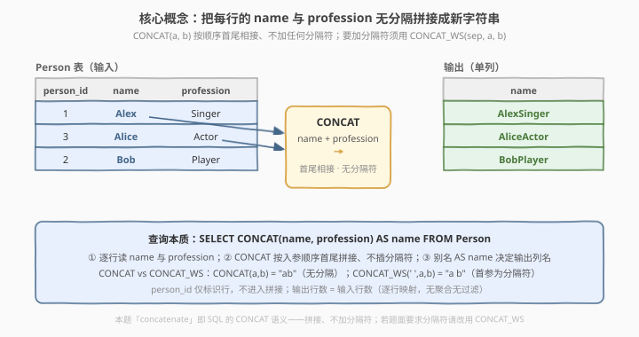
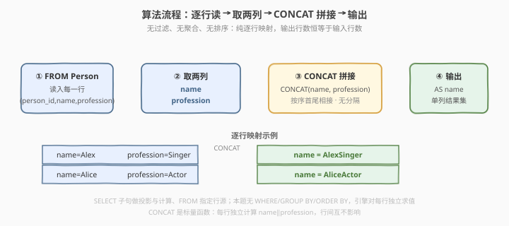
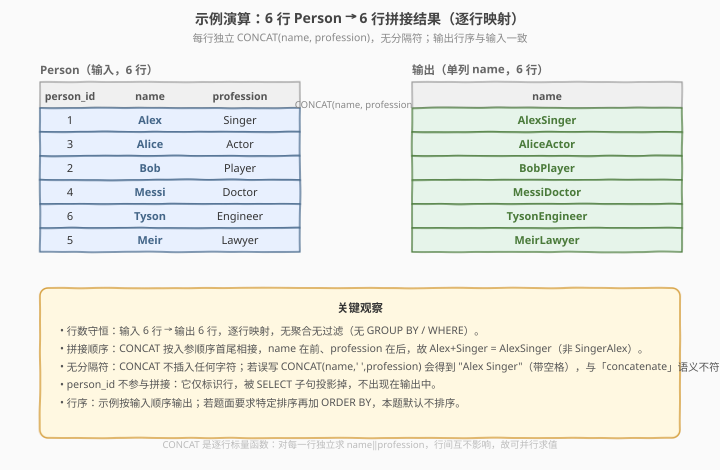

# 把名字和职业联系起来

- **题目名称**：把名字和职业联系起来
- **链接**：[2504. 把名字和职业联系起来 🔒](https://leetcode.cn/problems/concatenate-the-name-and-the-profession/)
- **难度**：简单
- **标签**：数据库、SQL、`CONCAT`、字符串拼接、投影、逐行映射、LeetCode 锁题

## 1. 题目概述

给定 `Person` 表，每行记录一个人的 `person_id`、`name`（姓名）与 `profession`（职业，取自固定枚举）。编写解决方案，把每个人的**姓名与职业拼接**成一条字符串返回。

**表结构**：

```text
Table: Person
+-------------+-----------------------------------------------------------+
| Column Name | Type                                                      |
+-------------+-----------------------------------------------------------+
| person_id   | int                                                       |  ← 主键
| name        | varchar(30)                                               |
| profession  | ENUM('Doctor','Singer','Actor','Player','Engineer','Lawyer')|
+-------------+-----------------------------------------------------------+
person_id 是该表的主键（具有唯一值的列）。
该表的每一行包含一个人的姓名与其职业。
profession 限定为六种职业之一。
```

> ⚠️ **本题是 LeetCode Plus 会员锁题**，官方题面在站内需会员权限查看。本篇题面依据 LeetCode 公开接口（`mysqlSchemas` 与 `sampleTestCase`）还原：表结构与示例数据即下文所示，题意为「把每行的 `name` 与 `profession` 拼接成一条字符串、输出为单列」。题面标题中的 **"concatenate"** 即 SQL `CONCAT` 的语义——按入参顺序首尾相接、**不插入任何分隔符**；要加分隔符须改用 `CONCAT_WS(sep, ...)`。

**示例 1**：

```text
输入：
Person 表:
+-----------+--------+-----------+
| person_id | name   | profession|
+-----------+--------+-----------+
| 1         | Alex   | Singer    |
| 3         | Alice  | Actor     |
| 2         | Bob    | Player    |
| 4         | Messi  | Doctor    |
| 6         | Tyson  | Engineer  |
| 5         | Meir   | Lawyer    |
+-----------+--------+-----------+

输出：
+----------------+
| name           |
+----------------+
| AlexSinger     |
| AliceActor     |
| BobPlayer      |
| MessiDoctor    |
| TysonEngineer  |
| MeirLawyer     |
+----------------+
解释：
每行把 name 与 profession 首尾相接拼接：Alex + Singer → AlexSinger，依此类推。
person_id 不参与拼接，仅用于标识行，故不出现在输出中。
```

**约束条件**：

- `person_id` 为表主键，行唯一。
- `name` 长度 `1..30`；`profession` 取值限定为六种职业枚举之一。
- 结果返回单列 `name`，每行是对应人员的 `name‖profession` 拼接串；**行序可与输入不同**（SQL 无 `ORDER BY` 时不保证顺序，题面允许任意顺序）。

> 💡 **审题关键**：① **"concatenate" = 无分隔拼接**——SQL `CONCAT(a, b)` 把入参按顺序首尾相接、不加任何字符，故 `Alex`+`Singer` = `AlexSinger` 而非 `Alex Singer`；② **逐行映射**——无 `WHERE` 过滤、无 `GROUP BY` 聚合，输出行数恒等于输入行数，每行独立求 `CONCAT(name, profession)`；③ **`person_id` 不参与拼接**——它仅标识行，被 `SELECT` 投影掉，不出现在结果中。

---

## 2. 解题思路

### 2.1 暴力思路：应用层循环拼接

最直觉的过程式思维：取出每行的 `name` 与 `profession`，在应用层逐行字符串拼接后输出。

```text
for row in Person:
    emit row.name + row.profession      # 字符串 + 拼接
```

逻辑完全正确——而 SQL 恰有声明式表达「逐行字符串拼接」的招牌函数：**`CONCAT`**。把每行的两列喂给 `CONCAT`，一句即得全部结果行。

### 2.2 核心观察：CONCAT 逐行无分隔拼接



把题意落到 SQL 机制上：

| 题意要求 | SQL 机制 | 语义 |
|----------|----------|------|
| 「每行的 name 与 profession」 | `FROM Person` | 行源，逐行处理 |
| 「拼接成一条字符串」 | `CONCAT(name, profession)` | 按入参顺序首尾相接、无分隔符 |
| 「单列输出」 | `SELECT ... AS name` | 投影为名为 `name` 的单列 |

形式化地，设第 $i$ 行的姓名为 $n_i$、职业为 $p_i$，则输出第 $i$ 行为

$$
\text{out}_i \;=\; n_i \,\|\, p_i \;=\; \text{CONCAT}(n_i,\, p_i)
$$

其中 $\|$ 表字符串拼接。输出行数 $= n$（输入行数），逐行映射、无聚合无过滤。

> 💡 **为什么用 `CONCAT` 而非 `||` 或 `CONCAT_WS`？** MySQL 的 `CONCAT(a, b)` 把入参按顺序首尾相接、**不加任何分隔符**，正是题面 "concatenate" 的字面语义（`Alex`+`Singer` = `AlexSinger`）。`CONCAT_WS(sep, a, b)` 是 "With Separator"——首参为分隔符、插在每两个入参之间（`CONCAT_WS(' ', name, profession)` = `Alex Singer`），与本题要求不符。`||` 是 SQL 标准的拼接运算符，MySQL 需 `SET sql_mode='PIPES_AS_CONCAT'` 才把 `||` 当拼接（默认 `||` 是逻辑或），可移植性差，故 MySQL 下首选 `CONCAT`。

> ⚠️ **常见误区**：把 "concatenate" 误读为「带空格连接」，从而写 `CONCAT(name, ' ', profession)`，得到 `Alex Singer`（带空格），与题面语义及示例输出矛盾。审题抓住 "concatenate = 无分隔拼接" 即可避免；若题面明文要求分隔符，再换 `CONCAT_WS`。

### 2.3 算法流程



**逻辑执行步骤**：

| 步骤 | 子句 | 作用 |
|------|------|------|
| ① | `FROM Person` | 行源：逐行读入 `(person_id, name, profession)` |
| ② | 取 `name`、`profession` 两列 | 选出参与拼接的两个操作数 |
| ③ | `CONCAT(name, profession)` | 标量函数：按序首尾相接、无分隔，如 `AlexSinger` |
| ④ | `SELECT ... AS name` | 投影为单列 `name`，输出结果集 |

> 💡 **无 `WHERE` / `GROUP BY` / `ORDER BY`**：本题无过滤（所有行都保留）、无聚合（每行独立输出）、题面允许任意行序（无需排序）。`SELECT` 子句做投影与计算、`FROM` 指定行源，两句即足。`CONCAT` 是标量函数，对每一行独立求值，行间互不影响。

### 2.4 示例演算

以示例 1 的 6 行 `Person` 为例，走一遍逐行拼接过程：



| person_id | name   | profession | CONCAT(name, profession) |
|-----------|--------|------------|---------------------------|
| 1         | Alex   | Singer     | `AlexSinger`              |
| 3         | Alice  | Actor      | `AliceActor`              |
| 2         | Bob    | Player     | `BobPlayer`               |
| 4         | Messi  | Doctor     | `MessiDoctor`             |
| 6         | Tyson  | Engineer   | `TysonEngineer`           |
| 5         | Meir   | Lawyer     | `MeirLawyer`              |

- 6 行输入 → 6 行输出，行数守恒（无聚合无过滤）；
- 拼接顺序固定为 `name` 在前、`profession` 在后（`CONCAT` 按入参顺序），故得 `AlexSinger` 而非 `SingerAlex`；
- `person_id` 仅标识行、不参与拼接，故不在输出中。

> 💡 **无分隔符的验证**：`Alex`+`Singer` = `AlexSinger`（中间无空格无连字符）。若误加 `' '` 得 `Alex Singer`，与示例输出逐行比对即可发现不符——**以示例输出为准**。

---

## 3. 参考代码

### SQL（解法 A：`CONCAT` 函数，推荐）

```sql
# Write your MySQL query statement below
SELECT CONCAT(name, profession) AS name
FROM Person;
```

> 💡 **写法要点**：
> - `CONCAT(name, profession)`：按入参顺序首尾相接、不插分隔符，得 `AlexSinger`。`CONCAT` 是 MySQL 标量字符串函数，自动把数值/日期等入参转为字符串再拼接。
> - `AS name`：把拼接结果命名为 `name`，与题面要求的输出列名对齐（复用输入列名 `name`，LeetCode 单列输出常见做法）。若题面要求别的列名，改 `AS` 后的别名即可。
> - 无 `WHERE` / `GROUP BY` / `ORDER BY`：所有行保留、无聚合、顺序任意。
> - 行数 = 输入行数，逐行映射。

### SQL（解法 B：`||` 标准拼接运算符）

```sql
SELECT name || profession AS name
FROM Person;
```

> ⚠️ **`||` 的可移植性**：`||` 是 SQL 标准（PostgreSQL/Oracle/SQLite）的字符串拼接运算符。但 **MySQL 默认把 `||` 当作逻辑或（`OR`）**，需先 `SET sql_mode = 'PIPES_AS_CONCAT';` 才把 `||` 解释为拼接。MySQL 下首选 `CONCAT`；若题面明确跨库（PostgreSQL/Oracle），`||` 写法更可移植。

### SQL（解法 C：若题面要求带分隔符，用 `CONCAT_WS`）

```sql
SELECT CONCAT_WS(' ', name, profession) AS name
FROM Person;
```

> 💡 **`CONCAT_WS(sep, a, b)` = With Separator**：首参为分隔符，插在每两个入参之间，得 `Alex Singer`（带空格）。本题 "concatenate" 语义为无分隔，故主解用解法 A；此解法仅作「若题面改要求分隔符」时的对照，便于一秒切换。

### Python（pandas）

```python
import pandas as pd

def concatenate_info(person: pd.DataFrame) -> pd.DataFrame:
    result = person['name'] + person['profession']
    return result.to_frame(name='name')
```

> 💡 **pandas 对照**：
> - `person['name'] + person['profession']`：pandas `Series` 的 `+` 对字符串做逐元素拼接（等价 SQL `CONCAT`，无分隔），按行对齐。
> - `.to_frame(name='name')`：把 `Series` 转为单列 `name` 的 `DataFrame`，与 SQL `AS name` 对齐。
> - 无 `merge`/`groupby`/`filter`：纯逐行映射，行数与索引不变。若需带分隔符，写 `person['name'] + ' ' + person['profession']`。

---

## 4. 复杂度分析

| 维度 | 解法 A（`CONCAT`） | 解法 B（`||`） | pandas |
|------|--------------------|----------------|--------|
| **时间** | $O(n \cdot \ell)$ | $O(n \cdot \ell)$ | $O(n \cdot \ell)$ |
| **空间** | $O(n \cdot \ell)$（输出） | $O(n \cdot \ell)$ | $O(n \cdot \ell)$ |
| **写法** | MySQL 标量函数，一行搞定 | 标准运算符，跨库可移植 | DataFrame 逐元素拼接 |
| **推荐度** | ✓ MySQL 首选 | ✓ 跨库场景 | ✓ 验证用 |

> - $n$ = `Person` 表行数，$\ell$ = 拼接后字符串平均长度（$\ell \approx |name| + |profession|$）。
> - **输出规模** $O(n \cdot \ell)$ 是答案本身的大小（每行都要产出一条字符串），无法避免——这是问题固有复杂度。
> - `CONCAT` 是 $O(1)$ 标量函数（对单行），对 $n$ 行共 $O(n \cdot \ell)$；无排序无聚合，常数极小。
> - MySQL 引擎对 `CONCAT` 逐行求值、可并行，无中间集膨胀。

---

## 5. 扩展：CONCAT 家族与 NULL 陷阱

### 5.1 MySQL 字符串拼接三兄弟

| 函数/运算符 | 语义 | 分隔符 | NULL 处理 | 示例（a='Alex', b='Singer'） |
|-------------|------|--------|-----------|------------------------------|
| `CONCAT(a, b)` | 按序首尾相接 | 无 | 任一入参为 `NULL` → 结果为 `NULL` | `AlexSinger` |
| `CONCAT_WS(sep, a, b)` | 按序拼接、以 `sep` 分隔 | 有（首参） | 跳过 `NULL`、不产生 `NULL` | `Alex Singer` |
| `a \|\| b` | 按序拼接（SQL 标准） | 无 | 库相关；MySQL 需 `PIPES_AS_CONCAT` | `AlexSinger`（PostgreSQL）/ 逻辑或（MySQL 默认） |

> 💡 **选型**：要无分隔 → `CONCAT`；要带分隔 → `CONCAT_WS`；跨标准库 → `||`（注意 MySQL 模式）。本题 "concatenate" = 无分隔，故 `CONCAT`。

### 5.2 NULL 陷阱：CONCAT 遇 NULL 整体归 NULL

`CONCAT` 的一个易错点是：**任一入参为 `NULL`，整个结果为 `NULL`**。

```text
CONCAT('Alex', 'Singer')   → 'AlexSinger'
CONCAT('Alex', NULL)        → NULL          -- 非 'Alex'！
CONCAT_WS(' ', 'Alex', NULL) → 'Alex'      -- CONCAT_WS 跳过 NULL
```

> ⚠️ 本题 `name`（`NOT NULL`，主键伴随的姓名列）与 `profession`（`ENUM` 非 NULL）均不为 `NULL`，故无此陷阱。但若迁移到「可空列拼接」场景，`CONCAT` 会把整行结果归 `NULL`，须用 `CONCAT_WS(sep, a, b)`（跳过 `NULL`）或 `IFNULL(col, '')` 兜底——这是 CONCAT 家族最常见的生产坑。

### 5.3 逐行拼接 vs 分组拼接

本题是**逐行拼接**（每行独立 `CONCAT`，输出行数 = 输入行数）。对照 **分组拼接** `GROUP_CONCAT`（把一组的多个值聚合成一条字符串、输出行数 = 组数），见 [1484. 按日期分组销售产品](../1401-1500/1484_按日期分组销售产品.md)：

| 维度 | `CONCAT`（本题） | `GROUP_CONCAT`（1484） |
|------|------------------|------------------------|
| 作用域 | 单行内多列 | 一组内多行 |
| 聚合 | 无（标量函数） | 有（聚合函数） |
| 输出行数 | = 输入行数 | = 分组数 |
| 分隔符 | 无 | 可指定（`SEPARATOR ','`） |

> 💡 二者同属「字符串拼接」家族，但作用域不同：`CONCAT` 是**行内**（横向，把一行多列拼成一条），`GROUP_CONCAT` 是**组内**（纵向，把多行一列聚合成一条）。审题先判「行内还是组内」。

---

## 6. 面试要点

1. **为什么用 `CONCAT` 而不是 `||`？MySQL 下二者有何区别？**

   > MySQL 的 `CONCAT(a, b)` 是标准字符串拼接函数，按入参顺序首尾相接、不加分隔符。`||` 是 SQL 标准的拼接运算符，但 **MySQL 默认把 `||` 当作逻辑或**，需 `SET sql_mode='PIPES_AS_CONCAT'` 才解释为拼接。故 MySQL 下首选 `CONCAT` 以避免模式依赖；若题面明确 PostgreSQL/Oracle，`||` 更可移植。

2. **"concatenate" 到底要不要加分隔符？为什么不是 `Alex Singer`？**

   > **不加**。"concatenate" 在 SQL 语境就是 `CONCAT` 的语义——按入参顺序首尾相接、不插任何字符，故 `Alex`+`Singer` = `AlexSinger`。要加分隔符须用 `CONCAT_WS(sep, a, b)`（With Separator，首参为分隔符）。题面用 "concatenate" 而非 "combine ... with a space"，即暗示无分隔——以示例输出 `AlexSinger` 为准。

3. **`person_id` 要不要出现在输出里？**

   > **不要**。`person_id` 仅用于唯一标识行，不参与拼接，被 `SELECT CONCAT(name, profession) AS name` 投影掉。输出只含一列 `name`，是拼接后的字符串。若题面要求保留 `person_id`，则 `SELECT person_id, CONCAT(...) AS name`，但本题示例输出只有单列。

4. **`CONCAT` 遇到 `NULL` 会怎样？本题有此风险吗？**

   > `CONCAT` 任一入参为 `NULL` → 整个结果为 `NULL`（非把 `NULL` 当空串）。本题 `name`、`profession` 均 `NOT NULL`（`profession` 是 `ENUM` 非 NULL，`name` 为主键伴随的必填列），故无此风险。但迁移到可空列场景时，须用 `CONCAT_WS`（跳过 `NULL`）或 `IFNULL(col, '')` 兜底——这是 `CONCAT` 最常见的生产坑。

5. **输出行数和行序如何？要不要加 `ORDER BY`？**

   > 行数 = 输入行数（逐行映射，无聚合无过滤）。SQL 无 `ORDER BY` 时不保证行序，题面允许任意顺序，故不加 `ORDER BY` 既省排序开销又满足要求。若题面要求按某列排序（如按 `person_id`），再加 `ORDER BY person_id`。

> 💡 **一句话总结**：2504 是 SQL **逐行字符串拼接招牌入门题**——`SELECT CONCAT(name, profession) AS name FROM Person` 一句搞定。考点四要素：**"concatenate" = 无分隔（CONCAT 非 CONCAT_WS）、逐行映射无聚合（行数守恒）、person_id 不参与拼接（仅投影 name 列）、行序任意（无需 ORDER BY）**。最大陷阱：误加空格分隔符或误用 `||`（MySQL 默认逻辑或）。进阶对照 `GROUP_CONCAT`（行内 vs 组内拼接）与 `CONCAT_WS`（无分隔 vs 带分隔）。

---

## 7. 同类练习题

- [1484. 按日期分组销售产品](https://leetcode.cn/problems/group-sold-products-by-the-date/)（[题解](../1401-1500/1484_按日期分组销售产品.md)）：`GROUP_CONCAT` 字符串聚合——把一组多行的值拼成一条，对照本题 `CONCAT` 行内多列拼接，辨析「行内 vs 组内」作用域
- [2118. 建立方程](https://leetcode.cn/problems/build-the-equation/)（[题解](../2101-2200/2118_建立方程.md)）：同为 LeetCode 锁题，`CONCAT` + `GROUP_CONCAT` 构建结构化方程字符串，对照本题「单行两列拼接 vs 多行项聚合拼接」
- [1853. 转换日期格式](https://leetcode.cn/problems/convert-date-format/)（[题解](../1801-1900/1853_转换日期格式.md)）：`DATE_FORMAT` 按模板构建日期字符串，对照本题 `CONCAT` 直接拼接——「格式化函数 vs 裸拼接」
- [1873. 计算特殊奖金](https://leetcode.cn/problems/calculate-special-bonus/)（[题解](../1801-1900/1873_计算特殊奖金.md)）：`CONCAT` + `IF`/`CASE` 条件字符串构建，对照本题无条件拼接——「带条件分支的拼接」
