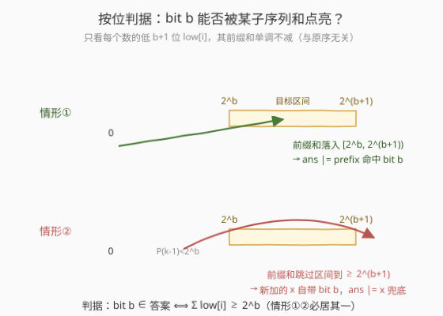
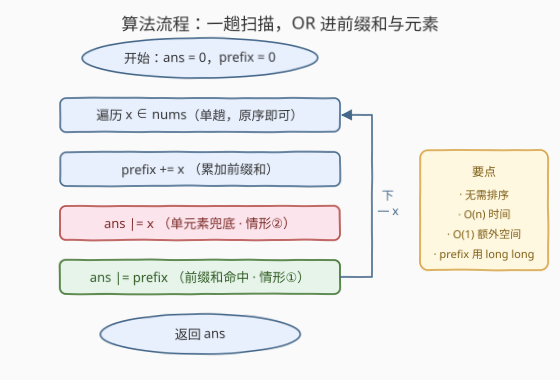

# 所有子序列和的按位或

- **题目名称**：所有子序列和的按位或
- **链接**：[2505. 所有子序列和的按位或](https://leetcode.cn/problems/bitwise-or-of-all-subsequence-sums/)
- **难度**：中等
- **标签**：位运算、数组、前缀和

## 1. 题目概述

给你一个整数数组 `nums`。对 `nums` 的**每一个子序列**（含空子序列，其和为 $0$，对按位或无影响），求其元素之和；把**所有子序列和的按位或**结果返回。

> ⚠️ **本题（2505）为 LeetCode Plus 会员专享题**，官方题面、示例与数据约束均在付费墙后，无法直接引用。下文题意按该题的公开定义「所有子序列和的按位或」描述；**示例为自构并经暴力对拍验证**的演算用例；数据约束依 AC 解法（返回 `long long`）推断为常规范围 $1 \le \text{nums.length} \le 10^5$、$1 \le \text{nums[i]} \le 10^9$。

> 💡 **子序列 vs 子串**：子序列可不连续（任选下标子集），故有 $2^n$ 个；子数组须连续。本题问的是**子序列**，乍看需枚举 $2^n$ 个子集求和再或——但「或」是按位运算，可把「逐子集求和」塌缩为「逐位判可达性」，最终落到一趟 $O(n)$。

**示例 1**（自构，已暴力验证）：

```text
输入：nums = [1, 2, 3]
输出：7
解释：所有子序列和的集合 = {0,1,2,3,4,5,6}（选任意子集求和，0..6 全可达）。
  按位或 = 0|1|2|3|4|5|6 = 7。
  注意 bit2(=4) 不在任何单元素中，由前缀和 1+2+3=6 经进位产生。
```

**示例 2**（自构，已暴力验证）：

```text
输入：nums = [1, 3]
输出：7
解释：子序列和集合 = {0,1,3,4}，按位或 = 1|3|4 = 7。
  关键：bit1(=2) 不在任一前缀和 {1,4} 中（1<2<4，前缀 1→4 跳过了 [2,4)），
  但元素 3=11₂ 自带 bit1 —— 靠单元素兜底。
```

**示例 3**（自构，已暴力验证）：

```text
输入：nums = [2, 2]
输出：6
解释：子序列和集合 = {0,2,4}，按位或 = 2|4 = 6。
  单元素或 = 2，bit2(=4) 由前缀和 2+2=4 进位产生。
```

**约束条件**（依 AC 解推断）：

- $1 \le \text{nums.length} \le 10^5$
- $1 \le \text{nums[i]} \le 10^9$

> ⚠️ 总和可达 $10^5 \times 10^9 = 10^{14}$，远超 32 位 `int`（$\approx 2.1\times 10^9$），故累加前缀和与返回值都须用 `long long`。这也是推断约束的关键线索。

---

## 2. 解题思路

### 2.1 暴力思路：枚举所有子序列

最直白的做法：枚举 `nums` 的全部 $2^n$ 个子序列，逐个求和，累计按位或。$n = 10^5$ 时 $2^n$ 是天文数字，完全不可行。

> ⚠️ 暴力的根因在于把「或」当成了「逐项聚合」。但**按位或有一个关键性质：每一位独立**。bit $b$ 是否出现在最终答案里，只取决于「能否让某个子序列和的第 $b$ 位为 1」——这是一个**逐位可达性**问题，与「具体是哪个子序列、和是多少」无关。一旦按位拆开，$2^n$ 枚举就塌缩为 $O(n \cdot B)$ 甚至 $O(n)$（$B$ 为位数）。

### 2.2 核心观察：按位判可达 + 「进位覆盖」



按位拆解。固定一个 bit $b$，问：**是否存在某子序列 $S$，使 $\sum_{i\in S}\text{nums}[i]$ 的第 $b$ 位为 1**？

**第一步：只看低位。** 一个和的第 $b$ 位只受各元素的低 $b+1$ 位影响（更高位是 $2^{b+1}$ 的倍数，不改变第 $b$ 位）。令 $\text{low}[i] = \text{nums}[i] \bmod 2^{b+1}$。则「某子序列和的第 $b$ 位为 1」⟺「某子集 $S$ 满足 $\bigl(\sum_{i\in S}\text{low}[i]\bigr) \bmod 2^{b+1} \in [2^b,\ 2^{b+1})$」。

**第二步：前缀和单调不减。** 因 $\text{low}[i] \ge 0$，其前缀和 $P_k = \sum_{i\le k}\text{low}[i]$ 从 $0$ 单调不减地涨到总和 $T = \sum_i \text{low}[i]$（与处理顺序无关，只单调）。于是只可能两种情形：

| | 条件 | 结论 |
|---|---|---|
| **情形①** | 某 $P_k \in [2^b,\ 2^{b+1})$ | 该前缀和的第 $b$ 位为 1 → bit $b$ 可达 |
| **情形②** | 没有 $P_k$ 落入该区间，但 $T \ge 2^b$ | 前缀和必在某步从 $<2^b$ 跳到 $\ge 2^{b+1}$（否则会落入区间），跳跃的增量 $x = P_k - P_{k-1} > 2^b$，即该元素自带 bit $b$ → bit $b$ 可达 |

> 💡 **为什么情形②必伴随「单元素自带 bit $b$」？** 设 $P_{k}$ 是首个 $\ge 2^b$ 的前缀和。若 $P_k < 2^{b+1}$，它已落入区间（情形①）。若 $P_k \ge 2^{b+1}$（跳过整个区间），则 $x_k = P_k - P_{k-1} \ge 2^{b+1} - P_{k-1} > 2^{b+1} - 2^b = 2^b$，而 $x_k = \text{low}[k] \le 2^{b+1}-1$，故 $x_k \in (2^b,\ 2^{b+1})$，即元素 `nums[k]` 自带 bit $b$。**这正是算法必须同时 `ans |= prefix` 与 `ans |= x` 的原因**：前者兜住落入区间的情形，后者兜住跳过区间的情形。

**判据**：bit $b$ ∈ 答案 ⟺ $\sum_i \text{low}[i] \ge 2^b$（情形①②必居其一）。

### 2.3 算法流程：一趟扫描 OR 前缀和与元素



把逐位判据实现成**一趟扫描**：维护累加前缀和 `prefix`，对每个元素 $x$ 执行 `prefix += x; ans |= x; ans |= prefix`。理由是：bit $b$ 能否可达，等价于「扫描过程中某次 `prefix` 落入 $[2^b, 2^{b+1})$（情形①，被 `ans |= prefix` 捕获）或某元素自带 bit $b$（情形②，被 `ans |= x` 捕获）」。两次 `|=` 恰好覆盖两种情形，无遗漏无虚报。

```
ans = 0, prefix = 0
for x in nums:
    prefix += x        # 累加前缀和（用 long long 防溢出）
    ans |= x           # 情形②：单元素兜底
    ans |= prefix      # 情形①：前缀和命中
return ans
```

> 💡 **无需排序**。证明只用到「前缀和单调不减」，而 $\text{low}[i]\ge 0$ 在任意顺序下都成立——故原序一趟即可，$O(n)$。完整 `prefix`（全值）的第 $b$ 位 = 低位前缀和 $\bmod 2^{b+1}$ 的第 $b$ 位，所以用全值 `prefix` 直接 OR 就对。

### 2.4 示例演算

![示例演算：nums=[1,3]→7，bit1 靠单元素 3 兜底，bit2 靠前缀 4 命中](../images/subseq_or_walkthrough.svg)

以示例 2 `nums = [1, 3]` 演算（`ans` 列以二进制显示）：

| 步 | $x$ | `prefix` | `ans\|=x` | `ans\|=prefix` | `ans`(₂) |
|---|---|---|---|---|---|
| init | — | 0 | — | — | 000 |
| 1 | 1 | 1 | 1 | 1 | 001 |
| 2 | 3 | 4 | $1\|3=3$ | $3\|4=7$ | 111 |

逐位归因：

- **bit0（值 1）**：$x=1$ 与 `prefix=1` 都含 → 命中（①与②均可）。
- **bit1（值 2）**：`prefix` 从 $1\to 4$，跳过 $[2,4)$，**前缀未命中**；靠 $x=3=11_2$ 自带 bit1 **兜底**（情形②）✓。
- **bit2（值 4）**：`prefix=4` 落入 $[4,8)$ → **前缀命中**（情形①）✓。

答案 $= 111_2 = 7$ ✓。示例 3 `[2,2]`：`prefix` 从 $2\to 4$，`ans = 2 | 2 | 4 = 6`（bit2 由 $2+2$ 进位产生）。

> ⚠️ `[1, 3]` 是理解本题的最佳用例：**一个例子同时触发两种情形**——bit1 只能靠单元素、bit2 只能靠前缀和。若只写 `ans |= prefix`（漏情形②）会丢 bit1 得 $5$；若只写 `ans |= x`（漏情形①）会丢进位产生的 bit2 得 $3$。两者缺一不可。

---

## 3. 参考代码

### C++

```cpp
class Solution {
public:
    long long subsequenceSumOr(vector<int>& nums) {
        long long ans = 0, prefix = 0;
        for (int x : nums) {
            prefix += x;      // 累加前缀和，long long 防溢出
            ans |= x;         // 情形②：单元素兜底
            ans |= prefix;    // 情形①：前缀和命中
        }
        return ans;
    }
};
```

> 💡 **几个细节**：(1) `prefix` 必须 `long long`：总和可达 $10^{14}$，超 32 位。(2) `ans` 也用 `long long`，其上界不超过「总和的下一个 2 的幂」$\le 2^{47}$，64 位绰绰有余。(3) `ans |= x` 中 `x` 是 `int`，会隐式提升到 `long long` 再或，安全。(4) 无需排序、无需去重、无需额外数组，原地一趟。

### Python

```python
class Solution:
    def subsequenceSumOr(self, nums: List[int]) -> int:
        ans = 0
        prefix = 0
        for x in nums:
            prefix += x       # 累加前缀和
            ans |= x           # 情形②：单元素兜底
            ans |= prefix      # 情形①：前缀和命中
        return ans
```

> 💡 Python 大整数无溢出，`prefix`/`ans` 直接用 `int` 即可。逻辑与 C++ 完全镜像；一行循环体三步走，是最精简的等价实现。

---

## 4. 复杂度分析

| 维度 | 复杂度 | 说明 |
|------|--------|------|
| **时间** | $O(n)$ | 一趟遍历，每步常数次加法与按位或 |
| **空间** | $O(1)$ | 仅 `ans`、`prefix` 两个标量，原地 |
| 对照：枚举子序列 | $O(2^n)$ | 逐子集求和再或，指数爆炸 |
| 对照：逐位判据（朴素） | $O(n \cdot B)$ | 对每个 bit $b$ 重算 $\sum \text{low}[i]$，$B \approx 47$；同阶但多一趟常数 |

> 💡 本题灵魂在**按位独立 + 前缀和单调**这两个观察的叠加：把「$2^n$ 子集求和再或」塌缩成「一趟扫描里两次 `|=`」。复杂度从指数降到线性，且常数极小、空间 $O(1)$。

---

## 5. 扩展：等价的按位判别式与排序必要性

### 5.1 逐位判别式

核心观察里给出的判据也可直接实现成一个 $O(n \cdot B)$ 的算法，与一趟扫描等价（已用暴力对拍验证）：

$$
\text{bit } b \in \text{答案} \iff \sum_{i} \bigl(\text{nums}[i] \bmod 2^{b+1}\bigr) \ge 2^b
$$

```cpp
long long ans = 0;
for (int b = 0; b < 48; ++b) {
    long long mask = (1LL << (b + 1)) - 1, sum = 0;
    for (int x : nums) sum += x & mask;
    if (sum >= (1LL << b)) ans |= (1LL << b);
}
return ans;
```

它把「逐位」写得很显式，便于理解，但比一趟扫描多一个 $B$ 的常数。两者等价的根因：一趟扫描里的 `prefix` 与 `x` 恰好分别实现了「情形①落入区间」与「情形②单元素兜底」，把所有 $b$ 一次性处理完。

### 5.2 为什么排序不影响答案

证明里只用到「低位前缀和 $P_k$ 随 $k$ 单调不减」——这只要求 $\text{low}[i] \ge 0$，与元素处理顺序无关。故无论原序、升序、降序，`ans` 最终相同（也已用随机数据 + 暴力对拍验证）。升序排列在某些直觉下更顺，但既不改变结果、又平添 $O(n\log n)$，故最优解保持原序一趟。

### 5.3 与「精确子集和」的对照

同样涉及子集和，难度却天差地别：

- **精确子集和**（如 [416](../0401-0500/416_分割等和子集.md)）：问「能否凑出**某个确定值**」，状态是连续的，只能 $O(n\cdot \text{sum})$ 背包 DP。
- **本题：比特可达性**：问「**某 bit 能否被任意子集和点亮**」，状态被按位压缩成 $B$ 个独立布尔，前缀和的单调性即可判，$O(n)$。

> 💡 一旦把「求和后聚合」改成「按位或聚合」，可把连续状态塌缩为按位布尔——这是位运算题里反复出现的「降维」手法。

---

## 6. 面试要点

1. **为什么按位或可以按位独立处理？**

   > 按位或的第 $b$ 位结果 = 「是否存在某个输入的第 $b$ 位为 1」。本题的「输入」是各子序列和，故第 $b$ 位 = 「是否存在某子序列和的第 $b$ 位为 1」，只依赖该位。于是把 $2^n$ 子集枚举拆成 $B$ 个独立的「可达性」问题，逐位求解。

2. **为什么 `ans |= prefix` 和 `ans |= x` 两者都需要、缺一不可？**

   > 它们分别兜住两种情形：`prefix` 落入 $[2^b, 2^{b+1})$ 时由 `ans |= prefix` 命中（情形①）；`prefix` 跳过该区间时，跳跃增量即某元素，自带 bit $b$，由 `ans |= x` 命中（情形②）。反例 `[1,3]`：bit1 只能靠 `ans|=x`（前缀 1→4 跳过），bit2 只能靠 `ans|=prefix`（4 落入 [4,8)）——缺任一会得错答。

3. **为什么不用排序？复杂度能到多少？**

   > 证明只用「低位前缀和单调不减」，这只要求 $\text{low}[i]\ge 0$，与顺序无关。故原序一趟即可，$O(n)$ 时间、$O(1)$ 空间。排序既不改变答案又添 $O(n\log n)$，属多余。

4. **`prefix` 为什么必须 `long long`？答案的上界是多少？**

   > 总和可达 $n\times\max = 10^5\times 10^9 = 10^{14}$，超 32 位 `int`。`ans` 的上界不超过「总和的下一个 2 的幂」$\le 2^{47}$，64 位 `long long` 足够（Python 大整数无此虑）。

5. **核心判据怎么快速推导？**

   > 第 $b$ 位只看各元素低 $b+1$ 位 $\text{low}[i]$。前缀和 $P_k$ 从 $0$ 单调涨到 $T=\sum\text{low}[i]$。若 $T\ge 2^b$，则首个 $\ge 2^b$ 的前缀要么落入 $[2^b,2^{b+1})$（情形①），要么跳到 $\ge 2^{b+1}$，此时跳跃元素自带 bit $b$（情形②）。故 bit $b$ 可达 ⟺ $T\ge 2^b$，且实现上等价于一趟 `prefix` 与 `x` 双或。

> 💡 **一句话总结**：按位或按位独立，bit $b$ 可达 ⟺ 低位前缀和 $\ge 2^b$；前缀和落入区间（`ans|=prefix`）与单元素兜底（`ans|=x`）两种情形必居其一，故一趟 $O(n)$ 扫描、$O(1)$ 空间出解，无需排序、无需枚举子集。

---

## 7. 同类练习题

- [416. 分割等和子集](https://leetcode.cn/problems/partition-equal-subset-sum/)（[题解](../0401-0500/416_分割等和子集.md)）：同「子集和」家族，但问**精确值**可达性，只能 $O(n\cdot\text{sum})$ 背包；对照本题问**比特可达性**降为 $O(n)$，感受「精确 vs 按位」的难度断层
- [494. 目标和](https://leetcode.cn/problems/target-sum/)（[题解](../0401-0500/494_目标和.md)）：子集和**计数**问题，同源「子集和」结构，对照本题的「按位或聚合」与「符号分配计数」两种问法
- [974. 和可被 K 整除的子数组](https://leetcode.cn/problems/subarray-sums-divisible-by-k/)（[题解](../0901-1000/974_和可被K整除的子数组.md)）：前缀和 + 同余定理判子数组和性质，对照「前缀和承载进位/模信息」的思想，子数组（连续）vs 子序列（不连续）
- [525. 连续数组](https://leetcode.cn/problems/contiguous-array/)（[题解](../0501-0600/525_连续数组.md)）：前缀和 + 哈希存最早下标，前缀和差判等长 0/1 子数组，对照前缀和的另一种「差值判性质」用法
- [191. 位 1 的个数](https://leetcode.cn/problems/number-of-1-bits/)（[题解](../0001-0100/191_位1的个数.md)）：按位分析基础，`n & (n-1)` 消最低位 1，承接本题「按位独立」的位运算思维
