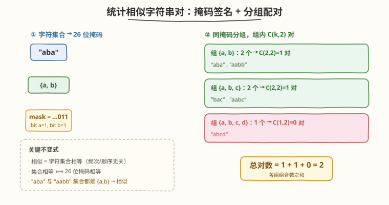
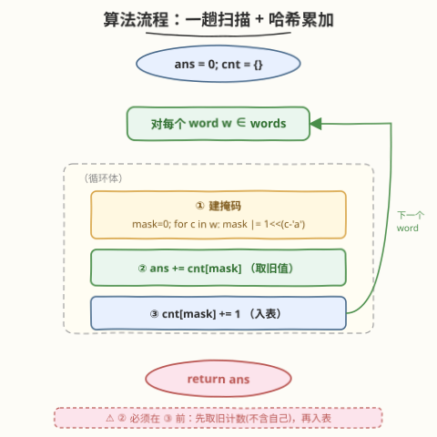

# LeetCode 统计相似字符串对的数目 题解

## 1. 题目概述

- **标题 / 题号**：统计相似字符串对的数目（#2506，easy）
- **链接**：https://leetcode.cn/problems/count-pairs-of-similar-strings/
- **难度**：简单
- **标签**：位运算、数组、哈希表、字符串

**题意**：给你一个下标从 $0$ 开始的字符串数组 `words`。如果两个字符串**由相同的字符组成**（即字符集合相同，不关心出现频次与出现顺序），则认为这两个字符串**相似**。请你找出满足 `words[i]` 与 `words[j]` 相似的下标对 $(i, j)$ 的数目，其中 $0 \le i < j \le \text{words.length} - 1$。

**示例 1**：

```text
输入：words = ["aba","aabb","abcd","bac","aabc"]
输出：2
解释：
  - i=0, j=1：words[0]="aba" 与 words[1]="aabb" 都只由 {a, b} 组成。
  - i=3, j=4：words[3]="bac" 与 words[4]="aabc" 都只由 {a, b, c} 组成。
```

**示例 2**：

```text
输入：words = ["aabb","ab","ba"]
输出：3
解释：三者字符集合都是 {a, b}，两两相似，共 C(3,2)=3 对。
```

**示例 3**：

```text
输入：words = ["nba","cba","dba"]
输出：0
解释："nba"={a,b,n}、"cba"={a,b,c}、"dba"={a,b,d} 三者集合互不相同，无相似对。
```

**约束**：

- $1 \le \text{words.length} \le 100$
- $1 \le \text{words[i].length} \le 100$
- `words[i]` 仅由小写英文字母组成

> 💡 **关键不变式**：「相似」= **字符集合相等**，与字符的**出现次数**和**出现顺序**都无关。"aba"（a:2,b:1）与 "aabb"（a:2,b:2）频次不同，但集合都是 $\{a, b\}$，故相似。这一观察把「字符串两两比较」塌缩成「字符集合/掩码相等比较」。

## 2. 解题思路

### 2.1 暴力思路：枚举下标对

最直白的做法是枚举所有 $i < j$ 的下标对，对每对分别求字符集合再判等：

```text
ans = 0
for i in 0..n-1:
    for j in i+1..n-1:
        if set(words[i]) == set(words[j]):
            ans += 1
return ans
```

这是 $O(n^2 \cdot L)$ 时间（$L$ 为平均串长）。$n \le 100$、$L \le 100$，约 $10^6$ 次字符操作其实也能过。但它没有利用「相同掩码会成组聚集」的结构——同一掩码出现 $k$ 次就贡献 $\binom{k}{2}$ 对，逐对比对把这层分组关系重复算了 $k-1$ 遍。

> ⚠️ 暴力把每个字符串独立处理，忽略了「掩码相同的若干字符串天然成组」。一旦按掩码分组，对数从「逐对累加」变成「组内组合数求和」，把 $O(n^2)$ 压成 $O(n \cdot L)$。

### 2.2 核心观察：位掩码签名 + 哈希分组计数



三个观察层层递进：

1. **相似 $\Leftrightarrow$ 字符集合相等**：题目只关心「由哪些字符组成」，不关心频次与顺序。故每个字符串可被它的**字符集合**完全代表——这是把字符串塌缩为一个规范「签名」的依据。

2. **26 位掩码编码集合**：`words[i]` 仅小写字母（$26$ 种），用一个 $26$ 位整数 `mask` 即可编码整个字符集合——第 $b$ 位为 $1$ 表示字母 $b$ 出现过。**集合相等 $\Leftrightarrow$ 掩码相等**。建掩码只需遍历一次字符串，$O(L)$。

3. **同掩码成组，组内贡献 $\binom{k}{2}$**：设掩码 $m$ 出现了 $\text{cnt}[m]$ 次，则这 $\text{cnt}[m]$ 个字符串两两相似，贡献 $\binom{\text{cnt}[m]}{2} = \dfrac{\text{cnt}[m]\,(\text{cnt}[m]-1)}{2}$ 对。扫描时每来一个掩码为 $m$ 的新串，它与之前已入表的 $\text{cnt}[m]$ 个同掩码串各成一对，故累加 $\text{cnt}[m]$ 后再 $\text{cnt}[m] \mathrel{+}= 1$——**增量求和等价于组内组合数**。

> 💡 **一句话直觉**：相似不看成对，看分组。掩码相同的字符串自然聚成一组，组里有 $k$ 个就配 $\binom{k}{2}$ 对。位掩码让「集合相等」变成「整数相等」，哈希让「分组计数」变成一趟扫描。

### 2.3 算法流程图



一次遍历即可完成：

1. 初始化哈希表 `cnt`（掩码 → 出现次数）、`ans = 0`；
2. 对每个 `words[i]`：建掩码 `mask`（遍历字符，`mask |= 1 << (c - 'a')`）；
3. **先累加**：`ans += cnt[mask]`（与之前每个同掩码串各成一对）；
4. **再入表**：`cnt[mask] += 1`；
5. 遍历结束，返回 `ans`。

> 💡 第 3、4 步**顺序不可换**：先取 `cnt[mask]`（旧值，不含自己）累加，再自增入表——这样自己不会和自己配对，也不会与「之后」的串提前配对。这等价于「组内组合数」的增量求和：第 $k$ 个同掩码串到来时累加 $k-1$，恰好凑出 $\binom{k}{2}$。

### 2.4 示例演算

![示例演算：words = ["aba","aabb","abcd","bac","aabc"] → 2](../images/cpss_example_walkthrough.svg)

以示例 1 演算（用字符集合表示掩码签名）：

| $i$ | `words[i]` | 字符集合(掩码) | $\text{cnt}$(前) | ans 增量 | ans | $\text{cnt}$(后) |
|-----|------------|----------------|-------------------|----------|-----|-------------------|
| 0 | "aba" | $\{a, b\}$ | 0 | $+0$ | 0 | 1 |
| 1 | "aabb" | $\{a, b\}$ | 1 | $+1$ | 1 | 2 |
| 2 | "abcd" | $\{a, b, c, d\}$ | 0 | $+0$ | 1 | 1 |
| 3 | "bac" | $\{a, b, c\}$ | 0 | $+0$ | 1 | 1 |
| 4 | "aabc" | $\{a, b, c\}$ | 1 | $+1$ | 2 | 2 |

`ans = 2` ✓。两对分别来自 $\{a, b\}$ 组（$\binom{2}{2}=1$）和 $\{a, b, c\}$ 组（$\binom{2}{2}=1$）。增量为正的行（$i=1,4$）正是「当前串与某个已入表同掩码串配成对」的时刻。

> 💡 注意 $i=2$ 的 $\{a,b,c,d\}$ 与 $i=3$ 的 $\{a,b,c\}$ **不相似**——集合不同（前者多了 `d`）。这正说明掩码精确区分了「多一个字符」的字符串，频次无关但**成员**必须完全一致。

## 3. 参考代码

### C++

```cpp
class Solution {
public:
    int similarPairs(vector<string>& words) {
        int ans = 0;
        unordered_map<int, int> cnt;
        for (const string& w : words) {
            int mask = 0;
            for (char c : w) mask |= 1 << (c - 'a');
            ans += cnt[mask]++;
        }
        return ans;
    }
};
```

> 💡 `ans += cnt[mask]++` 一行完成「累加旧计数」与「自增入表」两步——后缀 `++` 返回旧值用于累加，再自增。要求 $i < j$，故先取旧计数（不含自己）再加自己。`mask` 仅 $26$ 位，`int` 足够。

> ⚙️ 掩码种类至多 $2^{26}$ 种，但实际 $\le n \le 100$，哈希表极小。若追求常数更优，可把 `cnt` 换成数组并排序去重，但本题规模下哈希已最快且最清晰。

### Python

```python
class Solution:
    def similarPairs(self, words: List[str]) -> int:
        ans = 0
        cnt = {}
        for w in words:
            mask = 0
            for c in w:
                mask |= 1 << (ord(c) - 97)
            ans += cnt.get(mask, 0)
            cnt[mask] = cnt.get(mask, 0) + 1
        return ans
```

> 💡 Python 还可一行用 `frozenset(w)` 作键：`mask = frozenset(w)`，可读性更佳。位掩码版更省、常数更小，且与 C++ 写法一一对应便于迁移。Python 整数任意精度，`mask` 无溢出之忧。

## 4. 复杂度分析

| 维度 | 复杂度 | 说明 |
|------|--------|------|
| **时间复杂度** | $O(n \cdot L)$ | $n$ 个字符串各遍历 $L$ 字符建掩码 $O(L)$；哈希查询/更新均摊 $O(1)$。$L$ 为平均串长 |
| **空间复杂度** | $O(n)$ | 哈希表至多存 $n$ 个不同掩码；掩码本身 $26$ 位 $O(1)$ |
| 对照：枚举下标对 | $O(n^2 \cdot L)$ / $O(L)$ | 每对求集合判等，$n \le 100$ 能过但未利用分组结构，重复算同组配对 |

> 💡 掩码把「集合相等」压成「整数相等」，哈希把「分组计数」压成「一趟扫描」。二者叠加，把 $O(n^2)$ 的逐对比较降到 $O(n \cdot L)$。

## 5. 扩展：可替换的签名表示

除位掩码外，还有两种等价的「签名」构造法，本质都是把字符串映射到一个**集合相等 $\Leftrightarrow$ 签名相等**的规范表示：

- **`frozenset(w)`**：直接取字符集合作哈希键，Python 最直白。缺点是集合对象比整数重、哈希常数略大。
- **排序去重串**：把字符串排序去重（如 `"aba"` $\to$ `"ab"`）作键。需 $O(L \log L)$ 排序，比位掩码 $O(L)$ 慢，且字符串哈希常数较大。

```python
# frozenset 版：可读性最佳
cnt = {}
ans = 0
for w in words:
    key = frozenset(w)
    ans += cnt.get(key, 0)
    cnt[key] = cnt.get(key, 0) + 1
return ans
```

> 💡 若字符集扩大（如任意 ASCII 的 $128$ 种或 Unicode），位掩码不再可行（需 $128$ 位以上），改用 `frozenset` 或排序去重串即可——**签名构造法可替换，分组计数骨架不变**。这是「表示与算法解耦」的典型体现。

## 6. 面试要点

1. **「相似」的定义是什么？为什么频次和顺序都不重要？**

   > 相似 = 两字符串由**相同的字符集合**组成。频次无关："aba"（a:2,b:1）与 "aabb"（a:2,b:2）集合都是 $\{a,b\}$，故相似。顺序无关：集合本身无序。因此把字符串塌缩为「字符集合」这一规范表示即可，位掩码 / `frozenset` / 排序去重串都行。

2. **为什么是 $\binom{k}{2}$ 而不是 $k^2$？**

   > 题目要求下标对 $(i, j)$ 且 $i < j$，即**无序对**。同一掩码组有 $k$ 个字符串，两两配对是无序组合，共 $\binom{k}{2}=\dfrac{k(k-1)}{2}$ 对。$k^2$ 把 $(i,j)$ 与 $(j,i)$ 当成两对、还多算了 $(i,i)$，错。

3. **`ans += cnt[mask]++` 的顺序为什么不能换？**

   > 题目要求 $i < j$，当前字符串只能与**之前已入表**的同掩码串配对。先取 `cnt[mask]`（旧值，不含自己）累加，再自增入表——这样自己不会和自己配对，也不会和「之后」的串提前配对。若先自增再累加，就把自己也算进去了，会多算。

4. **位掩码为什么 $26$ 位就够？字符集扩大怎么办？**

   > 约束 `words[i]` 仅小写英文字母，共 $26$ 种，一个 `int` 的低 $26$ 位即够编码全集。字符集若扩大到全 ASCII（$128$ 种），可改用 `long long` 或 `bool[128]` 拼接，或直接用 `frozenset`，逻辑不变——签名构造法可替换，分组计数骨架不变。

5. **暴力 $O(n^2)$ 也能过，为什么要做 $O(n \cdot L)$？**

   > $n \le 100$ 时 $O(n^2 \cdot L)$ 约 $10^6$ 确实能过。但「按掩码分组」揭示的是问题的组合结构——同组内任意两个都相似，这是「组合数」而非「逐对判定」的本质。一旦 $n$ 增大或要求多次查询，分组思路可平滑扩展（如预处理后 $O(1)$ 查某组对数），而逐对比对无法扩展。

> 💡 **一句话总结**：相似 = 字符集合相等 $\Rightarrow$ 26 位掩码编码集合 $\Rightarrow$ 同掩码成组 $\Rightarrow$ 组内 $\binom{k}{2}$ 对 $\Rightarrow$ 一趟扫描哈希累加，$O(n \cdot L)$ / $O(n)$。

## 同类练习题

| # | 题目 | 与本题的关联 |
|---|------|-------------|
| 187 | [重复的 DNA 序列](https://leetcode.cn/problems/repeated-dna-sequences/) | 2 位编码 + 滚动哈希，同样「少量字符 $\to$ 位编码」思想把字符串压进整数作哈希键 |
| 2442 | [反转之后不同整数的数目](https://leetcode.cn/problems/count-number-of-distinct-integers-after-reverse-operations/) | 签名 + 哈希去重计数，与本题同「规范化签名 + 哈希表计数」骨架 |
| 231 | [2 的幂](https://leetcode.cn/problems/power-of-two/) | 位运算基础，`1 << (c - 'a')` 置位是本题掩码构造的原子操作 |
| 191 | [位 1 的个数](https://leetcode.cn/problems/number-of-1-bits/) | `mask \|= bit` 置位 / 逐位处理的位运算基本功，承接本题掩码维护 |
| 128 | [最长连续序列](https://leetcode.cn/problems/longest-consecutive-sequence/) | 哈希集合 + 跟随计数，与本题「哈希分组」同属哈希表应用范式，对照「求最长链」vs「组内配对计数」 |
