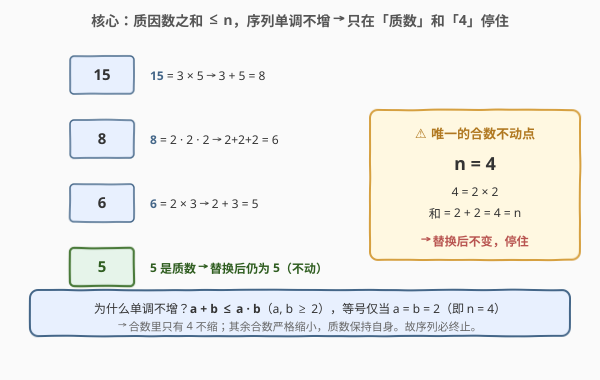
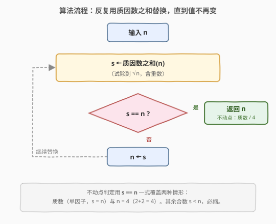
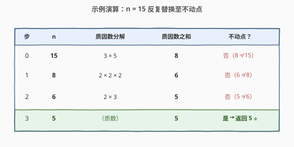

# LeetCode 使用质因数之和替换后可以取到的最小值 题解

## 1. 题目概述

- **标题 / 题号**：使用质因数之和替换后可以取到的最小值（#2507，medium）
- **链接**：https://leetcode.cn/problems/smallest-value-after-replacing-with-sum-of-prime-factors/
- **难度**：中等
- **标签**：数学、数论、质因数分解、模拟

**题意**：给你一个正整数 `n`。请将 `n` 的值替换为 `n` 的**质因数之和**，重复这一过程：

- 若 `n` 能被某个质因数多次整除，求和时该质因数要计入同样次数。

返回 `n` 可以取到的最小值。

**示例 1**：

```text
输入：n = 15
输出：5
解释：15 = 3 * 5 → n = 3 + 5 = 8
      8 = 2 * 2 * 2 → n = 2 + 2 + 2 = 6
      6 = 2 * 3 → n = 2 + 3 = 5
      5 是质数，无法再变小 → 返回 5
```

**示例 2**：

```text
输入：n = 3
输出：3
解释：3 本身即质数，最小值为 3。
```

**约束**：

- `2 <= n <= 10^5`

> ⚠️ 本题的坑不在「怎么分解质因数」，而在「什么时候停」。若不加判断地「只要 `n` 是合数就替换」，会在 `n = 4` 处陷入死循环（`4 = 2×2`，和 `= 2+2 = 4`，原地不动）。识别出所有**不动点**，是本题的关键。

## 2. 解题思路

### 2.1 暴力思路：直接反复替换

最直白的做法是「不断把 `n` 换成其质因数之和」——只要会分解质因数就能模拟。问题在于**停机条件**：

- 直觉上「换到质数就停」似乎合理：质数 `p` 只有一个质因子（自身），和 `= p`，换完还是 `p`。
- 但 `n = 4` 是**合数**却也是不动点：`4 = 2×2`，和 `= 2+2 = 4`。若用 `while (!isPrime(n))` 作循环条件，`4` 会卡在「是合数 → 替换 → 还是 4 → 还是合数」的死循环里。

所以必须先看清「替换」这个操作到底让 `n` 怎么变。

### 2.2 核心观察：质因数之和 ≤ n，单调不增，不动点只有质数与 4



把「质因数之和」记作 $f(n)$（含重数）。三个层层递进的观察：

1. **单调不增**：对任意 $n \ge 2$，$f(n) \le n$。
   - 证明只需一条初中不等式：对 $a, b \ge 2$，有 $a + b \le a \cdot b$，且等号当且仅当 $a = b = 2$（因为 $a + b \le ab \iff (a-1)(b-1) \ge 1$）。
   - 把 $n$ 的若干质因子两两合并：和是「加法」、积是「乘法」，乘法增长远快于加法，反复套用上式即得 $f(n) \le n$。
2. **不动点恰好是质数与 4**：什么时候 $f(n) = n$（换完不变）？
   - $n$ 是质数：唯一质因子就是 $n$，$f(n) = n$。
   - $n = 4$：$2+2 = 2 \times 2 = 4$，是上式中唯一的等号情形。
   - 其它合数：至少有两个因子且不全是 `2,2`，不等式严格成立，$f(n) < n$。
   - 故**不动点集合 $= \{\text{质数}\} \cup \{4\}$**。
3. **必然终止**：序列 $n, f(n), f(f(n)), \ldots$ 非负整数且**单调不增**；除不动点外每步严格递减。一个不增的正整数序列不可能无限严格递减，故必然落在某个不动点上——而落点就是**序列的最小值**。

> 💡 **为什么「落点 = 最小值」？** 序列单调不增，末项 ≤ 所有前项；停在不动点意味着不能再小。所以最终落在的不动点即为全程最小值。这把「求最小值」直接归约为「跑到不动点」。

由观察 3，停机判据只需一句话：**反复替换，直到 $f(n) = n$**。这一条 `s == n` 同时覆盖了「质数」和「`4`」两种情形，无需单独特判 `n = 4`，也不会漏判死循环。

### 2.3 算法流程图



循环体只有三步：算 $s = f(n)$、判 $s == n$、否则 $n \gets s$。其中 $f(n)$ 用**试除法**求（枚举 $d$ 从 $2$ 到 $\sqrt n$，能除尽就反复除、把 $d$ 累加，最后若剩余 $>1$ 则它本身是最后一个质因子）。

### 2.4 示例演算



以 `n = 15` 为例，跟踪每一步的分解与判停：

| 步 | $n$ | 质因数分解 | $f(n)$ | 不动点？ |
|----|-----|-----------|--------|---------|
| 0 | 15 | 3 × 5 | 8 | 否（8 ≠ 15） |
| 1 | 8  | 2 × 2 × 2 | 6 | 否（6 ≠ 8） |
| 2 | 6  | 2 × 3 | 5 | 否（5 ≠ 6） |
| 3 | 5  | （质数） | 5 | 是（5 = 5）→ 返回 5 ⭐ |

`n = 3`（质数）：第 0 步 $f(3) = 3 = n$，直接返回 `3`。

`n = 4`（特例）：第 0 步 $f(4) = 2+2 = 4 = n$，命中不动点，返回 `4`——这正是 `s == n` 判据比 `!isPrime(n)` 更稳的地方。

> ⚠️ **会不会出现「非 1 的循环」**（如 $a \to b \to a$，$a \ne b$）？不会。序列单调不增，若有 $a \to b \to a$ 则 $b \le a$ 且 $a \le b$，逼出 $a = b$。故除了「自环」型不动点，不存在任何循环。这是本题相较 [202. 快乐数](../0201-0300/202_快乐数.md)（数位平方和链可能进入非平凡循环）的关键差异：本题的 $f$ 单调不增，**只有不动点、没有环路**。

## 3. 参考代码

### C++

```cpp
class Solution {
public:
    int smallestValue(int n) {
        while (true) {
            int s = sumOfPrimeFactors(n);
            if (s == n) return n;      // 不动点：质数（s==n）或 n==4（s==4）
            n = s;
        }
    }
private:
    int sumOfPrimeFactors(int n) {
        int s = 0;
        for (int d = 2; (long long)d * d <= n; ++d) {
            while (n % d == 0) {
                s += d;
                n /= d;
            }
        }
        if (n > 1) s += n;             // 剩余 >1，其本身就是最后一个质因子
        return s;
    }
};
```

### Python

```python
class Solution:
    def smallestValue(self, n: int) -> int:
        def sum_of_prime_factors(x: int) -> int:
            s, d = 0, 2
            while d * d <= x:
                while x % d == 0:
                    s += d
                    x //= d
                d += 1
            if x > 1:                  # 剩余本身是最后一个质因子
                s += x
            return s

        while True:
            s = sum_of_prime_factors(n)
            if s == n:                  # 不动点：质数 或 4
                return n
            n = s
```

> 💡 **几处细节**：(1) `(long long)d * d` 防 `d * d` 在 32 位下溢出（$n \le 10^5$ 时实际 $\sqrt n \le 317$，不溢出，但写法稳妥、是面试加分项；Python 大整数无需操心）。(2) `if (n > 1) s += n;`：试除循环结束后，若 `n` 被「除剩」一个 $>1$ 的值，它必是质数（更小的因子已被试除干净），就是最大质因子，直接累加。(3) `s == n` 一行同时处理「质数」与「`4`」两种停机，无需 `isPrime` 辅助函数，也免疫 `4` 的死循环陷阱。

## 4. 复杂度分析

| 维度 | 复杂度 | 说明 |
|------|--------|------|
| 时间复杂度 | $O(\sqrt n \log n)$ | 每轮替换试除到 $\sqrt n$ 为 $O(\sqrt n)$；替换轮数 $O(\log n)$（见下） |
| 空间复杂度 | $O(1)$ | 仅用几个整型变量，原地模拟 |

> ⚠️ **为什么替换轮数是 $O(\log n)$ 而不是 $O(n)$？** 虽然严格递减只保证「每步至少减 1」，但有更强的缩减率：对合数 $n \ne 4$，$f(n) \le \dfrac{n}{2} + 2$（取等当 $n = 2p$，$p$ 为质数，如 $6 \to 5$、$10 \to 7$；证明：若 $n$ 含因子 $2$，记 $n = 2m$，则 $f(n) = 2 + f(m) \le 2 + m = \dfrac n2 + 2$，对 $m$ 的因子再用 $a+b \le ab$；奇合数最小因子 $\ge 3$，缩减更猛）。由 $n/2 + 2 < n \iff n > 4$，故对 $n \ge 6$ 的合数每轮近似减半。从 $10^5$ 减到个位数约 $\log_2 10^5 \approx 17$ 轮，加上尾部几步到不动点，总轮数 $\le 30$ 上下。每轮 $O(\sqrt n) \approx 317$，总量约 $10^4$ 次运算，极快。

## 5. 扩展：两种等价写法

### 5.1 用 `isPrime` 显式短路质数

主解用 `s == n` 一并处理质数与 `4`。也可先判质数直接返回，逻辑更「直觉」但需多写一个质数判定：

```cpp
int smallestValue(int n) {
    while (!isPrime(n)) {
        int s = sumOfPrimeFactors(n);
        if (s >= n) return n;          // n == 4 的陷阱：s == n，必须兜底
        n = s;
    }
    return n;
}
// isPrime：试除到 √n
```

注意即便先判了质数，循环内仍需 `if (s >= n) return n;` 兜住 `n = 4`（合数、$s = n$、否则死循环）。**反例提醒**：若写成 `while (!isPrime(n)) n = sumOfPrimeFactors(n);`，输入 `4` 会无限循环——这是本题最常见的 WA/TLE 来源。主解的 `s == n` 判据从根源上规避了它。

### 5.2 预筛质数表加速 `f(n)`

$n \le 10^5$ 时试除已绰绰有余；若 $n$ 更大（如 $10^9$ 级但值域受限），可先用埃氏筛预置 $\le \sqrt{10^5} = 317$ 内的质数表，再用质数表试除，省去逐个 `d` 的合数试除。对本题规模属过度优化，了解即可——筛法本身见 [204. 计数质数](../0201-0300/204_计数质数.md)。

## 6. 面试要点

1. **替换序列为什么必然终止？不动点有哪些？**

   > 操作 $f$ 满足 $f(n) \le n$（由 $a+b \le ab$，$a,b\ge 2$），故序列单调不增；非不动点处严格递减，正整数不增序列不可能无限严格递减，必落在不动点。不动点恰好是「质数」（单因子 $f(p)=p$）与 $n=4$（$2+2=2\times2=4$）。

2. **`n = 4` 为什么是坑？朴素 `while(!isPrime(n))` 错在哪？**

   > `4` 是合数却也是不动点：$f(4)=4$。`while(!isPrime(n)) n = f(n);` 在 `n=4` 时会反复执行 `4 → 4`，死循环。必须用「替换后不变即停」的判据，或循环内加 `if (s >= n) break;` 兜底。主解的 `if (s == n) return n;` 把质数和 `4` 统一处理，最稳。

3. **质因数之和 $\le n$ 怎么证？为什么每步近似减半？**

   > 核心不等式 $a+b \le ab$（$a,b\ge2$，等号仅 $a=b=2$），反复合并因子即得 $f(n)\le n$。更强的：对合数 $n\ne4$，$f(n)\le n/2+2$（含因子 $2$ 时 $n=2m\Rightarrow f(n)=2+f(m)\le2+m=n/2+2$；取等如 $n=2p$）。$n/2+2<n\iff n>4$，故 $n\ge6$ 的合数每轮近似减半，替换轮数 $O(\log n)$。

4. **试除法求质因数之和的复杂度？为什么枚举到 $\sqrt n$？**

   > 试除 $d$ 从 $2$ 到 $\sqrt n$，每个 $d$ 反复除尽累加，单轮 $O(\sqrt n)$。到 $\sqrt n$ 即可：若 $n$ 有 $>\sqrt n$ 的质因子，则至多一个（两个 $>\sqrt n$ 的因子乘积已 $>n$），它会被循环结束后「剩余 $>1$」那行捕获，无需继续枚举。

5. **为什么用 `s == n` 作停机判据，而不是显式 `isPrime`？**

   > `s == n` 一步覆盖全部不动点（质数与 `4`），不依赖额外的质数判定，也不会漏掉 `4` 这个合数不动点。`isPrime` 写法更直觉但需另加 `4` 的兜底，多一个易错点。两者复杂度相同，`s == n` 更简洁、更不易出 bug。

> 💡 **一句话总结**：2507 = 「替换到不动点」。质因数之和 $f(n)\le n$ 且只在质数与 $4$ 处取等，序列单调不增、必落不动点；用 `while (s != n)` 一句停机，把求最小值归约为跑到不动点，免疫 `n=4` 死循环。

## 同类练习题

| # | 题目 | 与本题的关联 |
|---|------|-------------|
| 202 | [快乐数](https://leetcode.cn/problems/happy-number/)（[题解](../0201-0300/202_快乐数.md)） | 同为「反复用 $f(n)$ 替换 $n$ 找不动点/判圈」骨架。对照点：本题 $f$ 单调不增、**只有不动点无环路**；202 的数位平方和可能进入非平凡循环，需 Floyd 判圈 |
| 204 | [计数质数](https://leetcode.cn/problems/count-primes/)（[题解](../0201-0300/204_计数质数.md)） | 质数/数论母题，埃氏筛。本题若值域更大可预筛质数表加速 $f(n)$ 的试除 |
| 263 | [丑数](https://leetcode.cn/problems/ugly-number/)（[题解](../0201-0300/263_丑数.md)） | 反复试除指定质因子判定能否归一，与「试除法分解质因数」同源 |
| 172 | [阶乘后的零](https://leetcode.cn/problems/factorial-trailing-zeroes/)（[题解](../0101-0200/172_阶乘后的零.md)） | 数论题，统计因子 $5$ 的个数（勒让德公式），与质因子计数同源 |
| 166 | [分数到小数](https://leetcode.cn/problems/fraction-to-recurring-decimal/)（[题解](../0101-0200/166_分数到小数.md)） | 长除法 + 哈希检测循环节，对照「确定性后继序列中识别循环 vs 不动点」的另一形态 |
