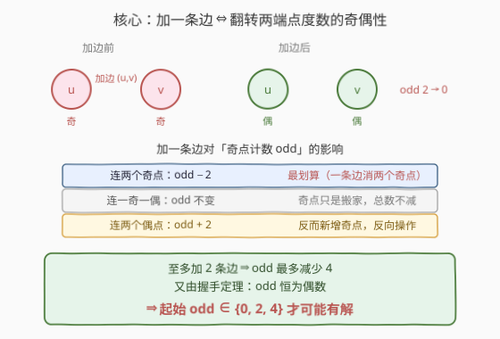
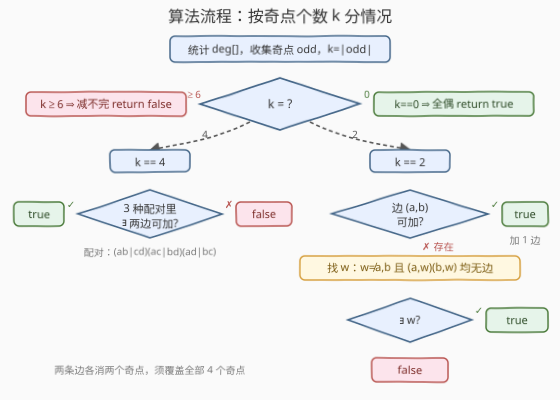
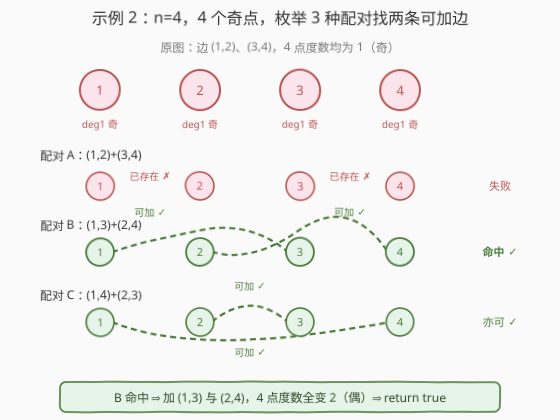

# 添加边使所有节点度数都为偶数

- **题目名称**：添加边使所有节点度数都为偶数
- **链接**：[2508. 添加边使所有节点度数都为偶数](https://leetcode.cn/problems/add-edges-to-make-degrees-of-all-nodes-even/)
- **难度**：困难
- **标签**：图、贪心、哈希表、数学

## 1. 题目概述

给定 $n$ 个节点（编号 $1\sim n$）的**无向**图与边集 `edges`，图中**无重边、无自环**，且不一定连通。你可以**至多**添加 $2$ 条额外边（同样不能产生重边或自环），目标是使**所有节点的度数都为偶数**。能则返回 `true`，否则 `false`。

**示例 1**：

```text
输入：n = 5, edges = [[1,2],[2,3],[3,4],[4,2],[1,4],[2,5]]
输出：true
解释：加一条边 (3,5)（或 (1,3) 等），所有点度数变偶。
```

**示例 2**：

```text
输入：n = 4, edges = [[1,2],[3,4]]
输出：true
解释：4 点度数均为 1（奇）；加两条边 (1,3) 与 (2,4)，全变偶。
```

**示例 3**：

```text
输入：n = 4, edges = [[1,2],[1,3],[1,4]]
输出：false
解释：4 点度数均为奇（1,3,3,1），但任一两两配对的边都已存在，加不出两条可加边。
```

**约束条件**：

- $3 \le n \le 10^5$
- $2 \le \text{edges.length} \le 10^5$
- `edges[i] = [ai, bi]`，$1\le a_i,b_i\le n$，$a_i\ne b_i$，无重边

> 💡 **关键读法**：「至多 2 条边」是题眼。它把一个看似巨大的搜索问题（在 $O(n^2)$ 条潜在边里挑 $\le 2$ 条）压缩成关于**奇点个数**的极小分类讨论——下文的核心观察正是把这层「2 条」的约束翻译成奇偶不变量。

---

## 2. 解题思路

### 2.1 暴力思路：枚举所有 $\le 2$ 条可加边的组合

最直接的做法：列出所有「当前不存在的边」$(i,j)$（共约 $\binom{n}{2}-m$ 条），枚举「加 $0$ 条 / 加 $1$ 条 / 加 $2$ 条」的全部组合，每次加完后扫一遍度数判定是否全偶。组合数为 $O(n^4)$ 量级，每次判定 $O(n)$，总计 $O(n^5)$。对 $n\le 10^5$ 完全不可行。

> ⚠️ 暴力的浪费在「**把边一条条试，而不看每条边对全局奇偶性的净贡献**」。一旦把视角从「具体加哪条边」抬升到「这条边让奇点计数变化多少」，$n^4$ 的搜索就坍缩成 $O(1)$ 量级的分类。

### 2.2 核心观察：奇偶不变量 + 「至多 2 边」压缩



记 $\text{odd}$ 为图中**度数为奇数的节点个数**。两条贯穿全题的性质：

**性质 1（加边的奇偶影响）**：加一条边 $(u,v)$，会让 $u$、$v$ 的度数各 $+1$，即各自奇偶性翻转一次。因此对 $\text{odd}$ 的净影响只有三种：

- $u,v$ **都为奇**：两个奇点翻成偶点 $\Rightarrow \text{odd}\ -2$；
- $u,v$ **一奇一偶**：奇点搬去另一处 $\Rightarrow \text{odd}$ **不变**；
- $u,v$ **都为偶**：凭空造出两个奇点 $\Rightarrow \text{odd}\ +2$。

**性质 2（握手定理）**：无向图各点度数之和为边数的两倍（恒为偶），故 $\text{odd}$ **恒为偶数**，取值 $\in\{0,2,4,\dots\}$。

把「至多加 2 条边」代入：每条边最多让 $\text{odd}$ 减 $2$，$2$ 条边最多减 $4$。要最终 $\text{odd}=0$，**起始 $\text{odd}$ 必须 $\in\{0,2,4\}$**，否则直接 `false`。而 $\text{odd}\in\{0,2,4\}$ 各自恰对应一类构造：

| 起始 $\text{odd}$ | 加边策略 | 边数 |
|------|----------|------|
| $0$ | 已经全偶，什么都不加 | $0$ |
| $2$ | 设两奇点为 $a,b$：① 加 $(a,b)$ 一条直连；若 $(a,b)$ 已存在，则 ② 找一个与 $a,b$ **都不相邻**的点 $w$，加 $(a,w)$、$(b,w)$ 两条共享 $w$ 的边 | $1$ 或 $2$ |
| $4$ | 设四奇点为 $a,b,c,d$：把它们两两配对成 $2$ 条边，共 $3$ 种配对，**任一配对两条边都可加**即成功 | $2$ |

> 💡 **为什么 $k=2$ 的策略 ② 成立**：加 $(a,w)$ 与 $(b,w)$，则 $a$ 奇$\to$偶、$b$ 奇$\to$偶、$w$ 偶$+2$ 仍偶。三条都偶，$\text{odd}$ 由 $2$ 减到 $0$。前提是 $w\ne a,b$ 且两条边当前都不存在（避免重边/自环）。

> ⚠️ **为什么 $k=4$ 没有类似 $k=2$ 的「共享点」策略**：$2$ 条边若走「共享偶点 $w$」的形式（如 $(a,w),(b,w)$），只能消 $2$ 个奇点，剩下 $c,d$ 仍奇，且已无第 $3$ 条边预算。故 $k=4$ 时两条边**必须各连两个奇点且覆盖全部 $4$ 个奇点**，即恰为一种两两配对——这正是只需枚举 $3$ 种配对的理由。

### 2.3 算法流程图



流程要点：

1. 统计 `deg[]`、把所有边存进哈希集合 `es`（规范化为 $(\min,\max)$）用于 $O(1)$ 判「可加」。
2. 收集奇点列表 `odd`，记 $k=|\text{odd}|$。
3. 分类：
   - $k=0$ `true`；$k>4$ `false`；
   - $k=4$：试 $3$ 种配对，任一配对两边都可加即 `true`，否则 `false`；
   - $k=2$：设 $a,b$。若边 $(a,b)$ 可加 $\to$ `true`；否则扫描 $w=1\dots n$，找到与 $a,b$ 均不相邻者即 `true`，扫完仍无则 `false`。

> 💡 **$w$ 扫描的复杂度上界**：一个 $w$ 「失败」当且仅当 $w\in\{a,b\}\cup\text{adj}[a]\cup\text{adj}[b]$，失败者至多 $2+\deg(a)+\deg(b)$ 个。故**有解时**循环在 $O(\deg(a)+\deg(b))$ 步内必命中；**无解时**才扫满 $O(n)$。总体 $O(n+E)$ 足够通过 $10^5$。

### 2.4 示例演算



以**示例 2**（$n=4$，边 $(1,2),(3,4)$）为例：$4$ 点度数均为 $1$（奇），$k=4$，$\text{odd}=\{1,2,3,4\}$。枚举 $3$ 种配对：

- **配对 A** $(1,2)+(3,4)$：两条边**都已存在**，不可加 $\Rightarrow$ 失败；
- **配对 B** $(1,3)+(2,4)$：两条边都**不存在**，可加 $\Rightarrow$ 命中！加这两条边后 $4$ 点度数全变 $2$（偶），`true`；
- 配对 C $(1,4)+(2,3)$ 亦可，但 B 已命中即返回。

对应**示例 3**（$n=4$，边 $(1,2),(1,3),(1,4)$，度数 $3,1,1,1$ 全奇，$k=4$）：$3$ 种配对里凡是含点 $1$ 的边都已存在（点 $1$ 与 $2,3,4$ 全连），而 $4$ 个奇点中点 $1$ 必出现在每对配对的某条边上 $\Rightarrow$ 三种配对全部失败 $\Rightarrow$ `false`。

对应**示例 1**（$n=5$，度数 $2,4,2,3,1$）：$k=2$，$\text{odd}=\{4,5\}$（度数 $3,1$）。边 $(4,5)$ 不存在 $\Rightarrow$ 直接加 $1$ 条 $(4,5)$，`true`。

---

## 3. 参考代码

### C++

```cpp
class Solution {
public:
    bool isPossible(int n, vector<vector<int>>& edges) {
        vector<int> deg(n + 1, 0);
        unordered_set<long long> es;           // 规范化 (lo,hi) -> lo*(n+1)+hi
        for (auto& e : edges) {
            int a = e[0], b = e[1];
            ++deg[a]; ++deg[b];
            int lo = min(a, b), hi = max(a, b);
            es.insert((long long)lo * (n + 1) + hi);
        }
        vector<int> odd;
        for (int v = 1; v <= n; ++v) if (deg[v] & 1) odd.push_back(v);
        int k = (int)odd.size();

        auto has = [&](int a, int b) {
            int lo = min(a, b), hi = max(a, b);
            return es.count((long long)lo * (n + 1) + hi);
        };

        if (k == 0) return true;              // 已全偶
        if (k > 4)   return false;             // 2 条边最多减 4 个奇点

        if (k == 4) {                          // 枚举 3 种两两配对
            int a = odd[0], b = odd[1], c = odd[2], d = odd[3];
            if (!has(a, b) && !has(c, d)) return true;
            if (!has(a, c) && !has(b, d)) return true;
            if (!has(a, d) && !has(b, c)) return true;
            return false;
        }

        // k == 2
        int a = odd[0], b = odd[1];
        if (!has(a, b)) return true;           // 策略 ①：直连一条边
        for (int w = 1; w <= n; ++w) {          // 策略 ②：找共享点 w
            if (w == a || w == b) continue;
            if (!has(a, w) && !has(b, w)) return true;
        }
        return false;
    }
};
```

> 💡 **实现细节**：① 边集用 `long long` 编码 `lo*(n+1)+hi`，避免自定义哈希；$n\le 10^5$ 时 $lo\cdot(n+1)+hi < 10^{10}$，`long long` 安全。② `has` 返回 `true` 表示**边已存在**（不可加），故判定「可加」取反 `!has`。③ $k=4$ 三种配对覆盖 $\{a,b,c,d\}$ 的全部完美匹配，缺一不可；无需考虑共享点形式（见 2.2）。④ $k=2$ 的 $w$ 扫描在命中时立即返回，平均远不到 $n$。

### Python

```python
class Solution:
    def isPossible(self, n: int, edges: List[List[int]]) -> bool:
        deg = [0] * (n + 1)
        es = set()                            # (lo, hi)
        for a, b in edges:
            deg[a] += 1
            deg[b] += 1
            es.add((min(a, b), max(a, b)))
        odd = [v for v in range(1, n + 1) if deg[v] & 1]
        k = len(odd)

        def has(a: int, b: int) -> bool:
            return (min(a, b), max(a, b)) in es

        if k == 0:
            return True
        if k > 4:
            return False

        if k == 4:
            a, b, c, d = odd
            if not has(a, b) and not has(c, d): return True
            if not has(a, c) and not has(b, d): return True
            if not has(a, d) and not has(b, c): return True
            return False

        # k == 2
        a, b = odd
        if not has(a, b):
            return True                       # 直连一条边
        for w in range(1, n + 1):             # 找共享点 w
            if w == a or w == b:
                continue
            if not has(a, w) and not has(b, w):
                return True
        return False
```

> 💡 **对照 C++**：Python 用元组 `(min, max)` 直接入集合，哈希天然支持，无需手动编码。逻辑与 C++ 完全一致：先 $k$ 分流，$k=4$ 试三种配对，$k=2$ 先试直连再扫共享点。

---

## 4. 复杂度分析

| 维度 | 复杂度 | 说明 |
|------|--------|------|
| 预处理时间 | $O(n+E)$ | 统计度数 + 边入哈希集 + 扫一遍收集奇点 |
| $k=0$ / $k>4$ | $O(1)$ | 直接返回 |
| $k=4$ 判定 | $O(1)$ | 三种配对各 $2$ 次哈希查询 |
| $k=2$ 判定 | $O(n)$ 最坏 | $w$ 扫描；有解时 $O(\deg(a)+\deg(b))$，无解时扫满 $n$ |
| 空间 | $O(n+E)$ | 度数数组 $O(n)$ + 边集 $O(E)$ |

> 💡 **总量估算**：$n,E\le 10^5$，全程约 $2\sim 3\times 10^5$ 次哈希操作，远低于时限。把「$O(n^4)$ 组合搜索」靠奇偶不变量压到 $O(n+E)$，是「**用数学性质替代枚举**」的典型。

---

## 5. 扩展：若可加边数变为 $k$ 条、或要输出方案

- **加边上限改为 $t$ 条**：由性质 1，$t$ 条边最多消 $2t$ 个奇点，故起始 $\text{odd}\le 2t$ 才可能有解；且 $\text{odd}$ 与 $t$ 同奇偶（因每条边改 $\text{odd}$ $\pm2$ 或 $0$，$\text{odd}$ 的奇偶不变，恒需偶）。构造上把奇点两两配对直连即可（偶数个奇点总能配完）。本题 $t=2$ 正是其特例。
- **要求输出具体加边方案**：在判 `true` 的分支里记录成功的那组边即可——$k=2$ 直连记 $(a,b)$，共享点记 $(a,w),(b,w)$；$k=4$ 记命中的那一对配对的两条边。
- **若图允许重边**：则「不可加」的判定失效，几乎所有非自环组合都可加，问题退化为「起始 $\text{odd}\le 4$」的纯计数判定。

---

## 6. 面试要点

1. **为什么「至多 2 条边」能把问题压成 $O(1)$ 分类？**

   > 每条边对奇点计数 $\text{odd}$ 的净影响是 $\{-2,0,+2\}$，$2$ 条边最多减 $4$。又握手定理保证 $\text{odd}$ 恒偶，故只有起始 $\text{odd}\in\{0,2,4\}$ 才可能归零，其余直接 `false`。每种取值对应唯一一类构造（$0$ 不加 / $2$ 直连或共享点 / $4$ 两两配对），故只需 $O(1)$~$O(n)$ 判定。

2. **$k=2$ 时为什么还要「共享点」策略，不能只看直连？**

   > 直连边 $(a,b)$ 可能已存在（不可加，否则重边）。此时用 $2$ 条共享某偶点 $w$ 的边 $(a,w),(b,w)$ 也能把两个奇点翻成偶、$w$ 因 $+2$ 仍偶，等效消去这 $2$ 个奇点。这是「$1$ 条直连」不可行时的 $2$ 边兜底方案。

3. **$k=4$ 为什么只枚举 3 种配对、不需要共享点形式？**

   > $2$ 条边最多消 $4$ 个奇点，且每个奇点必须被某条边碰到一次才被翻成偶。「共享偶点」形式一条边只消 $2$ 个奇点（另一点是偶点），$2$ 条共享边最多消 $2$ 个奇点，消不完 $4$ 个。所以两条边必须各连两个奇点并覆盖全部 $4$ 个——恰是完美匹配，共 $3$ 种。

4. **如何 $O(1)$ 判定「边可加」、并控制 $w$ 扫描的复杂度？**

   > 边存哈希集（规范化 $(\min,\max)$），查询 $O(1)$。$w$ 扫描时一个 $w$ 失败当且仅当它与 $a$ 或 $b$ 相邻（或本身就是 $a,b$），失败者至多 $\deg(a)+\deg(b)+2$ 个，故有解时很快命中；最坏无解扫满 $O(n)$，总体 $O(n+E)$。

5. **握手定理在这里起什么作用？**

   > 它保证 $\text{odd}$ 恒为偶数，使我们不必处理 $\text{odd}\in\{1,3\}$ 这种「理论上不可能」的分支；同时让「$\text{odd}\le 4$ 且为偶」直接等价于 $\text{odd}\in\{0,2,4\}$，分类边界干净。它是整条不变量链的基石。

> 💡 **一句话总结**：靠「加边翻转两端奇偶」+「握手定理」+「至多 2 边」，把起始奇点数压缩到 $\{0,2,4\}$ 三类，分别用「不加 / 直连或共享点 / 两两配对」构造，配合哈希集判可加，整体 $O(n+E)$。

---

## 7. 同类练习题

- [684. 冗余连接](https://leetcode.cn/problems/redundant-connection/)（[题解](../0601-0700/684_冗余连接.md)）：无向图加边/删边推理，用并查集判定「再加这条边是否成环」，与本题「判这条边是否可加」同属图上边的合法性判定
- [685. 冗余连接 II](https://leetcode.cn/problems/redundant-connection-ii/)（[题解](../0601-0700/685_冗余连接II.md)）：有向图版冗余边，按入度/成环分类讨论，承接 684 的「分类 + 边判定」范式
- [785. 判断二分图](https://leetcode.cn/problems/is-graph-bipartite/)（[题解](../0701-0800/785_判断二分图.md)）：图的度数/着色性质判定，与本题「度数奇偶的全局性质」同为「用图的不变量做整体判定」
- [547. 省份数量](https://leetcode.cn/problems/number-of-provinces/)（[题解](../0501-0600/547_省份数量.md)）：无向图连通分量计数，并查集处理无向图结构，作为图论判定的基础工具对照
