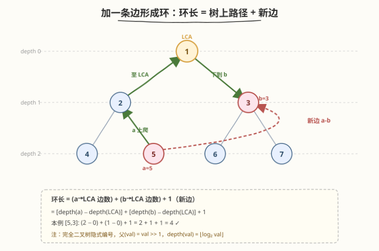
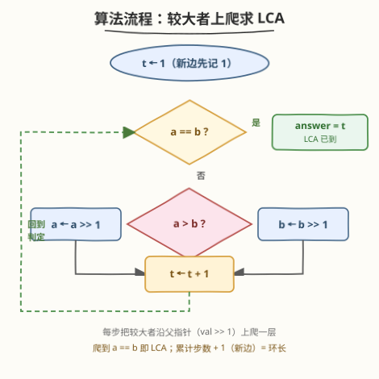
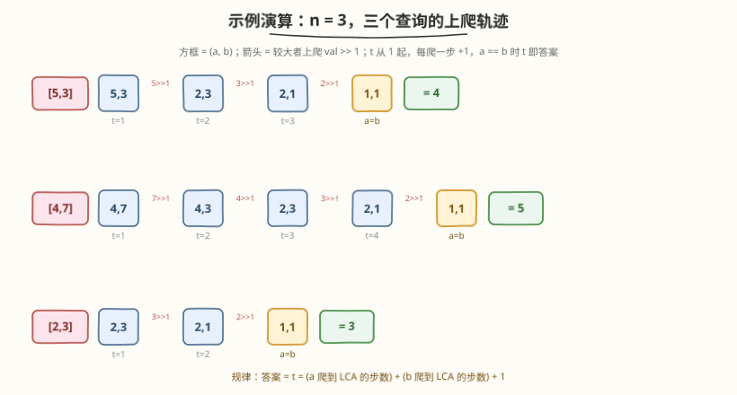

# LeetCode 查询树中环的长度 题解

## 1. 题目概述

- **标题 / 题号**：查询树中环的长度（#2509，hard）
- **链接**：https://leetcode.cn/problems/cycle-length-queries-in-a-tree/
- **难度**：困难
- **标签**：树、二叉树、最近公共祖先、位运算

**题意**：给你一个整数 $n$，表示你有一棵含有 $2^n - 1$ 个节点的**完全二叉树**。根节点编号为 $1$，编号在 $[1,\ 2^{n-1}-1]$ 之间的节点都有两个子节点：

- 左子节点编号为 $2 \times \text{val}$
- 右子节点编号为 $2 \times \text{val} + 1$

再给你一个长度为 $m$ 的查询数组 `queries`，其中 `queries[i] = [a_i, b_i]`。对每个查询依次执行：

1. 在节点 $a_i$ 与 $b_i$ 之间添加一条边；
2. 求出图中**环的长度**（环中边的数目）；
3. 删除刚添加的边（恢复成一棵树，再处理下一个查询）。

> 💡 **环的定义**：开始并结束于同一节点、每条边只走一次的路径；环长 = 环中边数。注意题目提示「加边后两点之间可能有多条边」——这是为 $a,b$ 本就相邻（如父子）时预留的：此时新边与原有的树边构成两条平行边，环长恰为 $2$。

**示例 1**：

```text
输入：n = 3, queries = [[5,3],[4,7],[2,3]]
输出：[4,5,3]
解释：n=3 → 2³−1=7 个节点，编号 1–7：1 为根，2/3 为其左右子，4–7 为叶子。
  - [5,3]：加边后环为 [5,2,1,3]，长度 4
  - [4,7]：加边后环为 [4,2,1,3,7]，长度 5
  - [2,3]：加边后环为 [2,1,3]，长度 3
```

**示例 2**：

```text
输入：n = 2, queries = [[1,2]]
输出：[2]
解释：n=2 → 2²−1=3 个节点（1 为根，2/3 为子）。1 与 2 本就相邻，
      加边后两条平行边构成环 [2,1]，长度 2。
```

**约束**：

- $2 \le n \le 30$
- $m = \text{queries.length}$
- $1 \le m \le 10^5$
- $\text{queries[i].length} = 2$
- $1 \le a_i,\ b_i \le 2^n - 1$
- $a_i \ne b_i$

> ⚠️ **关键约束读法**：$n \le 30$ 意味着节点编号上界 $2^{30}-1 \approx 10^9$——**不可能显式建树**（开不出 $10^9$ 的数组/节点）。但 $n$ 又很小（每条查询的上爬步数 $\le 2(n-1)=58$），配合 $m \le 10^5$，单次 $O(n)$ 的查询总共约 $6\times10^6$ 次操作，完全跑得动。这两点共同决定了下文「不建树、靠编号隐式上爬」的解法形态。

## 2. 解题思路

### 2.1 暴力思路：显式建树 + BFS 找路径

最直白的做法：先按编号建出整棵 $2^n-1$ 个节点的树，再对每个查询从 $a$ 出发 BFS/DFS 走到 $b$，得到树上路径长度，$+1$ 即环长。

正确性无误，但有两处致命：

1. **建树爆内存**：$n=30$ 时节点数 $\approx 10^9$，无论是邻接表还是节点数组都开不出。
2. **BFS 太慢**：即便建得起来，单次 BFS $O(V)$，$m=10^5$ 次 $\to 10^{14}$，必超时。

> ⚠️ 暴力的根因在于把「这棵树」当成「一张需要遍历的普通图」。但完全二叉树的编号本身就是结构——$a$ 到 $b$ 的路径**无需搜索**，只靠「往父节点走」就能算出。一旦意识到父节点 = $\text{val} \gg 1$，建树与 BFS 都成多余。

### 2.2 核心观察：隐式堆式编号 → 环 = 两段根路径 + 新边 → LCA



三个观察层层递进：

1. **完全二叉树的隐式编号（堆）**：编号为 $\text{val}$ 的节点，其父节点编号为 $\text{val} \gg 1$（即 $\lfloor \text{val}/2 \rfloor$），左右子为 $2\text{val}$、$2\text{val}+1$。这与 [222. 完全二叉树的节点个数](../0201-0300/222_完全二叉树的节点个数.md) 所用的「数组堆式存储」完全一致——**整棵树由编号唯一确定，无需 materialize**。节点深度 $\text{depth}(\text{val}) = \lfloor \log_2 \text{val} \rfloor = \text{bit\_length}(\text{val}) - 1$，亦可 $O(1)$ 算出。

2. **加边成环的唯一结构**：树中任意两点间存在**唯一**简单路径；添加一条边 $a$-$b$ 恰好产生**一个**环 = 该唯一路径 + 新边。故：

   $$
   \text{环长} = \text{dist}(a, b) + 1
   $$

3. **树上距离 = depth(a) + depth(b) − 2·depth(LCA)**：唯一路径走「$a$ 上行到最近公共祖先 $\text{LCA}(a,b)$，再下行到 $b$」。于是问题归约为求 $\text{LCA}(a,b)$。在这棵隐式完全二叉树上，LCA 可用一句循环求出——**反复把较大者上爬（`>>= 1`）直到相等**。

   > 💡 **为什么「较大者上爬」能找到 LCA？** 编号 $b$ 的全部祖先为 $b,\ b\gg1,\ b\gg2,\ldots,1$，都 $\le b$。故若 $a > b$，则 $a$ **不可能**是 $b$ 的祖先（$a$ 不在 $b$ 的祖先链中），LCA 必在 $a$ 的上行路径上，安全地把 $a$ 上爬一步；反之亦然。等价地说，$a > b \Rightarrow \lfloor\log_2 a\rfloor \ge \lfloor\log_2 b\rfloor$，即**较大者深度不更浅**，所以「较大者上爬」就是经典的「较深者上爬对齐」LCA 范式。

把三步合起来，每个查询的答案就是：

$$
\text{answer} = \bigl(\text{depth}(a)-\text{depth}(\text{LCA})\bigr) + \bigl(\text{depth}(b)-\text{depth}(\text{LCA})\bigr) + 1
$$

而下面的循环**无需显式算 depth 或 LCA**，用计数器 $t$ 一步到位：$t$ 初值 $1$（新边先记 $1$），每上爬一步 $+1$，到 $a=b$ 时 $t$ 恰为两段步数之和加一。

### 2.3 算法流程图



```text
对每个查询 (a, b):
    t = 1                         # 新边先计 1
    while a != b:
        if a > b: a >>= 1         # a 较大 → a 不可能是 b 的祖先，上爬一层
        else:      b >>= 1        # b 较大 → b 上爬一层
        t += 1                    # 每爬一步累加 1
    answer = t                    # a==b 即 LCA；t = 两段步数 + 1
```

> ⚠️ **终止性与正确性**：每步把 $\max(a,b)$ 严格减小（右移一位至少减半），下界为 $1$，故必终止；终止时 $a=b$ 即两者首次相遇的公共祖先，由「只往上走、且每次都把不可能成为 LCA 的那个上爬」保证该相遇点恰为 LCA。

### 2.4 示例演算



对示例 1（$n=3$，树有 $7$ 个节点）逐查询演算（方框为 $(a,b)$ 当前状态，箭头标注谁上爬）：

| 查询 | 上爬轨迹 | $t$ 演化 | 答案 |
|------|----------|----------|------|
| $[5,3]$ | $(5,3)\xrightarrow{5\gg1}(2,3)\xrightarrow{3\gg1}(2,1)\xrightarrow{2\gg1}(1,1)$ | $1\to2\to3\to4$ | $4$ |
| $[4,7]$ | $(4,7)\xrightarrow{7\gg1}(4,3)\xrightarrow{4\gg1}(2,3)\xrightarrow{3\gg1}(2,1)\xrightarrow{2\gg1}(1,1)$ | $1\to2\to3\to4\to5$ | $5$ |
| $[2,3]$ | $(2,3)\xrightarrow{3\gg1}(2,1)\xrightarrow{2\gg1}(1,1)$ | $1\to2\to3$ | $3$ |

对照公式验证 $[5,3]$：$\text{depth}(5)=2,\ \text{depth}(3)=1,\ \text{LCA}=1,\ \text{depth}(1)=0$，环长 $=(2-0)+(1-0)+1=4$ ✓。

示例 2 $[1,2]$：$1$ 是 $2$ 的父节点，$\text{LCA}(1,2)=1$，环长 $=(0-0)+(1-0)+1=2$ ✓——正对应「两点本就相邻、加边后两条平行边成环」的情形。

> 💡 **每个查询独立**：题目要求「加边后删除」，故查询间无状态累积，可逐个在线处理，无需离线批处理。

## 3. 参考代码

### C++

```cpp
class Solution {
public:
    vector<int> cycleLengthQueries(int n, vector<vector<int>>& queries) {
        vector<int> ans;
        ans.reserve(queries.size());
        for (auto& q : queries) {
            int a = q[0], b = q[1];
            int t = 1;                  // 新边先计 1
            while (a != b) {
                if (a > b) a >>= 1;     // 较大者上爬一层（不可能成为 LCA 的那个）
                else        b >>= 1;
                ++t;                    // 每爬一步累加 1
            }
            ans.push_back(t);
        }
        return ans;
    }
};
```

> 💡 **几个细节**：① 形参 `n` 在代码里**未使用**——它只用来界定 $a,b$ 的值域上界 $2^n-1$，真正的计算完全靠编号自身，无需 `n` 参与。② `a >>= 1` 即 `a /= 2`，对应「走向父节点」；用位移更贴合「砍掉二进制末位」的直觉（见第 5 节）。③ `int` 足够：$a,b \le 2^{30}-1 < 2^{31}$，右移只减不增，无溢出风险。④ `reserve` 仅省少量重分配，非必须。

### Python

```python
class Solution:
    def cycleLengthQueries(self, n: int, queries: List[List[int]]) -> List[int]:
        ans = []
        for a, b in queries:
            t = 1                      # 新边先计 1
            while a != b:
                if a > b:
                    a >>= 1            # 较大者上爬一层
                else:
                    b >>= 1
                t += 1
            ans.append(t)
        return ans
```

> 💡 Python 大整数天然安全；写法与 C++ 一一对应。亦可一行化 `while a != b: a, b = ((a >> 1, b) if a > b else (a, b >> 1)); t += 1`，但三元分支可读性不如 `if/else`，面试中保留显式分支更清晰。

## 4. 复杂度分析

| 维度 | 复杂度 | 说明 |
|------|--------|------|
| **时间** | $O(n \cdot m)$ | 每查询至多上爬 $\text{depth}(a)+\text{depth}(b) \le 2(n-1)$ 步，即 $O(n)$；$m$ 次查询 $\Rightarrow O(nm)$。$n\le30,\ m\le10^5 \Rightarrow \approx 6\times10^6$，远低于时限 |
| **空间** | $O(m)$ | 仅答案数组（不计输出则为 $O(1)$ 额外空间）；不建树、不哈希 |
| 对照：显式建树 + BFS | $O(V + m\cdot V)$ | $V=2^n-1\approx10^9$，建树即爆内存，BFS 单次 $O(V)$ 也超时 |
| 对照：倍增 LCA | $O(V\log V + m\log n)$ | 需 $O(V)$ 预处理，$V\approx10^9$ 不可行；隐式编号下反而不如直接上爬 |

> 💡 **为什么是 $O(n)$ 而非 $O(\log V)$？** 两者数值上同阶（$n=\lceil\log_2(V+1)\rceil$），但语义不同：倍增 LCA 的 $O(\log n)$ 依赖**已建好的树 + 预处理**，而本题根本没有显式树，只能靠编号上爬——每爬一步至少把当前值减半，$n$ 步内必到根。故「$O(n)$ 单查询」是隐式树下的自然上界，且 $n\le30$ 极小，无需更优。

## 5. 扩展：二进制前缀视角与一般树的 LCA

### 5.1 二进制前缀视角：LCA = 公共二进制前缀

节点 $\text{val}$ 的二进制表示就是**从根到该节点的路径**：最高位的 $1$ 代表根，其后每一位 $0$/$1$ 分别表示「走左/走右」。例如 $5=\texttt{101}$：根 $1$ → 左（$0$）到 $2$ → 右（$1$）到 $5$。

于是 $\text{LCA}(a,b)$ = $a,b$ 二进制表示的**最长公共前缀**所表示的数；`val >>= 1` 就是「砍掉末位」=「上爬一层」。这给了「较大者上爬」一个干净的解释：较长的二进制串（值更大）砍末位，直到两串相等即公共前缀。

```python
# 二进制前缀法（等价，仅作理解；实测不比上爬快）
def cycle(a, b):
    x, y = a, b
    while x != y:                # 砍末位直到公共前缀
        x, y = (x >> 1, y) if x > y else (x, y >> 1)
    lca = x                      # 公共前缀 = LCA
    return a.bit_length() + b.bit_length() - 2 * lca.bit_length() + 2
    # depth(a)=a.bit_length()-1, depth(b)=..., depth(lca)=lca.bit_length()-1
    # 代入：(+1 项来自新边) → 上式
```

> ⚠️ 公式项数易错：$\text{depth}(x) = x.\text{bit\_length}()-1$，故 $\text{dist}+1 = (a.\text{bl}-1)+(b.\text{bl}-1)-2(l.\text{bl}-1)+1 = a.\text{bl}+b.\text{bl}-2l.\text{bl}+2$。直接用第 3 节的计数器 $t$ 更不易错，此处仅作结构对照。

### 5.2 一般树怎么办：倍增 LCA（对照，非本题所需）

本题能 $O(n)$ 单查询，全靠「父节点 = $\text{val}\gg1$」这条隐式捷径。换到**任意形状**的二叉树（如 [236](../0201-0300/236_二叉树的最近公共祖先.md)）或**带父指针但非完全**的树（如 [1650](../1601-1700/1650_二叉树的最近公共祖先III.md)），就不能靠编号上爬了，需用通用 LCA 手段：

- **递归后序**（[236](../0201-0300/236_二叉树的最近公共祖先.md)）：左右子树分别找 $p,q$，在根处汇总——单次 $O(n)$。
- **倍增（binary lifting）**：预处理 $\text{up}[v][k]$（$v$ 的 $2^k$ 辈祖先），$O(V\log V)$ 预处理 + $O(\log V)$ 单查询，适合**多次查询**大静态树。
- **带父指针两节点**（[1650](../1601-1700/1650_二叉树的最近公共祖先III.md)）：沿 `parent` 上爬，可「对齐深度后同步爬」或「双指针走到 null 互换起点」（类 [160. 相交链表](../0101-0200/160_相交链表.md)）。

本题因完全二叉树的隐式编号，省去了所有预处理：编号即结构、`>>1` 即上爬，是最简形态。**面试中若被问「树不是完全二叉树怎么办」，答倍增 LCA**。

## 6. 面试要点

1. **为什么「较大者上爬」能正确找到 LCA？**

   > 编号 $b$ 的祖先链 $b,\ b\gg1,\ \ldots,\ 1$ 全都 $\le b$。若 $a>b$，则 $a$ 不在 $b$ 的祖先链中 $\Rightarrow$ $a$ 不可能是 LCA（LCA 必须是 $b$ 的祖先），故把 $a$ 上爬一步安全；反之 $b$ 上爬。每步排除「不可能成为 LCA」的那个，直到相遇即 LCA。等价地，$a>b\Rightarrow\text{depth}(a)\ge\text{depth}(b)$，故「较大者上爬」=「较深者对齐」的经典 LCA 范式。

2. **为什么不显式建树？$n$ 在代码里没用到，合理吗？**

   > $n\le30\Rightarrow V=2^n-1\approx10^9$，开不出节点数组/邻接表，建树即爆内存。完全二叉树的编号**自带结构**：父 = $\text{val}\gg1$，故整棵树是「隐式」的，计算只依赖 $a,b$ 自身，不需要 `n`——它只约束 $a,b$ 的值域上界。形参不用是合理的。

3. **环长公式怎么推？为什么是 $+1$？**

   > 树中两点唯一简单路径 + 新加边 = 唯一环。路径长 = $\text{dist}(a,b)=\text{depth}(a)+\text{depth}(b)-2\text{depth}(\text{LCA})$（$a$ 上行到 LCA、再下行到 $b$）。环长 = 路径长 $+1$（新边）。代码里 $t$ 从 $1$ 起、每爬 $+1$，正好把「两段步数 $+1$」一次累出。

4. **两点本就相邻（如 $[1,2]$）会怎样？环长为何是 $2$？**

   > $1$ 是 $2$ 的父，$\text{LCA}(1,2)=1$，$\text{dist}=(0-0)+(1-0)=1$，环长 $=1+1=2$。对应「加边后两点间有两条平行边」构成 $2$-环——这正是题目提示「加边后可能有多条边」的用意。代码无需特判，上爬逻辑自然给出 $t=2$。

5. **时间复杂度 $O(nm)$ 够吗？能否做到单查询 $O(1)$？**

   > $n\le30,\ m\le10^5\Rightarrow O(nm)\approx6\times10^6$，轻松 AC。单查询 $O(1)$ 需 $O(1)$ 求 LCA——可用二进制公共前缀（求最长公共前缀的位运算，常数级）逼近，但因 $n$ 已极小，常数收益微乎其微，反而牺牲可读性。**$O(n)$ 单查询在隐式完全二叉树下已是最简且足够优**。

> 💡 **一句话总结**：2509 把「加边求环长」塌缩为「求完全二叉树上两点的 LCA」——树是隐式的（父 $=\text{val}\gg1$），LCA 靠「较大者上爬」一句 while 求出，计数器 $t$ 从 $1$ 起、每爬一步 $+1$，到 $a=b$ 时 $t$ 即环长。不建树、不哈希、$O(n)$ 单查询。

## 同类练习题

| # | 题目 | 与本题的关联 |
|---|------|-------------|
| 1740 | [找到二叉树中的距离](https://leetcode.cn/problems/find-distance-in-a-binary-tree/)（[题解](../1701-1800/1740_找到二叉树中的距离.md)） | 本题答案就是「树上距离 $+1$」；同样的 $\text{dist}=\text{depth}(a)+\text{depth}(b)-2\text{depth}(\text{LCA})$，对照「加边成环 = 距离 + 新边」 |
| 236 | [二叉树的最近公共祖先](https://leetcode.cn/problems/lowest-common-ancestor-of-a-binary-tree/)（[题解](../0201-0300/236_二叉树的最近公共祖先.md)） | LCA 母题；本题 `while` 循环即 LCA 的迭代版，对照「后序递归」与「编号上爬」两种 LCA 实现 |
| 222 | [完全二叉树的节点个数](https://leetcode.cn/problems/count-complete-tree-nodes/)（[题解](../0201-0300/222_完全二叉树的节点个数.md)） | 完全二叉树的「堆式编号 + 父 $=\text{val}\gg1$」性质母题，本题直接复用此隐式结构 |
| 1650 | [二叉树的最近公共祖先 III](https://leetcode.cn/problems/lowest-common-ancestor-of-a-binary-tree-iii/)（[题解](../1601-1700/1650_二叉树的最近公共祖先III.md)） | 带 `parent` 指针的两节点 LCA，靠「上爬」实现，与本题「较大者上爬」同构——区别仅在父指针是显式给出还是由编号隐式给出 |
| 235 | [二叉搜索树的最近公共祖先](https://leetcode.cn/problems/lowest-common-ancestor-of-a-binary-search-tree/)（[题解](../0201-0300/235_二叉搜索树的最近公共祖先.md)） | BST 的 LCA，利用 BST 序性质而非深度对齐，对照「特殊树结构如何加速 LCA」的另一形态 |
