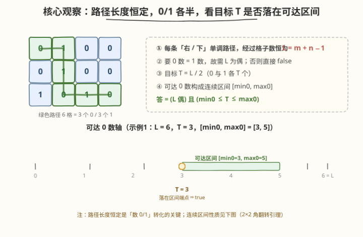
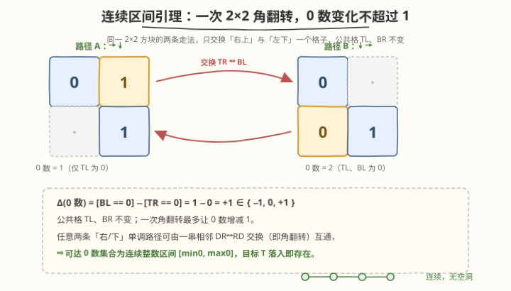
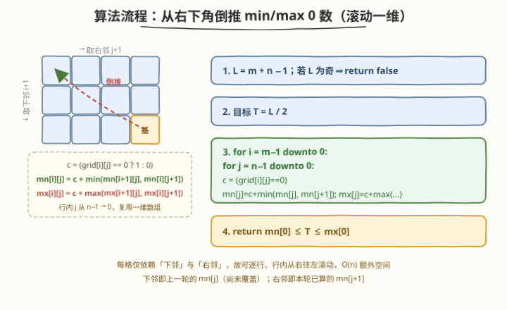
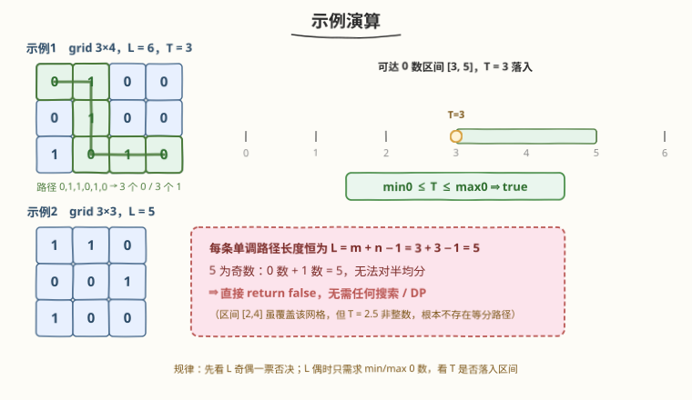

# LeetCode 检查是否有路径经过相同数量的 0 和 1 题解

## 1. 题目概述

- **标题 / 题号**：检查是否有路径经过相同数量的 0 和 1（#2510，medium）
- **链接**：https://leetcode.cn/problems/check-if-there-is-a-path-with-equal-number-of-0s-and-1s/
- **难度**：中等
- **标签**：数组、动态规划、矩阵

**题意**：给定一个**下标从 0 开始**的 $m \times n$ 的**二进制**矩阵 `grid`。从坐标 $(row,\ col)$ 出发，只能向右走到 $(row,\ col+1)$ 或向下走到 $(row+1,\ col)$。

返回一个布尔值，表示从 $(0,\ 0)$ 出发是否存在一条路径，经过**相同**数量的 $0$ 和 $1$，最终到达终点 $(m-1,\ n-1)$。存在返回 `true`，否则返回 `false`。

> 💡 **本题是 LeetCode 会员题（🔒 Premium）**，题面与数据均需会员权限访问；本文据公开题意整理。

**示例 1**：

```text
输入：grid = [[0,1,0,0],[0,1,0,0],[1,0,1,0]]
输出：true
解释：蓝色路径 0→1→1→0→1→0 上有 3 个值为 1 的格子和 3 个值为 0 的格子，故返回 true。
```

**示例 2**：

```text
输入：grid = [[1,1,0],[0,0,1],[1,0,0]]
输出：false
解释：该网格中不存在一条经过相同数量 0 和 1 的路径。
```

**约束**：

- $m = \text{grid.length}$
- $n = \text{grid}[i].\text{length}$
- $2 \le m,\ n \le 100$
- $\text{grid}[i][j]$ 不是 $0$ 就是 $1$

> ⚠️ **关键约束读法**：$m,\ n \le 100$ 意味着路径长度 $L = m+n-1 \le 199$，配合第三维差分，状态数 $\approx m\cdot n\cdot (m+n) \le 2\times10^6$——这正是官方 hint 所给「差分 DP」可承受的规模。而 $m,\ n$ 又小到 $O(mn)$ 的简单 DP 也绰绰有余，于是下文另辟一条 $O(mn)$ 的 min/max 解法（第 2.2 节），把第 5 节的差分 DP 作为对照。

## 2. 解题思路

### 2.1 暴力思路：枚举所有路径

最直白的做法：枚举从 $(0,0)$ 到 $(m-1,\ n-1)$ 的每一条「右 / 下」单调路径，逐条数 $0/1$，命中等分即返回 `true`。

正确性无误，但单调路径数 $= \binom{m+n-2}{m-1}$，$m=n=100$ 时是天文数字（$\approx 10^{58}$），必超时。即使加记忆化的「$(i,j)$ + 已走 $1$ 数」三维状态，也只是把它写成 DP（即第 5 节）。

> ⚠️ 暴力的根因在于「逐条路径判断」。但本题只问**是否存在**等分路径，且所有路径长度恒定——这条不变量让我们不必逐条搜索，见 2.2。

### 2.2 核心观察：路径长度恒定 + 可达 0 数构成连续区间



三个观察层层递进：

1. **路径长度恒定**：每条「右 / 下」单调路径从 $(0,0)$ 到 $(m-1,\ n-1)$ 都恰好走 $m-1$ 步下、$n-1$ 步右，**经过格子数恒为** $L = m+n-1$。于是「$0$ 数 = $1$ 数」当且仅当两者各为 $T = L/2$。这立刻给出一票否决：

   $$
   L \text{ 为奇} \;\Longrightarrow\; \text{不存在等分路径，直接返回 false}
   $$

   （示例 2 即此：$L = 3+3-1 = 5$ 为奇，无需任何搜索。）

2. **问题归约为「是否存在路径含恰好 $T$ 个 0」**：记某条路径上 $0$ 的个数为 $z$，则问题等价于 $z = T$ 是否可达。

3. **连续区间引理**：所有单调路径的 $z$ 值构成一个**连续整数区间** $[\text{min0},\ \text{max0}]$——即若 $z=a$ 与 $z=b$（$a<b$）都可达，则其间任意整数也可达。

   

   > 💡 **为什么连续？** 把每条单调路径写成一串由 $D$（下）、$R$（右）组成的步序串。任意两条步序串可经一串**相邻交换** $DR \leftrightarrow RD$ 互相转化（如同冒泡排序）。一次相邻交换恰对应一个 $2\times2$ 方块的「角翻转」：把「先右后下」换成「先下后右」，路径只交换**右上**与**左下**一个格子，公共的左上、右下不变。故 $z$ 的变化 $=[\text{左下}=0] - [\text{右上}=0]\in\{-1,\,0,\,+1\}$。步序串在相邻交换下连通、每步变化 $\le1$，由离散介值定理，$z$ 取遍 $[\text{min0},\ \text{max0}]$ 全部整数。

把三步合起来，只需算出 $\text{min0}$ 与 $\text{max0}$：

$$
\text{answer} = (L \text{ 为偶}) \;\wedge\; \bigl(\text{min0} \le T \le \text{max0}\bigr)
$$

而 $\text{min0}/\text{max0}$ 用一个朴素的倒推 DP 即可（第 2.3 节），$O(mn)$ 时间、$O(n)$ 额外空间。

> ⚠️ **对照官方思路**：LeetCode 给的 hint 是「$\text{dp}[i][j][\text{diff}]$ 表示从 $(i,j)$ 到终点、$0/1$ 计数差为 $\text{diff}$ 是否可达」的三维布尔 DP（第 5 节）。它**直接判定** $z=T$，不必依赖连续性引理，时间 $O(mn(m+n))$。本节的 min/max 解法用「连续性」换掉第三维，降到 $O(mn)$——是同一问题的更优形态。

### 2.3 算法流程图



记 $c(i,j) = 1$ 若 $\text{grid}[i][j]=0$，否则 $0$。从右下角 $(m-1,\ n-1)$ 向左上倒推：

```text
L = m + n - 1
若 L 为奇: return false
T = L / 2
对 i = m-1 downto 0:
    对 j = n-1 downto 0:
        c = (grid[i][j] == 0)
        若 (i,j) 是终点 (m-1,n-1):  mn[j] = mx[j] = c        # 基
        否则:
            mn[j] = c + min(mn[j] (下邻 i+1,j), mn[j+1] (右邻 i,j+1))
            mx[j] = c + max(mx[j],            mx[j+1])
return mn[0] <= T <= mx[0]
```

> ⚠️ **滚动一维的正确性**：行内从右往左处理，更新 `mn[j]` 时，`mn[j]`（旧值）恰是下一行同列 $=$ 下邻，`mn[j+1]`（本行已更新）恰是右邻——两者都已是「$(i,j)$ 之后」的子问题答案，先于 $(i,j)$ 求出。数组末端 `mn[n]` 设为 $+\infty$ / `mx[n]` 设为 $-\infty$ 作哨兵，使最右列没有右邻时自动只取下邻。故只需一个长度 $n+1$ 的数组。

### 2.4 示例演算



**示例 1**（$3\times4$，$L=6$，$T=3$）：

绿色路径 $(0,0)\to(0,1)\to(1,1)\to(2,1)\to(2,2)\to(2,3)$ 的格值为 $0,1,1,0,1,0$，含 $3$ 个 $0$、$3$ 个 $1$。倒推得 $\text{min0}=3,\ \text{max0}=5$，可达 $0$ 数区间 $[3,5]$ 连续，$T=3\in[3,5]$ ⇒ `true` ✓。

**示例 2**（$3\times3$，$L=5$）：$L$ 为奇，一票否决 ⇒ `false` ✓（无需搜索；区间虽为 $[2,4]$，但 $T=2.5$ 非整数，本就不存在等分路径）。

> 💡 示例 1 的 $T=3$ 恰落在区间**左端点** $\text{min0}=3$ 上——这正是「取到最少 $0$ 的那条路径」恰好等分；连续性保证端点值必由某条路径达到，故端点命中也算 `true`。

## 3. 参考代码

### C++

```cpp
class Solution {
public:
    bool isThereAPath(vector<vector<int>>& grid) {
        int m = grid.size(), n = grid[0].size();
        int L = m + n - 1;
        if (L & 1) return false;              // 路径格子数为奇，无法对半均分

        int T = L / 2;
        const int INF = 1e9;
        vector<int> mn(n + 1, INF);          // mn[j] = 当前行第 j 列到终点的最少 0 数
        vector<int> mx(n + 1, -INF);         // mx[j] = 最多 0 数；mn[n]/mx[n] 为哨兵

        for (int i = m - 1; i >= 0; --i) {
            for (int j = n - 1; j >= 0; --j) {
                int c = (grid[i][j] == 0);   // 当前格贡献
                if (i == m - 1 && j == n - 1) {
                    mn[j] = mx[j] = c;       // 终点：无后继，基即自身
                } else {
                    mn[j] = c + min(mn[j], mn[j + 1]);   // 下邻(旧 mn[j]) 与 右邻(mn[j+1])
                    mx[j] = c + max(mx[j], mx[j + 1]);
                }
            }
        }
        return mn[0] <= T && T <= mx[0];
    }
};
```

> 💡 **几个细节**：① `mn[j]` 在更新前是下一行同列的值（下邻），更新后变成本行的值——这正是滚动数组复用的关键。② 行内 $j$ 从 $n-1$ 到 $0$，保证更新 `mn[j]` 时 `mn[j+1]` 已是本行新值（右邻）。③ 哨兵 `mn[n]=+INF`、`mx[n]=-INF` 使最右列无右邻时 $\min/\max$ 自动只选下邻；初始全行也是哨兵，使最下行无下邻时同理。④ 不需特判 $1$ 的数量：$z\in[\text{min0},\text{max0}]$ 与「$0$ 数恰为 $z$」等价，$T$ 落入区间即存在等分路径。

### Python

```python
class Solution:
    def isThereAPath(self, grid: List[List[int]]) -> bool:
        m, n = len(grid), len(grid[0])
        L = m + n - 1
        if L & 1:
            return False
        T = L // 2
        INF = 10 ** 9
        mn = [INF] * (n + 1)          # mn[j]: 当前行第 j 列到终点的最少 0 数
        mx = [-INF] * (n + 1)         # mx[j]: 最多 0 数；mn[n]/mx[n] 为哨兵
        for i in range(m - 1, -1, -1):
            for j in range(n - 1, -1, -1):
                c = 1 if grid[i][j] == 0 else 0
                if i == m - 1 and j == n - 1:
                    mn[j] = mx[j] = c
                else:
                    mn[j] = c + min(mn[j], mn[j + 1])     # 下邻(旧 mn[j]) 与 右邻(mn[j+1])
                    mx[j] = c + max(mx[j], mx[j + 1])
        return mn[0] <= T <= mx[0]
```

> 💡 Python 写法与 C++ 一一对应；`mn[n]` 恒为 `INF`、`mx[n]` 恒为 `-INF`，最右列自动只取下邻，无需额外特判。

## 4. 复杂度分析

| 维度 | 复杂度 | 说明 |
|------|--------|------|
| **时间** | $O(mn)$ | 每格 $O(1)$（一次 $\min$、一次 $\max$），共 $mn$ 格；先算 $L$ 奇偶一票否决 |
| **空间** | $O(n)$ | 仅两个长度 $n+1$ 的滚动数组；不计输入 |
| 对照：差分布尔 DP（官方 hint） | $O(mn(m+n))$ | $\text{dp}[i][j][\text{diff}]$ 三维，$\text{diff}\in[-L,L]$；可直接判定 $z=T$，不依赖连续性引理，但慢一阶 |
| 对照：暴力枚举路径 | $O\!\left(\binom{m+n-2}{m-1}\right)$ | 路径数指数级，$m=n=100$ 必超时 |

> 💡 **为什么能降到 $O(mn)$？** 差分 DP 把「$z$ 能否取某个值」逐值记录，故需第三维；min/max 解法用**连续性引理**把「$z=T$ 是否可达」塌缩为「$T\in[\text{min0},\text{max0}]$」——只要端点，不要中间，第三维消失。代价是依赖「单调路径 $z$ 值连续」这条性质（2.2 节已证）。

## 5. 扩展：差分布尔 DP（对应官方 hint）

### 5.1 三维布尔 DP / 记忆化搜索

按官方 hint：$\text{dp}[i][j][\text{diff}]$ 表示从 $(i,j)$ 到终点、$(0\text{ 数} - 1\text{ 数})$ 的差为 $\text{diff}$ 是否可达，答案 $\text{dp}[0][0][0]$。等价的「前向计数」版本更直观：$f[i][j][k]$ = 从 $(0,0)$ 到 $(i,j)$ 累计了 $k$ 个 $1$ 是否可达，答案 $f[m-1][n-1][T]$。

记忆化搜索写法（$k$ 为到 $(i,j)$ 为止累计的 $1$ 数，含当前格）：

```python
class Solution:
    def isThereAPath(self, grid: List[List[int]]) -> bool:
        m, n = len(grid), len(grid[0])
        L = m + n - 1
        if L & 1:
            return False
        T = L // 2                      # 需 0、1 各 T 个

        @cache
        def dfs(i, j, k):               # k = 到 (i,j) 为止累计的 1 数（含 (i,j)）
            if k > T or (i + j + 1) - k > T:    # 1 过多 或 0 过多，剪枝
                return False
            if i == m - 1 and j == n - 1:
                return k == T
            if i + 1 < m and dfs(i + 1, j, k + grid[i + 1][j]):
                return True
            if j + 1 < n and dfs(i, j + 1, k + grid[i][j + 1]):
                return True
            return False

        return dfs(0, 0, grid[0][0])
```

> ⚠️ **剪枝是关键**：$k>T$（$1$ 已超目标）或 $(i+j+1)-k > T$（$0$ 已超目标）即返回 `false`，把 $\text{diff}$ 维有效范围压到 $[0,T]$，状态数 $\approx mn\cdot T \le mn\cdot\frac{L}{2} \approx 2\times10^6$。若无此剪枝，第三维会膨胀到 $[-L,L]$，常数与空间都翻倍。

### 5.2 两种解法的关系

差分 DP「逐值记录」、min/max「只记端点」——后者是前者在**连续性引理**下的退化。两者判定等价（连续性保证端点之间无空洞），但 min/max 少一维、快一阶。面试中可先讲差分 DP（思路最直、不依赖额外引理），再引出「能否砍掉第三维」得到 min/max，展示从 $O(mn(m+n))$ 到 $O(mn)$ 的优化路径。

## 6. 面试要点

1. **为什么「路径长度恒定」如此重要？**

   > 「右 / 下」单调路径从 $(0,0)$ 到 $(m-1,n-1)$ 必走 $(m-1)$ 步下 + $(n-1)$ 步右，故经过格子数恒为 $m+n-1$，与具体路径无关。于是「$0$ 数 = $1$ 数」⟺「$0$ 数 = $1$ 数 = $(m+n-1)/2$」，并把奇偶一票否决变成 $O(1)$ 预判（示例 2 即此）。

2. **连续区间引理为什么成立？凭什么「端点之间无空洞」？**

   > 单调路径的步序串在相邻交换 $DR\leftrightarrow RD$ 下连通（冒泡排序可任取两条互相转化）；每次交换对应一个 $2\times2$ 角翻转，只换一个格子，故 $z$ 变化 $\le1$。沿连通图上任一条 $z=a$ 到 $z=b$ 的路径走，每步变化 $\le1$，由离散介值定理必经 $a$、$b$ 间所有整数——故 $z$ 取值连续。

3. **滚动一维为什么正确？下邻和右邻分别是谁？**

   > 行内 $j$ 从 $n-1$ 到 $0$ 更新。更新 `mn[j]` 时：`mn[j]` 的旧值是**下一行同列**（下邻，尚未被本行覆盖）；`mn[j+1]` 是本行已更新的值（右邻）。两者都是 $(i,j)$ 之后的子问题答案，先于 $(i,j)$ 求出，故可原地复用。哨兵 `mn[n]=+INF`、`mx[n]=-INF` 让最右列无右邻时只取下邻。

4. **$T$ 落在区间端点上算不算 `true`？示例 1 的 $T=3$ 恰是 $\text{min0}$。**

   > 算。连续性引理保证端点值 $\text{min0}/\text{max0}$ 本身就是某条路径的 $z$（取到最值的路径存在），故 $T=\text{min0}$ 或 $T=\text{max0}$ 即意味着存在等分路径。示例 1 的 $T=3=\text{min0}$ 正对应那条取最少 $0$ 的等分路径。

5. **若把移动改成四向（上下左右）本题还能这么做吗？**

   > 不能。四向移动可绕路、可重复经过格子，路径长度不再恒定，「步序串相邻交换」与「$z$ 连续」均失效，且会成环需 BFS + 状态。此时只能用「$(i,j)$ + 累计差」的 BFS / 记忆化（差分 DP 的图搜索版），$z$ 不再连续、min/max 不再适用。题面限定「右 / 下」正是为了让 DAG + 路径长度恒定这两条性质成立。

> 💡 **一句话总结**：2510 把「是否存在等分 $0/1$ 的单调路径」塌缩为「路径长度 $L=m+n-1$ 奇偶一票否决 + 可达 $0$ 数连续区间 $[\text{min0},\text{max0}]$ 是否含 $T=L/2$」——靠「单调路径 $z$ 值连续」这条引理砍掉差分 DP 的第三维，倒推 min/max 各一遍，$O(mn)$ 时间、$O(n)$ 空间即得。

## 同类练习题

| # | 题目 | 与本题的关联 |
|---|------|-------------|
| 62 | [不同路径](https://leetcode.cn/problems/unique-paths/)（[题解](../0001-0100/62_不同路径.md)） | 单调路径计数母题；本题连续性引理依赖其「步序串相邻交换连通」的结构 |
| 64 | [最小路径和](https://leetcode.cn/problems/minimum-path-sum/)（[题解](../0001-0100/64_最小路径和.md)） | 同样的「自底向上 $\min$ 邻居 + 自身」倒推递推，对照本题 min/max 双轨 |
| 2304 | [网格中的最小路径代价](https://leetcode.cn/problems/minimum-path-cost-in-a-grid/)（[题解](../2301-2400/2304_网格中的最小路径代价.md)） | 带权网格路径 DP，对照本题「无权只数 $0$」的 min/max 形态 |
| 1289 | [下降路径最小和 II](https://leetcode.cn/problems/minimum-falling-path-sum-ii/)（[题解](../1201-1300/1289_下降路径最小和II.md)） | 矩阵 DP 在前驱上取 $\min$ + 行间滚动，与本题滚动一维同构 |
| 1594 | [矩阵的最大非负积](https://leetcode.cn/problems/max-non-negative-product-in-a-matrix/)（[题解](../1501-1600/1594_矩阵的最大非负积.md)） | 路径积的「最大 / 最小」双轨 DP（负值会让两轨互换），与本题 min/max 双轨同构，对照「为何需要同时维护两条」 |
