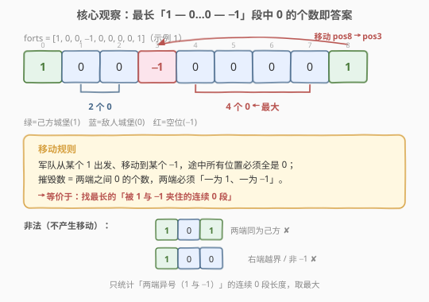
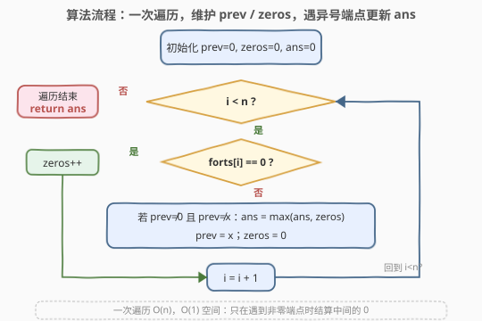

# 最多可以摧毁的敌人城堡数目

- **题目名称**：最多可以摧毁的敌人城堡数目
- **链接**：[2511. 最多可以摧毁的敌人城堡数目](https://leetcode.cn/problems/maximum-enemy-forts-that-can-be-captured/)
- **难度**：简单
- **标签**：数组、一次遍历、枚举

## 1. 题目概述

给你一个长度为 $n$、下标从 $0$ 开始的整数数组 `forts`，表示一排城堡。`forts[i]` 取值为 $-1, 0, 1$：

- $-1$：第 $i$ 个位置**没有**城堡（空位）；
- $0$：第 $i$ 个位置有一个**敌人**的城堡；
- $1$：第 $i$ 个位置有一个**你控制**的城堡。

你可以将军队从某个你控制的城堡位置 $i$ 移动到一个空位 $j$（`forts[j] == -1`），且**途中经过的位置必须全是敌人城堡**：对所有 $\min(i,j) < k < \max(i,j)$ 都满足 `forts[k] == 0`。移动时途中的敌人城堡全被摧毁。返回**最多**能摧毁的敌人城堡数目；若无法移动或没有己方城堡，返回 $0$。

**示例 1**：

```text
输入：forts = [1,0,0,-1,0,0,0,0,1]
输出：4
解释：
- 从位置 0 移到位置 3，摧毁 2 个（位置 1、2）；
- 从位置 8 移到位置 3，摧毁 4 个（位置 4、5、6、7）。
最多 4 个，返回 4。
```

**示例 2**：

```text
输入：forts = [0,0,1,-1]
输出：0
解释：从位置 2 移到位置 3，途中没有敌人城堡，摧毁 0 个。
```

**约束条件**：

- $1 \le \text{forts.length} \le 1000$
- $-1 \le \text{forts[i]} \le 1$

> 💡 关键细节：一次合法移动的**起点必须是 1、终点必须是 −1**（反之亦然：起点 −1、终点 1 也可，因为「移动」是对称的，摧毁的是中间的 0），且**中间一整段必须是连续的 0**。所以摧毁数 = 两端异号、中间全 0 的那段「0 的个数」。问题因此塌缩为：找最长的「被 1 与 −1 夹住的连续 0 段」。

---

## 2. 解题思路

### 2.1 暴力思路：枚举每个己方城堡双向扫描

最直白的实现是**枚举每个 `forts[i] == 1`** 作为出发点，向左、向右各扫一遍：

- 沿方向 $d\in\{-1,+1\}$ 前进，统计连续的 $0$；
- 一旦遇到 $-1$，说明落到了空位，**合法**，用累计的 $0$ 个数更新答案并停；
- 若遇到 $1$（撞到自己的城堡）或越界，则**不合法**，丢弃。

每个起点做两次最长 $O(n)$ 的扫描，共 $n$ 个起点，总计 $O(n^2)$。约束 $n\le 1000$ 时约 $10^6$ 步，能过，但写法略繁琐、且把「两端异号」的判定拆散到逐点扫描里，结构感不强。

> ⚠️ 枚举暴露一个事实：真正决定一次摧毁数的，**只有连续 0 段两端的两个非零值**——中间的 0 无论如何都是被摧毁的。两端异号才合法、同号则非法。这意味着不必为每个起点逐点扫，只需在「遇到非零端点」时，用「自上一个非零端点以来累计的 0 个数」一次性结算。这把 $O(n^2)$ 压成 $O(n)$。

### 2.2 核心观察：一次遍历，维护 prev / zeros



**关键直觉**：把数组看成「非零端点」与「中间连续 0 段」的交替序列。每个连续 0 段的合法性、以及它能贡献的摧毁数，**完全由紧邻它的左右两个非零值是否异号决定**：

- 左右一为 $1$、一为 $-1$（异号）→ 这段 0 可被一次合法移动横扫，摧毁数 = 段长；
- 左右同号（同为 $1$ 或同为 $-1$）→ 落不到异号端点，**非法**，贡献 $0$；
- 段的一端贴着数组边界（前面没有非零端点）→ 同样无法形成「两端异号」，贡献 $0$。

于是只需**一次遍历**，维护两个量：

- `prev`：上一个见到的非零值（$1$ 或 $-1$），初值 $0$ 表示「尚未见过任何城堡」；
- `zeros`：自上一个非零端点以来、连续遇到 $0$ 的个数。

遍历每个 $x = \text{forts[i]}$：

- 若 $x = 0$：`zeros++`（继续累积中间的敌人城堡）；
- 若 $x\ne 0$（即 $1$ 或 $-1$）：
  - 若 `prev != 0`（存在上一个端点）且 `prev != x`（两端异号）→ 用 `zeros` 更新 `ans = max(ans, zeros)`；
  - 然后 `prev = x`，`zeros = 0`（开启新的待结算段）。

> 💡 **为什么 `prev != 0` 也要判？** 因为首个非零端点之前没有任何端点，它左边那段 0（若有）只有一端被夹，构不成合法移动；用 `prev == 0` 标记「尚无前驱端点」可直接跳过结算。`prev` 复用 $0$ 作为哨兵安全，是因为合法端点只能是 $\pm 1$，永不为 $0$。

**对称性说明**：算法把「1→−1（向右移）」和「−1→1（向左移）」统一成「相邻两个非零端点异号」一种情形——因为摧毁数只关心中间 0 的个数，与移动方向无关。验证示例 1：端点序列为 $1, -1, 1$，两段中间 $0$ 分别为 $2$、$4$，均异号，取最大 $4$ ✓。

### 2.3 算法流程图



三步：

1. 初始化 `prev = zeros = ans = 0`，下标 $i = 0$；
2. 遍历：遇 $0$ 则 `zeros++`；遇非零则按「`prev != 0 且 prev != x`」结算 `ans`，再 `prev = x; zeros = 0`；
3. 遍历结束，返回 `ans`。

> 💡 结算只在「遇到非零端点」时发生，连续 $0$ 段不会单独触发任何更新——它只是被动地在下个端点到来时被结算。这正是「分组计数」的典型结构：用边界事件触发对一段连续同质元素的总结算。

### 2.4 示例演算

![示例演算：forts=[1,0,0,−1,0,0,0,0,1]，两次结算取最大得 4](../images/maxforts_example_walkthrough.svg)

以示例 1 `forts = [1,0,0,-1,0,0,0,0,1]` 为例（每行 `prev`/`zeros` 为**进入该位置时**的状态）：

- $i=0$，$x=1$：`prev=0` 首现，不结算，置 `prev=1`；
- $i=1,2$，$x=0,0$：`zeros` 累到 $2$；
- $i=3$，$x=-1$：`prev=1`、异号 → `ans = max(0, 2) = 2`；置 `prev=-1, zeros=0`；
- $i=4\ldots7$，$x=0$：`zeros` 累到 $4$；
- $i=8$，$x=1$：`prev=-1`、异号 → `ans = max(2, 4) = 4`；置 `prev=1`。

两次结算（$2$ 与 $4$）取最大，返回 $4$ ✓。

> 💡 注意 $i=3$ 与 $i=8$ 是仅有的两次结算点——它们正是「连续 0 段的右端点」。每次结算用的 `zeros`，正是「自上一个端点以来累计的中间 0 数」，即一次移动能摧毁的数目。

---

## 3. 参考代码

### C++

```cpp
class Solution {
public:
    int captureForts(vector<int>& forts) {
        int ans = 0, prev = 0, zeros = 0;
        for (int x : forts) {
            if (x == 0) {
                ++zeros;                       // 累积中间的敌人城堡
            } else {
                if (prev != 0 && prev != x) { // 两端异号：1 与 −1
                    ans = max(ans, zeros);
                }
                prev = x;                     // 开启新的待结算段
                zeros = 0;
            }
        }
        return ans;
    }
};
```

> 💡 `prev` 初值取 $0$ 当哨兵：首个非零端点处 `prev == 0`，条件 `prev != 0` 为假直接跳过结算，恰好实现「无前驱端点不计」。合法端点恒为 $\pm 1$，故 $0$ 永不与真实端点冲突。

### Python

```python
class Solution:
    def captureForts(self, forts: List[int]) -> int:
        ans = prev = zeros = 0
        for x in forts:
            if x == 0:
                zeros += 1
            else:
                if prev != 0 and prev != x:
                    ans = max(ans, zeros)
                prev, zeros = x, 0
        return ans
```

> 💡 两版逻辑一致，均 $O(n)$ 时间、$O(1)$ 空间。`prev, zeros = x, 0` 一行同时完成「结算后重置」，避免临时变量。

---

## 4. 复杂度分析

| 维度 | 复杂度 | 说明 |
|------|--------|------|
| **时间复杂度** | $O(n)$ | 一趟遍历，每个元素仅常数次判断与更新 |
| **空间复杂度** | $O(1)$ | 仅 `ans`、`prev`、`zeros` 三个变量 |
| 对照：枚举双向扫描 | $O(n^2)$ | 每个己方城堡左、右各扫一遍，$n=1000$ 约 $10^6$ 步 |
| 对照：枚举点对 | $O(n^3)$ | 枚举每对 $(1,-1)$ 再验中间全 $0$，$n=1000$ 约 $10^9$ 步，会超时 |

> 💡 $n\le 1000$ 时三种写法里枚举双向扫描 $O(n^2)$ 已可过，但一次遍历 $O(n)$ 更显结构：把「逐点判定」抽象为「端点事件触发段结算」，是数组计数题里反复出现的化简手法。

---

## 5. 扩展：「分组计数」与等价的双向扫描实现

**范式抽象**。本题属于一类「**用边界事件对连续同质段做总结算**」的题：数组被若干「非零端点」切成一段段连续 $0$，每段的贡献由其两端端点的关系决定。只要维护「上一个端点」与「段内累计量」，就能在一次遍历里结算所有段。485（最大连续 1 的个数）是其最简退化版——那里无需端点异号判定，只统计最长连续段。

**另一种 $O(n)$ 写法：从每个端点定向扫描**。也可以不显式维护 `prev`，而是遍历时遇到 $1$ 就向右数连续 $0$ 直到 $-1$、遇到 $-1$ 就向右数连续 $0$ 直到 $1$（用一次内层 while）。它与上面的 `prev` 法等价、同为 $O(n)$（每个 $0$ 至多被内层统计一次），但 `prev` 法把两个方向合并成「相邻端点异号」一条规则，更简洁、状态更少，故作为主解。

> 💡 **变体联想**：若题面改为「移动只能从 $1$ 到 $-1$（单向）」，则方向不再对称——此时需对每个 $1$ 仅向**右**扫描到 $-1$ 计数，且对每个 $-1$ 仅向**左**回扫到 $1$ 计数，不能简单靠「相邻异号」一笔带过；但若仍允许双向移动（本题即是），对称性使「相邻端点异号」充分且必要。

---

## 6. 面试要点

1. **为什么两端必须异号？同号为何不算？**

   > 合法移动要求起点是己方城堡（$1$）、终点是空位（$-1$）。若两端都是 $1$，则终点不是空位、无处落脚；若两端都是 $-1$，则起点没有己方城堡、无军队可发。只有「一为 $1$、一为 $-1$」才同时满足起点有军、终点可落。因移动对称，$1\to -1$ 与 $-1\to 1$ 都合法，统一成「两端异号」。

2. **`prev` 初值为什么取 $0$？取 $2$ 行不行？**

   > 取 $0$ 是因为合法端点恒为 $\pm1$，$0$ 永不与真实端点重合，可安全当「尚未见过端点」的哨兵：首个非零端点处 `prev==0` 使条件 `prev!=0` 为假、自动跳过结算。取 $2$ 也能当哨兵（$2$ 同样不等于 $\pm1$），但 $0$ 更直观——它正是「中间敌人城堡」的取值，语义上贴近「空」。关键是哨兵值不能等于任何合法端点。

3. **为什么复杂度是 $O(n)$ 而非 $O(n^2)$？**

   > 外层每个元素访问一次。内层没有循环——结算 `ans = max(ans, zeros)` 是 $O(1)$，重置 `prev`/`zeros` 也是 $O(1)$。连续 $0$ 段只是在 `zeros++` 里被逐步累积，从不在结算时重新扫描，故总工作量为 $\Theta(n)$。对比枚举双向扫描版，那里每个端点都重新进入内层 while，虽均摊仍 $O(n)$，但常数与代码量更大。

4. **全 $0$ 数组、全 $1$ 数组、单个元素分别返回什么？**

   > 全 $0$：无任何非零端点，`prev` 恒为 $0$，永不结算，返回 $0$（没有己方城堡可出发）。全 $1$：每遇 $1$ 时 `prev` 已是 $1$，`prev==x` 同号不结算，返回 $0$（终点无空位）。单个元素 $[1]$ 或 $[-1]$：无第二个端点，返回 $0$。三者都正确归 $0$。

5. **能否从「最长连续 $0$ 段」直接得到答案？**

   > 不能简单取最长连续 $0$ 段——必须**该段两端异号**才算。例如 $[1,0,0,1,0,-1]$ 中最长 $0$ 段是中间的 $2$ 个，但两端都是 $1$（同号），反而不合法；合法的是末段 $1,0,-1$ 仅 $1$ 个。`prev` 法天然在结算时把「异号」作为前置条件，避免了「只数最长段」的陷阱。

> 💡 **一句话总结**：合法移动 ⇔ 连续 $0$ 段两端一为 $1$、一为 $-1$，摧毁数即段长。一次遍历维护 `prev`（上一非零端点）与 `zeros`（其后的连续 $0$ 数），遇非零端点时若与 `prev` 异号便结算 `max`，$O(n)$ 时间、$O(1)$ 空间出解。

---

## 7. 同类练习题

- [485. 最大连续 1 的个数](https://leetcode.cn/problems/max-consecutive-ones/)（[题解](../0401-0500/485_最大连续1的个数.md)）：最简的「连续段计数」母题，本题去掉「两端异号」约束即退化为它
- [849. 到最近的人的最大距离](https://leetcode.cn/problems/maximize-distance-to-closest-person/)（[题解](../0801-0900/849_到最近的人的最大距离.md)）：数组上找「夹在两个 1 之间」的最大空段，与本题「两端端点夹连续 0」同构
- [821. 字符的最短距离](https://leetcode.cn/problems/shortest-distance-to-a-character/)（[题解](../0801-0900/821_字符的最短距离.md)）：双向扫描维护到最近端点的距离，对照「端点驱动」的扫描范式
- [674. 最长连续递增序列](https://leetcode.cn/problems/longest-continuous-increasing-subsequence/)（[题解](../0601-0700/674_最长连续递增序列.md)）：维护「连续段长度」并在段终止时结算，同一分组计数结构
